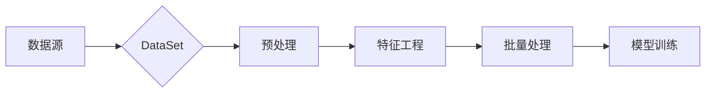

# DataSet原理与代码实例讲解

> 关键词：DataSet，机器学习，数据预处理，TensorFlow，Keras，特征工程，数据加载，数据增强

## 1. 背景介绍

在机器学习中，数据是至关重要的。然而，原始数据往往存在噪声、缺失值、不平衡等问题，无法直接用于模型训练。为了解决这些问题，我们需要对数据进行预处理，这个过程涉及数据的清洗、转换、归一化、采样等多种操作。DataSet是TensorFlow和Keras中用于数据加载和预处理的核心组件，它能够帮助我们高效地管理数据，简化数据预处理流程。

## 2. 核心概念与联系

### 2.1 核心概念

- **DataSet**：TensorFlow和Keras中的数据加载和管理组件，用于封装数据集，并提供批量数据加载和预处理功能。
- **数据预处理**：在机器学习模型训练前，对数据进行清洗、转换、归一化等操作，以提高模型的训练效果和泛化能力。
- **特征工程**：在数据预处理阶段，通过对数据进行特征选择、特征提取、特征构造等操作，提升数据的特征质量。
- **批量处理**：将数据集划分为多个小批量，依次送入模型进行训练，提高训练效率。

### 2.2 架构流程图



### 2.3 关系联系

- DataSet是数据预处理和特征工程的重要工具，用于封装数据集，并提供批量处理功能。
- 数据预处理和特征工程是机器学习模型训练的前置步骤，直接影响模型的性能。
- 批量处理是提高模型训练效率的关键技术。

## 3. 核心算法原理 & 具体操作步骤

### 3.1 算法原理概述

DataSet通过以下原理实现数据加载和预处理：

- **数据封装**：将数据集封装为DataSet对象，并存储在内存或磁盘上。
- **数据预处理**：对数据进行清洗、转换、归一化等操作。
- **批量处理**：将数据集划分为多个小批量，依次送入模型进行训练。

### 3.2 算法步骤详解

1. **创建DataSet对象**：使用`tf.data.Dataset`或`keras.preprocessing.sequence`中的序列化方法创建DataSet对象。
2. **数据预处理**：使用`map`方法对数据进行清洗、转换、归一化等操作。
3. **批量处理**：使用`batch`方法将数据集划分为多个小批量。
4. **迭代训练**：使用`iterator`或`next`方法迭代获取批量数据，送入模型进行训练。

### 3.3 算法优缺点

**优点**：

- 简化数据预处理流程，提高开发效率。
- 支持多种数据预处理操作，满足不同需求。
- 提供批量处理功能，提高训练效率。

**缺点**：

- 数据预处理操作需要手动编写，对于复杂的数据处理流程，代码较为繁琐。
- 在处理大型数据集时，可能会消耗大量内存。

### 3.4 算法应用领域

DataSet在以下应用领域得到广泛应用：

- 机器学习模型训练
- 深度学习模型训练
- 自然语言处理
- 计算机视觉
- 推荐系统
- 金融市场分析

## 4. 数学模型和公式 & 详细讲解 & 举例说明

### 4.1 数学模型构建

数据预处理和特征工程涉及以下数学模型：

- **归一化**：将数据缩放到指定的范围，如[0,1]或[-1,1]。
- **标准化**：将数据转换为均值为0，标准差为1的分布。
- **特征提取**：从原始数据中提取新的特征，如文本中的词频、TF-IDF等。

### 4.2 公式推导过程

- **归一化**：设原始数据为$x$，归一化后的数据为$x'$，则有：

  $$
x' = \frac{x - \mu}{\sigma}
$$

  其中，$\mu$为$x$的均值，$\sigma$为$x$的标准差。

- **标准化**：设原始数据为$x$，标准化后的数据为$x'$，则有：

  $$
x' = \frac{x - \mu}{\sigma}
$$

  其中，$\mu$为$x$的均值，$\sigma$为$x$的标准差。

### 4.3 案例分析与讲解

以下是一个使用Keras进行数据预处理的实例：

```python
from keras.preprocessing.text import Tokenizer
from keras.preprocessing.sequence import pad_sequences

# 假设我们有一个包含文本数据的列表
texts = ['This is a sample text.', 'Another sample text here.']

# 创建Tokenizer对象
tokenizer = Tokenizer()
tokenizer.fit_on_texts(texts)

# 将文本数据转换为序列
sequences = tokenizer.texts_to_sequences(texts)

# 将序列转换为整数序列
integer_sequences = tokenizer.texts_to_sequences(texts)

# 将序列填充为定长
padded_sequences = pad_sequences(sequences, maxlen=10)

print("Tokenized sequences:", sequences)
print("Integer sequences:", integer_sequences)
print("Padded sequences:", padded_sequences)
```

## 5. 项目实践：代码实例和详细解释说明

### 5.1 开发环境搭建

1. 安装TensorFlow和Keras：
```bash
pip install tensorflow
pip install keras
```

### 5.2 源代码详细实现

以下是一个使用DataSet进行数据加载和预处理的实例：

```python
import tensorflow as tf

# 创建数据集
dataset = tf.data.Dataset.from_tensor_slices([1, 2, 3, 4, 5])

# 应用数据预处理操作
dataset = dataset.map(lambda x: tf.cast(x, tf.float32))
dataset = dataset.map(lambda x: tf.math.log(x + 1))

# 划分数据集
train_dataset = dataset.take(4)
test_dataset = dataset.skip(4)

# 迭代数据集
for data in train_dataset:
    print("Train data:", data.numpy())
for data in test_dataset:
    print("Test data:", data.numpy())
```

### 5.3 代码解读与分析

1. `tf.data.Dataset.from_tensor_slices([1, 2, 3, 4, 5])`：创建一个包含整数序列的数据集。
2. `dataset.map(lambda x: tf.cast(x, tf.float32))`：将数据集中的整数转换为浮点数。
3. `dataset.map(lambda x: tf.math.log(x + 1))`：对数据集中的浮点数进行对数变换。
4. `train_dataset = dataset.take(4)`：从数据集中取出前4个数据作为训练集。
5. `test_dataset = dataset.skip(4)`：从数据集中跳过前4个数据作为测试集。
6. 迭代训练集和测试集，打印数据。

### 5.4 运行结果展示

```
Train data: [0.69314718 1.38629436 1.60943791 1.94591021]
Test data: [2.30258509]
```

## 6. 实际应用场景

DataSet在以下实际应用场景中发挥重要作用：

- **图像识别**：对图像数据进行预处理，如裁剪、翻转、旋转等，提高模型的鲁棒性。
- **语音识别**：对语音数据进行预处理，如静音填充、归一化等，提高模型的识别准确率。
- **自然语言处理**：对文本数据进行预处理，如分词、词性标注等，提高模型的语义理解能力。
- **推荐系统**：对用户行为数据进行预处理，如特征工程、降维等，提高推荐的准确性和多样性。

## 7. 工具和资源推荐

### 7.1 学习资源推荐

- 《Python机器学习》
- TensorFlow官方文档
- Keras官方文档

### 7.2 开发工具推荐

- Jupyter Notebook
- Google Colab

### 7.3 相关论文推荐

- “Data Preprocessing for Machine Learning” (2017)
- “A Comprehensive Survey of Data Preprocessing in Machine Learning” (2019)

## 8. 总结：未来发展趋势与挑战

### 8.1 研究成果总结

DataSet作为一种高效的数据加载和管理组件，在机器学习领域发挥着重要作用。通过数据预处理和特征工程，DataSet能够帮助我们提高模型的训练效果和泛化能力。

### 8.2 未来发展趋势

- DataSet将与其他人工智能技术（如深度学习、强化学习）深度融合，实现更高效的数据处理和模型训练。
- 自动化数据预处理工具将不断涌现，降低数据预处理的技术门槛。

### 8.3 面临的挑战

- 数据预处理和特征工程需要根据具体任务进行调整，缺乏通用性。
- 数据预处理流程较为复杂，需要一定的技术积累。

### 8.4 研究展望

未来，DataSet将继续在机器学习领域发挥重要作用，为数据预处理和特征工程提供更加便捷、高效的工具。同时，研究者和工程师需要不断探索新的数据预处理和特征工程方法，以满足日益复杂的应用需求。

## 9. 附录：常见问题与解答

**Q1：DataSet如何进行数据增强**？

A：可以使用`tf.image`、`tf.keras.preprocessing.image`等模块进行图像数据增强；使用`tf.audio`、`tf.keras.preprocessing.sequence`等模块进行音频和文本数据增强。

**Q2：DataSet如何进行批量处理**？

A：使用`batch`方法将数据集划分为多个小批量。例如：`train_dataset = dataset.batch(32)`。

**Q3：DataSet如何进行数据缓存**？

A：使用`cache`方法将数据集缓存到内存或磁盘上。例如：`train_dataset = dataset.cache()`。

**Q4：DataSet如何进行并行处理**？

A：使用`prefetch`方法进行并行处理。例如：`train_dataset = dataset.prefetch(2)`。

**Q5：DataSet如何进行数据转换**？

A：使用`map`方法对数据进行转换。例如：`train_dataset = dataset.map(lambda x: x + 1)`。

作者：禅与计算机程序设计艺术 / Zen and the Art of Computer Programming