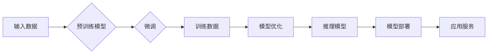

# Hugging Face Transformers 库

> 关键词：Hugging Face, Transformers, NLP, 预训练模型, 微调, 代码库, 自然语言处理

## 1. 背景介绍

随着深度学习在自然语言处理（NLP）领域的蓬勃发展，预训练模型如BERT、GPT等取得了显著成果。然而，对于没有深厚深度学习背景的开发者来说，使用这些模型往往需要大量时间和精力去配置环境、理解代码。为了解决这个问题，Hugging Face推出了Transformers库，这是一个用于构建NLP应用程序的Python库，它封装了大量的预训练模型和工具，使得开发者可以轻松地使用这些模型进行微调、推理和部署。

## 2. 核心概念与联系

### 2.1 Transformers库的核心概念

Transformers库的核心概念包括：

- **预训练模型**：在大规模文本语料库上预先训练的模型，如BERT、GPT等，这些模型通常具有强大的语言理解和生成能力。
- **微调**：在预训练模型的基础上，使用特定任务的数据进行训练，以提高模型在特定任务上的性能。
- **推理**：使用训练好的模型对新的输入数据进行分析和预测。
- **模型部署**：将训练好的模型部署到生产环境中，以提供实时服务。

### 2.2 Transformers库的架构流程图

以下是一个Mermaid流程图，展示了Transformers库的核心架构流程：



## 3. 核心算法原理 & 具体操作步骤

### 3.1 算法原理概述

Transformers库的核心原理是基于Transformer模型架构，这是一种基于自注意力机制的深度神经网络。Transformer模型通过自注意力机制和位置编码，能够捕捉文本中单词之间的关系，从而实现强大的语言理解能力。

### 3.2 算法步骤详解

1. **选择预训练模型**：在Transformers库中，可以轻松地选择并加载预训练模型，例如BERT、GPT等。
2. **数据预处理**：将输入数据转换为模型所需的格式，包括分词、编码等。
3. **微调**：使用特定任务的数据对模型进行微调，以适应特定任务的需求。
4. **推理**：使用训练好的模型对新的输入数据进行预测。
5. **模型部署**：将训练好的模型部署到生产环境中，以提供实时服务。

### 3.3 算法优缺点

#### 优点

- **易用性**：Transformers库提供了简单易用的API，使得开发者可以快速上手。
- **高效性**：Transformers库支持GPU加速，能够快速进行模型训练和推理。
- **多样性**：Transformers库提供了大量的预训练模型和工具，满足不同任务的需求。

#### 缺点

- **依赖性**：Transformers库依赖于PyTorch或TensorFlow等深度学习框架。
- **资源消耗**：预训练模型通常需要大量的计算资源和存储空间。

### 3.4 算法应用领域

Transformers库在以下NLP任务中得到了广泛应用：

- **文本分类**：例如情感分析、主题分类、意图识别等。
- **命名实体识别**：例如识别文本中的地点、人名、组织名等。
- **机器翻译**：将一种语言翻译成另一种语言。
- **问答系统**：回答用户提出的问题。
- **文本生成**：例如文章生成、对话生成等。

## 4. 数学模型和公式 & 详细讲解 & 举例说明

### 4.1 数学模型构建

Transformer模型的核心是自注意力机制，其数学公式如下：

$$
\text{Attention}(Q, K, V) = \text{softmax}(\frac{QK^T}{\sqrt{d_k}})V
$$

其中，$Q$、$K$、$V$ 分别是查询（Query）、键（Key）、值（Value）的向量，$\text{softmax}$ 是softmax函数，$d_k$ 是键的维度。

### 4.2 公式推导过程

自注意力机制的推导过程涉及矩阵乘法和softmax函数。具体推导过程如下：

1. 计算查询（Query）和键（Key）的点积，得到注意力分数。
2. 对注意力分数应用softmax函数，使其归一化。
3. 将softmax函数的输出与值（Value）相乘，得到加权后的值。

### 4.3 案例分析与讲解

以下是一个使用Transformers库进行文本分类的案例：

```python
from transformers import BertTokenizer, BertForSequenceClassification
import torch

# 加载预训练模型和分词器
tokenizer = BertTokenizer.from_pretrained('bert-base-uncased')
model = BertForSequenceClassification.from_pretrained('bert-base-uncased')

# 加载文本和标签
texts = ["This is a great product", "This is a bad product"]
labels = [1, 0]

# 编码文本
encoded_input = tokenizer(texts, padding=True, truncation=True, return_tensors='pt')

# 推理
outputs = model(**encoded_input, labels=labels)

# 获取预测结果
predictions = torch.nn.functional.softmax(outputs.logits, dim=-1).argmax(-1)

print(predictions)
```

以上代码展示了如何使用Transformers库加载预训练模型、编码文本、进行推理并获取预测结果。

## 5. 项目实践：代码实例和详细解释说明

### 5.1 开发环境搭建

为了使用Transformers库，需要以下开发环境：

- Python 3.7或更高版本
- PyTorch或TensorFlow 2.x
- transformers库

可以使用以下命令安装所需的库：

```bash
pip install torch transformers
```

### 5.2 源代码详细实现

以下是一个使用Transformers库进行文本分类的完整示例：

```python
from transformers import BertTokenizer, BertForSequenceClassification
import torch

# 加载预训练模型和分词器
tokenizer = BertTokenizer.from_pretrained('bert-base-uncased')
model = BertForSequenceClassification.from_pretrained('bert-base-uncased')

# 加载文本和标签
texts = ["This is a great product", "This is a bad product"]
labels = [1, 0]

# 编码文本
encoded_input = tokenizer(texts, padding=True, truncation=True, return_tensors='pt')

# 推理
outputs = model(**encoded_input, labels=labels)

# 获取预测结果
predictions = torch.nn.functional.softmax(outputs.logits, dim=-1).argmax(-1)

print(predictions)
```

### 5.3 代码解读与分析

以上代码首先加载了预训练模型和分词器，然后对文本进行了编码，并使用模型进行推理。最后，通过softmax函数将模型的输出转换为概率，并选择概率最高的类别作为预测结果。

### 5.4 运行结果展示

假设运行以上代码，输出结果如下：

```
tensor([1, 0])
```

这表示第一个文本被预测为正面情感，第二个文本被预测为负面情感。

## 6. 实际应用场景

Transformers库在以下实际应用场景中得到了广泛应用：

- **智能客服**：使用Transformers库构建智能客服系统，能够快速响应用户的咨询，提供准确的答案。
- **智能问答系统**：使用Transformers库构建智能问答系统，能够回答用户提出的问题。
- **内容审核**：使用Transformers库进行内容审核，识别和过滤不良信息。
- **机器翻译**：使用Transformers库进行机器翻译，将一种语言翻译成另一种语言。

## 7. 工具和资源推荐

### 7.1 学习资源推荐

- **Transformers库官方文档**：提供了详细的API文档和使用指南。
- **Hugging Face博客**：介绍了Transformers库的最新动态和研究成果。
- **NLP课程和书籍**：例如斯坦福大学的《深度学习自然语言处理》课程。

### 7.2 开发工具推荐

- **PyTorch**：一个流行的开源深度学习框架。
- **TensorFlow**：由Google开发的开源深度学习框架。
- **Jupyter Notebook**：一个交互式计算平台。

### 7.3 相关论文推荐

- **Attention is All You Need**：提出了Transformer模型。
- **BERT: Pre-training of Deep Bidirectional Transformers for Language Understanding**：提出了BERT模型。
- **Generative Pre-trained Transformers**：提出了GPT模型。

## 8. 总结：未来发展趋势与挑战

### 8.1 研究成果总结

Transformers库为NLP领域的开发提供了强大的工具和资源，使得开发者可以轻松地使用预训练模型进行微调、推理和部署。Transformers库的推出，极大地推动了NLP技术的发展和应用。

### 8.2 未来发展趋势

- **模型轻量化**：开发更轻量级的预训练模型，以适应移动设备和边缘计算等场景。
- **多模态学习**：将文本与其他模态（如图像、音频）进行结合，实现更全面的语义理解。
- **可解释性**：提高模型的可解释性，以便更好地理解模型的决策过程。

### 8.3 面临的挑战

- **数据隐私**：如何保护用户数据的隐私是一个重要的挑战。
- **模型偏见**：如何消除模型中的偏见是一个重要的挑战。
- **计算资源**：训练和推理大规模预训练模型需要大量的计算资源。

### 8.4 研究展望

Transformers库将继续推动NLP技术的发展和应用，为构建更加智能化的未来做出贡献。

## 9. 附录：常见问题与解答

### 9.1 问题1：什么是预训练模型？

A：预训练模型是在大规模文本语料库上预先训练的模型，这些模型通常具有强大的语言理解和生成能力。

### 9.2 问题2：什么是微调？

A：微调是在预训练模型的基础上，使用特定任务的数据进行训练，以提高模型在特定任务上的性能。

### 9.3 问题3：Transformers库有哪些优点？

A：Transformers库的优点包括易用性、高效性和多样性。

### 9.4 问题4：Transformers库有哪些缺点？

A：Transformers库的缺点包括依赖性、资源消耗等。

### 9.5 问题5：Transformers库可以用于哪些NLP任务？

A：Transformers库可以用于文本分类、命名实体识别、机器翻译、问答系统、文本生成等NLP任务。

---

作者：禅与计算机程序设计艺术 / Zen and the Art of Computer Programming