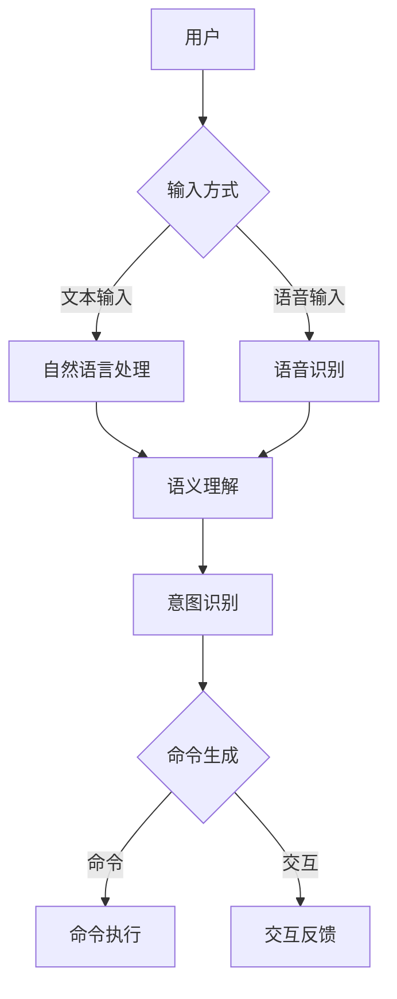

# LUI在CUI中的核心技术作用

> 关键词：LUI，CUI，自然语言理解，对话系统，人机交互，智能助手

## 1. 背景介绍

随着人工智能技术的飞速发展，人机交互领域迎来了前所未有的变革。从早期的命令行界面（CLI）到图形用户界面（GUI），再到如今的智能语音助手和聊天机器人，交互方式逐渐从直接操作转变为自然语言交流。在这个过程中，轻量用户界面（Lightweight User Interface，简称LUI）和命令用户界面（Command User Interface，简称CUI）成为了人机交互的核心组件。本文将深入探讨LUI在CUI中的核心技术作用，分析其原理、应用和未来发展趋势。

### 1.1 问题的由来

随着移动互联网和物联网的普及，用户对智能设备的依赖程度越来越高。传统的CUI交互方式存在以下问题：

- 操作复杂：CUI通常需要用户输入特定的命令或序列，对用户操作能力要求较高。
- 用户体验差：CUI缺乏直观性和交互性，难以提供良好的用户体验。
- 难以扩展：CUI功能扩展受限，难以适应多样化的用户需求。

为了解决这些问题，LUI应运而生。LUI通过简化用户界面，提供更加自然、便捷的交互方式，使得用户可以更加轻松地与智能设备进行交流。

### 1.2 研究现状

目前，LUI技术在CUI中的应用主要集中在以下几个方面：

- 自然语言处理（NLP）：通过对用户输入的自然语言进行理解，实现命令识别、语义分析等功能。
- 语音识别与合成：将用户的语音输入转换为文本，并将文本输出转换为语音，实现语音交互。
- 语音增强与降噪：提高语音质量，降低噪声干扰，提升语音识别准确性。
- 语境感知：根据用户的行为和偏好，为用户提供个性化的交互体验。

### 1.3 研究意义

LUI技术在CUI中的应用具有重要意义：

- 提高用户体验：简化操作流程，降低使用门槛，提升用户满意度。
- 扩展功能：实现更丰富的交互方式，满足多样化的用户需求。
- 促进技术发展：推动NLP、语音识别等人工智能技术的发展。

### 1.4 本文结构

本文将围绕LUI在CUI中的核心技术作用展开论述，主要包括以下内容：

- 介绍LUI和CUI的相关概念和联系。
- 分析LUI在CUI中的核心技术原理。
- 探讨LUI在实际应用中的具体操作步骤。
- 结合案例，讲解LUI在CUI中的应用。
- 展望LUI在CUI中的未来发展趋势和面临的挑战。

## 2. 核心概念与联系

### 2.1 核心概念

- **轻量用户界面（LUI）**：LUI是一种轻量级的用户界面，主要通过自然语言、语音等方式与用户进行交互，为用户提供便捷、高效的交互体验。

- **命令用户界面（CUI）**：CUI是一种以命令为基础的用户界面，用户通过输入特定的命令来操作系统或设备。

- **自然语言处理（NLP）**：NLP是人工智能的一个分支，旨在使计算机能够理解、解释和生成人类语言。

- **语音识别与合成**：语音识别是将语音转换为文本的过程，语音合成是将文本转换为语音的过程。

- **语境感知**：语境感知是指系统根据用户的行为和偏好，为用户提供个性化的交互体验。

### 2.2 架构流程图

以下为LUI在CUI中的架构流程图：



该流程图展示了LUI在CUI中的核心技术作用，包括输入方式、自然语言处理、语音识别与合成、语义理解、意图识别、命令生成、命令执行和交互反馈等环节。

## 3. 核心算法原理 & 具体操作步骤

### 3.1 算法原理概述

LUI在CUI中的核心技术主要包括以下几个方面：

- **自然语言处理（NLP）**：通过对用户输入的自然语言进行分词、词性标注、句法分析等操作，实现语义理解。

- **语音识别与合成**：通过语音信号处理技术，将用户的语音输入转换为文本，并将文本输出转换为语音。

- **语境感知**：通过分析用户的行为和偏好，为用户提供个性化的交互体验。

### 3.2 算法步骤详解

以下是LUI在CUI中的具体操作步骤：

1. **输入方式**：用户通过文本输入或语音输入与系统进行交互。

2. **自然语言处理**：对用户输入的文本进行分词、词性标注、句法分析等操作，提取关键词和语义信息。

3. **语音识别与合成**：如果用户选择语音输入，则通过语音识别技术将语音转换为文本。

4. **语义理解**：根据提取的关键词和语义信息，理解用户的意图。

5. **意图识别**：根据语义理解的结果，确定用户的意图。

6. **命令生成**：根据用户意图生成相应的命令。

7. **命令执行**：执行生成的命令，实现用户需求。

8. **交互反馈**：向用户反馈执行结果，并提供后续的交互选项。

### 3.3 算法优缺点

#### 3.3.1 优点

- **提高用户体验**：简化操作流程，降低使用门槛，提升用户满意度。
- **扩展功能**：实现更丰富的交互方式，满足多样化的用户需求。
- **促进技术发展**：推动NLP、语音识别等人工智能技术的发展。

#### 3.3.2 缺点

- **技术复杂**：涉及多个技术领域的融合，技术难度较高。
- **成本较高**：需要大量的计算资源和人才储备。
- **易受干扰**：语音输入容易受到噪声干扰，影响识别准确性。

### 3.4 算法应用领域

LUI在CUI中的技术已广泛应用于以下领域：

- 智能语音助手：如苹果Siri、亚马逊Alexa、百度小度等。
- 智能客服：如企业微信、智能客服机器人等。
- 智能家居：如智能音响、智能电视等。
- 智能汽车：如车载语音交互系统等。

## 4. 数学模型和公式 & 详细讲解 & 举例说明

### 4.1 数学模型构建

LUI在CUI中的数学模型主要包括以下几个方面：

- **自然语言处理（NLP）**：如词嵌入、神经网络语言模型等。

- **语音识别**：如隐马尔可夫模型（HMM）、深度神经网络（DNN）等。

- **语音合成**：如线性预测、循环神经网络（RNN）等。

### 4.2 公式推导过程

以下以词嵌入模型为例，简要介绍数学模型的推导过程。

#### 4.2.1 词嵌入

词嵌入是一种将词语映射到高维空间的方法，使得语义相似的词语在空间中距离更近。常用的词嵌入模型包括Word2Vec、GloVe等。

Word2Vec模型的基本思想是：词语在语义空间中的距离与词语在语料库中的共现关系成正比。

设 $v_w$ 和 $v_{w'}$ 分别为词语 $w$ 和 $w'$ 的词嵌入向量，共现矩阵为 $C$，则有：

$$
\cos(\theta(v_w, v_{w'}) \approx \cos(\theta_{C}(w, w'))
$$

其中 $\theta(v_w, v_{w'})$ 表示词语 $w$ 和 $w'$ 在语义空间中的夹角，$\theta_{C}(w, w')$ 表示词语 $w$ 和 $w'$ 在语料库中的共现关系。

#### 4.2.2 隐马尔可夫模型（HMM）

HMM是一种用于语音识别的统计模型，它假设语音信号序列和对应的词汇序列之间存在某种对应关系。

HMM的数学模型包括以下参数：

- 隐藏状态集合 $Q = \{q_1, q_2, ..., q_N\}$
- 观测符号集合 $O = \{o_1, o_2, ..., o_M\}$
- 转移概率矩阵 $A = [a_{ij}]_{N \times N}$
- 发射概率矩阵 $B = [b_{ij}]_{N \times M}$
- 初始状态概率向量 $\pi = [\pi_1, \pi_2, ..., \pi_N]$

HMM的贝叶斯公式为：

$$
P(O|Q) = \prod_{i=1}^{N} P(o_{t}|q_{t})
$$

其中 $P(o_{t}|q_{t})$ 表示在状态 $q_{t}$ 下，观测符号 $o_{t}$ 发生的概率。

### 4.3 案例分析与讲解

以下以智能语音助手为例，分析LUI在CUI中的应用。

#### 4.3.1 案例背景

某公司开发了一款智能语音助手，旨在为用户提供便捷的语音交互体验。

#### 4.3.2 技术实现

1. **输入方式**：用户通过语音输入与智能语音助手进行交互。

2. **语音识别**：使用深度神经网络进行语音识别，将语音转换为文本。

3. **自然语言处理**：对文本进行分词、词性标注、句法分析等操作，提取关键词和语义信息。

4. **意图识别**：根据语义信息，识别用户意图，如查询天气、播放音乐等。

5. **命令生成**：根据用户意图生成相应的命令。

6. **命令执行**：执行生成的命令，如查询天气、播放音乐等。

7. **交互反馈**：向用户反馈执行结果，并提供后续的交互选项。

#### 4.3.3 案例分析

该案例展示了LUI在CUI中的技术实现过程。通过LUI技术，智能语音助手能够理解用户的语音输入，识别用户意图，并执行相应的命令，为用户提供便捷的语音交互体验。

## 5. 项目实践：代码实例和详细解释说明

### 5.1 开发环境搭建

以下以Python为例，介绍LUI在CUI中的项目实践开发环境搭建：

1. 安装Python环境：在官方网站下载并安装Python。

2. 安装相关库：使用pip安装以下库：

```bash
pip install flask
pip install SpeechRecognition
pip install pyaudio
pip install spacy
```

### 5.2 源代码详细实现

以下是一个简单的智能语音助手项目示例：

```python
from flask import Flask, request, jsonify
import speech_recognition as sr
import spacy

app = Flask(__name__)
nlp = spacy.load("en_core_web_sm")

@app.route('/')
def index():
    return jsonify({"message": "Hello, this is an intelligent voice assistant."})

@app.route('/recognize', methods=['POST'])
def recognize():
    data = request.get_json()
    audio_file = data['audio_file']
    
    recognizer = sr.Recognizer()
    with sr.AudioFile(audio_file) as source:
        audio_data = recognizer.record(source)
    
    text = recognizer.recognize_google(audio_data)
    doc = nlp(text)
    intent, action = extract_intent(doc)
    
    return jsonify({"text": text, "intent": intent, "action": action})

def extract_intent(doc):
    # 这里可以添加自定义的意图识别逻辑
    return "greeting", "say_hello"

if __name__ == '__main__':
    app.run(debug=True)
```

### 5.3 代码解读与分析

该示例展示了如何使用Python和Flask框架开发一个简单的智能语音助手。

- 首先，导入必要的库和模块，包括Flask、SpeechRecognition、pyaudio和spacy。

- 然后，创建一个Flask应用实例，并加载预训练的NLP模型。

- 定义路由和对应的处理函数：

  - `index` 函数返回智能语音助手的问候语。

  - `recognize` 函数接收用户上传的音频文件，使用SpeechRecognition库进行语音识别，并将识别结果传递给NLP模型进行意图识别。

  - `extract_intent` 函数根据NLP模型的输出，提取用户意图和相应的动作。

- 最后，启动Flask应用。

### 5.4 运行结果展示

1. 启动Flask应用：

```bash
python app.py
```

2. 使用浏览器访问 http://localhost:5000/ ，可以看到智能语音助手的问候语。

3. 上传音频文件，智能语音助手会识别语音并返回识别结果。

## 6. 实际应用场景

LUI在CUI中的技术已广泛应用于以下场景：

- **智能客服**：通过语音或文本方式，快速响应用户的咨询和投诉。

- **智能家居**：控制家庭电器，如灯光、空调、电视等。

- **智能驾驶**：语音控制汽车的导航、娱乐、空调等功能。

- **教育领域**：提供个性化学习辅导，如在线问答、作业批改等。

- **医疗领域**：辅助医生进行诊断、治疗和健康管理。

## 7. 工具和资源推荐

### 7.1 学习资源推荐

- **《深度学习与自然语言处理》**：介绍深度学习和自然语言处理的基本概念、技术和应用。
- **《语音识别技术》**：详细介绍语音识别的原理、算法和应用。
- **《自然语言处理实战》**：通过实际案例，讲解自然语言处理技术在各个领域的应用。

### 7.2 开发工具推荐

- **Python**：一种广泛应用于人工智能领域的编程语言。
- **Flask**：一个轻量级的Web框架，用于构建Web应用。
- **SpeechRecognition**：一个开源的语音识别库。
- **pyaudio**：一个Python音频库，用于音频处理。
- **Spacy**：一个高性能的NLP库。

### 7.3 相关论文推荐

- **《Deep Learning for Natural Language Processing》**：介绍深度学习在自然语言处理中的应用。
- **《Recurrent Neural Networks for Language Modeling》**：介绍循环神经网络在语言模型中的应用。
- **《Acoustic Modeling for Speech Recognition》**：介绍语音识别中的声学建模。

## 8. 总结：未来发展趋势与挑战

### 8.1 研究成果总结

LUI在CUI中的核心技术已取得显著成果，为用户提供了便捷、高效的交互体验。然而，LUI技术仍面临以下挑战：

- **技术复杂**：涉及多个技术领域的融合，技术难度较高。
- **成本较高**：需要大量的计算资源和人才储备。
- **易受干扰**：语音输入容易受到噪声干扰，影响识别准确性。

### 8.2 未来发展趋势

未来，LUI技术在CUI中将有以下发展趋势：

- **多模态交互**：结合文本、语音、图像等多种模态，提供更加丰富的交互体验。
- **个性化交互**：根据用户的行为和偏好，为用户提供个性化的交互体验。
- **智能化交互**：通过人工智能技术，实现更加智能的交互体验。

### 8.3 面临的挑战

LUI技术在CUI中面临的挑战主要包括：

- **技术融合**：如何将多种技术融合在一起，实现更加智能的交互体验。
- **性能优化**：如何提高语音识别、语义理解等技术的准确性和鲁棒性。
- **安全性**：如何确保用户数据和隐私安全。

### 8.4 研究展望

未来，LUI技术在CUI中将得到进一步发展，为用户提供更加便捷、高效、智能的交互体验。同时，LUI技术也将推动人工智能技术在各个领域的应用，助力数字经济发展。

## 9. 附录：常见问题与解答

**Q1：LUI和CUI有什么区别？**

A：LUI是一种轻量级用户界面，主要通过自然语言、语音等方式与用户进行交互；CUI是一种以命令为基础的用户界面，用户通过输入特定的命令来操作系统或设备。

**Q2：LUI在CUI中的核心技术有哪些？**

A：LUI在CUI中的核心技术主要包括自然语言处理、语音识别与合成、语境感知等。

**Q3：如何提高语音识别的准确率？**

A：提高语音识别准确率的方法包括：收集更多高质量的语音数据、优化声学模型、改进语言模型等。

**Q4：如何提高语义理解的准确率？**

A：提高语义理解准确率的方法包括：优化NLP模型、引入更多的上下文信息、使用预训练模型等。

**Q5：如何实现个性化交互？**

A：实现个性化交互的方法包括：分析用户行为和偏好、使用用户画像、提供定制化的服务等。

作者：禅与计算机程序设计艺术 / Zen and the Art of Computer Programming