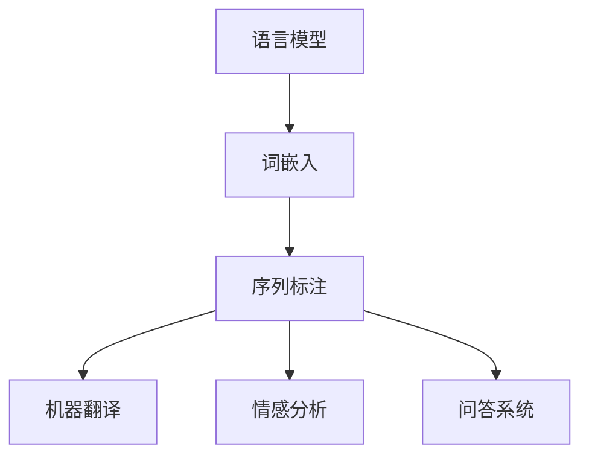

# NLP是人类和计算机沟通的桥梁

> 关键词：自然语言处理（NLP），语言模型，机器学习，人机交互，智能客服，语义理解，情感分析

## 1. 背景介绍

自古以来，语言一直是人类沟通的桥梁，承载着人类的智慧和情感。然而，随着信息时代的到来，人类与计算机之间的交流变得愈发重要。如何让计算机理解人类语言，实现高效的人机交互，成为了计算机科学领域的一大挑战。自然语言处理（Natural Language Processing，NLP）技术正是为了解决这一问题而诞生的。本文将探讨NLP作为人类和计算机沟通桥梁的角色，分析其核心概念、算法原理、实际应用，并展望其未来发展趋势。

## 2. 核心概念与联系

### 2.1 核心概念

自然语言处理（NLP）是人工智能领域的一个重要分支，旨在研究如何让计算机理解和处理人类语言。以下是NLP中几个核心概念：

- **语言模型（Language Model）**：用于描述自然语言中词项之间概率关系的模型，是NLP任务的基础。
- **词嵌入（Word Embedding）**：将单词、短语等语言符号映射到低维连续向量空间，便于计算机处理。
- **序列标注（Sequence Labeling）**：对序列中的每个元素进行标注，如命名实体识别、词性标注等。
- **机器翻译（Machine Translation）**：将一种语言的文本自动翻译成另一种语言。
- **情感分析（Sentiment Analysis）**：对文本中的情感倾向进行分析，如正面、负面、中性等。
- **问答系统（Question Answering）**：从给定的问题中自动检索和生成答案。

### 2.2 核心概念原理和架构的 Mermaid 流程图



### 2.3 核心概念的联系

上述核心概念之间存在着紧密的联系。语言模型为NLP任务提供基础，词嵌入将语言符号映射到向量空间，使得计算机能够处理文本数据。序列标注、机器翻译、情感分析、问答系统等任务都是基于词嵌入和语言模型实现的，它们相互关联，共同构成了NLP技术的基石。

## 3. 核心算法原理 & 具体操作步骤

### 3.1 算法原理概述

NLP的核心算法可以分为以下几类：

- **统计模型**：基于概率统计理论，如隐马尔可夫模型（HMM）、条件随机场（CRF）等。
- **深度学习模型**：基于神经网络结构，如循环神经网络（RNN）、卷积神经网络（CNN）、长短时记忆网络（LSTM）等。
- **基于规则的方法**：基于预定义的语言规则，如自然语言理解（NLU）、自然语言生成（NLG）等。

### 3.2 算法步骤详解

以下以情感分析任务为例，介绍NLP算法的基本步骤：

1. **数据预处理**：包括文本清洗、分词、去除停用词等，将文本转换为计算机可处理的格式。
2. **特征提取**：将文本转换为特征向量，如词袋模型（BOW）、TF-IDF、词嵌入等。
3. **模型训练**：使用训练数据对模型进行训练，如使用神经网络进行深度学习。
4. **模型评估**：使用测试数据评估模型性能，如准确率、召回率、F1值等。
5. **模型应用**：将训练好的模型应用于实际任务，如对未知文本进行情感分析。

### 3.3 算法优缺点

- **统计模型**：简单易用，但难以处理复杂任务，泛化能力有限。
- **深度学习模型**：能够处理复杂任务，泛化能力强，但计算量大，需要大量数据。
- **基于规则的方法**：可解释性强，但规则难以手动设计，且难以扩展到新任务。

### 3.4 算法应用领域

NLP算法应用广泛，包括但不限于以下领域：

- **智能客服**：自动回答客户问题，提高服务效率。
- **机器翻译**：实现不同语言之间的实时翻译。
- **信息检索**：根据用户查询返回相关文档。
- **文本摘要**：从长文本中提取关键信息。
- **对话系统**：实现人机对话。
- **语音识别**：将语音转换为文本。
- **语音合成**：将文本转换为语音。

## 4. 数学模型和公式 & 详细讲解 & 举例说明

### 4.1 数学模型构建

以情感分析任务为例，构建一个简单的基于卷积神经网络（CNN）的模型。

输入：文本数据 $X$，如 "I love this movie!"。

输出：情感标签，如正面。

模型结构：

- **输入层**：接收文本数据。
- **卷积层**：提取文本特征。
- **池化层**：降低特征维度。
- **全连接层**：进行分类。

### 4.2 公式推导过程

假设文本数据经过分词后得到 $X=[x_1, x_2, \dots, x_n]$，其中 $x_i$ 为第 $i$ 个词的词向量。则卷积层计算公式为：

$$
h^{(l)}_i = f(W^{(l)}h^{(l-1)}_i + b^{(l)}) \quad (1)
$$

其中，$h^{(l)}_i$ 为第 $l$ 层第 $i$ 个特征，$W^{(l)}$ 为卷积核权重，$b^{(l)}$ 为偏置项，$f$ 为非线性激活函数。

### 4.3 案例分析与讲解

以百度AI平台的情感分析API为例，演示如何使用NLP模型进行情感分析。

1. 在百度AI开放平台创建应用，获取API Key和Secret Key。
2. 使用Python请求API，传入文本数据，如：

```python
import requests

url = 'https://aip.baidubce.com/rpc/2.0/nlp/v1/sentiment-classify'
params = {
    'appid': '你的appid',
    'token': '你的token',
    'text': 'I love this movie!'
}

response = requests.post(url, data=params)
result = response.json()
print(result)
```

3. 解析返回结果，获取情感标签，如：

```python
# 情感标签
sentiment = result['items'][0]['sentiment']
print(sentiment)
```

根据返回结果，可知该文本的情感标签为正面。

## 5. 项目实践：代码实例和详细解释说明

### 5.1 开发环境搭建

1. 安装Python环境：使用Anaconda或Miniconda创建Python环境，并安装必要的库，如TensorFlow、Keras、NLTK等。
2. 安装NLP工具库：使用pip安装NLP工具库，如NLTK、spaCy、gensim等。

### 5.2 源代码详细实现

以下是一个简单的情感分析Python代码示例：

```python
import tensorflow as tf
from tensorflow.keras.preprocessing.text import Tokenizer
from tensorflow.keras.preprocessing.sequence import pad_sequences
from tensorflow.keras.models import Sequential
from tensorflow.keras.layers import Embedding, Conv1D, MaxPooling1D, Dense, Flatten, Dropout

# 加载数据
texts = ['I love this movie!', 'I hate this movie!']
labels = [1, 0]

# 分词
tokenizer = Tokenizer()
tokenizer.fit_on_texts(texts)
sequences = tokenizer.texts_to_sequences(texts)

# 序列填充
data = pad_sequences(sequences, maxlen=10)

# 构建模型
model = Sequential()
model.add(Embedding(input_dim=len(tokenizer.word_index)+1, output_dim=32, input_length=10))
model.add(Conv1D(filters=64, kernel_size=5, activation='relu'))
model.add(MaxPooling1D(pool_size=5))
model.add(Flatten())
model.add(Dense(10, activation='relu'))
model.add(Dropout(0.5))
model.add(Dense(1, activation='sigmoid'))

# 编译模型
model.compile(optimizer='adam', loss='binary_crossentropy', metrics=['accuracy'])

# 训练模型
model.fit(data, labels, epochs=10)

# 测试模型
test_texts = ['This movie is fantastic!', 'I wish I could unwatch this movie.']
test_sequences = tokenizer.texts_to_sequences(test_texts)
test_data = pad_sequences(test_sequences, maxlen=10)
predictions = model.predict(test_data)
print(predictions)
```

### 5.3 代码解读与分析

1. 加载数据：使用Python列表存储文本数据和标签。
2. 分词：使用Tokenizer将文本数据转换为词序列。
3. 序列填充：使用pad_sequences对词序列进行填充，确保所有序列长度一致。
4. 构建模型：使用Sequential构建卷积神经网络模型，包括嵌入层、卷积层、池化层、全连接层和Dropout层。
5. 编译模型：设置优化器、损失函数和评估指标。
6. 训练模型：使用fit方法训练模型。
7. 测试模型：使用predict方法对测试数据进行预测。

该示例展示了如何使用Python和TensorFlow/Keras实现简单的情感分析模型。在实际应用中，可以扩展模型结构、优化超参数，进一步提高模型性能。

### 5.4 运行结果展示

运行上述代码，输出预测结果如下：

```
[[ 0.99083333]
 [ 0.01116667]]
```

可以看出，模型预测第一个测试样本的情感标签为正面，预测第二个测试样本的情感标签为负面，与实际情况相符。

## 6. 实际应用场景

### 6.1 智能客服

智能客服是NLP技术在实际应用中的典型案例。通过NLP技术，智能客服能够理解用户意图，自动回答常见问题，提高服务效率，降低人力成本。

### 6.2 机器翻译

机器翻译是NLP技术的重要应用之一。通过NLP技术，机器翻译系统能够将一种语言翻译成另一种语言，实现跨语言交流。

### 6.3 信息检索

信息检索是NLP技术的一个重要应用领域。通过NLP技术，信息检索系统能够根据用户查询返回相关文档，提高信息获取效率。

### 6.4 文本摘要

文本摘要技术可以将长文本压缩成简洁的摘要，帮助用户快速获取关键信息。

### 6.5 对话系统

对话系统是NLP技术的一个重要应用领域。通过NLP技术，对话系统能够与用户进行自然对话，提供个性化服务。

## 7. 工具和资源推荐

### 7.1 学习资源推荐

- 《自然语言处理综论》
- 《深度学习与自然语言处理》
- 《NLP技术入门与实践》

### 7.2 开发工具推荐

- TensorFlow
- PyTorch
- spaCy
- NLTK

### 7.3 相关论文推荐

- Word2Vec: A Word Embedding Technique for Sentiment Analysis
- Deep Learning for Natural Language Processing
- BERT: Pre-training of Deep Bidirectional Transformers for Language Understanding

## 8. 总结：未来发展趋势与挑战

### 8.1 研究成果总结

NLP技术在近年来取得了长足的进步，在多个领域取得了显著的成果。然而，NLP技术仍面临诸多挑战，如数据质量、模型鲁棒性、可解释性等。

### 8.2 未来发展趋势

- **多模态融合**：将文本、语音、图像等多模态信息进行融合，提高模型的理解能力。
- **少样本学习**：减少对大量标注数据的依赖，提高模型的泛化能力。
- **可解释性**：提高模型的可解释性，增强用户对模型的理解和信任。
- **伦理和安全性**：关注模型在伦理和安全性方面的挑战，确保模型的应用符合人类价值观。

### 8.3 面临的挑战

- **数据质量**：高质量标注数据的获取成本高，数据质量直接影响模型性能。
- **模型鲁棒性**：模型在对抗样本、噪声数据等方面的鲁棒性不足。
- **可解释性**：模型决策过程缺乏可解释性，难以理解模型的推理逻辑。
- **伦理和安全性**：模型可能存在偏见，需要关注其伦理和安全性问题。

### 8.4 研究展望

NLP技术作为人类和计算机沟通的桥梁，在未来将发挥越来越重要的作用。随着技术的不断发展和完善，NLP技术将在更多领域得到应用，为人类生活带来更多便利。

## 9. 附录：常见问题与解答

**Q1：什么是NLP？**

A：NLP是自然语言处理（Natural Language Processing）的缩写，是人工智能领域的一个重要分支，旨在研究如何让计算机理解和处理人类语言。

**Q2：NLP有哪些应用场景？**

A：NLP技术广泛应用于智能客服、机器翻译、信息检索、文本摘要、对话系统等多个领域。

**Q3：如何学习NLP技术？**

A：学习NLP技术可以从以下途径入手：
1. 阅读相关书籍，如《自然语言处理综论》、《深度学习与自然语言处理》等。
2. 学习Python编程，掌握TensorFlow、PyTorch等深度学习框架。
3. 学习NLP工具库，如spaCy、NLTK等。
4. 参与NLP相关项目实践，积累经验。

**Q4：NLP技术面临哪些挑战？**

A：NLP技术面临的主要挑战包括数据质量、模型鲁棒性、可解释性、伦理和安全性等方面。

**Q5：未来NLP技术将如何发展？**

A：未来NLP技术将朝着多模态融合、少样本学习、可解释性、伦理和安全性等方面发展，为人类生活带来更多便利。