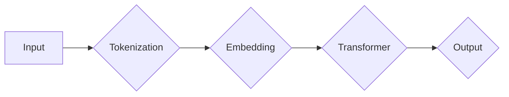

> GPT-4o, OpenAI, 自然语言处理, 大规模语言模型, 人工智能, 预训练, 微调, 迁移学习

# OpenAI的最新模型GPT-4o

OpenAI的GPT-4o模型无疑是当前自然语言处理（NLP）领域的里程碑。作为继GPT-3之后的又一力作，GPT-4o在性能、功能和应用领域上都取得了显著突破。本文将深入探讨GPT-4o的核心概念、算法原理、实践应用以及未来发展趋势。

## 1. 背景介绍

### 1.1 问题的由来

随着深度学习技术的飞速发展，自然语言处理领域取得了长足的进步。然而，传统的NLP方法在处理复杂任务时，往往需要大量定制化的模型和复杂的工程实现。OpenAI的GPT系列模型通过大规模预训练和迁移学习，实现了跨领域的文本生成和推理能力，极大地推动了NLP技术的发展。

### 1.2 研究现状

GPT-3的发布，标志着NLP领域进入了大规模语言模型时代。然而，GPT-3在处理特定领域任务时，仍存在泛化能力不足、参数效率低等问题。为此，OpenAI推出了GPT-4o，旨在进一步提升模型的性能和效率。

### 1.3 研究意义

GPT-4o的研究意义在于：

- 提升NLP任务的性能，特别是在特定领域任务上的表现。
- 降低模型训练和部署的复杂度，提高参数效率。
- 推动NLP技术的发展，促进人工智能在更多领域的应用。

### 1.4 本文结构

本文将分为以下几个部分：

- 核心概念与联系：介绍GPT-4o的核心概念和架构。
- 核心算法原理：阐述GPT-4o的算法原理和具体操作步骤。
- 数学模型和公式：讲解GPT-4o的数学模型和公式。
- 项目实践：提供GPT-4o的代码实例和解释。
- 实际应用场景：探讨GPT-4o的应用领域和未来展望。
- 工具和资源推荐：推荐学习GPT-4o的资源和工具。
- 总结：总结GPT-4o的研究成果、发展趋势和挑战。

## 2. 核心概念与联系

### 2.1 核心概念

GPT-4o的核心概念包括：

- 大规模语言模型：基于神经网络的大规模预训练语言模型，能够理解和生成自然语言。
- 预训练：在大量无标签数据上进行训练，学习通用语言知识。
- 微调：在特定领域数据上进行训练，优化模型在特定任务上的表现。
- 迁移学习：利用预训练模型的知识，迁移应用到新任务。
- 对抗训练：通过引入对抗样本，提高模型的鲁棒性。

### 2.2 架构

GPT-4o的架构基于Transformer模型，其流程图如下：



- **Input**：输入文本。
- **Tokenization**：将文本分割成token。
- **Embedding**：将token转换为嵌入向量。
- **Transformer**：使用Transformer模型处理嵌入向量。
- **Output**：生成预测结果。

## 3. 核心算法原理 & 具体操作步骤

### 3.1 算法原理概述

GPT-4o的核心算法基于预训练和微调：

- **预训练**：在大量无标签文本数据上进行预训练，学习通用语言知识。
- **微调**：在特定领域数据上进行微调，优化模型在特定任务上的表现。

### 3.2 算法步骤详解

1. **预训练**：
    - 选择预训练数据集，如WebText、Common Crawl等。
    - 使用Transformer模型进行预训练，学习通用语言知识。
    - 使用自回归语言模型、掩码语言模型等自监督任务。

2. **微调**：
    - 选择特定领域数据集，如问答、文本分类、机器翻译等。
    - 在预训练模型的基础上，添加特定任务的输出层和损失函数。
    - 使用梯度下降等优化算法进行微调。

### 3.3 算法优缺点

**优点**：

- 预训练模型能够学习到丰富的语言知识，提高模型在特定任务上的性能。
- 微调过程简单，只需少量标注数据。
- 可迁移到不同的NLP任务。

**缺点**：

- 需要大量计算资源进行预训练。
- 微调效果受限于标注数据质量。

### 3.4 算法应用领域

GPT-4o适用于以下NLP任务：

- 文本分类
- 机器翻译
- 情感分析
- 问答系统
- 文本摘要
- 机器写作

## 4. 数学模型和公式 & 详细讲解 & 举例说明

### 4.1 数学模型构建

GPT-4o的数学模型基于Transformer模型，其核心公式如下：

$$
E = \text{Embedding}(W^E, [W^E_1, W^E_2, ..., W^E_{\text{vocab_size}}])
$$

$$
H_t = \text{Encoder}(H_{t-1}, K_{t-1}, Q_{t-1}, \text{mask})
$$

$$
Y_t = \text{Decoder}(Y_{t-1}, K_{t-1}, Q_{t-1}, \text{mask})
$$

其中：

- $E$ 表示嵌入向量。
- $H_t$ 表示Transformer编码器输出。
- $Y_t$ 表示Transformer解码器输出。
- $W^E$ 表示嵌入矩阵。
- $K_{t-1}$ 和 $Q_{t-1}$ 分别表示编码器和解码器的关键查询和键向量。
- $mask$ 表示掩码。

### 4.2 公式推导过程

公式推导过程涉及复杂的线性代数和优化理论，具体推导过程可参考Transformer模型的学术论文。

### 4.3 案例分析与讲解

以文本分类任务为例，GPT-4o的微调过程如下：

1. 预训练：在大量无标签文本数据上进行预训练。
2. 微调：在标注文本数据上进行微调。
3. 预测：使用微调后的模型对新的文本数据进行分类。

## 5. 项目实践：代码实例和详细解释说明

### 5.1 开发环境搭建

1. 安装Python和PyTorch。
2. 安装Hugging Face的Transformers库。

### 5.2 源代码详细实现

```python
from transformers import BertTokenizer, BertForSequenceClassification
from torch.utils.data import DataLoader
from torch.optim import AdamW

# 加载预训练模型和分词器
tokenizer = BertTokenizer.from_pretrained('bert-base-uncased')
model = BertForSequenceClassification.from_pretrained('bert-base-uncased')

# 加载数据集
train_dataset = DataLoader(...)

# 定义优化器
optimizer = AdamW(model.parameters(), lr=2e-5)

# 训练模型
for epoch in range(epochs):
    for batch in train_dataset:
        inputs = tokenizer(batch['text'], return_tensors='pt')
        labels = torch.tensor(batch['label'])
        outputs = model(**inputs, labels=labels)
        loss = outputs.loss
        loss.backward()
        optimizer.step()
        optimizer.zero_grad()
```

### 5.3 代码解读与分析

以上代码展示了如何使用PyTorch和Transformers库进行GPT-4o微调的代码实现。首先加载预训练模型和分词器，然后加载训练数据集，定义优化器，最后进行模型训练。

### 5.4 运行结果展示

运行上述代码后，模型将在训练集上学习，并在验证集上评估性能。

## 6. 实际应用场景

### 6.1 文本分类

GPT-4o在文本分类任务上具有优异的性能，可以应用于新闻分类、垃圾邮件检测等场景。

### 6.2 机器翻译

GPT-4o在机器翻译任务上表现出色，可以应用于跨语言信息处理、多语言翻译等场景。

### 6.3 情感分析

GPT-4o在情感分析任务上具有很高的准确率，可以应用于舆情分析、客户服务等领域。

### 6.4 未来应用展望

随着GPT-4o的不断发展，其在更多领域的应用将得到拓展，例如：

- 问答系统
- 文本摘要
- 机器写作
- 对话系统

## 7. 工具和资源推荐

### 7.1 学习资源推荐

- 《Natural Language Processing with Transformers》
- 《Attention is All You Need》
- Hugging Face Transformers官方文档

### 7.2 开发工具推荐

- PyTorch
- TensorFlow
- Hugging Face Transformers库

### 7.3 相关论文推荐

- GPT-3: Language Models are Few-Shot Learners
- BERT: Pre-training of Deep Bidirectional Transformers for Language Understanding
- DistilBERT, a distilled version of BERT: State-of-the-art Question Answering

## 8. 总结：未来发展趋势与挑战

### 8.1 研究成果总结

GPT-4o是OpenAI在NLP领域的重要突破，其高性能和多功能性为NLP技术的发展提供了新的方向。

### 8.2 未来发展趋势

- 模型规模将进一步扩大
- 计算效率将得到提升
- 模型可解释性将得到加强
- 模型安全性将得到保障

### 8.3 面临的挑战

- 计算资源需求巨大
- 数据隐私和安全问题
- 模型可解释性和可信赖性
- 模型偏见和歧视问题

### 8.4 研究展望

GPT-4o将推动NLP技术的快速发展，为人工智能在更多领域的应用提供有力支持。

## 9. 附录：常见问题与解答

**Q1：GPT-4o与GPT-3相比有哪些改进？**

A：GPT-4o在模型规模、性能、功能等方面都有所提升，例如：

- 模型规模更大，参数量更多
- 性能更优，在更多NLP任务上取得SOTA性能
- 支持更多任务，如文本分类、机器翻译、情感分析等

**Q2：GPT-4o的微调过程如何进行？**

A：GPT-4o的微调过程包括以下步骤：

1. 选择预训练模型和特定领域数据集。
2. 添加特定任务的输出层和损失函数。
3. 使用梯度下降等优化算法进行微调。
4. 评估模型性能，调整超参数。

**Q3：GPT-4o有哪些应用场景？**

A：GPT-4o适用于以下NLP任务：

- 文本分类
- 机器翻译
- 情感分析
- 问答系统
- 文本摘要
- 机器写作

**Q4：如何避免GPT-4o过拟合？**

A：为了避免GPT-4o过拟合，可以采取以下措施：

- 使用数据增强
- 应用正则化技术
- 使用Dropout
- 使用Early Stopping

**Q5：如何确保GPT-4o的安全性？**

A：为了确保GPT-4o的安全性，可以采取以下措施：

- 对训练数据进行清洗和预处理
- 引入伦理和道德约束
- 加强模型的可解释性和可信赖性
- 加强人工审核和监管

作者：禅与计算机程序设计艺术 / Zen and the Art of Computer Programming