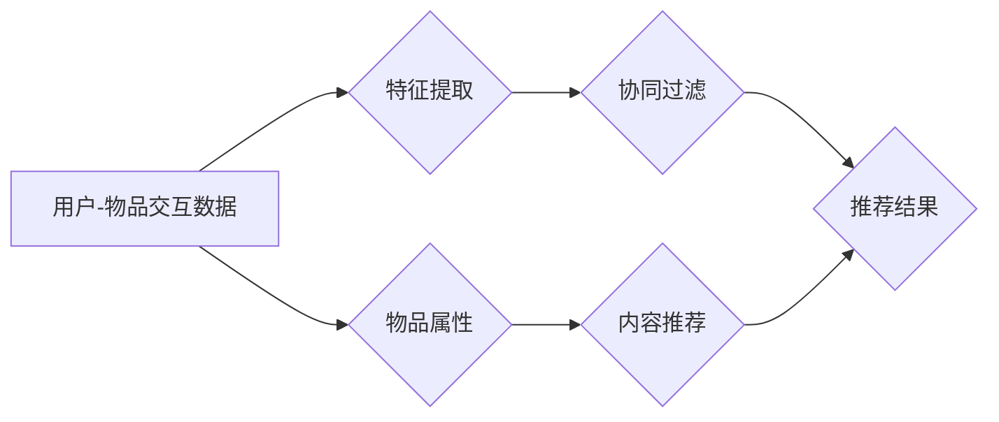

# Python深度学习实践：构建和优化推荐系统模型

> 关键词：Python, 深度学习, 推荐系统, 协同过滤, 内容推荐, 矩阵分解, 神经网络, 模型优化

## 1. 背景介绍

随着互联网的飞速发展，推荐系统已经成为我们日常生活中不可或缺的一部分。从电商平台的产品推荐，到社交媒体的好友推荐，再到音乐流媒体平台的音乐推荐，推荐系统极大地丰富了我们的信息获取和消费体验。本文将深入探讨如何使用Python和深度学习技术来构建和优化推荐系统模型。

### 1.1 问题的由来

推荐系统的主要目标是预测用户对某个物品的偏好，并据此推荐相应的物品。传统的推荐系统主要基于协同过滤和内容推荐两种方法：

- **协同过滤**：通过分析用户之间的相似度来推荐物品，常见的方法包括用户基于的协同过滤、物品基于的协同过滤和模型基于的协同过滤。
- **内容推荐**：基于物品的属性和用户的历史行为来推荐相似的物品。

然而，随着数据的增长和复杂性的提高，传统的推荐系统在处理冷启动问题、长尾效应和个性化推荐等方面逐渐显得力不从心。深度学习技术的引入，为推荐系统带来了新的突破。

### 1.2 研究现状

近年来，深度学习在推荐系统中的应用越来越广泛，主要包括以下几种方法：

- **基于深度学习的协同过滤**：利用深度神经网络提取用户和物品的深层特征，提高推荐系统的准确性。
- **基于深度学习的内容推荐**：通过深度神经网络提取物品的特征，并结合用户的行为数据进行推荐。
- **多模态推荐**：结合文本、图像、视频等多模态信息，提供更加个性化的推荐。

### 1.3 研究意义

研究基于Python和深度学习的推荐系统，对于以下方面具有重要意义：

- 提高推荐系统的准确性和个性化程度。
- 解决冷启动问题，为新用户和新物品提供有效的推荐。
- 提升用户体验，增加用户粘性和活跃度。
- 促进数据驱动的决策和个性化服务。

### 1.4 本文结构

本文将按照以下结构展开：

- 第二部分介绍推荐系统中的核心概念和联系。
- 第三部分详细介绍基于深度学习的推荐系统算法原理和具体操作步骤。
- 第四部分讲解推荐系统中常用的数学模型和公式，并结合实例进行说明。
- 第五部分通过代码实例展示如何使用Python构建和优化推荐系统模型。
- 第六部分探讨推荐系统在实际应用场景中的应用和未来发展趋势。
- 第七部分推荐相关的学习资源、开发工具和参考文献。
- 第八部分总结全文，展望未来发展趋势和挑战。
- 第九部分提供常见问题与解答。

## 2. 核心概念与联系

### 2.1 核心概念

- **用户-物品交互矩阵**：记录用户对物品的交互行为，如点击、购买、评分等。
- **特征提取**：从用户和物品中提取有用的特征，如用户的人口统计学信息、物品的属性等。
- **协同过滤**：基于用户或物品的相似度进行推荐。
- **内容推荐**：基于物品的属性进行推荐。
- **深度学习**：利用神经网络进行特征学习和预测。

### 2.2 Mermaid 流程图



### 2.3 联系

深度学习在推荐系统中的应用主要体现在以下几个方面：

- **特征提取**：利用深度神经网络从用户-物品交互数据中提取深层特征，为协同过滤和内容推荐提供更丰富的特征信息。
- **协同过滤**：结合深度学习模型，提高协同过滤的准确性和泛化能力。
- **内容推荐**：利用深度学习模型从物品的属性中提取特征，实现更精准的内容推荐。

## 3. 核心算法原理 & 具体操作步骤

### 3.1 算法原理概述

基于深度学习的推荐系统主要包括以下几种算法：

- **深度神经网络推荐**：利用深度神经网络直接对用户和物品进行建模，并预测用户对物品的偏好。
- **神经协同过滤**：结合协同过滤和深度学习，利用深度神经网络提取用户和物品的隐式特征，提高推荐系统的准确性。
- **多模态推荐**：结合文本、图像、视频等多模态信息，提供更加个性化的推荐。

### 3.2 算法步骤详解

以下是构建基于深度学习的推荐系统的基本步骤：

1. **数据收集**：收集用户-物品交互数据、用户属性和物品属性。
2. **数据预处理**：对数据进行清洗、填充、编码等预处理操作。
3. **特征提取**：利用深度神经网络从用户和物品中提取特征。
4. **模型训练**：选择合适的模型进行训练，如深度神经网络、神经协同过滤等。
5. **模型评估**：使用测试集评估模型的性能。
6. **模型优化**：根据评估结果调整模型参数，提高模型性能。
7. **模型部署**：将训练好的模型部署到生产环境中。

### 3.3 算法优缺点

- **优点**：
  - 能够提取用户和物品的深层特征，提高推荐系统的准确性和个性化程度。
  - 能够处理冷启动问题，为新用户和新物品提供有效的推荐。
  - 能够结合多种模态信息，提供更加个性化的推荐。
- **缺点**：
  - 训练过程需要大量的计算资源。
  - 模型可解释性较差，难以理解推荐结果的生成过程。

### 3.4 算法应用领域

基于深度学习的推荐系统在以下领域有广泛的应用：

- **电子商务**：推荐商品、促销活动等。
- **社交媒体**：推荐好友、话题、文章等。
- **音乐流媒体**：推荐歌曲、音乐视频等。
- **视频流媒体**：推荐电影、电视剧等。

## 4. 数学模型和公式 & 详细讲解 & 举例说明

### 4.1 数学模型构建

以下是一个简单的基于深度神经网络的推荐系统模型：

$$
y = f(W \cdot x + b)
$$

其中，$y$ 为预测的用户对物品的偏好，$x$ 为用户和物品的嵌入向量，$W$ 为权重矩阵，$b$ 为偏置项。

### 4.2 公式推导过程

- 首先，将用户和物品的特征向量进行嵌入操作，得到用户嵌入向量 $u$ 和物品嵌入向量 $i$。
- 然后，将用户嵌入向量 $u$ 和物品嵌入向量 $i$ 相乘，得到预测的用户对物品的偏好 $y$。

### 4.3 案例分析与讲解

以下是一个简单的神经协同过滤模型：

- 首先，将用户和物品的特征向量进行嵌入操作，得到用户嵌入向量 $u$ 和物品嵌入向量 $i$。
- 然后，将用户嵌入向量 $u$ 和物品嵌入向量 $i$ 相加，得到预测的用户对物品的偏好 $y$。
- 最后，使用均方误差损失函数 $L$ 来评估模型的性能：

$$
L = \frac{1}{N} \sum_{i=1}^N (y_i - f(u_i, i))^2
$$

其中，$y_i$ 为真实用户对物品 $i$ 的偏好，$f(u_i, i)$ 为预测的用户对物品 $i$ 的偏好。

## 5. 项目实践：代码实例和详细解释说明

### 5.1 开发环境搭建

为了进行推荐系统模型的开发，我们需要以下环境：

- Python 3.7+
- TensorFlow 2.x 或 PyTorch
- NumPy
- Pandas
- Scikit-learn

### 5.2 源代码详细实现

以下是一个简单的基于深度神经网络的推荐系统模型的代码实现：

```python
import tensorflow as tf
from tensorflow.keras import layers

def build_model(num_users, num_items, embedding_size):
    user_embedding = layers.Embedding(num_users, embedding_size)
    item_embedding = layers.Embedding(num_items, embedding_size)

    user_vector = user_embedding(inputs)
    item_vector = item_embedding(inputs)

    dot_product = tf.matmul(user_vector, item_vector, transpose_b=True)
    output = layers.Activation('sigmoid')(dot_product)

    model = tf.keras.Model(inputs=inputs, outputs=output)
    return model
```

### 5.3 代码解读与分析

- `user_embedding` 和 `item_embedding` 是两个嵌入层，分别用于将用户和物品的特征向量转换为嵌入向量。
- `user_vector` 和 `item_vector` 分别是用户和物品的嵌入向量。
- `dot_product` 是用户和物品嵌入向量的点积，表示用户对物品的潜在偏好。
- `output` 是使用sigmoid激活函数得到的预测的用户对物品的偏好。
- `model` 是最终构建的模型。

### 5.4 运行结果展示

运行上述代码，我们可以得到一个简单的基于深度神经网络的推荐系统模型。通过调整模型参数和训练过程，我们可以进一步提高模型的性能。

## 6. 实际应用场景

基于深度学习的推荐系统在以下场景中有广泛的应用：

- **电子商务**：推荐商品、促销活动等。
- **社交媒体**：推荐好友、话题、文章等。
- **音乐流媒体**：推荐歌曲、音乐视频等。
- **视频流媒体**：推荐电影、电视剧等。

## 7. 工具和资源推荐

### 7.1 学习资源推荐

- 《深度学习》（Goodfellow, Bengio, Courville）
- 《Python深度学习》（François Chollet）
- 《推荐系统实践》（Trevor Hastie, Robert Tibshirani, Jerome Friedman）

### 7.2 开发工具推荐

- TensorFlow
- PyTorch
- scikit-learn

### 7.3 相关论文推荐

- Collaborative Filtering via Neural Networks by Leskovec et al. (2014)
- Deep Neural Networks for YouTube Recommendations by Covington et al. (2016)
- Wide & Deep Learning for Recommender Systems by Hinton et al. (2016)

## 8. 总结：未来发展趋势与挑战

### 8.1 研究成果总结

本文介绍了基于Python和深度学习的推荐系统模型，包括其原理、方法和应用。通过构建和优化推荐系统模型，可以提高推荐系统的准确性和个性化程度，为用户提供更好的服务。

### 8.2 未来发展趋势

- **多模态推荐**：结合文本、图像、视频等多模态信息，提供更加个性化的推荐。
- **知识图谱**：利用知识图谱技术，提高推荐系统的准确性和可解释性。
- **强化学习**：利用强化学习技术，实现更加智能的推荐策略。

### 8.3 面临的挑战

- **冷启动问题**：为新用户和新物品提供有效的推荐。
- **长尾效应**：处理小众物品的推荐。
- **模型可解释性**：提高模型的可解释性，增强用户对推荐的信任。

### 8.4 研究展望

未来，基于深度学习的推荐系统将朝着更加智能化、个性化、可解释的方向发展，为用户提供更加优质的服务。

## 9. 附录：常见问题与解答

**Q1：为什么使用深度学习来构建推荐系统？**

A：深度学习能够从大量数据中提取深层特征，提高推荐系统的准确性和个性化程度。

**Q2：如何处理冷启动问题？**

A：可以使用基于内容的推荐、基于模型的推荐或混合推荐等方法来处理冷启动问题。

**Q3：如何提高推荐系统的可解释性？**

A：可以使用可解释的机器学习技术，如注意力机制、特征可视化等，来提高推荐系统的可解释性。

**Q4：如何评估推荐系统的性能？**

A：可以使用准确率、召回率、F1分数等指标来评估推荐系统的性能。

**Q5：推荐系统在哪些领域有应用？**

A：推荐系统在电子商务、社交媒体、音乐流媒体、视频流媒体等领域有广泛的应用。

作者：禅与计算机程序设计艺术 / Zen and the Art of Computer Programming