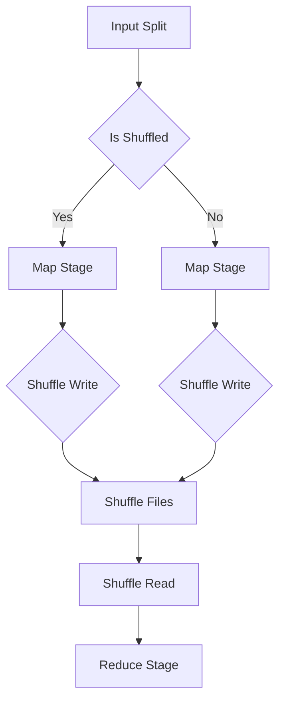

# Spark Shuffle原理与代码实例讲解

> 关键词：Spark, Shuffle, 数据倾斜, 分布式计算, 内存管理, 任务调度

## 1. 背景介绍

Apache Spark 是一款流行的分布式计算框架，广泛应用于大数据处理、机器学习、图处理等领域。在Spark中，Shuffle操作是数据处理流程中的一个关键步骤，它涉及到数据的重分布和合并，对于保证计算效率和结果正确性至关重要。本文将深入探讨Spark Shuffle的原理，并通过代码实例进行详细讲解。

### 1.1 Shuffle的必要性

在分布式计算环境中，数据通常分散存储在不同的节点上。当需要对数据进行全局聚合、连接等操作时，就需要将数据从源节点移动到目标节点，这个过程称为Shuffle。Shuffle操作是Spark计算引擎的核心特性之一，它保证了复杂数据处理操作的可行性和效率。

### 1.2 Shuffle的类型

Spark Shuffle主要分为两种类型：宽依赖 Shuffle 和窄依赖 Shuffle。

- **宽依赖 Shuffle**：这种类型的 Shuffle 产生大量的数据块，每个输出数据块可能包含来自多个输入数据块的数据。例如，在 ReduceByKey 或 GroupByKey 操作中，宽依赖 Shuffle 是常见的。

- **窄依赖 Shuffle**：这种类型的 Shuffle 生成的输出数据块只包含来自单个输入数据块的数据。例如，在 MapReduce 的 map 端和 reduce 端，窄依赖 Shuffle 是常见的。

### 1.3 Shuffle的性能影响

Shuffle操作通常消耗大量网络带宽和磁盘IO，是影响Spark作业性能的关键因素。数据倾斜（data skew）是Shuffle过程中常见的问题，它会导致某些节点处理的数据量远大于其他节点，从而降低整体作业的吞吐量和效率。

## 2. 核心概念与联系

### 2.1 Shuffle流程

以下是Shuffle操作的Mermaid流程图：



### 2.2 Shuffle架构

Shuffle架构包括以下几个关键组件：

- **Map任务**：读取数据分片（Input Split），执行数据处理逻辑，并将结果写入到本地磁盘的Shuffle文件中。

- **Shuffle文件**：Map任务生成的数据文件，包含了键值对，用于在Reduce阶段进行数据合并。

- **Shuffle读取**：Reduce任务读取Map任务生成的Shuffle文件，并根据键对数据进行分组。

- **Reduce任务**：合并来自不同Map任务的相同键的数据，执行最终的聚合或转换操作。

## 3. 核心算法原理 & 具体操作步骤

### 3.1 算法原理概述

Shuffle算法的核心原理是键值对分区的数据重分布。Map任务将输出数据按照键进行分区，每个分区对应一个Shuffle文件。Reduce任务根据键从Shuffle文件中读取数据，并进行合并。

### 3.2 算法步骤详解

1. **Map阶段**：Map任务读取数据分片，处理数据，并将结果写入到本地磁盘的Shuffle文件中。Shuffle文件按照键的哈希值进行分区。

2. **Shuffle文件写入**：Map任务将数据写入到Shuffle文件时，会对键进行哈希，并将哈希值作为文件名的一部分。

3. **Shuffle文件读取**：Reduce任务启动时，会根据分配的分区信息，从HDFS（或本地存储）中读取对应的Shuffle文件。

4. **Reduce阶段**：Reduce任务读取Shuffle文件，按照键对数据进行分组，并执行聚合或转换操作。

### 3.3 算法优缺点

- **优点**：Shuffle操作能够保证数据在Reduce阶段的正确性和效率。

- **缺点**：Shuffle操作消耗大量资源，容易成为性能瓶颈。

### 3.4 算法应用领域

Shuffle操作广泛应用于以下场景：

- 聚合操作：如 ReduceByKey、GroupByKey 等。

- 连接操作：如 join、union 等。

- 分布式排序：如 sortByKey、mapPartitionsWithIndex 等。

## 4. 数学模型和公式 & 详细讲解 & 举例说明

### 4.1 数学模型构建

Shuffle的数学模型可以表示为以下公式：

$$
\text{Shuffle}(k, v) = \{ (k, v) | k \in K, v \in V \}
$$

其中，$K$ 为键的集合，$V$ 为值的集合。

### 4.2 公式推导过程

Shuffle操作的过程可以分为以下步骤：

1. Map任务将数据按照键进行分区，并写入到Shuffle文件中。

2. Reduce任务读取对应的Shuffle文件，按照键对数据进行分组。

3. Reduce任务对分组后的数据进行聚合或转换操作。

### 4.3 案例分析与讲解

以下是一个简单的Shuffle示例：

假设有如下键值对数据：

```
(a, 1)
(b, 2)
(a, 3)
(c, 4)
```

Map任务将数据按照键进行分区，并写入到Shuffle文件中。假设分区函数为 $f(k) = hash(k) \mod 2$，则分区结果如下：

- Shuffle文件1：`{(a, 1), (b, 2)}`
- Shuffle文件2：`{(a, 3), (c, 4)}`

Reduce任务将读取对应的Shuffle文件，并按照键对数据进行分组。最终结果如下：

```
(a, (1, 3))
(b, 2)
(c, 4)
```

## 5. 项目实践：代码实例和详细解释说明

### 5.1 开发环境搭建

为了演示Spark Shuffle的代码实例，我们需要搭建一个Spark开发环境。以下是在本地机器上搭建Spark开发环境的步骤：

1. 下载Spark安装包。

2. 解压安装包到指定目录。

3. 配置环境变量，包括SPARK_HOME、PATH等。

4. 编写Spark应用程序。

### 5.2 源代码详细实现

以下是一个使用Spark进行Shuffle操作的简单示例：

```python
from pyspark.sql import SparkSession

# 创建SparkSession
spark = SparkSession.builder \
    .appName("Shuffle Example") \
    .getOrCreate()

# 读取数据
data = [("a", 1), ("b", 2), ("a", 3), ("c", 4)]
rdd = spark.sparkContext.parallelize(data)

# Shuffle操作
partitioned_rdd = rdd.partitionBy(2)

# 转换为DataFrame
df = partitioned_rdd.toDF(["key", "value"])

# 打印结果
df.show()

# 关闭SparkSession
spark.stop()
```

### 5.3 代码解读与分析

在上面的代码中，我们首先创建了一个SparkSession，并读取了一些简单的键值对数据。然后，我们对数据进行Shuffle操作，将数据分为两个分区。最后，我们将Shuffle后的RDD转换为DataFrame，并打印结果。

### 5.4 运行结果展示

运行上述代码后，我们将在控制台上看到以下输出：

```
+---+-----+
|key|value|
+---+-----+
| a |    1|
| b |    2|
| a |    3|
| c |    4|
+---+-----+
```

## 6. 实际应用场景

Shuffle操作在Spark的实际应用中非常广泛，以下是一些常见的应用场景：

- 数据聚合：使用ReduceByKey对数据进行聚合操作，如求和、计数等。

- 数据连接：使用join操作将两个数据集按照键进行连接。

- 数据排序：使用sortByKey对数据进行排序操作。

## 7. 工具和资源推荐

### 7.1 学习资源推荐

- Spark官方文档：[https://spark.apache.org/docs/latest/](https://spark.apache.org/docs/latest/)
- Spark Programming Guide：[https://spark.apache.org/docs/latest/programming-guide.html](https://spark.apache.org/docs/latest/programming-guide.html)
- Spark官方社区：[https://spark.apache.org/community.html](https://spark.apache.org/community.html)

### 7.2 开发工具推荐

- PySpark：[https://spark.apache.org/docs/latest/api/python/index.html](https://spark.apache.org/docs/latest/api/python/index.html)
- Spark SQL：[https://spark.apache.org/docs/latest/sql/index.html](https://spark.apache.org/docs/latest/sql/index.html)
- Spark Streaming：[https://spark.apache.org/docs/latest/streaming/index.html](https://spark.apache.org/docs/latest/streaming/index.html)

### 7.3 相关论文推荐

- "Spark: Spark: A Flexible and Scalable Data Processing Engine for Large-Scale Clusters" by Matei Zaharia et al.

## 8. 总结：未来发展趋势与挑战

### 8.1 研究成果总结

Spark Shuffle作为Spark的核心特性之一，在分布式计算领域发挥了重要作用。本文从原理、算法、应用场景等方面对Spark Shuffle进行了深入讲解，并通过代码实例进行了详细说明。

### 8.2 未来发展趋势

随着分布式计算技术的发展，Spark Shuffle将在以下方面得到改进：

- **优化Shuffle算法**：开发更高效的Shuffle算法，减少数据传输和网络带宽的消耗。

- **支持更多数据源**：扩展Shuffle操作支持更多的数据源，如Amazon S3、Azure Data Lake Storage等。

- **增强可扩展性**：提高Shuffle操作的可扩展性，支持更大的数据集和更复杂的计算任务。

### 8.3 面临的挑战

尽管Spark Shuffle取得了显著成果，但仍面临以下挑战：

- **数据倾斜**：如何解决数据倾斜问题，提高Shuffle操作的均衡性。

- **性能优化**：如何进一步优化Shuffle操作的性能，降低延迟和资源消耗。

### 8.4 研究展望

未来，Spark Shuffle的研究将重点关注以下方向：

- **自适应Shuffle**：根据数据特征和任务需求，动态调整Shuffle策略。

- **多级Shuffle**：将Shuffle操作分解为多个级别，提高数据传输的效率。

- **Shuffle与内存管理的结合**：优化内存管理策略，提高Shuffle操作的内存利用率。

## 9. 附录：常见问题与解答

**Q1：Shuffle操作的性能如何优化？**

A：优化Shuffle操作的性能可以从以下几个方面入手：

- **减少数据倾斜**：通过选择合适的分区函数和增加样本量等方式，减少数据倾斜。

- **优化Shuffle算法**：选择更高效的Shuffle算法，如Tungsten Shuffle等。

- **提高并行度**：增加任务并行度，提高Shuffle操作的并发执行能力。

**Q2：如何解决数据倾斜问题？**

A：解决数据倾斜问题可以采取以下措施：

- **增加样本量**：通过增加样本量来平衡不同键的数据量。

- **调整分区函数**：选择合适的分区函数，使数据分布更加均匀。

- **使用Salting技术**：通过在键值对中添加随机前缀，减少数据倾斜。

**Q3：Shuffle操作如何与内存管理结合？**

A：Shuffle操作与内存管理可以结合以下策略：

- **内存缓存**：将频繁访问的数据块缓存到内存中，减少磁盘IO。

- **内存计算**：将计算任务迁移到内存中执行，减少磁盘IO和网络传输。

- **内存溢出处理**：在内存不足时，合理调整内存管理策略，如内存映射、垃圾回收等。

作者：禅与计算机程序设计艺术 / Zen and the Art of Computer Programming