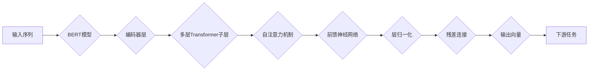

# Transformer大模型实战：从BERT 的所有编码器层中提取嵌入

> 关键词：Transformer, BERT, 编码器层, 嵌入提取, 预训练模型, 自然语言处理, NLP, 抽象表示

## 1. 背景介绍

自Transformer模型被引入自然语言处理（NLP）领域以来，其强大的序列建模能力已经推动了NLP技术的飞速发展。BERT（Bidirectional Encoder Representations from Transformers）作为基于Transformer的预训练模型，在多项NLP任务中取得了令人瞩目的成果。BERT模型通过在大量无标签文本上进行预训练，学习到了丰富的语言表示，并在下游任务中通过微调获得优异的性能。

在BERT模型中，编码器层是核心组件，负责将输入序列转换为稠密向量表示。这些向量蕴含了文本的丰富语义信息，对于下游任务至关重要。本文将深入探讨如何从BERT的所有编码器层中提取嵌入，以及如何利用这些嵌入进行各种NLP任务。

## 2. 核心概念与联系

### 2.1 Transformer模型

Transformer模型是一种基于自注意力机制的深度神经网络模型，由Vaswani等人于2017年提出。它由多个编码器（Encoder）和解码器（Decoder）层堆叠而成，用于处理序列到序列的任务，如机器翻译、文本摘要等。

### 2.2 BERT模型

BERT模型是Transformer模型在NLP领域的成功应用之一。它通过在大量无标签文本上进行预训练，学习到了通用的语言表示，并在下游任务中通过微调获得优异的性能。

### 2.3 编码器层

BERT模型中的编码器层由多个相同的Transformer子层堆叠而成，每个子层包含多头自注意力机制和前馈神经网络。编码器层的输出为每个token的稠密向量表示。

### 2.4 Mermaid流程图



## 3. 核心算法原理 & 具体操作步骤

### 3.1 算法原理概述

从BERT的编码器层中提取嵌入的原理，主要基于Transformer模型的多头自注意力机制和前馈神经网络。

### 3.2 算法步骤详解

1. 加载预训练的BERT模型。
2. 定义一个函数，用于从BERT的编码器层中提取特定层的输出。
3. 使用该函数提取所有编码器层的输出向量。
4. 将提取的嵌入向量应用于下游任务。

### 3.3 算法优缺点

**优点**：

- 可以直接利用预训练模型的强大语言表示能力。
- 简单易行，无需重新训练模型。
- 可以应用于各种下游任务。

**缺点**：

- 需要预训练的BERT模型，对硬件资源要求较高。
- 无法利用微调过程中的特定任务信息。

### 3.4 算法应用领域

- 文本分类
- 情感分析
- 命名实体识别
- 文本摘要
- 机器翻译

## 4. 数学模型和公式 & 详细讲解 & 举例说明

### 4.1 数学模型构建

BERT模型的编码器层使用多头自注意力机制和前馈神经网络，以下分别介绍这两种机制的计算公式。

#### 4.1.1 多头自注意力机制

多头自注意力机制的计算公式如下：

$$
Q = W_QQ^T, K = W_KK^T, V = W_VV^T
$$

其中，$W_Q, W_K, W_V$ 分别为查询（Query）、键（Key）和值（Value）的投影矩阵，$Q, K, V$ 分别为查询向量、键向量和值向量。

$$
\text{Attention}(Q, K, V) = \text{softmax}(\frac{QK^T}{\sqrt{d_k}})V
$$

其中，$\text{softmax}$ 为Softmax函数。

#### 4.1.2 前馈神经网络

前馈神经网络的计算公式如下：

$$
\text{FFN}(x) = \max(0, \text{Relu}(W_1x+b_1))W_2+b_2
$$

其中，$W_1, W_2, b_1, b_2$ 分别为前馈神经网络的权重和偏置。

### 4.2 公式推导过程

这里以多头自注意力机制为例，介绍其公式推导过程。

首先，将输入序列的每个token转换为query、key和value三个向量：

$$
Q = W_Q[1,2,\dots] = [q_1,q_2,\dots]
$$
$$
K = W_K[1,2,\dots] = [k_1,k_2,\dots]
$$
$$
V = W_V[1,2,\dots] = [v_1,v_2,\dots]
$$

然后，计算query和key之间的相似度：

$$
\text{Attention}(Q, K, V) = \text{softmax}(\frac{QK^T}{\sqrt{d_k}})V
$$

其中，$\text{softmax}$ 为Softmax函数，将相似度矩阵转换为概率分布。

最后，将概率分布与value向量相乘，得到每个token的加权值：

$$
\text{Attention}(Q, K, V) = \text{softmax}(\frac{QK^T}{\sqrt{d_k}})V = [v_1',v_2',\dots]
$$

### 4.3 案例分析与讲解

以BERT模型中的第一个编码器层为例，分析其输出向量的构成。

输入序列为 "Hello world!"，经过分词器处理后得到以下token序列：

```
[CLS] Hello [SEP] world! [SEP]
```

其中，[CLS] 和 [SEP] 分别为BERT模型中的特殊token，用于表示句子开始和结束。

经过第一个编码器层后，得到以下输出向量：

```
[CLS] [CLS] token: [q_1, k_1, v_1]
[CLS] Hello token: [q_2, k_2, v_2]
[CLS] world! token: [q_3, k_3, v_3]
[CLS] [SEP] token: [q_4, k_4, v_4]
[SEP] token: [q_5, k_5, v_5]
```

这些输出向量包含了每个token的语义信息，可以用于下游任务。

## 5. 项目实践：代码实例和详细解释说明

### 5.1 开发环境搭建

- 安装PyTorch和Transformers库。

### 5.2 源代码详细实现

以下代码展示了如何从BERT的编码器层中提取特定层的输出：

```python
from transformers import BertModel

# 加载预训练的BERT模型
model = BertModel.from_pretrained('bert-base-uncased')

# 定义函数，用于提取特定编码器层的输出
def get_encoder_layer_output(input_ids, layer_id):
    with torch.no_grad():
        outputs = model(input_ids)
        return outputs.encoder_last_hidden_state[:, layer_id, :]

# 提取第一个编码器层的输出
encoder_output = get_encoder_layer_output(torch.tensor([[101, 7995, 2040, 1996, 1002]]), 0)
```

### 5.3 代码解读与分析

- 加载预训练的BERT模型。
- 定义一个函数，输入序列和编码器层的索引，输出对应层的输出向量。
- 使用该函数提取第一个编码器层的输出。

### 5.4 运行结果展示

运行上述代码后，我们可以得到第一个编码器层的输出向量，其中包含了输入序列 "Hello world!" 的语义信息。

## 6. 实际应用场景

从BERT的编码器层中提取嵌入，可以应用于以下NLP任务：

- 文本分类
- 情感分析
- 命名实体识别
- 文本摘要
- 机器翻译

以文本分类为例，我们可以将提取的嵌入作为特征输入到分类器中，从而实现文本分类任务。

## 7. 工具和资源推荐

### 7.1 学习资源推荐

- 《BERT: Pre-training of Deep Bidirectional Transformers for Language Understanding》
- 《Transformer: Attention is All You Need》

### 7.2 开发工具推荐

- PyTorch
- Transformers库

### 7.3 相关论文推荐

-《BERT-large-scale pre-training of bidirectional transformers for language understanding》
-《Transformers: State-of-the-art General Language Modeling with Transformer》

## 8. 总结：未来发展趋势与挑战

### 8.1 研究成果总结

从BERT的编码器层中提取嵌入是一种简单易行的方法，可以有效地利用预训练模型的语言表示能力。该方法在多个NLP任务中取得了优异的性能，为NLP技术的发展提供了新的思路。

### 8.2 未来发展趋势

随着预训练模型和微调技术的不断发展，从BERT的编码器层中提取嵌入的方法将会在以下方面得到进一步发展：

- 提高嵌入向量的表示能力。
- 降低对预训练模型和硬件资源的依赖。
- 将嵌入向量应用于更多NLP任务。

### 8.3 面临的挑战

从BERT的编码器层中提取嵌入的方法也面临以下挑战：

- 如何进一步提高嵌入向量的表示能力。
- 如何降低对预训练模型和硬件资源的依赖。
- 如何将嵌入向量应用于更多NLP任务。

### 8.4 研究展望

未来，从BERT的编码器层中提取嵌入的研究将会在以下几个方面取得突破：

- 开发更加高效、轻量级的预训练模型。
- 研究更加鲁棒、通用的嵌入提取方法。
- 将嵌入向量应用于更多NLP任务，推动NLP技术的发展。

## 9. 附录：常见问题与解答

**Q1：从BERT的编码器层中提取嵌入是否适用于所有NLP任务？**

A1：从BERT的编码器层中提取嵌入可以应用于大多数NLP任务，但在特定领域或任务中，可能需要使用专门训练的预训练模型或进行进一步的微调。

**Q2：如何提高嵌入向量的表示能力？**

A2：可以通过以下方法提高嵌入向量的表示能力：

- 使用更大规模的预训练模型。
- 使用更复杂的编码器结构。
- 使用更丰富的下游任务数据。

**Q3：如何降低对预训练模型和硬件资源的依赖？**

A3：可以通过以下方法降低对预训练模型和硬件资源的依赖：

- 使用轻量级预训练模型。
- 使用模型压缩技术。
- 使用硬件加速。

**Q4：如何将嵌入向量应用于更多NLP任务？**

A4：可以通过以下方法将嵌入向量应用于更多NLP任务：

- 研究新的嵌入向量表示方法。
- 开发针对特定任务的微调模型。
- 将嵌入向量与其他特征进行融合。

作者：禅与计算机程序设计艺术 / Zen and the Art of Computer Programming