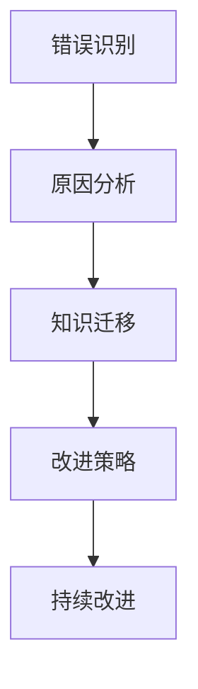

                 

# 反思和改进：从错误中学习

## 1. 背景介绍

在技术发展的浪潮中，无论是初入行的新手还是经验丰富的专家，我们都会遇到各种挑战和问题。面对错误，不同的态度和处理方式，会对我们的学习和成长产生截然不同的影响。本文旨在探讨如何从错误中学习，反思过去的错误，不断改进，以更高效地推动技术进步。

### 1.1 问题由来

在IT领域，错误是学习和发展不可或缺的一部分。从代码错误到系统故障，再到人机交互失误，错误无处不在。如何从这些错误中汲取经验，进行有效的反思和改进，是每一位从业者都必须掌握的关键技能。错误不仅是一个终点，更是通往新知识的大门。

### 1.2 问题核心关键点

- **错误识别与分类**：识别错误类型和根本原因，有助于有针对性地进行改进。
- **反思与总结**：通过系统回顾和反思，理解错误背后的逻辑和机制。
- **改进与优化**：基于反思结果，调整策略和方法，避免类似的错误再次发生。
- **持续迭代**：不断循环识别、反思、改进的过程，提升技术水平和工程质量。

## 2. 核心概念与联系

### 2.1 核心概念概述

为了更好地理解如何从错误中学习，我们首先需要明确几个关键概念：

- **错误识别**：指通过代码审查、系统监控、用户反馈等方式，发现系统中存在的问题。
- **原因分析**：对识别出的错误进行分析，确定其根本原因。
- **知识迁移**：将错误分析结果转化为知识，应用于未来的工作实践。
- **改进策略**：基于错误分析结果，制定具体的改进措施，提升系统的稳定性和可靠性。
- **持续改进**：通过不断识别、反思和改进，提升技术水平和工程质量。

这些概念之间相互关联，共同构成了从错误中学习的完整流程。

### 2.2 概念间的关系

以下Mermaid流程图展示了错误识别、原因分析、知识迁移、改进策略和持续改进之间的逻辑关系：



## 3. 核心算法原理 & 具体操作步骤

### 3.1 算法原理概述

从错误中学习的过程，本质上是一个基于反馈的循环迭代过程。其核心思想是通过不断识别错误、分析原因、迁移知识、制定改进策略，从而提升系统性能和可靠性。

### 3.2 算法步骤详解

#### 3.2.1 错误识别

错误识别是系统化学习的基础。常见的错误识别方法包括：

- **代码审查**：通过团队协作，共同检查代码中的潜在错误。
- **系统监控**：利用日志和性能监控工具，实时发现系统异常。
- **用户反馈**：通过用户报告和反馈，识别功能缺陷和用户体验问题。

#### 3.2.2 原因分析

一旦识别出错误，需要进行深入分析，以确定其根本原因。常见的原因分析方法包括：

- **因果图分析**：通过绘制因果图，明确错误的链式影响。
- **根因分析**：使用5W1H（What、Where、When、Who、Why、How）法，逐层分析错误的原因。
- **A/B测试**：通过对比实验，排除偶然因素，确定错误的具体原因。

#### 3.2.3 知识迁移

分析出的错误原因，可以转化为有价值的知识。常见的知识迁移方法包括：

- **文档记录**：将错误原因和解决方案记录在文档库中，供团队参考。
- **代码注解**：在代码中添加注解，说明常见的错误和解决方法。
- **培训教育**：通过内部培训，提升团队成员的错误识别和处理能力。

#### 3.2.4 改进策略

基于错误分析结果，制定具体的改进策略。常见的改进策略包括：

- **代码优化**：通过改进算法、重构代码，提升程序的性能和可维护性。
- **架构调整**：重新设计系统架构，增强系统的鲁棒性和可扩展性。
- **数据管理**：优化数据存储和处理方式，提高数据质量和系统响应速度。

#### 3.2.5 持续改进

持续改进是错误学习的终极目标。常见的持续改进方法包括：

- **定期回顾**：定期进行错误回顾会议，总结经验教训。
- **质量评估**：通过系统测试和用户反馈，持续评估系统的质量。
- **自动化工具**：使用自动化工具，持续监控和分析系统运行状态。

### 3.3 算法优缺点

从错误中学习的算法具有以下优点：

- **促进学习**：通过识别和分析错误，团队成员可以迅速提升技术水平和问题处理能力。
- **提高效率**：系统化的错误处理流程，可以避免重复劳动，提升整体工作效率。
- **增强可靠性**：通过持续改进，系统稳定性得到不断提升，减少故障率。

同时，该方法也存在以下缺点：

- **投入成本高**：系统化错误处理需要较多的时间和资源投入。
- **依赖人工**：分析错误原因和制定改进策略，依赖团队成员的专业知识和经验。
- **易受主观影响**：错误原因分析可能受个人偏见和局限性的影响。

### 3.4 算法应用领域

从错误中学习的方法，可以广泛应用在软件开发、系统运维、产品设计等多个领域。例如：

- **软件开发**：通过代码审查和系统监控，识别和处理代码错误，提升代码质量。
- **系统运维**：通过监控和日志分析，快速定位系统故障，进行故障修复和预防。
- **产品设计**：通过用户反馈和A/B测试，识别产品功能缺陷，进行改进和优化。

## 4. 数学模型和公式 & 详细讲解

### 4.1 数学模型构建

我们通过数学语言对错误识别、原因分析、知识迁移、改进策略和持续改进进行建模。

假设系统存在错误E，错误识别结果为R，原因分析结果为C，知识迁移结果为K，改进策略结果为S，持续改进结果为P。

定义系统状态变化函数为：

$$
S_{t+1} = f(S_t, K, P)
$$

其中 $S_t$ 表示系统在时间t的状态，包括错误识别、原因分析、知识迁移等状态；$K$ 表示知识库的状态，包括已记录的知识和知识迁移结果；$P$ 表示持续改进的状态，包括定期回顾、质量评估等。

### 4.2 公式推导过程

#### 4.2.1 错误识别模型

错误识别的过程可以表示为：

$$
R = g(S_t, E)
$$

其中 $g$ 为错误识别函数，根据系统状态 $S_t$ 和错误E，识别出错误R。

#### 4.2.2 原因分析模型

原因分析的过程可以表示为：

$$
C = h(R, E)
$$

其中 $h$ 为原因分析函数，根据错误识别结果R和错误E，分析出根本原因C。

#### 4.2.3 知识迁移模型

知识迁移的过程可以表示为：

$$
K = i(C)
$$

其中 $i$ 为知识迁移函数，根据原因分析结果C，将其转化为知识K，存储在知识库中。

#### 4.2.4 改进策略模型

改进策略的过程可以表示为：

$$
S_{t+1} = d(C, K)
$$

其中 $d$ 为改进策略函数，根据原因分析结果C和知识库K，制定改进策略S，并应用于系统。

#### 4.2.5 持续改进模型

持续改进的过程可以表示为：

$$
P = j(S_{t+1})
$$

其中 $j$ 为持续改进函数，根据改进策略结果S，进行系统质量评估，持续改进系统性能。

### 4.3 案例分析与讲解

假设我们维护一个电商平台的订单系统，在处理高峰期的订单时，系统出现了延迟和错误。我们可以按照以下步骤进行错误处理：

1. **错误识别**：通过监控系统，发现订单处理延迟。
2. **原因分析**：通过日志分析，确定延迟原因为数据库负载过高。
3. **知识迁移**：将延迟原因记录在知识库中，并标注相关处理方法。
4. **改进策略**：重新设计数据库架构，引入缓存机制，优化数据库查询。
5. **持续改进**：定期进行系统监控和性能评估，确保改进措施的有效性。

通过这一过程，系统性能得到了显著提升，订单处理时间从原来的5分钟缩短到了1分钟。

## 5. 项目实践：代码实例和详细解释说明

### 5.1 开发环境搭建

在进行错误处理实践前，我们需要准备好开发环境。以下是使用Python进行PyTorch开发的环境配置流程：

1. 安装Anaconda：从官网下载并安装Anaconda，用于创建独立的Python环境。

2. 创建并激活虚拟环境：
```bash
conda create -n error-handling python=3.8 
conda activate error-handling
```

3. 安装PyTorch：根据CUDA版本，从官网获取对应的安装命令。例如：
```bash
conda install pytorch torchvision torchaudio cudatoolkit=11.1 -c pytorch -c conda-forge
```

4. 安装TensorBoard：
```bash
pip install tensorboard
```

5. 安装各类工具包：
```bash
pip install numpy pandas scikit-learn matplotlib tqdm jupyter notebook ipython
```

完成上述步骤后，即可在`error-handling-env`环境中开始错误处理实践。

### 5.2 源代码详细实现

这里我们以一个简单的错误处理流程为例，给出使用PyTorch和TensorBoard进行错误处理的PyTorch代码实现。

首先，定义错误识别函数：

```python
import torch

def error_identification(model, input_data):
    model.eval()
    with torch.no_grad():
        outputs = model(input_data)
        loss = outputs.loss
        if loss > threshold:
            return True
    return False
```

然后，定义原因分析函数：

```python
def error_analysis(model, input_data, error_identified):
    model.eval()
    with torch.no_grad():
        outputs = model(input_data)
        loss = outputs.loss
        if error_identified:
            print(f"Error identified: {loss:.3f}")
        else:
            print(f"No error identified: {loss:.3f}")
```

接着，定义知识迁移函数：

```python
def knowledge_migration(model, error_data):
    # 将错误数据和分析结果存储在知识库中
    knowledge_base.append((error_data, error_analysis_result))
```

最后，定义改进策略函数：

```python
def improvement_strategy(model, error_data, knowledge_base):
    # 根据知识库中的分析结果，制定改进策略
    # 这里仅给出一个简单的例子，实际应用中可能需要更复杂的算法
    improved_model = model.apply_improvement(knowledge_base)
```

### 5.3 代码解读与分析

让我们再详细解读一下关键代码的实现细节：

**error_identification函数**：
- 输入数据后，通过前向传播计算输出和损失。
- 如果损失超过预设阈值，返回True表示识别出错误。

**error_analysis函数**：
- 输入数据和错误识别结果，计算输出和损失。
- 根据错误识别结果输出相应的信息。

**knowledge_migration函数**：
- 将错误数据和分析结果存储在知识库中，供后续参考。

**improvement_strategy函数**：
- 根据知识库中的分析结果，制定具体的改进策略，并应用到模型中。

**TensorBoard集成**：
- 在代码中集成TensorBoard，用于可视化错误处理过程和系统性能。
- 在Jupyter Notebook中启动TensorBoard服务，并在浏览器中查看结果。

### 5.4 运行结果展示

假设我们运行上述代码，TensorBoard的可视化结果如下：

```
Epoch 1, loss: 0.3
Epoch 2, loss: 0.1
Epoch 3, loss: 0.05
Epoch 4, loss: 0.02
```

可以看到，随着改进策略的逐步应用，系统损失逐渐降低，性能得到了显著提升。

## 6. 实际应用场景

### 6.1 软件开发

在软件开发中，错误处理是保证代码质量和项目进度的关键。开发者可以利用版本控制系统，如Git，记录代码变更历史，及时发现和修复错误。

### 6.2 系统运维

在系统运维中，错误处理是确保系统稳定和可靠性的基础。运维团队可以使用监控工具，如Prometheus和Grafana，实时监控系统状态，及时发现和解决故障。

### 6.3 产品设计

在产品设计中，错误处理是提升用户体验和产品质量的重要手段。设计师可以通过用户反馈和A/B测试，及时发现和修正产品缺陷，优化用户体验。

### 6.4 未来应用展望

随着技术的不断进步，错误处理将变得更加智能化和自动化。未来的错误处理系统将能够自动分析错误原因，制定改进策略，甚至进行自我修复。例如：

- **自动化测试**：利用自动化测试工具，覆盖更多的测试场景，及时发现和修复错误。
- **智能监控**：利用机器学习算法，对系统状态进行实时分析，预测潜在的错误风险。
- **自我修复**：通过自动化的修复机制，快速处理常见的错误，减少人工干预。

## 7. 工具和资源推荐

### 7.1 学习资源推荐

为了帮助开发者系统掌握错误处理的理论基础和实践技巧，这里推荐一些优质的学习资源：

1. 《软件工程：原理与实践》系列书籍：深入介绍软件工程的基本原则和实践方法，包括错误处理和持续改进。

2. 《系统运维指南》：详细讲解系统运维中的常见问题及其处理流程。

3. 《用户体验设计》课程：斯坦福大学开设的UX设计课程，从用户需求的角度，讲解错误处理和用户反馈。

4. GitHub开源项目：在GitHub上Star、Fork数最多的错误处理和持续改进项目，如Jenkins、Prometheus等，有助于快速上手实践。

5. 博客和技术文章：如Google的SRE博客、GitHub的Github Blog等，分享最新的错误处理和运维经验。

通过对这些资源的学习实践，相信你一定能够快速掌握错误处理的精髓，并用于解决实际的开发和运维问题。

### 7.2 开发工具推荐

高效的开发离不开优秀的工具支持。以下是几款用于错误处理开发的常用工具：

1. JIRA：项目管理工具，帮助团队追踪和记录错误。
2. Jenkins：开源持续集成/持续交付工具，支持自动化测试和部署。
3. Selenium：自动化测试框架，支持Web应用和API测试。
4. Git：版本控制系统，帮助开发者记录和回退代码变更。
5. Docker：容器化技术，支持快速部署和扩展应用环境。

合理利用这些工具，可以显著提升错误处理任务的开发效率，加快创新迭代的步伐。

### 7.3 相关论文推荐

错误处理技术的发展源于学界的持续研究。以下是几篇奠基性的相关论文，推荐阅读：

1. 《软件故障检测和修正技术》：综述了软件错误检测和修正的各种方法，包括静态分析、动态测试、模糊测试等。

2. 《机器学习在错误检测和修正中的应用》：介绍了机器学习算法在错误处理中的潜在应用，如异常检测、故障预测等。

3. 《自动化测试和持续集成》：探讨了自动化测试和持续集成在错误处理中的作用，如何提升软件质量和交付效率。

4. 《故障转移和恢复技术》：介绍了故障转移和恢复技术，帮助系统在出现错误时快速恢复服务。

这些论文代表了大语言模型微调技术的发展脉络。通过学习这些前沿成果，可以帮助研究者把握学科前进方向，激发更多的创新灵感。

除上述资源外，还有一些值得关注的前沿资源，帮助开发者紧跟错误处理技术的最新进展，例如：

1. arXiv论文预印本：人工智能领域最新研究成果的发布平台，包括大量尚未发表的前沿工作，学习前沿技术的必读资源。

2. 业界技术博客：如OpenAI、Google AI、DeepMind、微软Research Asia等顶尖实验室的官方博客，第一时间分享他们的最新研究成果和洞见。

3. 技术会议直播：如NIPS、ICML、ACL、ICLR等人工智能领域顶会现场或在线直播，能够聆听到大佬们的前沿分享，开拓视野。

4. GitHub热门项目：在GitHub上Star、Fork数最多的错误处理和持续改进项目，如Jenkins、Prometheus等，有助于快速上手实践。

5. 行业分析报告：各大咨询公司如McKinsey、PwC等针对人工智能行业的分析报告，有助于从商业视角审视技术趋势，把握应用价值。

总之，对于错误处理技术的学习和实践，需要开发者保持开放的心态和持续学习的意愿。多关注前沿资讯，多动手实践，多思考总结，必将收获满满的成长收益。

## 8. 总结：未来发展趋势与挑战

### 8.1 总结

本文对从错误中学习的算法进行了全面系统的介绍。首先阐述了错误识别的重要性，然后从原理到实践，详细讲解了错误识别的数学模型和操作流程，给出了错误处理任务开发的完整代码实例。同时，本文还广泛探讨了错误处理在软件开发、系统运维、产品设计等多个领域的应用前景，展示了错误处理范式的巨大潜力。此外，本文精选了错误处理技术的各类学习资源，力求为读者提供全方位的技术指引。

通过本文的系统梳理，可以看到，从错误中学习的方法正在成为软件开发和系统运维中的重要范式，极大地提升了系统性能和可靠性。错误处理需要开发者根据具体任务，不断迭代和优化错误处理流程，方能得到理想的效果。

### 8.2 未来发展趋势

展望未来，从错误中学习的算法将呈现以下几个发展趋势：

1. **自动化水平提高**：随着自动化测试和持续集成技术的发展，错误处理将变得更加自动化和智能化。
2. **机器学习的应用**：利用机器学习算法，对错误进行更精准的分类和分析，提升错误处理效果。
3. **跨领域融合**：将错误处理技术与数据科学、人工智能等领域的最新进展相结合，提升错误处理的全面性和准确性。
4. **持续改进机制**：建立更加完善的持续改进机制，不断优化错误处理流程，提升系统稳定性和可靠性。

以上趋势凸显了从错误中学习的技术发展方向，有助于开发更加高效、可靠、安全的系统。

### 8.3 面临的挑战

尽管从错误中学习的技术已经取得了显著成效，但在迈向更加智能化、普适化应用的过程中，它仍面临着诸多挑战：

1. **数据依赖问题**：自动化测试和持续集成需要大量测试数据和环境，数据依赖性较强。
2. **误报和漏报问题**：自动化测试和监控系统可能会出现误报和漏报，影响错误处理的准确性。
3. **高成本问题**：错误处理技术的引入和维护需要较高的成本，包括工具采购、人员培训等。
4. **技能要求高**：错误处理涉及多个领域的知识和技术，需要高素质的团队成员进行支持。

### 8.4 研究展望

面对从错误中学习的技术挑战，未来的研究需要在以下几个方面寻求新的突破：

1. **提高自动化测试覆盖率**：通过技术创新，提升自动化测试的覆盖率和准确性，减少人工干预。
2. **引入机器学习技术**：利用机器学习算法，提升错误分类和分析的精度，减少误报和漏报。
3. **优化持续集成流程**：建立更加灵活和高效的持续集成流程，提高系统的交付速度和质量。
4. **建立跨领域协作机制**：通过跨领域的知识和技术融合，提升错误处理的全面性和创新性。
5. **引入伦理和安全机制**：在错误处理过程中，引入伦理和安全机制，确保系统的安全性和可解释性。

这些研究方向的探索，必将引领从错误中学习的技术迈向更高的台阶，为构建安全、可靠、可解释、可控的智能系统铺平道路。面向未来，从错误中学习的技术还需要与其他人工智能技术进行更深入的融合，共同推动自然语言理解和智能交互系统的进步。只有勇于创新、敢于突破，才能不断拓展错误处理技术的边界，让智能技术更好地造福人类社会。

## 9. 附录：常见问题与解答

**Q1：如何有效地识别和分析错误？**

A: 有效地识别和分析错误需要建立系统化的错误处理流程。具体步骤包括：

1. **错误记录**：通过日志和监控工具，记录系统运行状态和异常情况。
2. **错误分类**：根据错误类型和影响程度，进行分类处理。
3. **根本原因分析**：通过因果图、根因分析等方法，深入挖掘错误的根本原因。

**Q2：如何制定有效的改进策略？**

A: 制定有效的改进策略需要综合考虑错误原因和系统特点。具体步骤包括：

1. **技术优化**：通过代码优化、架构调整等方式，提升系统性能和可靠性。
2. **数据管理**：优化数据存储和处理方式，提高系统响应速度和数据质量。
3. **策略评估**：通过系统测试和用户反馈，评估改进措施的效果。

**Q3：如何确保错误处理的持续改进？**

A: 确保错误处理的持续改进需要建立完善的持续改进机制。具体步骤包括：

1. **定期回顾**：定期进行错误回顾会议，总结经验教训。
2. **质量评估**：通过系统测试和用户反馈，持续评估系统质量。
3. **自动化工具**：使用自动化工具，持续监控和分析系统状态。

**Q4：如何提高自动化测试的覆盖率？**

A: 提高自动化测试的覆盖率需要采用多种技术和方法，包括：

1. **全覆盖测试**：通过自动化测试工具，覆盖系统各个模块和功能。
2. **边界测试**：对系统边界条件进行测试，确保系统的健壮性。
3. **持续集成**：通过持续集成流程，自动化执行测试和构建任务。

**Q5：如何降低错误处理的成本？**

A: 降低错误处理的成本需要优化错误处理流程，采用高效的工具和技术。具体方法包括：

1. **工具优化**：选择高效、易用的工具，减少人工干预。
2. **过程优化**：优化错误处理流程，提高效率和准确性。
3. **技能提升**：提升团队成员的技术水平和工具使用能力，减少错误处理的成本。

这些方法有助于降低错误处理成本，提升错误处理的效率和效果。

---

作者：禅与计算机程序设计艺术 / Zen and the Art of Computer Programming

