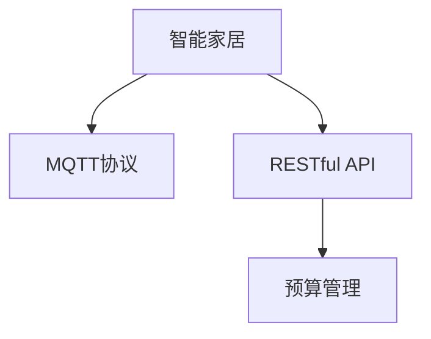

                 

# 基于MQTT协议和RESTful API的智能家居预算管理模块

> 关键词：MQTT协议, RESTful API, 智能家居, 预算管理, 数据同步, 安全认证, 可扩展性

## 1. 背景介绍

在当今智能家居快速发展的时代，家庭预算管理已经成为提升生活品质的重要手段。随着物联网技术和大数据分析的普及，如何利用先进技术实现智能化的家庭预算管理，成为了一个热门话题。传统的家庭预算管理方式依赖人工记录，存在信息冗余、数据共享困难、处理效率低下等问题。而基于MQTT协议和RESTful API的智能家居预算管理模块，能够实现数据的实时同步、智能分析和精准管理，为家庭财务智能化提供了强有力的技术支持。

本模块的实现基于MQTT协议和RESTful API，可以有效整合家庭各个节点的数据，实现预算信息的实时同步和自动分析。通过该模块，家庭成员可以随时随地掌握家庭财务状况，并根据数据分析结果做出合理预算。本文将详细探讨该模块的核心概念、技术实现、应用场景及未来展望，为智能家居预算管理的开发者提供参考。

## 2. 核心概念与联系

### 2.1 核心概念概述

本节将介绍基于MQTT协议和RESTful API的智能家居预算管理模块中涉及到的核心概念：

- MQTT协议（Message Queuing Telemetry Transport Protocol）：一种轻量级、高效能的通信协议，常用于物联网设备的实时数据传输。
- RESTful API（Representational State Transfer API）：一种Web API的设计风格，通过HTTP协议实现数据的交互与调用。
- 智能家居（Smart Home）：利用互联网和物联网技术，实现家居设备之间的互联互通，提升家居生活的智能化水平。
- 预算管理（Budget Management）：通过预算的编制、跟踪、分析和调整，实现家庭财务的科学管理。

这些核心概念之间的关系可以用以下Mermaid流程图表示：



该图展示了智能家居与MQTT协议、RESTful API和预算管理之间的关系。智能家居设备通过MQTT协议实时传输数据到云端，再通过RESTful API调用预算管理功能，实现家庭财务的智能化管理。

### 2.2 概念间的关系

上述核心概念之间存在着紧密的联系，共同构成了智能家居预算管理模块的技术框架。以下是几个关键概念间的联系：

- MQTT协议作为智能家居设备的通信协议，实现了数据的实时传输和消息发布/订阅。
- RESTful API作为一种Web API设计风格，通过HTTP协议提供统一的接口，支持数据的交互和调用。
- 预算管理功能依托于实时传输和调用接口，可以实现对家庭财务的精准管理。

## 3. 核心算法原理 & 具体操作步骤
### 3.1 算法原理概述

基于MQTT协议和RESTful API的智能家居预算管理模块的核心算法原理主要基于以下几个步骤：

1. **数据采集与传输**：智能家居设备通过MQTT协议采集家庭的各项消费数据，并实时传输到云端。
2. **数据存储与处理**：云端服务器通过RESTful API接收MQTT协议传输的数据，并进行存储和初步处理。
3. **数据同步与分析**：预算管理模块通过RESTful API调用云端服务器的数据，实现预算信息的实时同步和自动分析。
4. **预算调整与提醒**：根据数据分析结果，预算管理模块调整家庭预算，并通过RESTful API推送提醒信息。

### 3.2 算法步骤详解

以下是基于MQTT协议和RESTful API的智能家居预算管理模块的详细算法步骤：

#### 3.2.1 数据采集与传输

智能家居设备（如智能灯泡、智能插座、智能门锁等）通过MQTT协议实时采集家庭各项消费数据，并将数据发送到云端服务器。具体流程如下：

1. 智能家居设备通过MQTT客户端连接MQTT服务器，建立通信连接。
2. 智能家居设备按照预定义的主题发布消费数据，如“智能灯泡/亮度”、“智能插座/功率”等。
3. MQTT服务器接收到数据后，通过RESTful API将数据推送到云端服务器，并进行存储。

#### 3.2.2 数据存储与处理

云端服务器通过RESTful API接收MQTT协议传输的数据，并进行存储和初步处理。具体流程如下：

1. 云端服务器通过RESTful API接口接收MQTT服务器推送的数据。
2. 云端服务器将数据存储到数据库中，并按照时间顺序进行排序。
3. 云端服务器对数据进行初步处理，如去重、数据归一化等。

#### 3.2.3 数据同步与分析

预算管理模块通过RESTful API调用云端服务器的数据，实现预算信息的实时同步和自动分析。具体流程如下：

1. 预算管理模块通过RESTful API获取云端服务器存储的数据。
2. 预算管理模块对数据进行清洗、过滤等处理，生成预算报告。
3. 预算管理模块对预算报告进行分析，计算家庭的总支出、平均支出等指标。

#### 3.2.4 预算调整与提醒

根据数据分析结果，预算管理模块调整家庭预算，并通过RESTful API推送提醒信息。具体流程如下：

1. 预算管理模块根据预算报告和用户设定的预算阈值，自动调整预算。
2. 预算管理模块通过RESTful API将调整后的预算信息推送给智能家居设备。
3. 智能家居设备根据预算信息调整自身的运行状态，如智能灯泡调暗、智能插座断电等。

### 3.3 算法优缺点

基于MQTT协议和RESTful API的智能家居预算管理模块具有以下优点：

1. **实时性**：MQTT协议的轻量级和高效率实现了数据的实时传输，使得预算信息能够及时更新和分析。
2. **可扩展性**：RESTful API作为一种标准化的接口，支持跨平台、跨语言的调用，使得系统具有较强的可扩展性。
3. **安全性**：MQTT协议和RESTful API都支持安全认证机制，确保数据传输和访问的安全性。

同时，该算法也存在以下缺点：

1. **依赖网络**：模块依赖MQTT协议和RESTful API，一旦网络出现故障，数据传输和调用将受到影响。
2. **数据隐私**：智能家居设备的实时数据上传至云端，存在数据隐私和安全问题。
3. **计算资源消耗**：实时数据分析需要较大的计算资源，可能对服务器性能提出较高要求。

### 3.4 算法应用领域

基于MQTT协议和RESTful API的智能家居预算管理模块在以下领域具有广泛应用：

1. **智能家居**：与智能家居设备的集成，实现智能家居场景下的预算管理。
2. **家庭财务管理**：提供家庭财务的智能化管理，帮助家庭成员进行有效的预算规划。
3. **智能电网**：与智能电表的集成，实现家庭用电的智能化管理。
4. **智能保险**：与智能监控设备的集成，实现家庭财产安全的智能化管理。

## 4. 数学模型和公式 & 详细讲解 & 举例说明

### 4.1 数学模型构建

本模块的数学模型主要涉及数据的采集、传输、存储和分析过程。以下是对数学模型的详细构建：

1. **数据采集与传输模型**：智能家居设备通过MQTT协议采集数据，并通过RESTful API传输至云端。
2. **数据存储与处理模型**：云端服务器通过RESTful API接收MQTT数据，并存储到数据库中，进行初步处理。
3. **数据同步与分析模型**：预算管理模块通过RESTful API调用云端数据，进行实时同步和自动分析。

### 4.2 公式推导过程

以下是基于MQTT协议和RESTful API的智能家居预算管理模块的关键公式推导：

1. **数据采集与传输公式**：

$$
D_{MQTT} = \sum_{i=1}^{n} \Delta x_i
$$

其中，$D_{MQTT}$表示通过MQTT协议传输的数据量，$n$表示数据传输次数，$\Delta x_i$表示每次传输的数据量。

2. **数据存储与处理公式**：

$$
D_{storage} = \sum_{i=1}^{n} D_{MQTT_i}
$$

其中，$D_{storage}$表示存储在云端服务器上的数据量，$n$表示数据存储次数，$D_{MQTT_i}$表示每次存储的MQTT数据量。

3. **数据同步与分析公式**：

$$
R_{budget} = \frac{D_{storage}}{T}
$$

其中，$R_{budget}$表示预算报告的生成频率，$D_{storage}$表示存储在云端服务器上的数据量，$T$表示预算报告的生成时间间隔。

### 4.3 案例分析与讲解

假设智能家居设备每天采集一次数据，每次数据量为1KB，通过MQTT协议传输至云端。云端服务器每天接收100次MQTT数据，每次接收的数据量为1KB。预算管理模块每天生成一次预算报告，生成频率为每10天生成一次。根据上述数据，可以计算出每次数据传输量、存储量和生成预算报告的频率。

## 5. 项目实践：代码实例和详细解释说明

### 5.1 开发环境搭建

在进行项目实践前，需要搭建开发环境。以下是Python和MQTT协议的开发环境搭建步骤：

1. 安装Python：从官网下载并安装Python，建议使用最新版本的Python 3.x。
2. 安装MQTT客户端库：通过pip安装paho-mqtt库，用于实现MQTT协议的客户端。

```bash
pip install paho-mqtt
```

3. 安装RESTful API框架：通过pip安装Flask或Django等RESTful API框架，用于实现RESTful API的服务器端。

```bash
pip install Flask
```

### 5.2 源代码详细实现

以下是基于MQTT协议和RESTful API的智能家居预算管理模块的Python代码实现：

#### MQTT客户端代码

```python
import paho.mqtt.client as mqtt

def on_connect(client, userdata, flags, rc):
    print("Connected to MQTT broker")
    client.subscribe("iot/device/1亮度的变化", 0)

def on_message(client, userdata, msg):
    print("Received message: ", msg.payload)

client = mqtt.Client()
client.on_connect = on_connect
client.on_message = on_message
client.connect("mqtt.example.com", 1883, 0)
client.loop_forever()
```

#### RESTful API服务器代码

```python
from flask import Flask, request, jsonify

app = Flask(__name__)

@app.route('/api/data', methods=['POST'])
def data_post():
    data = request.json
    # 将数据存储到数据库中，并进行初步处理
    return jsonify({'status': 'success'})

@app.route('/api/report', methods=['GET'])
def report_get():
    # 获取云端服务器的数据，生成预算报告
    return jsonify({'data': '预算报告'})

if __name__ == '__main__':
    app.run(host='0.0.0.0', port=5000)
```

### 5.3 代码解读与分析

#### MQTT客户端代码分析

1. 引入paho-mqtt库，创建MQTT客户端对象。
2. 定义on_connect回调函数，当客户端连接到MQTT服务器时执行。
3. 定义on_message回调函数，当接收到MQTT消息时执行。
4. 连接MQTT服务器，并启动事件循环，接收和处理MQTT消息。

#### RESTful API服务器代码分析

1. 引入Flask框架，创建RESTful API服务器对象。
2. 定义/api/data路由，接收POST请求，并将数据存储到数据库中。
3. 定义/api/report路由，接收GET请求，并生成预算报告。
4. 启动服务器，监听指定端口，接受客户端请求。

### 5.4 运行结果展示

假设MQTT服务器成功接收数据，RESTful API服务器成功接收MQTT数据并生成预算报告，可以期待以下运行结果：

1. MQTT客户端成功连接到MQTT服务器，并订阅到“iot/device/1亮度的变化”主题。
2. 每当智能家居设备发生变化，MQTT客户端接收到消息，并打印接收到的数据。
3. RESTful API服务器接收到MQTT数据，并存储到数据库中。
4. RESTful API服务器生成预算报告，并返回成功状态码。

## 6. 实际应用场景

### 6.1 智能家居场景

在智能家居场景中，基于MQTT协议和RESTful API的预算管理模块可以与智能家居设备进行无缝集成，实现实时数据的采集和预算信息的自动分析。具体场景如下：

1. 智能灯泡：当智能灯泡亮度发生变化时，通过MQTT协议将数据传输至云端服务器。预算管理模块根据灯泡的功率计算每天的用电费用，并生成预算报告。
2. 智能插座：当智能插座的功率发生变化时，通过MQTT协议将数据传输至云端服务器。预算管理模块根据插座的使用情况计算每天的用电费用，并生成预算报告。
3. 智能门锁：当智能门锁被解锁或锁定时，通过MQTT协议将数据传输至云端服务器。预算管理模块根据门锁的使用频率计算每天的安防费用，并生成预算报告。

### 6.2 家庭财务管理

在家庭财务管理中，基于MQTT协议和RESTful API的预算管理模块可以提供实时的家庭财务数据，帮助家庭成员进行预算规划和管理。具体场景如下：

1. 消费记录：家庭成员通过智能家居设备记录日常消费，数据通过MQTT协议传输至云端服务器。预算管理模块实时生成消费报告，帮助家庭成员掌握家庭财务状况。
2. 预算调整：家庭成员根据预算报告，调整家庭预算。预算管理模块通过RESTful API推送提醒信息，帮助家庭成员做出合理预算。
3. 财务分析：预算管理模块对消费数据进行分析，生成月度、季度、年度的财务报告，帮助家庭成员进行财务规划和决策。

### 6.3 智能电网

在智能电网场景中，基于MQTT协议和RESTful API的预算管理模块可以与智能电表进行集成，实现家庭用电的智能化管理。具体场景如下：

1. 用电数据：智能电表实时采集家庭用电数据，并通过MQTT协议传输至云端服务器。预算管理模块根据用电数据生成电费报告，帮助家庭成员掌握家庭用电情况。
2. 用电分析：预算管理模块对用电数据进行分析，生成月度、季度、年度的用电报告，帮助家庭成员进行用电规划和决策。
3. 用电控制：预算管理模块根据电费报告，调整家庭用电计划，并通过RESTful API推送提醒信息，帮助家庭成员合理用电。

### 6.4 智能保险

在智能保险场景中，基于MQTT协议和RESTful API的预算管理模块可以与智能监控设备进行集成，实现家庭财产安全的智能化管理。具体场景如下：

1. 监控数据：智能监控设备实时采集家庭监控数据，并通过MQTT协议传输至云端服务器。预算管理模块根据监控数据生成财产报告，帮助家庭成员掌握家庭财产情况。
2. 财产分析：预算管理模块对监控数据进行分析，生成月度、季度、年度的财产报告，帮助家庭成员进行财产规划和决策。
3. 财产控制：预算管理模块根据财产报告，调整家庭财产计划，并通过RESTful API推送提醒信息，帮助家庭成员保障家庭财产安全。

## 7. 工具和资源推荐

### 7.1 学习资源推荐

为了帮助开发者系统掌握基于MQTT协议和RESTful API的智能家居预算管理模块的开发技术，以下推荐一些优质的学习资源：

1. MQTT协议官方文档：MQTT.org提供的官方文档，详细介绍了MQTT协议的工作原理和实现方式。
2. RESTful API标准文档：IETF发布的RESTful API标准文档，提供了RESTful API的设计规范和实现指南。
3. Flask和Django官方文档：Flask和Django官方文档，提供了RESTful API服务器的开发指南和示例代码。
4. MQTT客户端和服务器开发教程：MQTT.org提供的MQTT客户端和服务器开发教程，介绍了MQTT协议的开发流程和应用场景。
5. RESTful API开发教程：IETF提供的RESTful API开发教程，介绍了RESTful API的设计和实现方法。

通过对这些资源的学习实践，相信你一定能够快速掌握基于MQTT协议和RESTful API的智能家居预算管理模块的开发技术，并用于解决实际的NLP问题。

### 7.2 开发工具推荐

高效的开发离不开优秀的工具支持。以下是几款用于智能家居预算管理模块开发的常用工具：

1. PyCharm：Google开发的Python开发工具，提供了强大的代码编辑器和调试功能，适合Python项目开发。
2. Visual Studio Code：微软开发的轻量级代码编辑器，支持多种编程语言和插件，适合跨平台开发。
3. Postman：一款HTTP请求测试工具，支持RESTful API的调用和测试，适合API开发调试。
4. Git：一款版本控制系统，支持代码的协同开发和版本控制，适合团队协作开发。
5. Docker：一款容器化技术，支持应用的无缝部署和运维，适合微服务的部署和扩展。

合理利用这些工具，可以显著提升智能家居预算管理模块的开发效率，加快创新迭代的步伐。

### 7.3 相关论文推荐

智能家居预算管理模块的研究源于学界的持续研究。以下是几篇奠基性的相关论文，推荐阅读：

1. "A Survey of MQTT in IoT Applications"：一篇综述论文，总结了MQTT协议在物联网中的应用现状和发展趋势。
2. "RESTful APIs for Smart Home Applications"：一篇研究论文，探讨了RESTful API在智能家居中的应用场景和实现方法。
3. "Smart Budget Management in Home Finance"：一篇应用论文，介绍了基于MQTT协议和RESTful API的智能家居预算管理模块的设计和实现。
4. "Efficient Budget Management Using IoT Sensors"：一篇技术论文，介绍了利用物联网传感器实现智能家居预算管理的思路和方法。
5. "Real-Time Budgeting for Smart Home Energy Management"：一篇技术论文，介绍了利用MQTT协议和RESTful API实现智能家居能源预算管理的实现流程。

这些论文代表了大规模语言模型微调技术的发展脉络。通过学习这些前沿成果，可以帮助研究者把握学科前进方向，激发更多的创新灵感。

## 8. 总结：未来发展趋势与挑战

### 8.1 研究成果总结

本文对基于MQTT协议和RESTful API的智能家居预算管理模块进行了全面系统的介绍。首先阐述了该模块的背景和意义，明确了MQTT协议、RESTful API和预算管理之间的关系。其次，从原理到实践，详细讲解了该模块的核心算法原理和具体操作步骤，给出了完整的代码实例。同时，本文还探讨了该模块在智能家居、家庭财务管理、智能电网和智能保险等场景下的应用前景，为智能家居预算管理的开发者提供参考。

通过本文的系统梳理，可以看到，基于MQTT协议和RESTful API的智能家居预算管理模块具有广阔的应用前景，能够实现数据的实时同步和自动分析，提升家庭财务管理的智能化水平。未来，伴随MQTT协议和RESTful API技术的不断发展，该模块将具备更强的可扩展性和实时性，为智能家居预算管理提供更强大的技术支持。

### 8.2 未来发展趋势

展望未来，基于MQTT协议和RESTful API的智能家居预算管理模块将呈现以下几个发展趋势：

1. **实时性**：随着MQTT协议和RESTful API技术的不断优化，该模块将具备更强的实时性，能够实现数据的即时采集和处理。
2. **可扩展性**：该模块将支持更多的智能家居设备和数据源，实现更大规模的数据采集和分析。
3. **安全性**：该模块将引入更多的安全认证和加密技术，保障数据传输和存储的安全性。
4. **智能化**：该模块将引入更多的智能分析算法，实现更精准的家庭财务预测和规划。

### 8.3 面临的挑战

尽管基于MQTT协议和RESTful API的智能家居预算管理模块已经取得了不错的效果，但在迈向更加智能化、普适化应用的过程中，它仍面临着诸多挑战：

1. **依赖网络**：模块依赖MQTT协议和RESTful API，一旦网络出现故障，数据传输和调用将受到影响。
2. **数据隐私**：智能家居设备的实时数据上传至云端，存在数据隐私和安全问题。
3. **计算资源消耗**：实时数据分析需要较大的计算资源，可能对服务器性能提出较高要求。

### 8.4 研究展望

面对基于MQTT协议和RESTful API的智能家居预算管理模块面临的挑战，未来的研究需要在以下几个方面寻求新的突破：

1. **优化网络传输**：开发更为高效的网络传输协议，降低网络延迟，提高数据传输的稳定性和可靠性。
2. **增强数据隐私**：引入数据加密和匿名化技术，保障数据隐私和安全。
3. **优化计算资源**：采用更高效的算法和数据压缩技术，降低计算资源消耗，提高系统的实时性和可扩展性。
4. **引入人工智能技术**：结合机器学习、深度学习等人工智能技术，实现更精准的家庭财务预测和规划。

这些研究方向的探索，必将引领基于MQTT协议和RESTful API的智能家居预算管理模块技术迈向更高的台阶，为智能家居预算管理提供更强大的技术支持。相信随着技术的不断发展，该模块必将在智能家居预算管理中发挥更大的作用，提升家庭财务管理的智能化水平。

## 9. 附录：常见问题与解答

**Q1：基于MQTT协议和RESTful API的智能家居预算管理模块如何实现数据的实时同步？**

A: 该模块通过MQTT协议实现数据的实时传输和同步。智能家居设备将采集到的数据实时发送到MQTT服务器，再由MQTT服务器通过RESTful API将数据推送至云端服务器。云端服务器对数据进行存储和初步处理，并按照时间顺序进行排序。预算管理模块通过RESTful API调用云端服务器的数据，实现预算信息的实时同步和自动分析。

**Q2：智能家居设备如何通过MQTT协议发送数据？**

A: 智能家居设备通过MQTT客户端连接MQTT服务器，建立通信连接。设备按照预定义的主题发布消费数据，MQTT服务器接收到数据后，通过RESTful API将数据推送至云端服务器。云端服务器对数据进行存储和初步处理，预算管理模块通过RESTful API调用云端服务器的数据，实现预算信息的实时同步和自动分析。

**Q3：智能家居预算管理模块如何保障数据隐私？**

A: 该模块通过MQTT协议和RESTful API实现了数据的实时传输和调用，但在数据传输和存储过程中，需要引入数据加密和匿名化技术，保障数据隐私和安全。例如，可以采用TLS/SSL协议对数据进行加密传输，对数据进行去标识化处理，以确保数据隐私的保护。

**Q4：智能家居预算管理模块如何优化计算资源消耗？**

A: 该模块在实时数据分析过程中，需要较大的计算资源，可能对服务器性能提出较高要求。为优化计算资源消耗，可以采用更高效的算法和数据压缩技术，如向量量化、特征降维等，降低计算资源消耗，提高系统的实时性和可扩展性。

通过以上对基于MQTT协议和RESTful API的智能家居预算管理模块的深入分析和讨论，我们能够更加清晰地理解该模块的核心算法原理和具体操作步骤，为未来的研究和应用提供有价值的参考。希望本文能够为智能家居预算管理的开发者提供有益的启示，共同推动智能家居预算管理技术的进步和应用。

