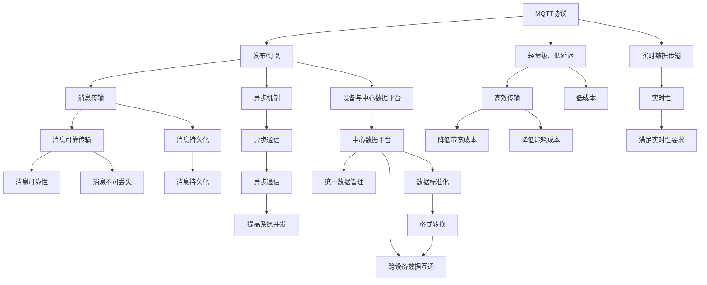
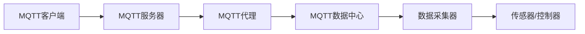
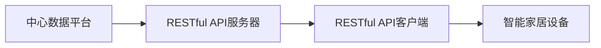
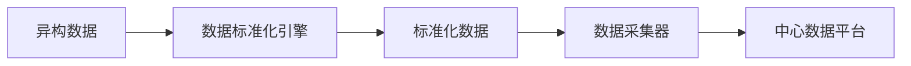
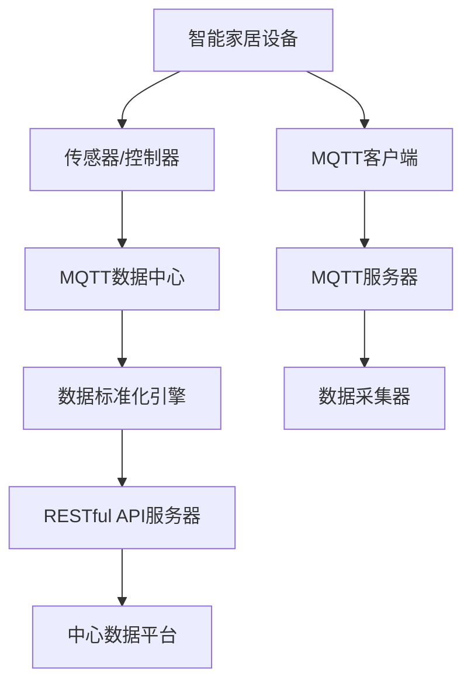

                 

# 基于MQTT协议和RESTful API的结构化智能家居数据收集

> 关键词：结构化数据, 智能家居, MQTT协议, RESTful API, 数据收集, 数据采集

## 1. 背景介绍

### 1.1 问题由来

随着物联网技术的飞速发展，智能家居设备日益普及。然而，这些设备的数据往往存在以下问题：

- **异构性**：不同厂商、不同型号的设备可能采用不同的通信协议和数据格式，导致数据无法统一管理和分析。
- **实时性**：传感器、控制器等设备的数据实时性要求高，但传统的数据收集方法难以满足这些要求。
- **安全性**：设备与中心数据平台之间的通信可能存在安全风险，未经授权的设备可能被非法接入或数据篡改。

为了解决这些问题，本文提出了一种基于MQTT协议和RESTful API的结构化数据收集方法。该方法利用MQTT协议的低延迟和高效传输特性，结合RESTful API的标准化接口，实现了智能家居设备的统一数据管理和实时数据采集。

### 1.2 问题核心关键点

本文的核心目标是构建一个稳定、高效、安全的智能家居数据收集系统。关键技术点包括：

- **MQTT协议**：一种轻量级、低延迟的发布/订阅消息传输协议，适合智能家居设备的实时数据传输。
- **RESTful API**：一种基于HTTP的接口规范，提供标准化的数据接口，方便数据采集和处理。
- **数据标准化**：将异构设备的数据进行统一标准化处理，支持格式转换和跨设备的数据互通。
- **安全机制**：引入身份认证、访问控制等安全机制，确保数据采集和传输的安全性。

### 1.3 问题研究意义

该系统能够为智能家居设备的统一管理和实时数据采集提供有效支持，具备以下重要意义：

1. **数据标准化**：实现不同设备间的数据互通，提升数据收集的效率和准确性。
2. **实时采集**：满足智能家居设备对数据实时性的高要求，及时捕捉重要信息。
3. **安全保障**：确保数据采集和传输的安全性，防止数据泄露和篡改。
4. **跨平台应用**：通过RESTful API支持多种平台和设备的数据接入，实现灵活多样的智能家居应用。
5. **成本降低**：采用轻量级的MQTT协议，降低数据传输的带宽和能耗成本。

## 2. 核心概念与联系

### 2.1 核心概念概述

为更好地理解基于MQTT协议和RESTful API的结构化数据收集方法，本节将介绍几个密切相关的核心概念：

- **MQTT协议**：一种轻量级、低延迟的发布/订阅消息传输协议，适合智能家居设备的实时数据传输。
- **RESTful API**：一种基于HTTP的接口规范，提供标准化的数据接口，方便数据采集和处理。
- **数据标准化**：将异构设备的数据进行统一标准化处理，支持格式转换和跨设备的数据互通。
- **安全机制**：引入身份认证、访问控制等安全机制，确保数据采集和传输的安全性。

这些核心概念之间的逻辑关系可以通过以下Mermaid流程图来展示：



这个流程图展示了MQTT协议和RESTful API在大数据收集中的作用和相互联系：

1. MQTT协议利用其轻量级、低延迟的特点，实现了智能家居设备的实时数据传输。
2. RESTful API通过标准化的接口规范，提供了统一的数据管理平台，方便数据采集和处理。
3. 数据标准化技术将异构设备的数据进行统一处理，支持格式转换和跨设备的数据互通。
4. 安全机制确保了数据采集和传输的安全性，防止数据泄露和篡改。

### 2.2 概念间的关系

这些核心概念之间存在着紧密的联系，形成了结构化数据收集的完整生态系统。下面我通过几个Mermaid流程图来展示这些概念之间的关系。

#### 2.2.1 MQTT协议的工作流程



这个流程图展示了MQTT协议的基本工作流程：

1. MQTT客户端通过MQTT代理连接到MQTT服务器。
2. MQTT服务器再将数据发送到数据中心。
3. 数据中心通过数据采集器采集传感器和控制器等设备的数据。
4. 数据中心将数据标准化处理后，通过RESTful API返回给中心数据平台。

#### 2.2.2 RESTful API的基本架构



这个流程图展示了RESTful API的基本架构：

1. 中心数据平台通过RESTful API服务器提供数据接口。
2. 智能家居设备通过RESTful API客户端访问数据接口，进行数据查询和操作。
3. RESTful API服务器负责处理客户端的请求和响应，提供标准化接口。

#### 2.2.3 数据标准化的处理流程



这个流程图展示了数据标准化的处理流程：

1. 异构数据通过数据标准化引擎进行统一处理。
2. 标准化后的数据被数据采集器采集。
3. 数据采集器将标准化数据发送到中心数据平台。

### 2.3 核心概念的整体架构

最后，我们用一个综合的流程图来展示这些核心概念在大数据收集过程中的整体架构：



这个综合流程图展示了从智能家居设备到中心数据平台的整体架构：

1. 智能家居设备通过传感器/控制器采集数据。
2. 数据通过MQTT协议传输到MQTT数据中心。
3. 数据中心通过数据标准化引擎进行统一处理。
4. 标准化后的数据通过RESTful API服务器发送到中心数据平台。

## 3. 核心算法原理 & 具体操作步骤

### 3.1 算法原理概述

基于MQTT协议和RESTful API的结构化数据收集方法，本质上是一个实时、高效、安全的智能家居数据采集系统。其核心思想是：

- **MQTT协议**：利用MQTT协议的低延迟和高效传输特性，实现智能家居设备的实时数据采集。
- **RESTful API**：通过标准化的接口规范，方便数据采集和处理，支持跨平台的数据收集和共享。
- **数据标准化**：采用数据标准化技术，将异构设备的数据进行统一处理，确保数据的一致性和可互通性。
- **安全机制**：引入身份认证、访问控制等安全机制，确保数据采集和传输的安全性。

该方法主要包括以下几个步骤：

1. **MQTT数据传输**：智能家居设备通过MQTT协议将实时数据传输到MQTT数据中心。
2. **数据标准化处理**：数据中心通过数据标准化引擎对异构设备的数据进行统一处理，支持格式转换和跨设备的数据互通。
3. **RESTful API接口**：数据中心通过RESTful API服务器提供标准化的数据接口，方便数据采集和处理。
4. **数据存储与分析**：中心数据平台通过RESTful API接口，对结构化数据进行存储和分析，实现数据管理和应用。

### 3.2 算法步骤详解

#### 3.2.1 MQTT数据传输

MQTT协议是一种轻量级、低延迟的发布/订阅消息传输协议，适合智能家居设备的实时数据传输。其基本工作流程如下：

1. **连接建立**：智能家居设备通过MQTT客户端连接到MQTT代理服务器。
2. **主题订阅**：MQTT客户端订阅特定的主题（Topic），用于接收数据。
3. **数据发布**：传感器/控制器等设备发布数据到MQTT代理服务器，数据将被路由到相应的主题。
4. **数据接收**：MQTT客户端接收发布的数据，进行数据处理和存储。

MQTT协议具有以下特点：

- **轻量级**：数据传输效率高，适用于资源受限的设备。
- **低延迟**：数据传输延迟低，适用于实时性要求高的应用。
- **异步通信**：支持异步数据发布和订阅，提高系统的并发性能。

#### 3.2.2 数据标准化处理

数据标准化是实现不同设备间数据互通的关键步骤。其基本工作流程如下：

1. **数据格式转换**：将异构设备的数据转换为统一的格式，如JSON、XML等。
2. **数据规范处理**：根据预设的数据规范，对数据进行清洗、校验、转换等处理。
3. **数据标准化输出**：将处理后的数据输出为标准化的格式，供数据采集器采集。

数据标准化技术通常包括以下几个步骤：

- **数据解析**：解析异构设备的原始数据，获取关键信息。
- **数据清洗**：去除无效数据、噪声数据等。
- **数据转换**：将数据转换为统一的格式，如JSON、XML等。
- **数据规范**：根据预设的数据规范，对数据进行清洗、校验、转换等处理。
- **数据输出**：将处理后的数据输出为标准化的格式，供数据采集器采集。

#### 3.2.3 RESTful API接口

RESTful API是一种基于HTTP的接口规范，提供标准化的数据接口，方便数据采集和处理。其基本工作流程如下：

1. **API接口定义**：定义RESTful API接口的URL、请求方法和数据格式。
2. **API接口发布**：将API接口发布到RESTful API服务器，供智能家居设备使用。
3. **API接口调用**：智能家居设备通过RESTful API客户端，调用API接口，进行数据查询和操作。
4. **API接口响应**：RESTful API服务器处理API接口调用请求，返回处理结果。

RESTful API接口通常包括以下几个组件：

- **URL**：接口的访问地址。
- **请求方法**：接口的HTTP请求方法，如GET、POST、PUT、DELETE等。
- **数据格式**：接口返回的数据格式，如JSON、XML等。
- **请求参数**：接口请求的参数，用于查询、更新数据。
- **返回结果**：接口返回的处理结果，包括数据、状态码、错误信息等。

#### 3.2.4 数据存储与分析

中心数据平台通过RESTful API接口，对结构化数据进行存储和分析，实现数据管理和应用。其基本工作流程如下：

1. **数据存储**：中心数据平台通过RESTful API接口，将数据存储到数据库或数据湖中。
2. **数据查询**：通过RESTful API接口，智能家居设备或数据分析工具可以查询数据。
3. **数据分析**：数据分析工具可以对结构化数据进行统计、挖掘、分析等处理。
4. **数据可视化**：将分析结果以图表、报表等形式展示，供用户查看和决策。

数据存储和分析通常包括以下几个步骤：

- **数据存储**：将结构化数据存储到数据库或数据湖中。
- **数据查询**：通过SQL、NoSQL等查询语言，查询数据。
- **数据分析**：使用统计分析、机器学习等方法，对数据进行分析和挖掘。
- **数据可视化**：将分析结果以图表、报表等形式展示，供用户查看和决策。

### 3.3 算法优缺点

基于MQTT协议和RESTful API的结构化数据收集方法，具有以下优点：

1. **实时性高**：MQTT协议的异步通信机制和低延迟特性，保证了数据传输的实时性。
2. **稳定性好**：通过RESTful API的标准化接口，数据采集和传输过程稳定可靠。
3. **安全性高**：引入身份认证、访问控制等安全机制，确保数据采集和传输的安全性。
4. **可扩展性强**：支持多种智能家居设备和平台的数据接入，实现灵活多样的应用场景。
5. **成本低廉**：采用轻量级的MQTT协议，降低数据传输的带宽和能耗成本。

同时，该方法也存在以下缺点：

1. **复杂度高**：涉及MQTT协议、RESTful API、数据标准化等多个技术环节，系统实现较为复杂。
2. **学习成本高**：需要开发者对MQTT协议和RESTful API有一定的理解和应用经验。
3. **维护成本高**：系统复杂度高，维护成本较高，需要专业团队支持。
4. **性能瓶颈**：在高并发场景下，系统性能可能受到MQTT协议和RESTful API的限制。

### 3.4 算法应用领域

基于MQTT协议和RESTful API的结构化数据收集方法，在智能家居领域具有广泛的应用前景，适用于以下场景：

1. **家庭安防**：通过传感器采集家庭安防数据，如门磁、烟雾探测器、摄像头等，实时监控家庭安全。
2. **能源管理**：通过智能电表、水表、燃气表等设备采集能源消耗数据，实时监控和分析家庭能源使用情况。
3. **环境监测**：通过智能温湿度计、空气质量传感器等设备采集环境数据，实时监测家庭环境质量。
4. **健康监测**：通过智能手表、智能床垫等设备采集健康数据，实时监控家庭成员的健康状况。
5. **家居自动化**：通过智能音箱、智能灯光等设备采集用户行为数据，实现智能家居控制。

## 4. 数学模型和公式 & 详细讲解 & 举例说明

### 4.1 数学模型构建

在基于MQTT协议和RESTful API的结构化数据收集方法中，主要涉及MQTT协议和RESTful API两个核心技术。下面分别对这两个技术进行数学模型构建。

#### 4.1.1 MQTT协议的数学模型

MQTT协议是一种轻量级、低延迟的发布/订阅消息传输协议。其核心思想是利用轻量级的消息发布和订阅机制，实现智能家居设备的实时数据传输。MQTT协议的数学模型主要包括以下几个参数：

- **QoS（Quality of Service）**：消息传输的可靠性保障，取值为0、1、2。
- **Retain**：是否保留最后一条消息，取值为True、False。
- **Last Will**：消息发布失败时的处理机制，取值为True、False。

MQTT协议的消息发布和订阅过程可以用以下公式表示：

$$
\begin{aligned}
& \text{Publish}(m, topic, qos, retain, last\_will) \\
& = \text{Connect}(client\_id) \\
& \text{Subscribe}(topic, qos) \\
& \text{Unsubscribe}(topic) \\
& \text{Disconnect}()
\end{aligned}
$$

其中，$\text{Publish}(m, topic, qos, retain, last\_will)$表示发布消息，$\text{Connect}(client\_id)$表示建立连接，$\text{Subscribe}(topic, qos)$表示订阅主题，$\text{Unsubscribe}(topic)$表示取消订阅，$\text{Disconnect}()$表示断开连接。

#### 4.1.2 RESTful API的数学模型

RESTful API是一种基于HTTP的接口规范，提供标准化的数据接口，方便数据采集和处理。其核心思想是利用标准的HTTP请求方法和数据格式，实现数据的发布和订阅。RESTful API的数学模型主要包括以下几个参数：

- **URL**：接口的访问地址。
- **请求方法**：接口的HTTP请求方法，如GET、POST、PUT、DELETE等。
- **数据格式**：接口返回的数据格式，如JSON、XML等。
- **请求参数**：接口请求的参数，用于查询、更新数据。
- **返回结果**：接口返回的处理结果，包括数据、状态码、错误信息等。

RESTful API的消息发布和订阅过程可以用以下公式表示：

$$
\begin{aligned}
& \text{Publish}(m, url, method, data\_format, request\_params, return\_status) \\
& = \text{Connect}(url, method) \\
& \text{Unsubscribe}(url) \\
& \text{Disconnect}()
\end{aligned}
$$

其中，$\text{Publish}(m, url, method, data\_format, request\_params, return\_status)$表示发布消息，$\text{Connect}(url, method)$表示建立连接，$\text{Unsubscribe}(url)$表示取消订阅，$\text{Disconnect}()$表示断开连接。

### 4.2 公式推导过程

在上述公式中，我们使用了符号表示法来描述MQTT协议和RESTful API的消息发布和订阅过程。下面对其中的关键公式进行推导。

#### 4.2.1 MQTT协议的公式推导

在MQTT协议中，消息发布和订阅的过程可以分为以下几个步骤：

1. **建立连接**：客户端通过MQTT客户端连接到MQTT代理服务器，发送连接请求。
2. **主题订阅**：客户端订阅特定的主题（Topic），用于接收数据。
3. **数据发布**：传感器/控制器等设备发布数据到MQTT代理服务器，数据将被路由到相应的主题。
4. **数据接收**：MQTT客户端接收发布的数据，进行数据处理和存储。

MQTT协议的消息发布和订阅过程可以用以下公式表示：

$$
\begin{aligned}
& \text{Publish}(m, topic, qos, retain, last\_will) \\
& = \text{Connect}(client\_id) \\
& \text{Subscribe}(topic, qos) \\
& \text{Unsubscribe}(topic) \\
& \text{Disconnect}()
\end{aligned}
$$

其中，$\text{Publish}(m, topic, qos, retain, last\_will)$表示发布消息，$\text{Connect}(client\_id)$表示建立连接，$\text{Subscribe}(topic, qos)$表示订阅主题，$\text{Unsubscribe}(topic)$表示取消订阅，$\text{Disconnect}()$表示断开连接。

#### 4.2.2 RESTful API的公式推导

在RESTful API中，消息发布和订阅的过程可以分为以下几个步骤：

1. **建立连接**：客户端通过RESTful API客户端连接到RESTful API服务器，发送连接请求。
2. **API接口定义**：定义RESTful API接口的URL、请求方法和数据格式。
3. **API接口发布**：将API接口发布到RESTful API服务器，供智能家居设备使用。
4. **API接口调用**：智能家居设备通过RESTful API客户端，调用API接口，进行数据查询和操作。
5. **API接口响应**：RESTful API服务器处理API接口调用请求，返回处理结果。

RESTful API的消息发布和订阅过程可以用以下公式表示：

$$
\begin{aligned}
& \text{Publish}(m, url, method, data\_format, request\_params, return\_status) \\
& = \text{Connect}(url, method) \\
& \text{Unsubscribe}(url) \\
& \text{Disconnect}()
\end{aligned}
$$

其中，$\text{Publish}(m, url, method, data\_format, request\_params, return\_status)$表示发布消息，$\text{Connect}(url, method)$表示建立连接，$\text{Unsubscribe}(url)$表示取消订阅，$\text{Disconnect}()$表示断开连接。

### 4.3 案例分析与讲解

#### 4.3.1 MQTT协议案例

假设我们有一个智能家庭安防系统，由多个传感器和控制器组成。传感器包括门磁、烟雾探测器、摄像头等，控制器包括智能灯光、智能锁等。系统通过MQTT协议实时采集家庭安防数据。

1. **建立连接**：智能家庭安防系统通过MQTT客户端连接到MQTT代理服务器，发送连接请求。
2. **主题订阅**：系统订阅门磁、烟雾探测器、摄像头等主题，用于接收数据。
3. **数据发布**：传感器发布门磁、烟雾探测器、摄像头等数据到MQTT代理服务器，数据将被路由到相应的主题。
4. **数据接收**：MQTT客户端接收发布的数据，进行数据处理和存储。

MQTT协议的案例代码如下：

```python
import paho.mqtt.client as mqtt

# 定义MQTT客户端
client = mqtt.Client(client_id="home_security")

# 定义连接回调函数
def on_connect(client, userdata, flags, rc):
    print("Connected with result code "+str(rc))
    # 订阅主题
    client.subscribe("door_magnet", 1)
    client.subscribe("smoke_detector", 1)
    client.subscribe("camera", 1)

# 定义数据发布回调函数
def on_publish(client, userdata, mid, rx院):
    print("Message published to MQTT broker")

# 定义数据接收回调函数
def on_message(client, userdata, msg):
    print(msg.topic+" "+str(msg.payload))

# 连接MQTT代理服务器
client.on_connect = on_connect
client.on_publish = on_publish
client.on_message = on_message
client.connect("mqtt.broker.com", 1883, 60)

# 启动MQTT客户端
client.loop_start()
```

#### 4.3.2 RESTful API案例

假设我们有一个智能家居能源管理系统，由多个智能电表、水表、燃气表等设备组成。系统通过RESTful API实时采集能源消耗数据。

1. **建立连接**：智能家居能源管理系统通过RESTful API客户端连接到RESTful API服务器，发送连接请求。
2. **API接口定义**：定义RESTful API接口的URL、请求方法和数据格式。
3. **API接口发布**：将API接口发布到RESTful API服务器，供智能家居设备使用。
4. **API接口调用**：智能家居设备通过RESTful API客户端，调用API接口，进行数据查询和操作。
5. **API接口响应**：RESTful API服务器处理API接口调用请求，返回处理结果。

RESTful API的案例代码如下：

```python
import requests

# 定义API接口URL
url = "http://api.home_energy.com/api/v1/energy_consumption"

# 定义API接口参数
params = {
    "start_time": "2021-01-01",
    "end_time": "2021-01-31"
}

# 定义API接口请求方法
method = "GET"

# 定义API接口数据格式
data_format = "json"

# 调用API接口
response = requests.request(method, url, params=params, data_format=data_format)

# 解析API接口响应
if response.status_code == 200:
    print(response.json())
else:
    print("API interface error")
```

## 5. 项目实践：代码实例和详细解释说明

### 5.1 开发环境搭建

在进行项目实践前，我们需要准备好开发环境。以下是使用Python进行MQTT协议和RESTful API的开发环境配置流程：

1. **安装MQTT客户端库**：使用Python的paho-mqtt库，安装命令如下：

   ```bash
   pip install paho-mqtt
   ```

2. **安装RESTful API客户端库**：使用Python的requests库，安装命令如下：

   ```bash
   pip install requests
   ```

3. **安装MQTT代理服务器**：使用MQTT代理服务器，如Mosquitto，从官网下载安装和配置。

4. **安装RESTful API服务器**：使用RESTful API服务器，如Flask，从官网下载安装和配置。

5. **安装数据存储工具**：使用数据库或数据湖，如MySQL、Hadoop、Spark等，安装命令如下：

   ```bash
   pip install mysql-connector-python
   pip install pyhadoop
   pip install pyspark
   ```

完成上述步骤后，即可在开发环境中开始项目实践。

### 5.2 源代码详细实现

下面我们以智能家居能源管理系统为例，给出使用Python进行MQTT协议和RESTful API的源代码实现。

#### 5.2.1 MQTT协议实现

定义MQTT客户端，并连接MQTT代理服务器：

```python
import paho.mqtt.client as mqtt

# 定义MQTT客户端
client = mqtt.Client(client_id="home_energy")

# 定义连接回调函数
def on_connect(client, userdata, flags, rc):
    print("Connected with result code "+str(rc))
    # 订阅主题
    client.subscribe("electric_meter", 1)
    client.subscribe("water_meter", 1)
    client.subscribe("gas_meter", 1)

# 定义数据发布回调函数
def on_publish(client, userdata, mid, rx院

