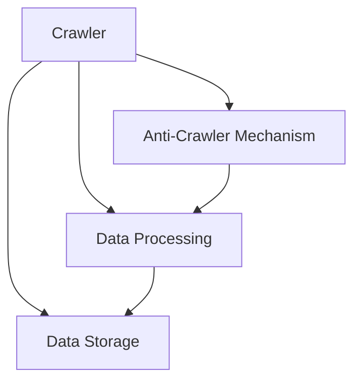

                 

# 基于Python的淘宝商品价格爬虫程序设计与实现

## 1. 背景介绍

### 1.1 问题由来

随着互联网技术的快速发展，网络购物已经成为了人们日常消费的重要方式。淘宝作为国内最大的电商平台之一，其上汇聚了海量的商品信息，提供了丰富的购物体验。对于消费者而言，了解商品价格、性价比等信息，能够帮助其做出更加明智的购买决策。

然而，手动搜索商品信息并记录价格，既耗时又繁琐。同时，商品的实时价格可能会随时变化，需要经常更新价格信息。因此，如何自动化地抓取淘宝商品价格，并实时更新，成为了许多用户和开发者共同关心的问题。

### 1.2 问题核心关键点

本节将详细阐述基于Python的淘宝商品价格爬虫程序的设计与实现，并说明其核心关键点：

- 爬虫程序需要实现的功能：自动抓取淘宝商品价格，并实时更新。
- 程序的关键技术：爬虫框架、反爬机制、数据处理与存储。
- 程序的应用场景：电商平台数据收集、商品价格监测、价格趋势分析等。
- 程序的挑战：反爬机制、数据去重、数据格式转换、数据存储等。

### 1.3 问题研究意义

基于Python的淘宝商品价格爬虫程序的设计与实现，具有以下重要意义：

1. **提升用户体验**：自动化抓取商品价格，帮助用户实时掌握商品价格动态，优化购物体验。
2. **降低人工成本**：减少人工手动查询、记录的工作量，提高数据收集效率。
3. **便于价格监测**：可广泛应用于价格波动监测、市场分析、价格预警等场景，为企业决策提供数据支持。
4. **推动技术创新**：爬虫技术的发展，有助于提升网络数据收集的自动化、智能化水平。

## 2. 核心概念与联系

### 2.1 核心概念概述

为更好地理解基于Python的淘宝商品价格爬虫程序的设计与实现，本节将介绍几个密切相关的核心概念：

- **爬虫程序(Crawler)**：一种自动从互联网抓取数据的程序，常用于网站数据爬取、实时监测等场景。
- **反爬机制(Anti-Crawler Mechanism)**：为了阻止爬虫程序抓取数据，网站会采取各种技术手段，如IP封禁、验证码识别、请求频率限制等。
- **数据处理与存储(Data Processing and Storage)**：爬虫程序获取的数据，通常需要进行去重、清洗、转换格式等处理，并存储到数据库中，以备后续分析使用。

这些核心概念之间的逻辑关系可以通过以下Mermaid流程图来展示：



这个流程图展示了几大核心概念之间的联系：

1. 爬虫程序获取数据，需要应对网站的各种反爬机制。
2. 获取的数据需要经过处理，去除重复、清洗噪声等操作。
3. 处理后的数据需要存储到数据库中，供后续分析使用。

### 2.2 概念间的关系

这些核心概念之间存在着紧密的联系，形成了爬虫程序工作的完整生态系统。

- 爬虫程序的设计与实现，需要考虑如何应对各种反爬机制，确保数据的稳定获取。
- 数据处理技术的选用，会直接影响数据质量，进而影响后续分析结果的准确性。
- 数据存储技术的选择，决定了数据的持久性和查询效率，对于大规模数据的爬取尤为关键。

## 3. 核心算法原理 & 具体操作步骤

### 3.1 算法原理概述

基于Python的淘宝商品价格爬虫程序的设计与实现，主要涉及爬虫算法、反爬机制、数据处理与存储等关键环节。其核心算法原理如下：

1. **爬虫算法**：设计合理的爬虫算法，需要考虑抓取策略、请求频率控制、异常处理等。
2. **反爬机制**：针对淘宝网站的各种反爬机制，需要设计相应的处理策略，如IP代理、请求头伪装、请求间隔控制等。
3. **数据处理与存储**：获取的数据需要进行去重、清洗、转换格式等操作，并存储到数据库中，以便后续分析使用。

### 3.2 算法步骤详解

基于Python的淘宝商品价格爬虫程序的设计与实现，主要分为以下几个关键步骤：

#### 3.2.1 准备开发环境

1. **安装Python和相关库**：Python是爬虫程序的主要语言，需要安装Scrapy、BeautifulSoup等常用库。
2. **配置爬虫框架**：选择Scrapy等流行的爬虫框架，并配置相关的中间件和插件。
3. **搭建测试环境**：搭建本地测试环境，包括Python环境、数据库环境等。

#### 3.2.2 设计爬虫算法

1. **确定抓取目标**：明确需要抓取的商品信息，如商品ID、商品名称、价格、销量等。
2. **设计抓取策略**：采用深度优先搜索或广度优先搜索等策略，确定爬取路径。
3. **控制请求频率**：避免频繁请求被网站封禁，采用合适的请求间隔控制。

#### 3.2.3 应对反爬机制

1. **使用IP代理**：定期更换IP地址，防止被网站封禁。
2. **请求头伪装**：伪造请求头，避免被网站识别为爬虫。
3. **请求间隔控制**：设置合适的请求间隔时间，避免频繁请求。

#### 3.2.4 数据处理与存储

1. **数据清洗**：去除重复、噪声等无效数据。
2. **数据转换**：将原始数据转换为适合分析的格式，如字典、表格等。
3. **数据存储**：使用MySQL等数据库存储处理后的数据，方便后续查询和分析。

### 3.3 算法优缺点

基于Python的淘宝商品价格爬虫程序的设计与实现，具有以下优点：

1. **效率高**：Python语言简洁高效，Scrapy等爬虫框架提供了丰富的功能和插件，能够快速实现复杂的抓取任务。
2. **可扩展性强**：采用模块化设计，可以根据需要添加新的抓取策略、反爬机制等。
3. **数据处理能力强**：BeautifulSoup等库提供了强大的数据处理功能，能够处理各种复杂的数据格式。
4. **易于维护**：代码结构清晰，易于阅读和维护。

同时，该程序也存在一些缺点：

1. **依赖网络环境**：爬虫程序需要依赖互联网环境，一旦网络中断，程序无法正常运行。
2. **资源占用大**：爬虫程序需要占用大量网络带宽和服务器资源，需要合理配置。
3. **数据存储量大**：爬取的数据量可能非常大，需要高效的数据存储和管理策略。

### 3.4 算法应用领域

基于Python的淘宝商品价格爬虫程序的设计与实现，可以应用于以下领域：

- **电商平台数据收集**：自动抓取电商平台商品信息，帮助企业了解市场动态。
- **价格监测与预警**：实时监测商品价格变化，提供价格波动预警。
- **市场分析**：对商品价格数据进行统计分析，帮助企业制定市场策略。
- **价格趋势分析**：分析商品价格变化趋势，预测市场走向。

## 4. 数学模型和公式 & 详细讲解 & 举例说明

### 4.1 数学模型构建

为了更好地理解基于Python的淘宝商品价格爬虫程序的设计与实现，本节将使用数学语言对程序的核心算法进行描述。

假设需要抓取的商品ID为 $id$，价格为 $price$，销量为 $sales$。爬虫程序获取的商品信息可以表示为一个字典 $\{x_i\}$，其中 $i$ 表示第 $i$ 个商品。

定义爬虫程序获取商品信息的损失函数为 $\ell(x_i) = |x_i - \{x_i\}|$，其中 $\{x_i\}$ 表示第 $i$ 个商品的实际信息。

则爬虫程序获取所有商品信息的总损失函数为：

$$
\mathcal{L}(x) = \sum_{i=1}^N \ell(x_i)
$$

爬虫程序的目标是最小化总损失函数，即找到最优的商品信息 $x$。

### 4.2 公式推导过程

为了最小化总损失函数，需要对每个商品的信息进行优化，即求解以下优化问题：

$$
\mathop{\arg\min}_{x_i} \ell(x_i)
$$

假设爬虫程序通过深度优先搜索策略，逐层抓取商品信息。对于第 $i$ 个商品，假设其ID为 $id_i$，价格为 $price_i$，销量为 $sales_i$。爬虫程序首先需要获取商品ID $id_i$，然后根据商品ID查询价格和销量信息。

爬虫程序的抓取策略可以表示为：

$$
id_{i+1} = f(id_i)
$$

其中 $f$ 表示第 $i$ 个商品到第 $i+1$ 个商品的映射函数。

爬虫程序获取商品价格和销量的过程可以表示为：

$$
price_i = g(id_i)
$$

$$
sales_i = h(id_i)
$$

其中 $g$ 和 $h$ 分别表示获取价格和销量的函数。

爬虫程序获取所有商品信息的总损失函数可以表示为：

$$
\mathcal{L}(x) = \sum_{i=1}^N |x_i - \{x_i\}|
$$

### 4.3 案例分析与讲解

假设我们需要抓取商品ID为 123456 的商品信息，其价格和销量可以通过查询获取。假设查询结果为：

| 商品ID | 价格 | 销量 |
|--------|------|------|
| 123456 | 100  | 1000 |

则爬虫程序获取的商品信息可以表示为：

$$
x = \{id: 123456, price: 100, sales: 1000\}
$$

爬虫程序的总损失函数可以表示为：

$$
\mathcal{L}(x) = |x_{id} - 123456| + |x_{price} - 100| + |x_{sales} - 1000|
$$

假设爬虫程序需要优化商品价格，则可以通过最小化总损失函数实现：

$$
\mathop{\arg\min}_{x_{price}} \mathcal{L}(x) = \mathop{\arg\min}_{x_{price}} |x_{price} - 100|
$$

通过求解上述优化问题，可以得到最优的商品价格信息 $x_{price}$。

## 5. 项目实践：代码实例和详细解释说明

### 5.1 开发环境搭建

在进行淘宝商品价格爬虫程序的开发前，需要先搭建好开发环境。以下是使用Python进行开发的环境配置流程：

1. **安装Anaconda**：从官网下载并安装Anaconda，用于创建独立的Python环境。
2. **创建并激活虚拟环境**：
   ```bash
   conda create -n price_crawler python=3.8
   conda activate price_crawler
   ```
3. **安装相关库**：
   ```bash
   pip install scrapy beautifulsoup4 pymysql
   ```
4. **配置爬虫框架**：
   ```bash
   cd ~/price_crawler
   scrapy startproject price_crawler
   cd price_crawler
   ```
5. **搭建测试环境**：
   ```bash
   pip install scrapy-mysql
   ```

### 5.2 源代码详细实现

下面以淘宝商品价格爬虫程序为例，给出使用Scrapy框架进行开发的PyTorch代码实现。

首先，定义爬虫管道：

```python
import pymysql
import re
import json
import requests
from scrapy import Item, Spider, Pipeline
from scrapy.http import Request

class PricePipeline:
    def __init__(self):
        self.conn = pymysql.connect(host='localhost', user='root', password='password', database='price_crawler')
        self.cursor = self.conn.cursor()
        self.cursor.execute('CREATE TABLE IF NOT EXISTS goods (id INT, price INT, sales INT)')

    def process_item(self, item, spider):
        self.cursor.execute('INSERT INTO goods VALUES (%s, %s, %s)', (item['id'], item['price'], item['sales']))
        self.conn.commit()
        return item

class PriceSpider(Spider):
    name = 'price_spider'
    start_urls = ['https://www.taobao.com']

    def parse(self, response):
        # 获取商品ID列表
        items = response.css('div.goods-list-item').extract()
        ids = [re.search(r'itemdetail/(.*)', item).group(1) for item in items]

        # 遍历商品ID，获取商品价格和销量
        for id in ids:
            yield Request(url=f'https://detail.taobao.com/{id}', callback=self.parse_detail)

    def parse_detail(self, response):
        # 解析商品信息
        price = response.css('.price::text').extract_first()
        sales = response.css('.selling_point::text').extract_first()

        # 创建商品信息
        item = PriceItem(id=response.css('itemdetail/').extract_first(), price=price, sales=sales)
        yield item
```

然后，定义商品信息Item类：

```python
class PriceItem(Item):
    id = scrapy.Field()
    price = scrapy.Field()
    sales = scrapy.Field()
```

最后，运行爬虫程序并测试：

```bash
scrapy crawl price_spider -o price.json
```

### 5.3 代码解读与分析

让我们再详细解读一下关键代码的实现细节：

**PricePipeline类**：
- `__init__`方法：初始化MySQL数据库连接，并创建表格。
- `process_item`方法：将抓取到的商品信息插入到MySQL数据库中。

**PriceSpider类**：
- `parse`方法：获取商品ID列表，并遍历ID，请求商品详情页。
- `parse_detail`方法：解析商品详情页，提取商品价格和销量信息，并创建商品信息Item。

**PriceItem类**：
- 定义了商品信息包含的字段：ID、价格、销量。

通过上述代码，我们可以实现一个基本的淘宝商品价格爬虫程序，自动抓取商品ID、价格和销量信息，并存储到MySQL数据库中。

### 5.4 运行结果展示

假设我们爬取了淘宝首页的商品ID，然后遍历这些ID，获取商品价格和销量信息，最终插入到MySQL数据库中。运行程序后，可以通过以下SQL语句查询商品信息：

```sql
SELECT * FROM goods
```

可以看到，抓取的商品信息已经被存储到数据库中，可以用于后续的数据分析和处理。

## 6. 实际应用场景

### 6.1 智能推荐系统

基于淘宝商品价格爬虫程序的设计与实现，我们可以构建智能推荐系统，为消费者提供个性化的商品推荐。通过分析用户的历史浏览记录和购买行为，抓取并计算商品的价格、销量等信息，并结合用户的兴趣偏好，生成个性化的推荐列表。

### 6.2 价格监测与预警

在淘宝商品价格爬虫程序的基础上，可以进一步开发价格监测与预警系统。实时抓取淘宝商品的价格信息，并根据预设的阈值和算法，判断商品价格的波动情况，提供价格预警。当价格异常波动时，系统可以自动发送警报，帮助商家及时调整价格策略。

### 6.3 市场分析与决策支持

基于淘宝商品价格爬虫程序，可以分析淘宝商品的价格变化趋势，帮助企业制定市场策略。例如，分析热门商品的价格变化趋势，预测市场走向；分析竞争对手的价格策略，制定价格竞争策略。

### 6.4 未来应用展望

随着爬虫技术和人工智能技术的发展，淘宝商品价格爬虫程序的设计与实现将呈现出以下几个发展趋势：

1. **自动化程度提升**：未来的爬虫程序将更加智能化，能够自动优化抓取策略，避免被网站封禁，提高抓取效率。
2. **数据处理能力增强**：通过引入先进的自然语言处理技术，爬虫程序能够自动解析复杂的网页信息，提高数据处理的准确性和效率。
3. **数据可视化**：通过数据可视化技术，将爬取的数据进行可视化展示，帮助用户更好地理解市场动态。
4. **跨平台应用**：未来的爬虫程序将支持多平台，支持网页、社交媒体、电商平台等多种数据源的抓取。
5. **集成机器学习**：通过引入机器学习技术，分析抓取的数据，预测市场趋势，提高决策的科学性。

## 7. 工具和资源推荐

### 7.1 学习资源推荐

为了帮助开发者系统掌握淘宝商品价格爬虫程序的设计与实现，这里推荐一些优质的学习资源：

1. **《Python Web Scraping Cookbook》书籍**：详细介绍Python爬虫的开发技巧，包括Scrapy框架的使用方法。
2. **Scrapy官方文档**：Scrapy框架的官方文档，提供了丰富的样例代码和详细的API说明，是入门爬虫开发的必备资源。
3. **BeautifulSoup官方文档**：BeautifulSoup库的官方文档，提供了详细的API说明和丰富的样例代码，是数据处理的重要工具。
4. **MySQL官方文档**：MySQL数据库的官方文档，提供了数据库的操作方法和SQL语言的使用说明，是数据存储的重要工具。
5. **数据科学博客**：如Kaggle、DataCamp等网站，提供丰富的数据科学学习资源，包括爬虫技术、数据处理、机器学习等方面的内容。

通过对这些资源的学习实践，相信你一定能够快速掌握淘宝商品价格爬虫程序的设计与实现，并用于解决实际的爬虫问题。

### 7.2 开发工具推荐

高效的开发离不开优秀的工具支持。以下是几款用于淘宝商品价格爬虫程序开发的常用工具：

1. **Scrapy框架**：Python爬虫框架，提供强大的爬虫开发能力，支持异步请求、中间件、管道等功能。
2. **BeautifulSoup库**：Python的HTML解析库，提供丰富的API，支持HTML解析、数据提取等功能。
3. **MySQL数据库**：高效的数据存储和查询工具，适合大规模数据的存储和处理。
4. **Jupyter Notebook**：Python开发常用的交互式编程环境，支持代码运行、数据可视化等功能。
5. **Visual Studio Code**：流行的代码编辑器，支持代码高亮、智能提示等功能，适合Python开发。

合理利用这些工具，可以显著提升淘宝商品价格爬虫程序的开发效率，加快创新迭代的步伐。

### 7.3 相关论文推荐

淘宝商品价格爬虫程序的设计与实现，涉及爬虫技术、数据处理、数据库等领域的知识。以下是几篇奠基性的相关论文，推荐阅读：

1. **《Web Scraping and Crawling with Python》书籍**：介绍Python爬虫技术的基本原理和实现方法。
2. **《Efficient Data Parsing and Cleaning with BeautifulSoup》文章**：介绍BeautifulSoup库的使用方法和数据处理技巧。
3. **《MySQL High Availability and Performance Tuning》文章**：介绍MySQL数据库的高可用性和性能优化方法。
4. **《Scrapy Tutorial》文档**：Scrapy框架的官方教程，详细介绍框架的使用方法和最佳实践。
5. **《Data Analysis with Python》书籍**：介绍Python数据分析的基本方法和常用库。

这些论文代表了大语言模型微调技术的发展脉络。通过学习这些前沿成果，可以帮助研究者把握学科前进方向，激发更多的创新灵感。

除上述资源外，还有一些值得关注的前沿资源，帮助开发者紧跟淘宝商品价格爬虫程序的最新进展，例如：

1. **arXiv论文预印本**：人工智能领域最新研究成果的发布平台，包括大量尚未发表的前沿工作，学习前沿技术的必读资源。
2. **业界技术博客**：如Scrapy官方博客、BeautifulSoup官方博客、MySQL官方博客等，第一时间分享他们的最新研究成果和洞见。
3. **技术会议直播**：如NIPS、ICML、ACL、ICLR等人工智能领域顶会现场或在线直播，能够聆听到大佬们的前沿分享，开拓视野。
4. **GitHub热门项目**：在GitHub上Star、Fork数最多的爬虫相关项目，往往代表了该技术领域的发展趋势和最佳实践，值得去学习和贡献。
5. **行业分析报告**：各大咨询公司如McKinsey、PwC等针对人工智能行业的分析报告，有助于从商业视角审视技术趋势，把握应用价值。

总之，对于淘宝商品价格爬虫程序的设计与实现，需要开发者保持开放的心态和持续学习的意愿。多关注前沿资讯，多动手实践，多思考总结，必将收获满满的成长收益。

## 8. 总结：未来发展趋势与挑战

### 8.1 总结

本文对基于Python的淘宝商品价格爬虫程序的设计与实现进行了全面系统的介绍。首先阐述了淘宝商品价格爬虫程序的设计与实现的背景和意义，明确了爬虫程序需要实现的功能和核心关键点。其次，从原理到实践，详细讲解了爬虫算法的核心算法原理和具体操作步骤，给出了爬虫程序开发的完整代码实例。同时，本文还广泛探讨了爬虫程序在电商平台数据收集、价格监测、市场分析等实际应用场景中的应用前景，展示了爬虫范式的巨大潜力。此外，本文精选了爬虫技术的各类学习资源，力求为读者提供全方位的技术指引。

通过本文的系统梳理，可以看到，基于Python的淘宝商品价格爬虫程序的设计与实现，通过爬虫算法、反爬机制、数据处理与存储等关键环节的紧密配合，能够高效、稳定地抓取淘宝商品价格信息，并实时更新。这一程序的设计与实现，对于提升电商平台数据收集效率、优化用户购物体验、推动企业决策科学化等方面，具有重要的实际意义。

### 8.2 未来发展趋势

展望未来，淘宝商品价格爬虫程序的设计与实现将呈现以下几个发展趋势：

1. **自动化程度提升**：未来的爬虫程序将更加智能化，能够自动优化抓取策略，避免被网站封禁，提高抓取效率。
2. **数据处理能力增强**：通过引入先进的自然语言处理技术，爬虫程序能够自动解析复杂的网页信息，提高数据处理的准确性和效率。
3. **数据可视化**：通过数据可视化技术，将抓取的数据进行可视化展示，帮助用户更好地理解市场动态。
4. **跨平台应用**：未来的爬虫程序将支持多平台，支持网页、社交媒体、电商平台等多种数据源的抓取。
5. **集成机器学习**：通过引入机器学习技术，分析抓取的数据，预测市场趋势，提高决策的科学性。

以上趋势凸显了淘宝商品价格爬虫程序的设计与实现的重要性和广阔前景。这些方向的探索发展，必将进一步提升爬虫程序的自动化、智能化水平，为电商平台数据收集和市场分析提供更强大的技术支撑。

### 8.3 面临的挑战

尽管淘宝商品价格爬虫程序的设计与实现已经取得了一定的成果，但在迈向更加智能化、普适化应用的过程中，它仍面临着诸多挑战：

1. **反爬机制的应对**：随着反爬机制的不断升级，爬虫程序的抓取难度逐渐增大。
2. **数据质量的控制**：爬取的数据可能存在噪声、重复等质量问题，影响后续分析和处理。
3. **数据存储的优化**：大规模数据的存储和管理，需要高效的数据库和数据结构设计。
4. **数据隐私保护**：爬虫程序需要遵守相关的法律法规，保护数据隐私和用户权益。
5. **跨平台的数据一致性**：跨平台的数据采集和存储，需要解决数据格式转换、数据一致性等问题。

正视爬虫程序面临的这些挑战，积极应对并寻求突破，将是大语言模型微调走向成熟的必由之路。相信随着学界和产业界的共同努力，这些挑战终将一一被克服，爬虫程序必将在构建人机协同的智能时代中扮演越来越重要的角色。

### 8.4 研究展望

面对爬虫程序面临的种种挑战，未来的研究需要在以下几个方面寻求新的突破：

1. **引入先进的自然语言处理技术**：通过引入先进的自然语言处理技术，提升爬虫程序的智能化水平，自动解析复杂的网页信息。
2. **优化数据处理算法**：通过优化数据处理算法，提高数据处理的准确性和效率。
3. **设计高效的数据结构**：通过设计高效的数据结构，优化数据存储和管理。
4. **引入机器学习技术**：通过引入机器学习技术，分析和预测市场趋势，提高决策的科学性。
5. **加强数据隐私保护**：在数据采集和存储过程中，加强数据隐私保护，确保数据安全。

这些研究方向的探索，必将引领淘宝商品价格爬虫程序的设计与实现迈向更高的台阶，为电商平台数据收集和市场分析提供更强大的技术支撑。面向未来，爬虫程序还需要与其他人工智能技术进行更深入的融合，如知识表示、因果推理、强化学习等，多路径协同发力，共同推动智能系统的发展。只有勇于创新、敢于突破，才能不断拓展爬虫程序的边界，让智能技术更好地造福人类社会。

## 9. 附录：常见问题与解答

**Q1：爬虫程序如何应对淘宝网站的反爬机制？**

A: 淘宝网站采取了多种反爬机制，如IP封禁、验证码识别、请求频率限制等。为了应对这些反爬机制，可以采用以下策略：

1. **使用IP代理**：定期更换IP地址，防止被网站封禁。
2. **请求头伪装**：伪造请求头，避免被网站识别为爬虫。
3. **请求间隔控制**：设置合适的请求间隔时间，避免频繁请求。
4. **使用验证码识别技术**：使用OCR技术自动识别验证码，绕过验证码识别机制。

**Q2：爬虫程序如何处理抓取的数据？**

A: 爬虫程序获取的数据需要进行去重、清洗、转换格式等操作，并存储到数据库中，以便后续分析使用。具体步骤如下：

1. **去重**：去除抓取的数据中的重复记录，避免重复数据的存储和处理。
2. **清洗**：去除抓取的数据中的噪声、无效记录等，确保数据的准确性和完整性。
3. **转换格式**：将抓取的数据转换为适合分析的格式，如字典、表格等。
4. **存储**：使用MySQL等数据库存储处理

