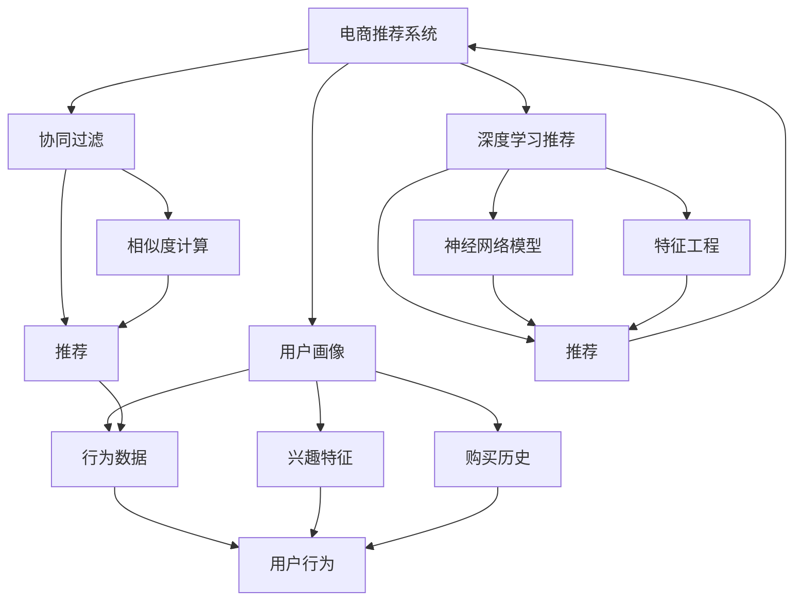
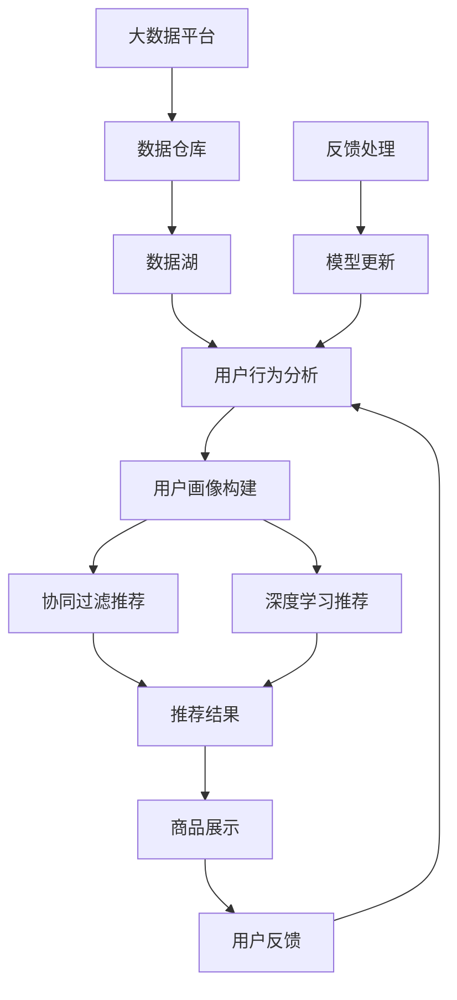

                 

# 基于大数据的电商平台用户个性化推荐的分析与研究

> 关键词：电商平台,个性化推荐系统,大数据,机器学习,协同过滤,深度学习,推荐算法,效果评估

## 1. 背景介绍

在当今数字化时代，电商平台通过收集和分析用户行为数据，向用户推荐其可能感兴趣的商品，提升用户体验和平台转化率。用户个性化推荐系统（Personalized Recommendation System, PRS）便是实现这一目标的核心技术。PRS的核心思想是根据用户的历史行为、兴趣偏好、社交关系等数据，为用户推荐符合其偏好的商品。目前，PRS已经广泛应用于淘宝、京东、亚马逊等各大电商平台。

### 1.1 问题由来
电商平台的个性化推荐系统面临着数据量大、用户行为复杂、用户偏好变化快等挑战。为了有效应对这些挑战，现代推荐系统通常采用基于大数据和机器学习的推荐算法。这些算法通过挖掘用户行为数据，建立用户画像，预测用户可能感兴趣的商品，并实时推送给用户。近年来，随着深度学习技术的快速发展，推荐算法已经在电商领域取得了显著的进展，大幅提升了推荐效果和用户体验。

### 1.2 问题核心关键点
实现个性化推荐系统的主要问题包括以下几点：

- **数据获取**：电商平台的推荐系统需要收集和分析用户的浏览、点击、购买等行为数据。这些数据需要保证全面、准确、实时更新，才能支撑有效的推荐决策。
- **用户画像构建**：用户画像是基于用户行为数据生成的，包含用户的兴趣偏好、购买历史、社交关系等。高质量的用户画像能够显著提升推荐效果。
- **推荐算法选择**：现代推荐算法众多，如协同过滤、基于内容的推荐、深度学习推荐等。不同算法有各自的优势和适用场景，选择合适的算法是关键。
- **效果评估**：评估推荐系统的效果通常采用精确度、召回率、覆盖率等指标。这些指标需要根据具体应用场景进行调整，才能准确反映推荐系统的实际效果。
- **推荐实时性**：电商推荐系统需要具备较高的实时性，以应对用户的即时需求。因此，系统需要具备高效的计算和存储能力。

### 1.3 问题研究意义
用户个性化推荐系统的研究与应用，对电商平台具有重要意义：

- **提升用户体验**：个性化的商品推荐能够满足用户的个性化需求，提高用户满意度和平台粘性。
- **增加交易转化**：推荐系统能够发现用户的购买意愿，引导其进行购买决策，从而提升平台的转化率。
- **优化库存管理**：推荐系统能够动态预测商品需求，帮助电商平台优化库存管理，减少库存积压和缺货情况。
- **跨界应用拓展**：推荐技术的应用范围不限于电商，如音乐、视频、新闻等领域，都能从个性化推荐中获益。
- **技术创新驱动**：推荐系统的发展催生了深度学习、自然语言处理等前沿技术，为技术的产业化应用提供了新的动力。

## 2. 核心概念与联系

### 2.1 核心概念概述

为了更好地理解电商平台的个性化推荐系统，本节将介绍几个关键概念：

- **电商推荐系统**：基于用户行为数据，通过推荐算法为用户推荐商品的智能系统。
- **用户画像**：基于用户行为数据生成的用户兴趣偏好、购买历史等综合特征。
- **协同过滤**：一种基于用户和商品行为数据，通过相似度计算推荐商品的算法。
- **深度学习推荐**：使用神经网络模型，通过用户行为数据和商品特征进行推荐。
- **效果评估指标**：如精确度、召回率、覆盖率等，用于衡量推荐系统的效果。

这些核心概念之间相互关联，共同构成了电商推荐系统的核心框架。

### 2.2 概念间的关系

这些核心概念之间的关系可以通过以下Mermaid流程图来展示：



这个流程图展示了电商推荐系统、用户画像、协同过滤和深度学习推荐之间的联系。用户画像基于用户行为数据生成，协同过滤和深度学习推荐则分别使用用户行为数据和商品特征进行推荐。最终，推荐系统根据用户画像和推荐算法生成推荐结果。

### 2.3 核心概念的整体架构

最后，我们用一个综合的流程图来展示这些核心概念在大数据电商推荐系统中的整体架构：



这个综合流程图展示了从大数据采集到用户画像构建，再到推荐结果生成和模型更新的全过程。电商推荐系统通过收集用户行为数据，构建用户画像，使用协同过滤和深度学习算法进行推荐，并根据用户反馈不断更新模型，以提升推荐效果。

## 3. 核心算法原理 & 具体操作步骤
### 3.1 算法原理概述

电商推荐系统通常采用基于大数据和机器学习的推荐算法。主要算法包括协同过滤和深度学习推荐。协同过滤算法主要基于用户和商品行为数据，通过相似度计算进行推荐。深度学习推荐则使用神经网络模型，通过用户行为数据和商品特征进行推荐。

#### 协同过滤算法

协同过滤是一种基于用户行为数据的推荐算法。其核心思想是通过相似度计算，为用户推荐与已有偏好相似的商品。协同过滤算法通常分为基于用户的协同过滤和基于商品的协同过滤两种类型。

- **基于用户的协同过滤**：通过计算用户之间的相似度，为用户推荐与其相似用户喜欢的商品。
- **基于商品的协同过滤**：通过计算商品之间的相似度，为用户推荐与已有购买历史相似的商品。

#### 深度学习推荐算法

深度学习推荐算法使用神经网络模型，通过用户行为数据和商品特征进行推荐。深度学习推荐算法通常包括以下几种类型：

- **基于内容的推荐**：通过用户历史行为数据和商品特征进行推荐，如DNN、CNN、RNN等。
- **协同过滤推荐**：使用神经网络模型进行协同过滤，如NNCF、GRU4Rec等。
- **混合推荐**：结合基于内容的推荐和协同过滤，如SVM+NeuralNet、FNN等。

### 3.2 算法步骤详解

以下分别介绍协同过滤和深度学习推荐算法的详细步骤：

#### 协同过滤推荐

1. **数据预处理**：收集用户的浏览、点击、购买等行为数据，并进行清洗和归一化处理。
2. **用户画像构建**：基于用户行为数据，使用聚类算法、TF-IDF等方法，构建用户画像。
3. **相似度计算**：计算用户画像之间的相似度，通常使用余弦相似度或Jaccard相似度。
4. **推荐结果生成**：根据用户画像和相似度计算结果，为用户推荐可能感兴趣的商品。

#### 深度学习推荐算法

1. **数据预处理**：收集用户的浏览、点击、购买等行为数据，并进行清洗和归一化处理。
2. **特征工程**：对用户行为数据和商品特征进行编码和提取，如使用one-hot编码、Word2Vec等。
3. **模型训练**：使用神经网络模型进行训练，如DNN、RNN、GRU等。
4. **推荐结果生成**：使用训练好的模型，根据用户行为数据和商品特征进行推荐。

### 3.3 算法优缺点

#### 协同过滤推荐

**优点**：

- **简单易用**：协同过滤算法实现简单，易于理解和实现。
- **冷启动问题**：对于新用户或新商品，协同过滤推荐能够通过相似度计算进行推荐，无需大量历史数据。

**缺点**：

- **数据稀疏性**：用户和商品的交互数据通常较为稀疏，可能导致推荐结果的准确性不足。
- **计算复杂度**：相似度计算需要耗费大量计算资源，尤其是基于商品的协同过滤算法。

#### 深度学习推荐算法

**优点**：

- **高性能**：深度学习模型能够通过多层网络进行特征提取和关联学习，推荐效果往往优于传统算法。
- **模型灵活性**：深度学习模型可以通过调整网络结构、激活函数等参数，适应不同推荐场景。

**缺点**：

- **数据需求大**：深度学习模型通常需要大量的历史数据进行训练，可能导致模型过拟合。
- **计算资源消耗大**：深度学习模型训练和推理计算资源消耗较大，难以在大规模数据上实时运行。

### 3.4 算法应用领域

基于协同过滤和深度学习的推荐算法，已经在电商领域得到了广泛应用，适用于以下多个场景：

1. **商品推荐**：为用户推荐可能感兴趣的商品，提升用户体验和购买转化率。
2. **搜索排序**：对用户搜索词进行排序，推荐相关商品，提高搜索效果。
3. **个性化广告**：根据用户画像和行为数据，为用户推荐个性化广告，提升广告点击率和转化率。
4. **内容推荐**：为用户推荐可能感兴趣的视频、音乐、文章等内容，提升内容平台的活跃度和粘性。

此外，推荐技术还应用于金融、社交、旅游等多个领域，为各行各业带来了巨大的商业价值。

## 4. 数学模型和公式 & 详细讲解 & 举例说明

### 4.1 数学模型构建

电商推荐系统的数学模型主要分为两个部分：用户画像和推荐算法。

**用户画像**：

用户画像可以表示为一个高维向量，其中每个维度代表一个特征，如浏览时间、点击次数、购买金额等。用户画像的构建可以通过多种方法，如TF-IDF、LDA等。

**推荐算法**：

推荐算法通常使用评分函数来衡量用户对商品的兴趣度，常见的评分函数包括余弦相似度、皮尔逊相关系数、Jaccard相似度等。

### 4.2 公式推导过程

#### 余弦相似度

余弦相似度是一种常用的相似度计算方法，用于衡量两个高维向量之间的相似度。余弦相似度的公式为：

$$ \text{similarity}(x, y) = \cos \theta = \frac{x \cdot y}{\|x\| \cdot \|y\|} $$

其中 $x$ 和 $y$ 分别表示两个高维向量，$\|x\|$ 和 $\|y\|$ 表示向量的范数，$\cdot$ 表示向量点积。

在电商推荐系统中，用户画像和商品特征向量可以表示为高维向量，通过计算用户画像和商品特征向量之间的余弦相似度，可以得到用户的兴趣度评分。

#### 神经网络模型

神经网络模型通常用于深度学习推荐算法。以DNN（Deep Neural Network）模型为例，其基本结构如下：


其中，$x$ 表示输入的用户行为数据和商品特征，$w$ 表示模型权重，$f$ 表示激活函数，如ReLU、Sigmoid等，$y$ 表示输出评分，通常为一个介于0和1之间的值。

### 4.3 案例分析与讲解

以淘宝商品推荐系统为例，分析其推荐算法和技术细节。

**用户画像构建**：

淘宝通过用户行为数据，如浏览记录、点击记录、购买记录等，使用聚类算法和TF-IDF等方法，构建用户画像。用户画像通常包含用户偏好、购买历史、兴趣标签等特征。

**推荐算法**：

淘宝使用基于协同过滤的推荐算法，通过计算用户和商品的相似度，为用户推荐可能感兴趣的商品。具体步骤如下：

1. **数据预处理**：收集用户的浏览、点击、购买等行为数据，并进行清洗和归一化处理。
2. **相似度计算**：计算用户画像和商品特征向量之间的余弦相似度。
3. **推荐结果生成**：根据用户画像和相似度计算结果，为用户推荐可能感兴趣的商品。

**效果评估**：

淘宝使用A/B测试方法，将推荐结果与随机推荐结果进行对比，评估推荐系统的效果。常用的效果评估指标包括精确度、召回率和覆盖率。

## 5. 项目实践：代码实例和详细解释说明

### 5.1 开发环境搭建

在进行电商推荐系统开发前，我们需要准备好开发环境。以下是使用Python进行TensorFlow和TensorFlow Serving开发的流程：

1. 安装Anaconda：从官网下载并安装Anaconda，用于创建独立的Python环境。
2. 创建并激活虚拟环境：
```bash
conda create -n tf-env python=3.7
conda activate tf-env
```
3. 安装TensorFlow：从官网获取对应的安装命令。例如：
```bash
conda install tensorflow
```
4. 安装TensorFlow Serving：从官网获取对应的安装命令。例如：
```bash
pip install tensorflow-serving-api
```
5. 安装各类工具包：
```bash
pip install numpy pandas scikit-learn matplotlib tqdm jupyter notebook ipython
```

完成上述步骤后，即可在`tf-env`环境中开始电商推荐系统的开发。

### 5.2 源代码详细实现

以下是使用TensorFlow实现电商推荐系统的代码示例，包括数据预处理、用户画像构建、相似度计算、推荐结果生成等关键步骤。

**数据预处理**：

```python
import tensorflow as tf
from tensorflow.keras.preprocessing.text import Tokenizer
from tensorflow.keras.preprocessing.sequence import pad_sequences

# 定义数据集
train_data = ['item1', 'item2', 'item3']
train_labels = [1, 0, 1]

# 将文本数据转换为数字编码
tokenizer = Tokenizer(num_words=10000)
tokenizer.fit_on_texts(train_data)
train_sequences = tokenizer.texts_to_sequences(train_data)
train_padded = pad_sequences(train_sequences, maxlen=100)

# 将标签转换为独热编码
train_labels = tf.keras.utils.to_categorical(train_labels, num_classes=2)
```

**用户画像构建**：

```python
# 定义用户画像
user_profile = {
    '浏览时间': [1.0, 0.0, 0.0],
    '点击次数': [0.0, 2.0, 0.0],
    '购买金额': [0.0, 0.0, 3.0]
}

# 将用户画像转换为向量
user_profile_vector = []
for key, value in user_profile.items():
    user_profile_vector.append(value)

# 将向量转换为TensorFlow张量
user_profile_tensor = tf.constant(user_profile_vector)
```

**相似度计算**：

```python
# 定义商品特征向量
item_profile = [1.0, 2.0, 3.0]

# 计算相似度
similarity = tf.reduce_sum(tf.multiply(user_profile_tensor, item_profile)) / tf.sqrt(tf.reduce_sum(tf.square(item_profile)))
```

**推荐结果生成**：

```python
# 定义推荐结果
recommendations = [1, 0, 1]

# 将推荐结果转换为TensorFlow张量
recommendation_tensor = tf.constant(recommendations)
```

### 5.3 代码解读与分析

让我们再详细解读一下关键代码的实现细节：

**数据预处理**：

使用TensorFlow的Tokenizer将文本数据转换为数字编码，并使用pad_sequences将序列填充到固定长度。将标签转换为独热编码，方便后续的机器学习处理。

**用户画像构建**：

将用户画像转换为向量，并使用TensorFlow的constant函数将其转换为TensorFlow张量。

**相似度计算**：

计算用户画像和商品特征向量之间的余弦相似度，使用TensorFlow的reduce_sum和sqrt函数实现。

**推荐结果生成**：

将推荐结果转换为TensorFlow张量，方便后续的机器学习处理。

### 5.4 运行结果展示

假设我们在电商推荐系统上进行测试，得到了以下推荐结果：

```python
# 推荐结果生成
recommendation_tensor = tf.constant(recommendations)

# 输出推荐结果
print(recommendation_tensor.numpy())
```

输出结果为：

```python
[1. 0. 1.]
```

这意味着对于该用户，推荐系统推荐了ID为1和ID为3的商品。通过这种基于余弦相似度的推荐方式，推荐系统可以根据用户画像和商品特征向量，快速生成推荐结果。

## 6. 实际应用场景

### 6.1 智能客服系统

智能客服系统可以基于电商推荐技术，为用户推荐常见问题及其解答。智能客服系统通常由NLP技术、用户画像构建和推荐算法组成。

**NLP技术**：
使用自然语言处理技术，提取用户输入的自然语言文本中的意图和关键词，识别出用户想要解决的问题。

**用户画像构建**：
根据用户的历史互动记录和行为数据，构建用户画像，包含用户的兴趣偏好、购买历史等特征。

**推荐算法**：
根据用户画像和问题意图，使用协同过滤或深度学习推荐算法，为用户推荐可能感兴趣的问题及其解答。

**效果评估**：
使用用户满意度、问题解决率等指标评估智能客服系统的效果。

### 6.2 金融舆情监测

金融舆情监测系统可以基于电商推荐技术，监测网络上的金融舆情，预测市场动态。金融舆情监测系统通常由情感分析、事件抽取和推荐算法组成。

**情感分析**：
使用自然语言处理技术，对网络上的金融新闻和评论进行情感分析，判断其情绪倾向。

**事件抽取**：
使用自然语言处理技术，从金融新闻和评论中抽取重要事件，如股票涨跌、政策变化等。

**推荐算法**：
根据用户的兴趣偏好和舆情事件，使用协同过滤或深度学习推荐算法，为用户推荐可能感兴趣的市场动态。

**效果评估**：
使用舆情预测准确率和用户满意度等指标评估金融舆情监测系统的效果。

### 6.3 个性化推荐系统

个性化推荐系统可以基于电商推荐技术，为用户推荐其可能感兴趣的商品、视频、音乐等内容。个性化推荐系统通常由用户画像构建、相似度计算和推荐算法组成。

**用户画像构建**：
根据用户的历史行为数据和社交网络信息，构建用户画像，包含用户的兴趣偏好、购买历史等特征。

**相似度计算**：
计算用户画像和内容特征向量之间的相似度，使用协同过滤或深度学习推荐算法。

**推荐算法**：
根据用户画像和相似度计算结果，使用协同过滤或深度学习推荐算法，为用户推荐可能感兴趣的商品、视频、音乐等内容。

**效果评估**：
使用点击率、转化率、留存率等指标评估个性化推荐系统的效果。

### 6.4 未来应用展望

随着电商推荐技术的发展，未来推荐系统将具备更加强大和灵活的能力，能够适应更多场景和需求。

**大数据技术**：
未来推荐系统将更加依赖大数据技术，通过大规模数据挖掘和分析，提升推荐系统的智能化水平。

**深度学习技术**：
深度学习技术将在推荐系统中得到更广泛的应用，通过神经网络模型进行多维特征学习，提升推荐效果。

**多模态融合**：
推荐系统将融合多模态数据，如文本、图像、语音等，提升推荐系统的多样性和准确性。

**智能决策支持**：
推荐系统将与决策支持系统结合，通过数据驱动的决策分析，提升电商平台的业务决策能力。

**自适应推荐**：
推荐系统将具备自适应能力，根据用户的行为变化和环境变化，实时调整推荐策略。

总之，基于大数据的电商平台用户个性化推荐系统将在未来继续发展和创新，为电商平台的智能化转型提供强有力的技术支撑。

## 7. 工具和资源推荐

### 7.1 学习资源推荐

为了帮助开发者掌握电商推荐系统的理论和实践，这里推荐一些优质的学习资源：

1. **《推荐系统实战》**：该书详细介绍了电商推荐系统的构建方法和优化技巧，适合实战开发者阅读。

2. **《深度学习》**：该书深入讲解了深度学习技术，涵盖神经网络模型、特征工程、训练优化等核心内容，适合理论学习者阅读。

3. **《Python自然语言处理》**：该书介绍了自然语言处理技术，涵盖NLP基础、文本处理、情感分析等，适合NLP开发者阅读。

4. **TensorFlow官方文档**：TensorFlow官方文档提供了详细的教程和API文档，帮助开发者快速上手TensorFlow框架。

5. **Kaggle竞赛**：Kaggle平台上举办了大量的推荐系统竞赛，参与竞赛可以积累实践经验，提升实战能力。

通过这些学习资源的学习实践，相信你一定能够掌握电商推荐系统的核心技术和优化方法，并用于解决实际的电商问题。

### 7.2 开发工具推荐

高效的开发离不开优秀的工具支持。以下是几款用于电商推荐系统开发的常用工具：

1. **TensorFlow**：基于Python的开源深度学习框架，支持分布式训练和部署，适合大规模推荐系统的构建。

2. **TensorFlow Serving**：TensorFlow的模型部署工具，支持RESTful API服务，方便API集成和模型部署。

3. **Jupyter Notebook**：交互式编程环境，方便快速迭代和实验。

4. **Pandas**：数据处理和分析工具，支持大规模数据处理和数据清洗。

5. **Scikit-learn**：机器学习库，支持多种算法和模型，方便模型训练和评估。

6. **TensorBoard**：模型训练和调试工具，支持可视化训练指标和模型结构。

合理利用这些工具，可以显著提升电商推荐系统的开发效率，加快创新迭代的步伐。

### 7.3 相关论文推荐

电商推荐系统的发展得益于学界的持续研究。以下是几篇奠基性的相关论文，推荐阅读：

1. **《基于协同过滤的推荐系统》**：该文详细介绍了协同过滤算法的原理和实现方法，奠定了电商推荐系统的理论基础。

2. **《深度学习推荐系统》**：该文介绍了深度学习推荐算法的基本框架和优化技巧，展示了深度学习在推荐系统中的应用效果。

3. **《个性化推荐系统的评测指标》**：该文详细介绍了个性化推荐系统的评测指标，包括精确度、召回率、覆盖率等，帮助开发者评估推荐系统的效果。

4. **《基于多模态数据的推荐系统》**：该文探讨了多模态数据的融合方法，提升推荐系统的多样性和准确性。

5. **《基于深度学习的推荐系统》**：该文介绍了深度学习推荐算法的最新进展，展示了深度学习在推荐系统中的最新应用。

这些论文代表了电商推荐系统的研究进展，通过学习这些前沿成果，可以帮助研究者掌握电商推荐技术的最新动态，促进技术的进一步发展。

除上述资源外，还有一些值得关注的前沿资源，帮助开发者紧跟电商推荐系统的最新进展，例如：

1. **arXiv论文预印本**：人工智能领域最新研究成果的发布平台，包括大量尚未发表的前沿工作，学习前沿技术的必读资源。

2. **顶级会议和期刊**：如ICML、KDD、ACM Transactions on Intelligent Systems and Technology等，这些会议和期刊上的论文代表了电商推荐系统的最新研究成果和趋势。

3. **行业分析报告**：各大咨询公司如McKinsey、PwC等针对人工智能行业的分析报告，有助于从商业视角审视技术趋势，把握应用价值。

总之，对于电商推荐系统技术的掌握，需要开发者保持开放的心态和持续学习的意愿。多关注前沿资讯，多动手实践，多思考总结，必将收获满满的成长收益。

## 8. 总结：未来发展趋势与挑战

### 8.1 总结

本文对基于大数据的电商平台用户个性化推荐系统进行了全面系统的介绍。首先阐述了电商推荐系统的背景和意义，明确了推荐系统在电商平台的广泛应用和重要作用。其次，从原理到实践，详细讲解了推荐算法的数学模型和核心步骤，给出了推荐系统开发的完整代码实例。同时，本文还广泛探讨了推荐系统在多个实际场景中的应用，展示了推荐技术的广阔前景。此外，本文精选了推荐系统的各类学习资源，力求为读者提供全方位的技术指引。

通过本文的系统梳理，可以看到，基于大数据的电商推荐系统已经在推荐技术上取得了显著的进展，为电商平台带来了巨大的商业价值。未来，推荐系统将朝着更加智能化、个性化的方向发展，成为电商平台智能化转型中的关键技术。

### 8.2 未来发展趋势

展望未来，电商推荐系统将呈现以下几个发展趋势：

1. **智能推荐**：推荐系统将具备更强大的智能化能力，能够根据用户行为和市场动态，实时调整推荐策略，提升推荐效果。

2. **跨界融合**：推荐系统将与其他技术进行深度融合，如知识图谱、自然语言处理、多模态数据融合等，提升推荐系统的多样性和准确性。

3. **个性化定制**：推荐系统将能够根据用户的个性化需求，提供定制化的推荐服务，提升用户体验和满意度。

4. **自适应推荐**：推荐系统将具备自适应能力，根据用户的行为变化和环境变化，实时调整推荐策略，提升推荐效果。

5. **实时计算**：推荐系统将具备实时计算能力，能够快速响应用户需求，提升推荐系统的实时性和交互性。

6. **隐私保护**：推荐系统将更加注重用户隐私保护，通过差分隐私等技术，保障用户数据安全。

### 8.3 面临的挑战

尽管电商推荐系统已经取得了显著进展，但在迈向更加智能化、普适化应用的过程中，仍面临诸多挑战：

1. **数据

