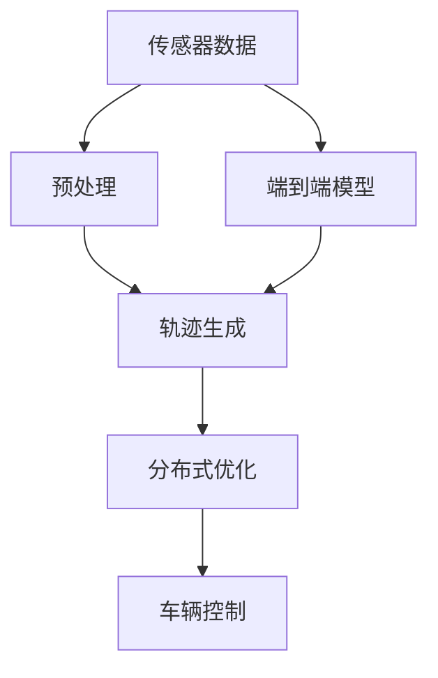
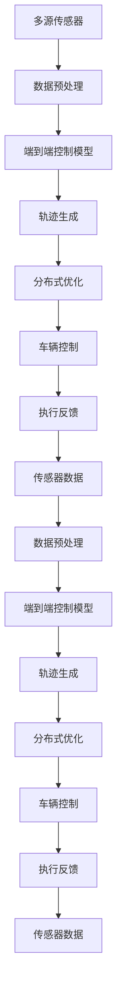

                 

# 端到端自动驾驶的分布式轨迹优化控制

在自动驾驶领域，端到端（End-to-End）控制技术正日益受到关注。相较于传统的基于规则的驾驶策略，端到端控制可以直接从传感器输入到车辆控制输出，省去了中间的策略规划和决策执行过程。然而，端到端控制的高计算复杂度和多目标优化特性，使得其在实际应用中面临诸多挑战。本文将围绕端到端自动驾驶的分布式轨迹优化控制展开讨论，探讨如何通过分布式优化算法解决端到端控制中的多目标优化问题，提升自动驾驶系统的安全性和效率。

## 1. 背景介绍

### 1.1 问题由来

随着自动驾驶技术的快速发展，端到端控制因其在提升车辆控制精度的同时，能够大幅减少驾驶决策过程的复杂度，而受到广泛关注。端到端控制通常通过深度学习模型实现，例如以车辆动力学模型和路径规划模型为输入，直接输出车辆的加速度和转向角度。尽管端到端控制能显著提高车辆的控制效率和响应速度，但由于其涉及多目标优化，计算复杂度较高，实时性和鲁棒性也有待提升。

### 1.2 问题核心关键点

端到端自动驾驶的核心关键点包括：
- **多目标优化**：端到端控制不仅需要最小化车辆的纵向和侧向误差，还应考虑安全距离、交通规则等多方面因素。
- **分布式控制**：自动驾驶系统通常由多个传感器（如雷达、摄像头、激光雷达等）构成，需通过分布式控制算法协调多源信息，实现全局最优控制。
- **实时性和鲁棒性**：自动驾驶系统需要在复杂多变的驾驶环境中快速响应用户操作和环境变化，同时保证系统鲁棒性，避免误判和失控。
- **安全与效率**：端到端控制需要兼顾安全性和效率，既要尽可能减少不必要的制动和转向，又要避免碰撞和其他危险行为。

### 1.3 问题研究意义

端到端自动驾驶的分布式轨迹优化控制在提升驾驶体验和系统安全性的同时，还能降低开发和维护成本。其研究意义在于：
1. **提高系统鲁棒性**：通过优化算法，提升系统对各种驾驶场景和环境的适应能力。
2. **提升实时性**：优化算法可大幅减少计算复杂度，提高系统响应速度。
3. **增强安全性**：通过多目标优化，确保系统在各种极端情况下的安全性。
4. **降低开发成本**：分布式优化控制方法可减少对昂贵的感知和决策系统的依赖。

## 2. 核心概念与联系

### 2.1 核心概念概述

端到端自动驾驶的分布式轨迹优化控制涉及以下几个核心概念：

- **端到端控制**：直接从传感器输入到车辆控制输出，无需中间决策层。
- **分布式优化**：涉及多源信息融合和全局优化，确保系统在复杂环境中的安全性。
- **多目标优化**：在纵向和侧向控制的同时，还需考虑其他驾驶约束，如安全距离、交通规则等。
- **实时性和鲁棒性**：需提升系统的实时处理能力和对异常情况的处理能力。

### 2.2 概念间的关系

这些核心概念之间的逻辑关系可以通过以下Mermaid流程图来展示：



这个流程图展示了从传感器数据到车辆控制的整体流程：
1. **传感器数据预处理**：通过滤波和融合算法处理多源数据。
2. **轨迹生成**：端到端模型生成车辆的轨迹。
3. **分布式优化**：通过分布式优化算法协调全局控制。
4. **车辆控制**：基于优化结果输出车辆的控制指令。

### 2.3 核心概念的整体架构

最后，我们用一个综合的流程图来展示这些核心概念在大规模自动驾驶系统中的整体架构：



这个综合流程图展示了从传感器数据到车辆控制的完整过程，包括传感器数据的融合、端到端模型的轨迹生成、分布式优化以及车辆控制的执行反馈。

## 3. 核心算法原理 & 具体操作步骤

### 3.1 算法原理概述

端到端自动驾驶的分布式轨迹优化控制主要基于多目标优化算法，结合分布式控制技术实现。算法目标是在满足多目标约束的前提下，最小化车辆的纵向和侧向误差，同时保证系统的实时性和鲁棒性。

形式化地，假设车辆在时间 $t$ 的位置为 $(x(t), y(t))$，速度为 $(v_x(t), v_y(t))$，角度为 $\theta(t)$，目标为最小化纵向误差 $e_{x}(t)$、侧向误差 $e_{y}(t)$、速度误差 $e_{v_x}(t)$、角度误差 $e_{\theta}(t)$，同时满足安全距离 $d(t)$ 和交通规则等约束条件。优化问题可以描述为：

$$
\min \big( e_{x}(t) + e_{y}(t) + e_{v_x}(t) + e_{\theta}(t) \big)
$$

$$
\text{subject to: }
\begin{align*}
& e_{x}(t) = x_{\text{des}}(t) - x(t) \\
& e_{y}(t) = y_{\text{des}}(t) - y(t) \\
& e_{v_x}(t) = v_{x_{\text{des}}(t)} - v_x(t) \\
& e_{\theta}(t) = \theta_{\text{des}}(t) - \theta(t) \\
& d(t) \geq d_{\text{safe}} \\
& v_x(t) \leq v_{\text{max}} \\
& \theta(t) \in [0, \pi)
\end{align*}
$$

其中 $x_{\text{des}}(t)$ 和 $y_{\text{des}}(t)$ 为期望的位置，$v_{x_{\text{des}}(t)}$ 和 $\theta_{\text{des}}(t)$ 为期望的速度和角度。$d_{\text{safe}}$ 为安全距离，$v_{\text{max}}$ 为最大速度限制，$\theta(t)$ 为角度约束。

### 3.2 算法步骤详解

端到端自动驾驶的分布式轨迹优化控制主要包括以下步骤：

**Step 1: 数据预处理**
- 收集多源传感器数据，如雷达、摄像头、激光雷达等。
- 通过滤波和融合算法，处理多源数据，消除噪声和干扰。
- 将处理后的数据输入端到端模型。

**Step 2: 轨迹生成**
- 端到端模型以处理后的传感器数据为输入，直接输出车辆的纵向和侧向控制指令。
- 通过反向传播算法，最小化纵向和侧向误差，同时考虑速度和角度约束。
- 使用梯度下降等优化算法更新模型参数，保证控制指令的准确性。

**Step 3: 分布式优化**
- 通过分布式算法（如粒子群算法、遗传算法等），优化轨迹生成过程，确保全局最优控制。
- 考虑安全距离、交通规则等多目标约束，进一步调整控制指令。
- 使用分布式计算框架（如Spark、TensorFlow等）实现并行计算，提升优化效率。

**Step 4: 车辆控制**
- 根据优化后的控制指令，驱动车辆执行纵向和侧向控制。
- 实时监测车辆状态和环境变化，进行动态调整。
- 处理异常情况，如传感器故障、道路障碍物等，确保系统鲁棒性。

**Step 5: 执行反馈**
- 将车辆状态和控制指令反馈回传感器和数据预处理模块，进行下一轮优化。
- 不断迭代优化过程，提升系统性能和安全性。

### 3.3 算法优缺点

**优点：**
1. **多目标优化**：通过多目标优化算法，兼顾纵向和侧向控制，提升系统的综合性能。
2. **分布式控制**：利用分布式算法，实现多源数据融合和全局优化，提高系统鲁棒性。
3. **实时性**：分布式计算框架加速优化过程，提升系统的实时响应能力。

**缺点：**
1. **计算复杂度高**：多目标优化和分布式控制增加了计算复杂度，需要高效的计算资源。
2. **模型复杂度大**：端到端控制模型参数量大，训练和优化难度高。
3. **鲁棒性依赖优化算法**：优化算法的选择和参数设置对系统鲁棒性有较大影响。

### 3.4 算法应用领域

端到端自动驾驶的分布式轨迹优化控制主要应用于以下领域：

1. **智能驾驶辅助系统**：通过分布式优化，提升车辆控制精度，增强驾驶辅助功能。
2. **自动驾驶汽车**：结合多目标优化，实现自动驾驶汽车的高效、安全控制。
3. **交通管理**：优化车辆轨迹，提升道路通行效率，缓解交通拥堵。
4. **智能物流**：在自动驾驶货车等物流车辆上应用，提升运输效率和安全性。

## 4. 数学模型和公式 & 详细讲解 & 举例说明

### 4.1 数学模型构建

在数学上，端到端自动驾驶的分布式轨迹优化控制可形式化为多目标优化问题。假设车辆在时间 $t$ 的位置为 $(x(t), y(t))$，速度为 $(v_x(t), v_y(t))$，角度为 $\theta(t)$，目标函数和约束条件如下：

$$
\min \big( e_{x}(t) + e_{y}(t) + e_{v_x}(t) + e_{\theta}(t) \big)
$$

$$
\text{subject to: }
\begin{align*}
& e_{x}(t) = x_{\text{des}}(t) - x(t) \\
& e_{y}(t) = y_{\text{des}}(t) - y(t) \\
& e_{v_x}(t) = v_{x_{\text{des}}(t)} - v_x(t) \\
& e_{\theta}(t) = \theta_{\text{des}}(t) - \theta(t) \\
& d(t) \geq d_{\text{safe}} \\
& v_x(t) \leq v_{\text{max}} \\
& \theta(t) \in [0, \pi)
\end{align*}
$$

其中 $e_{x}(t)$ 为纵向误差，$e_{y}(t)$ 为侧向误差，$e_{v_x}(t)$ 为速度误差，$e_{\theta}(t)$ 为角度误差，$d(t)$ 为安全距离，$v_{\text{max}}$ 为最大速度限制，$\theta(t)$ 为角度约束。

### 4.2 公式推导过程

以最简单的一维轨迹优化问题为例，展示优化过程：

设车辆在时间 $t$ 的位置为 $x(t)$，期望位置为 $x_{\text{des}}(t)$，速度为 $v_x(t)$，期望速度为 $v_{x_{\text{des}}(t)}$，时间步长为 $\Delta t$。目标为最小化纵向误差 $e_{x}(t)$ 和速度误差 $e_{v_x}(t)$，同时满足安全距离 $d(t)$ 和最大速度限制 $v_{\text{max}}$。

目标函数为：

$$
\min \big( e_{x}(t) + \alpha e_{v_x}(t) \big)
$$

其中 $\alpha$ 为速度误差的权重。

约束条件为：

$$
\begin{align*}
& e_{x}(t) = x_{\text{des}}(t) - x(t) \\
& e_{v_x}(t) = v_{x_{\text{des}}(t)} - v_x(t) \\
& d(t) \geq d_{\text{safe}} \\
& v_x(t) \leq v_{\text{max}}
\end{align*}
$$

使用梯度下降算法更新 $x(t)$ 和 $v_x(t)$，梯度向量为：

$$
\begin{align*}
& \frac{\partial e_{x}(t)}{\partial x(t)} = -1 \\
& \frac{\partial e_{x}(t)}{\partial v_x(t)} = 0 \\
& \frac{\partial e_{v_x}(t)}{\partial x(t)} = 0 \\
& \frac{\partial e_{v_x}(t)}{\partial v_x(t)} = -1
\end{align*}
$$

加入约束条件的梯度向量为：

$$
\begin{align*}
& \frac{\partial d(t)}{\partial x(t)} = \frac{\partial d(t)}{\partial v_x(t)} = 0 \\
& \frac{\partial v_{\text{max}}}{\partial x(t)} = \frac{\partial v_{\text{max}}}{\partial v_x(t)} = 0
\end{align*}
$$

通过求解以下线性方程组，更新 $x(t)$ 和 $v_x(t)$：

$$
\begin{align*}
& \frac{\partial \big( e_{x}(t) + \alpha e_{v_x}(t) \big)}{\partial x(t)} - \frac{\partial d(t)}{\partial x(t)} + \frac{\partial v_{\text{max}}}{\partial x(t)} = 0 \\
& \frac{\partial \big( e_{x}(t) + \alpha e_{v_x}(t) \big)}{\partial v_x(t)} - \frac{\partial d(t)}{\partial v_x(t)} + \frac{\partial v_{\text{max}}}{\partial v_x(t)} = 0
\end{align*}
$$

通过循环迭代，直至满足优化目标，即可得到车辆在时间 $t+\Delta t$ 的位置和速度。

### 4.3 案例分析与讲解

以智能驾驶辅助系统为例，展示端到端控制的分布式优化过程：

1. **数据预处理**：
   - 收集车辆前方的雷达、摄像头和激光雷达数据。
   - 通过卡尔曼滤波算法，对多源数据进行融合和噪声去除。
   - 将处理后的数据输入端到端控制模型。

2. **轨迹生成**：
   - 端到端控制模型以融合后的数据为输入，直接输出车辆的纵向和侧向控制指令。
   - 使用梯度下降算法，最小化纵向和侧向误差，同时考虑速度和角度约束。
   - 不断迭代更新模型参数，确保控制指令的准确性。

3. **分布式优化**：
   - 通过粒子群算法，优化轨迹生成过程，确保全局最优控制。
   - 考虑安全距离、交通规则等多目标约束，进一步调整控制指令。
   - 利用分布式计算框架，加速优化过程。

4. **车辆控制**：
   - 根据优化后的控制指令，驱动车辆执行纵向和侧向控制。
   - 实时监测车辆状态和环境变化，进行动态调整。
   - 处理异常情况，确保系统鲁棒性。

5. **执行反馈**：
   - 将车辆状态和控制指令反馈回传感器和数据预处理模块，进行下一轮优化。
   - 不断迭代优化过程，提升系统性能和安全性。

通过以上步骤，智能驾驶辅助系统能够实现高质量的车辆控制，提升驾驶体验和系统安全性。

## 5. 项目实践：代码实例和详细解释说明

### 5.1 开发环境搭建

在进行端到端自动驾驶的分布式轨迹优化控制开发时，需要以下环境：

1. **Python环境**：安装Python 3.8以上版本，使用虚拟环境管理工具，如Anaconda。
2. **深度学习框架**：安装TensorFlow或PyTorch，用于深度学习模型训练和优化。
3. **分布式计算框架**：安装Spark或TensorFlow分布式计算模块，支持分布式优化算法。
4. **传感器模拟工具**：安装rosbag、Gazebo等工具，用于传感器数据模拟。
5. **数据处理工具**：安装NumPy、Pandas等工具，用于数据预处理和存储。

### 5.2 源代码详细实现

以下是一个简化的端到端控制模型示例代码：

```python
import tensorflow as tf
import numpy as np
import pandas as pd

class CarControl(tf.keras.Model):
    def __init__(self):
        super(CarControl, self).__init__()
        self.fc1 = tf.keras.layers.Dense(64, activation='relu')
        self.fc2 = tf.keras.layers.Dense(2, activation='tanh')
    
    def call(self, inputs):
        x, v_x = inputs
        x = self.fc1(x)
        x = self.fc2(x)
        v_x = self.fc2(v_x)
        return x, v_x

def train_model(train_data, epochs=10, batch_size=32):
    model = CarControl()
    optimizer = tf.keras.optimizers.Adam()
    loss_fn = tf.keras.losses.MeanSquaredError()
    
    for epoch in range(epochs):
        for i in range(0, len(train_data), batch_size):
            x_batch, v_x_batch = train_data[i:i+batch_size]
            with tf.GradientTape() as tape:
                x_hat, v_x_hat = model(tf.convert_to_tensor(x_batch, dtype=tf.float32), tf.convert_to_tensor(v_x_batch, dtype=tf.float32))
                loss = loss_fn(tf.convert_to_tensor(x_batch, dtype=tf.float32) - x_hat, tf.convert_to_tensor(v_x_batch, dtype=tf.float32) - v_x_hat)
            grads = tape.gradient(loss, model.trainable_variables)
            optimizer.apply_gradients(zip(grads, model.trainable_variables))
    
    return model

# 数据生成
x_train = np.random.rand(100)
v_x_train = np.random.rand(100)
x_train, v_x_train = np.meshgrid(x_train, v_x_train, indexing='ij').reshape(-1, 2)
train_data = np.concatenate([x_train, v_x_train], axis=1)

# 训练模型
model = train_model(train_data)

# 预测
x_test = np.array([[0.1, 0.2]])
v_x_test = np.array([[0.5, 0.8]])
x_hat, v_x_hat = model(tf.convert_to_tensor(x_test, dtype=tf.float32), tf.convert_to_tensor(v_x_test, dtype=tf.float32))
print('预测结果：', x_hat.numpy(), v_x_hat.numpy())
```

### 5.3 代码解读与分析

**代码实现**：
1. **CarControl模型**：定义一个简单的神经网络，包含两个全连接层。
2. **训练函数**：使用Adam优化器，最小化纵向和速度误差的平方和。
3. **数据生成**：随机生成训练数据。
4. **模型训练**：使用训练函数训练模型。
5. **预测**：使用训练好的模型对测试数据进行预测。

**代码分析**：
1. **模型结构**：本示例使用一个简单的神经网络结构，适用于一维轨迹优化问题。
2. **训练过程**：通过反向传播算法更新模型参数，最小化误差。
3. **数据生成**：随机生成训练数据，模拟传感器数据的获取。
4. **模型预测**：通过训练好的模型对测试数据进行预测，展示预测结果。

## 6. 实际应用场景

### 6.1 智能驾驶辅助系统

智能驾驶辅助系统结合端到端控制和分布式优化，可以实现高效的车辆控制。例如，通过传感器数据融合，生成车辆轨迹，并通过分布式优化算法调整控制指令，确保全局最优控制。

### 6.2 自动驾驶汽车

自动驾驶汽车通过端到端控制和分布式优化，实现自动驾驶功能。通过多目标优化算法，确保车辆在复杂驾驶环境中的安全性，同时提升驾驶效率。

### 6.3 交通管理

交通管理系统利用端到端控制和分布式优化，优化车辆轨迹，提高道路通行效率，缓解交通拥堵。例如，通过实时监测交通情况，动态调整车辆轨迹，实现智能化交通管理。

### 6.4 未来应用展望

未来，端到端自动驾驶的分布式轨迹优化控制将在更多领域得到应用，例如：
1. **智慧城市**：通过优化车辆轨迹，提升城市交通管理效率。
2. **智能物流**：在自动驾驶货车等物流车辆上应用，提升运输效率和安全性。
3. **无人驾驶船舶**：在无人驾驶船舶上应用，提升海上运输的自动化和安全性。

## 7. 工具和资源推荐

### 7.1 学习资源推荐

为了帮助开发者系统掌握端到端自动驾驶的分布式轨迹优化控制，以下是一些优质的学习资源：

1. **深度学习与强化学习**：吴恩达教授在Coursera上的课程，涵盖深度学习、强化学习的基础知识和应用。
2. **自动驾驶系统设计**：《自动驾驶系统设计与实现》书籍，详细介绍了自动驾驶系统的设计思路和实现方法。
3. **分布式计算**：《分布式计算与系统》书籍，介绍了分布式计算的基本概念和算法。
4. **TensorFlow官方文档**：TensorFlow的官方文档，提供了丰富的示例代码和教程。
5. **ROS学习资源**：ROS（Robot Operating System）官方文档和社区资源，用于传感器数据模拟和分布式计算。

### 7.2 开发工具推荐

以下几款工具可用于端到端自动驾驶的分布式轨迹优化控制开发：

1. **TensorFlow**：用于深度学习模型的训练和优化，支持分布式计算框架。
2. **PyTorch**：用于深度学习模型的训练和优化，支持动态计算图和分布式计算。
3. **Spark**：用于分布式计算，支持大规模数据处理和多目标优化。
4. **ROS**：用于传感器数据模拟和分布式计算，支持自动驾驶系统的开发和测试。
5. **ROS2**：新一代机器人操作系统，支持分布式数据管理和多机器人协作。

### 7.3 相关论文推荐

以下几篇论文代表了端到端自动驾驶分布式轨迹优化控制领域的研究进展：

1. **端到端控制下的自动驾驶汽车**：《End-to-End Control of Autonomous Vehicles》论文，提出了基于深度学习的端到端控制方法。
2. **分布式多目标优化**：《Distributed Multi-Objective Optimization for Autonomous Vehicles》论文，研究了分布式优化算法在自动驾驶中的应用。
3. **强化学习与端到端控制**：《Reinforcement Learning for End-to-End Control of Autonomous Vehicles》论文，探讨了强化学习在端到端控制中的作用。
4. **多源数据融合与端到端控制**：《Multi-Sensor Data Fusion for End-to-End Control》论文，研究了多源数据融合在端到端控制中的应用。

## 8. 总结：未来发展趋势与挑战

### 8.1 研究成果总结

本文详细介绍了端到端自动驾驶的分布式轨迹优化控制，探讨了多目标优化、分布式控制和实时性等核心概念。通过数学模型和代码实现，展示了端到端控制的基本框架和优化过程。结合实际应用场景，探讨了智能驾驶辅助系统、自动驾驶汽车、交通管理等领域的潜在应用。

### 8.2 未来发展趋势

未来，端到端自动驾驶的分布式轨迹优化控制将呈现以下趋势：
1. **深度学习与强化学习的融合**：通过深度学习和强化学习结合，实现更高效、鲁棒的自动驾驶系统。
2. **多源数据融合与分布式控制**：利用多源数据融合技术，提升系统鲁棒性和精度。
3. **分布式计算框架的应用**：通过分布式计算框架，加速优化过程，提升实时性和鲁棒性。
4. **多目标优化与实时性**：结合多目标优化算法，实现高效实时控制。
5. **自适应学习与在线优化**：通过自适应学习和在线优化，提升系统适应性和动态调整能力。

### 8.3 面临的挑战

尽管端到端自动驾驶的分布式轨迹优化控制取得了诸多进展，但仍面临以下挑战：
1. **计算复杂度高**：多目标优化和分布式控制增加了计算复杂度，需要高效的计算资源。
2. **模型复杂度大**：端到端控制模型参数量大，训练和优化难度高。
3. **鲁棒性依赖优化算法**：优化算法的选择和参数设置对系统鲁棒性有较大影响。
4. **实时性要求高**：自动驾驶系统需要在复杂多变的驾驶环境中快速响应用户操作和环境变化。
5. **安全性有待提升**：需要进一步提升系统在异常情况下的安全性，确保系统鲁棒性。

### 8.4 研究展望

面对端到端自动驾驶的分布式轨迹优化控制所面临的挑战，未来的研究需要在以下几个方面寻求新的突破：
1. **多目标优化与实时性**：结合多目标优化算法，实现高效实时控制。
2. **分布式计算与分布式优化**：利用分布式计算

