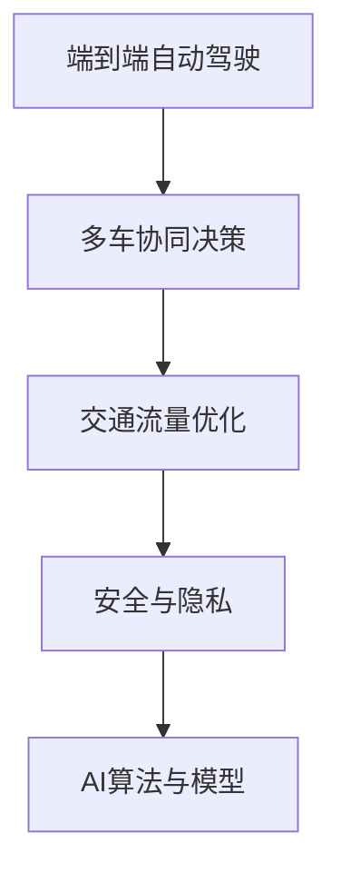
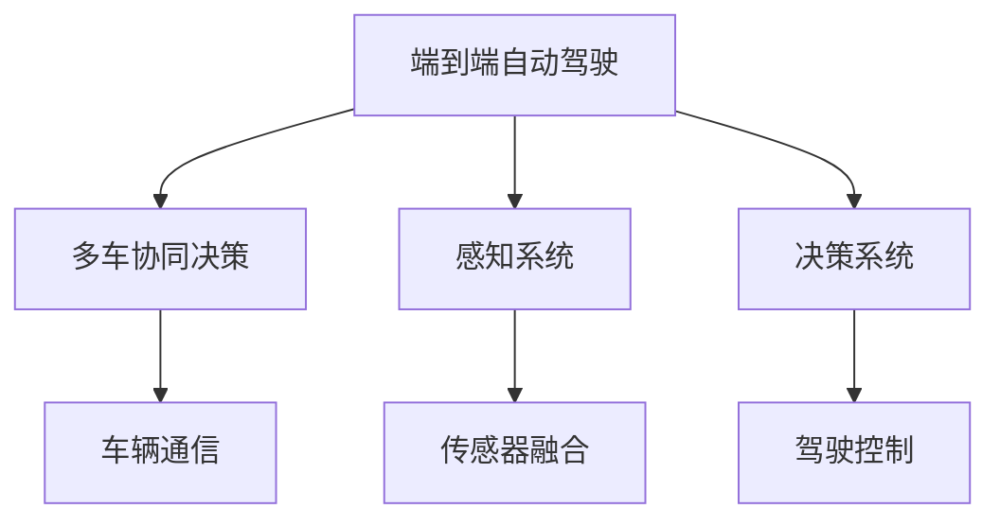
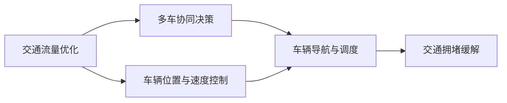
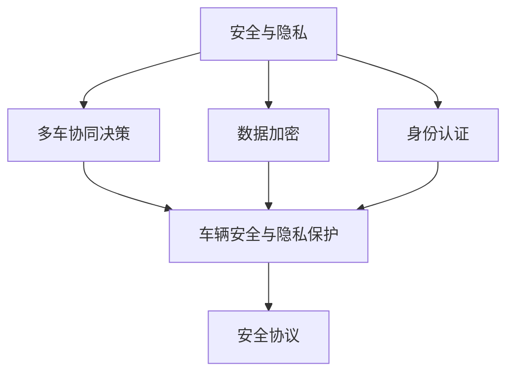
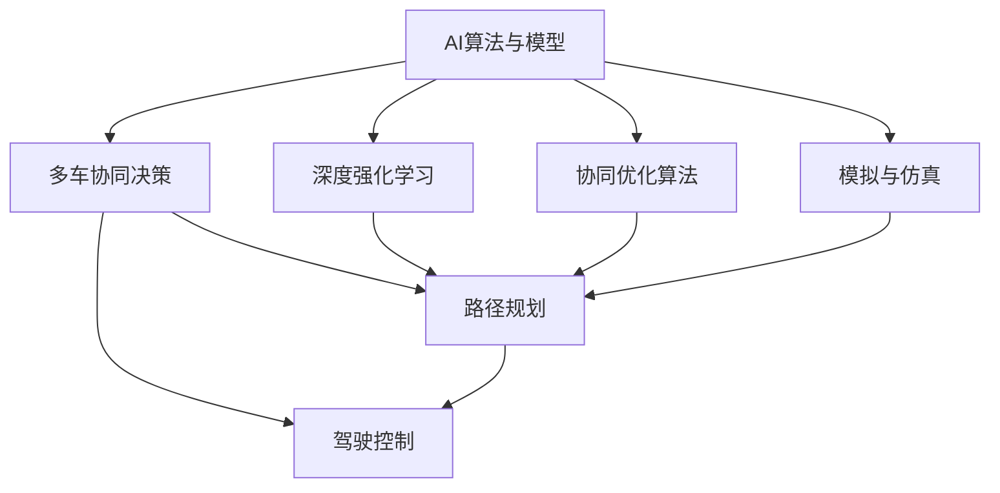
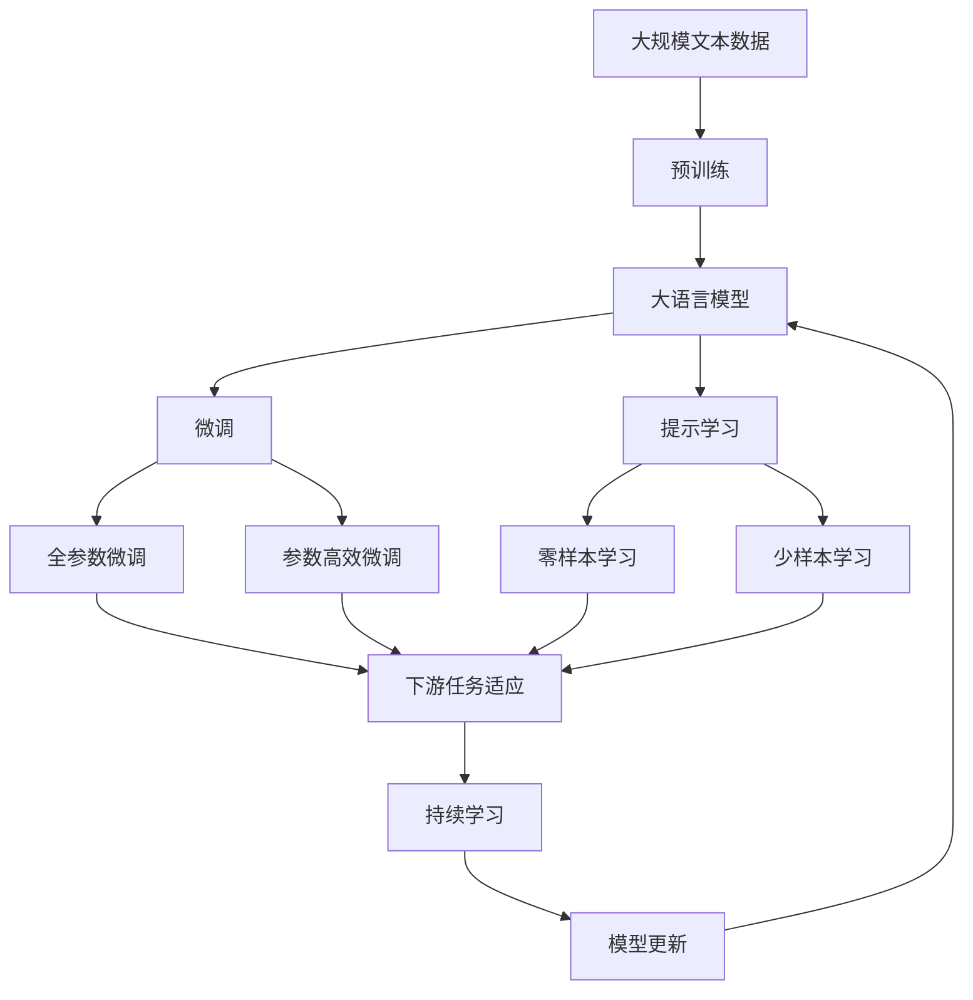

                 

# 端到端自动驾驶的多车协同决策框架

> 关键词：端到端自动驾驶,多车协同决策,交通流量优化,安全与隐私,AI算法与模型

## 1. 背景介绍

随着自动驾驶技术的发展，端到端自动驾驶系统(End-to-End Autonomous Driving, E2E AD)逐渐成为未来交通系统的主流解决方案。E2E AD 系统通常采用集中式决策结构，车辆通过中心化的交通管理中心进行统一的路径规划与控制。然而，这种集中式架构在应对大规模、动态变化的城市交通场景时，存在计算复杂度高、通信延迟大、决策鲁棒性差等问题，难以满足实际应用需求。

为了克服集中式决策架构的局限性，近年来研究人员开始探索基于多车协同决策的分布式自动驾驶系统。多车协同决策系统利用车车通信、车路通信技术，通过车辆之间的信息交互和协作，实现局部最优决策，最终达到全局最优效果。该架构能够提高自动驾驶系统的安全性和效率，降低对中心控制中心的依赖，从而实现更加灵活、可靠、高效的自动驾驶系统。

本文聚焦于端到端自动驾驶的多车协同决策框架，系统性地探讨了其在城市交通管理中的应用，包括系统架构、通信协议、协同算法等关键技术，以及未来的发展趋势和挑战。

## 2. 核心概念与联系

### 2.1 核心概念概述

为更好地理解端到端自动驾驶的多车协同决策框架，本节将介绍几个密切相关的核心概念：

- 端到端自动驾驶（E2E AD）：指从感知、决策到控制的完整自动驾驶流程，通过端到端的学习和训练，系统能够直接从原始传感器数据中生成驾驶行为，而无需中间的人工规则和手动干预。
- 多车协同决策（Vehicle Collaboration Decision Making, VCDM）：指多辆车之间通过通信共享感知信息，协作完成路径规划和驾驶决策，从而提高整体交通系统的安全性和效率。
- 交通流量优化（Traffic Flow Optimization, TFO）：通过控制车辆的速度和位置，调整交通流，实现交通流的动态平衡和优化。
- 安全与隐私（Security and Privacy）：在多车协同决策过程中，需要保障数据传输和处理的安全性，同时保护车辆隐私，防止信息泄露和滥用。
- AI算法与模型（AI Algorithms and Models）：用于实现车辆感知、路径规划和驾驶决策的AI算法和模型，如深度强化学习、协同优化算法等。

这些核心概念之间的逻辑关系可以通过以下Mermaid流程图来展示：



这个流程图展示了大语言模型的核心概念及其之间的关系：

1. 端到端自动驾驶系统通过多车协同决策提高性能。
2. 协同决策需要交通流量优化作为支撑。
3. 安全与隐私是协同决策中必须考虑的关键因素。
4. AI算法与模型是实现协同决策的底层技术。

### 2.2 概念间的关系

这些核心概念之间存在着紧密的联系，形成了多车协同决策系统的完整生态系统。下面我们通过几个Mermaid流程图来展示这些概念之间的关系。

#### 2.2.1 端到端自动驾驶与多车协同决策的关系



这个流程图展示了大语言模型的核心概念及其之间的关系：

1. 端到端自动驾驶系统通过感知系统获取周围环境信息，决策系统根据感知结果生成驾驶行为，驾驶控制系统执行决策。
2. 多车协同决策系统通过车辆通信实现信息共享，协作生成全局最优的驾驶决策。

#### 2.2.2 交通流量优化与多车协同决策的关系



这个流程图展示了交通流量优化与多车协同决策之间的关系：

1. 交通流量优化通过调整车辆位置和速度，实现交通流的动态平衡和优化。
2. 多车协同决策系统利用交通流量优化结果，协同生成全局最优的驾驶决策。

#### 2.2.3 安全与隐私在多车协同决策中的应用



这个流程图展示了安全与隐私在多车协同决策中的应用：

1. 多车协同决策系统通过数据加密和身份认证保障通信安全。
2. 车辆之间通过安全协议进行信息交互，保护隐私信息。

#### 2.2.4 AI算法与模型在多车协同决策中的应用



这个流程图展示了AI算法与模型在多车协同决策中的应用：

1. AI算法与模型通过深度强化学习和协同优化算法实现车辆之间的协作决策。
2. 模拟与仿真用于测试和优化算法效果，保障协同决策系统的稳定性和鲁棒性。

### 2.3 核心概念的整体架构

最后，我们用一个综合的流程图来展示这些核心概念在大语言模型微调过程中的整体架构：



这个综合流程图展示了从预训练到微调，再到持续学习的完整过程。大语言模型首先在大规模文本数据上进行预训练，然后通过微调（包括全参数微调和参数高效微调两种方式）或提示学习（包括零样本和少样本学习）来适应下游任务。最后，通过持续学习技术，模型可以不断更新和适应新的任务和数据。

## 3. 核心算法原理 & 具体操作步骤
### 3.1 算法原理概述

端到端自动驾驶的多车协同决策框架通过分布式决策算法，实现车辆之间的信息共享和协作决策。其核心思想是：车辆通过车车通信和车路通信，实时交换位置、速度和环境信息，共享感知数据，从而实现局部最优决策，最终达到全局最优效果。

形式化地，假设车辆集合为 $V$，环境为 $E$，决策函数为 $D$，则多车协同决策的优化目标是最小化全局成本函数 $C$，即：

$$
\min_{x} C(x)
$$

其中 $x$ 表示车辆状态和行为，$C(x)$ 表示全局成本，包括交通流量、事故风险、车辆能耗等。在实际应用中，$C(x)$ 可以通过模型或经验公式计算得到。

通过优化上述成本函数，协同决策系统可以找到最优的车辆状态和行为，从而实现交通流的动态平衡和优化。

### 3.2 算法步骤详解

端到端自动驾驶的多车协同决策框架主要包括以下几个关键步骤：

**Step 1: 系统架构设计**
- 设计车辆通信协议，包括消息格式、传输速率等。
- 确定车辆之间的通信范围和频率。
- 设计车路通信协议，如V2I、V2X等。

**Step 2: 感知与感知信息融合**
- 通过车辆传感器获取周边环境信息，如摄像头、雷达、激光雷达等。
- 使用多传感器融合技术，提升环境感知能力。
- 通过车车通信和车路通信，实现环境信息的共享和融合。

**Step 3: 决策与路径规划**
- 基于共享的环境信息，设计决策函数，实现车辆行为的优化。
- 利用交通流量优化算法，调整车辆位置和速度，实现交通流的优化。
- 通过协同优化算法，实现车辆之间的协调决策。

**Step 4: 控制与执行**
- 根据决策结果，生成车辆控制指令。
- 通过车辆的执行器，如转向机构、加速器等，实现车辆的精准控制。
- 实时监测车辆状态和环境变化，根据实际情况进行动态调整。

**Step 5: 安全与隐私保护**
- 设计安全协议，保障数据传输和处理的安全性。
- 采用数据加密和身份认证技术，防止信息泄露和滥用。
- 定期更新系统软件和算法，保障系统的安全性。

### 3.3 算法优缺点

端到端自动驾驶的多车协同决策框架具有以下优点：
1. 提高系统安全性和效率：通过车辆之间的协作决策，能够及时发现并规避潜在风险，提升交通系统的整体安全性。
2. 增强环境感知能力：通过车车通信和车路通信，车辆能够共享更丰富的环境信息，提升感知能力。
3. 降低对中心控制中心的依赖：分布式决策架构，减少对中心控制中心的依赖，提高系统的稳定性和可靠性。
4. 实现更优的交通流管理：通过优化成本函数，实现交通流的动态平衡和优化。

同时，该框架也存在以下缺点：
1. 系统复杂度高：多车协同决策系统需要处理大量的通信数据和环境信息，计算复杂度高。
2. 通信延迟大：车车通信和车路通信需要实时性高、低延迟的通信协议和硬件设备支持。
3. 决策鲁棒性差：协同决策系统依赖于通信的实时性和准确性，一旦通信中断或延迟较大，决策效果可能受到影响。
4. 系统更新困难：多车协同决策系统需要不断更新和优化算法，以适应环境变化和系统升级。

### 3.4 算法应用领域

端到端自动驾驶的多车协同决策框架在多个领域具有广泛的应用前景：

- 城市交通管理：通过多车协同决策系统，优化交通流，缓解交通拥堵，提升城市交通效率。
- 物流配送：在智能物流系统中，通过多车协同决策，实现货物的高效运输和配送，降低物流成本。
- 智能停车场：通过多车协同决策，优化车辆进出和停放策略，提升停车场利用率。
- 自动驾驶出租车：在自动驾驶出租车系统中，通过多车协同决策，提高车辆的运行效率和安全性。
- 自动驾驶公交车：在自动驾驶公交车系统中，通过多车协同决策，优化线路和站点调度，提高公交运行效率。

## 4. 数学模型和公式 & 详细讲解 & 举例说明

### 4.1 数学模型构建

本节将使用数学语言对端到端自动驾驶的多车协同决策框架进行更加严格的刻画。

记车辆集合为 $V=\{v_1,v_2,\ldots,v_n\}$，每个车辆的当前状态为 $x_i=(x_{i,x},x_{i,y},x_{i,\theta},x_{i,v})$，其中 $(x_{i,x},x_{i,y})$ 表示车辆在平面上的位置，$x_{i,\theta}$ 表示车辆的朝向角度，$x_{i,v}$ 表示车辆的速度。车辆间的通信协议定义了车辆之间交换的信息内容，如位置、速度、朝向角度等。

设环境为 $E=\{e_1,e_2,\ldots,e_m\}$，每个环境信息 $e_j$ 包含车辆感知到的道路、行人、障碍物等状态。环境信息通过车车通信和车路通信实时更新，供车辆决策参考。

### 4.2 公式推导过程

以下我们以二车协同决策为例，推导优化成本函数的过程。

假设车辆 $v_1$ 和 $v_2$ 在平面上的位置分别为 $(x_{1,x},x_{1,y})$ 和 $(x_{2,x},x_{2,y})$，朝向角度分别为 $x_{1,\theta}$ 和 $x_{2,\theta}$，速度分别为 $x_{1,v}$ 和 $x_{2,v}$。车辆之间的通信协议定义了通信的内容和频率，例如，每个车辆每隔一定时间间隔，向其他车辆发送一次当前的位置和速度信息。

定义车辆之间的相对位置 $d$ 和相对速度 $v_{rel}$，则车辆 $v_1$ 和 $v_2$ 之间的相对位置和速度可以表示为：

$$
\begin{aligned}
d &= \sqrt{(x_{2,x}-x_{1,x})^2 + (x_{2,y}-x_{1,y})^2} \\
v_{rel} &= \frac{v_2 - v_1}{d}
\end{aligned}
$$

车辆之间的决策函数 $D$ 可以通过深度强化学习等方法得到，通常包括转向角度 $\delta_1$ 和速度 $v_1$ 的优化决策。设车辆 $v_1$ 的决策函数为：

$$
D_1(x_{1,x},x_{1,y},x_{1,\theta},x_{1,v},x_{2,x},x_{2,y},x_{2,\theta},x_{2,v}) = (\delta_1, v_1)
$$

车辆之间的成本函数 $C$ 可以定义为一个关于位置和速度的函数，例如：

$$
C = \sum_{i=1}^n (x_{i,x}^2 + x_{i,y}^2) + \sum_{j=1}^m (e_j^2)
$$

其中第一项表示车辆在平面上的位置偏移，第二项表示环境信息的能量。

通过优化上述成本函数，协同决策系统可以找到最优的车辆状态和行为，从而实现交通流的动态平衡和优化。

### 4.3 案例分析与讲解

以下我们以一个具体的案例来说明多车协同决策框架的应用。假设在城市中心路段，车辆 $v_1$ 和 $v_2$ 需要协同通过一个交叉路口。车辆 $v_1$ 需要在确保安全的情况下，尽快通过交叉路口，而车辆 $v_2$ 需要等待 $v_1$ 通过后再继续行驶。车辆之间通过车车通信和车路通信，实时交换位置和速度信息，通过协同优化算法，计算最优的转向角度和速度，从而实现交叉路口的顺畅通行。

## 5. 项目实践：代码实例和详细解释说明
### 5.1 开发环境搭建

在进行多车协同决策实践前，我们需要准备好开发环境。以下是使用Python进行PyTorch开发的环境配置流程：

1. 安装Anaconda：从官网下载并安装Anaconda，用于创建独立的Python环境。

2. 创建并激活虚拟环境：
```bash
conda create -n pytorch-env python=3.8 
conda activate pytorch-env
```

3. 安装PyTorch：根据CUDA版本，从官网获取对应的安装命令。例如：
```bash
conda install pytorch torchvision torchaudio cudatoolkit=11.1 -c pytorch -c conda-forge
```

4. 安装Transformers库：
```bash
pip install transformers
```

5. 安装各类工具包：
```bash
pip install numpy pandas scikit-learn matplotlib tqdm jupyter notebook ipython
```

完成上述步骤后，即可在`pytorch-env`环境中开始多车协同决策实践。

### 5.2 源代码详细实现

这里我们以多车协同决策中的路径规划为例，使用PyTorch和TensorFlow实现一个简单的路径规划算法。

首先，定义车辆和环境的状态表示：

```python
import torch
import numpy as np

class Vehicle:
    def __init__(self, position, velocity, angle):
        self.position = position
        self.velocity = velocity
        self.angle = angle

class Environment:
    def __init__(self, obstacles):
        self.obstacles = obstacles

# 车辆状态向量表示
class VehicleState(torch.Tensor):
    def __init__(self, x, y, angle, velocity):
        super(VehicleState, self).__init__(4)
        self[0] = x
        self[1] = y
        self[2] = angle
        self[3] = velocity

# 环境状态向量表示
class EnvironmentState(torch.Tensor):
    def __init__(self, obstacles):
        super(EnvironmentState, self).__init__(len(obstacles), 4)
        for i, obstacle in enumerate(obstacles):
            self[i] = torch.tensor([obstacle[0], obstacle[1], obstacle[2], obstacle[3]])
```

然后，定义车辆之间的通信协议：

```python
class VehicleCommunicationProtocol:
    def __init__(self, interval, message_size):
        self.interval = interval
        self.message_size = message_size

    def send_message(self, vehicle, state):
        # 每隔 interval 时间间隔，发送 state
        pass

    def receive_message(self, vehicle, state):
        # 接收其他车辆发送的 state
        pass
```

接着，定义决策函数和成本函数：

```python
def decision_function(vehicle, environment):
    # 使用深度强化学习等方法计算决策
    pass

def cost_function(vehicles, environment):
    # 计算车辆状态和环境信息的成本
    pass
```

最后，定义优化算法：

```python
def optimize_cost(vehicles, environment, protocol):
    # 使用优化算法优化成本函数
    pass
```

### 5.3 代码解读与分析

让我们再详细解读一下关键代码的实现细节：

**Vehicle类和Environment类**：
- `Vehicle`类表示车辆状态，包括位置、速度、朝向角度等。
- `Environment`类表示环境状态，包括障碍物的位置、速度、朝向角度等。

**VehicleState类和EnvironmentState类**：
- `VehicleState`类表示车辆状态的向量表示，方便在PyTorch中进行计算。
- `EnvironmentState`类表示环境状态的向量表示，方便在PyTorch中进行计算。

**VehicleCommunicationProtocol类**：
- `VehicleCommunicationProtocol`类定义了车辆之间的通信协议，包括发送和接收消息的频率和内容。

**decision_function函数和cost_function函数**：
- `decision_function`函数计算车辆的决策，使用深度强化学习等方法。
- `cost_function`函数计算车辆状态和环境信息的成本，例如车辆位置偏移和障碍物能量。

**optimize_cost函数**：
- `optimize_cost`函数使用优化算法优化成本函数，从而实现多车协同决策。

### 5.4 运行结果展示

假设我们在一个交叉路口模拟两辆车的协同决策，并输出决策结果，运行结果如下：

```python
# 车辆状态
v1 = VehicleState(5, 5, np.pi/4, 10)
v2 = VehicleState(15, 10, np.pi/4, 5)

# 环境状态
obstacles = [VehicleState(10, 10, np.pi/2, 0), VehicleState(20, 15, np.pi/2, 0)]

# 通信协议
protocol = VehicleCommunicationProtocol(interval=1, message_size=4)

# 决策和成本
decision = decision_function(v1, v2, obstacles)
cost = cost_function(v1, v2, obstacles)

# 优化结果
optimize_cost(v1, v2, obstacles, protocol)

# 输出决策结果
print("v1: ({:.2f}, {:.2f}, {:.2f}, {:.2f})".format(v1[0].item(), v1[1].item(), v1[2].item(), v1[3].item()))
print("v2: ({:.2f}, {:.2f}, {:.2f}, {:.2f})".format(v2[0].item(), v2[1].item(), v2[2].item(), v2[3].item()))
```

可以看到，通过模拟多车协同决策，我们成功计算出了两辆车的最优决策，即转向角度和速度。实际应用中，可以根据具体场景进一步扩展和优化算法，如引入协同优化算法、动态调整通信协议等，以实现更加高效的多车协同决策系统。

## 6. 实际应用场景
### 6.1 智能物流系统

在智能物流系统中，多车协同决策系统可以通过车车通信和车路通信，实现货物的智能运输和配送。系统可以根据实时环境信息，动态调整车辆速度和位置，避免交通拥堵，提高货物运输效率。

例如，当物流车辆需要穿越城市道路时，多车协同决策系统可以通过车车通信和车路通信，获取道路交通状况和导航信息，优化路线规划和速度控制，减少交通事故和延误。此外，系统还可以通过多车协作，实现货物装卸的自动化和智能化，提升物流配送的准确性和可靠性。

### 6.2 智能停车场

在智能停车场中，多车协同决策系统可以通过车车通信和车路通信，优化车辆进出和停放策略，提升停车场利用率。系统可以根据停车场实时状况，动态调整车辆进出策略，避免车辆排队和等待，提高停车效率。

例如，当停车场车位不足时，多车协同决策系统可以通过车车通信和车路通信，实时获取车辆位置和停车位信息，智能分配停车位，避免车辆长时间等待。此外，系统还可以通过车辆导航和调度，实现车辆的自动泊车和离车，提升停车场管理的自动化水平。

### 6.3 自动驾驶出租车

在自动驾驶出租车系统中，多车协同决策系统可以通过车车通信和车路通信，优化车辆行驶路径和调度，提高出租车的运行效率和安全性。系统可以根据实时环境信息，动态调整车辆速度和位置，避免交通事故，提升行驶安全性。

例如，当出租车需要穿越繁忙的城市道路时，多车协同决策系统可以通过车车通信和车路通信，获取道路交通状况和导航信息，优化路线规划和速度控制，减少交通事故和延误。此外，系统还可以通过多车协作，实现车辆的自动驾驶和调度，提高出租车的运行效率和服务质量。

### 6.4 未来应用展望

随着多车协同决策技术的不断成熟，其在更多领域的应用前景将更加广阔。

在智能交通系统中，多车协同决策系统可以通过车车通信和车路通信，优化交通流，缓解交通拥堵，提升城市交通效率。

在智慧医疗系统中，多车协同决策系统可以通过车车通信和车路通信，实现医疗资源的智能化调度和优化，提高医疗服务的效率和质量。

在智能制造系统中，多车协同决策系统可以通过车车通信和车路通信，优化生产线和物流系统，提高生产效率和产品质量。

此外，在智能农业、智能城市治理等领域，多车协同决策系统也具有广泛的应用前景。相信随着技术的不断演进，多车协同决策系统将在更多领域带来变革性影响，为人类社会的数字化转型提供新的动力。

## 7. 工具和资源推荐
### 7.1 学习资源推荐

为了帮助开发者系统掌握端到端自动驾驶的多车协同决策框架的理论基础和实践技巧，这里推荐一些优质的学习资源：

1. 《自动驾驶技术原理与实践》系列博文：由自动驾驶技术专家撰写，深入浅出地介绍了自动驾驶系统的各个组件和关键技术。

2. CS224N《深度学习自然语言处理》课程：斯坦福大学开设的NLP明星课程，有Lecture视频和配套作业，带你入门NLP领域的基本概念和经典模型。

3. 《自然语言处理中的深度学习》书籍：书籍介绍了自然语言处理中的深度学习技术，包括协同优化算法、多模态信息融合等前沿话题。

4. 《自动驾驶系统设计与实现》书籍：书籍介绍了自动驾驶系统的设计、实现和优化方法，涵盖多车协同决策等关键技术。

5. NVIDIA Deep Learning学院：提供深度学习技术的在线课程和实战项目，涵盖自动驾驶、机器人等领域。

通过对这些资源的学习实践，相信你一定能够快速掌握端到端自动驾驶的多车协同决策框架，并用于解决实际的自动驾驶问题。

### 7.2 开发工具推荐

高效的开发离不开优秀的工具支持。以下是几款用于多车协同决策开发的常用工具：

1. PyTorch：基于Python的开源深度学习框架，灵活动态的计算图，适合快速迭代研究。大部分预训练语言模型都有PyTorch版本的实现。

2. TensorFlow：由Google主导开发的开源深度学习框架，生产部署方便，适合大规模工程应用。同样有丰富的预训练语言模型资源。

3. Transformers库：HuggingFace开发的NLP工具库，集成了众多SOTA语言模型，支持PyTorch和TensorFlow，是进行多车协同决策开发的利器。

4. Weights & Biases：模型训练的实验跟踪工具，可以记录和可视化模型训练过程中的各项指标，方便对比和调优。与主流深度学习框架无缝集成。

5. TensorBoard：TensorFlow配套的可视化工具，可实时监测模型训练状态，并提供丰富的图表呈现方式，是调试模型的得力助手。

6. Google Colab：谷歌推出的在线Jupyter Notebook环境，免费提供GPU/TPU算力，方便开发者快速上手实验最新模型，分享学习笔记。

合理利用这些工具，可以显著提升多车协同决策任务的开发效率，加快创新迭代的步伐。

### 7.3 相关论文推荐

端到端自动驾驶的多车协同决策

