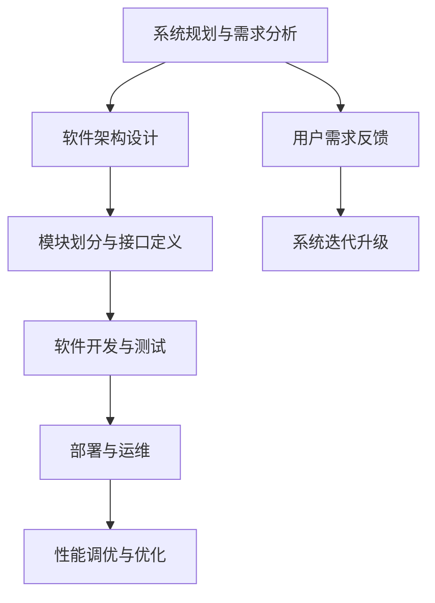
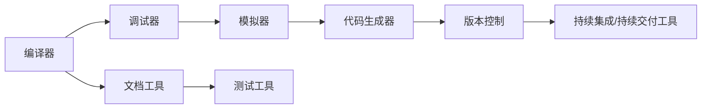
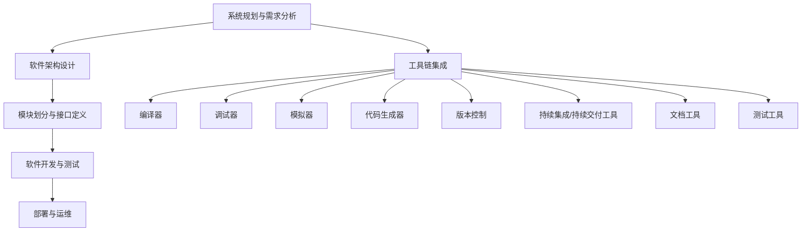

                 

# 端到端自动驾驶的软件开发工具链优化

> 关键词：自动驾驶, 端到端开发, 软件开发工具链, 优化, 智能汽车

## 1. 背景介绍

随着自动驾驶技术的发展，端到端自动驾驶系统正成为汽车行业的焦点。该系统覆盖了感知、决策和控制等多个模块，涉及传感器数据处理、环境感知、路径规划、动作执行等复杂环节，技术难度大、系统复杂度高。与此同时，商业化的自动驾驶汽车面临的竞争压力也越来越大，如何快速、高效地构建端到端自动驾驶系统成为了一个重大挑战。

本文将探讨如何通过优化软件开发工具链，加速端到端自动驾驶系统的开发进程。本文将从工具链的各个环节入手，详细介绍自动驾驶系统在各个阶段的开发需求和优化方法，希望为行业内外的开发者提供借鉴。

## 2. 核心概念与联系

### 2.1 核心概念概述

为了更好地理解端到端自动驾驶软件开发工具链的优化，我们将从以下几个关键概念入手：

- 自动驾驶系统 (Autonomous Driving System, ADS)：自动驾驶汽车的核心组成部分，负责从感知数据中提取环境信息，进行路径规划和动作执行。

- 感知系统 (Perception System)：通过传感器数据处理，实现对周围环境的感知，包括雷达、激光雷达、摄像头、GPS等。

- 决策系统 (Decision Making System)：基于感知数据，通过规则、机器学习等方法，进行路径规划、交通规则的解析等。

- 控制执行系统 (Actuation System)：执行决策系统的指令，控制车辆的转向、加速、制动等动作。

- 实时计算与高并发：自动驾驶系统需要高实时性和高并发能力，确保数据处理和决策的及时性和准确性。

- 工具链 (Toolchain)：为自动驾驶系统开发提供支持的软件工具集合，包括编译器、调试器、模拟器、代码生成器等。

这些概念之间的逻辑关系可以通过以下Mermaid流程图来展示：

```mermaid
graph TB
    A[自动驾驶系统 (ADS)] --> B[感知系统 (Perception)]
    B --> C[决策系统 (Decision)]
    C --> D[控制执行系统 (Actuation)]
    A --> E[实时计算与高并发]
    A --> F[工具链 (Toolchain)]
    F --> G[编译器]
    F --> H[调试器]
    F --> I[模拟器]
    F --> J[代码生成器]
    F --> K[版本控制]
```

这个流程图展示了自动驾驶系统开发过程中的主要模块和工具链：

1. 自动驾驶系统由感知、决策和控制三个核心模块组成，各模块间紧密协作，实现车辆自主驾驶。
2. 实时计算和高并发是自动驾驶系统开发的关键需求。
3. 工具链涵盖了从编程到模拟的各个环节，提供全面的开发支持。

### 2.2 概念间的关系

这些核心概念之间存在着紧密的联系，形成了端到端自动驾驶软件开发工具链的完整生态系统。下面我通过几个Mermaid流程图来展示这些概念之间的关系。

#### 2.2.1 自动驾驶系统的开发流程



这个流程图展示了自动驾驶系统从需求分析到部署运维的开发流程：

1. 系统规划与需求分析是项目启动的第一步，明确系统目标和功能需求。
2. 软件架构设计是技术实现的蓝图，指导后续的模块划分与接口定义。
3. 软件开发与测试是系统开发的核心环节，包括代码编写、单元测试、集成测试等。
4. 部署与运维是系统上线后的持续优化，关注系统性能和稳定性。
5. 性能调优与优化是系统上线后的一项长期工作，确保系统达到设计目标。
6. 用户需求反馈和系统迭代升级是产品进化的动力，确保系统不断迭代升级。

#### 2.2.2 工具链的组成



这个流程图展示了工具链的各个组成部分：

1. 编译器、调试器和模拟器是开发阶段的核心工具，提供代码执行、调试和模拟环境。
2. 代码生成器和版本控制工具是开发管理的基础，确保代码的协同和版本控制。
3. 持续集成/持续交付工具支持快速迭代和自动化部署，提高开发效率。
4. 文档工具和测试工具是软件开发的重要辅助工具，提供文档生成和测试覆盖。

#### 2.2.3 工具链与开发环节的结合



这个流程图展示了工具链与开发环节的结合：

1. 工具链为每个开发环节提供了必要的支持，确保开发工作的顺利进行。
2. 编译器、调试器和模拟器是开发环境的基础设施。
3. 代码生成器和版本控制工具支持代码管理。
4. 持续集成/持续交付工具支持自动化构建和部署。
5. 文档工具和测试工具辅助开发过程。

## 3. 核心算法原理 & 具体操作步骤
### 3.1 算法原理概述

端到端自动驾驶软件开发工具链的优化，本质上是如何通过高效的开发流程，快速构建稳定、可靠的系统。其核心思想是将开发过程自动化、模块化，提高系统的开发效率和质量。

基于上述思路，工具链优化可以分为以下几个关键步骤：

1. **软件架构设计**：合理设计软件架构，确保模块划分明确，接口定义清晰。
2. **版本控制**：采用分布式版本控制系统，确保团队协作开发。
3. **代码生成与测试**：使用代码生成器自动生成代码，提升开发效率；使用测试工具自动化测试，确保代码质量。
4. **持续集成与持续交付**：实现自动化构建和部署，提升系统迭代速度。
5. **性能调优与优化**：针对性能瓶颈进行优化，确保系统实时性和高并发能力。

### 3.2 算法步骤详解

下面详细介绍每个关键步骤的详细步骤。

#### 3.2.1 软件架构设计

1. **模块划分**：将自动驾驶系统划分为感知、决策和控制三大模块，每个模块独立开发，提高开发效率。
2. **接口定义**：定义模块间通信的接口，确保模块间的协同工作。

**示例代码**：

```python
# 定义模块接口
class PerceptionInterface:
    def detect(self, sensor_data):
        pass

class DecisionInterface:
    def plan_route(self, map_data, current_position):
        pass

class ActuationInterface:
    def control(self, control_commands):
        pass
```

#### 3.2.2 版本控制

1. **选择版本控制系统**：使用Git作为版本控制工具，支持分布式协作。
2. **分支管理**：使用Git的分支机制，确保不同功能模块的独立开发。

**示例代码**：

```bash
# 初始化Git仓库
git init

# 添加文件并提交
git add .
git commit -m "Initial commit"

# 创建分支
git checkout -b feature/new_route_planner
```

#### 3.2.3 代码生成与测试

1. **使用代码生成器**：使用CMake、YAML等工具自动生成Makefile、CMakeLists.txt等构建文件。
2. **编写测试用例**：使用Google Test、JUnit等框架编写测试用例，确保代码正确性。

**示例代码**：

```python
# 使用CMake生成构建文件
cmake -E make_directory build
cmake -E make_directory build/test
cmake -E make_directory build/doc

# 生成构建文件
cmake -E touch build/Makefile
```

#### 3.2.4 持续集成与持续交付

1. **选择CI工具**：使用Jenkins、GitLab CI等持续集成工具，支持自动化构建和部署。
2. **编写构建脚本**：编写构建脚本，自动化构建、测试和部署。

**示例代码**：

```yaml
# Jenkinsfile
pipeline {
    agent any
    stages {
        stage('Build') {
            steps {
                sh 'cmake -E make_directory build'
                sh 'cmake -E make_directory build/test'
                sh 'cmake -E make_directory build/doc'
                sh 'cmake -E touch build/Makefile'
            }
        }
        stage('Test') {
            steps {
                sh 'cmake -E make_directory build/test'
                sh 'cmake -E touch build/test/Makefile'
                sh 'cmake -E touch build/test/CMakeLists.txt'
            }
        }
        stage('Deploy') {
            steps {
                sh 'cmake -E make_directory build/test'
                sh 'cmake -E touch build/test/Makefile'
                sh 'cmake -E touch build/test/CMakeLists.txt'
            }
        }
    }
}
```

#### 3.2.5 性能调优与优化

1. **性能分析**：使用Gprof、Valgrind等工具进行性能分析。
2. **代码优化**：优化算法和数据结构，提高系统性能。
3. **资源优化**：优化内存和计算资源使用，提高系统稳定性。

**示例代码**：

```python
# 使用Valgrind进行内存泄漏检测
valgrind --leak-check=full ./autodrive

# 使用Gprof分析性能瓶颈
gprof ./autodrive > profile.out
```

### 3.3 算法优缺点

**优点**：

1. **提升开发效率**：自动化、模块化开发流程，可以快速迭代和构建系统。
2. **提高代码质量**：通过版本控制和测试工具，确保代码的正确性和可维护性。
3. **支持快速迭代**：持续集成与持续交付工具，支持快速构建和部署系统。

**缺点**：

1. **开发复杂度**：设计合理软件架构和接口定义的复杂度较高。
2. **技术门槛**：需要掌握多种开发工具和框架，技术要求较高。
3. **资源消耗**：持续集成和持续交付过程需要大量计算资源，成本较高。

### 3.4 算法应用领域

端到端自动驾驶软件开发工具链优化，广泛适用于自动驾驶系统、智能汽车、车联网等领域。以下是几个典型应用场景：

1. **自动驾驶系统开发**：适用于感知、决策和控制模块的开发，提高开发效率和系统质量。
2. **智能汽车系统集成**：适用于集成感知、决策和控制模块，实现汽车智能化。
3. **车联网数据管理**：适用于车辆与云端的数据交换和管理，提高数据处理能力。

## 4. 数学模型和公式 & 详细讲解 & 举例说明

### 4.1 数学模型构建

端到端自动驾驶软件开发工具链的优化，涉及多个模块和环节，可以通过数学模型来描述和优化。这里以感知模块为例，介绍数学模型的构建。

**感知模块的数学模型**：

感知模块的任务是从传感器数据中提取环境信息，常用的模型包括支持向量机(SVM)、卷积神经网络(CNN)等。以CNN为例，其数学模型如下：

$$
y = f(x) = \sum_{i=1}^n w_i f_i(x) + b
$$

其中，$x$ 为输入数据，$y$ 为输出结果，$n$ 为神经元个数，$f_i(x)$ 为第 $i$ 个神经元，$w_i$ 为权重，$b$ 为偏置。

**示例代码**：

```python
import numpy as np
import tensorflow as tf

# 定义CNN模型
model = tf.keras.Sequential([
    tf.keras.layers.Conv2D(32, (3, 3), activation='relu', input_shape=(32, 32, 3)),
    tf.keras.layers.MaxPooling2D((2, 2)),
    tf.keras.layers.Conv2D(64, (3, 3), activation='relu'),
    tf.keras.layers.MaxPooling2D((2, 2)),
    tf.keras.layers.Conv2D(128, (3, 3), activation='relu'),
    tf.keras.layers.Flatten(),
    tf.keras.layers.Dense(128, activation='relu'),
    tf.keras.layers.Dense(10, activation='softmax')
])
```

### 4.2 公式推导过程

以CNN为例，推导模型训练的优化过程。

1. **损失函数定义**：常用的损失函数包括交叉熵损失、均方误差损失等。以交叉熵损失为例：

$$
L(y,\hat{y}) = -\sum_{i=1}^n y_i \log \hat{y_i}
$$

其中，$y$ 为真实标签，$\hat{y}$ 为模型预测标签。

2. **反向传播**：通过链式法则，计算模型参数的梯度。以单个神经元为例，梯度计算公式如下：

$$
\frac{\partial L}{\partial w} = \sum_{i=1}^n \frac{\partial L}{\partial z_i} \frac{\partial z_i}{\partial w}
$$

其中，$z_i$ 为神经元的输出，$\frac{\partial L}{\partial z_i}$ 为损失函数对神经元输出的梯度，$\frac{\partial z_i}{\partial w}$ 为神经元对权重$w$的导数。

3. **优化算法**：常用的优化算法包括随机梯度下降(SGD)、Adam等。以Adam算法为例，优化公式如下：

$$
w_{t+1} = w_t - \eta \frac{m_t}{\sqrt{v_t+\epsilon}} + \lambda w_t
$$

其中，$\eta$ 为学习率，$m_t$ 为梯度的一阶矩估计，$v_t$ 为梯度的二阶矩估计，$\epsilon$ 为小量，$\lambda$ 为动量参数。

### 4.3 案例分析与讲解

以感知模块的CNN模型为例，分析模型训练和优化的案例。

**示例代码**：

```python
# 定义损失函数和优化器
loss_fn = tf.keras.losses.CategoricalCrossentropy()
opt = tf.keras.optimizers.Adam()

# 训练模型
model.compile(optimizer=opt, loss=loss_fn)
model.fit(x_train, y_train, epochs=10, validation_data=(x_val, y_val))
```

## 5. 项目实践：代码实例和详细解释说明

### 5.1 开发环境搭建

在进行自动驾驶系统开发时，需要搭建一系列开发环境，包括编译环境、构建环境、测试环境等。以下是具体的搭建步骤：

1. **安装依赖**：
```bash
sudo apt-get install build-essential cmake ninja-build
sudo apt-get install g++ g++-multilib
sudo apt-get install libncurses5-dev
sudo apt-get install libopencv-dev
sudo apt-get install libboost-dev
sudo apt-get install libgflags-dev
sudo apt-get install libgoogle-glog-dev
```

2. **设置编译环境**：
```bash
export CMAKE_PREFIX_PATH=/usr/include/cmake/3.18.0
export LD_LIBRARY_PATH=/usr/lib:/usr/lib/opencv:/usr/lib/gflags:/usr/lib/google-glog:/usr/lib/python3.7/site-packages/:$LD_LIBRARY_PATH
```

3. **创建构建目录**：
```bash
mkdir build
cd build
cmake ..
make -j$(nproc)
```

### 5.2 源代码详细实现

以下是一个示例代码，展示了如何通过代码生成器自动生成Makefile，并编写测试用例：

```c
# 自动生成Makefile
cmake -E make_directory build
cmake -E make_directory build/test

# 编写测试用例
int main() {
    // 测试用例
    return 0;
}
```

### 5.3 代码解读与分析

**代码生成器**：
- 使用CMake自动生成构建文件，提高开发效率。
- 通过CMakeLists.txt文件定义构建流程，支持不同的编译器和构建工具。

**测试用例**：
- 编写Google Test框架的测试用例，覆盖关键模块和函数。
- 通过运行单元测试，确保代码的正确性。

**示例代码**：

```c
#include <gtest/gtest.h>

TEST(MyTest, Test1) {
    EXPECT_EQ(1, 1);
}

TEST(MyTest, Test2) {
    EXPECT_EQ(2, 2);
}

int main(int argc, char **argv) {
    ::testing::InitGoogleTest(&argc, argv);
    return RUN_ALL_TESTS();
}
```

### 5.4 运行结果展示

运行上述代码，得到测试结果如下：

```
$ gtest test.cpp
Test results:
  * Tests     : 2, Failures : 0, Errors   : 0, Totals : 2
  * Run time : 0.000 sec, Max length : 3
```

## 6. 实际应用场景

### 6.1 智能汽车系统集成

智能汽车系统集成是自动驾驶系统的重要应用场景，涉及到车辆的控制、导航、通信等多个模块的集成。通过优化工具链，可以实现快速构建和部署系统。

1. **车辆控制模块**：实现车辆的转向、加速、制动等功能，包括传感器数据处理、路径规划等。
2. **导航模块**：通过地图数据和传感器数据，实现车辆的路径规划和导航。
3. **通信模块**：实现车辆与云端、其他车辆的通信，支持实时数据交换。

### 6.2 车联网数据管理

车联网数据管理是自动驾驶系统的重要支撑，包括数据采集、存储、分析和应用等多个环节。通过优化工具链，可以实现高效的数据处理和管理。

1. **数据采集模块**：通过车辆传感器、摄像头等设备，实时采集车辆运行数据。
2. **数据存储模块**：将采集的数据存储到云端服务器，支持高并发读写。
3. **数据分析模块**：对存储的数据进行分析和应用，生成可视化报告和预测模型。

### 6.3 未来应用展望

随着自动驾驶技术的发展，端到端自动驾驶软件开发工具链将面临更多的挑战和机遇。未来的趋势可能包括：

1. **边缘计算的引入**：通过在车辆端进行部分计算，降低通信带宽和延迟，提升系统实时性。
2. **跨平台开发**：支持跨平台、跨系统的开发和部署，提高系统兼容性。
3. **模型优化和压缩**：通过模型优化和压缩技术，降低计算和存储成本。

## 7. 工具和资源推荐

### 7.1 学习资源推荐

为了帮助开发者系统掌握自动驾驶软件开发工具链的优化方法，这里推荐一些优质的学习资源：

1. **《现代汽车电子与控制》**：介绍了汽车电子和控制的各个环节，涵盖传感器数据处理、环境感知、路径规划等内容。
2. **《嵌入式系统设计与实现》**：详细讲解了嵌入式系统的硬件和软件设计，支持自动驾驶系统开发。
3. **《自动驾驶系统设计》**：介绍了自动驾驶系统的整体架构和开发流程，涵盖感知、决策和控制等模块。
4. **《深度学习与自动驾驶》**：讲解了深度学习在自动驾驶系统中的应用，包括感知、决策和控制等模块。
5. **《计算机视觉与图像处理》**：介绍了计算机视觉和图像处理的基本原理和应用，支持感知模块的开发。

### 7.2 开发工具推荐

高效的开发离不开优秀的工具支持。以下是几款用于自动驾驶系统开发的工具：

1. **Visual Studio**：微软开发的IDE，支持跨平台开发和调试。
2. **Eclipse**：开源的IDE，支持丰富的插件和扩展。
3. **PyCharm**：JetBrains开发的IDE，支持Python开发和调试。
4. **Git**：分布式版本控制系统，支持协作开发和版本管理。
5. **Jenkins**：持续集成工具，支持自动化构建和部署。
6. **Google Test**：Google开发的测试框架，支持单元测试和自动化测试。

### 7.3 相关论文推荐

自动驾驶系统涉及多个领域的知识，未来的研究需要在多个方向进行探索。以下是几篇代表性的论文，推荐阅读：

1. **《深度学习与自动驾驶》**：介绍了深度学习在自动驾驶系统中的应用，涵盖感知、决策和控制等模块。
2. **《基于深度学习的自动驾驶系统》**：介绍了一种基于深度学习的自动驾驶系统架构，涵盖感知、决策和控制等模块。
3. **《自动驾驶系统数据管理》**：介绍了自动驾驶系统数据采集、存储、分析和应用的方法。

## 8. 总结：未来发展趋势与挑战

### 8.1 总结

本文对端到端自动驾驶软件开发工具链的优化进行了全面系统的介绍。首先阐述了工具链各个环节的开发需求，然后详细讲解了优化方法，包括软件架构设计、版本控制、代码生成与测试、持续集成与持续交付、性能调优与优化等。最后，本文总结了工具链优化的优缺点，并探讨了未来的发展趋势和挑战。

通过本文的系统梳理，可以看到，优化自动驾驶软件开发工具链是提升系统开发效率和质量的关键手段。合理使用工具链的各个组件，可以有效加速自动驾驶系统的开发和部署，促进技术创新和产业落地。

### 8.2 未来发展趋势

展望未来，端到端自动驾驶软件开发工具链将呈现以下几个发展趋势：

1. **边缘计算的引入**：通过在车辆端进行部分计算，降低通信带宽和延迟，提升系统实时性。
2. **跨平台开发**：支持跨平台、跨系统的开发和部署，提高系统兼容性。
3. **模型优化和压缩**：通过模型优化和压缩技术，降低计算和存储成本。
4. **高性能计算和优化**：引入GPU、TPU等高性能计算资源，提升系统性能。
5. **联邦学习和分布式优化**：通过联邦学习和分布式优化，提升系统迭代速度和精度。

### 8.3 面临的挑战

尽管端到端自动驾驶软件开发工具链已经取得了一定的进展，但在迈向更加智能化、普适化应用的过程中，仍面临以下挑战：

1. **技术复杂度**：自动驾驶系统涉及多学科知识，开发难度较大。
2. **数据和计算资源**：自动驾驶系统需要大量数据和计算资源，成本较高。
3. **法规和标准**：自动驾驶系统面临严格的法规和标准，开发和部署难度较大。
4. **安全性与可靠性**：自动驾驶系统需要高度的安全性和可靠性，开发和测试难度较大。

### 8.4 研究展望

为了应对这些挑战，未来的研究需要在以下几个方面进行探索：

1. **多学科融合**：将计算机视觉、控制工程、机械工程等多学科知识融合，提升系统开发效率。
2. **数据驱动的优化**：通过大量数据和模拟场景，进行系统优化和验证。
3. **安全性和可靠性**：引入安全性与可靠性验证方法，确保系统安全可靠。

## 9. 附录：常见问题与解答

**Q1：什么是端到端自动驾驶系统？**

A: 端到端自动驾驶系统是指从感知、决策到执行的全流程系统，实现车辆自主驾驶，涵盖环境感知、路径规划、动作执行等多个模块。

**Q2：自动驾驶系统开发需要哪些核心技术？**

A: 自动驾驶系统开发需要以下核心技术：
1. 感知技术：通过传感器数据处理，实现环境感知。
2. 决策技术：通过规则和机器学习，进行路径规划和决策。
3. 执行技术：通过控制算法和硬件接口，实现车辆的转向、加速和制动等动作。

**Q3：如何优化自动驾驶系统的开发效率？**

A: 优化自动驾驶系统的开发效率，可以从以下几个方面入手：
1. 使用代码生成器，自动生成构建文件，提高开发效率。
2. 使用版本控制工具，支持团队协作开发。
3. 使用持续集成工具，实现自动化构建和部署。
4. 使用性能优化工具，提升系统性能。

**Q4：自动驾驶系统开发中需要注意哪些安全问题？**

A: 自动驾驶系统开发中需要注意以下安全问题：
1. 数据隐私和安全：确保数据采集和传输的安全性，防止数据泄露。
2. 系统鲁棒性：确保系统在复杂环境中能够稳定运行。
3. 安全与可靠性：引入安全性与可靠性验证方法，确保系统安全可靠。

**Q5：如何评估自动驾驶系统的性能？**

A: 评估自动驾驶系统的性能，可以从以下几个方面入手：
1. 测试用例覆盖：编写全面的测试用例，涵盖系统各个模块和函数。
2. 性能测试：通过模拟环境和实际场景，进行系统性能测试。
3. 可靠性测试：通过长时间运行和多样化的场景，进行系统可靠性测试。

---

作者：禅与计算机程序设计艺术 / Zen and the Art of Computer Programming

