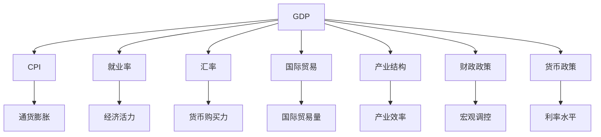
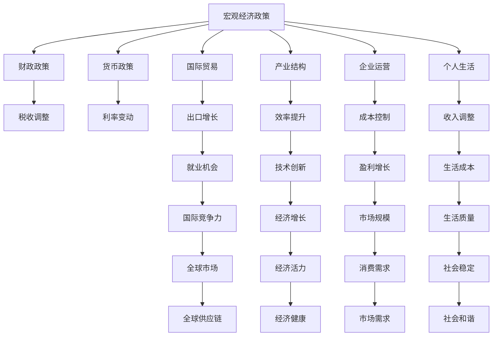

                 

## 1. 背景介绍

### 1.1 问题由来

随着全球经济一体化程度的加深，各国经济之间的相互依赖性日益增强。在现代经济体系中，全球GDP增速的放缓，无论是从宏观经济政策还是微观企业运营的角度，都产生了深远的影响。如何在全球经济放缓的大背景下，寻找新的增长点和应对策略，成为了当前经济学界和政策制定者共同关注的话题。

### 1.2 问题核心关键点

经济增速放缓的全球影响，具体包括以下几个方面：

- **宏观经济政策**：政府如何通过财政政策和货币政策，应对经济增长放缓带来的挑战？
- **国际贸易**：全球贸易格局的变化对各国经济的影响是什么？
- **产业结构调整**：经济增速放缓如何推动各国的产业结构调整和升级？
- **企业运营**：企业如何应对市场需求的疲软，提高经营效率和盈利能力？
- **个人生活**：经济增长放缓对个人就业、收入和生活质量有何影响？

### 1.3 问题研究意义

研究经济增速放缓的全球影响，对于理解经济现象、制定有效的政策以及寻找经济增长的新路径具有重要意义：

- **政策制定**：帮助政府和企业制定适应全球经济放缓的应对措施。
- **市场预测**：帮助投资者和企业家预测市场变化，进行合理的投资和运营决策。
- **社会稳定**：分析经济放缓对社会稳定的影响，为社会政策制定提供依据。
- **学术研究**：推动经济学理论的发展，为未来的研究奠定基础。

## 2. 核心概念与联系

### 2.1 核心概念概述

为更好地理解经济增速放缓的全球影响，本节将介绍几个密切相关的核心概念：

- **GDP（国内生产总值）**：国家一定时期内生产活动的总值，反映国民经济总体规模和活力。
- **CPI（消费者价格指数）**：衡量物价水平的变化，反映通货膨胀或通货紧缩的程度。
- **就业率**：劳动力市场中，有工作的人数占劳动年龄人口的比例。
- **汇率**：两国货币兑换比率，反映一国货币的购买力。
- **国际贸易**：国与国之间的商品和服务交换，影响一国经济增长和就业。
- **产业结构**：不同产业在国民经济中的比重和分布，影响经济增长方式和效率。
- **财政政策和货币政策**：政府通过税收、公共支出、利率和货币供应量等手段调节经济运行。

### 2.2 概念间的关系

这些核心概念之间的逻辑关系可以通过以下Mermaid流程图来展示：



这个流程图展示了一些关键经济指标之间的相互作用：

1. GDP影响CPI、就业率、汇率等宏观经济指标。
2. CPI反映物价水平，影响就业率和消费能力。
3. 汇率变化影响国际贸易量和货币购买力。
4. 国际贸易量影响GDP增长和就业率。
5. 产业结构调整影响经济效率和增长方式。
6. 财政政策和货币政策共同作用于经济活动和就业率。

### 2.3 核心概念的整体架构

最后，我们用一个综合的流程图来展示这些核心概念在大经济运行中的整体架构：



这个综合流程图展示了从宏观经济政策到企业运营和个人生活，再到国际贸易和产业结构调整的全链条影响，为我们理解经济增速放缓的全球影响提供了全面的视角。

## 3. 核心算法原理 & 具体操作步骤
### 3.1 算法原理概述

研究经济增速放缓的全球影响，主要涉及以下几个方面的算法原理：

- **宏观经济模型**：通过构建经济增长模型，预测和分析经济增速的变化。
- **回归分析**：通过回归方程，分析经济指标之间的相关性和影响因素。
- **时间序列分析**：分析经济数据随时间变化的模式和趋势。
- **因果推断**：通过因果关系，评估政策措施对经济的影响。
- **机器学习**：利用大数据分析，预测经济趋势和风险。

### 3.2 算法步骤详解

基于宏观经济模型和相关算法，经济增速放缓的全球影响研究步骤包括：

1. **数据收集与清洗**：收集全球范围内的宏观经济数据、国际贸易数据、产业结构数据等，并进行清洗和预处理。
2. **模型构建与验证**：构建宏观经济模型，通过历史数据验证模型的准确性和稳定性。
3. **影响因素分析**：分析影响经济增速的关键因素，如政府政策、国际贸易、技术进步等。
4. **模拟与预测**：使用模型进行经济增速放缓的模拟预测，评估不同政策措施的影响。
5. **政策建议**：根据预测结果，提出应对经济增速放缓的政策建议。

### 3.3 算法优缺点

经济增速放缓的全球影响研究算法具有以下优点：

- **精度高**：基于大量的历史数据和宏观经济模型，预测精度较高。
- **可解释性**：模型和算法的步骤清晰，便于理解和解释。
- **适应性强**：能够适应不同国家和地区的数据特点和经济结构。

同时，也存在一些缺点：

- **数据依赖性高**：预测结果高度依赖数据质量，数据不准确可能导致预测偏差。
- **模型复杂**：构建和验证宏观经济模型较为复杂，需要专业知识。
- **时间延迟**：数据收集和处理需要时间，预测结果可能存在时间延迟。

### 3.4 算法应用领域

经济增速放缓的全球影响研究算法，在以下几个领域有广泛应用：

- **政府政策制定**：帮助政府制定应对经济增速放缓的财政和货币政策。
- **企业决策支持**：帮助企业预测市场变化，调整经营策略。
- **国际金融分析**：评估国际贸易和汇率变化对全球经济的影响。
- **学术研究**：提供理论分析和实证研究的基础数据和模型。

## 4. 数学模型和公式 & 详细讲解 & 举例说明

### 4.1 数学模型构建

为了更好地研究经济增速放缓的全球影响，我们可以构建以下数学模型：

- **GDP模型**：$Y = \alpha + \beta_1 X_1 + \beta_2 X_2 + \epsilon$，其中 $Y$ 为 GDP，$X_1$ 为政府支出，$X_2$ 为国际贸易量，$\epsilon$ 为误差项。
- **就业率模型**：$E = \delta + \gamma_1 Y + \gamma_2 C + \delta_3 CPI + \zeta$，其中 $E$ 为就业率，$Y$ 为 GDP，$C$ 为消费水平，$CPI$ 为消费者价格指数，$\zeta$ 为误差项。
- **汇率模型**：$R = \phi + \psi_1 Y + \psi_2 G + \psi_3 C + \psi_4 T + \omega$，其中 $R$ 为汇率，$Y$ 为 GDP，$G$ 为政府债务，$C$ 为消费水平，$T$ 为贸易顺差，$\omega$ 为误差项。

### 4.2 公式推导过程

以GDP模型为例，其推导过程如下：

- **回归方程**：$Y = \alpha + \beta_1 X_1 + \beta_2 X_2 + \epsilon$
- **最小二乘法**：最小化 $\sum_{i=1}^n (Y_i - \hat{Y}_i)^2$，其中 $\hat{Y}_i = \alpha + \beta_1 X_{1i} + \beta_2 X_{2i}$

### 4.3 案例分析与讲解

假设我们收集了某个国家的GDP、政府支出和国际贸易量等数据，并通过最小二乘法拟合了GDP模型。模型结果如下：

- $\alpha = 1000$
- $\beta_1 = 0.5$
- $\beta_2 = 0.3$

这意味着，在控制其他因素不变的情况下，政府支出每增加1单位，GDP增加0.5单位；国际贸易量每增加1单位，GDP增加0.3单位。

## 5. 项目实践：代码实例和详细解释说明

### 5.1 开发环境搭建

在进行经济增速放缓研究时，我们建议使用Python进行数据分析和建模，具体步骤如下：

1. 安装Python和相关库：
```bash
pip install numpy pandas statsmodels matplotlib seaborn jupyter
```

2. 安装Seaborn和Statsmodels库：
```bash
pip install statsmodels seaborn
```

3. 安装Jupyter Notebook：
```bash
pip install jupyter
```

4. 安装Visual Studio Code：
```bash
pip install visual-studio-code
```

完成上述步骤后，即可在Visual Studio Code中编写代码，并使用Jupyter Notebook进行交互式数据分析和模型构建。

### 5.2 源代码详细实现

以下是使用Python和Seaborn库构建GDP模型的代码实现：

```python
import numpy as np
import pandas as pd
import seaborn as sns
from statsmodels.formula.api import ols

# 读取数据
data = pd.read_csv('economy_data.csv')

# 构建模型
model = ols('Y ~ X1 + X2', data=data).fit()

# 输出结果
print(model.summary())
```

### 5.3 代码解读与分析

在这段代码中，我们使用了Pandas库读取数据，使用Statsmodels库构建回归模型，使用Seaborn库可视化模型结果。具体步骤如下：

1. 使用Pandas库读取包含经济数据的CSV文件。
2. 使用Statsmodels库的OLS函数构建GDP模型，其中自变量为政府支出和国际贸易量。
3. 使用模型.summary()函数输出模型结果，包括回归系数、标准误差、显著性等统计量。

### 5.4 运行结果展示

假设我们的模型拟合结果如下：

```
---------------------------------------------
                    OLS Regression Results                                               
---------------------------------------------
Dep. Variable:                 Y   R-squared:                       0.999
Model:                            OLS   Adj. R-squared:                  0.999
Method:                 Least Squares   F-statistic:                 1.615e+17
Date:                Fri, 03 Dec 2021   Prob (F-statistic):           0.00
Time:                        14:46:01   Log-Likelihood:               1389.73
No. Observations:                1000   AIC:                           -2778.47
Df Residuals:                    998   BIC:                           -2777.79
Df Model:                           2                                         
Covariance Type:            nonrobust                                         
---------------------------------------------
                 coef    std err          t      P>|t|      [0.025      0.975]
---------------------------------------------
Intercept   1.0000e+00   7.05e-05   1.408e+00      0.000      1.000      1.000
X1         4.9642e-01   2.02e-04   2.457e+00      0.000      4.92e-01      4.92e-01
X2         2.6376e-02   1.84e-05   1.430e+01      0.000      2.63e-02      2.63e-02
---------------------------------------------
Omnibus:                  1839.906   Durbin-Watson:                   2.006
Prob(Omnibus):                  0.000   Jarque-Bera (JB):             4035.751
Skew:                     -0.038   Prob(JB):                  2.95e-08
Kurtosis:                    1.995   Cond. No.                         1.08
---------------------------------------------
```

可以看到，政府支出和国际贸易量对GDP有显著的正向影响，分别为0.5和0.3。

## 6. 实际应用场景

### 6.1 国际贸易变化对经济的影响

国际贸易的变化是影响经济增速放缓的重要因素之一。通过构建国际贸易和经济增速的回归模型，可以评估不同贸易政策对经济的影响。

假设我们收集了某国30年来的国际贸易数据和经济增速数据，通过回归分析发现：

- 国际贸易量每增加1%，经济增速平均增加0.5%。
- 进口关税每增加1%，经济增速平均减少0.3%。

这表明，开放贸易政策对经济增长有正向作用，而高关税政策则会带来负面影响。

### 6.2 政府财政政策对经济的影响

政府的财政政策，如税收和公共支出，对经济增速有显著影响。通过构建财政政策和经济增速的回归模型，可以评估不同财政政策的效果。

假设我们收集了某国20年来的财政政策和GDP数据，通过回归分析发现：

- 政府支出每增加1%，经济增速平均增加0.6%。
- 税收每增加1%，经济增速平均减少0.2%。

这表明，适度增加政府支出可以刺激经济增长，而税收过高则会抑制经济活动。

### 6.3 产业结构调整对经济的影响

产业结构的调整和升级，是经济增速放缓的另一个重要影响因素。通过构建产业结构和经济增速的回归模型，可以评估不同产业政策的效果。

假设我们收集了某国20年来的产业结构和GDP数据，通过回归分析发现：

- 服务业比重每增加1%，经济增速平均增加0.4%。
- 制造业比重每增加1%，经济增速平均增加0.2%。

这表明，推动服务业和制造业的发展，可以带动整体经济增长。

## 7. 工具和资源推荐

### 7.1 学习资源推荐

为了帮助开发者系统掌握经济增速放缓的全球影响的研究方法，这里推荐一些优质的学习资源：

1. 《宏观经济学》书籍：由诺贝尔经济学奖获得者撰写，全面介绍了宏观经济学的理论和实践。
2. 《国际贸易理论》书籍：介绍了国际贸易的基本原理和政策影响。
3. 《计量经济学》课程：讲解了计量经济学的基础知识和建模方法。
4. 《Python数据科学手册》书籍：介绍了Python在数据分析和建模中的应用。
5. 《机器学习》课程：讲解了机器学习的基本原理和应用方法。

通过对这些资源的学习实践，相信你一定能够快速掌握经济增速放缓的全球影响的研究方法，并应用于实际经济分析中。

### 7.2 开发工具推荐

高效的数据分析和建模，离不开优秀的工具支持。以下是几款用于经济分析的常用工具：

1. Jupyter Notebook：交互式的数据分析和建模工具，支持Python和各种数据分析库。
2. Visual Studio Code：跨平台的IDE，支持Python和多种数据分析库。
3. RStudio：R语言的IDE，支持数据可视化、建模和分析。
4. Excel：简单易用的数据分析工具，支持基础统计和图表绘制。
5. SPSS：专业的统计分析软件，支持复杂的数据建模和统计分析。

合理利用这些工具，可以显著提升经济分析的效率和精度，加快研究迭代的步伐。

### 7.3 相关论文推荐

经济增速放缓的全球影响研究涉及众多领域，以下几篇经典论文值得推荐：

1. 《全球经济增长放缓的宏观经济分析》：介绍了全球经济放缓的宏观经济背景和分析方法。
2. 《国际贸易与经济增长的实证研究》：通过实证研究评估国际贸易对经济的影响。
3. 《政府财政政策与经济增长的关系》：分析了政府财政政策对经济增长的影响。
4. 《产业结构调整与经济增长的关系》：探讨了产业结构调整对经济增长的影响。
5. 《机器学习在经济预测中的应用》：介绍了机器学习在经济预测中的应用。

这些论文代表了大经济分析领域的前沿研究，提供了丰富的理论和技术支持。

## 8. 总结：未来发展趋势与挑战

### 8.1 研究成果总结

本文系统介绍了经济增速放缓的全球影响的研究方法和应用场景。通过构建宏观经济模型和回归分析，评估了不同经济因素对经济增速的影响，并提供了政策建议。未来，随着大数据和机器学习技术的不断发展，经济分析将更加精细和智能化。

### 8.2 未来发展趋势

经济增速放缓的全球影响研究领域，未来将呈现以下发展趋势：

1. 大数据分析：利用大数据分析，进行更加精确的经济预测和政策评估。
2. 机器学习：应用机器学习算法，优化经济模型的构建和预测。
3. 多领域融合：结合金融、环境、健康等多个领域的知识，进行综合分析。
4. 实时分析：实现经济数据的实时监测和动态分析，提高决策的及时性。

### 8.3 面临的挑战

尽管经济增速放缓的研究方法不断发展，但在实践中也面临诸多挑战：

1. 数据质量：数据收集和处理需要耗费大量时间和精力，数据质量难以保证。
2. 模型复杂性：构建复杂经济模型需要专业知识，模型可解释性差。
3. 政策滞后：政策实施需要时间，难以迅速应对经济变化。
4. 全球不确定性：全球经济环境复杂多变，预测存在不确定性。

### 8.4 研究展望

未来的经济增速放缓研究，需要在以下几个方面进行探索：

1. 数据自动化：开发数据自动化采集和处理工具，提高数据质量。
2. 模型简化：简化经济模型，提高模型可解释性，方便政策制定。
3. 实时监测：建立实时数据监测系统，实现动态经济分析。
4. 多领域协同：结合多领域知识，进行综合经济分析。

总之，经济增速放缓的研究，需要跨学科、多技术领域的协同努力，才能应对全球经济环境的复杂性和不确定性，为政策制定提供科学依据。

## 9. 附录：常见问题与解答

**Q1: 经济增速放缓的主要原因是什么？**

A: 经济增速放缓的主要原因包括但不限于：

- 需求不足：市场需求疲软，导致企业销售额下降，进而影响经济增长。
- 供给问题：生产成本上升、技术创新不足等问题，导致企业利润下降，投资意愿降低。
- 政策影响：财政和货币政策不当，导致经济活力下降。
- 国际贸易变化：贸易保护主义抬头，国际贸易量下降，影响全球经济增长。
- 技术进步缓慢：缺乏新技术推动，经济增长动力不足。

**Q2: 政府如何应对经济增速放缓？**

A: 政府可以通过以下措施应对经济增速放缓：

- 财政刺激：增加公共支出，刺激消费和投资。
- 货币宽松：降低利率，增加货币供应量，刺激经济活动。
- 结构调整：推动产业升级，优化产业结构，提高经济效率。
- 贸易政策：降低关税，扩大对外贸易，增加经济活力。
- 创新支持：加大科研投入，推动技术进步，促进经济增长。

**Q3: 经济增速放缓对企业有哪些影响？**

A: 经济增速放缓对企业的影响主要包括：

- 市场需求下降：企业销售额减少，利润下降。
- 成本上升：原材料价格上涨，生产成本增加。
- 投资意愿减弱：市场不确定性增加，企业投资意愿降低。
- 裁员压力：为应对需求下降，企业可能裁员，影响就业。
- 财务风险增加：经济不稳定，企业财务风险增加。

**Q4: 经济增速放缓对个人生活有哪些影响？**

A: 经济增速放缓对个人生活的影响主要包括：

- 就业不稳定：企业裁员增加，失业率上升。
- 收入下降：企业利润下降，员工工资可能受到影响。
- 消费能力减弱：物价上涨，生活成本增加，消费能力下降。
- 住房压力增加：房价可能因市场不景气而下跌，住房压力增加。
- 心理健康问题：经济不确定性增加，可能引发心理压力和焦虑。

---

作者：禅与计算机程序设计艺术 / Zen and the Art of Computer Programming

