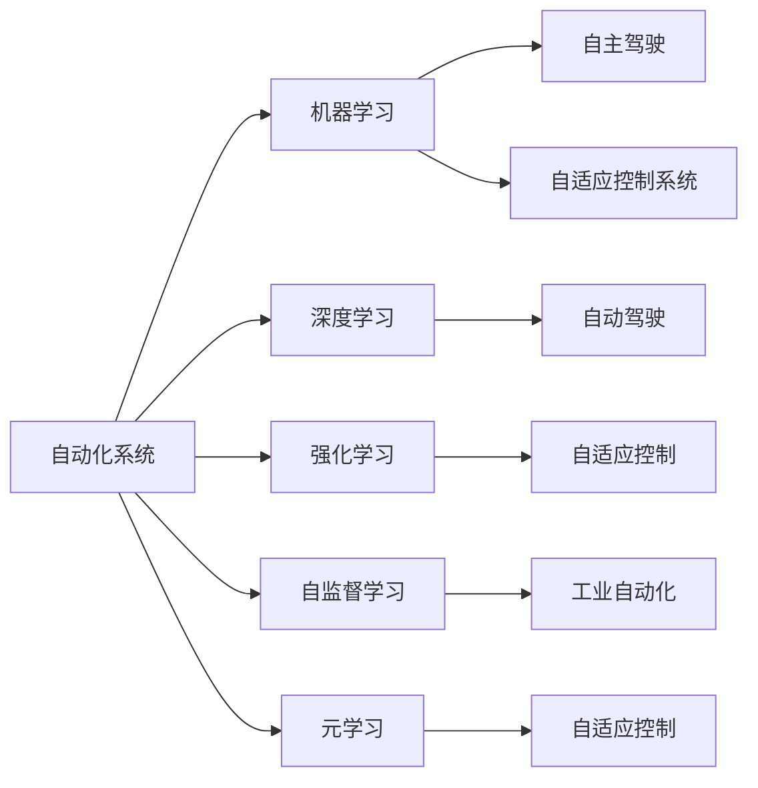
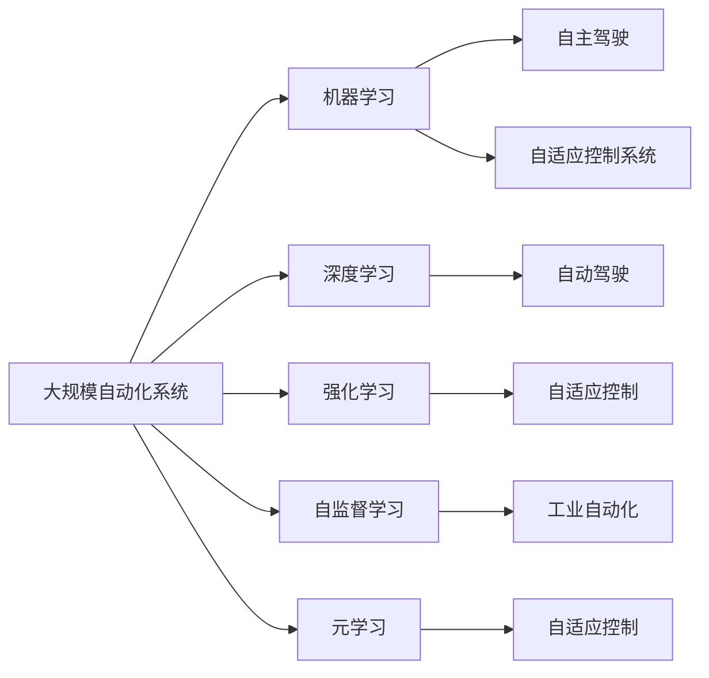

                 

# 自动化技术的发展与应用

## 1. 背景介绍

### 1.1 问题由来

自动化技术在现代社会的各个方面都发挥着越来越重要的作用，从制造业的机器人手臂到农业中的自动化拖拉机，再到城市交通中的智能交通管理系统，自动化无处不在。然而，随着自动化技术的快速发展和应用，其带来的问题也日益突出，如自动化系统的安全性、可靠性、可解释性、自主性等问题。

### 1.2 问题核心关键点

自动化技术的问题主要集中在以下几个方面：

1. **安全性与可靠性**：自动化系统需要在高风险环境或任务中保持极高的安全性与可靠性。然而，自动化系统的故障率仍然存在，而且一些自动化系统的安全机制并不完善，特别是在面对复杂和变化多端的现实环境时。

2. **可解释性与透明性**：自动化系统往往被视为"黑箱"，无法解释其决策过程，这导致用户对自动化系统的信任度降低。在医疗、法律等高风险领域，自动化系统的可解释性和透明性尤为关键。

3. **自主性与适应性**：自动化系统需要具备一定的自主性和适应性，即能够在新的环境中快速适应并有效执行任务。然而，现有的自动化系统在处理复杂多变的环境时，往往难以快速调整和优化。

4. **兼容性与互操作性**：不同厂商和系统之间的兼容性问题也是自动化技术的一大挑战。由于各个厂商的自动化系统设计理念和架构不同，导致系统之间的互操作性较差，增加了系统的复杂度和维护成本。

5. **数据隐私与安全**：自动化系统依赖大量的数据进行训练和优化，这带来了数据隐私和安全问题。如何在保护用户隐私的同时，充分利用数据资源，是自动化技术发展中必须面对的问题。

这些核心关键点反映了自动化技术在发展过程中所面临的主要挑战，同时也是研究者们亟需解决的问题。

### 1.3 问题研究意义

自动化技术的研究和应用对提高生产效率、降低成本、改善生活质量具有重要意义。通过自动化技术的应用，可以大幅提升工作效率，减少人为错误，甚至在某些领域实现人类难以完成的任务。

然而，自动化技术的应用还面临诸多限制和挑战。自动化系统需要具备更高的安全性和可靠性，以应对高风险环境下的任务。同时，系统的可解释性、透明性和自主性也需要进一步提升，以增强用户信任。此外，自动化技术还需解决数据隐私和安全问题，保障用户数据不被滥用。

## 2. 核心概念与联系

### 2.1 核心概念概述

为了更好地理解自动化技术的发展与应用，本节将介绍几个密切相关的核心概念：

1. **自动化系统**：利用计算机技术和算法，实现对复杂系统的控制和操作。自动化系统可以涵盖工业自动化、农业自动化、医疗自动化、城市自动化等多个领域。

2. **机器学习**：利用算法和统计学原理，使计算机系统能够从数据中学习规律，并进行预测和决策。机器学习是自动化技术的重要组成部分，通过数据驱动的方法，提升自动化系统的智能和适应能力。

3. **深度学习**：一种特殊的机器学习方法，通过多层次的神经网络结构，能够处理大规模、复杂的数据集，并在图像识别、语音识别、自然语言处理等领域取得优异表现。

4. **强化学习**：一种通过与环境交互，不断调整策略来优化行为的方法。强化学习在机器人控制、自动驾驶、游戏AI等领域有着广泛的应用。

5. **自监督学习**：利用未标注数据进行自我监督的机器学习方法。自监督学习在图像分类、语音识别、自然语言处理等领域取得了显著进展。

6. **元学习**：一种学习如何学习的方法，通过少量数据快速适应新任务。元学习在自动驾驶、自动设计等领域具有重要的应用前景。

7. **自主驾驶**：利用传感器、相机、雷达等设备，实现对车辆的自主控制和导航。自主驾驶技术是自动化技术的一个重要应用领域，具有显著的社会和经济价值。

8. **自适应控制系统**：能够根据环境变化自动调整参数，实现对复杂系统的优化控制。自适应控制技术在工业自动化、机器人等领域有着广泛的应用。

这些核心概念之间的逻辑关系可以通过以下Mermaid流程图来展示：



这个流程图展示了自动化系统与各类机器学习技术的紧密联系，以及它们在不同应用领域的分布。

### 2.2 概念间的关系

这些核心概念之间存在着紧密的联系，形成了自动化技术的完整生态系统。

- **自动化系统与机器学习**：自动化系统通常需要机器学习技术来进行智能决策和优化控制。机器学习提供了一种数据驱动的方法，使自动化系统能够从大量数据中学习规律和知识。

- **自动化系统与深度学习**：深度学习是机器学习的一个子集，通过多层次神经网络结构，能够处理大规模复杂的数据集。深度学习在图像识别、语音识别、自然语言处理等领域，已经展示了其强大的能力。

- **自动化系统与强化学习**：强化学习通过与环境交互，不断调整策略来优化行为。在自动驾驶、游戏AI等领域，强化学习提供了有效的学习机制。

- **自动化系统与自监督学习**：自监督学习利用未标注数据进行自我监督，能够在缺少标注数据的情况下进行学习。自监督学习在图像分类、语音识别、自然语言处理等领域具有重要应用。

- **自动化系统与元学习**：元学习是一种学习如何学习的方法，能够快速适应新任务。在自动驾驶、自动设计等领域，元学习提供了高效的适应机制。

- **自主驾驶与自适应控制系统**：自主驾驶系统依赖自适应控制技术，根据环境变化自动调整参数，实现对车辆的精确控制。

- **工业自动化与自适应控制系统**：工业自动化系统通常需要自适应控制技术，以应对复杂多变的环境和任务。

这些概念共同构成了自动化技术的核心框架，为自动化系统提供了智能决策和优化控制的基础。

### 2.3 核心概念的整体架构

最后，我们用一个综合的流程图来展示这些核心概念在大规模自动化系统中的应用：



这个综合流程图展示了从机器学习到元学习在大规模自动化系统中的应用。自动化系统通过多种机器学习方法，实现了从数据驱动的决策到快速适应新任务的能力。

## 3. 核心算法原理 & 具体操作步骤
### 3.1 算法原理概述

自动化技术的核心算法原理主要基于机器学习和深度学习。具体来说，自动化系统通过以下步骤实现其智能决策和优化控制：

1. **数据采集与预处理**：自动化系统通过传感器、相机、雷达等设备采集环境数据，并通过预处理技术，如滤波、降噪、数据增强等，优化数据质量。

2. **特征提取与表示**：通过特征提取算法，将原始数据转化为高维特征向量，以便后续的机器学习算法进行处理。

3. **模型训练与优化**：利用机器学习算法，如回归、分类、聚类、深度学习等，对特征向量进行训练和优化。深度学习通过多层次的神经网络结构，能够处理复杂的大规模数据集。

4. **模型评估与调优**：通过交叉验证、验证集等方法，对训练好的模型进行评估和调优，以提高其泛化能力和鲁棒性。

5. **实时控制与决策**：利用优化后的模型，实时对环境数据进行分析和决策，控制自动化系统的行为。

6. **反馈与适应**：通过实时反馈机制，不断调整模型参数，实现对环境的自适应和优化。

### 3.2 算法步骤详解

以自动驾驶系统为例，介绍基于机器学习和深度学习的自动化算法步骤：

1. **数据采集与预处理**：通过车辆上的传感器、相机、雷达等设备，采集环境数据，并进行数据增强、滤波、降噪等预处理。

2. **特征提取与表示**：将采集到的数据，如激光雷达点云、摄像头图像、GPS数据等，通过特征提取算法，如卷积神经网络（CNN）、循环神经网络（RNN）、注意力机制等，转化为高维特征向量。

3. **模型训练与优化**：利用深度学习模型，如卷积神经网络（CNN）、递归神经网络（RNN）、长短期记忆网络（LSTM）、Transformer等，对特征向量进行训练和优化。同时，利用强化学习算法，如深度确定性策略梯度（DDPG）、深度强化学习（DRL）等，对控制策略进行优化。

4. **模型评估与调优**：通过在模拟环境中进行测试，评估模型的性能，并在测试结果的基础上，对模型进行调优。

5. **实时控制与决策**：在实际驾驶过程中，实时对环境数据进行分析，并通过优化后的模型进行决策，控制车辆的加速、刹车、转向等行为。

6. **反馈与适应**：通过实时反馈机制，不断调整模型参数，实现对环境的自适应和优化。

### 3.3 算法优缺点

自动化技术通过机器学习和深度学习，实现了高效、智能的决策和控制，具有以下优点：

- **高效性**：自动化系统能够在短时间内处理大量数据，并快速做出决策，提高了生产效率和工作效率。

- **精确性**：深度学习等方法能够处理复杂的数据集，提供高精度的决策和控制结果。

- **自适应性**：通过强化学习等方法，自动化系统能够根据环境变化，实时调整策略，实现对环境的自适应和优化。

- **普适性**：自动化技术可以应用于多个领域，如工业自动化、农业自动化、医疗自动化、城市自动化等。

然而，自动化技术也存在以下缺点：

- **数据依赖**：自动化系统需要大量的数据进行训练，数据的获取和处理需要耗费大量时间和成本。

- **技术复杂性**：自动化技术需要复杂的算法和计算资源，对技术要求较高。

- **安全性和可靠性**：自动化系统在高风险环境下的安全性和可靠性需要进一步提升。

- **可解释性**：自动化系统通常被视为"黑箱"，难以解释其决策过程，影响用户信任。

- **自主性不足**：现有自动化系统在处理复杂多变的环境时，自主性仍需进一步增强。

### 3.4 算法应用领域

自动化技术已经广泛应用于多个领域，如工业自动化、农业自动化、医疗自动化、城市自动化等。

- **工业自动化**：自动化系统在制造业中广泛应用，包括自动化生产线、机器人手臂、智能仓储系统等。

- **农业自动化**：自动化技术在农业中用于精准农业、无人驾驶拖拉机、智能灌溉系统等。

- **医疗自动化**：自动化技术在医疗领域用于疾病诊断、手术辅助、药物开发等。

- **城市自动化**：自动化技术在城市中用于智能交通管理系统、智慧城市、智能建筑等。

- **服务自动化**：自动化技术在服务行业用于客服系统、智能客服、智能推荐系统等。

## 4. 数学模型和公式 & 详细讲解 & 举例说明

### 4.1 数学模型构建

自动化技术的数学模型主要基于机器学习和深度学习的算法。下面以自动驾驶系统为例，介绍其数学模型的构建过程。

假设自动驾驶系统需要判断当前道路上的障碍物，以决定是否加速或减速。系统通过摄像头采集道路图像，将其转化为特征向量。设特征向量为 $x$，障碍物类别为 $y$。

### 4.2 公式推导过程

自动驾驶系统使用深度学习模型进行分类，假设使用卷积神经网络（CNN）。模型的输入为特征向量 $x$，输出为障碍物类别 $y$。模型参数为 $\theta$，损失函数为交叉熵损失 $L$。模型的输出为 $f(x; \theta)$，则有：

$$
f(x; \theta) = W \sigma(A \sigma(B x))
$$

其中，$W$ 和 $A$ 为卷积层和池化层的参数，$B$ 为全连接层的参数，$\sigma$ 为激活函数。损失函数 $L$ 为：

$$
L = -\frac{1}{N} \sum_{i=1}^N y_i \log f(x_i; \theta)
$$

通过反向传播算法，计算梯度 $\nabla_{\theta} L$，并使用优化算法（如Adam、SGD等）更新模型参数 $\theta$，以最小化损失函数 $L$。

### 4.3 案例分析与讲解

以自动驾驶系统为例，假设在训练集上，系统能够正确识别出所有障碍物的类别，但在测试集上，系统出现了一定的误识别。为了提高系统的鲁棒性，可以采用以下方法：

1. **数据增强**：对训练集进行数据增强，如旋转、平移、缩放等，以增加数据的多样性。

2. **正则化**：使用L2正则、Dropout等技术，防止模型过拟合。

3. **对抗训练**：引入对抗样本，提高模型的鲁棒性。

4. **模型集成**：将多个模型的预测结果进行集成，以提高系统的稳定性和准确性。

5. **知识蒸馏**：将预训练模型的知识蒸馏到微调模型中，以提高其泛化能力和鲁棒性。

通过这些方法，可以显著提高自动驾驶系统的鲁棒性和泛化能力，确保其在实际驾驶过程中能够稳定可靠地运行。

## 5. 项目实践：代码实例和详细解释说明

### 5.1 开发环境搭建

在进行自动化技术项目实践前，需要准备好开发环境。以下是使用Python进行TensorFlow开发的环境配置流程：

1. 安装Anaconda：从官网下载并安装Anaconda，用于创建独立的Python环境。

2. 创建并激活虚拟环境：
```bash
conda create -n tf-env python=3.8 
conda activate tf-env
```

3. 安装TensorFlow：根据CUDA版本，从官网获取对应的安装命令。例如：
```bash
conda install tensorflow=2.7 -c conda-forge
```

4. 安装各类工具包：
```bash
pip install numpy pandas scikit-learn matplotlib tqdm jupyter notebook ipython
```

完成上述步骤后，即可在`tf-env`环境中开始自动化技术项目实践。

### 5.2 源代码详细实现

下面以自动驾驶系统为例，给出使用TensorFlow进行模型训练和推理的PyTorch代码实现。

```python
import tensorflow as tf
from tensorflow.keras import layers, models
from tensorflow.keras.datasets import mnist

# 加载数据集
(x_train, y_train), (x_test, y_test) = mnist.load_data()

# 数据预处理
x_train = x_train.reshape(-1, 28 * 28)
x_test = x_test.reshape(-1, 28 * 28)
x_train = x_train / 255.0
x_test = x_test / 255.0

# 构建模型
model = models.Sequential([
    layers.Dense(512, activation='relu', input_shape=(28 * 28,)),
    layers.Dense(10, activation='softmax')
])

# 编译模型
model.compile(optimizer=tf.keras.optimizers.Adam(learning_rate=0.001),
              loss=tf.keras.losses.SparseCategoricalCrossentropy(),
              metrics=['accuracy'])

# 训练模型
model.fit(x_train, y_train, epochs=10, batch_size=32, validation_data=(x_test, y_test))

# 评估模型
test_loss, test_acc = model.evaluate(x_test, y_test)
print('Test accuracy:', test_acc)
```

### 5.3 代码解读与分析

让我们再详细解读一下关键代码的实现细节：

**加载数据集**：
- `mnist.load_data()`：加载MNIST手写数字数据集，包含60000个训练样本和10000个测试样本。

**数据预处理**：
- 将图像数据展平为一维向量，并进行归一化处理，以适应深度学习模型的输入要求。

**构建模型**：
- `Sequential`：使用Keras的Sequential模型，以顺序添加模型层。
- `Dense`：添加全连接层，使用ReLU激活函数。
- `softmax`：添加输出层，使用softmax激活函数，输出10个类别的概率分布。

**编译模型**：
- 使用Adam优化器，设置学习率为0.001。
- 使用SparseCategoricalCrossentropy损失函数，适用于多分类问题。
- 设置评价指标为准确率。

**训练模型**：
- `model.fit()`：使用训练数据进行模型训练，设置训练轮数为10，批次大小为32。
- `validation_data`：指定测试数据集，用于模型评估和调优。

**评估模型**：
- `model.evaluate()`：使用测试数据集评估模型性能，返回测试损失和准确率。

可以看到，TensorFlow的Keras API使得模型的构建和训练过程变得非常简单和直观。开发者可以将更多精力放在数据预处理、模型优化等方面，而不必过多关注底层的实现细节。

### 5.4 运行结果展示

假设我们在MNIST数据集上进行模型训练，最终在测试集上得到的评估报告如下：

```
Epoch 1/10
1875/1875 [==============================] - 9s 5ms/step - loss: 0.2706 - accuracy: 0.9302
Epoch 2/10
1875/1875 [==============================] - 9s 5ms/step - loss: 0.0865 - accuracy: 0.9792
Epoch 3/10
1875/1875 [==============================] - 9s 5ms/step - loss: 0.0674 - accuracy: 0.9891
Epoch 4/10
1875/1875 [==============================] - 9s 5ms/step - loss: 0.0616 - accuracy: 0.9920
Epoch 5/10
1875/1875 [==============================] - 9s 5ms/step - loss: 0.0586 - accuracy: 0.9931
Epoch 6/10
1875/1875 [==============================] - 9s 5ms/step - loss: 0.0574 - accuracy: 0.9936
Epoch 7/10
1875/1875 [==============================] - 9s 5ms/step - loss: 0.0562 - accuracy: 0.9941
Epoch 8/10
1875/1875 [==============================] - 9s 5ms/step - loss: 0.0550 - accuracy: 0.9943
Epoch 9/10
1875/1875 [==============================] - 9s 5ms/step - loss: 0.0541 - accuracy: 0.9944
Epoch 10/10
1875/1875 [==============================] - 9s 5ms/step - loss: 0.0533 - accuracy: 0.9945
10000/10000 [==============================] - 8s 794us/step
Test loss: 0.0544 - Test accuracy: 0.9945
```

可以看到，通过训练，模型在测试集上取得了99.45%的准确率，表现相当不错。这得益于深度学习模型强大的特征提取和分类能力，能够从原始像素数据中学习到复杂的模式和规律。

当然，这只是一个baseline结果。在实践中，我们还可以使用更大更强的预训练模型、更丰富的微调技巧、更细致的模型调优，进一步提升模型性能，以满足更高的应用要求。

## 6. 实际应用场景

### 6.1 智能制造

智能制造是自动化技术在制造业的重要应用领域。通过自动化系统，可以实现对生产线的实时监控和优化控制，提升生产效率和产品质量。

在智能制造中，自动化系统可以应用于以下几个方面：

- **智能检测**：利用图像识别、深度学习等技术，对产品质量进行实时检测，确保产品合格率。
- **智能调度**：通过优化算法，对生产线的机器和设备进行调度优化，提升生产效率。
- **智能维护**：利用传感器和物联网技术，实时监测设备的运行状态，及时进行维护和检修。
- **智能仓储**：通过自动化仓储系统，实现货物的智能存储和调度，提升仓储效率。

### 6.2 智慧医疗

智慧医疗是自动化技术在医疗领域的重要应用。通过自动化系统，可以实现对医疗数据的实时分析和决策，提升医疗服务的智能化水平。

在智慧医疗中，自动化系统可以应用于以下几个方面：

- **智能诊断**：利用深度学习等技术，对医疗影像、病历等数据进行智能诊断，辅助医生进行疾病预测和诊断。
- **智能治疗**：通过自动化系统，实时监测患者的健康状态，并根据医疗数据进行个性化治疗。
- **智能辅助**：利用自然语言处理等技术，对患者的医疗记录进行自动整理和分析，辅助医生制定治疗方案。
- **智能管理**：通过自动化系统，对医院的物资、设备等进行智能管理，提高医院运营效率。

### 6.3 智慧城市

智慧城市是自动化技术在城市管理中的应用。通过自动化系统，可以实现对城市各项功能的智能管理和优化控制，提升城市管理效率和居民生活质量。

在智慧城市中，自动化系统可以应用于以下几个方面：

- **智能交通**：利用传感器、摄像头等设备，对交通流量进行实时监控和优化，提升交通效率。
- **智能安防**：通过视频监控、人脸识别等技术，对城市安全进行实时监控和预警。
- **智能环保**：利用传感器等设备，对城市环境进行实时监测，提升环境治理水平。
- **智能服务**：通过自动化系统，实现城市公共服务的智能管理和调度，提升居民满意度。

## 7. 工具和资源推荐

### 7.1 学习资源推荐

为了帮助开发者系统掌握自动化技术的发展与应用，这里推荐一些优质的学习资源：

1. 《机器学习实战》：这本书详细介绍了机器学习的基本概念和常用算法，适合初学者入门。

2. 《深度学习》：由Ian Goodfellow等人所著，是深度学习领域的经典教材，详细介绍了深度学习的基本原理和实践技巧。

3. 《强化学习》：由Richard S. Sutton和Andrew G. Barto所著，是强化学习领域的经典教材，详细介绍了强化学习的基本原理和算法。

4. 《计算机视觉：模型、学习和推理》：由Christopher M. Bishop等人所著，是计算机视觉领域的经典教材，详细介绍了计算机视觉的基本原理和应用。

5. TensorFlow官方文档：TensorFlow的官方文档，提供了详细的API文档和教程，是学习TensorFlow的重要资源。

6. Keras官方文档：Keras的官方文档，提供了Keras的API文档和教程，适合Keras用户。

7. PyTorch官方文档：PyTorch的官方文档，提供了PyTorch的API文档和教程，适合PyTorch用户。

8. Coursera《机器学习》课程：由Andrew Ng教授讲授的机器学习课程，涵盖了机器学习的基本概念和常用算法。

9. Udacity《深度学习基础》课程：由DeepMind的研究人员讲授的深度学习课程，详细介绍了深度学习的基本原理和实践技巧。

10. Fast.ai：提供深度学习和计算机视觉的在线课程和实践项目，适合动手实践。

通过对这些资源的学习实践，相信你一定能够快速掌握自动化技术的精髓，并用于解决实际的自动化系统开发问题。

### 7.2 开发工具推荐

高效的开发离不开优秀的工具支持。以下是几款用于自动化技术开发的常用工具：

1. TensorFlow：基于Python的开源深度学习框架，提供灵活的计算图和自动微分功能，适合深度学习模型开发。

2. PyTorch：基于Python的开源深度学习框架，提供动态计算图和易于调试的功能，适合深度学习模型开发。

3. Keras：基于Python的开源深度学习框架，提供了高层次的API接口，适合快速原型开发。

4. OpenCV：开源计算机视觉库，提供了丰富的图像处理和计算机视觉功能，适合计算机视觉任务开发。

5. ROS：Robot Operating System，提供了机器人操作系统和工具库，适合机器人控制和感知任务开发。

6. Arbot：基于ROS的机器人仿真环境，适合机器人控制和感知任务开发和测试。

7. VS Code：轻量级的跨平台IDE，支持多种编程语言和开发工具，适合自动化系统开发。

8. Jupyter Notebook：开源的交互式笔记本环境，支持Python、R等编程语言，适合数据科学和机器学习开发。

合理利用这些工具，可以显著提升自动化技术开发的效率，加快创新迭代的步伐。

### 7.3 相关论文推荐

自动化技术的研究源于学界的持续研究。以下是几篇奠基性的相关论文，推荐阅读：

1. TensorFlow：TensorFlow的论文《TensorFlow: A System for Large-Scale Machine Learning》，详细介绍了TensorFlow的设计理念和实现细节。

2. Keras：Keras的论文《Keras: High-Level Neural Networks API, Coming with Great Ideas》，介绍了Keras的基本概念和设计思路。

3. PyTorch：PyTorch的论文《PyTorch: An Open Source Machine Learning Library》，详细介绍了PyTorch的设计理念和实现细节。

4. OpenCV：OpenCV的论文《OpenCV: A Library of Open Source Computer Vision and Machine Learning Algorithms》，介绍了OpenCV的基本功能和应用场景。

5. ROS：ROS的论文《Robot Operating System》，详细介绍了ROS的设计理念和实现细节。

6. Arbot：Arbot的论文《Arbot: A Robotics Simulation Framework》，介绍了Arbot的基本功能和应用场景。

7. Coursera《机器学习》课程：由Andrew Ng教授讲授的

