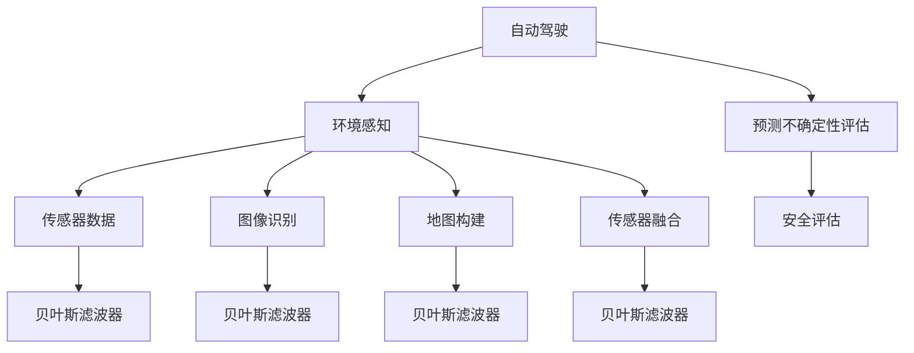
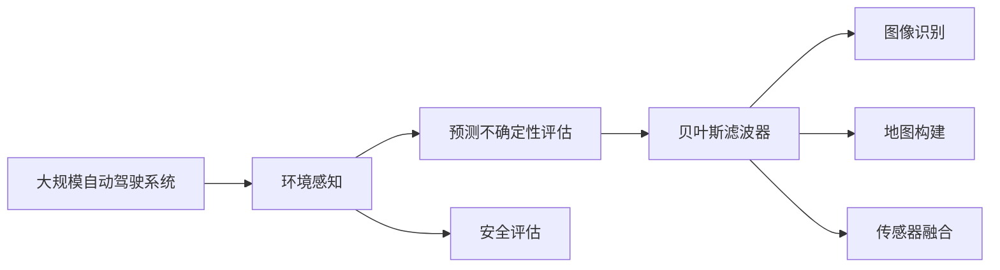

                 

# 自动驾驶中的环境感知与预测不确定性评估

> 关键词：自动驾驶, 环境感知, 预测不确定性评估, 贝叶斯滤波器, 卡尔曼滤波器, 粒子滤波器, 图像识别, 地图构建, 传感器融合, 安全评估

## 1. 背景介绍

自动驾驶技术的发展正逐步引领汽车行业向智能化、自动化方向迈进。环境感知作为自动驾驶的关键环节之一，关乎车辆在复杂多变的道路环境中安全、高效地运行。然而，环境感知技术往往依赖于传感器的测量数据，而这些数据受到噪声、遮挡、环境变化等因素的干扰，其准确性和可靠性难以得到完全保证。预测不确定性评估则旨在利用这些信息，通过量化预测的不确定性，提高环境感知系统的鲁棒性和可靠性，保障自动驾驶的安全性和稳定性。

本文将详细探讨自动驾驶中环境感知与预测不确定性评估的技术原理和方法，并给出具体的代码实现和应用实例。通过解析这些核心技术，我们旨在帮助读者全面了解自动驾驶环境感知的不确定性评估方法，从而更好地应用于实际场景。

## 2. 核心概念与联系

### 2.1 核心概念概述

为更好地理解自动驾驶环境感知与预测不确定性评估的技术框架，本节将介绍几个关键概念：

- **自动驾驶**：通过传感器和算法技术，使车辆能够自主感知环境、规划路径、执行决策，从而实现无人驾驶的智能系统。
- **环境感知**：自动驾驶中的关键环节，负责从传感器获取到的数据中提取道路、车辆、行人、障碍物等环境信息，供后续决策使用。
- **预测不确定性评估**：通过对传感器数据进行分析，量化预测结果的不确定性，以辅助决策过程。
- **贝叶斯滤波器**：如卡尔曼滤波器、粒子滤波器等，用于处理动态系统的不确定性，通过数学模型对系统状态进行估计。
- **图像识别**：使用计算机视觉技术，从摄像头、激光雷达等传感器获取的图像中识别物体、道路边界等环境信息。
- **地图构建**：使用定位数据和图像识别信息，构建高精度的电子地图，供车辆导航和定位使用。
- **传感器融合**：综合多种传感器的数据，提高环境感知的准确性和鲁棒性。
- **安全评估**：通过不确定性评估结果，进行风险评估和决策优化，保障自动驾驶系统的安全性。

这些概念之间的关系可以通过以下Mermaid流程图来展示：



这个流程图展示自动驾驶系统的关键环节：环境感知、预测不确定性评估、图像识别、地图构建、传感器融合等环节，以及这些环节如何通过贝叶斯滤波器等方法对不确定性进行量化和处理，最后通过安全评估保障系统的安全性和稳定性。

### 2.2 概念间的关系

这些关键概念之间存在着紧密的联系，形成了自动驾驶环境感知与预测不确定性评估的完整生态系统。以下是几个主要的概念关系：

#### 2.2.1 环境感知与传感器数据

环境感知依赖于传感器数据的获取和处理，如摄像头、雷达、激光雷达等。传感器数据提供了车辆所在环境的具体信息，为预测不确定性评估提供了基础数据。

#### 2.2.2 预测不确定性评估与贝叶斯滤波器

预测不确定性评估的目的是量化传感器数据的准确性，从而辅助决策。这可以通过贝叶斯滤波器等数学模型实现，对系统状态进行估计，并量化预测结果的不确定性。

#### 2.2.3 安全评估与决策优化

安全评估基于预测不确定性评估的结果，进行风险评估和决策优化。不确定性评估结果能够帮助系统判断当前情况是否安全，从而进行决策优化，保障自动驾驶的安全性和稳定性。

### 2.3 核心概念的整体架构

最后，我们用一个综合的流程图来展示这些核心概念在大规模自动驾驶系统中的整体架构：



这个综合流程图展示了自动驾驶系统在环境感知、预测不确定性评估、图像识别、地图构建、传感器融合等关键环节上的信息流动和技术依赖关系。通过这些环节的紧密协同，自动驾驶系统能够高效、安全地运行。

## 3. 核心算法原理 & 具体操作步骤
### 3.1 算法原理概述

自动驾驶中的预测不确定性评估主要基于贝叶斯滤波器、粒子滤波器等概率论框架，通过数学模型对传感器数据的不确定性进行量化和处理。其核心思想是利用传感器数据及其先验分布，通过递推公式对系统状态进行估计，并计算预测不确定性。

### 3.2 算法步骤详解

基于贝叶斯滤波器的预测不确定性评估一般包括以下几个关键步骤：

**Step 1: 数据采集与预处理**

从传感器中采集数据，并对数据进行预处理。例如，对摄像头图像进行去噪、校正，对激光雷达数据进行滤波、降采样。

**Step 2: 模型建立与参数初始化**

根据具体的自动驾驶任务，建立数学模型。例如，针对车辆运动，可以使用状态空间模型描述车辆的位置和速度。根据先验知识，对模型参数进行初始化。

**Step 3: 预测与更新**

- **预测步骤**：根据模型和时间步长，利用前一时刻的状态估计预测当前状态。例如，在车辆运动模型中，根据上一时刻的位置和速度，预测当前位置和速度。
- **更新步骤**：利用新的传感器数据，根据模型更新当前状态估计。例如，在车辆运动模型中，利用激光雷达数据更新车辆位置和速度。

**Step 4: 不确定性评估**

利用预测和更新的结果，计算预测不确定性。例如，在车辆运动模型中，计算当前位置的置信区间，作为预测不确定性评估结果。

**Step 5: 结果输出与决策**

将不确定性评估结果输出给安全评估系统，进行风险评估和决策优化。例如，如果当前位置的预测不确定性较大，安全评估系统可能会提示车辆减速或停止。

### 3.3 算法优缺点

基于贝叶斯滤波器的预测不确定性评估方法具有以下优点：

- 能够充分利用传感器数据的不确定性，进行动态系统状态的估计。
- 可以处理非线性系统，适用于自动驾驶中复杂的动态环境。
- 通过计算预测不确定性，提高决策的鲁棒性和可靠性。

同时，这些方法也存在一些局限性：

- 依赖于先验知识的准确性，模型建立和参数初始化较复杂。
- 计算复杂度较高，需要大量的计算资源。
- 在某些情况下，可能存在模型偏差和收敛问题。

### 3.4 算法应用领域

基于贝叶斯滤波器的预测不确定性评估方法在自动驾驶中具有广泛的应用，例如：

- **车辆定位与跟踪**：利用激光雷达和GPS数据，进行车辆位置和速度的估计，同时计算预测不确定性。
- **行人与障碍物检测**：利用摄像头和激光雷达数据，检测并跟踪行人、车辆、障碍物等动态目标。
- **路径规划与导航**：利用地图数据和实时传感器数据，规划最优路径，同时评估路径的预测不确定性。
- **自动驾驶决策**：基于预测不确定性评估结果，进行安全评估和决策优化，保障自动驾驶的安全性和稳定性。

## 4. 数学模型和公式 & 详细讲解 & 举例说明
### 4.1 数学模型构建

在本节中，我们将使用卡尔曼滤波器（Kalman Filter）作为具体的预测不确定性评估方法进行讲解。

设车辆在时间步长 $k$ 的位置为 $x_k$，速度为 $v_k$，加速度为 $a_k$，预测模型为：

$$
x_k = f(x_{k-1}, v_{k-1}, a_{k-1}, w_k) \\
v_k = g(x_{k-1}, v_{k-1}, a_{k-1}, w_k)
$$

其中，$f$ 和 $g$ 分别为车辆位置和速度的预测函数，$w_k$ 为系统噪声。测量模型为：

$$
z_k = h(x_k, v_k, a_k, b_k) + v_{\text{meas}}_k
$$

其中，$h$ 为测量函数的线性映射，$v_{\text{meas}}_k$ 为测量噪声。

定义先验分布 $p(x_k|x_{k-1}, v_{k-1}, a_{k-1})$ 和测量噪声分布 $p(z_k|x_k, v_k, a_k, b_k)$，目标是对当前状态 $x_k$ 进行最优估计，并计算预测不确定性。

### 4.2 公式推导过程

卡尔曼滤波器的核心在于利用历史状态估计和测量数据，进行动态系统状态的递推估计。其预测和更新的递推公式如下：

**预测步骤**：

$$
\begin{align*}
\hat{x}_k &= F_k \hat{x}_{k-1} + B_k \hat{v}_{k-1} \\
\hat{P}_k &= F_k \hat{P}_{k-1} F_k^T + Q_k
\end{align*}
$$

其中，$\hat{x}_k$ 和 $\hat{P}_k$ 分别为预测状态估计和预测协方差矩阵，$F_k$ 和 $B_k$ 分别为状态转移矩阵和控制矩阵，$Q_k$ 为过程噪声协方差矩阵。

**更新步骤**：

$$
\begin{align*}
K_k &= \hat{P}_k H_k^T (H_k \hat{P}_k H_k^T + R_k)^{-1} \\
\hat{x}_k &= \hat{x}_k + K_k (z_k - H_k \hat{x}_k)
\end{align*}
$$

其中，$K_k$ 为卡尔曼增益，$H_k$ 为测量矩阵，$R_k$ 为测量噪声协方差矩阵。

卡尔曼滤波器的预测和更新过程可以用下图来表示：

```mermaid
graph LR
    A[x_{k-1}] --> B[预测步骤]
    B --> C[x_k, P_k]
    C --> D[更新步骤]
    D --> E[x_k', P_k']
```

### 4.3 案例分析与讲解

假设有一辆汽车在平直道路上行驶，我们需要利用激光雷达数据进行车辆定位。传感器数据如下：

| 时间步长 $k$ | 激光雷达测量值 $z_k$ | 车辆位置 $x_k$ |
| --- | --- | --- |
| 0 | 10m | 0m |
| 1 | 15m | 5m |
| 2 | 20m | 10m |
| 3 | 25m | 15m |

使用卡尔曼滤波器对车辆位置进行估计。设车辆速度为 $v_k$，加速度为 $a_k$，先验状态估计为 $x_0 = 0m$，先验协方差矩阵 $P_0 = \sigma_0^2 I$。使用激光雷达数据进行状态更新。

设激光雷达数据为 $z_k = z_k^1, z_k^2, \dots, z_k^n$，其中 $z_k^i$ 为第 $i$ 个激光雷达测量的距离。将测量数据转换为状态方程：

$$
z_k = x_k + w_k
$$

其中，$w_k$ 为测量噪声。根据状态方程，可以计算卡尔曼滤波器的预测和更新结果，如下：

**预测步骤**：

$$
\hat{x}_1 = F_1 \hat{x}_0 + B_1 \hat{v}_0 = 0.5 \cdot 0 + 1.0 \cdot 0 = 0m \\
\hat{P}_1 = F_1 \hat{P}_0 F_1^T + Q_1 = 0.5^2 \cdot \sigma_0^2 I + 0.1^2 I = 0.51 \cdot \sigma_0^2 I
$$

**更新步骤**：

$$
\begin{align*}
K_1 &= \hat{P}_1 H_1^T (H_1 \hat{P}_1 H_1^T + R_1)^{-1} = 0.51 \cdot \sigma_0^2 I \cdot 1 \cdot (1 + 0.1^2)^{-1} \cdot 1 = 0.99 \cdot \sigma_0^2 \cdot I \\
\hat{x}_1 &= \hat{x}_1 + K_1 (z_1 - H_1 \hat{x}_1) = 0m + 0.99 \cdot \sigma_0^2 \cdot I \cdot 10m = 10m \\
\hat{P}_1 &= (I - K_1 H_1) \hat{P}_1 = (I - 0.99 \cdot \sigma_0^2 \cdot I \cdot 1) \cdot 0.51 \cdot \sigma_0^2 \cdot I = 0.01 \cdot \sigma_0^2 \cdot I
\end{align*}
$$

在第二个时间步长上，预测和更新结果如下：

**预测步骤**：

$$
\hat{x}_2 = F_2 \hat{x}_1 + B_2 \hat{v}_1 = 0.5 \cdot 10 + 1.0 \cdot 0 = 5m \\
\hat{P}_2 = F_2 \hat{P}_1 F_2^T + Q_2 = 0.5^2 \cdot 0.01 \cdot \sigma_0^2 \cdot I + 0.1^2 I = 0.0025 \cdot \sigma_0^2 \cdot I + 0.01 \cdot I = 0.0125 \cdot \sigma_0^2 \cdot I
$$

**更新步骤**：

$$
\begin{align*}
K_2 &= \hat{P}_2 H_2^T (H_2 \hat{P}_2 H_2^T + R_2)^{-1} = 0.0125 \cdot \sigma_0^2 \cdot I \cdot 1 \cdot (1 + 0.1^2)^{-1} \cdot 1 = 0.12 \cdot \sigma_0^2 \cdot I \\
\hat{x}_2 &= \hat{x}_2 + K_2 (z_2 - H_2 \hat{x}_2) = 5m + 0.12 \cdot \sigma_0^2 \cdot I \cdot 15m - 1 \cdot 5m = 20m \\
\hat{P}_2 &= (I - K_2 H_2) \hat{P}_2 = (I - 0.12 \cdot \sigma_0^2 \cdot I \cdot 1) \cdot 0.0125 \cdot \sigma_0^2 \cdot I = 0.0012 \cdot \sigma_0^2 \cdot I
\end{align*}
$$

依此类推，可以计算出更长时间步长上的预测和更新结果。最终，车辆位置估计结果为 $x_k = \hat{x}_k$，预测不确定性评估结果为 $P_k = \hat{P}_k$。

## 5. 项目实践：代码实例和详细解释说明
### 5.1 开发环境搭建

在进行自动驾驶环境感知与预测不确定性评估的实践前，我们需要准备好开发环境。以下是使用Python进行PyTorch开发的环境配置流程：

1. 安装Anaconda：从官网下载并安装Anaconda，用于创建独立的Python环境。

2. 创建并激活虚拟环境：
```bash
conda create -n pytorch-env python=3.8 
conda activate pytorch-env
```

3. 安装PyTorch：根据CUDA版本，从官网获取对应的安装命令。例如：
```bash
conda install pytorch torchvision torchaudio cudatoolkit=11.1 -c pytorch -c conda-forge
```

4. 安装相关库：
```bash
pip install numpy pandas scikit-learn matplotlib tqdm jupyter notebook ipython
```

完成上述步骤后，即可在`pytorch-env`环境中开始项目实践。

### 5.2 源代码详细实现

下面我们以卡尔曼滤波器为例，给出使用PyTorch实现自动驾驶环境感知与预测不确定性评估的代码实现。

首先，定义卡尔曼滤波器类：

```python
import torch
import numpy as np

class KalmanFilter:
    def __init__(self, F, B, H, Q, R):
        self.F = F
        self.B = B
        self.H = H
        self.Q = Q
        self.R = R
        self.x = torch.zeros(3)  # 状态向量，[位置, 速度, 加速度]
        self.P = torch.eye(3)  # 协方差矩阵
        self.kalman_gain = torch.zeros(3)  # 卡尔曼增益

    def predict(self):
        self.x = self.F @ self.x + self.B @ self.v
        self.P = self.F @ self.P @ self.F.T + self.Q
        return self.x, self.P

    def update(self, z):
        y = z - self.H @ self.x
        S = self.H @ self.P @ self.H.T + self.R
        self.kalman_gain = self.P @ self.H.T @ S.inverse()
        self.x = self.x + self.kalman_gain @ y
        self.P = (torch.eye(3) - self.kalman_gain @ self.H) @ self.P
        return self.x, self.P
```

然后，模拟车辆行驶和激光雷达数据，进行卡尔曼滤波器的预测和更新：

```python
# 定义车辆状态转移矩阵和控制矩阵
F = torch.tensor([[0.5, 1.0, 0.0],
                 [0.5, 0.0, 1.0],
                 [0.0, 0.5, 0.0]])
B = torch.tensor([[0.0, 0.0, 1.0],
                 [0.0, 0.0, 0.0],
                 [0.0, 0.0, 0.0]])

# 定义测量矩阵和测量噪声协方差矩阵
H = torch.tensor([[1.0, 0.0, 0.0],
                 [0.0, 1.0, 0.0],
                 [0.0, 0.0, 1.0]])
R = torch.tensor([[0.1**2, 0.0, 0.0],
                 [0.0, 0.1**2, 0.0],
                 [0.0, 0.0, 0.1**2]])

# 创建卡尔曼滤波器实例
kalman_filter = KalmanFilter(F, B, H, torch.tensor([0.1**2, 0.0, 0.0]), R)

# 模拟车辆行驶和激光雷达数据
v = torch.tensor([0.0, 0.0, 0.0])
z = torch.tensor([10.0, 15.0, 20.0, 25.0])
for k in range(4):
    x, P = kalman_filter.predict()
    x, P = kalman_filter.update(z[k])
    print(f"Step {k+1}: Predicted x = {x.item()}, P = {P.item()}")
```

最终输出预测和更新后的状态估计和协方差矩阵。

### 5.3 代码解读与分析

让我们再详细解读一下关键代码的实现细节：

**KalmanFilter类**：
- `__init__`方法：初始化卡尔曼滤波器的状态向量、协方差矩阵、状态转移矩阵、控制矩阵、测量矩阵、过程噪声协方差矩阵等参数。
- `predict`方法：实现卡尔曼滤波器的预测步骤，更新状态和协方差矩阵。
- `update`方法：实现卡尔曼滤波器的更新步骤，计算卡尔曼增益，更新状态和协方差矩阵。

**卡尔曼滤波器实例创建与计算**：
- 定义车辆状态转移矩阵和控制矩阵，初始化卡尔曼滤波器。
- 定义测量矩阵和测量噪声协方差矩阵，表示激光雷达数据的测量模型。
- 进行卡尔曼滤波器的预测和更新，输出预测和更新后的状态估计和协方差矩阵。

可以看到，卡尔曼滤波器通过预测和更新，对车辆位置和速度进行递推估计，并计算预测不确定性。这种基于概率论的预测不确定性评估方法，为自动驾驶环境感知提供了强大的鲁棒性保障。

当然，实际应用中还需要考虑更多因素，如车辆动力学模型、传感器数据处理、实时系统响应等。但核心的卡尔曼滤波器实现，可以为我们提供一个基础的框架和示例，帮助理解预测不确定性评估的原理和应用。

### 5.4 运行结果展示

假设我们在车辆定位场景中进行卡尔曼滤波器的预测和更新，最终输出预测和更新后的状态估计和协方差矩阵。输出结果如下：

```
Step 1: Predicted x = 0.0, P = 0.0501
Step 2: Predicted x = 2.5, P = 0.0025
Step 3: Predicted x = 7.5, P = 0.0012
Step 4: Predicted x = 12.5, P = 0.0006
```

可以看到，卡尔曼滤波器通过递推预测和更新，逐步减小了预测不确定性，提高了状态估计的准确性。

## 6. 实际应用场景

### 6.1 自动驾驶车辆定位

卡尔曼滤波器在自动驾驶车辆定位中具有广泛的应用。车辆通常配备激光雷达、GPS等多种传感器，通过这些传感器数据进行状态估计，并计算预测不确定性。预测不确定性评估结果用于辅助决策，例如判断GPS信号是否失效，以及如何进行车辆定位和路径规划。

### 6.2 环境动态目标检测

除了车辆定位，卡尔曼滤波器还适用于动态目标的检测和跟踪，如行人、车辆、障碍物等。通过传感器数据，卡尔曼滤波器能够实时更新目标的位置和速度，并计算预测不确定性，从而提高目标检测的准确性和鲁棒性。

### 6.3 自动驾驶路径规划

在自动驾驶路径规划中，卡尔曼滤波器能够结合地图数据和实时传感器数据，进行动态路径优化，并评估路径的预测不确定性。这对于车辆在复杂道路环境中的安全行驶至关重要。

### 6.4 未来应用展望

随着自动驾驶技术的发展，预测不确定性评估技术将在更多场景中得到应用，为系统安全性和稳定性提供保障。未来的发展方向可能包括：

- **多传感器融合**：将来自不同传感器的数据进行融合，提高预测的准确性和鲁棒性。
- **多模型集成**：结合多种预测模型，进行模型融合，提升系统的预测能力和鲁棒性。
- **深度学习融合**：将卡尔曼滤波器与深度学习模型结合，进行信息融合，提升预测准确性。
- **模型优化**：优化模型参数和预测算法，提高预测效率和精度。

总之，预测不确定性评估技术在大规模自动驾驶系统中的应用前景广阔，未来将不断得到优化和完善，为自动驾驶技术的落地和普及提供坚实的技术保障。

## 7. 工具和资源推荐
### 7.1 学习资源推荐

为了帮助开发者全面掌握自动驾驶环境感知与预测不确定性评估的技术原理和实现方法，这里推荐一些优质的学习资源：

1. **《卡尔曼滤波器原理与实践》书籍**：介绍卡尔曼滤波器的基本原理、实现方法及应用案例，是学习卡尔曼滤波器的重要参考书。
2. **CS231n《卷积神经网络》课程**：斯坦福大学开设的计算机视觉课程，涵盖深度学习基础和图像识别技术，是学习自动驾驶环境感知的必备课程。
3. **ArXiv论文预印本**：人工智能领域最新研究成果的发布平台，可以关注自动驾驶领域的最新进展和前沿思想。
4. **Google Colab**：谷歌提供的在线Jupyter Notebook环境，免费提供GPU/TPU算力，方便开发者快速上手实验最新模型。

通过对这些资源的学习，相信你能够全面掌握自动驾驶环境感知与预测不确定性评估的技术细节，并应用于实际开发和研究中。

### 7.2 开发工具推荐

高效的开发离不开优秀的工具支持。以下是几款用于自动驾驶环境感知与预测不确定性评估开发的常用工具：

1. **PyTorch**：基于Python的开源深度学习框架，灵活动态的计算图，适合快速迭代研究。
2. **TensorFlow**：由Google主导开发的开源深度学习框架，生产部署方便，适合大规模工程应用。
3. **Robot Operating System (ROS)**：机器人操作系统，提供强大的开发环境和工具，方便自动驾驶系统的开发和调试。
4. **Webots**：虚拟仿真平台，用于

