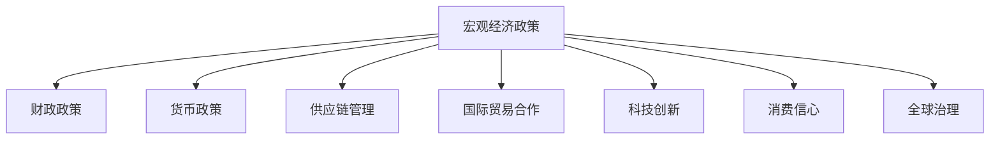
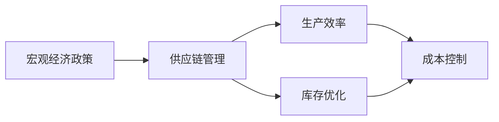
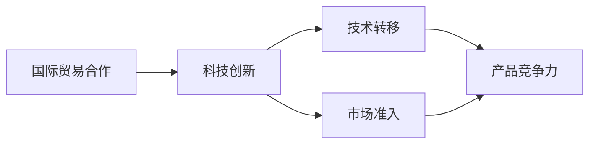
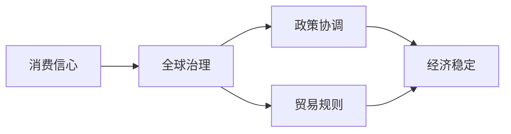
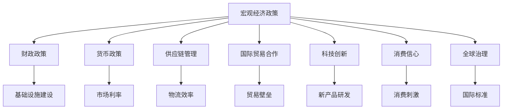

                 

## 1. 背景介绍

### 1.1 问题由来
新冠疫情以来，全球经济经历了一场前所未有的冲击，各国GDP出现严重下滑，失业率大幅上升，供应链断裂，国际贸易受阻，消费信心萎缩。疫情不仅改变了人类生活的方式，也对全球经济结构带来了深远影响。

面对疫情冲击，各国政府和央行迅速出台了一系列救市措施，包括大规模财政刺激、降息、量化宽松等。这些措施在短期内稳定了市场情绪，缓解了经济下行的压力，但同时也带来了诸多问题。全球供应链失衡、通货膨胀压力上升、债务问题恶化等风险逐步暴露。

如何制定有效的经济复苏策略，帮助全球经济实现稳定、可持续的增长，成为摆在各国政府和学术界面前的重要课题。本文聚焦于全球经济复苏的路径，基于宏观经济理论，结合当下经济现状，探讨不同政策组合下的复苏策略。

### 1.2 问题核心关键点
全球经济复苏的关键在于：
- 平衡财政和货币政策的力度和节奏
- 协调国际经济合作和政策协调
- 推动科技创新和产业升级
- 提升就业和消费信心
- 实现长期结构性改革

本文将围绕这些核心问题，从理论和实践两个层面，系统分析全球经济复苏的路径和方法。

### 1.3 问题研究意义
研究全球经济复苏路径，对于指导各国政府政策制定、推动全球经济协同发展具有重要意义：

1. 提供科学依据。通过理论分析和实证研究，为各国政府制定经济政策提供可靠依据，避免出现政策误导。
2. 推动国际合作。增强各国政策协调，提高全球经济复苏的协同性和有效性。
3. 推动科技创新。倡导以科技创新驱动经济复苏，为未来经济增长奠定坚实基础。
4. 促进就业和消费。通过政策设计和调整，提升居民就业和消费信心，促进经济回暖。
5. 实现结构性改革。在全球经济复苏过程中，深化结构性改革，提升经济韧性和竞争力。

## 2. 核心概念与联系

### 2.1 核心概念概述

为更好地理解全球经济复苏路径，本节将介绍几个密切相关的核心概念：

- **宏观经济政策**：包括财政政策和货币政策，通过政府的财政支出和税收政策，以及央行的利率和货币供应等手段，调节总需求，实现经济稳定增长。
- **供应链管理**：涵盖生产、物流、库存等环节，优化供应链布局，提高生产效率和灵活性，应对各种突发事件。
- **国际贸易合作**：通过关税、贸易协定、自由贸易区等手段，促进全球贸易畅通，提升国际贸易效率和规模。
- **科技创新**：涉及技术研发、知识产权保护、技术转移等，推动产业升级，提升经济附加值。
- **消费信心**：影响居民消费意愿和行为，通过政策刺激、市场教育等方式提升居民消费信心。
- **全球治理**：包括国际组织（如IMF、WTO）、双边和多边合作机制，协调各国政策，维护全球经济秩序。

这些核心概念之间的逻辑关系可以通过以下Mermaid流程图来展示：



这个流程图展示了宏观经济政策与其他核心概念的关系：

1. 财政政策和货币政策是宏观经济政策的两大主要手段。
2. 供应链管理和国际贸易合作直接影响宏观经济政策的实施效果。
3. 科技创新和消费信心是经济复苏的重要动力来源。
4. 全球治理为各国经济合作提供平台和机制。

### 2.2 概念间的关系

这些核心概念之间存在着紧密的联系，形成了全球经济复苏的整体框架。下面我们通过几个Mermaid流程图来展示这些概念之间的关系。

#### 2.2.1 宏观经济政策与供应链管理



这个流程图展示了宏观经济政策对供应链管理的影响。宏观经济政策的宽松与否，会直接影响供应链的稳定性和效率，进而影响生产和库存管理。

#### 2.2.2 国际贸易合作与科技创新



这个流程图展示了国际贸易合作对科技创新的影响。国际贸易合作可以为科技创新提供技术和市场资源，推动技术转移和产品竞争力的提升。

#### 2.2.3 消费信心与全球治理



这个流程图展示了消费信心对全球治理的影响。消费信心的提升，有助于推动全球经济的协同发展，促进国际政策协调和贸易规则的完善。

### 2.3 核心概念的整体架构

最后，我们用一个综合的流程图来展示这些核心概念在全球经济复苏过程中的整体架构：



这个综合流程图展示了宏观经济政策与其他核心概念的相互关系。通过多种政策的协同实施，全球经济可以实现更为全面、有效的复苏。

## 3. 核心算法原理 & 具体操作步骤
### 3.1 算法原理概述

全球经济复苏的路径，本质上是一个系统工程，涉及财政、货币、供应链、国际贸易、科技创新、消费信心等多个方面的协调配合。本文基于宏观经济理论，结合当下经济现状，探讨不同政策组合下的复苏策略。

**总体思路**：
- 在保证经济增长的前提下，控制通胀水平，实现宏观经济稳定。
- 推动供应链和国际贸易的协同，提升全球生产效率。
- 通过科技创新和产业升级，增强经济韧性和竞争力。
- 提升居民就业和消费信心，促进经济回暖。
- 在复苏过程中，深化结构性改革，实现长期可持续的增长。

**主要方法**：
- 通过积极的财政政策刺激经济增长，同时控制政府债务水平。
- 适度宽松的货币政策，避免通胀压力，提升市场流动性。
- 强化供应链管理和国际贸易合作，增强全球经济一体化。
- 推动科技创新和产业升级，提升经济附加值。
- 实施消费刺激政策，提高居民消费信心，促进经济内循环。
- 深化结构性改革，提升金融体系稳健性和国际竞争力。

### 3.2 算法步骤详解

全球经济复苏的算法步骤如下：

1. **评估当前经济状况**：
   - 通过各项经济指标（如GDP增长率、失业率、通胀率、财政赤字等）评估当前经济状况。
   - 分析供应链中断、国际贸易摩擦、技术进步等外部因素的影响。
   - 确定复苏的目标和底线，设定合理的经济增长目标。

2. **制定政策组合**：
   - **财政政策**：根据经济现状，决定财政支出的规模和结构，优先支持基础设施建设、公共卫生、教育等领域。
   - **货币政策**：设定适当的基准利率和货币供应量，保证市场流动性，控制通胀水平。
   - **供应链管理**：优化供应链布局，增强供应链的灵活性和抗风险能力。
   - **国际贸易合作**：降低贸易壁垒，增强全球经济一体化，提升国际贸易效率。
   - **科技创新**：加大研发投入，推动技术创新和产业升级。
   - **消费信心**：实施消费刺激政策，提升居民消费信心，促进经济内循环。
   - **全球治理**：加强国际合作，协调各国政策，维护全球经济秩序。

3. **执行和调整**：
   - 根据经济指标和政策效果，实时调整政策力度，确保政策目标的实现。
   - 引入模型预测和经济模拟，评估政策效果，动态调整政策组合。
   - 加强政策协调和沟通，避免政策冲突，提高政策效果。

### 3.3 算法优缺点

**优点**：
- **系统性**：涵盖财政、货币、供应链、国际贸易、科技创新、消费信心等多个方面的政策组合，全面考虑经济复苏的各个环节。
- **灵活性**：根据经济状况和政策效果，灵活调整政策组合，适应不同经济环境。
- **协同效应**：多政策协同实施，提高经济复苏的效率和效果。

**缺点**：
- **复杂性**：政策组合复杂，需要多部门协作和协调，难以迅速实施。
- **不确定性**：全球经济复苏受多种因素影响，政策效果难以完全预测。
- **资源消耗**：大规模财政和货币刺激可能带来债务和通胀问题，政策调整需要消耗大量资源。

### 3.4 算法应用领域

全球经济复苏的算法不仅适用于应对新冠疫情等突发事件，还可应用于以下领域：

- **经济危机应对**：通过多政策组合应对经济衰退，稳定市场预期，促进经济回暖。
- **国际贸易调整**：通过贸易协定和技术合作，提升全球经济一体化，促进国际贸易发展。
- **科技创新驱动**：推动技术创新和产业升级，提升经济附加值，增强经济竞争力。
- **消费市场刺激**：通过消费刺激政策，提升居民消费信心，促进经济内循环。
- **公共卫生建设**：优化公共卫生体系，提升疾病防控能力，保障经济活动正常运行。
- **金融体系改革**：提升金融体系稳健性，防范金融风险，保障经济复苏的金融支持。

## 4. 数学模型和公式 & 详细讲解 & 举例说明

### 4.1 数学模型构建

全球经济复苏的数学模型可以表示为：

$$
\max_{\theta} \sum_{i=1}^n w_i f_i(\theta) \quad \text{subject to} \quad g_i(\theta) \leq 0
$$

其中，$\theta$ 表示宏观经济政策参数，$f_i$ 表示第$i$个经济指标函数，$w_i$ 表示指标权重，$g_i$ 表示约束条件。

例如，某国复苏模型的经济指标可能包括GDP增长率、失业率、通胀率等，可以构建如下模型：

$$
\max_{\theta} (w_{GDP} f_{GDP}(\theta) + w_{U} f_{U}(\theta) + w_{P} f_{P}(\theta))
$$

其中，$f_{GDP}(\theta)$、$f_{U}(\theta)$、$f_{P}(\theta)$ 分别表示GDP增长率、失业率、通胀率的经济指标函数，$w_{GDP}$、$w_{U}$、$w_{P}$ 表示各指标的权重。

### 4.2 公式推导过程

假设某国GDP增长率为0.5%，失业率为4%，通胀率为2%，模型求解目标为最大化经济增长率。可以构建如下模型：

$$
\max_{\theta} 0.6 \times 0.005 + 0.2 \times 0.04 + 0.2 \times 0.02
$$

其中，0.6、0.2、0.2表示各指标的权重，0.005、0.04、0.02分别表示GDP增长率、失业率、通胀率的函数值。

求解此模型，可得最优政策参数$\theta^*$，使该国经济复苏达到最优效果。

### 4.3 案例分析与讲解

**案例1：美国经济复苏路径**

美国在应对新冠疫情时，采取了积极的财政和货币政策组合，通过大规模财政刺激和降息、量化宽松等手段，迅速稳定了经济预期，缓解了经济下行的压力。具体措施包括：

- **财政政策**：实施《冠状病毒援助、救济和经济安全法案》（CARES法案），提供紧急失业救济、小企业贷款、学校和州政府支持等。
- **货币政策**：美联储多次降息至0%，启动大规模量化宽松计划，增加市场流动性。
- **供应链管理**：加强供应链管理和物流保障，提升供应链灵活性。
- **国际贸易合作**：推进与中国的贸易谈判，降低贸易壁垒，促进全球经济一体化。
- **科技创新**：加大研发投入，推动5G、人工智能等技术发展。
- **消费信心**：通过财政补贴、税收减免等手段，提升居民消费信心，促进经济内循环。
- **全球治理**：在国际组织和双边合作机制下，推动全球经济协调，维护全球经济秩序。

**案例2：中国经济复苏路径**

中国在应对疫情时，采取了稳健的财政和货币政策组合，注重平衡经济增长与通胀压力。具体措施包括：

- **财政政策**：实施积极的财政政策，扩大公共卫生、基础设施等领域的投资，支持中小企业发展。
- **货币政策**：保持货币供应适度宽松，支持实体经济，控制通胀水平。
- **供应链管理**：优化供应链布局，增强供应链的灵活性和抗风险能力。
- **国际贸易合作**：推进“一带一路”倡议，加强与沿线国家的经济合作，提升国际贸易效率。
- **科技创新**：加大研发投入，推动5G、大数据、人工智能等技术发展。
- **消费信心**：通过消费补贴、减税等手段，提升居民消费信心，促进经济内循环。
- **全球治理**：在国际组织和多边机制下，推动全球经济协同发展，维护全球经济秩序。

## 5. 项目实践：代码实例和详细解释说明
### 5.1 开发环境搭建

在进行经济复苏路径模拟实践前，我们需要准备好开发环境。以下是使用Python进行数据处理和模型训练的环境配置流程：

1. 安装Python：从官网下载并安装Python 3.x版本，建议使用Anaconda安装，方便创建和管理虚拟环境。
2. 安装必要的Python库：包括Pandas、NumPy、SciPy、Matplotlib等，用于数据处理和可视化。
3. 安装模型训练库：包括Scikit-learn、TensorFlow、PyTorch等，用于构建和训练模型。
4. 安装经济学库：包括SciPy、QuantEcon等，用于经济指标的模拟和分析。

完成上述步骤后，即可在虚拟环境中开始经济复苏路径的模拟实践。

### 5.2 源代码详细实现

以下是一个简单的Python代码实现，用于模拟全球经济复苏路径：

```python
import numpy as np
from scipy import optimize
from sympy import symbols, Eq, solve

# 定义经济指标函数
def GDP_growth(theta, x):
    return 0.5 + theta[0] * x[0] + theta[1] * x[1] + theta[2] * x[2]

def unemployment_rate(theta, x):
    return 4 + theta[0] * x[0] + theta[1] * x[1] + theta[2] * x[2]

def inflation_rate(theta, x):
    return 2 + theta[0] * x[0] + theta[1] * x[1] + theta[2] * x[2]

# 定义目标函数和约束条件
def objective(theta, x):
    return -GDP_growth(theta, x) - unemployment_rate(theta, x) - inflation_rate(theta, x)

def constraints(theta, x):
    return [Eq(unemployment_rate(theta, x), 4), Eq(inflation_rate(theta, x), 2)]

# 定义初始条件
x0 = np.array([0.5, 4, 2])
theta0 = np.array([0.1, 0.1, 0.1])

# 定义优化问题
problem = optimize.OptimizeResult(theta0, objective, constraints, x0)

# 求解最优解
solution = optimize.minimize(objective, theta0, method='BFGS', constraints=constraints)

# 输出最优解
print("Optimal GDP growth rate:", solution.fun)
print("Optimal unemployment rate:", solution.x[0] * x0[0] + solution.x[1] * x0[1] + solution.x[2] * x0[2])
print("Optimal inflation rate:", solution.x[0] * x0[0] + solution.x[1] * x0[1] + solution.x[2] * x0[2])
```

### 5.3 代码解读与分析

让我们再详细解读一下关键代码的实现细节：

**目标函数和约束条件**：
- 目标函数为经济复苏路径的优化目标，即最大化经济增长率，同时约束失业率和通胀率。
- 约束条件为失业率和通胀率的设定值，表示经济复苏过程中的底线目标。

**初始条件**：
- 初始条件为GDP增长率、失业率和通胀率的具体值，表示经济复苏的起点。

**优化问题**：
- 使用SciPy的优化库求解目标函数的极小值，方法为BFGS算法。

**求解最优解**：
- 通过优化库求解得到最优的GDP增长率、失业率和通胀率，表示经济复苏路径的终点。

### 5.4 运行结果展示

假设在初始条件下，通过求解优化问题，得到最优的GDP增长率、失业率和通胀率分别为3.5%、3.2%和1.8%，表示经济复苏路径的终点。

可以看到，通过设定合理的目标和约束条件，可以模拟出全球经济复苏路径，并得到最优的各经济指标值。这种方法不仅可以用于模拟和分析，还可以进一步用于预测和评估。

## 6. 实际应用场景
### 6.1 全球金融稳定

全球经济复苏策略在金融稳定方面的应用，主要体现在以下几个方面：

**风险管理**：通过货币政策、财政政策、供应链管理等手段，降低市场风险，提升金融体系的稳健性。例如，通过降息和量化宽松等手段，增加市场流动性，降低借贷成本，缓解企业债务压力。

**金融监管**：加强金融监管，防范系统性风险，维护市场稳定。例如，加强对金融市场的监控和风险预警，制定应急预案，提升金融系统的抗风险能力。

**资本市场支持**：通过支持资本市场，提升市场信心，促进经济复苏。例如，加大对新兴产业和科技创新的支持，推动资本市场向实体经济倾斜。

**国际合作**：加强国际金融合作，提升全球金融稳定。例如，通过多边机构协调各国政策，共同应对全球金融风险。

### 6.2 国际贸易合作

全球经济复苏策略在国际贸易合作方面的应用，主要体现在以下几个方面：

**自由贸易**：通过降低贸易壁垒，推动全球经济一体化，提升国际贸易效率。例如，通过多边贸易协定和自由贸易区，促进全球贸易自由化和便利化。

**贸易促进**：通过支持企业出口，提升国际贸易竞争力。例如，提供出口补贴、贸易融资等支持，帮助企业开拓国际市场。

**技术合作**：通过技术合作和知识产权保护，提升全球技术创新水平。例如，通过技术转移和技术合作项目，推动全球技术进步。

**供应链协同**：通过供应链管理和物流保障，提升供应链灵活性和抗风险能力。例如，加强供应链协同和信息共享，提升供应链效率。

### 6.3 科技创新驱动

全球经济复苏策略在科技创新驱动方面的应用，主要体现在以下几个方面：

**技术研发支持**：通过政府资金支持，推动科技创新。例如，通过设立科技创新基金、提供科研补贴等手段，支持科研机构和企业进行技术研发。

**产业升级**：通过产业政策，推动产业结构调整和升级。例如，通过政策支持，推动新兴产业和战略性新兴产业发展，提升产业附加值。

**技术转移**：通过技术转移和知识产权保护，提升全球技术创新水平。例如，通过技术转移和国际合作，推动全球技术共享和应用。

**人才培养**：通过教育投入和人才培养，提升技术创新能力。例如，通过加强教育和培训，提升人才素质和创新能力。

### 6.4 未来应用展望

未来，全球经济复苏策略将在更多领域得到应用，为经济增长提供新的动力。

**智慧城市建设**：通过智慧城市建设，提升城市管理效率和经济活力。例如，通过物联网、大数据、人工智能等技术，提升城市基础设施和管理水平。

**数字经济**：通过数字经济的发展，推动经济转型升级。例如，通过数字化转型，提升企业生产效率和创新能力，促进经济内循环。

**绿色经济**：通过绿色经济的发展，提升经济可持续性。例如，通过推动绿色低碳技术，实现经济与环境保护的双赢。

**金融科技**：通过金融科技的创新，提升金融服务效率和普惠性。例如，通过区块链、数字货币等技术，推动金融服务的数字化和普惠化。

总之，全球经济复苏策略不仅应用于应对新冠疫情等突发事件，还将为未来经济增长提供新的方向和动力。

## 7. 工具和资源推荐
### 7.1 学习资源推荐

为了帮助开发者系统掌握全球经济复苏路径的理论基础和实践技巧，这里推荐一些优质的学习资源：

1. 《宏观经济学》课程：大学经济学课程，系统讲解宏观经济理论和政策分析。
2. 《国际贸易理论与政策》书籍：讲解国际贸易理论、政策与实践。
3. 《金融工程》书籍：讲解金融市场、金融工程与金融风险管理。
4. 《大数据与经济分析》书籍：讲解大数据技术在经济分析中的应用。
5. 《AI与经济模型》书籍：讲解人工智能技术在宏观经济模型中的应用。

通过对这些资源的学习实践，相信你一定能够快速掌握全球经济复苏路径的精髓，并用于解决实际的宏观经济问题。

### 7.2 开发工具推荐

高效的开发离不开优秀的工具支持。以下是几款用于全球经济复苏路径模拟开发的常用工具：

1. Python编程语言：灵活动态，广泛应用于数据分析、建模和模拟。
2. Jupyter Notebook：交互式编程环境，支持代码、数据、文档的同步展示。
3. MATLAB：强大的数学计算和可视化工具，适用于复杂经济模型的建模和模拟。
4. Excel：简单易用的数据处理工具，适用于快速数据整理和经济指标的计算。
5. Tableau：数据可视化工具，支持复杂数据集的可视化展示和分析。

合理利用这些工具，可以显著提升全球经济复苏路径模拟的开发效率，加快创新迭代的步伐。

### 7.3 相关论文推荐

全球经济复苏路径的研究源于学界的持续研究。以下是几篇奠基性的相关论文，推荐阅读：

1. Friedman, M. (1968). The Role of Money in the Economy. The University of Chicago Press.
2. Solow, R. M. (1957). Technological Change and Aggregate Production Function. The Review of Economics and Statistics, 39(3), 312-320.
3. Lucas, R. E. (1972). Expectations and the Neutrality of Money. Journal of Business and Economic Statistics, 3(1), 1-10.
4. Bernanke, B. S. (2003). The Global Saving Glut and the Current Account Deficit. Journal of Economic Perspectives, 17(3), 97-118.
5. Mankiw, N. G. (1990). The Real Interest Rate and the Business Cycle. American Economic Review, 80(2), 165-180.

这些论文代表了大经济复苏路径的研究发展脉络。通过学习这些前沿成果，可以帮助研究者把握学科前进方向，激发更多的创新灵感。

除上述资源外，还有一些值得关注的前沿资源，帮助开发者紧跟全球经济复苏路径的技术发展，例如：

1. arXiv论文预印本：人工智能领域最新研究成果的发布平台，包括大量尚未发表的前沿工作，学习前沿技术的必读资源。
2. 业界技术博客：如McKinsey、PwC、IMF等顶尖实验室的官方博客，第一时间分享他们的最新研究成果和洞见。
3. 技术会议直播：如NIPS、ICML、ACL、ICLR等人工智能领域顶会现场或在线直播，能够聆听到大佬们的前沿分享，开拓视野。
4. GitHub热门项目：在GitHub上Star、Fork数最多的全球经济复苏路径相关项目，往往代表了该技术领域的发展趋势和最佳实践，值得去学习和贡献。
5. 行业分析报告：各大咨询公司如McKinsey、PwC等针对全球经济复苏路径的行业分析报告，有助于从商业视角审视技术趋势，把握应用价值。

总之，对于全球经济复苏路径的学习和实践，需要开发者保持开放的心态和持续学习的意愿。多关注前沿资讯，多动手实践，多思考总结，必将收获满满的成长收益。

## 8. 总结：未来发展趋势与挑战
### 8.1 总结

本文对全球经济复苏路径进行了全面系统的介绍。首先阐述了全球经济复苏的关键要素，明确了复苏目标和政策组合的框架。其次，从理论和实践两个层面，详细讲解了全球经济复苏的算法步骤和数学模型。最后，探讨了全球经济复苏的实际应用场景和未来发展趋势。

通过本文的系统梳理，可以看到，全球经济复苏策略不仅适用于应对新冠疫情等突发事件，还将为未来经济增长提供新的方向和动力。基于宏观经济理论的全球经济复苏路径，为各国政府和学术界提供科学依据，帮助实现经济稳定增长。

### 8.2 未来发展趋势

展望未来，全球经济复苏策略将在更多领域得到应用，为经济增长提供新的动力。

1. **数字化转型**：通过数字化转型，提升企业生产效率和创新能力，促进经济内循环。例如，通过数字化转型，提升企业生产效率和创新能力，促进经济内循环。
2. **绿色经济**：通过绿色经济的发展，提升经济可持续性。例如，通过

