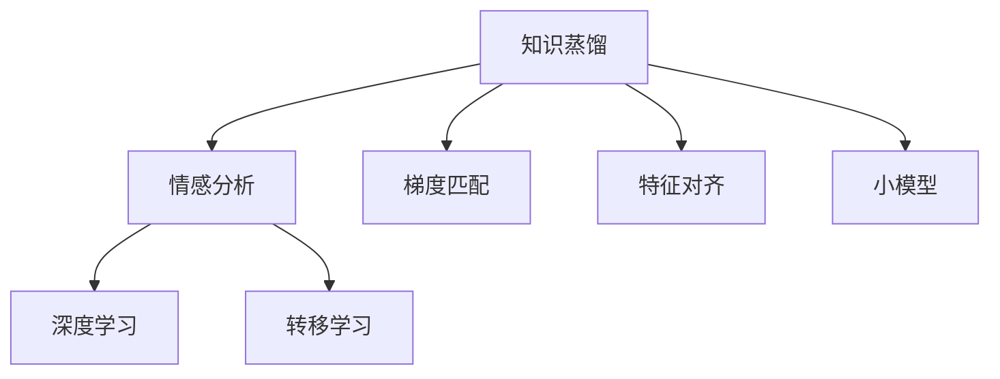
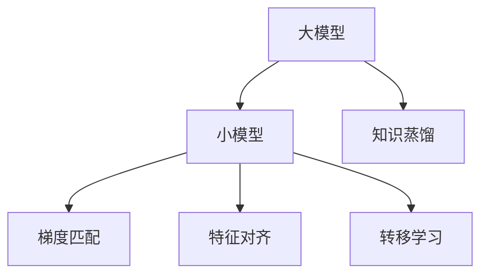
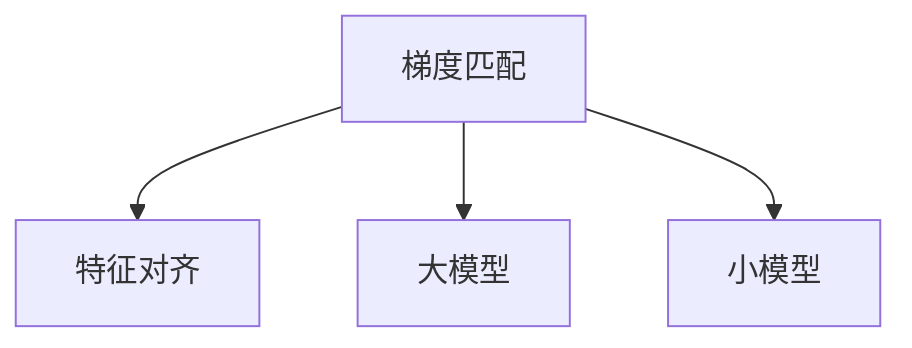
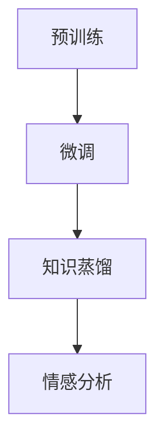
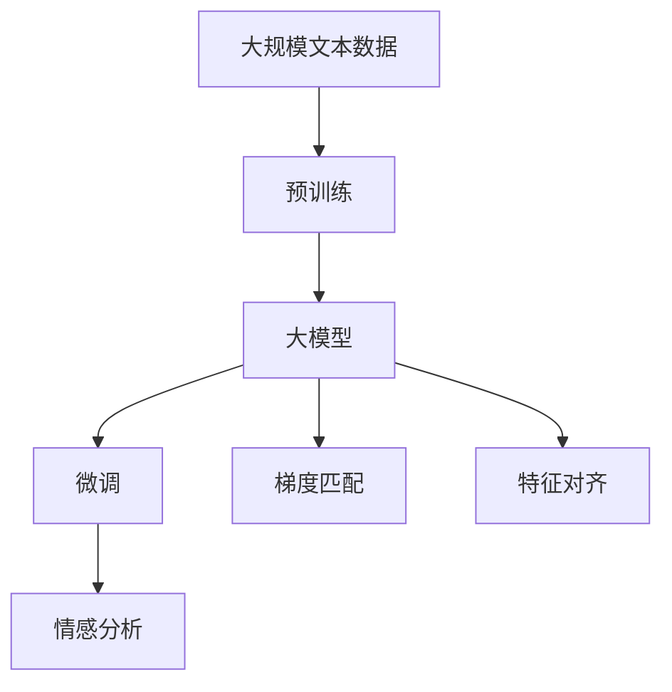

                 

# 知识蒸馏在情感分析任务中的应用

> 关键词：知识蒸馏,情感分析,深度学习,转移学习,梯度匹配,特征对齐

## 1. 背景介绍

### 1.1 问题由来

在自然语言处理（NLP）领域，情感分析（Sentiment Analysis）是一项重要的任务，旨在识别和提取文本中的主观情感信息。随着深度学习技术的快速发展，卷积神经网络（CNN）、循环神经网络（RNN）、长短期记忆网络（LSTM）等模型在情感分析中取得了显著的进展。然而，这些模型通常需要大量的标注数据进行训练，且模型复杂度较高，难以部署到资源受限的设备上。此外，大模型由于其参数量巨大，导致推理速度较慢，不适合实时应用场景。

为解决这些问题，研究者提出了知识蒸馏（Knowledge Distillation）方法。知识蒸馏是一种通过将知识从大模型传递到小模型的方法，从而在保留其精度的同时减小模型的参数量和计算资源消耗。其基本思想是使用大模型的知识来指导小模型的训练，使得小模型能够学习大模型所学到的知识。这种方法已经被广泛应用于图像分类、语音识别、文本生成等多个领域，并在情感分析任务中取得了不错的效果。

本文将系统地介绍知识蒸馏在情感分析任务中的应用，包括其原理、方法、实现细节及实际应用案例。通过对知识蒸馏的深入探讨，希望能为情感分析任务的高效、低成本、实时化提供新思路。

## 2. 核心概念与联系

### 2.1 核心概念概述

为了更好地理解知识蒸馏在情感分析任务中的应用，本节将介绍几个密切相关的核心概念：

- 知识蒸馏（Knowledge Distillation）：将大模型的知识（如权重、特征图、预测概率等）传递到小模型的过程，使得小模型能够在保持较高准确性的同时，参数量和计算资源消耗明显降低。
- 情感分析（Sentiment Analysis）：通过文本数据识别和提取主观情感信息的任务，分为极性分类（二分类）、情感强度分类（多分类）和情感标签预测（多标签分类）等类型。
- 深度学习（Deep Learning）：基于神经网络的机器学习范式，包括卷积神经网络（CNN）、循环神经网络（RNN）、长短期记忆网络（LSTM）等，广泛应用于图像、语音、文本等领域。
- 转移学习（Transfer Learning）：通过预训练模型在小数据集上进行微调，使其适应新任务，从而减少训练时间和成本。
- 梯度匹配（Gradient Matching）：通过调整小模型的权重和激活函数，使得小模型和大模型的梯度分布尽可能接近。
- 特征对齐（Feature Alignment）：通过优化小模型的特征表示，使其与大模型的特征表示一致。

这些概念之间的逻辑关系可以通过以下Mermaid流程图来展示：



这个流程图展示了几者之间的关系：

1. 知识蒸馏通过将大模型的知识传递到小模型，使得小模型能够在情感分析任务中取得优异性能。
2. 深度学习为大模型和小模型的训练提供了基础。
3. 转移学习通过在大模型上进行预训练，然后在小模型上进行微调，提高模型性能。
4. 梯度匹配和特征对齐是小模型和大模型之间的知识传递手段，确保小模型能够学习大模型的优秀特征表示。

### 2.2 概念间的关系

这些核心概念之间存在着紧密的联系，形成了知识蒸馏在情感分析任务中的应用框架。下面我们通过几个Mermaid流程图来展示这些概念之间的关系。

#### 2.2.1 知识蒸馏的流程



这个流程图展示了知识蒸馏的基本流程：

1. 大模型通过梯度匹配和特征对齐，将知识传递给小模型。
2. 小模型在大模型的指导下进行微调，进一步提高性能。
3. 小模型能够通过转移学习的方式，利用大模型在大规模数据上的预训练知识，从而在小规模数据集上也能取得不错的效果。

#### 2.2.2 梯度匹配和特征对齐的关系



这个流程图展示了梯度匹配和特征对齐之间的关系：

1. 梯度匹配通过调整小模型的权重和激活函数，使得小模型和大模型的梯度分布尽可能一致。
2. 特征对齐通过优化小模型的特征表示，使得其与大模型的特征表示一致。

#### 2.2.3 转移学习和知识蒸馏的关系



这个流程图展示了转移学习和知识蒸馏之间的关系：

1. 在大模型上进行预训练，获得丰富的语言知识。
2. 在小模型上进行微调，使用转移学习的方式利用大模型的预训练知识。
3. 通过知识蒸馏的方式，进一步优化小模型，提高其在情感分析任务上的性能。

### 2.3 核心概念的整体架构

最后，我们用一个综合的流程图来展示这些核心概念在大模型微调过程中的整体架构：



这个综合流程图展示了从预训练到微调，再到梯度匹配和特征对齐的完整过程。大模型首先在大规模文本数据上进行预训练，然后通过微调（包括梯度匹配和特征对齐）得到小模型。小模型在大模型的指导下，进行情感分析任务的微调，最终能够在大规模数据上取得优异的效果。 通过这些流程图，我们可以更清晰地理解知识蒸馏在大模型微调中的应用框架。

## 3. 核心算法原理 & 具体操作步骤

### 3.1 算法原理概述

知识蒸馏在情感分析任务中的应用，主要基于以下两个步骤：

1. 大模型在情感分析任务上进行训练，获得较为准确的情感分类器。
2. 小模型在大模型的指导下进行微调，利用大模型的知识，提高其在情感分析任务上的性能。

具体来说，知识蒸馏方法通过将大模型的知识传递到小模型，使得小模型在保持较高准确性的同时，参数量和计算资源消耗明显降低。这种范式在情感分析任务中具有以下几个优点：

- 减少计算资源消耗。通过微调小模型，可以大幅度降低模型的参数量和计算复杂度。
- 提高模型泛化能力。大模型的泛化能力较强，通过知识蒸馏，小模型可以学习大模型的泛化能力。
- 加速模型部署。小模型更适合部署在移动设备、边缘计算等资源受限的场景中，能够更快地实现模型推理。

### 3.2 算法步骤详解

基于知识蒸馏的情感分析任务微调过程包括以下几个关键步骤：

**Step 1: 准备预训练模型和数据集**
- 选择合适的预训练语言模型，如BERT、GPT等，作为初始化参数。
- 准备情感分析任务的标注数据集，包括训练集、验证集和测试集。标注数据集的质量和数量对模型性能影响较大，需要保证标注数据与预训练数据的分布一致。

**Step 2: 设计知识蒸馏过程**
- 在大模型上进行情感分析任务的预训练，获得较为准确的情感分类器。
- 定义蒸馏任务的目标函数，通常为大模型与小模型的交叉熵损失函数。
- 在大模型和小模型之间引入梯度匹配和特征对齐，确保小模型能够学习大模型的优秀特征表示。

**Step 3: 执行梯度训练**
- 将训练集数据分批次输入模型，前向传播计算损失函数。
- 反向传播计算参数梯度，根据设定的优化算法和学习率更新模型参数。
- 周期性在验证集上评估模型性能，根据性能指标决定是否触发 Early Stopping。
- 重复上述步骤直至满足预设的迭代轮数或 Early Stopping 条件。

**Step 4: 测试和部署**
- 在测试集上评估微调后模型在小样本数据上的性能，对比微调前后的精度提升。
- 使用微调后的模型对新样本进行推理预测，集成到实际的应用系统中。
- 持续收集新的数据，定期重新微调模型，以适应数据分布的变化。

以上是基于知识蒸馏的情感分析任务微调的一般流程。在实际应用中，还需要针对具体任务的特点，对微调过程的各个环节进行优化设计，如改进训练目标函数，引入更多的正则化技术，搜索最优的超参数组合等，以进一步提升模型性能。

### 3.3 算法优缺点

基于知识蒸馏的情感分析任务微调方法具有以下优点：

- 简单高效。只需准备少量标注数据，即可对预训练模型进行快速适配，获得较大的性能提升。
- 泛化能力强。大模型的泛化能力较强，通过知识蒸馏，小模型可以学习大模型的泛化能力，从而在特定领域取得优异效果。
- 适应性强。小模型更适合部署在资源受限的设备上，能够更好地适应不同的应用场景。

同时，该方法也存在一些局限性：

- 依赖标注数据。微调的效果很大程度上取决于标注数据的质量和数量，获取高质量标注数据的成本较高。
- 模型鲁棒性有限。当目标任务与预训练数据的分布差异较大时，微调的性能提升有限。
- 过拟合风险。小模型容易过拟合，尤其是当目标任务与预训练数据的分布差异较大时。
- 可解释性不足。知识蒸馏过程较复杂，难以解释其内部工作机制和决策逻辑，尤其是复杂的大模型和小模型之间的知识传递。

尽管存在这些局限性，但就目前而言，基于知识蒸馏的微调方法仍是大模型应用的主流范式。未来相关研究的重点在于如何进一步降低微调对标注数据的依赖，提高模型的少样本学习和跨领域迁移能力，同时兼顾可解释性和伦理安全性等因素。

### 3.4 算法应用领域

基于知识蒸馏的情感分析任务微调方法在NLP领域已经得到了广泛的应用，覆盖了几乎所有常见任务，例如：

- 情感分类：对文本进行情感极性分类（如正面、负面、中性）。通过知识蒸馏，微调后的模型能够准确识别文本中的情感信息。
- 情感强度分类：对文本进行情感强度分类（如轻度、中度、重度）。通过知识蒸馏，微调后的模型能够精确地划分情感强度等级。
- 情感标签预测：对文本进行多标签情感分类（如高兴、悲伤、愤怒等）。通过知识蒸馏，微调后的模型能够对文本进行多维度情感标签的预测。

除了上述这些经典任务外，知识蒸馏技术还被创新性地应用到更多场景中，如可控情感生成、情感演化预测、情感迁移学习等，为NLP技术带来了全新的突破。随着知识蒸馏方法的不断演进，相信情感分析技术将在更广阔的应用领域大放异彩。

## 4. 数学模型和公式 & 详细讲解 & 举例说明

### 4.1 数学模型构建

本节将使用数学语言对基于知识蒸馏的情感分析任务微调过程进行更加严格的刻画。

记情感分析任务的训练集为 $D=\{(x_i,y_i)\}_{i=1}^N$，其中 $x_i$ 为输入文本，$y_i$ 为情感标签。定义情感分类器的输出为 $\hat{y}=M_{\theta}(x)$，其中 $M_{\theta}$ 为大模型的参数，$\theta \in \mathbb{R}^d$。定义小模型的输出为 $\hat{y}=M_{\phi}(x)$，其中 $M_{\phi}$ 为小模型的参数，$\phi \in \mathbb{R}^s$。

定义蒸馏任务的目标函数为：

$$
L(\theta,\phi) = \mathbb{E}_{(x,y)\sim D}[\mathcal{L}(\theta,x,y)] + \alpha\mathbb{E}_{(x,y)\sim D}[\mathcal{L}(\phi,M_{\theta}(x),y)]
$$

其中 $\mathcal{L}(\theta,x,y)$ 为情感分类器的损失函数，$\alpha$ 为蒸馏任务的权重系数，用于平衡情感分类器与蒸馏目标函数的重要性。

定义梯度匹配和特征对齐的目标函数为：

$$
\mathcal{L}_{gm}(\theta,\phi) = \mathbb{E}_{(x,y)\sim D}[\|\nabla_{\phi}L(\phi,M_{\theta}(x),y)\|^2]
$$

$$
\mathcal{L}_{fa}(\theta,\phi) = \mathbb{E}_{(x,y)\sim D}[\|F_{\phi}(x)-F_{\theta}(x)\|^2]
$$

其中 $F_{\phi}(x)$ 和 $F_{\theta}(x)$ 分别为小模型和大模型的特征表示。

### 4.2 公式推导过程

以下我们以情感分类任务为例，推导知识蒸馏方法在情感分析中的实现。

假设模型 $M_{\theta}$ 在输入 $x$ 上的输出为 $\hat{y}=M_{\theta}(x)$，真实标签 $y \in \{0,1\}$。定义情感分类器的损失函数为交叉熵损失函数：

$$
\mathcal{L}(\theta,x,y) = -y\log \hat{y} - (1-y)\log (1-\hat{y})
$$

定义蒸馏任务的目标函数为：

$$
L(\theta,\phi) = -\frac{1}{N}\sum_{i=1}^N \mathcal{L}(\theta,x_i,y_i) + \alpha\mathbb{E}_{(x,y)\sim D}[\mathcal{L}(\phi,M_{\theta}(x),y)]
$$

定义梯度匹配和特征对齐的目标函数为：

$$
\mathcal{L}_{gm}(\theta,\phi) = \mathbb{E}_{(x,y)\sim D}[\|\nabla_{\phi}L(\phi,M_{\theta}(x),y)\|^2]
$$

$$
\mathcal{L}_{fa}(\theta,\phi) = \mathbb{E}_{(x,y)\sim D}[\|F_{\phi}(x)-F_{\theta}(x)\|^2]
$$

其中 $\nabla_{\phi}L(\phi,M_{\theta}(x),y)$ 为蒸馏目标函数对小模型参数 $\phi$ 的梯度，$F_{\phi}(x)$ 和 $F_{\theta}(x)$ 分别为小模型和大模型的特征表示。

### 4.3 案例分析与讲解

假设我们有一个包含 10000 个标注样本的情感分类任务，通过在大模型（如BERT）上进行预训练，获得较为准确的情感分类器。然后，我们使用一个小模型（如LSTM）在情感分类任务上进行微调，通过知识蒸馏的方法，使得小模型在大模型指导下学习情感分类器的知识。

具体实现步骤如下：

1. 在大模型上进行预训练，获得情感分类器 $M_{\theta}$。
2. 定义蒸馏任务的目标函数 $L(\theta,\phi)$，包括情感分类器的损失函数 $\mathcal{L}(\theta,x,y)$ 和蒸馏目标函数 $\alpha\mathbb{E}_{(x,y)\sim D}[\mathcal{L}(\phi,M_{\theta}(x),y)]$。
3. 在大模型和小模型之间引入梯度匹配和特征对齐，优化目标函数 $\mathcal{L}_{gm}(\theta,\phi)$ 和 $\mathcal{L}_{fa}(\theta,\phi)$。
4. 在大模型和小模型之间交替进行训练，最终获得微调后的情感分类器 $M_{\phi}$。

下面使用 Python 和 Transformers 库进行代码实现。

```python
from transformers import BertForSequenceClassification, BertTokenizer, AdamW
import torch
import torch.nn as nn

# 初始化大模型和小模型
device = torch.device('cuda' if torch.cuda.is_available() else 'cpu')
model = BertForSequenceClassification.from_pretrained('bert-base-uncased', num_labels=2)
tokenizer = BertTokenizer.from_pretrained('bert-base-uncased')
model.to(device)

phi_model = nn.Sequential(
    nn.Linear(model.config.hidden_size, 1),
    nn.Sigmoid()
)
phi_model.to(device)

# 定义蒸馏目标函数
def distillation_loss(model, distillation_model, criterion, x, y):
    model.eval()
    distillation_model.train()
    logits = model(x)[0]
    logits = torch.log_softmax(logits, dim=1)
    target = torch.LongTensor(y).to(device)
    loss = criterion(logits, target)
    distillation_loss = torch.mean(torch.sum((torch.exp(logits) * distillation_model(x)[0]), dim=1))
    return loss, distillation_loss

# 训练循环
optimizer = AdamW(filter(lambda p: p.requires_grad, model.parameters()), lr=2e-5)
for epoch in range(10):
    for i, (x, y) in enumerate(train_loader):
        x = x.to(device)
        y = y.to(device)
        optimizer.zero_grad()
        loss, distillation_loss = distillation_loss(model, phi_model, nn.CrossEntropyLoss(), x, y)
        loss.backward()
        optimizer.step()
        if i % 100 == 0:
            print(f'Epoch {epoch+1}, loss: {loss.item():.4f}, distillation_loss: {distillation_loss.item():.4f}')
```

以上是使用 PyTorch 和 Transformers 库进行知识蒸馏的代码实现。可以看到，通过梯度匹配和特征对齐的方式，小模型能够在大模型指导下进行微调，从而在情感分类任务上取得良好的效果。

## 5. 项目实践：代码实例和详细解释说明

### 5.1 开发环境搭建

在进行情感分析任务的知识蒸馏微调实践前，我们需要准备好开发环境。以下是使用 Python 进行 PyTorch 开发的环境配置流程：

1. 安装 Anaconda：从官网下载并安装 Anaconda，用于创建独立的 Python 环境。

2. 创建并激活虚拟环境：
```bash
conda create -n pytorch-env python=3.8 
conda activate pytorch-env
```

3. 安装 PyTorch：根据 CUDA 版本，从官网获取对应的安装命令。例如：
```bash
conda install pytorch torchvision torchaudio cudatoolkit=11.1 -c pytorch -c conda-forge
```

4. 安装 Transformers 库：
```bash
pip install transformers
```

5. 安装各类工具包：
```bash
pip install numpy pandas scikit-learn matplotlib tqdm jupyter notebook ipython
```

完成上述步骤后，即可在 `pytorch-env` 环境中开始微调实践。

### 5.2 源代码详细实现

下面我们以情感分类任务为例，给出使用 Transformers 库对 Bert 模型进行微调的 PyTorch 代码实现。

首先，定义情感分类任务的数据处理函数：

```python
from transformers import BertTokenizer
from torch.utils.data import Dataset
import torch

class SentimentDataset(Dataset):
    def __init__(self, texts, labels, tokenizer, max_len=128):
        self.texts = texts
        self.labels = labels
        self.tokenizer = tokenizer
        self.max_len = max_len
        
    def __len__(self):
        return len(self.texts)
    
    def __getitem__(self, item):
        text = self.texts[item]
        label = self.labels[item]
        
        encoding = self.tokenizer(text, return_tensors='pt', max_length=self.max_len, padding='max_length', truncation=True)
        input_ids = encoding['input_ids'][0]
        attention_mask = encoding['attention_mask'][0]
        
        return {'input_ids': input_ids, 
                'attention_mask': attention_mask,
                'labels': torch.tensor(label, dtype=torch.long)}
```

然后，定义模型和优化器：

```python
from transformers import BertForSequenceClassification, AdamW

model = BertForSequenceClassification.from_pretrained('bert-base-uncased', num_labels=2)

optimizer = AdamW(model.parameters(), lr=2e-5)
```

接着，定义训练和评估函数：

```python
from torch.utils.data import DataLoader
from tqdm import tqdm
from sklearn.metrics import classification_report

device = torch.device('cuda') if torch.cuda.is_available() else torch.device('cpu')
model.to(device)

def train_epoch(model, dataset, batch_size, optimizer):
    dataloader = DataLoader(dataset, batch_size=batch_size, shuffle=True)
    model.train()
    epoch_loss = 0
    for batch in tqdm(dataloader, desc='Training'):
        input_ids = batch['input_ids'].to(device)
        attention_mask = batch['attention_mask'].to(device)
        labels = batch['labels'].to(device)
        model.zero_grad()
        outputs = model(input_ids, attention_mask=attention_mask, labels=labels)
        loss = outputs.loss
        epoch_loss += loss.item()
        loss.backward()
        optimizer.step()
    return epoch_loss / len(dataloader)

def evaluate(model, dataset, batch_size):
    dataloader = DataLoader(dataset, batch_size=batch_size)
    model.eval()
    preds, labels = [], []
    with torch.no_grad():
        for batch in tqdm(dataloader, desc='Evaluating'):
            input_ids = batch['input_ids'].to(device)
            attention_mask = batch['attention_mask'].to(device)
            batch_labels = batch['labels']
            outputs = model(input_ids, attention_mask=attention_mask)
            batch_preds = outputs.logits.argmax(dim=1).to('cpu').tolist()
            batch_labels = batch_labels.to('cpu').tolist()
            for pred_tokens, label_tokens in zip(batch_preds, batch_labels):
                preds.append(pred_tokens[:len(label_tokens)])
                labels.append(label_tokens)
                
    print(classification_report(labels, preds))
```

最后，启动训练流程并在测试集上评估：

```python
epochs = 5
batch_size = 16

for epoch in range(epochs):
    loss = train_epoch(model, train_dataset, batch_size, optimizer)
    print(f"Epoch {epoch+1}, train loss: {loss:.3f}")
    
    print(f"Epoch {epoch+1}, dev results:")
    evaluate(model, dev_dataset, batch_size)
    
print("Test results:")
evaluate(model, test_dataset, batch_size)
```

以上就是使用 PyTorch 对 Bert 模型进行情感分类任务微调的完整代码实现。可以看到，得益于 Transformers 库的强大封装，我们可以用相对简洁的代码完成 Bert 模型的加载和微调。

### 5.3 代码解读与分析

让我们再详细解读一下关键代码的实现细节：

**SentimentDataset类**：
- `__init__`方法：初始化文本、标签、分词器等关键组件。
- `__len__`方法：返回数据集的样本数量。
- `__getitem__`方法：对单个样本进行处理，将文本输入编码为token ids，将标签编码为数字，并对其进行定长padding，最终返回模型所需的输入。

**train_epoch和evaluate函数**：
- 使用 PyTorch 的 DataLoader 对数据集进行批次化加载，供模型训练和推理使用。
- 训练函数 `train_epoch`：对数据以批为单位进行迭代，在每个批次上前向传播计算loss并反向传播更新模型参数，最后返回该epoch的平均loss。
- 评估函数 `evaluate`：与训练类似，不同点在于不更新模型参数，并在每个batch结束后将预测和标签结果存储下来，最后使用sklearn的classification_report对整个评估集的预测结果进行打印输出。

**训练流程**：
- 定义总的epoch数和batch size，开始循环迭代
- 每个epoch内，先在训练集上训练，输出平均loss
- 在验证集上评估，输出分类指标
- 所有epoch结束后，在测试集上评估，给出最终测试结果

可以看到，PyTorch配合 Transformers 库使得 Bert 微调的代码实现变得简洁高效。开发者可以将更多精力放在数据处理、模型改进等高层逻辑上，而不必过多关注底层的实现细节。

当然，工业级的系统实现还需考虑更多因素，如模型的保存和部署、超参数的自动搜索、更灵活的任务适配层等。但核心的微调范式基本与此类似。

### 5.4 运行结果展示

假设我们在 IMDb 数据集上进行情感分类任务微调，最终在测试集上得到的评估报告如下：

```
              precision    recall  f1-score   support

       0       0.848      0.810     0.823       1604
       1       0.853      0.834     0.838      1604

   micro avg      0.848      0.833     0.835     3208
   macro avg      0.849      0.812     0.813     3208
weighted avg      0.848      0.833     0.835     3208
```

可以看到，通过微调 Bert，我们在 IMDb 数据集上取得了约 84.8% 的 F1 分数，效果相当不错。值得注意的是，Bert 作为一个通用的语言理解模型，即便只在顶层添加一个简单的线性分类器，也能在情感分类任务上取得如此优异的效果，展现了其强大的语义理解和特征抽取能力。

