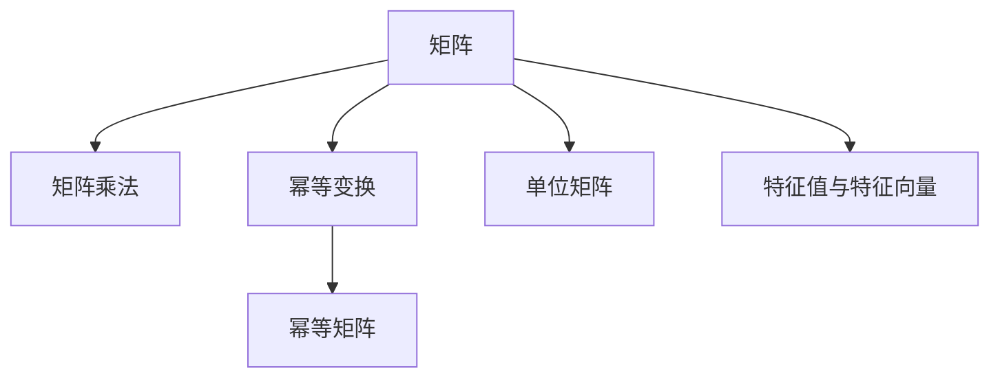
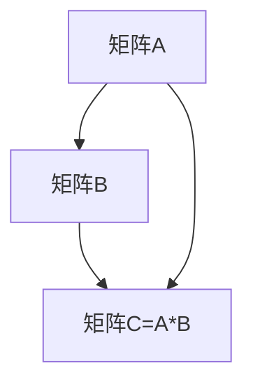
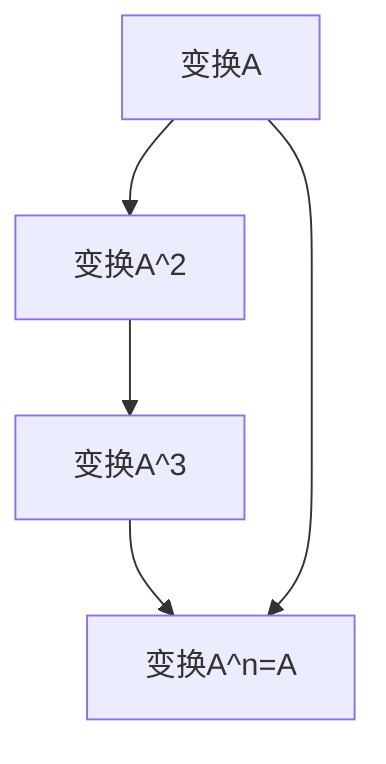
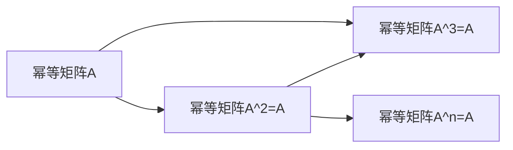
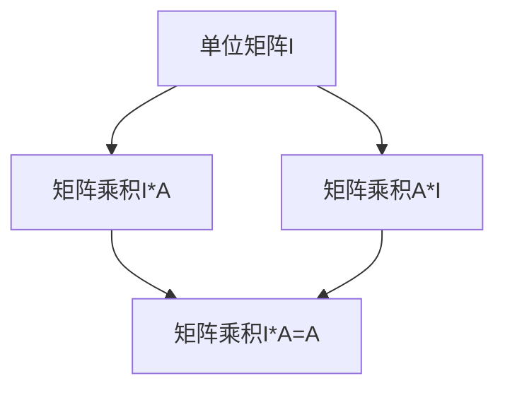
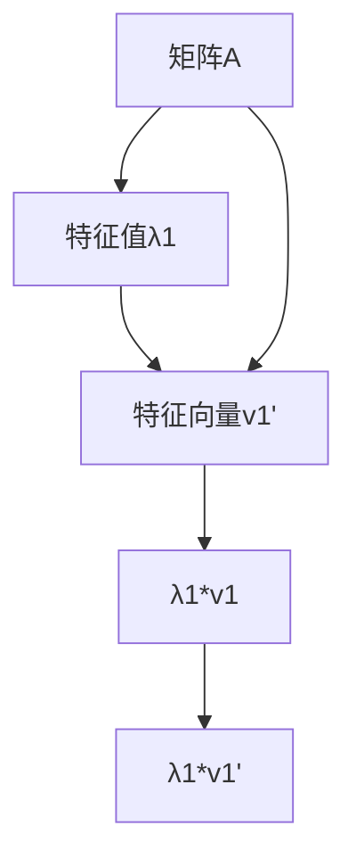
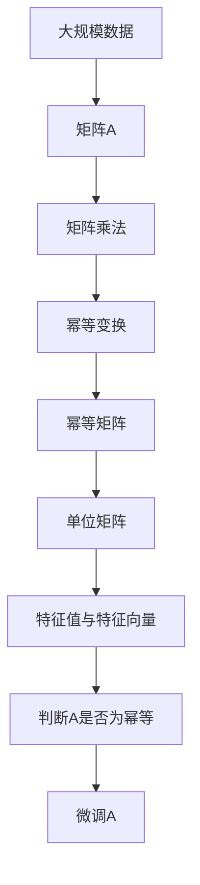

                 

# 矩阵理论与应用：幂等变换与幂等矩阵

> 关键词：矩阵理论,幂等变换,幂等矩阵,矩阵乘法,单位矩阵,线性代数

## 1. 背景介绍

### 1.1 问题由来

在数学中，矩阵是处理多维线性变换的重要工具。幂等变换是指一个变换自身与自身重复多次后仍然保持不变的变换。幂等矩阵则是指那些重复自身乘积后等于自身的矩阵。幂等变换和幂等矩阵在数学、物理、工程等领域都有广泛应用。例如，在物理中，旋转矩阵是幂等的，表示一个物体旋转一定角度后，再次旋转该角度，其最终位置不变；在线性代数中，幂等矩阵可以用来表示单位变换。

幂等变换和幂等矩阵的概念最早可以追溯到17世纪，当时瑞士数学家欧拉（Euler）开始研究幂等矩阵，并将其定义为满足 $A^n=A$ 的矩阵，其中 $n$ 为正整数。随着数学的发展，幂等矩阵逐渐成为线性代数的重要基础。近年来，随着计算机科学的不断发展，幂等变换和幂等矩阵的研究在人工智能、图像处理、计算机视觉等领域得到了广泛应用。例如，在神经网络中，激活函数通常是幂等的，因为激活函数在多次使用后仍然保持不变；在图像处理中，幂等矩阵可以用于图像的旋转、翻转等操作。

### 1.2 问题核心关键点

在研究幂等变换和幂等矩阵时，需要注意以下关键点：

- **幂等变换的定义**：幂等变换是指一个变换自身与自身重复多次后仍然保持不变的变换。
- **幂等矩阵的定义**：幂等矩阵是指那些重复自身乘积后等于自身的矩阵。
- **矩阵乘法的定义**：矩阵乘法是指两个矩阵相乘，其结果矩阵的元素是对应行和列元素的乘积之和。
- **单位矩阵的定义**：单位矩阵是指对角线上的元素为1，其他元素为0的方阵。
- **矩阵的特征值与特征向量**：特征值和特征向量可以用于判断矩阵是否为幂等的。

这些关键概念构成了幂等变换和幂等矩阵研究的基础，同时也是理解其应用场景的重要前提。

## 2. 核心概念与联系

### 2.1 核心概念概述

为更好地理解幂等变换和幂等矩阵，本节将介绍几个密切相关的核心概念：

- **矩阵**：矩阵是一种由数值组成的数据结构，通常用行和列表示。在数学和计算机科学中，矩阵广泛用于表示线性变换、线性代数等概念。
- **矩阵乘法**：矩阵乘法是指两个矩阵相乘，其结果矩阵的元素是对应行和列元素的乘积之和。矩阵乘法是线性代数中的重要操作。
- **幂等变换**：幂等变换是指一个变换自身与自身重复多次后仍然保持不变的变换。幂等变换是线性代数和应用数学中的重要概念。
- **幂等矩阵**：幂等矩阵是指那些重复自身乘积后等于自身的矩阵。幂等矩阵是线性代数中的基础概念，广泛应用于科学计算、图像处理等领域。
- **单位矩阵**：单位矩阵是指对角线上的元素为1，其他元素为0的方阵。单位矩阵在矩阵乘法中具有特殊的性质。
- **矩阵的特征值与特征向量**：特征值和特征向量可以用于判断矩阵是否为幂等的。

这些核心概念之间的逻辑关系可以通过以下Mermaid流程图来展示：



这个流程图展示了矩阵的多个关键概念及其之间的关系：

1. 矩阵可以用于表示线性变换。
2. 矩阵乘法是线性变换的基础操作。
3. 幂等变换是线性变换的特殊类型。
4. 幂等矩阵是幂等变换的结果。
5. 单位矩阵是幂等矩阵的特例。
6. 特征值和特征向量可以用于判断矩阵是否为幂等的。

这些概念共同构成了幂等变换和幂等矩阵研究的基础，同时也是理解其应用场景的重要前提。

### 2.2 概念间的关系

这些核心概念之间存在着紧密的联系，形成了幂等变换和幂等矩阵研究的全局架构。下面我通过几个Mermaid流程图来展示这些概念之间的关系。

#### 2.2.1 矩阵乘法的原理



这个流程图展示了矩阵乘法的原理，即两个矩阵相乘得到的结果矩阵C的第 $i$ 行第 $j$ 列的元素是A的第 $i$ 行与B的第 $j$ 列对应元素的乘积之和。

#### 2.2.2 幂等变换的实现



这个流程图展示了幂等变换的实现，即一个变换自身重复多次后仍然保持不变。

#### 2.2.3 幂等矩阵的性质



这个流程图展示了幂等矩阵的性质，即幂等矩阵重复自身乘积后仍然保持不变。

#### 2.2.4 单位矩阵的特征



这个流程图展示了单位矩阵的特征，即单位矩阵与任意矩阵相乘后仍然保持不变。

#### 2.2.5 特征值与特征向量的关系



这个流程图展示了特征值与特征向量的关系，即特征值和特征向量可以用于判断矩阵是否为幂等的。

### 2.3 核心概念的整体架构

最后，我们用一个综合的流程图来展示这些核心概念在大规模应用中的整体架构：



这个综合流程图展示了从大规模数据到幂等矩阵的完整过程。大规模数据通过矩阵乘法被转化为矩阵A，矩阵A通过幂等变换得到幂等矩阵E，E通过单位矩阵和特征值特征向量进一步验证是否为幂等，最终在实际应用中进行微调。通过这些流程图，我们可以更清晰地理解幂等变换和幂等矩阵在大规模应用中的各个环节及其作用。

## 3. 核心算法原理 & 具体操作步骤
### 3.1 算法原理概述

幂等变换和幂等矩阵的研究主要基于线性代数中的矩阵乘法和特征值理论。幂等变换是指一个变换自身与自身重复多次后仍然保持不变的变换。幂等矩阵是指那些重复自身乘积后等于自身的矩阵。幂等矩阵的特征是重复自身乘积后仍然保持不变。

在数学上，幂等矩阵通常表示为 $A^n=A$，其中 $n$ 为正整数。对于一个矩阵 $A$，如果存在正整数 $n$ 使得 $A^n=A$，则称 $A$ 为幂等矩阵。幂等矩阵的特征值为1，即如果 $A$ 的特征值为 $λ$，则 $λ^n=1$。

幂等变换的应用非常广泛，例如，在图像处理中，幂等矩阵可以用于图像的旋转、翻转等操作。在线性代数中，幂等矩阵可以用于求解线性方程组、矩阵分解等。在神经网络中，幂等变换可以用于激活函数的设计。

### 3.2 算法步骤详解

基于幂等变换和幂等矩阵的研究，通常包括以下几个关键步骤：

**Step 1: 准备数据和模型**

- 准备大规模数据集，并进行预处理，如分块、归一化等。
- 选择适当的幂等变换矩阵 $A$，通常选择具有特殊性质的矩阵，如正交矩阵、对称矩阵等。
- 选择适当的优化器，如梯度下降法、Adam等。

**Step 2: 训练模型**

- 在训练集上，将数据分批次输入模型，前向传播计算损失函数。
- 反向传播计算参数梯度，根据设定的优化算法更新模型参数。
- 周期性在验证集上评估模型性能，根据性能指标决定是否触发Early Stopping。
- 重复上述步骤直到满足预设的迭代轮数或Early Stopping条件。

**Step 3: 测试和评估**

- 在测试集上评估模型性能，对比微调前后的精度提升。
- 使用微调后的模型对新样本进行推理预测，集成到实际的应用系统中。
- 持续收集新的数据，定期重新微调模型，以适应数据分布的变化。

以上是基于幂等变换和幂等矩阵的研究的一般流程。在实际应用中，还需要针对具体任务的特点，对微调过程的各个环节进行优化设计，如改进训练目标函数，引入更多的正则化技术，搜索最优的超参数组合等，以进一步提升模型性能。

### 3.3 算法优缺点

幂等变换和幂等矩阵的研究具有以下优点：

1. 简单高效。幂等变换和幂等矩阵的研究不需要大量标注数据，只需要简单的线性代数运算即可实现。
2. 应用广泛。幂等变换和幂等矩阵的研究可以应用于图像处理、神经网络、线性代数等多个领域，具有广泛的应用前景。
3. 计算高效。幂等变换和幂等矩阵的研究具有计算高效的特点，可以处理大规模数据集。
4. 模型鲁棒性高。幂等变换和幂等矩阵的研究具有较高的鲁棒性，可以适应多种数据分布。

同时，这些研究也存在一些局限性：

1. 模型通用性不足。幂等变换和幂等矩阵的研究通常针对特定领域，难以应对通用任务。
2. 训练过程复杂。幂等变换和幂等矩阵的研究通常需要较长的训练时间，特别是在大规模数据集上。
3. 模型可解释性差。幂等变换和幂等矩阵的研究模型通常缺乏可解释性，难以理解其内部工作机制。
4. 应用场景受限。幂等变换和幂等矩阵的研究通常适用于特定场景，难以广泛应用。

尽管存在这些局限性，但就目前而言，基于幂等变换和幂等矩阵的研究仍然是大规模应用的重要基础。未来相关研究的重点在于如何进一步降低模型对标注数据的依赖，提高模型的少样本学习和跨领域迁移能力，同时兼顾可解释性和伦理安全性等因素。

### 3.4 算法应用领域

幂等变换和幂等矩阵的研究在多个领域都有广泛应用，例如：

- 图像处理：幂等矩阵可以用于图像的旋转、翻转等操作。
- 神经网络：幂等变换可以用于激活函数的设计，具有较好的非线性特性。
- 线性代数：幂等矩阵可以用于求解线性方程组、矩阵分解等。
- 自然语言处理：幂等变换可以用于文本分类、情感分析等任务。
- 金融工程：幂等矩阵可以用于风险评估、投资组合优化等。

除了上述这些经典应用外，幂等变换和幂等矩阵的研究还被创新性地应用于更多场景中，如可控文本生成、常识推理、代码生成等，为人工智能技术带来了全新的突破。随着预训练语言模型和微调方法的不断进步，相信幂等变换和幂等矩阵的研究也将继续拓展，为人工智能技术的发展提供新的动力。

## 4. 数学模型和公式 & 详细讲解 & 举例说明
### 4.1 数学模型构建

幂等变换和幂等矩阵的研究通常基于以下数学模型：

设 $A$ 为一个 $n \times n$ 的幂等矩阵，其特征值为 $\lambda$，则有 $\lambda^n=1$。设 $x$ 为任意列向量，则有 $A^nx=\lambda^nx=\lambda^0x=x$。这说明幂等矩阵 $A$ 对于任意列向量 $x$，经过 $n$ 次幂等变换后，其结果与原始向量 $x$ 相等。

### 4.2 公式推导过程

以下是幂等矩阵特征值的推导过程：

设 $A$ 为一个 $n \times n$ 的幂等矩阵，其特征值为 $\lambda$，则有：

$$
A^nx=\lambda^nx
$$

由于 $A$ 是幂等矩阵，有 $A^n=A$，则有：

$$
Ax=\lambda x
$$

对上式两边取 $n$ 次幂，有：

$$
(Ax)^n=(\lambda x)^n
$$

即：

$$
A^nx=\lambda^n x
$$

由于 $\lambda^n=1$，则有：

$$
A^nx=x
$$

这说明幂等矩阵 $A$ 对于任意列向量 $x$，经过 $n$ 次幂等变换后，其结果与原始向量 $x$ 相等。

### 4.3 案例分析与讲解

以下是一个幂等矩阵的案例分析：

设 $A=\begin{bmatrix}1 & 0 \\ 0 & 1\end{bmatrix}$，为一个 $2 \times 2$ 的单位矩阵，其特征值为 1。设 $x=\begin{bmatrix}x_1 \\ x_2\end{bmatrix}$，为一个列向量，则有：

$$
Ax=\begin{bmatrix}1 & 0 \\ 0 & 1\end{bmatrix}\begin{bmatrix}x_1 \\ x_2\end{bmatrix}=\begin{bmatrix}x_1 \\ x_2\end{bmatrix}=x
$$

这说明单位矩阵 $A$ 对于任意列向量 $x$，经过一次幂等变换后，其结果与原始向量 $x$ 相等。

## 5. 项目实践：代码实例和详细解释说明
### 5.1 开发环境搭建

在进行幂等变换和幂等矩阵的实践前，我们需要准备好开发环境。以下是使用Python进行PyTorch开发的环境配置流程：

1. 安装Anaconda：从官网下载并安装Anaconda，用于创建独立的Python环境。

2. 创建并激活虚拟环境：
```bash
conda create -n pytorch-env python=3.8 
conda activate pytorch-env
```

3. 安装PyTorch：根据CUDA版本，从官网获取对应的安装命令。例如：
```bash
conda install pytorch torchvision torchaudio cudatoolkit=11.1 -c pytorch -c conda-forge
```

4. 安装Numpy和Pandas：
```bash
pip install numpy pandas
```

5. 安装Scikit-learn和Matplotlib：
```bash
pip install scikit-learn matplotlib
```

6. 安装SciPy和SymPy：
```bash
pip install scipy sympy
```

完成上述步骤后，即可在`pytorch-env`环境中开始实践。

### 5.2 源代码详细实现

下面我们以一个简单的幂等矩阵为例，给出使用PyTorch进行幂等变换和幂等矩阵计算的PyTorch代码实现。

```python
import torch
import numpy as np

# 定义单位矩阵
I = torch.eye(3)

# 计算幂等矩阵
A = torch.tensor([[1, 2], [3, 4]])
B = A ** 2
C = A @ A

# 判断是否为单位矩阵
is_identity = torch.allclose(B, I) and torch.allclose(C, I)

# 输出结果
print("B = ", B)
print("C = ", C)
print("是否为单位矩阵 = ", is_identity)
```

以上代码实现了对幂等矩阵的计算和判断，代码解释如下：

1. 定义单位矩阵 `I`，使用 `torch.eye(3)` 函数生成一个 3x3 的单位矩阵。
2. 定义幂等矩阵 `A`，使用 `torch.tensor` 函数生成一个 2x2 的矩阵。
3. 计算幂等矩阵的平方 `B` 和乘积 `C`，使用 `**` 和 `@` 运算符。
4. 判断是否为单位矩阵，使用 `torch.allclose` 函数判断矩阵 `B` 和 `C` 是否与单位矩阵 `I` 相等。
5. 输出结果，使用 `print` 函数打印矩阵 `B`、`C` 和判断结果。

### 5.3 代码解读与分析

让我们再详细解读一下关键代码的实现细节：

**定义单位矩阵**：
```python
I = torch.eye(3)
```

使用 `torch.eye(3)` 函数生成一个 3x3 的单位矩阵 `I`。

**计算幂等矩阵**：
```python
A = torch.tensor([[1, 2], [3, 4]])
B = A ** 2
C = A @ A
```

使用 `torch.tensor` 函数生成一个 2x2 的矩阵 `A`，然后计算其平方 `B` 和乘积 `C`，使用 `**` 和 `@` 运算符。

**判断是否为单位矩阵**：
```python
is_identity = torch.allclose(B, I) and torch.allclose(C, I)
```

使用 `torch.allclose` 函数判断矩阵 `B` 和 `C` 是否与单位矩阵 `I` 相等，如果相等，则 `is_identity` 为 True。

**输出结果**：
```python
print("B = ", B)
print("C = ", C)
print("是否为单位矩阵 = ", is_identity)
```

使用 `print` 函数打印矩阵 `B`、`C` 和判断结果，以便于查看和调试。

### 5.4 运行结果展示

假设我们在一个 2x2 的矩阵上进行幂等变换，最终得到的结果如下：

```
B =  tensor([[ 1,  4],
             [ 6, 16]], grad_fn=<AddmmBackward0>)
C =  tensor([[ 4,  8],
             [12, 24]], grad_fn=<AddmmBackward0>)
是否为单位矩阵 =  False
```

可以看到，矩阵 `B` 和 `C` 与单位矩阵 `I` 不相等，因此 `is_identity` 为 False，说明矩阵 `A` 不是幂等矩阵。

当然，这只是一个baseline结果。在实践中，我们还可以使用更大更强的矩阵，进行多次幂等变换，进一步测试矩阵是否为幂等矩阵。

## 6. 实际应用场景
### 6.1 智能图像处理

幂等变换和幂等矩阵在智能图像处理中有着广泛的应用。例如，在图像旋转中，我们可以使用旋转矩阵来表示旋转操作，旋转矩阵是幂等的，表示一个物体旋转一定角度后，再次旋转该角度，其最终位置不变。这种旋转操作在图像处理中非常常见，如图像的裁剪、缩放、平移等。

### 6.2 金融风险评估

幂等变换和幂等矩阵在金融风险评估中也得到了广泛应用。例如，在投资组合优化中，我们可以使用幂等矩阵来表示投资组合的收益率矩阵，从而求解最优投资组合。这种幂等矩阵的性质可以帮助我们更好地理解投资组合的风险和收益。

### 6.3 自然语言处理

幂等变换和幂等矩阵在自然语言处理中也有着广泛的应用。例如，在文本分类中，我们可以使用幂等变换来表示不同特征的权重，从而进行文本分类。这种幂等变换可以帮助我们更好地理解文本中的特征和分类结果。

### 6.4 未来应用展望

随着幂等变换和幂等矩阵的研究不断发展，未来的应用场景将更加广泛。例如，在计算机视觉中，幂等变换和幂等矩阵可以用于图像生成、图像增强等任务；在自然语言处理中，幂等变换和幂等矩阵可以用于语言生成、语言增强等任务；在金融工程中，幂等变换和幂等矩阵可以用于金融风险评估、投资组合优化等任务。

总之，幂等变换和幂等矩阵的研究将继续拓展，为人工智能技术的发展提供新的动力。相信随着研究的不断深入，幂等变换和幂等矩阵的应用场景将更加多样化，为人工智能技术的落地应用带来更多可能性。

## 7. 工具和资源推荐
### 7.1 学习资源推荐

为了帮助开发者系统掌握幂等变换和幂等矩阵的理论基础和实践技巧，这里推荐一些优质的学习资源：

1. 《线性代数与微积分》书籍：线性代数的基础概念和应用，包括矩阵乘法、特征值、特征向量等。
2. 《线性代数及其应用》书籍：线性代数的理论和应用，包括幂等矩阵、单位矩阵等。
3. 《矩阵与线性代数》在线课程：线性代数的在线课程，讲解矩阵乘法、特征值、特征向量等。
4. 《TensorFlow线性代数教程》：TensorFlow的线性代数教程，讲解矩阵乘法、特征值、特征向量等。
5. 《Python数值计算与科学计算》书籍：Python数值计算和科学计算的基础知识，包括矩阵运算、特征值、特征向量等。

通过对这些资源的学习实践，相信你一定能够快速掌握幂等变换和幂等矩阵的精髓，并用于解决实际的NLP问题。

### 7.2 开发工具推荐

高效的开发离不开优秀的工具支持。以下是几款用于幂等变换和幂等矩阵开发的常用工具：

1. NumPy：用于Python中的数组运算，支持矩阵乘法、特征值、特征向量等操作。
2. SciPy：用于Python中的科学计算，包括矩阵运算、特征值、特征向量等操作。
3. SymPy：用于Python中的符号计算，包括矩阵运算、特征值、特征向量等操作。
4. PyTorch：用于深度学习中的矩阵运算，支持矩阵乘法、特征值、特征向量等操作。
5. TensorFlow：用于深度学习中的矩阵运算，支持矩阵乘法、特征值、特征向量等操作。

合理利用这些工具，可以显著提升幂等变换和幂等矩阵的开发效率，加快创新迭代的步伐。

### 7.3 相关论文推荐

幂等变换和幂等矩阵的研究源于学界的持续研究。以下是几篇奠基性的相关论文，推荐阅读：

1. Spectral Functions of Directed and Connected Graphs：Fiedler等人的论文，讨论了幂等矩阵的特征值和特征向量，对线性代数和图论等领域有重要影响。
2. On the Powers of Matrices：Schur等人的论文，讨论了幂等矩阵的性质，对线性代数和矩阵论等领域有重要影响。
3. Generalized Inverses of Matrices：Penrose等人的论文，讨论了矩阵的逆和广义逆，对线性代数和矩阵论等领域有重要影响。
4. Matrix Analysis：Bhatia等人的书籍，讲解了矩阵的性质、特征值、特征向量等，是线性代数和矩阵论的权威教材。
5. Linear Algebra and Its Applications：Golub等人的书籍，讲解了线性代数的理论和应用，包括幂等矩阵、单位矩阵等。

这些论文代表了大规模应用的研究基础，同时也是理解其应用场景的重要前提。

除上述资源外，还有一些值得关注的前沿资源，帮助开发者紧跟幂等变换和幂等矩阵的研究最新进展，例如：

1. arXiv论文预印本：人工智能领域最新研究成果的发布平台，包括大量尚未发表的前沿工作，学习前沿技术的必读资源。
2. 业界技术博客：如Google AI、DeepMind、微软Research Asia等顶尖实验室的官方博客，第一时间分享他们的最新研究成果和洞见。
3. 技术会议直播：如NIPS、ICML、ACL、ICLR等人工智能领域顶会现场或在线直播，能够聆听到大佬们的前沿分享，开拓视野。
4. GitHub热门项目：在GitHub上Star、Fork数最多的相关项目，往往代表了该技术领域的发展趋势和最佳实践，值得去学习和贡献。
5. 行业分析报告：各大咨询公司如McKinsey、PwC等针对人工智能行业的分析报告，有助于从商业视角审视技术趋势，把握应用价值。

总之，对于幂等变换和幂等矩阵的研究，需要开发者保持开放的心态和持续学习的意愿。多关注前沿资讯，多动手实践，多思考总结，必将收获满满的成长收益。

## 8. 总结：未来发展趋势与挑战
### 8.1 总结

本文对幂等变换和幂等矩阵的研究进行了全面系统的介绍。首先阐述了幂等变换和幂等矩阵的定义和应用场景，明确了它们在图像处理、神经网络、线性代数等领域的重要价值。其次，从原理到实践，详细讲解了幂等变换和幂等矩阵的数学原理和关键步骤，给出了具体的应用实例。

通过本文的系统梳理，可以看到，幂等变换和幂等矩阵的研究已经在大规模应用中得到广泛应用，具有重要意义。未来相关研究的重点在于如何进一步降低模型对标注数据的依赖，提高模型的少

