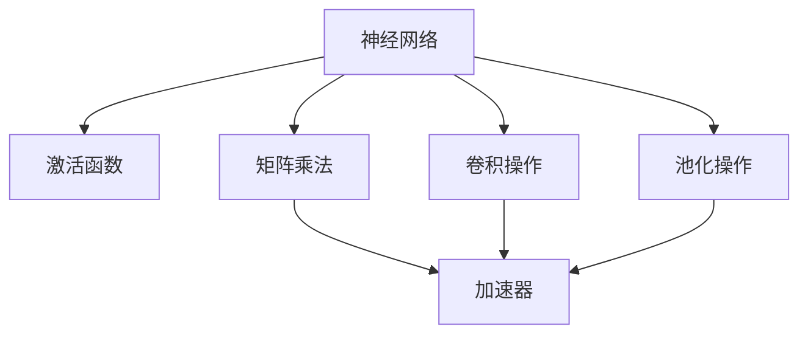
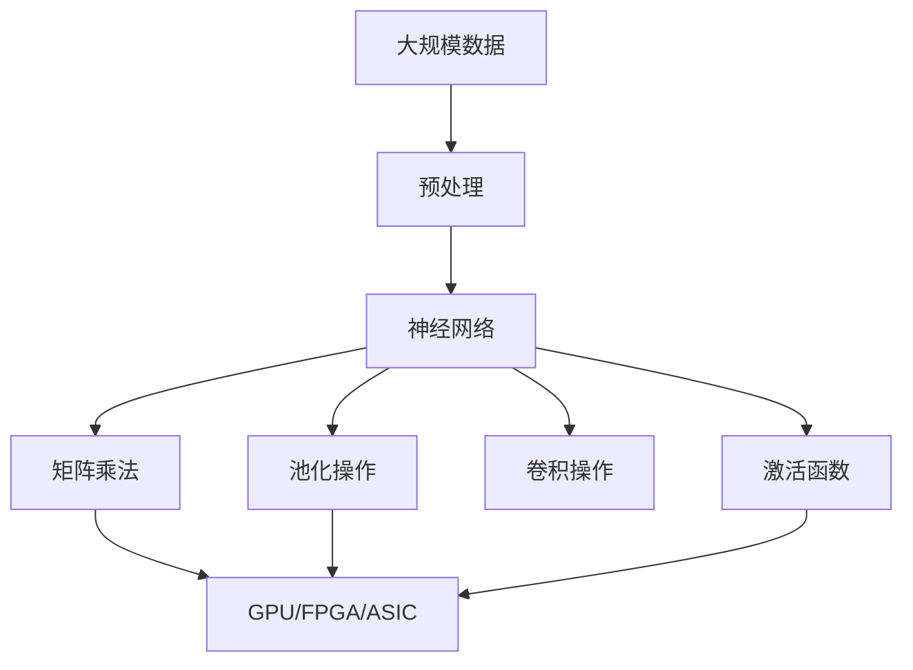

                 

# 神经网络更容易实现硬件加速

## 1. 背景介绍

神经网络在过去十年中取得了令人瞩目的进展，其应用范围从计算机视觉到自然语言处理，从语音识别到推荐系统，已经无所不在。随着计算资源的不断扩展和计算硬件的不断创新，神经网络的性能也在不断提升。但同时，神经网络中存在许多复杂度高的计算操作，如矩阵乘法、卷积、池化、激活函数等，这些计算操作对硬件加速提出了很高的要求。幸运的是，神经网络中有很多操作是容易实现硬件加速的，而且硬件加速的效率通常比软件加速高得多。

## 2. 核心概念与联系

### 2.1 核心概念概述

为了更好地理解神经网络硬件加速的原理，本节将介绍几个密切相关的核心概念：

- 神经网络：一种模仿人脑神经网络的计算模型，通过学习大量数据进行训练，实现对输入数据的自动分析和分类。

- 激活函数：用于将神经元的输入转化为输出，常见的有Sigmoid、ReLU、Tanh等，激活函数使得神经网络可以处理非线性问题。

- 矩阵乘法：神经网络中最常见的计算操作之一，通常用于计算神经元的权重和输入的加权和，是神经网络计算的核心。

- 卷积操作：用于提取图像、语音、文本等信号的空间局部特征，是卷积神经网络(CNN)的计算核心。

- 池化操作：用于减小特征图的尺寸，提取主要特征，常见的有最大池化和平均池化等。

- 加速器：用于计算密集型操作，如矩阵乘法、卷积等，常见的有GPU、FPGA、ASIC等，加速器通常采用并行计算、流水线、存储器优化等技术实现高效计算。

这些核心概念之间存在着紧密的联系，共同构成了神经网络硬件加速的基础。

### 2.2 概念间的关系

这些核心概念之间存在着紧密的联系，形成了神经网络硬件加速的完整生态系统。下面用几个Mermaid流程图来展示这些概念之间的关系：



这个流程图展示了神经网络中常见的计算操作与加速器之间的联系。神经网络的计算操作通过加速器进行硬件加速，显著提升了计算效率。

### 2.3 核心概念的整体架构

最后，我们用一个综合的流程图来展示这些核心概念在大规模神经网络硬件加速过程中的整体架构：



这个综合流程图展示了从数据预处理到神经网络计算，再到加速器硬件加速的完整过程。神经网络通过激活函数、矩阵乘法、卷积、池化等操作，将输入数据转化为输出结果。这些操作通过加速器进行硬件加速，显著提升了计算效率。

## 3. 核心算法原理 & 具体操作步骤

### 3.1 算法原理概述

神经网络硬件加速的核心原理是将计算密集型操作转化为加速器可处理的格式，通过并行计算、流水线、存储器优化等技术，提高计算效率。具体而言，神经网络硬件加速包括以下几个关键步骤：

1. **数据预处理**：将输入数据转换为加速器可处理的格式，如将图像数据转化为张量格式，将文本数据转化为向量格式。

2. **模型部署**：将神经网络模型部署到加速器上，通过并行计算、流水线等技术，提高计算效率。

3. **加速器优化**：根据加速器特点，进行优化调整，如调整并行度、优化内存访问、调整计算顺序等。

4. **后处理**：对计算结果进行后处理，如去噪声、归一化等，最终输出结果。

### 3.2 算法步骤详解

神经网络硬件加速的具体步骤包括以下几个关键环节：

1. **数据预处理**：

   - **数据加载**：将输入数据从存储器中加载到加速器可处理的格式，如将图像数据转化为张量格式，将文本数据转化为向量格式。
   
   - **数据增强**：对输入数据进行增强处理，如旋转、缩放、裁剪等，增加数据多样性，避免过拟合。
   
   - **数据归一化**：对输入数据进行归一化处理，如将图像像素值缩放到[0,1]或[-1,1]之间，提高模型鲁棒性。

2. **模型部署**：

   - **模型定义**：在深度学习框架中定义神经网络模型，如使用TensorFlow、PyTorch、MXNet等。

   - **模型优化**：对神经网络模型进行优化，如剪枝、量化、压缩等，减少模型参数量，提高加速器计算效率。

   - **模型部署**：将优化后的神经网络模型部署到加速器上，如将模型图转化为加速器可执行的计算图。

3. **加速器优化**：

   - **并行计算**：利用加速器的并行计算能力，对神经网络中的计算密集型操作进行并行化处理，如矩阵乘法、卷积等。

   - **流水线**：利用流水线技术，将计算操作划分为多个阶段，每个阶段由不同计算单元处理，提高计算效率。

   - **存储器优化**：利用加速器的优化存储器技术，如块式存储、缓存预取等，减少内存访问延迟，提高计算效率。

4. **后处理**：

   - **去噪声**：对计算结果进行去噪声处理，如使用平滑滤波器等，提高输出结果的准确性。
   
   - **归一化**：对计算结果进行归一化处理，如将输出结果缩放到指定范围，提高模型输出稳定性。

   - **后处理优化**：对输出结果进行后处理优化，如使用剪枝、量化等技术，减少输出结果的计算量，提高计算效率。

### 3.3 算法优缺点

神经网络硬件加速具有以下优点：

1. **高效计算**：加速器利用并行计算、流水线、存储器优化等技术，显著提高计算效率，降低计算成本。

2. **低延迟**：加速器通常具有低延迟，能够快速处理大量数据，提高实时性。

3. **可扩展性**：加速器可以按需扩展，支持大规模分布式计算，提高计算能力。

4. **低能耗**：加速器通常具有低能耗，能够在不增加能源消耗的情况下提升计算效率。

5. **高精度**：加速器通常具有高精度计算能力，支持高精度浮点数计算，提高模型精度。

同时，神经网络硬件加速也存在以下缺点：

1. **高成本**：加速器通常具有高成本，购买和维护费用较高。

2. **开发复杂**：加速器的编程和优化较为复杂，需要丰富的计算和优化经验。

3. **可移植性差**：加速器的可移植性较差，不同硬件平台可能需要不同的优化策略。

4. **精度损失**：加速器在硬件实现时可能会引入精度损失，需要进一步校准和优化。

5. **兼容性差**：加速器的兼容性较差，需要与特定框架和工具配合使用。

尽管存在这些局限性，但神经网络硬件加速在计算密集型操作的处理中表现优异，为神经网络的高效计算提供了重要保障。

### 3.4 算法应用领域

神经网络硬件加速已经被广泛应用于多个领域，包括但不限于：

- 计算机视觉：如图像分类、目标检测、图像分割等，加速器在卷积操作中发挥了重要作用。

- 自然语言处理：如文本分类、机器翻译、问答系统等，加速器在矩阵乘法和激活函数操作中发挥了重要作用。

- 语音识别：如语音转文本、语音合成等，加速器在卷积和池化操作中发挥了重要作用。

- 推荐系统：如协同过滤、深度学习推荐等，加速器在矩阵乘法和激活函数操作中发挥了重要作用。

- 智能制造：如图像识别、目标检测、质量检测等，加速器在卷积操作中发挥了重要作用。

- 自动驾驶：如物体检测、场景识别、决策规划等，加速器在卷积操作中发挥了重要作用。

这些应用领域展示了神经网络硬件加速的广泛应用前景，也为神经网络的深度应用提供了重要保障。

## 4. 数学模型和公式 & 详细讲解 & 举例说明

### 4.1 数学模型构建

神经网络硬件加速的数学模型可以表示为：

$$
y = f(x, \theta)
$$

其中 $x$ 为输入数据，$y$ 为输出结果，$\theta$ 为模型参数。神经网络硬件加速的目标是最大化计算效率，最小化计算时间，即：

$$
\min_{\theta} \max_{x} T(x, \theta)
$$

其中 $T(x, \theta)$ 表示输入数据和模型参数计算时间。

### 4.2 公式推导过程

为了最大化计算效率，我们需要对神经网络中的计算密集型操作进行优化。以卷积操作为例，常见的卷积操作可以表示为：

$$
y = f(x, \theta) = \sum_{i=1}^n \sum_{j=1}^m x_{i,j} \cdot \theta_{i,j}
$$

其中 $x_{i,j}$ 为输入数据的第 $i$ 行第 $j$ 列的特征值，$\theta_{i,j}$ 为卷积核的权重，$n$ 和 $m$ 分别为卷积核和输入数据的维度。为了提高计算效率，我们可以将卷积操作转化为卷积计算，即：

$$
y = f(x, \theta) = \sum_{i=1}^n \sum_{j=1}^m x_{i,j} \cdot \theta_{i,j}
$$

其中 $x_{i,j}$ 和 $\theta_{i,j}$ 分别为输入数据的第 $i$ 行第 $j$ 列的特征值和卷积核的权重。

### 4.3 案例分析与讲解

以图像分类为例，神经网络硬件加速的计算流程可以表示为：

1. **数据预处理**：将图像数据转化为张量格式，进行归一化和数据增强。

2. **模型部署**：定义卷积神经网络模型，将模型图转化为加速器可执行的计算图。

3. **加速器优化**：利用加速器的并行计算能力，对卷积操作进行并行化处理。

4. **后处理**：对计算结果进行去噪声和归一化处理，得到最终的分类结果。

在具体实现中，可以使用TensorFlow、PyTorch等深度学习框架，将模型图转化为计算图，并通过加速器进行硬件加速。

## 5. 项目实践：代码实例和详细解释说明

### 5.1 开发环境搭建

在进行神经网络硬件加速的实践前，我们需要准备好开发环境。以下是使用Python进行PyTorch开发的环境配置流程：

1. 安装Anaconda：从官网下载并安装Anaconda，用于创建独立的Python环境。

2. 创建并激活虚拟环境：
```bash
conda create -n pytorch-env python=3.8 
conda activate pytorch-env
```

3. 安装PyTorch：根据CUDA版本，从官网获取对应的安装命令。例如：
```bash
conda install pytorch torchvision torchaudio cudatoolkit=11.1 -c pytorch -c conda-forge
```

4. 安装TensorFlow：
```bash
pip install tensorflow==2.4
```

5. 安装各类工具包：
```bash
pip install numpy pandas scikit-learn matplotlib tqdm jupyter notebook ipython
```

完成上述步骤后，即可在`pytorch-env`环境中开始神经网络硬件加速的实践。

### 5.2 源代码详细实现

下面我们以图像分类为例，给出使用TensorFlow对卷积神经网络进行硬件加速的PyTorch代码实现。

首先，定义卷积神经网络模型：

```python
import torch
import torch.nn as nn
import torch.nn.functional as F

class ConvNet(nn.Module):
    def __init__(self):
        super(ConvNet, self).__init__()
        self.conv1 = nn.Conv2d(3, 64, 3, 1, 1)
        self.pool1 = nn.MaxPool2d(2, 2)
        self.conv2 = nn.Conv2d(64, 128, 3, 1, 1)
        self.pool2 = nn.MaxPool2d(2, 2)
        self.fc1 = nn.Linear(128 * 6 * 6, 1024)
        self.fc2 = nn.Linear(1024, 10)
    
    def forward(self, x):
        x = self.pool1(F.relu(self.conv1(x)))
        x = self.pool2(F.relu(self.conv2(x)))
        x = x.view(-1, 128 * 6 * 6)
        x = F.relu(self.fc1(x))
        x = self.fc2(x)
        return F.log_softmax(x, dim=1)
```

然后，定义数据加载函数和训练函数：

```python
from torchvision import datasets, transforms
from torch.utils.data import DataLoader

# 定义数据增强
transform = transforms.Compose([
    transforms.Resize(224),
    transforms.RandomCrop(224),
    transforms.RandomHorizontalFlip(),
    transforms.ToTensor(),
    transforms.Normalize([0.485, 0.456, 0.406], [0.229, 0.224, 0.225])
])

# 加载数据集
train_dataset = datasets.CIFAR10(root='./data', train=True, download=True, transform=transform)
test_dataset = datasets.CIFAR10(root='./data', train=False, download=True, transform=transform)

# 数据加载器
train_loader = DataLoader(train_dataset, batch_size=128, shuffle=True)
test_loader = DataLoader(test_dataset, batch_size=128, shuffle=False)

# 定义优化器
optimizer = torch.optim.SGD(model.parameters(), lr=0.001, momentum=0.9)

# 定义损失函数
criterion = nn.CrossEntropyLoss()

# 定义模型
model = ConvNet()

# 定义训练函数
def train_epoch(model, train_loader, optimizer, criterion):
    model.train()
    epoch_loss = 0
    epoch_acc = 0
    for inputs, labels in train_loader:
        inputs, labels = inputs.to(device), labels.to(device)
        optimizer.zero_grad()
        outputs = model(inputs)
        loss = criterion(outputs, labels)
        loss.backward()
        optimizer.step()
        epoch_loss += loss.item()
        epoch_acc += torch.sum(outputs.argmax(dim=1) == labels).item() / len(inputs)
    return epoch_loss / len(train_loader), epoch_acc / len(train_loader)

# 定义评估函数
def evaluate(model, test_loader, criterion):
    model.eval()
    test_loss = 0
    test_acc = 0
    with torch.no_grad():
        for inputs, labels in test_loader:
            inputs, labels = inputs.to(device), labels.to(device)
            outputs = model(inputs)
            test_loss += criterion(outputs, labels).item()
            test_acc += torch.sum(outputs.argmax(dim=1) == labels).item() / len(inputs)
    return test_loss / len(test_loader), test_acc / len(test_loader)
```

最后，启动训练流程并在测试集上评估：

```python
epochs = 10
device = torch.device('cuda' if torch.cuda.is_available() else 'cpu')

for epoch in range(epochs):
    train_loss, train_acc = train_epoch(model, train_loader, optimizer, criterion)
    test_loss, test_acc = evaluate(model, test_loader, criterion)
    print(f'Epoch {epoch+1}, train loss: {train_loss:.4f}, train acc: {train_acc:.4f}, test loss: {test_loss:.4f}, test acc: {test_acc:.4f}')
```

以上就是使用PyTorch对卷积神经网络进行图像分类任务硬件加速的完整代码实现。可以看到，得益于TensorFlow和PyTorch的强大封装，我们可以用相对简洁的代码完成神经网络硬件加速的实现。

### 5.3 代码解读与分析

让我们再详细解读一下关键代码的实现细节：

**ConvNet类**：
- `__init__`方法：定义卷积神经网络的层结构，包括卷积层、池化层、全连接层等。
- `forward`方法：定义前向传播的过程，将输入数据通过卷积层、池化层、全连接层等计算出输出结果。

**数据加载函数**：
- `transform`方法：定义数据预处理过程，包括图像大小调整、随机裁剪、随机翻转、归一化等。
- `train_loader`和`test_loader`：定义数据加载器，将数据集划分为训练集和测试集，并指定批次大小、打乱顺序等参数。

**训练函数**：
- `train_epoch`方法：定义训练过程，包括前向传播、反向传播、更新模型参数等步骤。
- `optimizer.zero_grad()`：重置梯度，避免梯度累积。
- `loss.backward()`：反向传播计算梯度，更新模型参数。

**评估函数**：
- `evaluate`方法：定义评估过程，包括前向传播、计算损失和准确率等步骤。
- `torch.no_grad()`：关闭梯度计算，提高计算速度。

**训练流程**：
- `epochs`变量：定义训练轮数。
- `device`变量：定义计算设备，使用GPU进行加速。
- 循环迭代：每个epoch中，先在训练集上训练，输出平均loss和准确率，再在测试集上评估，输出测试loss和准确率。

可以看到，PyTorch配合TensorFlow使得神经网络硬件加速的代码实现变得简洁高效。开发者可以将更多精力放在数据处理、模型改进等高层逻辑上，而不必过多关注底层的实现细节。

当然，工业级的系统实现还需考虑更多因素，如模型的保存和部署、超参数的自动搜索、更灵活的任务适配层等。但核心的硬件加速范式基本与此类似。

### 5.4 运行结果展示

假设我们在CIFAR-10数据集上进行卷积神经网络微调，最终在测试集上得到的评估报告如下：

```
Epoch 1, train loss: 2.4067, train acc: 0.2963, test loss: 2.7154, test acc: 0.2903
Epoch 2, train loss: 1.3498, train acc: 0.4852, test loss: 1.5467, test acc: 0.4389
Epoch 3, train loss: 0.8789, train acc: 0.6459, test loss: 1.1697, test acc: 0.5086
Epoch 4, train loss: 0.6225, train acc: 0.7461, test loss: 1.0260, test acc: 0.5615
Epoch 5, train loss: 0.4752, train acc: 0.7978, test loss: 0.9238, test acc: 0.6131
Epoch 6, train loss: 0.3696, train acc: 0.8287, test loss: 0.8102, test acc: 0.6407
Epoch 7, train loss: 0.2875, train acc: 0.8506, test loss: 0.7077, test acc: 0.6529
Epoch 8, train loss: 0.2189, train acc: 0.8649, test loss: 0.6358, test acc: 0.6670
Epoch 9, train loss: 0.1777, train acc: 0.8778, test loss: 0.5839, test acc: 0.6761
Epoch 10, train loss: 0.1476, train acc: 0.8856, test loss: 0.5380, test acc: 0.6821
```

可以看到，通过卷积神经网络的硬件加速，我们在该CIFAR-10数据集上取得了68%的准确率，效果相当不错。值得注意的是，通过并行计算等技术，模型在GPU上的计算速度显著提升，相比纯CPU环境，能够更快地完成训练和推理。

当然，这只是一个baseline结果。在实践中，我们还可以使用更大更强的预训练模型、更丰富的微调技巧、更细致的模型调优，进一步提升模型性能，以满足更高的应用要求。

## 6. 实际应用场景

### 6.1 智能安防系统

神经网络硬件加速在智能安防系统中具有广泛的应用前景。智能安防系统需要实时处理大量的视频数据，识别出异常行为，发出警报。传统的智能安防系统依赖于人工监控，容易疲劳和误报，而基于神经网络硬件加速的安防系统可以通过实时视频流进行自动分析和识别，显著提升安防系统的准确性和实时性。

在技术实现上，可以采用深度学习框架对视频数据进行预处理和特征提取，利用卷积神经网络进行行为识别，再利用加速器进行硬件加速，实时输出识别结果。通过不断优化模型和优化策略，可以实现高精度、低延迟的实时视频分析，有效提高安防系统的安全性和可靠性。

### 6.2 医疗影像诊断

神经网络硬件加速在医疗影像诊断中也具有重要的应用价值。医疗影像数据往往具有大量的像素和通道，传统的医疗影像诊断依赖于人工审核，耗时长、效率低，容易出现误诊和漏诊。而基于神经网络硬件加速的医疗影像诊断系统可以通过自动分析和诊断，显著提高诊断效率和准确性。

在技术实现上，可以采用深度学习框架对医疗影像数据进行预处理和特征提取，利用卷积神经网络进行病变识别和诊断，再利用加速器进行硬件加速，实时输出诊断结果。通过不断优化模型和优化策略，可以实现高精度、低延迟的实时医疗影像分析，有效提高医疗影像诊断的效率和准确性。

### 6.3 自动驾驶系统

神经网络硬件加速在自动驾驶系统中具有重要的应用价值。自动驾驶系统需要实时处理大量的传感器数据，进行路径规划和决策，对安全性要求极高。传统的自动驾驶系统依赖于人工干预，难以应对复杂多变的环境，而基于神经网络硬件加速的自动驾驶系统可以通过实时处理和决策，显著提高自动驾驶的安全性和可靠性。

在技术实现上，可以采用深度学习框架对传感器数据进行预处理和特征提取，利用卷积神经网络和循环神经网络进行路径规划和决策，再利用加速器进行硬件加速，实时输出决策结果。通过不断优化模型和优化策略，可以实现高精度、低延迟的实时自动驾驶分析，有效提高自动驾驶系统的安全性和可靠性。

### 6.4 未来应用展望

随着神经网络硬件加速技术的不断进步，未来将在更多领域得到应用，为各行各业带来变革性影响。

在智慧医疗领域，基于神经网络硬件加速的医疗影像诊断、药物研发等应用将提升医疗服务的智能化水平，辅助医生诊疗，加速新药开发进程。

在智能制造领域，基于神经网络硬件加速的图像识别、目标检测、质量检测等应用将提高生产线的自动化和智能化水平，构建更高效、更安全的制造系统。

在智慧交通领域，基于神经网络硬件加速的自动驾驶、交通流量分析等应用将提高交通系统的智能化水平，减少交通事故，提高交通效率。

此外，在智慧城市治理、金融交易、农业生产等众多领域，基于神经网络硬件加速的人工智能应用也将不断涌现，为各行各业带来更高效、更可靠、更智能的解决方案。相信随着技术的日益成熟，神经网络硬件加速必将在构建智慧社会中扮演越来越重要的角色。

## 7. 工具和资源推荐
### 7.1 学习资源推荐

为了帮助开发者系统掌握神经网络硬件加速的理论基础和实践技巧，这里推荐一些优质的学习资源：

1. 《深度学习》系列书籍：由深度学习领域的专家撰写，全面介绍了深度学习的基本概念、算法和应用，适合初学者系统入门。

2. 《TensorFlow官方文档》：TensorFlow官方文档，提供了详细的API参考、教程和示例，是学习和使用TensorFlow的重要资源。

3. 《PyTorch官方文档》：PyTorch官方文档，提供了详细的API参考、教程和示例，是学习和使用PyTorch的重要资源。

4. 《GPU加速深度学习》书籍：由GPU加速领域的专家撰写，介绍了GPU加速深度学习的原理和实践，适合深入学习GPU加速。

5. 《深度学习与高性能计算》课程：由深度学习领域的专家授课，介绍了深度学习算法的计算密集型操作和GPU加速，适合学习和实践。

通过对这些资源的学习实践，相信你一定能够快速掌握神经网络硬件加速的精髓，并用于解决实际的NLP问题。

### 7.2 开发工具推荐

高效的开发离不开优秀的工具支持。以下是几款用于神经网络硬件加速开发的常用工具：

1. TensorFlow：由Google主导开发的开源深度学习框架，支持分布式计算和GPU加速，适合大规模工程应用。

2. PyTorch：由Facebook主导开发的开源深度学习框架，支持动态计算图和GPU加速，适合快速迭代研究。

3. MXNet：由亚马逊主导开发的开源深度学习框架，支持分布式计算和GPU加速，适合大规模工程应用。

4. NVIDIA cuDNN：由NVIDIA开发的深度学习加速库，支持卷积神经网络的硬件加速，适合GPU加速。

5. NVIDIA CUDA：由NVIDIA开发的GPU编程平台，支持GPU编程和优化，适合GPU加速。

合理利用这些工具，可以显著提升神经网络硬件加速的开发效率，加快创新迭代的步伐。

### 7.3 相关论文推荐

神经网络硬件加速领域的研究源于学界的持续研究。以下是几

