                 

# 神经网络：改变世界的技术

## 1. 背景介绍

### 1.1 问题由来

随着人工智能技术的迅猛发展，神经网络作为一种强大的机器学习模型，已经广泛应用于图像识别、语音识别、自然语言处理、推荐系统等诸多领域。它们正在以不可思议的速度改变着我们的生活方式和工作方式。从图像分类到机器翻译，从自动驾驶到工业控制，神经网络技术无处不在。然而，对于大多数非技术人士而言，神经网络仍是一片神秘而又复杂的领域。本文将带您深入了解神经网络的原理、特点及其应用，帮助您理解这种强大技术的来龙去脉，并展望其未来发展的方向。

### 1.2 问题核心关键点

神经网络，一种通过模拟人脑神经元工作方式的计算模型，能够通过大量的数据训练来实现复杂的数据分析与预测。它由多个层次的节点（神经元）构成，每个神经元接收来自上一层节点的输入信号，并产生相应的输出信号，这一过程被称为前向传播。神经网络通过反向传播算法来更新参数，实现对训练数据的优化。这些参数包括权重和偏置，是神经网络的"记忆"。神经网络的基本组成部分包括输入层、隐藏层和输出层，其中隐藏层是网络的核心，负责进行特征提取和模式识别。

神经网络的训练过程涉及以下几个步骤：

1. **前向传播**：将输入数据通过神经网络各层进行传递，计算得到网络的输出。
2. **损失计算**：将网络的输出与真实标签进行比较，计算出损失函数。
3. **反向传播**：通过反向传播算法，计算出损失函数对每个权重和偏置的梯度，并使用梯度下降等优化算法更新参数。
4. **参数更新**：根据梯度下降的更新规则，更新权重和偏置，使损失函数最小化。

神经网络的核心优势在于其强大的表达能力和自适应能力，可以通过学习大量数据来发现数据中的复杂模式和规律。然而，神经网络的训练需要大量的数据和计算资源，且其结果往往需要专家进行解释和调整。因此，神经网络的实际应用需要结合具体问题进行优化和调整，以达到最佳效果。

### 1.3 问题研究意义

神经网络技术的迅速发展，对科学计算、大数据分析、图像识别、自然语言处理等领域产生了深远影响。它不仅推动了人工智能技术的进步，还在多个行业实现了大规模落地应用，成为推动社会经济发展的关键技术之一。

1. **图像识别**：神经网络在图像识别领域取得了巨大成功，如AlphaGo、OpenAI的DALL·E等都基于神经网络技术。
2. **语音识别**：神经网络在语音识别中得到广泛应用，如苹果的Siri、谷歌的Google Assistant等。
3. **自然语言处理**：神经网络在自然语言处理中有着广泛应用，如语言翻译、文本分类、情感分析等。
4. **推荐系统**：神经网络在推荐系统中得到了广泛应用，如Netflix、Amazon等公司。

总之，神经网络技术正在改变世界的方方面面，推动社会进步，改善人类生活质量。因此，对神经网络技术的深入理解和应用具有重要意义。

## 2. 核心概念与联系

### 2.1 核心概念概述

在深入探讨神经网络之前，我们先概述几个关键概念：

- **神经元（Neuron）**：神经网络的基本单位，接收输入信号并产生输出信号。
- **激活函数（Activation Function）**：用于将神经元的输入信号转化为输出信号的函数。
- **权重（Weight）**：连接神经元的系数，决定了信号的强度和方向。
- **偏置（Bias）**：神经元的常数项，可以调整神经元输出的基准值。
- **前向传播（Forward Propagation）**：信号从输入层传递到输出层的全过程。
- **反向传播（Backward Propagation）**：通过误差反向传播来更新权重和偏置的过程。
- **损失函数（Loss Function）**：衡量网络输出与真实标签之间差异的函数。

这些概念构成了神经网络的核心，并通过一系列复杂的算法和数学模型来实现其功能。

### 2.2 概念间的关系

神经网络是一个复杂的系统，其各部分之间存在着密切的联系。以下是一个Mermaid流程图，展示神经网络的主要组成部分和它们之间的关系：

```mermaid
graph TB
    A[输入层] --> B[隐藏层1]
    B --> C[隐藏层2]
    C --> D[输出层]
    A --> E[激活函数]
    B --> F[激活函数]
    C --> G[激活函数]
    D --> H[损失函数]
    H --> I[反向传播]
    I --> J[权重更新]
    J --> K[偏置更新]
```



这个图表展示了神经网络从输入到输出的全过程，以及激活函数、损失函数和反向传播等关键组件的作用。

### 2.3 核心概念的整体架构

神经网络是一个复杂的系统，其整体架构可以简化为以下几个部分：

1. **输入层**：接收原始数据，并将其转化为网络可处理的信号。
2. **隐藏层**：进行特征提取和模式识别，通常由多个神经元组成。
3. **输出层**：根据隐藏层的输出信号，产生最终的预测结果。
4. **激活函数**：将神经元的输入信号转化为输出信号。
5. **损失函数**：衡量网络输出与真实标签之间的差异。
6. **反向传播**：通过误差反向传播来更新权重和偏置。

这一架构展示了神经网络的基本构成和各部分的作用，为理解神经网络的内部工作机制提供了基础。

## 3. 核心算法原理 & 具体操作步骤

### 3.1 算法原理概述

神经网络的训练过程涉及到大量的数学运算和复杂的算法，以下是核心算法的原理概述：

1. **前向传播**：输入数据通过神经网络的各层传递，每一层都会根据输入信号和权重计算得到输出信号。
2. **损失计算**：将网络的输出与真实标签进行比较，计算出损失函数，衡量网络的预测准确度。
3. **反向传播**：通过反向传播算法，计算出损失函数对每个权重和偏置的梯度，并使用梯度下降等优化算法更新参数。
4. **参数更新**：根据梯度下降的更新规则，更新权重和偏置，使损失函数最小化。

### 3.2 算法步骤详解

以下是神经网络训练的具体步骤：

1. **数据准备**：准备训练数据和测试数据，并进行预处理，如数据标准化、归一化等。
2. **网络初始化**：初始化神经网络的权重和偏置，通常使用随机初始化。
3. **前向传播**：将训练数据通过神经网络进行传递，计算得到网络的输出。
4. **损失计算**：将网络的输出与真实标签进行比较，计算出损失函数。
5. **反向传播**：通过反向传播算法，计算出损失函数对每个权重和偏置的梯度。
6. **权重更新**：根据梯度下降的更新规则，更新权重和偏置，使损失函数最小化。
7. **参数更新**：重复以上步骤，直至达到预设的训练轮数或损失函数达到最小值。
8. **测试评估**：在测试数据上评估模型的性能，如准确率、精确率、召回率等指标。

### 3.3 算法优缺点

神经网络算法具有以下优点：

1. **强大的表达能力**：神经网络能够处理非线性问题，具有强大的表达能力。
2. **自适应能力**：通过训练，神经网络能够自动调整参数，适应不同的输入数据。
3. **广泛应用**：神经网络在图像识别、语音识别、自然语言处理等领域具有广泛应用。

但同时，神经网络算法也存在以下缺点：

1. **训练复杂度较高**：神经网络需要大量的数据和计算资源进行训练，训练时间较长。
2. **模型复杂度较高**：神经网络模型复杂，不易解释，难以调试。
3. **过拟合问题**：神经网络在训练过程中容易过拟合，导致模型泛化能力不足。
4. **数据依赖性较强**：神经网络的性能依赖于训练数据的质量和数量，需要大量标注数据。

### 3.4 算法应用领域

神经网络算法在多个领域得到了广泛应用，以下是其中几个主要领域：

1. **图像识别**：如手写数字识别、图像分类等。
2. **语音识别**：如语音识别、语音合成等。
3. **自然语言处理**：如语言翻译、文本分类、情感分析等。
4. **推荐系统**：如Netflix推荐系统、Amazon推荐系统等。
5. **控制系统**：如自动驾驶、机器人控制等。

## 4. 数学模型和公式 & 详细讲解 & 举例说明

### 4.1 数学模型构建

神经网络的核心数学模型包括激活函数、损失函数和反向传播算法。以下是对这些模型的详细构建：

1. **激活函数**：
   $$
   a_i = f(w_i \cdot x_i + b_i)
   $$
   其中 $a_i$ 为神经元的输出，$w_i$ 为权重，$x_i$ 为输入，$b_i$ 为偏置，$f$ 为激活函数。

2. **损失函数**：
   $$
   L = \frac{1}{N} \sum_{i=1}^N \ell(y_i, \hat{y_i})
   $$
   其中 $L$ 为损失函数，$y_i$ 为真实标签，$\hat{y_i}$ 为网络输出，$\ell$ 为损失函数。

3. **反向传播算法**：
   $$
   \frac{\partial L}{\partial w_i} = \frac{\partial L}{\partial z_i} \cdot \frac{\partial z_i}{\partial w_i}
   $$
   其中 $L$ 为损失函数，$w_i$ 为权重，$z_i$ 为输入信号。

### 4.2 公式推导过程

以下是对激活函数和反向传播算法的公式推导：

1. **激活函数推导**：
   $$
   f(x) = \sigma(x)
   $$
   其中 $\sigma$ 为激活函数，如sigmoid函数、ReLU函数等。

2. **反向传播算法推导**：
   $$
   \frac{\partial L}{\partial w_i} = \frac{\partial L}{\partial z_i} \cdot \frac{\partial z_i}{\partial w_i}
   $$
   其中 $L$ 为损失函数，$w_i$ 为权重，$z_i$ 为输入信号。

### 4.3 案例分析与讲解

以手写数字识别为例，展示神经网络的训练过程：

1. **数据准备**：收集手写数字图像，并进行预处理，如数据标准化、归一化等。
2. **网络初始化**：初始化神经网络的权重和偏置，通常使用随机初始化。
3. **前向传播**：将手写数字图像通过神经网络进行传递，计算得到网络的输出。
4. **损失计算**：将网络的输出与真实标签进行比较，计算出损失函数。
5. **反向传播**：通过反向传播算法，计算出损失函数对每个权重和偏置的梯度。
6. **权重更新**：根据梯度下降的更新规则，更新权重和偏置，使损失函数最小化。
7. **参数更新**：重复以上步骤，直至达到预设的训练轮数或损失函数达到最小值。
8. **测试评估**：在测试数据上评估模型的性能，如准确率、精确率、召回率等指标。

## 5. 项目实践：代码实例和详细解释说明

### 5.1 开发环境搭建

在进行神经网络开发前，我们需要准备好开发环境。以下是使用Python进行TensorFlow开发的环境配置流程：

1. 安装Anaconda：从官网下载并安装Anaconda，用于创建独立的Python环境。

2. 创建并激活虚拟环境：
```bash
conda create -n tf-env python=3.8 
conda activate tf-env
```

3. 安装TensorFlow：根据CUDA版本，从官网获取对应的安装命令。例如：
```bash
conda install tensorflow -c pytorch -c conda-forge
```

4. 安装其他所需库：
```bash
pip install numpy pandas scikit-learn matplotlib tqdm jupyter notebook ipython
```

完成上述步骤后，即可在`tf-env`环境中开始神经网络开发。

### 5.2 源代码详细实现

下面以手写数字识别为例，给出使用TensorFlow进行神经网络训练的PyTorch代码实现。

```python
import tensorflow as tf
import numpy as np
from sklearn.datasets import load_digits
from sklearn.model_selection import train_test_split
from sklearn.metrics import accuracy_score

# 加载手写数字数据集
digits = load_digits()
X = digits.data
y = digits.target

# 划分训练集和测试集
X_train, X_test, y_train, y_test = train_test_split(X, y, test_size=0.2)

# 定义神经网络模型
model = tf.keras.models.Sequential([
    tf.keras.layers.Dense(64, activation='relu', input_shape=(64,)),
    tf.keras.layers.Dense(10, activation='softmax')
])

# 编译模型
model.compile(optimizer='adam', loss='sparse_categorical_crossentropy', metrics=['accuracy'])

# 训练模型
model.fit(X_train, y_train, epochs=10, validation_data=(X_test, y_test))

# 测试模型
y_pred = model.predict(X_test)
accuracy = accuracy_score(y_test, np.argmax(y_pred, axis=1))
print(f'Accuracy: {accuracy:.2f}')
```

### 5.3 代码解读与分析

让我们再详细解读一下关键代码的实现细节：

**数据准备**：
- `load_digits`方法：加载手写数字数据集。
- `train_test_split`方法：将数据集划分为训练集和测试集。

**模型定义**：
- `Sequential`方法：定义一个序列化的模型，即按顺序连接多个层。
- `Dense`层：定义全连接层，其中`input_shape`指定输入维度，`activation`指定激活函数。
- `softmax`层：输出层使用softmax激活函数，用于多分类问题的预测。

**模型编译**：
- `compile`方法：指定模型的优化器、损失函数和评估指标。

**模型训练**：
- `fit`方法：在训练集上训练模型，`epochs`指定训练轮数，`validation_data`指定验证集数据。

**模型测试**：
- `predict`方法：在测试集上预测标签。
- `accuracy_score`方法：计算模型预测的准确率。

### 5.4 运行结果展示

假设我们训练了一个手写数字识别模型，最终在测试集上得到的准确率为98%，结果如下：

```
Accuracy: 0.98
```

可以看到，通过神经网络模型，我们可以对手写数字进行高精度的识别。

## 6. 实际应用场景

### 6.1 智能推荐系统

神经网络在推荐系统中得到了广泛应用，如Netflix、Amazon等公司。推荐系统通过用户的历史行为数据和物品的特征数据，训练出用户对物品的兴趣模型，从而为用户推荐合适的物品。

### 6.2 语音识别

神经网络在语音识别中得到广泛应用，如苹果的Siri、谷歌的Google Assistant等。语音识别系统通过将用户的语音转换为文本，并使用神经网络进行语音信号处理和特征提取，实现对用户的语音识别。

### 6.3 图像识别

神经网络在图像识别领域取得了巨大成功，如AlphaGo、OpenAI的DALL·E等。图像识别系统通过将图像转换为特征向量，并使用神经网络进行图像分类、物体检测等任务。

### 6.4 未来应用展望

随着神经网络技术的不断进步，未来的应用将更加广泛和深入。以下是几个可能的应用方向：

1. **自动驾驶**：通过神经网络实现对环境的感知和决策，实现自动驾驶技术。
2. **机器人控制**：通过神经网络实现机器人的自主学习和控制，提高机器人的智能化水平。
3. **金融预测**：通过神经网络进行市场分析、风险评估等金融预测任务。
4. **医疗诊断**：通过神经网络实现医学影像分析、疾病诊断等医疗任务。

## 7. 工具和资源推荐

### 7.1 学习资源推荐

为了帮助开发者系统掌握神经网络的技术基础和实践技巧，这里推荐一些优质的学习资源：

1. **深度学习基础**：深度学习经典教材《深度学习》，涵盖了深度学习的基本概念和算法。
2. **TensorFlow官方文档**：TensorFlow官方文档，提供了完整的TensorFlow库的使用指南和示例代码。
3. **PyTorch官方文档**：PyTorch官方文档，提供了完整的PyTorch库的使用指南和示例代码。
4. **Kaggle竞赛**：Kaggle平台上的深度学习竞赛，提供了大量实际应用的神经网络项目。
5. **Coursera深度学习课程**：Coursera上的深度学习课程，由斯坦福大学、MIT等名校教授讲授。

通过对这些资源的学习实践，相信你一定能够快速掌握神经网络的基本原理和实际应用，并成为深度学习领域的专家。

### 7.2 开发工具推荐

高效的开发离不开优秀的工具支持。以下是几款用于神经网络开发的常用工具：

1. **TensorFlow**：由Google主导开发的深度学习框架，功能强大、应用广泛。
2. **PyTorch**：Facebook开发的深度学习框架，灵活高效、易于使用。
3. **Keras**：基于TensorFlow和Theano等框架的高级神经网络库，简单易用。
4. **Jupyter Notebook**：支持多语言、多平台的交互式编程环境，适合快速开发和测试。

合理利用这些工具，可以显著提升神经网络开发和实验的效率，加快创新迭代的步伐。

### 7.3 相关论文推荐

神经网络技术的发展源于学界的持续研究。以下是几篇奠基性的相关论文，推荐阅读：

1. **神经网络中的反向传播算法**：反向传播算法是神经网络的核心算法，论文详细介绍了反向传播算法的原理和应用。
2. **卷积神经网络**：卷积神经网络是神经网络的一种重要形式，论文介绍了卷积神经网络的基本概念和应用。
3. **深度学习中的自编码器**：自编码器是一种常用的神经网络模型，论文详细介绍了自编码器的原理和应用。

这些论文代表了大神经网络的研究方向和最新进展，通过学习这些前沿成果，可以帮助研究者把握学科前进方向，激发更多的创新灵感。

除上述资源外，还有一些值得关注的前沿资源，帮助开发者紧跟神经网络技术的最新进展，例如：

1. **arXiv论文预印本**：人工智能领域最新研究成果的发布平台，包括大量尚未发表的前沿工作，学习前沿技术的必读资源。
2. **Google Research、Microsoft Research等实验室的官方博客**：这些顶级实验室的官方博客，第一时间分享他们的最新研究成果和洞见。
3. **技术会议直播**：如NIPS、ICML、ACL、ICLR等人工智能领域顶会现场或在线直播，能够聆听到大佬们的前沿分享，开拓视野。
4. **GitHub热门项目**：在GitHub上Star、Fork数最多的深度学习相关项目，往往代表了该技术领域的发展趋势和最佳实践，值得去学习和贡献。
5. **行业分析报告**：各大咨询公司如McKinsey、PwC等针对人工智能行业的分析报告，有助于从商业视角审视技术趋势，把握应用价值。

总之，对于神经网络技术的学习和实践，需要开发者保持开放的心态和持续学习的意愿。多关注前沿资讯，多动手实践，多思考总结，必将收获满满的成长收益。

## 8. 总结：未来发展趋势与挑战

### 8.1 总结

本文对神经网络技术进行了全面系统的介绍。首先，我们阐述了神经网络技术的背景和意义，明确了神经网络在人工智能领域的核心地位和广泛应用。其次，我们详细讲解了神经网络的基本概念、核心算法和实际应用，提供了完整的代码实现和运行结果展示。同时，我们还探讨了神经网络技术在未来的发展方向和应用前景，以及所面临的挑战和解决方案。

通过本文的系统梳理，可以看到，神经网络技术正在以惊人的速度改变着世界，推动社会进步，改善人类生活质量。它不仅在学术界得到了广泛的关注和研究，更在实际应用中发挥着越来越重要的作用。

### 8.2 未来发展趋势

展望未来，神经网络技术将呈现以下几个发展趋势：

1. **深度化**：神经网络模型的深度将继续增加，通过更深的层次和更多的神经元，实现更复杂的模式识别和预测。
2. **集成化**：神经网络将与其他技术进行更深入的集成，如知识表示、因果推理、强化学习等，形成更加全面、智能的系统。
3. **多模态化**：神经网络将逐渐从单模态学习转向多模态学习，通过融合视觉、听觉、触觉等多种传感器数据，提升系统的感知能力和表现力。
4. **实时化**：神经网络将逐渐从离线训练转向在线学习和实时推理，实现更快速、高效的响应。
5. **智能化**：神经网络将更加智能化，通过自我学习和适应，实现更复杂的任务和更高层次的智能。

这些趋势凸显了神经网络技术的广阔前景，未来必将引领人工智能技术的发展方向。

### 8.3 面临的挑战

尽管神经网络技术已经取得了巨大的成功，但在实际应用中，仍面临诸多挑战：

1. **计算资源瓶颈**：神经网络需要大量的计算资源进行训练和推理，如何在有限的计算资源下实现更高效的学习和推理，是未来的一大挑战。
2. **数据依赖性**：神经网络的性能依赖于训练数据的质量和数量，如何在数据稀缺的情况下实现高效的学习，是未来的一大挑战。
3. **模型解释性**：神经网络的黑盒特性使得模型的解释性较差，如何提高模型的可解释性和可解释性，是未来的一大挑战。
4. **安全性问题**：神经网络在实际应用中，可能面临数据隐私、模型鲁棒性等安全问题，如何保证神经网络的安全性，是未来的一大挑战。
5. **伦理道德问题**：神经网络在应用中可能存在偏见和歧视，如何保证神经网络的伦理道德，是未来的一大挑战。

这些挑战需要研究人员和工程师共同面对和解决，以实现神经网络技术的持续发展和进步。

### 8.4 研究展望

未来，神经网络技术需要在以下几个方面进行突破：

1. **高效学习算法**：开发更高效的深度学习算法，如分布式训练、联邦学习等，以减少计算资源和数据依赖性。
2. **多模态融合**：将视觉、听觉、触觉等多种传感器数据进行融合，提升神经网络的感知能力和表现力。
3. **模型解释性**：开发可解释的神经网络模型，如因果神经网络、符号推理神经网络等，提高模型的可解释性和可解释性。
4. **安全性设计**：设计安全性更高的神经网络模型，如差分隐私神经网络、鲁棒性神经网络等，保障数据隐私和模型鲁棒性。
5. **伦理道德规范**：建立神经网络伦理道德规范，避免偏见和歧视，保障神经网络的社会责任。

这些研究方向的突破，将推动神经网络技术向更加智能、安全和可靠的方向发展，为社会进步提供更加强大的人工智能技术支持。

## 9. 附录：常见问题与解答

**Q1：神经网络算法的训练过程包括哪些步骤？**

A: 神经网络的训练过程包括数据准备、模型初始化、前向传播、损失计算、反向传播、权重更新、参数更新等步骤。

**Q2：神经网络算法在训练过程中容易遇到哪些问题？**

A: 神经网络算法在训练过程中容易遇到过拟合、梯度消失、梯度爆炸等问题。

**Q3：神经网络算法在实际应用中面临哪些挑战？**

A: 神经网络算法在实际应用中面临计算资源瓶颈、数据依赖性、模型解释性、安全性问题和伦理道德问题等挑战。

**Q4：神经网络算法的未来发展方向是什么？**

A: 神经网络算法的未来发展方向包括深度化、集成化、多模态化、实时化和智能化。

**Q5：如何应对神经网络算法在实际应用中的挑战？**

A: 应对神经网络算法在实际应用中的挑战，需要在高效学习算法、多模态融合、模型解释性、安全性设计和伦理道德规范等方面进行突破。

---

作者：禅与计算机程序设计艺术 / Zen and the Art of Computer Programming

