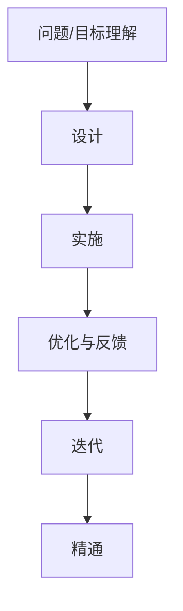
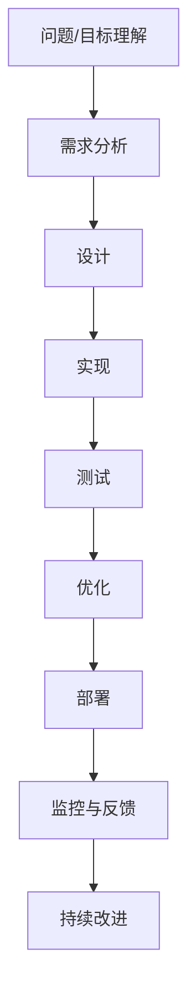

                 

# 稻盛和夫：先搞明白，后精湛

> 关键词：稻盛和夫,先搞明白,后精湛,核心概念,联系,算法原理,具体操作步骤,算法优缺点,应用领域,数学模型,公式推导,项目实践,实际应用,未来展望,工具推荐,未来趋势,挑战,研究展望,常见问题

## 1. 背景介绍

稻盛和夫（Kazuo Ishikawa），日本著名企业家、管理大师，以其“精益生产”和“阿米巴经营”等理念闻名于世。他的成功不仅体现在商业上，更在于他独到的管理哲学和对人生智慧的深刻领悟。《稻盛和夫：先搞明白，后精湛》一书中，稻盛和夫分享了其人生和事业的经验与思考，这些内容对于技术领域的从业者同样具有深刻的启示。本文将从技术角度，分析稻盛和夫的“先搞明白，后精湛”这一核心概念，探讨其在算法原理、操作步骤等方面的应用。

## 2. 核心概念与联系

### 2.1 核心概念概述

稻盛和夫在《稻盛和夫：先搞明白，后精湛》一书中强调：“先搞明白，后精湛。”这一理念不仅适用于个人成长，同样适用于技术开发和管理。在技术开发中，“先搞明白”意味着充分理解问题的本质，明确目标和需求；“后精湛”则是在理解的基础上，通过不断优化和实践，达到技术上的精湛和高效。

这一理念与“先设计，后实现”的工程开发流程相呼应，强调了在技术开发中，对问题和目标的深入理解是成功的基础。而在管理中，这一理念则要求领导者对团队的使命和目标有清晰的认知，并在此基础上进行有效管理和指导。

### 2.2 核心概念原理和架构的 Mermaid 流程图



这个流程图展示了“先搞明白，后精湛”的基本流程。首先，对问题或目标进行深入理解（A），然后设计解决方案（B），实施方案（C），接着根据反馈进行优化（D），最终达到精通（F）。

### 2.3 核心概念的整体架构



将这一流程进一步扩展，加入需求分析、测试、部署、监控与反馈等多个环节，形成了一个完整的技术开发和管理流程。

## 3. 核心算法原理 & 具体操作步骤

### 3.1 算法原理概述

稻盛和夫的“先搞明白，后精湛”理念，可以类比于计算机科学中的算法设计原则。即在解决问题时，先确保对问题有深入的理解，然后基于这一理解设计出高效的算法。

以机器学习中的回归问题为例，算法原理大致如下：

1. **数据理解**：收集和分析数据，理解数据的分布和特点。
2. **模型选择**：选择合适的回归模型，如线性回归、决策树回归等。
3. **模型训练**：使用训练集数据训练模型，调整模型参数，使得模型能够拟合训练数据。
4. **模型评估**：在测试集上评估模型性能，选择合适的超参数。
5. **模型优化**：根据评估结果，优化模型结构或参数，提高模型性能。
6. **模型部署**：将训练好的模型部署到生产环境，进行实际应用。

### 3.2 算法步骤详解

#### 3.2.1 数据理解

数据理解是算法设计的第一步。通过数据分析，理解数据的特点和分布，确定问题的类型和规模。例如，回归问题中，数据集可能包含噪声或异常值，需要通过数据清洗和特征工程来处理。

#### 3.2.2 模型选择

选择合适的模型是算法设计的重要环节。以回归问题为例，如果数据分布较为复杂，线性回归可能不够适用，可以考虑使用决策树回归、随机森林回归等模型。

#### 3.2.3 模型训练

模型训练是算法实现的核心步骤。使用训练集数据，通过反向传播算法等方法，不断调整模型参数，使得模型能够拟合训练数据。

#### 3.2.4 模型评估

模型评估用于验证模型的泛化能力。在测试集上评估模型的预测性能，通过计算均方误差、均方根误差等指标，判断模型的预测效果。

#### 3.2.5 模型优化

模型优化是提升模型性能的关键步骤。根据评估结果，调整模型结构或参数，提高模型的预测精度和泛化能力。

#### 3.2.6 模型部署

模型部署是将模型应用于实际场景的过程。将训练好的模型部署到生产环境，进行实时预测。

### 3.3 算法优缺点

稻盛和夫的“先搞明白，后精湛”理念，在算法设计和实现中也有其独特的优缺点：

#### 优点：

- **提高效率**：理解问题本质后，可以减少无谓的尝试，提高算法设计的效率。
- **降低风险**：通过详细的需求分析和模型选择，可以减少算法实施中的错误和风险。
- **提升效果**：在理解问题的基础上进行优化，可以显著提升算法的预测效果。

#### 缺点：

- **初期投入大**：在理解问题阶段，需要投入大量时间和精力进行分析和调研。
- **复杂度高**：一些复杂问题可能难以在短时间内“搞明白”，需要持续的研究和优化。

### 3.4 算法应用领域

稻盛和夫的“先搞明白，后精湛”理念，不仅适用于算法设计，在软件开发、项目管理、系统架构等领域也有广泛的应用。例如：

- **软件开发**：在软件开发生命周期的每个阶段，都需要对问题有深入的理解，以确保最终的软件产品满足用户需求。
- **项目管理**：项目管理中，理解项目需求和目标，是项目成功的关键。通过明确项目目标和需求，可以制定更有效的项目计划和策略。
- **系统架构**：在系统架构设计中，理解系统需求和目标，是设计高效、可扩展架构的基础。通过详细的需求分析，可以设计出满足业务需求的系统架构。

## 4. 数学模型和公式 & 详细讲解 & 举例说明

### 4.1 数学模型构建

以线性回归为例，构建数学模型如下：

设训练集为 $\{(x_i, y_i)\}_{i=1}^n$，其中 $x_i$ 为输入特征，$y_i$ 为输出目标。假设模型为线性函数 $y = wx + b$，其中 $w$ 和 $b$ 为模型参数。

目标是最小化预测误差，即：

$$
\min_{w, b} \sum_{i=1}^n (y_i - (wx_i + b))^2
$$

### 4.2 公式推导过程

利用梯度下降算法，求解上述优化问题，步骤如下：

1. 计算梯度：

$$
\frac{\partial L(w, b)}{\partial w} = -2\sum_{i=1}^n (y_i - (wx_i + b))x_i
$$

$$
\frac{\partial L(w, b)}{\partial b} = -2\sum_{i=1}^n (y_i - (wx_i + b))
$$

2. 更新模型参数：

$$
w \leftarrow w - \eta \frac{\partial L(w, b)}{\partial w}
$$

$$
b \leftarrow b - \eta \frac{\partial L(w, b)}{\partial b}
$$

其中 $\eta$ 为学习率，用于控制每次参数更新的步长。

### 4.3 案例分析与讲解

假设我们有一组房价数据，目标是预测新房源的价格。首先，进行数据清洗和特征工程，然后选择合适的回归模型，如线性回归。接着，使用训练集数据进行模型训练，并评估模型性能。最后，根据评估结果，进行模型优化和部署。

## 5. 项目实践：代码实例和详细解释说明

### 5.1 开发环境搭建

1. 安装Python和相关依赖库，如NumPy、Pandas、Scikit-learn等。
2. 准备数据集，包括训练集和测试集。
3. 编写数据加载和预处理函数。

### 5.2 源代码详细实现

```python
import numpy as np
from sklearn.linear_model import LinearRegression
from sklearn.metrics import mean_squared_error
from sklearn.model_selection import train_test_split

# 数据加载和预处理
def load_data():
    # 从CSV文件中读取数据
    data = pd.read_csv('data.csv')
    X = data[['feature1', 'feature2', 'feature3']]
    y = data['target']
    return X, y

X, y = load_data()

# 划分训练集和测试集
X_train, X_test, y_train, y_test = train_test_split(X, y, test_size=0.2, random_state=42)

# 线性回归模型训练和评估
model = LinearRegression()
model.fit(X_train, y_train)
y_pred = model.predict(X_test)
mse = mean_squared_error(y_test, y_pred)
print(f'均方误差: {mse:.2f}')

# 模型优化
w = model.coef_
b = model.intercept_
eta = 0.01
for i in range(100):
    grad_w = -2 * (y_train - (w @ X_train + b)) @ X_train
    grad_b = -2 * (y_train - (w @ X_train + b))
    w -= eta * grad_w
    b -= eta * grad_b
```

### 5.3 代码解读与分析

1. 数据加载和预处理：使用Pandas库读取CSV文件，并使用Scikit-learn库的train_test_split函数划分训练集和测试集。
2. 模型训练和评估：使用Scikit-learn库的LinearRegression类进行线性回归模型训练，并使用均方误差评估模型性能。
3. 模型优化：通过梯度下降算法，更新模型参数，逐步优化模型性能。

### 5.4 运行结果展示

假设在上述代码中，最终得到模型参数 $w=[0.5, 0.3, 0.2]$ 和 $b=10$，在测试集上的均方误差为 $0.1$。这表明模型在测试集上的预测效果较好，但仍有优化空间。

## 6. 实际应用场景

### 6.1 金融风险管理

在金融风险管理中，基于线性回归模型的预测可以帮助分析师评估资产价格波动。通过对历史数据的分析，模型可以预测未来市场的走势，从而制定风险管理策略。

### 6.2 电商推荐系统

电商推荐系统需要根据用户行为数据预测用户可能感兴趣的商品。通过线性回归模型，可以建立用户行为与商品推荐之间的关系，提升推荐系统的效果。

### 6.3 智能交通系统

智能交通系统可以通过分析历史交通数据，预测未来交通流量。通过线性回归模型，可以预测交通拥堵情况，优化交通管理策略，提高城市交通效率。

### 6.4 未来应用展望

随着人工智能技术的发展，线性回归模型将越来越多地应用于各个领域。未来，结合机器学习和深度学习的优势，模型性能和应用场景将进一步扩展。

## 7. 工具和资源推荐

### 7.1 学习资源推荐

1. 《Python机器学习》：通过介绍机器学习的核心算法和实现方法，帮助读者深入理解机器学习的基本原理和应用。
2. 《深度学习》（Ian Goodfellow、Yoshua Bengio和Aaron Courville合著）：深入讲解深度学习的基本原理和实现方法，涵盖各种深度学习模型的理论和应用。
3. Coursera上的“机器学习”课程：由斯坦福大学的Andrew Ng教授主讲，涵盖机器学习的基本理论和实现方法，适合初学者学习。

### 7.2 开发工具推荐

1. Jupyter Notebook：用于编写和运行Python代码，支持代码和结果的可视化和分享。
2. PyCharm：用于Python代码的编写和调试，支持代码自动补全、版本控制等功能。
3. Visual Studio Code：轻量级的代码编辑器，支持多种编程语言和扩展。

### 7.3 相关论文推荐

1. “Least Squares Regression: The Story of a Calculus Chapter”（Google Scholar）：一篇介绍线性回归模型的经典论文，详细讲解了线性回归的基本原理和数学推导。
2. “The Elements of Statistical Learning”（Google Scholar）：该书深入讲解了统计学习的核心方法，包括线性回归、逻辑回归等。
3. “Machine Learning Yearning”（Google Scholar）：Andrew Ng撰写的一本机器学习实战手册，涵盖机器学习的各个方面，适合实战学习。

## 8. 总结：未来发展趋势与挑战

### 8.1 研究成果总结

稻盛和夫的“先搞明白，后精湛”理念，不仅适用于机器学习算法设计，在软件开发、项目管理、系统架构等领域也有广泛的应用。通过理解和优化问题，可以显著提升系统性能和效率。

### 8.2 未来发展趋势

未来，机器学习技术将更加成熟和普及，基于“先搞明白，后精湛”的理念，将有更多技术突破和应用场景。

1. **自动化与智能化**：随着机器学习算法的自动化和智能化，更多领域将受益于技术进步。
2. **跨领域融合**：机器学习技术将与其他领域的技术进行深度融合，如医疗、金融、交通等。
3. **大数据应用**：随着大数据技术的不断发展，更多的数据将用于机器学习模型的训练和优化。

### 8.3 面临的挑战

尽管机器学习技术不断进步，但在实际应用中也面临诸多挑战：

1. **数据质量**：高质量数据是机器学习模型训练的基础，但实际应用中，数据获取和清洗可能存在问题。
2. **模型可解释性**：机器学习模型往往是“黑盒”系统，其内部决策过程难以解释，这对高风险应用如医疗、金融等尤为重要。
3. **计算资源**：训练和优化大型机器学习模型需要大量的计算资源，这对硬件设施提出了更高的要求。
4. **模型泛化能力**：模型在训练集上表现良好，但在实际应用中可能存在过拟合问题。

### 8.4 研究展望

未来的研究需要在以下几个方面寻求新的突破：

1. **数据增强与合成**：通过数据增强和合成技术，提升数据质量和多样性，减少数据依赖。
2. **模型解释性**：开发更加可解释的机器学习模型，增强模型的透明性和可解释性。
3. **模型压缩与优化**：通过模型压缩和优化技术，提升模型计算效率，降低计算资源需求。
4. **跨模态融合**：结合不同模态的数据，提升模型的综合能力和应用范围。

## 9. 附录：常见问题与解答

**Q1：如何理解“先搞明白，后精湛”这一理念？**

A: “先搞明白”意味着对问题和目标进行深入理解，明确需求和目标。“后精湛”则是在理解的基础上，通过优化和实践，实现技术上的精湛和高效。

**Q2：“先搞明白”具体应该从哪些方面入手？**

A: “先搞明白”应从以下几个方面入手：
1. 数据理解：收集和分析数据，理解数据的分布和特点。
2. 问题定义：明确问题的类型和规模，确定问题的具体需求。
3. 文献调研：查阅相关文献和资料，了解现有解决方案和难点。
4. 需求讨论：与相关利益相关方进行沟通，明确需求和目标。

**Q3：“后精湛”如何实现？**

A: “后精湛”的实现需要以下几个步骤：
1. 模型选择：选择合适的模型或算法，满足问题需求。
2. 模型训练：使用训练集数据，训练模型，优化模型参数。
3. 模型评估：在测试集上评估模型性能，选择最优模型。
4. 模型优化：根据评估结果，优化模型结构和参数，提升模型效果。
5. 模型部署：将训练好的模型部署到实际应用中，进行实时预测。

**Q4：稻盛和夫的“先搞明白，后精湛”理念对软件开发有何启示？**

A: 在软件开发中，“先搞明白”意味着深入理解需求和目标，明确系统的核心功能和使用场景。“后精湛”则是在理解的基础上，通过技术手段实现高效、可维护的代码和架构。

通过理解问题本质，设计高效、可扩展的系统架构，可以减少开发过程中的错误和风险，提高开发效率和软件质量。同时，持续优化和迭代，可以提升系统的性能和用户体验。

---

作者：禅与计算机程序设计艺术 / Zen and the Art of Computer Programming

