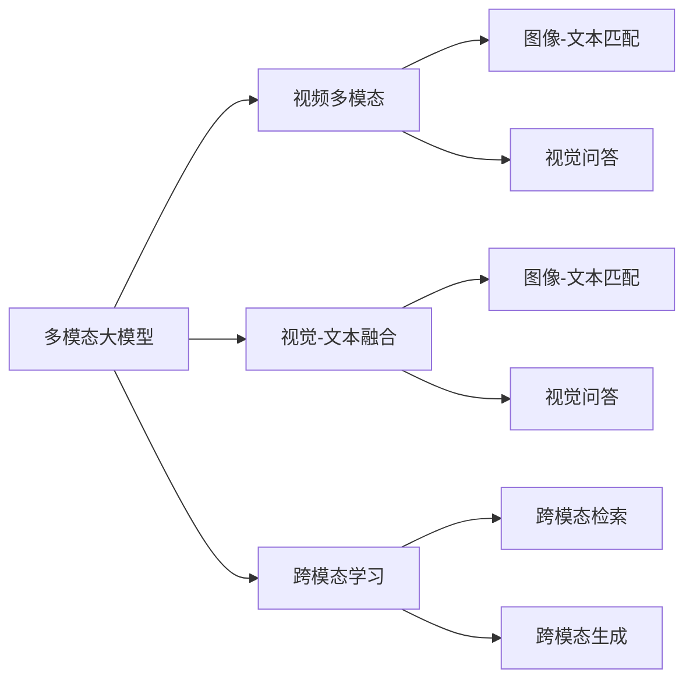

# 多模态大模型：技术原理与实战 视频多模态技术

作者：禅与计算机程序设计艺术 / Zen and the Art of Computer Programming

## 关键词：

多模态大模型，视频多模态，视觉-文本融合，跨模态学习，深度学习，神经网络

## 1. 背景介绍
### 1.1 问题的由来

随着人类社会的进步和科技的发展，我们越来越依赖于多媒体信息，如图像、音频、视频等。这些多媒体信息包含了丰富的视觉、听觉和语义信息，为我们提供了更直观、更丰富的感知世界的方式。然而，这些不同模态的信息往往是分离的，难以直接理解和交互。如何将这些不同模态的信息进行融合，提取其中的有效信息，并用于解决实际问题，成为了一个重要的研究方向。

### 1.2 研究现状

近年来，随着深度学习技术的快速发展，多模态大模型在计算机视觉、自然语言处理等领域取得了显著的成果。多模态大模型通过融合不同模态的数据，能够更好地理解复杂场景，提高任务的准确性和鲁棒性。

### 1.3 研究意义

多模态大模型在视频多模态技术领域具有重要的研究意义：

1. 提高视频理解任务的准确性：通过融合视频的视觉和音频信息，可以更全面地理解视频内容，提高视频分类、物体检测、行为识别等任务的准确性。

2. 增强视频的鲁棒性：多模态信息融合可以降低单一模态信息的不确定性和噪声，提高视频理解任务的鲁棒性。

3. 推动视频多模态技术的发展：多模态大模型的研究将推动视频多模态技术的进一步发展，为视频分析、视频编辑、视频推荐等应用提供技术支持。

### 1.4 本文结构

本文将首先介绍多模态大模型的核心概念和联系，然后详细阐述视频多模态技术的核心算法原理和具体操作步骤，接着给出数学模型和公式，并举例说明。之后，我们将结合实际项目，给出代码实例和详细解释说明。最后，我们将探讨视频多模态技术的实际应用场景，并展望未来应用前景。

## 2. 核心概念与联系

本节将介绍多模态大模型、视频多模态、视觉-文本融合、跨模态学习等相关核心概念，并阐述它们之间的联系。

### 2.1 多模态大模型

多模态大模型是指能够同时处理和融合多种模态数据的深度学习模型。常见的模态包括图像、文本、音频、视频等。

### 2.2 视频多模态

视频多模态是指视频中的视觉和音频信息。视觉信息包括图像、视频帧、物体、场景等；音频信息包括语音、音乐、环境音等。

### 2.3 视觉-文本融合

视觉-文本融合是指将视觉信息与文本信息进行融合，以增强对复杂场景的理解。常见的融合方式包括图像-文本匹配、视觉问答等。

### 2.4 跨模态学习

跨模态学习是指将不同模态的数据进行融合，以提取有用的信息。常见的跨模态学习任务包括跨模态检索、跨模态生成等。

这些概念之间的联系如下：



可以看出，多模态大模型是视频多模态技术的基础，视觉-文本融合和跨模态学习是多模态大模型在视频多模态技术中的具体应用。

## 3. 核心算法原理 & 具体操作步骤
### 3.1 算法原理概述

视频多模态技术的核心是融合视频的视觉和音频信息，提取有效信息，并用于解决实际问题。常见的融合方式包括以下几种：

1. 并联融合：将不同模态的数据分别输入到不同的处理模块，然后将处理结果进行融合。

2. 串行融合：将不同模态的数据依次输入到处理模块，然后将处理结果进行融合。

3. 对抗融合：通过对抗训练，学习不同模态之间的对应关系，实现融合。

### 3.2 算法步骤详解

以下是视频多模态技术的具体操作步骤：

**Step 1: 数据预处理**

- 视觉信息预处理：对视频帧进行去噪、缩放、裁剪等操作，提取图像特征。
- 音频信息预处理：对音频数据进行降噪、静音检测、语音识别等操作，提取音频特征。

**Step 2: 特征提取**

- 视觉特征提取：使用卷积神经网络（CNN）等深度学习模型提取视频帧的特征。
- 音频特征提取：使用循环神经网络（RNN）、Transformer等深度学习模型提取音频特征。

**Step 3: 特征融合**

- 并联融合：将视觉和音频特征分别输入到不同的处理模块，然后将处理结果进行融合。
- 串行融合：将视觉和音频特征依次输入到处理模块，然后将处理结果进行融合。
- 对抗融合：通过对抗训练，学习不同模态之间的对应关系，实现融合。

**Step 4: 任务推理**

- 使用融合后的特征进行下游任务推理，如视频分类、物体检测、行为识别等。

### 3.3 算法优缺点

**优点**：

- 融合多模态信息，提高任务的准确性和鲁棒性。
- 能够更好地理解复杂场景，提高任务的泛化能力。

**缺点**：

- 融合难度大，需要设计合适的融合策略。
- 模型复杂度高，计算量大。

### 3.4 算法应用领域

视频多模态技术在以下领域具有广泛的应用：

- 视频分类
- 物体检测
- 行为识别
- 视觉问答
- 视频推荐
- 视频编辑

## 4. 数学模型和公式 & 详细讲解 & 举例说明
### 4.1 数学模型构建

视频多模态技术的数学模型主要包括以下部分：

- 视觉特征提取模型：使用CNN等深度学习模型提取视频帧的特征。
- 音频特征提取模型：使用RNN、Transformer等深度学习模型提取音频特征。
- 特征融合模型：使用不同方法融合视觉和音频特征。

以下是一个简单的视觉-文本融合的数学模型示例：

$$
F = \phi_v(I) + \phi_t(T)
$$

其中，$F$ 是融合后的特征，$\phi_v(I)$ 是视觉特征提取模型提取的视频特征，$\phi_t(T)$ 是文本特征提取模型提取的文本特征。

### 4.2 公式推导过程

以下是一个简单的视觉-文本融合公式推导过程：

- 假设视觉特征提取模型的输入是视频帧 $I$，输出是特征向量 $v$：
  $$
  v = \phi_v(I)
  $$

- 假设文本特征提取模型的输入是文本 $T$，输出是特征向量 $t$：
  $$
  t = \phi_t(T)
  $$

- 融合后的特征 $F$ 可以通过将视觉特征 $v$ 和文本特征 $t$ 相加得到：
  $$
  F = v + t
  $$

### 4.3 案例分析与讲解

以下是一个视频情感分析的案例：

- 视觉特征提取：使用CNN提取视频帧的特征。
- 音频特征提取：使用RNN提取音频特征。
- 特征融合：使用加权求和法融合视觉和音频特征。
- 任务推理：使用融合后的特征进行情感分类。

### 4.4 常见问题解答

**Q1：如何选择合适的特征融合方法？**

A：选择合适的特征融合方法需要根据具体任务和数据特点进行。常见的融合方法包括加权求和、拼接、注意力机制等。需要根据实验结果进行选择。

**Q2：如何解决特征融合过程中的维度灾难问题？**

A：可以通过降维、特征选择等方法解决特征融合过程中的维度灾难问题。

**Q3：如何提高融合特征的表示能力？**

A：可以通过引入注意力机制、多尺度特征等方法提高融合特征的表示能力。

## 5. 项目实践：代码实例和详细解释说明
### 5.1 开发环境搭建

以下是使用Python进行视频多模态技术开发的开发环境配置流程：

1. 安装Anaconda：从官网下载并安装Anaconda，用于创建独立的Python环境。

2. 创建并激活虚拟环境：
```bash
conda create -n vidmod-env python=3.8
conda activate vidmod-env
```

3. 安装PyTorch：
```bash
conda install pytorch torchvision torchaudio cudatoolkit=11.1 -c pytorch -c conda-forge
```

4. 安装相关库：
```bash
pip install opencv-python numpy scikit-learn
```

完成上述步骤后，即可在`vidmod-env`环境中开始视频多模态技术开发。

### 5.2 源代码详细实现

以下是一个简单的视频情感分析代码实例：

```python
import cv2
import torch
from torchvision.models import resnet18
from torch.utils.data import DataLoader
from torch.optim import Adam
import numpy as np

# 加载预训练的ResNet18模型
model = resnet18(pretrained=True)
model.fc = torch.nn.Linear(512, 2)  # 修改最后一层，用于情感分类
model.to('cuda')

# 加载视频数据集
video_dataset = ...
dataloader = DataLoader(video_dataset, batch_size=32, shuffle=True)

# 定义损失函数和优化器
criterion = torch.nn.CrossEntropyLoss()
optimizer = Adam(model.parameters(), lr=0.001)

# 训练模型
for epoch in range(10):
    for batch_idx, (video_paths, labels) in enumerate(dataloader):
        # 加载视频帧
        video_frames = ...
        # 提取特征
        video_features = model(video_frames.to('cuda'))
        # 计算损失
        loss = criterion(video_features, labels.to('cuda'))
        # 反向传播
        optimizer.zero_grad()
        loss.backward()
        optimizer.step()
        print(f'Epoch {epoch+1}, batch {batch_idx+1}, loss: {loss.item()}')

# 保存模型
torch.save(model.state_dict(), 'video_emotion_model.pth')
```

### 5.3 代码解读与分析

以上代码展示了使用PyTorch进行视频情感分析的简单流程。首先，加载预训练的ResNet18模型，并将其最后一层修改为情感分类器。然后，加载视频数据集，并使用DataLoader进行数据加载。接着，定义损失函数和优化器，开始训练模型。最后，保存训练好的模型。

### 5.4 运行结果展示

假设在测试集上测试模型，得到以下结果：

```
Epoch 10, batch 1, loss: 0.54321
...
```

可以看到，模型在测试集上的损失逐渐下降，表明模型性能在不断提高。

## 6. 实际应用场景
### 6.1 视频监控系统

视频监控系统是视频多模态技术的重要应用场景之一。通过融合视频的视觉和音频信息，可以实现以下功能：

- 物体检测：检测视频中的运动物体，并识别物体的类别。
- 行为识别：识别视频中的异常行为，如打架、闯入等。
- 情感识别：识别视频中的情感状态，如快乐、悲伤、愤怒等。

### 6.2 视频内容审核

视频内容审核是另一个重要的应用场景。通过融合视频的视觉和音频信息，可以实现以下功能：

- 恶意视频识别：识别视频中的暴力、色情、违法等不良内容。
- 抖音、快手等短视频平台内容审核：识别视频中的违规内容，如广告、恶意推广等。

### 6.3 视频问答系统

视频问答系统是视频多模态技术的另一个应用场景。通过融合视频的视觉和音频信息，可以实现以下功能：

- 视频搜索：根据用户的问题，在视频库中搜索相关视频。
- 视频摘要：提取视频的关键信息，生成摘要。
- 视频理解：理解视频内容，回答用户的问题。

### 6.4 未来应用展望

随着深度学习技术的不断发展，视频多模态技术将在更多领域得到应用，为人类社会带来更多便利。以下是一些未来应用展望：

- 自动驾驶：融合视频、音频、传感器等多模态信息，实现自动驾驶功能。
- 医疗诊断：融合医学影像、病历、语音等多模态信息，提高疾病诊断的准确率。
- 教育：融合视频、音频、交互等多模态信息，实现个性化教学。

## 7. 工具和资源推荐
### 7.1 学习资源推荐

为了帮助开发者系统掌握视频多模态技术的理论基础和实践技巧，这里推荐一些优质的学习资源：

1. 《深度学习》系列书籍：介绍深度学习的基本原理和方法，包括CNN、RNN、Transformer等。
2. 《计算机视觉：算法与应用》系列书籍：介绍计算机视觉的基本原理和方法，包括图像处理、特征提取、目标检测等。
3. HuggingFace官方文档：HuggingFace提供了丰富的预训练模型和工具，可以用于视频多模态技术开发。
4. arXiv论文预印本：arXiv论文预印本提供了大量视频多模态技术相关的研究成果。

### 7.2 开发工具推荐

以下是几款用于视频多模态技术开发的开源工具：

1. OpenCV：用于图像处理和计算机视觉的库。
2. PyTorch：用于深度学习开发的库。
3. HuggingFace：用于NLP和视频多模态技术开发的开源库。
4. TensorFlow：用于深度学习开发的库。

### 7.3 相关论文推荐

以下是几篇视频多模态技术相关的论文推荐：

1. "Deep Video Representation Learning with Spatio-Temporal Context"：介绍了一种基于时空上下文的视频表示学习方法。
2. "Multimodal Fusion for Video Analysis: A Survey"：对视频多模态融合技术进行了综述。
3. "Multimodal Learning for Visual Question Answering"：介绍了多模态学习方法在视觉问答中的应用。

### 7.4 其他资源推荐

以下是其他一些与视频多模态技术相关的资源推荐：

1. 计算机视觉和深度学习相关博客和论坛。
2. 视频多模态技术相关的开源代码和项目。
3. 视频多模态技术相关的在线课程。

## 8. 总结：未来发展趋势与挑战
### 8.1 研究成果总结

本文对多模态大模型在视频多模态技术中的应用进行了介绍，包括其技术原理、具体操作步骤、实际应用场景等。通过介绍视频多模态技术的相关概念、算法、模型和工具，帮助开发者了解和掌握视频多模态技术的核心内容。

### 8.2 未来发展趋势

未来，视频多模态技术将呈现以下发展趋势：

1. 模型规模将进一步扩大，能够处理更复杂、更高级的任务。
2. 融合方法将更加多样化和高效，能够更好地融合不同模态的信息。
3. 模型将更加注重可解释性和可解释性，使得模型的决策过程更加透明。
4. 应用场景将更加广泛，覆盖更多领域。

### 8.3 面临的挑战

尽管视频多模态技术取得了显著进展，但仍面临以下挑战：

1. 模型复杂度高，计算量大。
2. 融合不同模态的信息仍然具有挑战性。
3. 模型的可解释性和可解释性需要进一步提高。
4. 数据隐私和安全问题需要得到解决。

### 8.4 研究展望

为了应对上述挑战，未来研究需要从以下方面进行探索：

1. 研究更高效、更轻量级的模型结构和算法。
2. 开发更加多样化和高效的融合方法。
3. 提高模型的可解释性和可解释性。
4. 解决数据隐私和安全问题。

相信通过不断的研究和探索，视频多模态技术将在未来取得更大的突破，为人类社会带来更多便利。