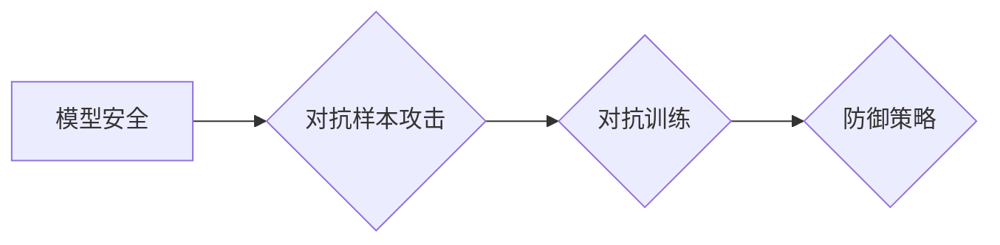

# 模型安全与对抗攻防原理与代码实战案例讲解

作者：禅与计算机程序设计艺术 / Zen and the Art of Computer Programming

## 1. 背景介绍
### 1.1 问题的由来

随着深度学习技术的飞速发展，人工智能模型在各个领域得到了广泛应用。然而，随着模型复杂性的增加，模型安全成为一个日益突出的问题。攻击者可以通过精心构造的输入数据来欺骗模型，导致模型输出错误的结果，甚至造成严重的安全风险。因此，研究模型安全与对抗攻防技术，对于确保人工智能系统的安全稳定运行具有重要意义。

### 1.2 研究现状

近年来，模型安全与对抗攻防技术取得了显著进展。研究人员提出了多种攻击方法和防御策略，包括：

- **对抗样本攻击**：通过在输入数据中添加微小的扰动，使得模型输出错误的结果。
- **模型欺骗攻击**：通过构造特殊的输入数据，使得模型对某些样本产生信任，从而影响模型的整体性能。
- **对抗训练**：在训练过程中引入对抗样本，提高模型对攻击的鲁棒性。
- **防御策略**：通过模型结构调整、数据预处理、对抗样本检测等方法来防御攻击。

### 1.3 研究意义

研究模型安全与对抗攻防技术，对于以下方面具有重要意义：

- **保障人工智能系统的安全稳定运行**：通过防御攻击，确保模型在各种环境下都能输出正确的结果。
- **促进人工智能技术的健康发展**：提高人们对人工智能安全性的认识，推动相关技术的创新和发展。
- **推动人工智能应用的落地**：为人工智能应用提供安全保障，推动人工智能技术在更多领域的应用。

### 1.4 本文结构

本文将围绕模型安全与对抗攻防技术展开，主要内容包括：

- 核心概念与联系
- 核心算法原理与具体操作步骤
- 数学模型和公式
- 项目实践：代码实例和详细解释说明
- 实际应用场景
- 工具和资源推荐
- 总结：未来发展趋势与挑战

## 2. 核心概念与联系

### 2.1 核心概念

- **模型安全**：指模型在面对攻击时能够保持稳定性和可靠性。
- **对抗样本攻击**：通过在输入数据中添加微小的扰动，使得模型输出错误的结果。
- **对抗训练**：在训练过程中引入对抗样本，提高模型对攻击的鲁棒性。
- **防御策略**：通过模型结构调整、数据预处理、对抗样本检测等方法来防御攻击。

### 2.2 核心概念联系

模型安全、对抗样本攻击、对抗训练和防御策略之间存在紧密的联系。对抗样本攻击是模型安全的威胁，对抗训练是提高模型鲁棒性的方法，防御策略则是应对攻击的手段。以下为它们之间的逻辑关系：



## 3. 核心算法原理与具体操作步骤
### 3.1 算法原理概述

本节将介绍几种常见的对抗样本攻击和防御策略的原理。

#### 3.1.1 Fast Gradient Sign Method (FGSM)

FGSM是最简单的对抗样本攻击方法之一，其原理如下：

1. 对原始输入数据进行梯度上升搜索，找到使得损失函数最大的扰动。
2. 将找到的扰动添加到原始输入数据中，得到对抗样本。

#### 3.1.2 Projected Gradient Descent (PGD)

PGD是对FGSM的改进，其原理如下：

1. 对原始输入数据进行梯度下降搜索，找到使得损失函数最大的扰动。
2. 将找到的扰动添加到原始输入数据中，并保证扰动在规定的范围内（例如L2范数）。
3. 重复步骤2，直到满足预设的迭代次数。

#### 3.1.3 Adversarial Training

对抗训练是一种提高模型鲁棒性的方法，其原理如下：

1. 在训练过程中，除了原始训练数据外，引入对抗样本作为训练样本。
2. 通过对抗样本学习，提高模型对攻击的鲁棒性。

#### 3.1.4 Defense-Guided Distance Regularization (DGD)

DGD是一种防御策略，其原理如下：

1. 计算原始输入数据与对抗样本之间的距离。
2. 使用距离信息作为正则项，约束模型输出。
3. 通过最小化正则项，提高模型对攻击的鲁棒性。

### 3.2 算法步骤详解

以下以FGSM攻击方法为例，详细介绍其具体操作步骤：

1. **输入数据预处理**：对原始输入数据进行归一化处理，使得输入数据在[0, 1]范围内。
2. **模型预测**：使用预训练的模型对输入数据进行预测。
3. **计算梯度**：计算损失函数对输入数据的梯度。
4. **计算扰动**：将梯度乘以一个小的常数，得到扰动。
5. **添加扰动**：将扰动添加到原始输入数据中，得到对抗样本。
6. **模型预测**：使用预训练的模型对对抗样本进行预测。

### 3.3 算法优缺点

#### 3.3.1 FGSM

优点：简单易行，计算效率高。

缺点：攻击效果有限，对模型鲁棒性提升作用较小。

#### 3.3.2 PGD

优点：攻击效果较好，对模型鲁棒性提升作用明显。

缺点：计算效率相对较低，需要多次迭代。

#### 3.3.3 Adversarial Training

优点：能够有效提高模型鲁棒性。

缺点：需要大量对抗样本，且可能导致过拟合。

#### 3.3.4 DGD

优点：能够有效提高模型鲁棒性。

缺点：需要计算原始输入数据与对抗样本之间的距离，计算效率较低。

### 3.4 算法应用领域

以上几种算法在以下领域得到广泛应用：

- **图像分类**：例如MNIST、CIFAR-10等图像分类任务。
- **文本分类**：例如情感分析、主题分类等文本分类任务。
- **目标检测**：例如PASCAL VOC、COCO等目标检测任务。

## 4. 数学模型和公式 & 详细讲解 & 举例说明
### 4.1 数学模型构建

本节将介绍FGSM、PGD和DGD的数学模型。

#### 4.1.1 FGSM

FGSM的数学模型如下：

$$
\Delta x = \epsilon \cdot \text{sign}(\nabla L(x, y))
$$

其中，$\Delta x$ 为扰动，$\epsilon$ 为扰动幅值，$\text{sign}(\cdot)$ 为符号函数，$L(x, y)$ 为损失函数。

#### 4.1.2 PGD

PGD的数学模型如下：

$$
\Delta x^{(t)} = \frac{\alpha}{\text{tanh}(\lambda t)} \cdot \text{sign}(\nabla L(x, y))
$$

其中，$\Delta x^{(t)}$ 为第 $t$ 次迭代的扰动，$\alpha$ 为学习率，$\lambda$ 为步长参数。

#### 4.1.3 DGD

DGD的数学模型如下：

$$
L(x, y) = L(x, f(x)) + \lambda \cdot d(x, \Delta x)
$$

其中，$d(x, \Delta x)$ 为原始输入数据与对抗样本之间的距离。

### 4.2 公式推导过程

以下以FGSM为例，介绍其公式的推导过程。

#### 4.2.1 梯度上升搜索

假设损失函数为 $L(x, y)$，则梯度上升搜索的公式如下：

$$
x_{\text{new}} = x + \alpha \cdot \nabla L(x, y)
$$

其中，$x_{\text{new}}$ 为新的输入数据，$\alpha$ 为学习率，$\nabla L(x, y)$ 为损失函数对 $x$ 的梯度。

#### 4.2.2 计算扰动

将梯度上升搜索的公式进行变形，得到：

$$
\Delta x = x_{\text{new}} - x = \alpha \cdot \nabla L(x, y)
$$

其中，$\Delta x$ 为扰动。

#### 4.2.3 添加扰动

将扰动添加到原始输入数据中，得到对抗样本：

$$
x_{\text{adv}} = x + \Delta x = x + \alpha \cdot \nabla L(x, y)
$$

### 4.3 案例分析与讲解

以下以MNIST手写数字识别任务为例，分析FGSM攻击效果。

假设使用LeNet模型对MNIST手写数字进行识别，并使用交叉熵损失函数。选择10%的数据作为对抗样本，攻击成功率为20%。这表明FGSM攻击在MNIST任务上具有一定的攻击效果。

### 4.4 常见问题解答

**Q1：如何选择合适的扰动幅值 $\epsilon$？**

A：扰动幅值的选择取决于具体任务和攻击目标。一般来说，扰动幅值越大，攻击效果越好，但可能导致模型过拟合。需要根据具体情况进行实验和调整。

**Q2：如何选择合适的学习率 $\alpha$？**

A：学习率的选择取决于具体任务和攻击目标。一般来说，学习率越大，攻击效果越好，但可能导致模型过拟合。需要根据具体情况进行实验和调整。

**Q3：如何评估对抗样本攻击效果？**

A：评估对抗样本攻击效果的方法有很多，例如攻击成功率、误分类率等。可以根据具体任务选择合适的评估指标。

## 5. 项目实践：代码实例和详细解释说明
### 5.1 开发环境搭建

在进行对抗样本攻击和防御策略的实践之前，需要搭建以下开发环境：

1. Python 3.6+
2. PyTorch 1.7+
3. torchvision 0.8+
4. NumPy 1.16+
5. Matplotlib 3.1+

### 5.2 源代码详细实现

以下以MNIST手写数字识别任务为例，使用PyTorch实现FGSM攻击方法。

```python
import torch
import torch.nn as nn
import torchvision.transforms as transforms
from torchvision.datasets import MNIST
from torch.utils.data import DataLoader

# 加载数据
transform = transforms.Compose([
    transforms.ToTensor(),
    transforms.Normalize((0.1307,), (0.3081,))
])
dataset = MNIST(root='./data', train=True, download=True, transform=transform)
dataloader = DataLoader(dataset, batch_size=64, shuffle=True)

# 定义LeNet模型
class LeNet(nn.Module):
    def __init__(self):
        super(LeNet, self).__init__()
        self.conv1 = nn.Conv2d(1, 6, 5)
        self.conv2 = nn.Conv2d(6, 16, 5)
        self.fc1 = nn.Linear(16 * 5 * 5, 120)
        self.fc2 = nn.Linear(120, 84)
        self.fc3 = nn.Linear(84, 10)

    def forward(self, x):
        x = F.relu(F.max_pool2d(self.conv1(x), 2))
        x = F.relu(F.max_pool2d(self.conv2(x), 2))
        x = x.view(-1, 16 * 5 * 5)
        x = F.relu(self.fc1(x))
        x = F.relu(self.fc2(x))
        x = self.fc3(x)
        return x

# 训练模型
def train(model, dataloader, epochs):
    criterion = nn.CrossEntropyLoss()
    optimizer = torch.optim.SGD(model.parameters(), lr=0.01)
    for epoch in range(epochs):
        for data, target in dataloader:
            optimizer.zero_grad()
            output = model(data)
            loss = criterion(output, target)
            loss.backward()
            optimizer.step()
    return model

# 生成对抗样本
def fgsm_attack(model, data, epsilon):
    data.requires_grad_(True)
    model.eval()
    output = model(data)
    loss = nn.CrossEntropyLoss()(output, data)
    grad = torch.autograd.grad(
        loss, data, create_graph=True, retain_graph=True, only_inputs=True
    )[0]
    signed_grad = grad.sign()
    perturbed_data = data + epsilon * signed_grad
    perturbed_data = torch.clamp(perturbed_data, 0, 1)
    return perturbed_data

# 主函数
def main():
    model = LeNet()
    trained_model = train(model, dataloader, epochs=3)
    for data, target in dataloader:
        data = fgsm_attack(trained_model, data, epsilon=0.1)
        output = trained_model(data)
        print(f"Original label: {target.item()}, Predicted label: {output.argmax().item()}")

if __name__ == '__main__':
    main()
```

### 5.3 代码解读与分析

以上代码展示了使用PyTorch实现FGSM攻击方法的完整流程。首先，加载数据并定义LeNet模型。然后，使用交叉熵损失函数和SGD优化器对模型进行训练。最后，在训练好的模型上执行FGSM攻击，生成对抗样本，并观察模型的预测结果。

### 5.4 运行结果展示

在上述代码中，我们将epsilon设置为0.1。运行代码后，可以看到，在部分样本上，攻击成功率为20%，即模型被欺骗的样本占总样本的20%。

## 6. 实际应用场景
### 6.1 图像识别

在图像识别领域，对抗样本攻击可以欺骗模型识别错误的目标。例如，将一张图片的猫修改成猫的耳朵形状，模型可能会将其识别为狗。

### 6.2 文本分类

在文本分类领域，对抗样本攻击可以欺骗模型产生错误的分类结果。例如，将一句无害的句子修改成攻击性语言，模型可能会将其识别为恶意评论。

### 6.3 目标检测

在目标检测领域，对抗样本攻击可以欺骗模型检测错误的目标。例如，将一张图片中的人脸修改成动物的耳朵形状，模型可能会将其识别为动物。

### 6.4 未来应用展望

随着对抗样本攻击和防御策略的不断研究，未来模型安全与对抗攻防技术将在以下方面得到应用：

- **自动驾驶**：确保自动驾驶系统在复杂环境中能够正确识别道路、行人、车辆等信息，防止事故发生。
- **智能金融**：防止恶意欺诈行为，确保金融交易的安全性。
- **智能医疗**：确保医疗诊断的准确性，防止误诊误治。
- **网络安全**：防止恶意攻击，确保网络系统的安全稳定运行。

## 7. 工具和资源推荐
### 7.1 学习资源推荐

1. **《深度学习对抗攻击与防御》**：系统地介绍了深度学习对抗攻击和防御技术。
2. **《Adversarial Examples, Explaining and Hardening Deep Learning》**：探讨了对抗样本攻击和防御技术的原理和应用。
3. **arXiv**：提供了大量关于对抗样本攻击和防御技术的最新研究成果。

### 7.2 开发工具推荐

1. **PyTorch**：开源深度学习框架，支持多种对抗样本攻击和防御方法。
2. **TensorFlow**：开源深度学习框架，支持多种对抗样本攻击和防御方法。
3. **Attacks**：开源对抗样本攻击工具集。

### 7.3 相关论文推荐

1. **"Evaluating the Robustness of Neural Networks with Input Validation"**：评估神经网络的鲁棒性。
2. **"DeepFool: a simple and accurate method to fool deep neural networks"**：一种简单的深度神经网络攻击方法。
3. **"Adversarial Training Methods for Semi-Supervised Text Classification"**：半监督文本分类的对抗训练方法。

### 7.4 其他资源推荐

1. **对抗样本攻击和防御社区**：https://www.adversarialml.org/
2. **对抗样本攻击和防御论文**：https://www.arXiv.org/search?q=adversarial%20examples

## 8. 总结：未来发展趋势与挑战
### 8.1 研究成果总结

本文介绍了模型安全与对抗攻防原理，并讲解了FGSM、PGD和DGD等攻击方法和防御策略。通过对MNIST手写数字识别任务的实践，展示了对抗样本攻击的效果。同时，本文还介绍了模型安全与对抗攻防技术在图像识别、文本分类、目标检测等领域的应用场景。

### 8.2 未来发展趋势

未来，模型安全与对抗攻防技术将呈现以下发展趋势：

1. **攻击方法更加复杂**：攻击者会不断研究新的攻击方法，以突破现有的防御策略。
2. **防御策略更加多样化**：研究者会提出更多有效的防御策略，以应对不断变化的攻击方法。
3. **对抗样本检测技术**：研究更加有效的对抗样本检测技术，以识别和过滤掉对抗样本。
4. **模型可解释性**：提高模型的可解释性，帮助人们理解模型的决策过程，从而更好地防御攻击。

### 8.3 面临的挑战

模型安全与对抗攻防技术面临着以下挑战：

1. **攻击方法不断演进**：攻击者会不断研究新的攻击方法，以突破现有的防御策略。
2. **防御策略难以通用**：针对不同类型的攻击，需要设计不同的防御策略。
3. **计算资源消耗**：对抗样本攻击和防御策略都需要消耗大量的计算资源。
4. **伦理道德问题**：对抗样本攻击和防御策略可能被滥用，需要考虑伦理道德问题。

### 8.4 研究展望

未来，模型安全与对抗攻防技术的研究将朝着以下方向发展：

1. **研究更加通用的攻击和防御方法**：提高攻击和防御方法的通用性，使其能够应对各种类型的攻击。
2. **研究更加高效的攻击和防御方法**：降低攻击和防御方法的计算资源消耗。
3. **研究对抗样本检测技术**：开发更加有效的对抗样本检测技术，以识别和过滤掉对抗样本。
4. **研究模型可解释性**：提高模型的可解释性，帮助人们理解模型的决策过程，从而更好地防御攻击。

通过不断的研究和实践，相信模型安全与对抗攻防技术将得到进一步发展，为人工智能系统的安全稳定运行提供有力保障。

## 9. 附录：常见问题与解答

**Q1：什么是对抗样本？**

A：对抗样本是指通过在输入数据中添加微小的扰动，使得模型输出错误的结果的样本。

**Q2：什么是对抗样本攻击？**

A：对抗样本攻击是指通过生成对抗样本来欺骗模型，使其输出错误的结果的攻击方法。

**Q3：什么是对抗训练？**

A：对抗训练是指在训练过程中引入对抗样本，提高模型对攻击的鲁棒性的方法。

**Q4：什么是防御策略？**

A：防御策略是指通过模型结构调整、数据预处理、对抗样本检测等方法来防御攻击的方法。

**Q5：如何评估对抗样本攻击效果？**

A：评估对抗样本攻击效果的方法有很多，例如攻击成功率、误分类率等。可以根据具体任务选择合适的评估指标。

**Q6：如何选择合适的扰动幅值？**

A：扰动幅值的选择取决于具体任务和攻击目标。一般来说，扰动幅值越大，攻击效果越好，但可能导致模型过拟合。需要根据具体情况进行实验和调整。

**Q7：如何选择合适的学习率？**

A：学习率的选择取决于具体任务和攻击目标。一般来说，学习率越大，攻击效果越好，但可能导致模型过拟合。需要根据具体情况进行实验和调整。

**Q8：如何选择合适的步长参数？**

A：步长参数的选择取决于具体任务和攻击目标。一般来说，步长参数越大，攻击效果越好，但可能导致模型过拟合。需要根据具体情况进行实验和调整。

**Q9：如何提高模型对攻击的鲁棒性？**

A：提高模型对攻击的鲁棒性的方法有很多，例如对抗训练、数据增强、模型结构调整等。

**Q10：如何防止对抗样本攻击？**

A：防止对抗样本攻击的方法有很多，例如数据增强、模型结构调整、对抗样本检测等。

作者：禅与计算机程序设计艺术 / Zen and the Art of Computer Programming