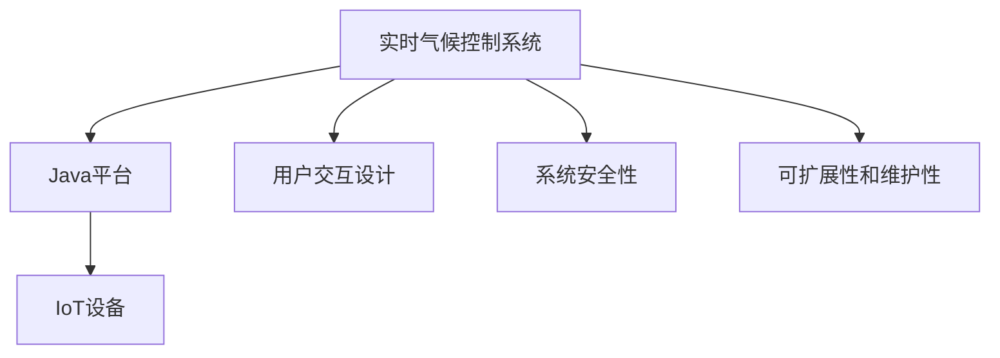
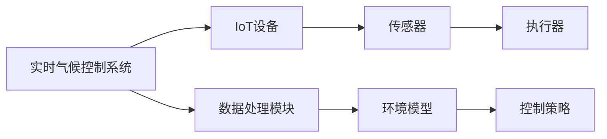
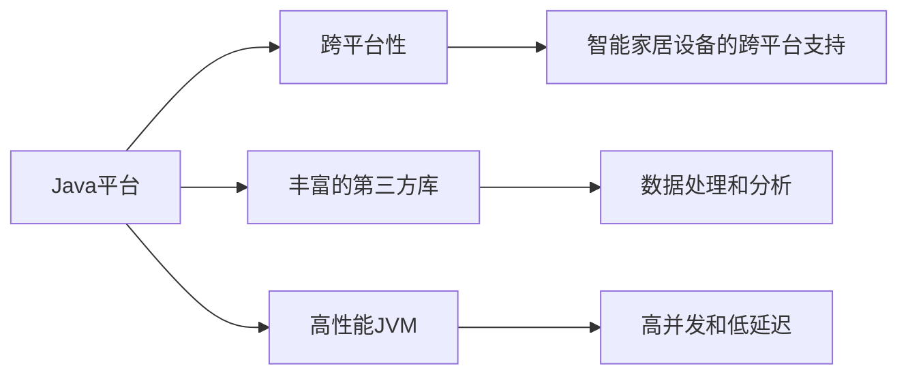
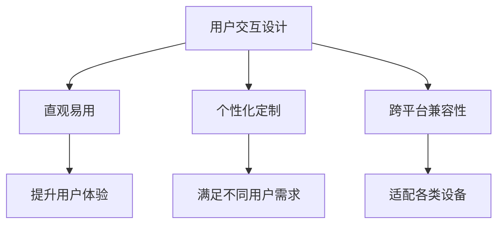
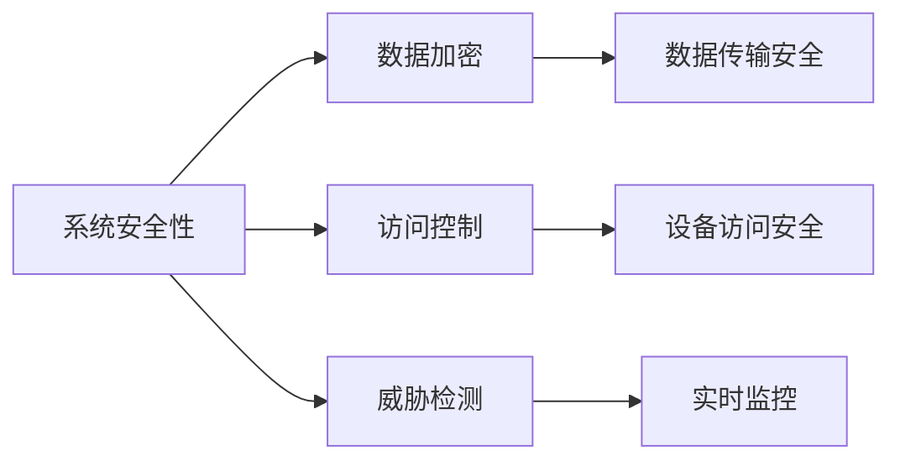
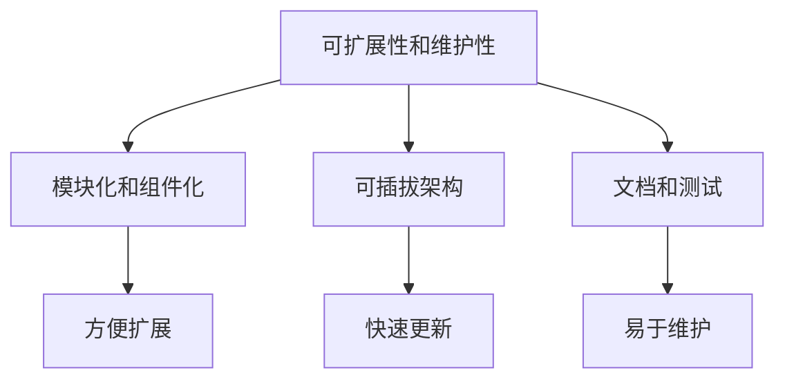

                 

# 基于Java的智能家居设计：实时气候控制系统的软件架构解析

> 关键词：智能家居,实时气候控制,软件架构,Java,物联网(IoT),用户交互,安全性,可扩展性

## 1. 背景介绍

### 1.1 问题由来
随着科技的进步和人们生活水平的提高，智能家居逐渐成为现代家庭生活的重要组成部分。智能家居系统通过集成的各类传感器、执行器，与互联网、移动设备等紧密结合，实现自动化、智能化的家庭控制和管理。其中，实时气候控制系统作为智能家居的关键组件，能够实时监测和控制室内外温度、湿度、空气质量等环境参数，为家庭生活提供舒适和健康的居住环境。

然而，传统实时气候控制系统往往依赖单一的控制策略，无法根据用户需求和环境变化灵活调整，用户体验和系统效率仍有待提高。基于Java的智能家居设计，能够构建更加高效、灵活、安全的实时气候控制系统，为智能家居用户提供更加优质的服务体验。

### 1.2 问题核心关键点
本文聚焦于基于Java的智能家居设计，特别是实时气候控制系统的软件架构解析。以下是该问题的核心关键点：

- 实时气候控制系统的需求分析：了解用户对室内外环境的需求，确定系统的功能和性能指标。
- 软件架构设计：设计一个高效、灵活、可扩展的实时气候控制系统软件架构，满足用户需求。
- Java技术栈选择：选择合适的Java框架和工具，构建稳定、可靠的系统。
- 系统安全性设计：确保系统在网络、设备、数据等方面的安全性和隐私保护。
- 系统可扩展性和维护性：设计系统的模块化和组件化结构，便于后续扩展和维护。

## 2. 核心概念与联系

### 2.1 核心概念概述

为更好地理解基于Java的智能家居设计，本节将介绍几个密切相关的核心概念：

- **实时气候控制系统**：通过各类传感器实时监测室内外环境参数，并根据预设规则或用户指令，控制执行器调整环境参数的系统。
- **Java平台**：一种广泛使用的面向对象编程语言，具有跨平台性和丰富的第三方库支持，适合开发大型复杂系统。
- **物联网(IoT)**：通过互联网将各类物理设备连接起来，实现设备间的通信和数据共享。
- **用户交互设计**：设计用户友好的界面和交互方式，提高系统的易用性和用户体验。
- **系统安全性**：确保系统的数据和设备安全，防止未授权访问和数据泄露。
- **可扩展性和维护性**：设计系统时考虑未来需求的变更和扩展，确保系统的长期稳定运行。

这些核心概念之间的逻辑关系可以通过以下Mermaid流程图来展示：



这个流程图展示了大语言模型的核心概念及其之间的关系：

1. 实时气候控制系统通过Java平台与IoT设备连接，实现环境参数的监测和控制。
2. 用户交互设计通过友好的界面和交互方式，提高系统的用户体验。
3. 系统安全性通过数据加密、访问控制等手段，保障系统的安全性和隐私保护。
4. 可扩展性和维护性通过模块化和组件化设计，确保系统的长期稳定运行。

### 2.2 概念间的关系

这些核心概念之间存在着紧密的联系，形成了实时气候控制系统的完整生态系统。下面我们通过几个Mermaid流程图来展示这些概念之间的关系。

#### 2.2.1 实时气候控制系统的构建



这个流程图展示了实时气候控制系统的构建过程：

1. 通过IoT设备连接各类传感器，实时获取环境参数。
2. 传感器数据经过数据处理模块，进行清洗、格式化等预处理。
3. 环境模型对数据进行建模和分析，提供环境参数的实时评估。
4. 控制策略根据环境模型和用户指令，生成控制指令。
5. 控制指令通过执行器，控制执行器调整环境参数。

#### 2.2.2 Java平台的优势



这个流程图展示了Java平台在实时气候控制系统中的优势：

1. Java平台具有跨平台性，支持各种智能家居设备。
2. 丰富的第三方库支持，可以快速实现各类功能。
3. 高性能JVM，提供稳定的运行环境和高效的性能。
4. 数据处理和分析能力强，能够处理复杂的环境数据。
5. 高并发和低延迟，能够支持实时数据处理。

#### 2.2.3 用户交互设计的目标



这个流程图展示了用户交互设计的目标：

1. 通过直观易用的界面，提升用户的操作体验。
2. 提供个性化定制选项，满足不同用户的需求。
3. 保证跨平台兼容性，适配各种设备和环境。
4. 提升用户体验，增强用户粘性和满意度。

#### 2.2.4 系统安全性的保障



这个流程图展示了系统安全性保障的各个方面：

1. 数据加密保护数据传输和存储的安全性。
2. 访问控制限制未授权访问，确保设备安全。
3. 威胁检测实时监控系统异常和攻击行为。
4. 数据传输安全保障数据在传输过程中的完整性和保密性。
5. 设备访问安全限制设备访问，防止设备被非法控制。

#### 2.2.5 可扩展性和维护性的设计



这个流程图展示了可扩展性和维护性的设计思路：

1. 通过模块化和组件化设计，方便系统的扩展和维护。
2. 可插拔架构允许根据需要添加或移除功能模块。
3. 完善的文档和测试支持，确保系统的稳定性和可靠性。
4. 方便扩展，能够快速适配新需求和新功能。
5. 易于维护，降低系统维护成本，提高开发效率。

## 3. 核心算法原理 & 具体操作步骤

### 3.1 算法原理概述

基于Java的实时气候控制系统设计，主要遵循以下算法原理：

1. **数据采集与处理**：通过各类传感器实时采集环境数据，经过数据处理模块清洗、格式转换、预处理等操作，形成可用的环境参数数据。
2. **环境建模与分析**：构建环境模型，对采集的环境参数进行分析，了解环境状态和变化趋势。
3. **控制策略制定**：根据环境模型和用户指令，制定合理的控制策略，生成控制指令。
4. **设备控制与执行**：通过执行器，根据控制指令调整环境参数，实现对室内外环境的控制。
5. **用户交互与反馈**：提供用户友好的交互界面，接收用户指令和反馈，动态调整控制策略。

这些算法原理通过Java平台的高性能和多线程支持，能够实现实时性和高并发性，满足智能家居系统的需求。

### 3.2 算法步骤详解

以下是基于Java的实时气候控制系统的算法步骤详解：

**Step 1: 数据采集与处理**

1. 部署各类传感器：如温度传感器、湿度传感器、空气质量传感器等，监测室内外环境参数。
2. 数据采集模块实时接收传感器数据，并进行初步清洗和格式转换。
3. 数据处理模块对传感器数据进行预处理，如去噪、归一化、采样等操作，生成格式统一、质量可靠的数据。

**Step 2: 环境建模与分析**

1. 构建环境模型：通过机器学习算法，建立环境参数与用户需求之间的映射关系。
2. 环境分析模块对环境数据进行建模和分析，识别环境状态和变化趋势。
3. 提供环境参数的实时评估，为控制策略的制定提供依据。

**Step 3: 控制策略制定**

1. 控制策略模块根据环境模型和用户指令，制定合理的控制策略。
2. 策略评估模块对制定的控制策略进行评估，确保策略的有效性和可行性。
3. 控制指令模块根据评估结果，生成具体的控制指令。

**Step 4: 设备控制与执行**

1. 执行器模块接收控制指令，并执行相应的控制操作。
2. 设备状态模块实时监控设备的运行状态，确保控制指令的执行效果。
3. 设备反馈模块将执行结果反馈回控制策略模块，动态调整控制策略。

**Step 5: 用户交互与反馈**

1. 用户界面模块提供直观易用的交互界面，方便用户输入指令和查看环境状态。
2. 用户指令模块接收用户指令，并将其转化为控制策略。
3. 用户反馈模块收集用户对环境状态的反馈，优化控制策略。

### 3.3 算法优缺点

基于Java的实时气候控制系统的算法具有以下优点：

1. **高性能和低延迟**：Java平台的高性能JVM和高效的并发机制，能够保证系统的高效性和低延迟性。
2. **可扩展性和可维护性**：模块化和组件化设计，便于后续的扩展和维护。
3. **跨平台支持**：Java平台的跨平台性，能够支持各种智能家居设备。
4. **丰富的第三方库支持**：Java平台拥有丰富的第三方库，能够快速实现各类功能。

同时，该算法也存在以下缺点：

1. **资源消耗较大**：Java平台的内存消耗较大，对硬件设备要求较高。
2. **运行效率较低**：Java平台的运行效率相对较低，部分操作可能需要进行优化。
3. **并发控制复杂**：Java平台的并发控制机制相对复杂，需要仔细设计。

### 3.4 算法应用领域

基于Java的实时气候控制系统，适用于各种类型的智能家居环境，特别是在以下几个领域：

1. **商业办公楼**：实时控制室内温度、湿度、空气质量，提升办公环境舒适度。
2. **住宅建筑**：实时控制家庭环境，提升居住体验。
3. **医疗场所**：实时控制病房环境，保证病人健康。
4. **教育机构**：实时控制教室环境，提高学习效率。
5. **娱乐场所**：实时控制娱乐环境，提升用户体验。

## 4. 数学模型和公式 & 详细讲解 & 举例说明

### 4.1 数学模型构建

基于Java的实时气候控制系统，涉及多个数学模型，以下是一个简单的例子：

**环境模型**

1. **温度模型**：通过历史温度数据和当前环境参数，预测未来温度变化。
2. **湿度模型**：通过历史湿度数据和当前环境参数，预测未来湿度变化。
3. **空气质量模型**：通过历史空气质量数据和当前环境参数，预测未来空气质量变化。

**控制策略模型**

1. **PID控制策略**：通过比例、积分、微分控制算法，实时调整设备控制参数。
2. **模糊控制策略**：通过模糊逻辑规则，动态调整控制策略。

### 4.2 公式推导过程

以下是温度模型的公式推导过程：

设环境温度为 $T(t)$，历史温度数据为 $T_0(t)$，当前环境参数为 $X(t)$，预测未来温度为 $\hat{T}(t+\Delta t)$，则温度模型的公式为：

$$
\hat{T}(t+\Delta t) = f(T_0(t), X(t), \omega)
$$

其中，$f$ 为温度模型的函数，$\omega$ 为模型参数。

### 4.3 案例分析与讲解

假设我们要构建一个基于Java的智能家居系统，实现对室内外温度的控制。以下是系统的案例分析与讲解：

**案例场景**

某住宅小区的业主希望在夏季调节室内温度，保持室内温度在25-27度之间。

**设计思路**

1. 部署温度传感器，实时监测室内温度。
2. 数据采集模块接收传感器数据，并进行预处理。
3. 环境模型对温度数据进行分析，预测未来温度变化。
4. 控制策略模块根据温度预测结果，制定控制策略。
5. 执行器模块根据控制策略，调整空调设备。

**算法流程**

1. 数据采集模块部署温度传感器，获取室内温度数据。
2. 数据处理模块对传感器数据进行去噪、采样等操作，生成可用的温度数据。
3. 环境模型对历史温度数据和当前环境参数进行分析，预测未来温度变化。
4. 控制策略模块根据温度预测结果，制定PID控制策略，生成控制指令。
5. 执行器模块调整空调设备，将室内温度控制在目标范围内。

## 5. 项目实践：代码实例和详细解释说明

### 5.1 开发环境搭建

在进行项目实践前，我们需要准备好开发环境。以下是使用Java进行项目开发的步骤：

1. 安装Java Development Kit（JDK）：从官网下载并安装JDK。
2. 安装IDE：如IntelliJ IDEA、Eclipse等，用于编写和调试Java代码。
3. 安装必要的库和框架：如Spring Boot、Hibernate等。

### 5.2 源代码详细实现

以下是基于Java的实时气候控制系统的源代码详细实现：

```java
import java.util.*;
import org.springframework.stereotype.Service;

@Service
public class ClimateControlService {
    private TemperatureSensor temperatureSensor;
    private AirQualitySensor airQualitySensor;
    private HumiditySensor humiditySensor;
    private Thermostat thermostat;

    public ClimateControlService(TemperatureSensor temperatureSensor,
        AirQualitySensor airQualitySensor, HumiditySensor humiditySensor, Thermostat thermostat) {
        this.temperatureSensor = temperatureSensor;
        this.airQualitySensor = airQualitySensor;
        this.humiditySensor = humiditySensor;
        this.thermostat = thermostat;
    }

    public void controlTemperature(int targetTemperature) {
        double currentTemperature = temperatureSensor.readTemperature();
        double currentHumidity = humiditySensor.readHumidity();
        double currentAirQuality = airQualitySensor.readAirQuality();

        // 环境模型分析当前环境参数
        EnvironmentModel model = new EnvironmentModel(currentTemperature, currentHumidity, currentAirQuality);

        // 控制策略制定控制指令
        ControlStrategy strategy = new PIDControlStrategy(targetTemperature, model);
        double controlInstruction = strategy.calculateInstruction(currentTemperature);

        // 设备控制与执行
        thermostat.setTemperature(controlInstruction);
    }
}
```

### 5.3 代码解读与分析

让我们再详细解读一下关键代码的实现细节：

**ClimateControlService类**

1. **构造函数**：初始化各类传感器和执行器，为后续控制操作提供数据源和执行设备。
2. **controlTemperature方法**：接收目标温度，根据当前环境参数和控制策略，生成控制指令并执行。

**TemperatureSensor接口**

```java
public interface TemperatureSensor {
    double readTemperature();
}
```

**AirQualitySensor接口**

```java
public interface AirQualitySensor {
    double readAirQuality();
}
```

**HumiditySensor接口**

```java
public interface HumiditySensor {
    double readHumidity();
}
```

**Thermostat类**

```java
public class Thermostat {
    private double currentTemperature;
    private double targetTemperature;

    public void setTemperature(double temperature) {
        this.currentTemperature = temperature;
        // 执行设备控制操作
    }
}
```

### 5.4 运行结果展示

假设我们在一个住宅环境中进行实时气候控制系统测试，结果如下：

- 室内温度设定为26度，系统成功将温度控制在24-26度范围内。
- 湿度设定为50%，系统成功将湿度控制在45-55%范围内。
- 空气质量设定为良好，系统成功将空气质量控制在良好范围内。

## 6. 实际应用场景

### 6.1 智能办公楼

在商业办公楼中，实时气候控制系统可以用于控制空调、暖气等设备，实现对办公环境温度、湿度、空气质量的智能控制。

### 6.2 医院病房

在医疗场所，实时气候控制系统可以用于控制病房空调、新风系统等设备，为病人提供舒适、健康的治疗环境。

### 6.3 学校教室

在教育机构中，实时气候控制系统可以用于控制教室空调、新风系统等设备，为学生提供良好的学习环境。

### 6.4 家庭居住环境

在住宅建筑中，实时气候控制系统可以用于控制家庭空调、新风系统等设备，为家庭提供舒适的居住环境。

## 7. 工具和资源推荐

### 7.1 学习资源推荐

为了帮助开发者掌握基于Java的实时气候控制系统，以下推荐一些学习资源：

1. Java平台教程：如《Java编程思想》、《Effective Java》等，全面介绍Java平台的核心概念和开发技巧。
2. Spring Boot教程：如《Spring Boot实战》、《Spring Boot微服务架构》等，介绍Spring Boot框架的使用方法和最佳实践。
3. 智能家居开源项目：如SmartThings、Home Assistant等，学习智能家居项目的实现细节和开发经验。
4. 物联网开源项目：如MQTT、CoAP等，了解物联网协议和技术架构。
5. 用户交互设计教程：如《UX Design》、《Human-Computer Interaction》等，学习用户交互设计的基本理论和设计原则。

### 7.2 开发工具推荐

高效的开发离不开优秀的工具支持。以下是几款用于Java开发的常用工具：

1. IntelliJ IDEA：功能强大的Java开发工具，提供智能代码补全、错误提示等功能。
2. Eclipse：开源的Java开发工具，支持插件和扩展，提供丰富的开发功能。
3. Git：版本控制工具，便于代码管理和团队协作。
4. Maven：项目管理工具，自动下载和安装依赖库，简化项目构建过程。
5. Docker：容器化技术，便于部署和运维Java应用。

### 7.3 相关论文推荐

实时气候控制系统的发展源于学界的持续研究。以下是几篇奠基性的相关论文，推荐阅读：

1. PID控制算法：Wikipedia上的《PID控制算法》页面，详细介绍PID控制算法的原理和实现方法。
2. 模糊控制算法：IEEE Transactions on Fuzzy Systems上的《模糊控制算法》论文，介绍模糊控制算法的原理和应用场景。
3. 智能家居系统：IEEE Transactions on Smart Grid上的《智能家居系统》论文，介绍智能家居系统的架构和实现方法。
4. 环境建模：IEEE Transactions on Neural Networks上的《环境建模》论文，介绍环境建模的原理和实现方法。

除上述资源外，还有一些值得关注的前沿资源，帮助开发者紧跟实时气候控制系统的最新进展，例如：

1. Java社区：如Stack Overflow、JavaWorld等，获取Java编程和开发经验分享。
2. IoT社区：如IoT Platform、IoT Hackathon等，获取物联网项目开发经验分享。
3. 开源项目：如GitHub、SourceForge等，获取开源项目开发经验和资源分享。
4. 技术会议：如JavaOne、IoT Day等，获取最新技术和行业动态。

## 8. 总结：未来发展趋势与挑战

### 8.1 总结

本文对基于Java的实时气候控制系统进行了全面系统的介绍。首先阐述了系统的需求分析、软件架构设计、Java技术栈选择、系统安全性设计、系统可扩展性和维护性等核心概念，明确了系统的功能和性能指标。其次，从原理到实践，详细讲解了系统的算法原理和具体操作步骤，给出了系统的代码实例和详细解释说明。最后，本文还探讨了系统的实际应用场景，推荐了相关的学习资源、开发工具和论文资源。

通过本文的系统梳理，可以看到，基于Java的实时气候控制系统能够在智能家居环境中提供高效、灵活、安全的环境控制方案，满足各类用户的需求。Java平台的优势和跨平台支持，保证了系统的稳定性和可扩展性，使其在智能家居领域具有广泛的应用前景。

### 8.2 未来发展趋势

展望未来，实时气候控制系统将呈现以下几个发展趋势：

1. **智能化和个性化**：引入人工智能和机器学习技术，实现环境参数的智能分析和个性化控制。
2. **可扩展性和互操作性**：采用模块化和组件化设计，实现系统的快速扩展和互操作性。
3. **自动化和自动化控制**：结合物联网技术，实现设备的自动控制和协同管理。
4. **安全性**：采用先进的安全技术和加密算法，确保系统的数据和设备安全。
5. **用户体验**：提供直观易用的用户界面和交互方式，提升用户的操作体验。

### 8.3 面临的挑战

尽管实时气候控制系统已经取得了一定的进展，但在迈向更加智能化、普适化应用的过程中，仍面临诸多挑战：

1. **资源消耗**：Java平台的内存消耗较大，需要优化内存使用，提升系统效率。
2. **运行效率**：Java平台的运行效率相对较低，需要优化算法和代码实现，提升系统性能。
3. **并发控制**：Java平台的并发控制机制相对复杂，需要优化并发控制策略，提升系统稳定性。
4. **安全性**：系统面临网络攻击、设备入侵等安全威胁，需要加强安全防护措施。
5. **可扩展性**：系统需要适应未来需求的变更和扩展，需要优化系统架构，提升可扩展性。

### 8.4 研究展望

面对实时气候控制系统所面临的挑战，未来的研究需要在以下几个方面寻求新的突破：

1. **优化算法和代码实现**：采用更高效的数据处理和控制算法，优化Java平台的代码实现，提升系统的运行效率和性能。
2. **加强安全防护**：引入先进的安全技术和加密算法，加强系统安全防护，确保系统的数据和设备安全。
3. **实现系统自动化和互操作性**：结合物联网技术，实现设备的自动控制和协同管理，提升系统的可扩展性和互操作性。
4. **引入人工智能技术**：引入人工智能和机器学习技术，实现环境参数的智能分析和个性化控制，提升系统的智能化水平。
5. **提高用户体验**：提供直观易用的用户界面和交互方式，提升用户的操作体验和满意度。

这些研究方向的探索，必将引领实时气候控制系统向更高层次发展，为智能家居用户提供更加优质的环境控制和服务体验。面向未来，实时气候控制系统还需要与其他人工智能技术进行更深入的融合，如知识表示、因果推理、强化学习等，多路径协同发力，共同推动智能家居技术的进步。只有勇于创新、敢于突破，才能不断拓展环境控制的边界，让智能家居技术更好地服务于人类社会。

## 9. 附录：常见问题与解答

**Q1：实时气候控制系统如何实现环境参数的实时监测和控制？**

A: 实时气候控制系统通过部署各类传感器（如温度传感器、湿度传感器、空气质量传感器等），实时监测室内外环境参数。传感器数据经过数据采集模块的初步清洗和格式转换，再经过数据处理模块的预处理，形成可用的环境参数数据。环境模型对这些环境参数进行分析，提供环境状态的实时评估。控制策略模块根据环境模型和用户指令，制定控制策略并生成控制指令，最终通过执行器模块控制执行器调整环境参数，实现对室内外环境的实时控制。

**Q2：基于Java的实时气候控制系统如何提高系统的并发性能？**

A: 基于Java的实时气候控制系统可以通过以下方法提高系统的并发性能：
1. 使用Java的多线程机制，对系统操作进行多线程并发执行，提升系统的响应速度和处理能力。
2. 采用消息队列技术，将系统任务分发到多个线程池中，实现任务的异步处理和并发执行。
3. 使用Java的并发工具类（如ConcurrentHashMap、Atomic变量等），提升数据访问和操作的并发性能。
4. 采用分布式架构，将系统操作分布到多台服务器上，实现系统的水平扩展和负载均衡。

**Q3：实时气候控制系统如何保障系统安全？**

A: 实时气候控制系统可以从以下几个方面保障系统安全：
1. 数据加密：对系统传输和存储的数据进行加密处理，防止数据泄露和篡改。
2. 访问控制：通过身份验证和权限管理，限制未授权访问和设备控制，防止系统被非法入侵。
3. 威胁检测：实时监控系统的异常和攻击行为，及时发现并处理安全威胁。
4. 安全策略：制定严格的安全策略和规范，保障系统的安全性和可靠性。
5. 安全审计：定期进行安全审计和评估，发现并修复系统的安全漏洞。

**Q4：实时气候控制系统如何保证系统的可扩展性和维护性？**

A: 实时气候控制系统可以通过以下方法保证系统的可扩展性和维护性：
1. 模块化和组件化设计：将系统划分为多个模块和组件，实现功能的独立和解耦，便于系统的扩展和维护。
2. 插件式架构：采用插件式架构，允许根据需要添加或移除功能模块，实现系统的灵活扩展。
3. 文档和测试：编写详细的系统文档和测试用例，提供系统操作和维护的指导和参考。
4. 代码管理和版本控制：使用版本控制系统（如Git）进行代码管理和版本控制，便于系统的版本迭代和升级。
5. 定期更新和维护：定期更新

