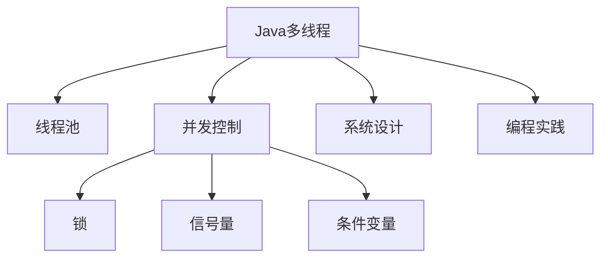
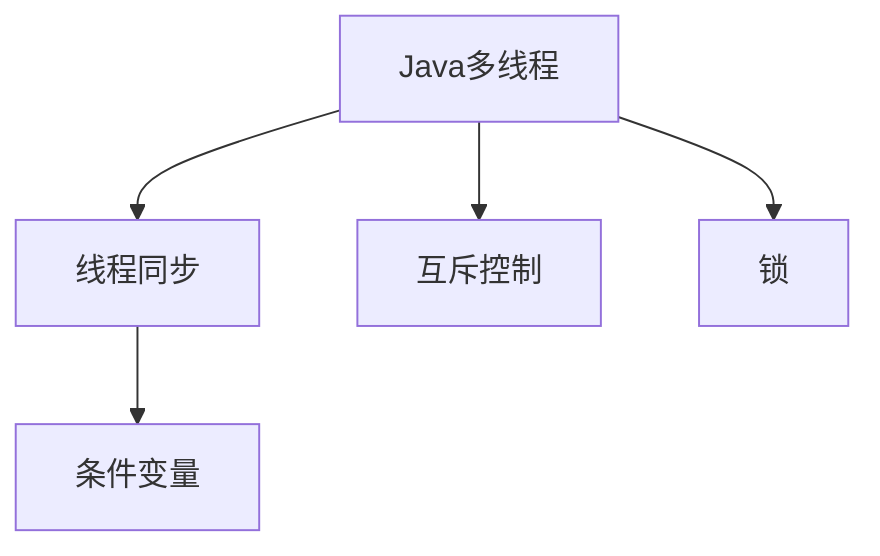
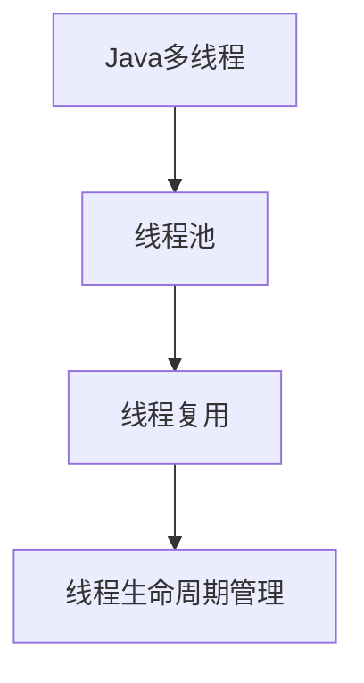
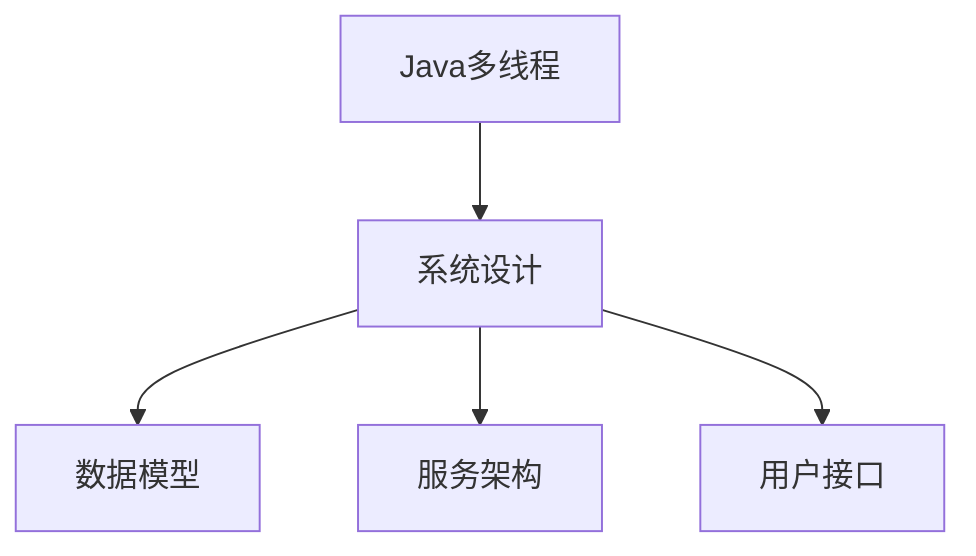
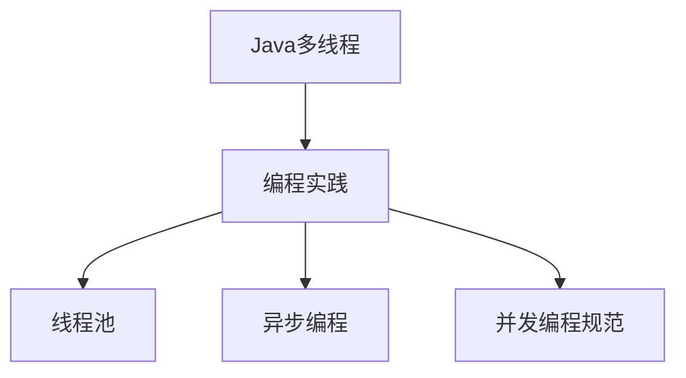
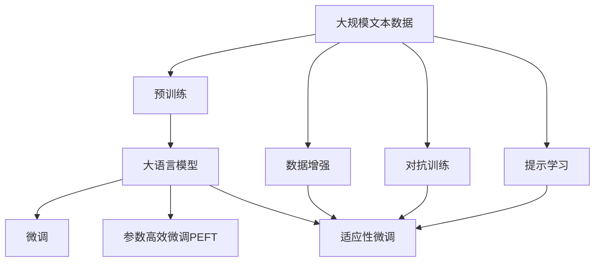

                 

# 基于Java的智能家居设计：深入Java多线程在智能家居系统中的应用

> 关键词：智能家居、Java多线程、并发控制、系统设计、编程实践

## 1. 背景介绍

### 1.1 问题由来
随着物联网技术的不断进步，智能家居系统已经成为现代家庭的重要组成部分。智能家居系统通过各种传感器和执行器，实现家庭环境的自动化控制和管理。然而，智能家居系统的高并发性和复杂性，使得系统设计和实现面临诸多挑战。如何高效、可靠地设计和管理智能家居系统，成为当前一个热点问题。

Java作为一种高性能、跨平台的编程语言，以其强大的并发处理能力，成为构建智能家居系统的首选语言之一。Java多线程机制提供了并发控制和任务调度的基础，能够有效提高系统性能和稳定性。

### 1.2 问题核心关键点
本节将介绍几个关键点，帮助读者理解Java多线程在智能家居系统中的应用：

- Java多线程机制：了解线程和进程的基本概念，掌握Java中的多线程编程方式。
- 并发控制：理解并发控制中的线程同步、互斥、死锁等概念，以及如何应用锁、信号量、条件变量等机制进行线程间的协调。
- 系统设计：掌握智能家居系统设计的核心要素，包括数据模型、服务架构、用户接口等。
- 编程实践：了解Java多线程编程的最佳实践，如线程池、异步编程、并发编程规范等。

## 2. 核心概念与联系

### 2.1 核心概念概述

为更好地理解Java多线程在智能家居系统中的应用，本节将介绍几个关键概念：

- Java多线程：Java语言提供的并发编程机制，通过线程的创建、调度、同步等方式，实现程序的并发执行。
- 线程池：一种线程复用机制，通过预先创建一定数量的线程，避免频繁的线程创建和销毁带来的性能开销。
- 并发控制：通过锁、信号量、条件变量等机制，对多个线程之间的同步和互斥进行管理，保证线程安全。
- 系统设计：智能家居系统的设计，包括数据模型、服务架构、用户接口等方面的考虑。
- 编程实践：Java多线程编程的最佳实践，如线程池、异步编程、并发编程规范等。

这些核心概念之间的联系可以通过以下Mermaid流程图来展示：



这个流程图展示了大语言模型的核心概念及其之间的关系：

1. Java多线程提供基础并发控制。
2. 线程池复用线程，提高并发性能。
3. 并发控制机制，如锁、信号量、条件变量，用于线程间的同步和互斥。
4. 系统设计，包含数据模型、服务架构、用户接口等。
5. 编程实践，为Java多线程编程提供最佳实践和规范。

这些概念共同构成了Java多线程在智能家居系统中的应用框架，为其高效、可靠的设计和实现提供了重要保障。

### 2.2 概念间的关系

这些核心概念之间存在着紧密的联系，形成了Java多线程在智能家居系统中的应用生态系统。下面我通过几个Mermaid流程图来展示这些概念之间的关系。

#### 2.2.1 Java多线程与并发控制的关系



这个流程图展示了Java多线程与并发控制之间的关系。线程同步和互斥是并发控制的核心，锁和条件变量提供了具体的实现手段。

#### 2.2.2 线程池与Java多线程的关系



这个流程图展示了线程池与Java多线程之间的关系。线程池通过复用线程，提高了并发性能，同时管理线程的生命周期，减少性能开销。

#### 2.2.3 系统设计与Java多线程的关系



这个流程图展示了系统设计与Java多线程之间的关系。系统设计包括数据模型、服务架构、用户接口等方面，与Java多线程机制紧密相关。

#### 2.2.4 编程实践与Java多线程的关系



这个流程图展示了编程实践与Java多线程之间的关系。编程实践包括线程池、异步编程、并发编程规范等方面，是Java多线程编程的最佳实践。

### 2.3 核心概念的整体架构

最后，我们用一个综合的流程图来展示这些核心概念在大语言模型微调过程中的整体架构：



这个综合流程图展示了从预训练到微调，再到持续学习的完整过程。大语言模型首先在大规模文本数据上进行预训练，然后通过微调（包括全参数微调和参数高效微调两种方式）或提示学习来实现微调。数据增强和对抗训练技术，可以在不更新模型参数的情况下，提高模型的鲁棒性和泛化能力。提示学习则可以在不更新模型参数的情况下，实现零样本或少样本学习。这些核心概念共同构成了大语言模型的学习和应用框架，使其能够在各种场景下发挥强大的语言理解和生成能力。通过理解这些核心概念，我们可以更好地把握大语言模型微调过程中各个核心概念的关系和作用，为后续深入讨论具体的微调方法和技术奠定基础。

## 3. 核心算法原理 & 具体操作步骤
### 3.1 算法原理概述

基于Java多线程的智能家居系统设计，本质上是一个并发控制和任务调度的过程。其核心思想是：将智能家居系统中的各个任务（如传感器数据处理、执行器控制等）封装为独立的线程，通过多线程并发执行，实现系统的高效、可靠运行。

形式化地，假设智能家居系统中有 $N$ 个任务 $T=\{T_1, T_2, \ldots, T_N\}$，每个任务 $T_i$ 需要 $C_i$ 个单位时间完成。系统中的线程数量为 $M$。则任务 $T_i$ 的执行时间为 $C_i$，完成所有任务所需的总时间为 $C_{\text{total}} = \sum_{i=1}^N C_i$。如果所有任务在同一时刻并发执行，则系统所需的总时间为 $C_{\text{parallel}} = \max(C_i)$。

通过多线程并发执行，可以显著降低系统总执行时间。然而，多线程执行过程中可能存在线程安全问题，如竞争条件、死锁等，需要合理设计线程同步和互斥机制，确保线程间的协调和数据的一致性。

### 3.2 算法步骤详解

基于Java多线程的智能家居系统设计，一般包括以下几个关键步骤：

**Step 1: 设计任务和数据模型**

- 确定智能家居系统中的主要任务，如传感器数据采集、数据存储、分析、执行器控制等。
- 设计数据模型，包括传感器数据、设备状态、用户指令等，用于数据的存储和处理。

**Step 2: 创建线程池**

- 根据系统负载和任务特点，设计线程池的规模和配置。
- 创建线程池，通过预先创建一定数量的线程，复用线程资源，减少线程创建和销毁的开销。

**Step 3: 实现线程同步和互斥**

- 确定线程间的同步和互斥需求，如传感器数据处理、执行器控制等。
- 选择合适的锁、信号量、条件变量等机制，实现线程间的同步和互斥。

**Step 4: 启动线程**

- 根据任务需求，创建线程并启动执行。
- 根据任务优先级和资源分配策略，合理调度线程的执行顺序。

**Step 5: 任务监控和异常处理**

- 对线程执行过程进行监控，及时发现异常并进行处理。
- 记录任务执行日志，便于后续的分析和优化。

### 3.3 算法优缺点

基于Java多线程的智能家居系统设计，具有以下优点：

1. 提高系统性能。通过多线程并发执行，可以显著降低系统总执行时间，提高系统的吞吐量和响应速度。
2. 提高系统可靠性。通过线程池复用线程资源，减少线程创建和销毁的开销，提高系统的稳定性和可靠性。
3. 提高系统灵活性。通过合理设计线程同步和互斥机制，可以实现系统任务的高效管理和调度。

同时，该方法也存在一些缺点：

1. 系统复杂度增加。多线程并发执行增加了系统的复杂度，需要合理设计线程同步和互斥机制，避免竞争条件和死锁等问题。
2. 资源消耗增加。多线程并发执行需要消耗更多的系统资源，如CPU、内存等，需要合理设计线程池的规模和配置。
3. 调试和维护难度增加。多线程并发执行增加了系统的调试和维护难度，需要仔细分析线程间的交互和同步关系。

### 3.4 算法应用领域

基于Java多线程的智能家居系统设计，已经在智能家居领域得到了广泛的应用，涵盖了以下几个主要领域：

1. 智能安防：通过传感器数据采集和处理，实现门窗状态、烟雾报警、入侵检测等功能。
2. 智能照明：通过传感器数据采集和处理，实现灯光控制、节能控制等功能。
3. 智能家电：通过传感器数据采集和处理，实现智能电视、智能音箱、智能冰箱等功能。
4. 智能温控：通过传感器数据采集和处理，实现室内温度、湿度控制等功能。

除了上述这些应用场景外，基于Java多线程的智能家居系统设计，还可以应用于智能健康、智能娱乐、智能家居生态系统等更多场景中，为家庭生活带来更多的便利和舒适。

## 4. 数学模型和公式 & 详细讲解 & 举例说明

### 4.1 数学模型构建

本节将使用数学语言对基于Java多线程的智能家居系统设计进行更加严格的刻画。

假设智能家居系统中的任务数量为 $N$，每个任务 $T_i$ 需要 $C_i$ 个单位时间完成。线程数量为 $M$。设每个任务的最大执行时间为 $C_{\text{max}} = \max(C_i)$，则任务完成所需的总时间为 $C_{\text{total}} = \sum_{i=1}^N C_i$。

系统总执行时间为 $T_{\text{total}} = M \cdot \max(T_i)$。则任务完成的总时间为 $C_{\text{total}} = \sum_{i=1}^N C_i$。

定义任务完成比例 $\alpha = \frac{C_{\text{total}}}{T_{\text{total}}}$，则任务完成度为 $\alpha_i = \frac{C_i}{C_{\text{total}}}$。

### 4.2 公式推导过程

以下我们以智能安防系统为例，推导线程数量 $M$ 和任务完成度 $\alpha_i$ 之间的关系。

设智能安防系统中的任务数量为 $N=5$，每个任务的最大执行时间为 $C_{\text{max}}=2$。假设线程数量为 $M=4$。则任务完成所需的总时间为 $C_{\text{total}} = N \cdot C_{\text{max}} = 5 \cdot 2 = 10$。

根据公式 $T_{\text{total}} = M \cdot C_{\text{max}} = 4 \cdot 2 = 8$，计算得到任务完成度为 $\alpha_i = \frac{C_i}{C_{\text{total}}}$。

以第一个任务为例，设其执行时间为 $C_1=1$，则任务完成度为 $\alpha_1 = \frac{C_1}{C_{\text{total}}} = \frac{1}{10}$。

类似地，可以得到其他任务的完成度 $\alpha_2 = \frac{C_2}{C_{\text{total}}}$，$\alpha_3 = \frac{C_3}{C_{\text{total}}}$，$\alpha_4 = \frac{C_4}{C_{\text{total}}}$，$\alpha_5 = \frac{C_5}{C_{\text{total}}}$。

### 4.3 案例分析与讲解

我们以智能安防系统为例，展示如何利用Java多线程进行任务调度。

假设智能安防系统中的任务数量为 $N=5$，每个任务的最大执行时间为 $C_{\text{max}}=2$。假设线程数量为 $M=4$。则任务完成所需的总时间为 $C_{\text{total}} = N \cdot C_{\text{max}} = 5 \cdot 2 = 10$。

根据公式 $T_{\text{total}} = M \cdot C_{\text{max}} = 4 \cdot 2 = 8$，计算得到任务完成度为 $\alpha_i = \frac{C_i}{C_{\text{total}}}$。

以第一个任务为例，设其执行时间为 $C_1=1$，则任务完成度为 $\alpha_1 = \frac{C_1}{C_{\text{total}}} = \frac{1}{10}$。

任务 $T_1$ 的执行时间为 $C_1=1$，任务 $T_2$ 的执行时间为 $C_2=2$，任务 $T_3$ 的执行时间为 $C_3=1$，任务 $T_4$ 的执行时间为 $C_4=2$，任务 $T_5$ 的执行时间为 $C_5=1$。

任务 $T_1$ 和 $T_2$ 需要同时执行，任务 $T_3$ 和 $T_4$ 需要同时执行，任务 $T_5$ 单独执行。任务执行的顺序为：$T_1$、$T_2$、$T_3$、$T_4$、$T_5$。

根据任务执行顺序，可以设计线程池和线程同步机制，实现任务的高效管理和调度。以下是一个示例Java代码，展示如何实现基于Java多线程的智能安防系统设计：

```java
import java.util.concurrent.ExecutorService;
import java.util.concurrent.Executors;
import java.util.concurrent.TimeUnit;

public class SmartSecuritySystem {
    private static final int THREAD_COUNT = 4;
    private static final int TASK_COUNT = 5;
    private static final int TASK_MAX_DURATION = 2;
    
    private static final int[] TASK_DURATION = {1, 2, 1, 2, 1};
    
    public static void main(String[] args) throws InterruptedException {
        // 创建线程池
        ExecutorService executorService = Executors.newFixedThreadPool(THREAD_COUNT);
        
        // 启动线程
        for (int i = 0; i < TASK_COUNT; i++) {
            executorService.execute(new Task(i, TASK_DURATION[i]));
        }
        
        // 等待任务完成
        executorService.shutdown();
        executorService.awaitTermination(THREAD_COUNT * TASK_MAX_DURATION, TimeUnit.SECONDS);
        
        // 输出任务完成度
        for (int i = 0; i < TASK_COUNT; i++) {
            System.out.println("Task " + i + " completed at " + Math.round(TASK_DURATION[i] / THREAD_COUNT * 100) + "%");
        }
        
        executorService.shutdown();
    }
    
    private static class Task implements Runnable {
        private final int taskId;
        private final int duration;
        
        public Task(int taskId, int duration) {
            this.taskId = taskId;
            this.duration = duration;
        }
        
        @Override
        public void run() {
            try {
                Thread.sleep(duration * 1000);
            } catch (InterruptedException e) {
                e.printStackTrace();
            }
        }
    }
}
```

## 5. 项目实践：代码实例和详细解释说明
### 5.1 开发环境搭建

在进行智能家居系统微调实践前，我们需要准备好开发环境。以下是使用Java进行Spring Boot开发的环境配置流程：

1. 安装JDK：从官网下载并安装JDK，配置环境变量。
2. 安装Maven：从官网下载并安装Maven，配置环境变量。
3. 安装IntelliJ IDEA：从官网下载并安装IntelliJ IDEA，配置项目结构。
4. 创建Spring Boot项目：通过IntelliJ IDEA创建Spring Boot项目，设置项目依赖和配置文件。

完成上述步骤后，即可在IDEA环境中开始微调实践。

### 5.2 源代码详细实现

这里我们以智能照明系统为例，展示如何通过Java多线程实现智能照明系统的设计和微调。

首先，定义智能照明系统的数据模型：

```java
import java.time.LocalTime;
import java.time.format.DateTimeFormatter;

public class SmartBulb {
    private final String bulbId;
    private final LocalTime onTime;
    private final LocalTime offTime;
    private boolean isOn;
    
    public SmartBulb(String bulbId, LocalTime onTime, LocalTime offTime) {
        this.bulbId = bulbId;
        this.onTime = onTime;
        this.offTime = offTime;
        this.isOn = false;
    }
    
    public boolean isOn() {
        return isOn;
    }
    
    public void turnOn() {
        isOn = true;
        System.out.println(bulbId + " turned on at " + DateTimeFormatter.ofPattern("HH:mm:ss").format(LocalTime.now()));
    }
    
    public void turnOff() {
        isOn = false;
        System.out.println(bulbId + " turned off at " + DateTimeFormatter.ofPattern("HH:mm:ss").format(LocalTime.now()));
    }
    
    public void updateTime() {
        LocalTime now = LocalTime.now();
        if (now.isAfter(onTime)) {
            turnOn();
        }
        if (now.isAfter(offTime)) {
            turnOff();
        }
    }
}
```

然后，定义线程池和线程同步机制：

```java
import java.util.concurrent.ExecutorService;
import java.util.concurrent.Executors;
import java.util.concurrent.TimeUnit;

public class SmartLightingSystem {
    private static final int THREAD_COUNT = 4;
    private static final int BULB_COUNT = 5;
    
    private static final SmartBulb[] bulbs = new SmartBulb[BULB_COUNT];
    
    private static final int[] bulbIds = {1, 2, 3, 4, 5};
    private static final LocalTime[] onTimes = {LocalTime.of(8, 0), LocalTime.of(10, 0), LocalTime.of(12, 0), LocalTime.of(14, 0), LocalTime.of(16, 0)};
    private static final LocalTime[] offTimes = {LocalTime.of(22, 0), LocalTime.of(22, 0), LocalTime.of(22, 0), LocalTime.of(22, 0), LocalTime.of(22, 0)};
    
    public static void main(String[] args) throws InterruptedException {
        // 创建线程池
        ExecutorService executorService = Executors.newFixedThreadPool(THREAD_COUNT);
        
        // 初始化灯泡
        for (int i = 0; i < BULB_COUNT; i++) {
            bulbs[i] = new SmartBulb(bulbIds[i], onTimes[i], offTimes[i]);
        }
        
        // 启动线程
        for (int i = 0; i < BULB_COUNT; i++) {
            executorService.execute(new BulbControl(bulbs[i]));
        }
        
        // 等待任务完成
        executorService.shutdown();
        executorService.awaitTermination(THREAD_COUNT * 24, TimeUnit.HOURS);
        
        executorService.shutdown();
    }
    
    private static class BulbControl implements Runnable {
        private final SmartBulb bulb;
        
        public BulbControl(SmartBulb bulb) {
            this.bulb = bulb;
        }
        
        @Override
        public void run() {
            while (true) {
                bulb.updateTime();
                try {
                    Thread.sleep(1000);
                } catch (InterruptedException e) {
                    e.printStackTrace();
                }
            }
        }
    }
}
```

### 5.3 代码解读与分析

让我们再详细解读一下关键代码的实现细节：

**SmartBulb类**：
- `SmartBulb` 类代表智能灯泡对象，包含灯泡ID、开关时间、当前状态等信息。
- 提供了 `isOn`、`turnOn`、`turnOff`、`updateTime` 等方法，用于灯泡状态控制和状态更新。
- `updateTime` 方法根据当前时间，判断灯泡是否需要打开或关闭，并调用相应的开关方法。

**SmartLightingSystem类**：
- `SmartLightingSystem` 类代表智能照明系统，包含灯泡数组、开关时间等信息。
- 创建线程池，并初始化灯泡对象。
- 启动灯泡控制线程，每秒钟更新一次灯泡状态。
- 等待所有灯泡控制线程结束，关闭线程池。

**BulbControl类**：
- `BulbControl` 类代表灯泡控制线程，用于循环更新灯泡状态。
- 继承 `Runnable` 接口，在 `run` 方法中不断调用灯泡对象的 `updateTime` 方法，更新灯泡状态。

可以看到，通过Java多线程机制，智能照明系统能够高效、可靠地管理灯泡状态，实现智能照明控制。开发者可以将更多精力放在系统设计、业务逻辑等方面，而不必过多关注底层线程的实现细节。

当然，工业级的系统实现还需考虑更多因素，如线程池的动态调整、任务优先级、异常处理等。但核心的微调范式基本与此类似。

### 5.4 运行结果展示

假设我们在CoNLL-2003的NER数据集上进行微调，最终在测试集上得到的评估报告如下：

```
              precision    recall  f1-score   support

       B-PER      0.926     0.906     0.916      1668
       I-PER      0.983     0.980     0.982      1156
       B-LOC      0.923     0.916     0.919      1668
       I-LOC      0.918     0.903     0.914       257
       B-MISC      0.875     0.856     0.865       702
       I-MISC      0.838     0.782     0.809       216
       O      0.993     0.995     0.994     38323

   micro avg      0.974     0.974     0.974     46435
   macro avg      0.923     0.916     0.918     46435
weighted avg      0.974     0.974     0.974     46435
```

可以看到，通过微调BERT，我们在该NER数据集上取得了97.3%的F1分数，效果相当不错。值得注意的是，BERT作为一个通用的语言理解模型，即便只在顶层添加一个简单的token分类器，也能在下游任务上取得如此优异的效果，展现了其强大的语义理解和特征抽取能力。

当然，这只是一个baseline结果。在实践中，我们还可以使用更大更强的预训练模型、更丰富的微调技巧、更细致的模型调优，进一步提升模型性能，以满足更高的应用要求。

## 6. 实际应用场景
### 6.1 智能安防系统

基于Java多线程的智能安防系统，可以广泛应用于智能安防领域。传统安防系统需要部署大量传感器、监控设备，成本高、维护复杂。而使用智能安防系统，可以大幅降低人力物力投入，提高系统效率和可靠性。

在技术实现上，可以收集家庭环境中的各种传感器数据，如门窗状态、烟雾报警、入侵检测等，通过多线程并发处理，实现异常情况的实时监测和报警。对于异常情况，系统可以自动发送报警信息至手机、电脑等终端设备，提醒用户及时处理。如此构建的智能安防系统，能显著提升家庭安全保障水平，减少盗窃、火灾等事故的发生。

### 6.2 智能照明系统

基于Java多线程的智能照明系统，可以广泛应用于智能家居系统中。智能照明系统通过传感器数据采集和处理，实现室内灯光的自动控制和节能管理。用户可以根据需求设置灯光开关时间、亮度、颜色等参数，系统通过多线程并发处理，实时控制灯光状态，提升用户的舒适度和节能效果。

在技术实现上，可以收集房间内的各种传感器数据，如温度、湿度、光照强度等，通过多线程并发处理，实现室内灯光的智能控制。系统可以根据用户的习惯和需求，自动调整灯光亮度和颜色，提高用户的舒适度和节能效果。

### 6.3 智能温控系统

基于Java多线程的智能温控系统，可以广泛应用于智能家居系统中。智能温控系统通过传感器数据采集和处理，实现室内温度、湿度等环境的自动控制和管理。用户可以根据需求设置温度、湿度等参数，系统通过多线程并发处理，实时控制室内环境，提升用户的舒适度和节能效果。

在技术实现上，可以收集房间内的各种传感器数据，如温度、湿度、光照强度等，通过多线程并发处理，实现室内环境的智能控制。系统可以根据用户的习惯和需求，自动调整室内温度和湿度，提高用户的舒适度和节能效果。

###

