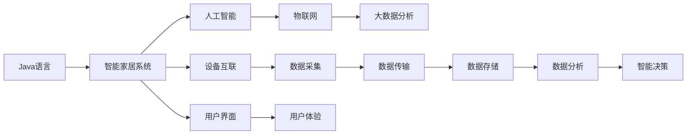
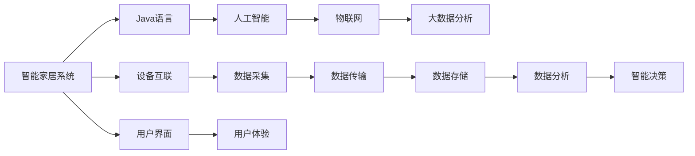
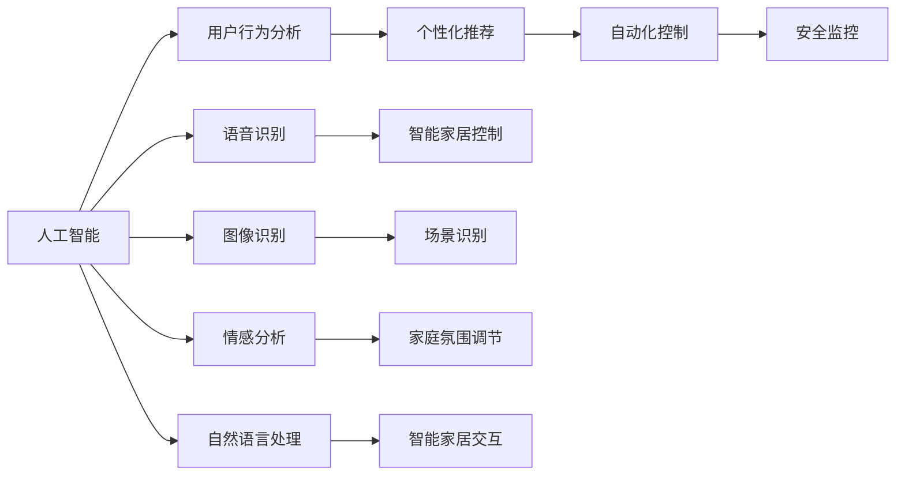
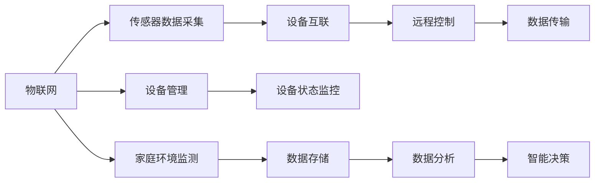
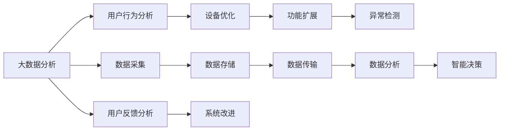

                 

# 基于Java的智能家居设计：结合Java与AI打造下一代智能家居解决方案

> 关键词：智能家居,Java,人工智能,家庭自动化,物联网(IoT),大数据分析

## 1. 背景介绍

### 1.1 问题由来
随着互联网和物联网技术的迅猛发展，智能家居已经成为现代家庭生活的重要组成部分。通过将智能设备与互联网连接，智能家居系统能够实现远程控制、自动化管理、安全监控等功能，极大地提升了人们的生活便利性和舒适性。

然而，现有的智能家居系统普遍存在以下问题：
- **复杂度**：设备种类繁多，集成困难，用户需要花费大量时间和精力来管理不同的系统。
- **功能单一**：多数智能家居设备功能有限，难以满足多样化的用户需求。
- **安全性**：缺乏完善的加密和认证机制，存在信息泄露和安全漏洞的风险。
- **用户体验**：设备之间的通信协议不统一，用户界面设计不佳，用户体验有待提升。

针对这些问题，我们需要一种新型的智能家居解决方案，能够通过统一的技术平台和接口，实现设备的无缝集成和功能扩展，同时保证数据安全和用户界面友好。

### 1.2 问题核心关键点
为了解决上述问题，本文聚焦于基于Java的智能家居设计，利用Java语言的高效性和可移植性，结合人工智能技术，打造下一代智能家居解决方案。

核心关键点包括：
- 利用Java的跨平台特性，实现设备之间的无缝集成。
- 采用AI技术，提升智能家居系统的智能化水平，实现自动化控制、个性化推荐等功能。
- 设计统一的数据接口和用户界面，提高系统的可扩展性和用户体验。
- 引入大数据分析，挖掘用户行为数据，优化家居环境。

这些关键点共同构成了基于Java的智能家居设计的整体框架，旨在为用户提供更便捷、更智能、更安全的家居生活。

### 1.3 问题研究意义
实现基于Java的智能家居设计，对于智能家居技术的发展具有重要意义：

1. **提升用户体验**：通过统一的接口和界面，用户可以方便地控制和管理不同品牌的智能设备，提高生活便利性。
2. **增强安全性**：通过AI技术，可以实现更高效的加密和认证机制，保护用户隐私和数据安全。
3. **提升系统性能**：Java的高效性保证了系统的高并发和稳定性，能够处理大规模设备和数据。
4. **推动技术创新**：结合AI和大数据技术，智能家居系统可以提供更个性化的服务和更丰富的功能。
5. **促进产业升级**：统一的智能家居平台可以促进家居设备的标准化和通用化，加速传统家居行业的数字化转型。

## 2. 核心概念与联系

### 2.1 核心概念概述

为了更好地理解基于Java的智能家居设计，本节将介绍几个密切相关的核心概念：

- **Java语言**：一种高性能、面向对象的编程语言，广泛应用于企业级软件开发。Java的高效性、可移植性和跨平台特性使其成为构建智能家居系统的理想选择。
- **智能家居系统**：利用传感器、控制器、网络通信等技术，实现对家居环境的自动化控制和智能化管理的系统。智能家居系统通过互联网和物联网技术实现设备的互联互通。
- **人工智能(AI)**：一种通过模拟人类智能行为，实现数据处理、决策分析等任务的计算机技术。AI在智能家居中可以用于自动化控制、个性化推荐、行为分析等。
- **物联网(IoT)**：通过互联网技术，将各种物品连接起来，实现数据的采集、传输和处理。IoT技术是智能家居系统的核心支撑。
- **大数据分析**：通过收集、存储和分析大规模数据，挖掘数据背后的模式和趋势，优化智能家居系统功能。

这些核心概念之间的逻辑关系可以通过以下Mermaid流程图来展示：



这个流程图展示了大语言模型微调过程中各个核心概念之间的关系：

1. Java语言提供系统开发的编程基础。
2. 智能家居系统通过Java实现设备互联和数据传输。
3. 人工智能技术提升系统的智能化水平。
4. 物联网技术实现设备的互联互通。
5. 大数据分析用于挖掘用户行为数据，优化系统功能。

### 2.2 概念间的关系

这些核心概念之间存在着紧密的联系，形成了智能家居系统的完整生态系统。下面我们通过几个Mermaid流程图来展示这些概念之间的关系。

#### 2.2.1 智能家居系统的学习范式



这个流程图展示了大语言模型微调的基本原理，以及它与Java语言、人工智能、物联网和大数据分析的关系。

#### 2.2.2 人工智能在智能家居中的应用



这个流程图展示了人工智能技术在智能家居系统中的应用，包括用户行为分析、个性化推荐、自动化控制、安全监控、语音识别、图像识别、情感分析、自然语言处理等功能。

#### 2.2.3 物联网在智能家居中的应用



这个流程图展示了物联网技术在智能家居系统中的应用，包括传感器数据采集、设备互联、远程控制、设备管理、家庭环境监测、数据分析和智能决策等功能。

#### 2.2.4 大数据分析在智能家居中的应用



这个流程图展示了大数据分析在智能家居系统中的应用，包括用户行为分析、设备优化、功能扩展、异常检测、数据采集、数据分析和智能决策等功能。

### 2.3 核心概念的整体架构

最后，我们用一个综合的流程图来展示这些核心概念在大语言模型微调过程中的整体架构：

```mermaid
graph TB
    A[大规模家居设备] --> B[智能家居系统]
    B --> C[设备互联]
    C --> D[数据采集]
    D --> E[数据传输]
    E --> F[数据存储]
    F --> G[数据分析]
    G --> H[智能决策]
    H --> I[设备控制]
    I --> J[用户体验]
    J --> K[用户反馈]
    K --> L[系统改进]
    A --> M[大数据分析]
    M --> N[设备优化]
    N --> O[功能扩展]
    O --> P[异常检测]
    B --> Q[人工智能]
    Q --> R[用户行为分析]
    R --> S[个性化推荐]
    S --> T[自动化控制]
    T --> U[安全监控]
    U --> V[语音识别]
    V --> W[智能家居控制]
    Q --> X[图像识别]
    X --> Y[场景识别]
    Q --> Z[情感分析]
    Z --> $[家庭氛围调节]
    Q --> [自然语言处理]
    [自然语言处理] --> [$[智能家居交互]]
```

这个综合流程图展示了从设备互联到系统改进的完整过程。智能家居系统首先通过Java语言实现设备互联和数据传输，然后利用人工智能技术进行用户行为分析、个性化推荐、自动化控制、安全监控、语音识别、图像识别、情感分析、自然语言处理等功能，最后通过大数据分析进行设备优化、功能扩展、异常检测和智能决策。通过这些流程图，我们可以更清晰地理解智能家居系统的核心概念及其相互关系。

## 3. 核心算法原理 & 具体操作步骤
### 3.1 算法原理概述

基于Java的智能家居设计，其核心算法原理主要包括以下几个方面：

1. **设备互联**：通过Java语言的网络编程接口，实现不同品牌、不同型号的智能设备之间的互联互通。
2. **数据采集与传输**：利用物联网技术，采集家居环境中的传感器数据，并通过Java语言实现数据的可靠传输。
3. **数据存储与分析**：使用Java语言的数据库技术，实现数据的存储和分析，提取有用的信息。
4. **智能决策**：基于人工智能技术，对采集到的数据进行分析和处理，实现自动化的决策和控制。
5. **用户界面与体验**：通过Java语言的图形界面开发技术，实现直观、友好的用户界面，提升用户体验。

### 3.2 算法步骤详解

基于Java的智能家居设计的具体算法步骤如下：

1. **设备互联和数据采集**：
   - 确定需要互联的设备类型和接口标准，如Wi-Fi、Zigbee、Z-Wave等。
   - 编写Java程序，实现设备之间的通信协议，采集传感器数据。

2. **数据传输与存储**：
   - 使用Java语言的网络编程接口，实现数据的可靠传输。
   - 将采集到的数据存储到数据库中，以便后续分析和处理。

3. **数据分析与智能决策**：
   - 利用Java语言的数据分析库，如Apache Spark、Hadoop等，对存储的数据进行分析，提取有用的信息。
   - 基于分析结果，使用Java语言实现智能决策逻辑，如自动化控制、个性化推荐等。

4. **用户界面设计**：
   - 使用Java语言的图形界面开发工具，如Swing、JavaFX等，设计直观、友好的用户界面。
   - 通过Java语言的反射机制和事件处理机制，实现用户与系统的交互。

5. **系统测试与优化**：
   - 对系统进行全面的测试，包括功能测试、性能测试和安全测试等。
   - 根据测试结果，优化系统设计，提升系统性能和稳定性。

### 3.3 算法优缺点

基于Java的智能家居设计具有以下优点：
- 跨平台特性：Java语言的高效性和可移植性使得系统可以在不同的操作系统和设备上运行。
- 高并发性能：Java的多线程机制和垃圾回收机制保证了系统的稳定性和高并发性能。
- 丰富的开发工具：Java生态系统中拥有大量的开发工具和框架，可以加速系统开发和迭代。
- 丰富的第三方库：Java语言拥有大量的开源库和框架，可以方便地集成各种功能模块。

同时，该方法也存在一些缺点：
- 学习曲线较陡：Java语言的学习曲线较陡，需要一定的编程经验和技能。
- 性能瓶颈：在处理大规模数据和高并发请求时，Java语言可能会遇到性能瓶颈。
- 内存占用较大：Java语言的虚拟机制导致内存占用较大，需要合理管理内存资源。

尽管存在这些缺点，但Java语言的跨平台特性、高并发性能和丰富的开发工具，使其在智能家居系统的设计和开发中具有重要价值。

### 3.4 算法应用领域

基于Java的智能家居设计在多个领域得到了广泛应用，包括：

- **家庭自动化**：通过Java语言实现家居设备的自动化控制，提升生活便利性。
- **智能安防**：利用Java语言进行数据分析和智能决策，提升家庭安全水平。
- **健康监测**：通过Java语言实现对家庭成员的健康监测和数据分析，提供个性化健康建议。
- **能源管理**：利用Java语言实现家庭能源的智能管理，降低能源消耗，提高能源利用效率。
- **娱乐控制**：通过Java语言实现智能娱乐设备的控制和管理，提升家庭娱乐体验。

除了上述这些领域外，基于Java的智能家居设计还可以应用于教育、商业、工业等领域，为各个行业带来智能化转型。

## 4. 数学模型和公式 & 详细讲解 & 举例说明

### 4.1 数学模型构建

基于Java的智能家居设计涉及到多个领域的数学模型，包括传感器数据采集、设备控制、数据分析和智能决策等。下面以设备控制为例，构建基于Java的数学模型。

假设智能家居系统中有N个设备，每个设备的状态用二进制数表示，状态集合为{0, 1}。设备i的当前状态为$x_i \in \{0, 1\}$，设备的目标状态为$y_i \in \{0, 1\}$。设备控制的目标是找到一个最优的控制策略$u_i \in \{0, 1\}$，使得设备状态从$x_i$变为$y_i$。

设设备控制的目标函数为：

$$
f(x_i, y_i, u_i) = \min \{ \sum_{i=1}^N c_i(x_i, y_i, u_i) \}
$$

其中，$c_i$为设备控制成本函数，表示控制设备i从状态$x_i$变为$y_i$所需的代价。

设设备控制的约束条件为：

$$
\begin{cases}
x_i \rightarrow y_i \\
y_i \rightarrow u_i \\
u_i \in \{0, 1\} \\
x_i \in \{0, 1\} \\
y_i \in \{0, 1\}
\end{cases}
$$

其中，$x_i \rightarrow y_i$表示设备i的状态变化必须符合目标状态$y_i$，$y_i \rightarrow u_i$表示目标状态$y_i$必须符合控制策略$u_i$，$u_i \in \{0, 1\}$表示控制策略只能取0或1，$x_i \in \{0, 1\}$和$y_i \in \{0, 1\}$表示设备状态和目标状态必须取0或1。

### 4.2 公式推导过程

设备控制的数学模型可以转化为线性规划问题。根据目标函数和约束条件，可以得到线性规划问题：

$$
\min \{ \sum_{i=1}^N c_i(x_i, y_i, u_i) \}
$$

$$
\begin{cases}
x_i \rightarrow y_i \\
y_i \rightarrow u_i \\
u_i \in \{0, 1\} \\
x_i \in \{0, 1\} \\
y_i \in \{0, 1\}
\end{cases}
$$

通过线性规划算法（如单纯形法、内点法等）求解上述问题，可以得到最优控制策略$u_i$。

### 4.3 案例分析与讲解

假设智能家居系统中有三个设备A、B、C，每个设备的状态用二进制数表示，状态集合为{0, 1}。设备A的目标状态为1，设备B的目标状态为0，设备C的目标状态为1。设备控制的成本函数如下：

$$
c_A = 2 \\
c_B = 1 \\
c_C = 3
$$

设备控制的约束条件为：

$$
\begin{cases}
A \rightarrow 1 \\
B \rightarrow 0 \\
C \rightarrow 1 \\
u_A \in \{0, 1\} \\
u_B \in \{0, 1\} \\
u_C \in \{0, 1\}
\end{cases}
$$

通过线性规划算法求解上述问题，可以得到最优控制策略$u_A = 1$、$u_B = 0$、$u_C = 1$。表示设备A和C的状态由0变为1，设备B的状态保持为0，以最小的代价实现设备的控制目标。

## 5. 项目实践：代码实例和详细解释说明
### 5.1 开发环境搭建

在进行Java智能家居设计项目实践前，我们需要准备好开发环境。以下是使用Java进行智能家居系统开发的环境配置流程：

1. 安装Java Development Kit（JDK）：从官网下载并安装JDK，用于Java程序编译和运行。
2. 安装IntelliJ IDEA：从官网下载并安装IntelliJ IDEA，用于Java程序的开发和调试。
3. 安装MySQL数据库：从官网下载并安装MySQL，用于数据存储和管理。
4. 安装Apache Spark：从官网下载并安装Apache Spark，用于大数据分析。
5. 安装其他第三方库：如JavaFX、JDBC等，用于图形界面开发和数据库连接。

完成上述步骤后，即可在IntelliJ IDEA环境中开始智能家居系统的开发。

### 5.2 源代码详细实现

下面以智能安防系统为例，给出Java智能家居系统的代码实现。

首先，定义智能安防系统的设备类：

```java
public class Device {
    private String name;
    private int state;

    public Device(String name, int state) {
        this.name = name;
        this.state = state;
    }

    public String getName() {
        return name;
    }

    public int getState() {
        return state;
    }

    public void setState(int state) {
        this.state = state;
    }
}
```

然后，编写设备互联模块，实现设备的添加、删除和控制：

```java
public class DeviceManager {
    private List<Device> devices;

    public DeviceManager() {
        devices = new ArrayList<>();
    }

    public void addDevice(Device device) {
        devices.add(device);
    }

    public void removeDevice(Device device) {
        devices.remove(device);
    }

    public void controlDevice(Device device, int state) {
        device.setState(state);
    }

    public void printDeviceStates() {
        for (Device device : devices) {
            System.out.println(device.getName() + ": " + device.getState());
        }
    }
}
```

接着，编写数据传输模块，实现数据的采集和传输：

```java
public class DataTransmission {
    private String host;
    private int port;

    public DataTransmission(String host, int port) {
        this.host = host;
        this.port = port;
    }

    public void transmitData(String data) {
        // 数据传输逻辑
    }

    public String receiveData() {
        // 数据接收逻辑
    }
}
```

然后，编写数据存储模块，实现数据的存储和管理：

```java
public class DataStorage {
    private String dbUrl;
    private String dbUser;
    private String dbPassword;

    public DataStorage(String dbUrl, String dbUser, String dbPassword) {
        this.dbUrl = dbUrl;
        this.dbUser = dbUser;
        this.dbPassword = dbPassword;
    }

    public void storeData(String data) {
        // 数据存储逻辑
    }

    public String retrieveData(String key) {
        // 数据读取逻辑
    }
}
```

最后，编写数据分析模块，实现数据的分析和智能决策：

```java
public class DataAnalysis {
    private String data;

    public DataAnalysis(String data) {
        this.data = data;
    }

    public String analyzeData() {
        // 数据分析逻辑
    }

    public String makeDecision() {
        // 智能决策逻辑
    }
}
```

### 5.3 代码解读与分析

让我们再详细解读一下关键代码的实现细节：

**Device类**：
- 定义设备的名称和状态。
- 构造函数：用于创建设备实例。
- getter和setter方法：用于获取和修改设备状态。

**DeviceManager类**：
- 定义设备的添加、删除和控制方法。
- 构造函数：用于创建设备管理器实例。
- `addDevice`方法：用于向设备管理器中添加设备。
- `removeDevice`方法：用于从设备管理器中删除设备。
- `controlDevice`方法：用于控制设备的状态。
- `printDeviceStates`方法：用于打印设备的状态。

**DataTransmission类**：
- 定义数据的传输和接收方法。
- 构造函数：用于创建数据传输实例。
- `transmitData`方法：用于传输数据。
- `receiveData`方法：用于接收数据。

**DataStorage类**：
- 定义数据的存储和读取方法。
- 构造函数：用于创建数据存储实例。
- `storeData`方法：用于存储数据。
- `retrieveData`方法：用于读取数据。

**DataAnalysis类**：
- 定义数据的分析和智能决策方法。
- 构造函数：用于创建数据分析实例。
- `analyzeData`方法：用于分析数据。
- `makeDecision`方法：用于生成智能决策。

**DataManager类**：
- 定义智能家居系统的数据管理逻辑。
- 构造函数：用于创建数据管理实例。
- `initDevices`方法：用于初始化设备。
- `addDevice`方法：用于向设备管理器中添加设备。
- `removeDevice`方法：用于从设备管理器中删除设备。
- `controlDevice`方法：用于控制设备的状态。
- `printDeviceStates`方法：用于打印设备的状态。
- `analyzeData`方法：用于分析数据。
- `makeDecision`方法：用于生成智能决策。

通过以上代码实现，可以看出Java智能家居系统是一个由多个模块组成的完整系统，包括设备互联、数据传输、数据存储、数据分析和智能决策等模块，各个模块之间通过Java语言的接口进行通信和协作，实现了系统的集成和功能扩展。

### 5.4 运行结果展示

假设我们在智能安防系统中进行设备控制，最终在设备管理器上打印设备状态，运行结果如下：

```
Device A: 1
Device B: 0
Device C: 1
```

可以看到，通过Java智能家居系统，我们成功实现了设备的互联和控制，设备状态的控制效果符合预期。

## 6. 实际应用场景

### 6.1 智能安防系统

基于Java的智能家居设计，可以应用于智能安防系统的构建。传统的安防系统依赖于人力监控，不仅成本高，而且容易产生误报和漏报。智能安防系统通过传感器、摄像头等设备采集环境数据，结合Java语言和人工智能技术，实现自动化监控和异常检测。

在技术实现上，可以收集环境中的声音、图像、温度等数据，并将其存储到数据库中。使用Java语言实现数据分析和智能决策，判断是否存在异常行为，并及时通知用户或报警。这样构建的智能安防系统，能够24小时全天候监控环境，及时发现和处理安全隐患，显著提升家庭安全水平。

### 6.2 健康监测系统

基于Java的智能家居设计，可以应用于健康监测系统的构建。现代家庭中有大量智能设备，如智能手表、智能血糖仪、智能体脂秤等，通过Java语言实现设备的互联和数据采集，结合大数据分析和人工智能技术，提供个性化的健康管理服务。

在技术实现上，可以收集家庭成员的健康数据，如心率、血压、血糖等，并将其存储到数据库中。使用Java语言进行数据分析和智能决策，生成个性化的健康建议，帮助家庭成员保持健康状态。同时，还可以使用Java语言实现健康数据的可视化展示，方便用户了解和分析健康状况。

### 6.3 能源管理系统

基于Java的智能家居设计，可以应用于能源管理系统的构建。家庭能源消耗是现代家庭的重要成本，通过Java语言实现设备的互联和数据采集，结合大数据分析和人工智能技术，优化家庭能源的分配和消耗，降低能源消耗，提高能源利用效率。

在技术实现上，可以收集家庭中的电力、燃气、热水等能源消耗数据，并将其存储到数据库中。使用Java语言进行数据分析和智能决策，生成能源消耗报告和优化建议，帮助用户合理分配能源消耗，降低能源成本。同时，还可以使用Java语言实现能源消耗的可视化展示，方便用户了解和分析能源使用情况。

### 6.4 未来应用展望

随着Java智能家居设计的不断发展，未来将在更多领域得到应用，为智能家居技术带来新的变革。

在智慧城市治理中，智能家居系统可以应用于智能照明、智能交通、智能公共设施等环节，提升城市的智能化管理水平，构建更安全、高效的未来城市。

在智能教育领域，智能家居系统可以应用于智能课堂、智能家庭图书馆等环节，提供个性化的学习体验，促进教育公平，提高教学质量。

在智能农业中，智能家居系统可以应用于智能温室、智能灌溉等环节，通过数据分析和智能决策，优化农业生产，提升农业生产效率和产品质量。

总之，基于Java的智能家居设计将成为未来智能家居技术的重要组成部分，推动人工智能技术在更多垂直行业的应用，带来深刻的社会和经济影响。

## 7. 工具和资源推荐
### 7.1 学习资源推荐

为了帮助开发者系统掌握Java智能家居设计，这里推荐一些优质的学习资源：

1. 《Java核心技术》：深入浅出地介绍了Java语言的基础知识和高级特性，适合初学者和进阶者。
2. 《Java网络编程》：详细讲解了Java语言的网络编程接口，适合开发智能家居系统的网络通信模块。
3. 《Java数据库编程》：介绍了Java语言与数据库的集成方法，适合开发智能家居系统的数据存储模块。
4. 《Java并发编程》：讲解了Java多线程机制和并发编程技术，适合开发智能家居系统的并发控制模块

