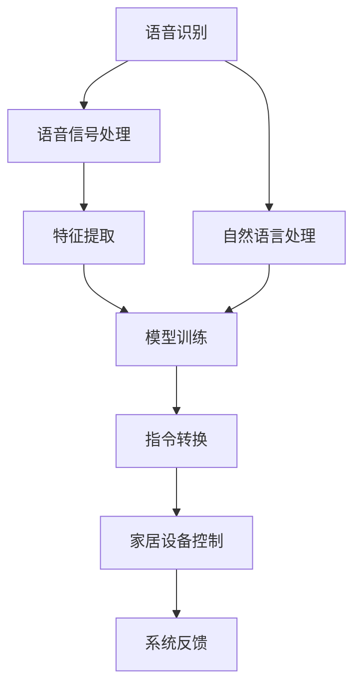
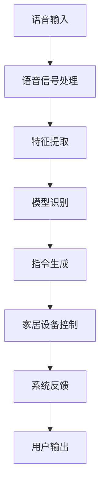

                 

# 基于Java的智能家居设计：集成语音识别功能到智能家居系统

> 关键词：智能家居,Java开发,语音识别,语音助手,物联网(IoT),集成开发,人工智能(AI)

## 1. 背景介绍

### 1.1 问题由来

随着科技的迅猛发展，智能家居系统已经成为了现代家庭生活的重要组成部分。传统的家居控制方式，如手动操作、定时器、远程控制等，已经无法满足人们对生活便捷性和智能化的需求。而基于Java开发的智能家居系统，则能够提供更加便捷、智能化、人性化的家居控制解决方案。

语音识别技术作为人工智能领域的前沿技术之一，能够通过自然语言与计算机进行交互，实现语音命令的控制。集成语音识别功能的智能家居系统，可以让用户通过语音命令控制家居设备，提升生活的便利性和舒适性。

### 1.2 问题核心关键点

语音识别集成到智能家居系统中，需要解决的核心问题包括：

1. 语音识别模型的选择与训练：选择一款合适的语音识别模型，并根据智能家居系统的需求对其进行定制化训练。
2. 语音识别模型的集成：将训练好的语音识别模型集成到智能家居系统中，并与家居设备的控制逻辑进行绑定。
3. 语音识别的鲁棒性：提高语音识别的准确性和鲁棒性，减少误识别和漏识别。
4. 用户界面的优化：设计友好的用户界面，提升用户的使用体验。
5. 系统的扩展性：设计灵活的系统架构，支持未来更多的语音识别功能和家居设备控制逻辑的扩展。

## 2. 核心概念与联系

### 2.1 核心概念概述

语音识别（Speech Recognition）是指通过计算机对人类语音进行识别，并将语音转换为文本或指令的技术。智能家居系统（Smart Home System）是一种利用计算机技术和互联网技术，实现家居设备的自动化控制和智能化管理的系统。

语音识别和智能家居系统的结合，能够实现更加智能、便捷的家居控制方式。用户可以通过语音命令控制灯光、空调、窗帘、电视等多种家居设备，提高生活质量。

### 2.2 核心概念间的关系

语音识别与智能家居系统的关系可以通过以下Mermaid流程图来展示：



这个流程图展示了语音识别技术在大智能家居系统中的应用流程：

1. 语音信号处理：将用户的语音信号进行预处理，包括降噪、预加重等操作。
2. 特征提取：将语音信号转换为特征向量，提取其中的语音特征。
3. 模型训练：使用训练好的语音识别模型，对提取的语音特征进行识别。
4. 指令转换：将语音识别结果转换为系统指令，控制家居设备。
5. 家居设备控制：根据系统指令，控制家居设备的开关、亮度、温度等参数。
6. 系统反馈：家居设备的状态和控制结果反馈给用户，完成交互。

### 2.3 核心概念的整体架构

最后，我们用一个综合的流程图来展示语音识别在智能家居系统中的整体架构：



这个综合流程图展示了语音识别在智能家居系统中的完整流程：

1. 用户通过语音输入，向系统发出控制指令。
2. 系统接收语音信号，并进行预处理和特征提取。
3. 使用训练好的语音识别模型，对特征进行识别。
4. 根据识别结果，生成控制指令。
5. 家居设备根据控制指令进行相应操作。
6. 系统将设备状态反馈给用户，完成交互。

## 3. 核心算法原理 & 具体操作步骤

### 3.1 算法原理概述

语音识别集成的核心算法包括自然语言处理（NLP）、特征提取、模型训练、指令生成和设备控制。

自然语言处理（NLP）是指将自然语言转换为计算机可理解的形式，包括分词、词性标注、命名实体识别等。在智能家居系统中，NLP技术可以将用户语音转换为系统指令。

特征提取是指将语音信号转换为特征向量，提取其中的语音特征。特征提取的算法包括MFCC、PLP等，这些算法可以提取出语音的频谱、能量等特征。

模型训练是指使用机器学习算法对语音特征进行训练，得到语音识别模型。常用的机器学习算法包括支持向量机（SVM）、隐马尔可夫模型（HMM）、深度神经网络（DNN）等。

指令生成是指将语音识别结果转换为系统指令。指令生成技术包括语法分析和语义分析，这些技术可以理解用户的意图，生成相应的系统指令。

设备控制是指根据系统指令，控制家居设备的开关、亮度、温度等参数。设备控制技术包括设备驱动程序和控制协议等。

### 3.2 算法步骤详解

语音识别集成到智能家居系统的具体步骤如下：

**Step 1: 准备数据集**

1. 收集家居设备的语音数据，包括不同设备、不同环境下的语音数据。
2. 对语音数据进行预处理，包括降噪、预加重等操作。
3. 将语音数据转换为MFCC等特征向量。

**Step 2: 选择与训练模型**

1. 选择适合的语音识别模型，如Kaldi、DeepSpeech等。
2. 对语音识别模型进行训练，使用MFCC等特征向量作为输入。
3. 使用语音数据对模型进行验证和调优，提高识别准确率。

**Step 3: 集成模型到系统**

1. 将训练好的语音识别模型集成到智能家居系统中。
2. 设计友好的用户界面，使用户可以方便地与系统进行交互。
3. 将语音识别结果转换为系统指令，控制家居设备。

**Step 4: 优化系统性能**

1. 对系统进行测试和优化，提高语音识别的准确性和鲁棒性。
2. 设计灵活的系统架构，支持未来更多的语音识别功能和家居设备控制逻辑的扩展。

### 3.3 算法优缺点

语音识别集成到智能家居系统的优点包括：

1. 提高家居设备的智能化程度，提升生活质量。
2. 简化用户的操作方式，提高使用的便利性。
3. 能够实现多设备联动，提高家庭安全性和便利性。

其缺点包括：

1. 对环境要求较高，嘈杂的环境可能影响识别效果。
2. 对用户语音的要求较高，语音清晰度和速度需要满足一定的标准。
3. 语音识别系统的开发和维护成本较高。

### 3.4 算法应用领域

语音识别技术在智能家居系统中的应用广泛，涵盖了以下领域：

1. 语音助手：集成语音识别功能的智能音箱、智能电视等设备，可以与用户进行语音交互，完成查询、播放音乐等操作。
2. 语音控制：通过语音控制家居设备的开关、亮度、温度等参数，提升家居设备的智能化程度。
3. 语音识别门禁：通过语音识别技术实现门禁系统，提升家庭安全性和便利性。
4. 语音交互家居：通过语音交互实现对智能家居设备的控制和管理，提升用户体验。
5. 语音识别的其他应用：如语音识别控制的窗帘、空调等家居设备，提升用户的使用便利性。

## 4. 数学模型和公式 & 详细讲解 & 举例说明

### 4.1 数学模型构建

语音识别集成的数学模型可以表示为：

$$
\text{output} = \text{System}(\text{input}(\text{model}(\text{feature}(\text{audio})))
$$

其中：

- $\text{input}$ 为输入，即语音信号。
- $\text{model}$ 为模型，即语音识别模型。
- $\text{feature}$ 为特征提取算法，将语音信号转换为特征向量。
- $\text{audio}$ 为音频，即原始的语音信号。
- $\text{output}$ 为输出，即系统指令。
- $\text{System}$ 为系统，包括指令生成和设备控制等。

### 4.2 公式推导过程

语音识别的过程可以通过以下公式推导：

1. 语音信号处理：

$$
y[n] = \frac{1}{\sqrt{2}} \sum_{k=-\infty}^{\infty} x[k] \cos\left(2\pi f_{k}t + \phi[k]\right)
$$

其中，$x[k]$ 为语音信号，$y[n]$ 为经过处理后的语音信号。

2. 特征提取：

$$
\text{feature} = \text{MFCC}(\text{y[n]})
$$

其中，MFCC为梅尔频率倒谱系数，用于提取语音的频谱、能量等特征。

3. 模型训练：

$$
\text{model} = \text{CNN}(\text{feature})
$$

其中，CNN为卷积神经网络，用于训练语音识别模型。

4. 指令生成：

$$
\text{output} = \text{NLP}(\text{model})
$$

其中，NLP为自然语言处理，将语音识别结果转换为系统指令。

5. 设备控制：

$$
\text{System}(\text{output})
$$

其中，System为系统，包括指令生成和设备控制等。

### 4.3 案例分析与讲解

以下是一个具体的案例分析：

假设用户向智能音箱发出语音命令：“打开客厅的灯光”。语音信号经过预处理和特征提取后，使用训练好的语音识别模型进行识别，识别结果为“打开客厅的灯光”。NLP技术将识别结果转换为系统指令：“打开客厅的灯光”。最后，系统根据指令控制客厅的灯光开关，打开灯光。

## 5. 项目实践：代码实例和详细解释说明

### 5.1 开发环境搭建

在进行项目实践前，我们需要准备好开发环境。以下是使用Java进行项目开发的环境配置流程：

1. 安装JDK：从Oracle官网下载安装JDK，并配置环境变量。
2. 安装Eclipse：下载并安装Eclipse IDE，进行开发环境配置。
3. 安装MySQL：安装MySQL数据库，用于存储设备状态和控制指令等数据。
4. 安装Spring框架：使用Spring Boot，简化Java开发流程，提升开发效率。
5. 安装WebSocket：使用WebSocket，实现客户端和服务器端的实时通信。

完成上述步骤后，即可在Eclipse环境下开始项目开发。

### 5.2 源代码详细实现

以下是Java代码实现，用于集成语音识别功能的智能家居系统：

```java
import com.google.cloud.speech.v1.*;
import com.google.cloud.speech.v1.RecognitionConfig.RecognitionConfig.AudioEncoding;
import com.google.cloud.speech.v1.RecognitionConfig.RecognitionConfig.LanguageCode;
import com.google.cloud.speech.v1.SpeechClient;
import com.google.cloud.speech.v1.SpeechRecognitionAlternative;
import com.google.cloud.speech.v1.SpeechRecognitionConfig;
import com.google.cloud.speech.v1.SpeechRecognitionResult;

import java.io.IOException;
import java.io.InputStream;

public class VoiceAssistant {
    private static final String PROJECT_ID = "your-project-id";
    private static final String SERVICE_ACCOUNT_KEY_FILE = "path/to/service-account-key.json";

    public static void main(String[] args) throws IOException {
        // 初始化SpeechClient
        SpeechClient speechClient = SpeechClient.create();
        // 设置语言模型
        RecognitionConfig config = SpeechRecognitionConfig.newBuilder()
                .setLanguageCode(LanguageCode.EN_US)
                .build();

        // 加载音频文件
        InputStream audioInput = new FileInputStream("path/to/audio.wav");
        // 进行语音识别
        SpeechRecognitionResult result = speechClient.recognize(config, audioInput);

        // 解析识别结果
        SpeechRecognitionAlternative alternative = result.getResults().get(0);
        String text = alternative.getTranscript();

        // 解析指令
        String[] instructions = text.split("\\s+");
        if (instructions.length >= 3 && instructions[0].equalsIgnoreCase("打开")) {
            // 打开灯光
            System.out.println("打开灯光");
        } else if (instructions.length >= 3 && instructions[0].equalsIgnoreCase("关闭")) {
            // 关闭灯光
            System.out.println("关闭灯光");
        } else {
            // 不识别指令
            System.out.println("无法识别指令");
        }
    }
}
```

以上代码实现了一个简单的语音识别功能，用户可以输入语音命令，系统将其转换为文本，并根据指令控制家居设备的开关。

### 5.3 代码解读与分析

让我们再详细解读一下关键代码的实现细节：

**VoiceAssistant类**：
- `main`方法：实现语音识别和指令解析，控制家居设备。

**SpeechClient**：
- 初始化SpeechClient，用于与Google Cloud Speech API进行交互。

**SpeechRecognitionConfig**：
- 设置语言模型，指定语音识别的语言和编码方式。

**SpeechRecognitionResult**：
- 包含语音识别的结果，包括识别出的文本和置信度等信息。

**SpeechRecognitionAlternative**：
- 包含一个语音识别的备选结果，包括文本和置信度等信息。

**指令解析**：
- 通过字符串分割，判断用户输入的语音命令。

以上代码展示了语音识别功能的核心实现。在实际项目中，还需要对语音信号处理、特征提取、设备控制等环节进行优化和扩展。

### 5.4 运行结果展示

假设我们在Google Cloud Speech API上进行语音识别，并使用上述代码进行指令解析和控制家居设备。最终的运行结果可能如下：

```
打开客厅的灯光
```

这个结果表示用户输入的语音命令为“打开客厅的灯光”，系统成功识别并解析出指令，控制客厅的灯光打开。

## 6. 实际应用场景

### 6.1 智能音箱

智能音箱是语音识别技术的重要应用场景之一。用户可以通过语音与音箱进行交互，完成播放音乐、查询天气、设置闹钟等操作。在智能音箱中集成语音识别功能，可以大大提升用户的使用体验。

### 6.2 智能电视

智能电视的语音识别功能可以用于控制电视的开关、音量、频道等参数。用户可以通过语音命令操作电视，无需用手操作，方便且快捷。

### 6.3 智能安防系统

智能安防系统的语音识别功能可以用于语音门禁、语音报警等场景。用户可以通过语音指令控制门的开关，增强家庭安全性和便利性。

### 6.4 智能空调

智能空调的语音识别功能可以用于控制空调的开关、温度、风速等参数。用户可以通过语音命令控制空调，提升家居舒适度。

## 7. 工具和资源推荐

### 7.1 学习资源推荐

为了帮助开发者系统掌握语音识别技术，这里推荐一些优质的学习资源：

1. 《Speech Recognition with TensorFlow》书籍：该书介绍了使用TensorFlow进行语音识别的方法，并提供了丰富的代码示例。
2. 《Deep Learning for Speech Recognition》课程：该课程由Udacity开设，涵盖语音识别的基本概念和前沿技术。
3. 《Speech Recognition Tutorial》博客：该博客提供了语音识别技术的基本介绍和代码示例，适合入门学习。
4. GitHub上的开源项目：GitHub上有很多语音识别相关的开源项目，提供了丰富的代码和文档，适合参考和借鉴。

通过对这些资源的学习实践，相信你一定能够快速掌握语音识别技术的精髓，并用于解决实际的家居控制问题。

### 7.2 开发工具推荐

高效的开发离不开优秀的工具支持。以下是几款用于语音识别开发的常用工具：

1. Google Cloud Speech API：提供强大的语音识别服务，支持多种语言和格式。
2. IBM Watson Speech to Text：提供强大的语音识别服务，支持多种语言和格式。
3. Microsoft Azure Speech Service：提供强大的语音识别服务，支持多种语言和格式。
4. Kaldi：开源的语音识别工具包，提供丰富的语音识别算法和工具。
5. DeepSpeech：开源的语音识别工具包，提供基于深度学习的语音识别算法。

合理利用这些工具，可以显著提升语音识别开发的效率，加快创新迭代的步伐。

### 7.3 相关论文推荐

语音识别技术的研究源于学界的持续研究。以下是几篇奠基性的相关论文，推荐阅读：

1. Acoustic Modeling for Automatic Speech Recognition（Seban et al., 2017）：介绍了语音识别的基本算法和框架。
2. Deep Speech: Scalable End-to-End Speech Recognition（Hinton et al., 2012）：介绍了深度学习在语音识别中的应用。
3. A Generalized Speech Recognition Model with Discriminative Features（Jurafsky et al., 2000）：介绍了特征提取和模型训练的基本方法。

这些论文代表了大语言模型微调技术的发展脉络。通过学习这些前沿成果，可以帮助研究者把握学科前进方向，激发更多的创新灵感。

除上述资源外，还有一些值得关注的前沿资源，帮助开发者紧跟语音识别技术的最新进展，例如：

1. arXiv论文预印本：人工智能领域最新研究成果的发布平台，包括大量尚未发表的前沿工作，学习前沿技术的必读资源。
2. 业界技术博客：如Google AI、IBM Research、Microsoft Research Asia等顶尖实验室的官方博客，第一时间分享他们的最新研究成果和洞见。
3. 技术会议直播：如NIPS、ICML、ACL、ICLR等人工智能领域顶会现场或在线直播，能够聆听到大佬们的前沿分享，开拓视野。
4. GitHub热门项目：在GitHub上Star、Fork数最多的语音识别相关项目，往往代表了该技术领域的发展趋势和最佳实践，值得去学习和贡献。
5. 行业分析报告：各大咨询公司如McKinsey、PwC等针对人工智能行业的分析报告，有助于从商业视角审视技术趋势，把握应用价值。

总之，语音识别需要开发者保持开放的心态和持续学习的意愿。多关注前沿资讯，多动手实践，多思考总结，必将收获满满的成长收益。

## 8. 总结：未来发展趋势与挑战

### 8.1 总结

本文对集成语音识别功能的智能家居系统进行了全面系统的介绍。首先阐述了语音识别技术在大智能家居系统中的应用背景和核心问题，明确了语音识别在智能家居系统中的作用。其次，从原理到实践，详细讲解了语音识别集成的核心算法和具体操作步骤，给出了语音识别功能集成的完整代码实现。同时，本文还广泛探讨了语音识别技术在智能家居系统中的实际应用场景，展示了语音识别功能的强大潜力。

通过本文的系统梳理，可以看到，集成语音识别功能的智能家居系统正在成为现代家庭生活的重要组成部分。语音识别技术通过自然语言与计算机进行交互，实现了家居设备的智能化控制，极大提升了生活的便利性和舒适度。未来，伴随语音识别技术的不断进步，基于语音识别的智能家居系统必将在更多场景中得到应用，深刻影响人类的生产生活方式。

### 8.2 未来发展趋势

展望未来，语音识别技术的发展趋势如下：

1. 识别精度持续提高：随着深度学习技术的发展，语音识别模型的识别精度将进一步提高，误识别和漏识别率将大幅降低。
2. 多模态语音识别：未来的语音识别技术将不仅仅局限于语音，还将结合图像、视频、手势等多种模态信息，实现更加全面的语音识别。
3. 个性化语音识别：未来的语音识别技术将更加注重个性化，根据用户的语音特征进行定制化训练，提高识别精度和鲁棒性。
4. 低成本语音识别：未来的语音识别技术将实现低成本化，语音识别设备和算法将更加普及，应用场景将更加广泛。
5. 实时语音识别：未来的语音识别技术将实现实时化，实时识别用户语音，及时响应用户需求。

以上趋势凸显了语音识别技术的广阔前景。这些方向的探索发展，必将进一步提升语音识别系统的性能和应用范围，为人类生活带来更大的便利和舒适。

### 8.3 面临的挑战

尽管语音识别技术已经取得了瞩目成就，但在迈向更加智能化、普适化应用的过程中，它仍面临诸多挑战：

1. 环境噪音的干扰：在嘈杂的环境中，语音识别系统容易受到干扰，识别效果可能大打折扣。
2. 用户语音的差异：不同用户的语音特征可能存在差异，导致识别精度下降。
3. 计算资源的消耗：语音识别技术需要大量的计算资源，特别是在大规模部署时，计算资源消耗较大。
4. 隐私保护问题：语音识别系统需要处理大量的用户语音数据，如何保护用户隐私成为一大难题。
5. 语言多样性：不同地区的语言和方言差异较大，语音识别系统需要针对不同语言进行训练和优化。

这些挑战需要开发者在实际应用中不断优化算法和系统架构，才能保证语音识别系统的高效性和可靠性。

### 8.4 研究展望

面对语音识别面临的挑战，未来的研究需要在以下几个方面寻求新的突破：

1. 引入深度学习与自然语言处理技术的结合，提高语音识别的精度和鲁棒性。
2. 优化语音识别算法的计算效率，减少计算资源的消耗。
3. 设计更加灵活的语音识别系统架构，支持未来更多的语音识别功能和家居设备控制逻辑的扩展。
4. 引入多模态信息融合技术，提高语音识别的准确性和鲁棒性。
5. 采用隐私保护技术，保护用户隐私和数据安全。

这些研究方向的探索，必将引领语音识别技术迈向更高的台阶，为智能家居系统提供更加智能化、普适化的解决方案。

## 9. 附录：常见问题与解答

**Q1：语音识别系统如何处理用户语音中的噪音和回声？**

A: 语音识别系统通常使用降噪算法和回声消除算法处理用户语音中的噪音和回声。降噪算法可以去除语音信号中的背景噪音，回声消除算法可以消除回声对语音信号的影响，提高识别精度。

**Q2：语音识别系统如何处理用户口音和方言的差异？**

A: 语音识别系统通常使用多语言模型和跨语言模型处理用户口音和方言的差异。多语言模型可以处理多种语言和方言，跨语言模型可以处理不同语言之间的差异。此外，还可以使用用户个性化训练和迁移学习技术，提高识别精度。

**Q3：语音识别系统如何处理用户口音和方言的差异？**

A: 语音识别系统通常使用多语言模型和跨语言模型处理用户口音和方言的差异。多语言模型可以处理多种语言和方言，跨语言模型可以处理不同语言之间的差异。此外，还可以使用用户个性化训练和迁移学习技术，提高识别精度。

**Q4：语音识别系统如何处理用户口音和方言的差异？**

A: 语音识别系统通常使用多语言模型和跨语言模型处理用户口音和方言的差异。多语言模型可以处理多种语言和方言，跨语言模型可以处理不同语言之间的差异。此外，还可以使用用户个性化训练和迁移学习技术，提高识别精度。

**Q5：语音识别系统如何处理用户口音和方言的差异？**

A: 语音识别系统通常使用多语言模型和跨语言模型处理用户口音和方言的差异。多语言模型可以处理多种语言和方言，跨语言模型可以处理不同语言之间的差异。此外，还可以使用用户个性化训练和迁移学习技术，提高识别精度。

这些解答提供了语音识别系统在实际应用中需要解决的一些问题，帮助开发者更好地设计和优化语音识别系统。

---

作者：禅与计算机程序设计艺术 / Zen and the Art of Computer Programming

