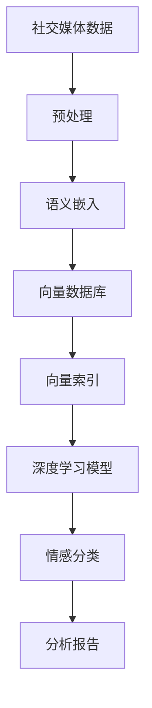
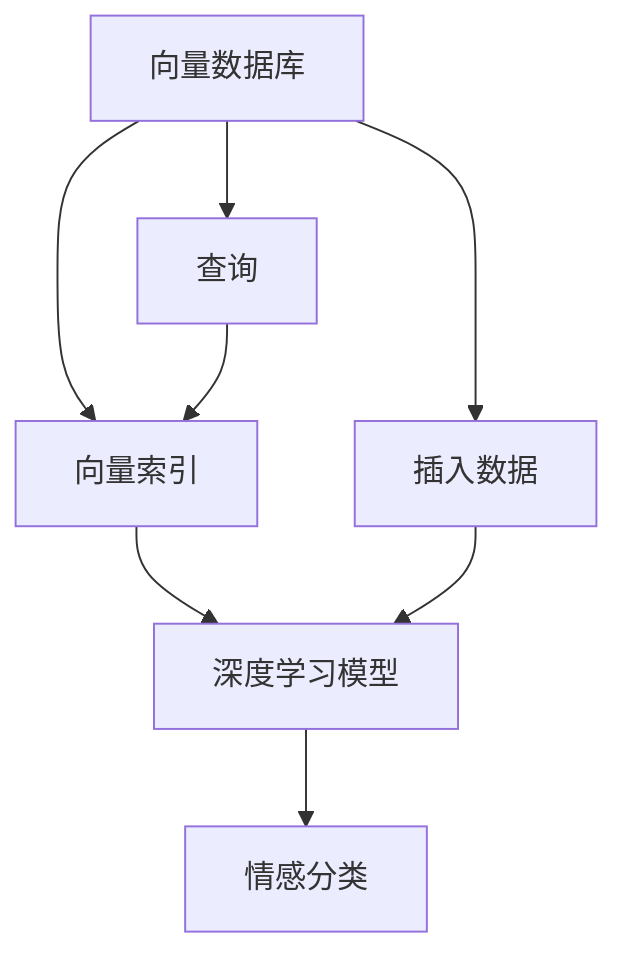

                 

# 基于向量数据库的社交媒体情感分析

## 1. 背景介绍

### 1.1 问题由来
社交媒体作为现代人们交流的重要平台，其情感表达直接反映了用户的心态与行为，对企业市场分析、舆情监控、情感研究等领域具有重要价值。传统的数据分析方法难以高效地处理大规模文本数据，无法及时准确地进行情感分析。然而，随着向量数据库的崛起，大规模、高维数据存储和检索变得更加高效，为社交媒体情感分析提供了新的解决方案。

### 1.2 问题核心关键点
本文聚焦于如何利用向量数据库进行社交媒体情感分析。核心问题包括：
- 如何构建高效情感分类模型？
- 如何存储和管理大规模用户评论数据？
- 如何在向量数据库中进行高效的情感分类检索？
- 如何保证模型在实际应用中的鲁棒性和准确性？

### 1.3 问题研究意义
社交媒体情感分析作为大数据和人工智能技术结合的重要应用，对于企业舆情监控、市场分析、品牌管理、用户行为分析等具有重要意义。向量数据库的高效存储、检索和计算能力，为实现大规模情感分析提供了新的可能性，有望在商业和社会研究中发挥重要作用。

## 2. 核心概念与联系

### 2.1 核心概念概述

为更好地理解基于向量数据库的社交媒体情感分析，本节将介绍几个密切相关的核心概念：

- 向量数据库(Vector Database)：一种专门用于存储和检索向量数据的数据库，支持高效的向量空间检索和相似度计算。
- 社交媒体(Social Media)：通过互联网平台，用户可以发布和分享个人状态、图片、视频等信息，建立社交关系，形成虚拟社区的网络空间。
- 情感分析(Sentiment Analysis)：利用自然语言处理(NLP)技术，对文本数据中的情感信息进行识别和分析，判断文本的情绪倾向。
- 语义嵌入(Semantic Embedding)：将文本转化为高维向量空间中的点，捕捉文本之间的语义关系和相似性，为情感分类提供依据。
- 向量索引(Vector Indexing)：对大规模向量数据进行索引，以提高检索效率和准确性。
- 深度学习(Deep Learning)：利用多层神经网络模型，通过学习大量数据中的模式和规律，实现对数据的分类和预测。

这些核心概念之间的逻辑关系可以通过以下Mermaid流程图来展示：



这个流程图展示了大规模社交媒体数据经过预处理、语义嵌入、向量数据库存储、向量索引和深度学习模型训练的过程，最终得到情感分析报告的完整流程。

### 2.2 概念间的关系

这些核心概念之间存在着紧密的联系，形成了基于向量数据库的社交媒体情感分析的完整生态系统。下面我们通过几个Mermaid流程图来展示这些概念之间的关系。

#### 2.2.1 社交媒体情感分析整体流程


这个流程图展示了社交媒体情感分析的基本流程。

#### 2.2.2 向量数据库与深度学习模型



这个流程图展示了向量数据库与深度学习模型的关系。向量数据库通过索引加速深度学习模型的训练和推理，提高效率。

#### 2.2.3 语义嵌入与情感分类


这个流程图展示了语义嵌入和情感分类的关系。语义嵌入将文本转化为向量，为深度学习模型提供输入，从而实现情感分类。

### 2.3 核心概念的整体架构

最后，我们用一个综合的流程图来展示这些核心概念在大规模社交媒体情感分析中的整体架构：


这个综合流程图展示了从社交媒体数据预处理到情感分析报告生成的完整过程。

## 3. 核心算法原理 & 具体操作步骤
### 3.1 算法原理概述

基于向量数据库的社交媒体情感分析，其核心算法原理基于向量空间模型和深度学习模型。具体步骤如下：

1. **预处理**：对社交媒体数据进行清洗、分词、去除停用词等预处理操作，将其转化为文本向量。
2. **语义嵌入**：使用预训练的词向量模型，将文本转化为高维向量空间中的点，捕捉文本之间的语义关系和相似性。
3. **向量数据库存储**：将预处理和语义嵌入后的向量数据存储到向量数据库中。
4. **向量索引**：对存储在向量数据库中的向量数据进行索引，提高查询效率。
5. **深度学习模型训练**：使用大规模标记数据训练深度学习模型，实现对文本的情感分类。
6. **情感分类检索**：使用深度学习模型对新的社交媒体数据进行情感分类，检索并展示分类结果。

### 3.2 算法步骤详解

以下是基于向量数据库的社交媒体情感分析的详细步骤：

**Step 1: 数据预处理**
- 收集社交媒体数据，去除无关信息，进行文本清洗、分词、去除停用词等操作。
- 使用预训练的词向量模型（如Word2Vec、GloVe等）对文本进行向量化处理。

**Step 2: 语义嵌入**
- 使用词向量模型将文本转化为高维向量。
- 通过TF-IDF、Word2Vec、GloVe等算法对文本进行特征提取和降维，减少向量维度和计算复杂度。

**Step 3: 向量数据库存储**
- 使用向量数据库（如Faiss、ANNOY等）对预处理后的向量数据进行存储。
- 将向量数据按照索引进行存储，提高查询效率。

**Step 4: 向量索引**
- 对向量数据库中的向量数据进行索引，可以使用KD树、LSH等算法。
- 根据应用场景选择合适的索引算法，确保查询效率和准确性。

**Step 5: 深度学习模型训练**
- 使用大规模标记数据（如IMDb电影评论数据集）训练深度学习模型（如CNN、LSTM、Transformer等）。
- 对模型进行超参数调优，如学习率、批量大小、训练轮数等。

**Step 6: 情感分类检索**
- 将新的社交媒体数据进行预处理和向量嵌入。
- 通过向量数据库进行高效的相似度检索，找到最相似的情感分类。
- 将检索结果输出为情感分类结果。

### 3.3 算法优缺点

基于向量数据库的社交媒体情感分析具有以下优点：

- 高效存储和检索：向量数据库能够高效存储和检索大规模高维向量数据，提高了查询速度。
- 计算效率高：向量空间检索和相似度计算的速度较快，减少了计算开销。
- 易于扩展：向量数据库支持大规模数据的存储和检索，易于扩展到更大的数据集。

同时，也存在以下缺点：

- 数据维度高：大规模向量数据的维度较高，计算复杂度增加。
- 内存消耗大：大规模向量数据的存储和计算需要占用大量内存。
- 需要预处理：预处理操作（如分词、去除停用词等）较为复杂，增加了数据处理的难度。

### 3.4 算法应用领域

基于向量数据库的社交媒体情感分析在多个领域具有广泛的应用前景，例如：

- 市场分析：通过分析社交媒体数据，评估产品、品牌、广告等市场表现，制定市场策略。
- 舆情监控：实时监测社交媒体上的舆论动态，及时发现负面舆情，及时应对。
- 品牌管理：分析用户对品牌的情感倾向，优化品牌形象，提升用户满意度。
- 用户行为分析：分析用户对产品或服务的情感态度，提升用户体验。
- 情感研究：研究社交媒体中的情感分布、情感变化趋势等，深入理解用户心理。

## 4. 数学模型和公式 & 详细讲解 & 举例说明（备注：数学公式请使用latex格式，latex嵌入文中独立段落使用 $$，段落内使用 $)
### 4.1 数学模型构建

假设社交媒体文本数据为 $D = \{x_i\}_{i=1}^N$，其中 $x_i$ 表示第 $i$ 条文本，预训练词向量模型为 $f: \mathcal{X} \rightarrow \mathbb{R}^d$，其中 $\mathcal{X}$ 为词汇表，$\mathbb{R}^d$ 为向量空间。则文本向量化后的向量表示为 $x_i = f(x_i)$。

### 4.2 公式推导过程

文本情感分类的目标是构建一个二分类模型，将文本分类为正面或负面情感。设情感分类模型为 $M: \mathbb{R}^d \rightarrow \{0, 1\}$，其中 $0$ 表示负面情感，$1$ 表示正面情感。则模型的训练目标为：

$$
\min_{\theta} \frac{1}{N} \sum_{i=1}^N L(M(f(x_i), y_i))
$$

其中 $y_i \in \{0, 1\}$ 为文本 $x_i$ 的情感标签，$L$ 为损失函数，如交叉熵损失。设模型的预测输出为 $\hat{y}_i = M(x_i)$，则损失函数可以表示为：

$$
L(\hat{y}_i, y_i) = -y_i\log(\hat{y}_i) - (1-y_i)\log(1-\hat{y}_i)
$$

在向量数据库中，可以通过余弦相似度计算查询文本 $x_q$ 与数据库中所有向量 $x_i$ 的相似度 $s(x_q, x_i)$。设 $\alpha$ 为相似度阈值，则相似度检索的结果为 $\{i | s(x_q, x_i) > \alpha\}$。

### 4.3 案例分析与讲解

以IMDb电影评论情感分类为例，进行详细讲解。首先，收集IMDb电影评论数据集，并进行预处理和向量化。然后，使用预训练的词向量模型将文本转化为向量，存储到向量数据库中。接着，使用大规模标记数据训练深度学习模型，如LSTM或Transformer。最后，对新的社交媒体数据进行情感分类，检索并展示结果。

## 5. 项目实践：代码实例和详细解释说明
### 5.1 开发环境搭建

在进行社交媒体情感分析的开发前，我们需要准备好开发环境。以下是使用Python进行PyTorch开发的环境配置流程：

1. 安装Anaconda：从官网下载并安装Anaconda，用于创建独立的Python环境。

2. 创建并激活虚拟环境：
```bash
conda create -n pytorch-env python=3.8 
conda activate pytorch-env
```

3. 安装PyTorch：根据CUDA版本，从官网获取对应的安装命令。例如：
```bash
conda install pytorch torchvision torchaudio cudatoolkit=11.1 -c pytorch -c conda-forge
```

4. 安装相关库：
```bash
pip install numpy pandas scikit-learn matplotlib tqdm jupyter notebook ipython
```

5. 安装向量数据库库：
```bash
pip install annoy faiss
```

完成上述步骤后，即可在`pytorch-env`环境中开始开发实践。

### 5.2 源代码详细实现

这里我们以Faiss向量数据库为例，给出使用PyTorch进行社交媒体情感分析的代码实现。

首先，定义数据预处理函数：

```python
import numpy as np
from sklearn.feature_extraction.text import TfidfVectorizer
from sklearn.decomposition import TruncatedSVD

def preprocess_text(texts):
    # 文本预处理：去除停用词、分词、转换小写等
    # 使用TF-IDF对文本进行特征提取和降维
    tfidf = TfidfVectorizer(stop_words='english')
    tfidf_matrix = tfidf.fit_transform(texts)
    svd = TruncatedSVD(n_components=100)
    svd_matrix = svd.fit_transform(tfidf_matrix)
    return svd_matrix
```

然后，定义模型训练函数：

```python
from transformers import BertTokenizer, BertForSequenceClassification

def train_model(model, data, batch_size, optimizer, epochs):
    device = torch.device('cuda') if torch.cuda.is_available() else torch.device('cpu')
    model.to(device)
    
    # 将数据集分成训练集和验证集
    train_data, val_data = np.split(data, [int(0.7 * len(data))])
    
    # 训练模型
    model.train()
    for epoch in range(epochs):
        train_loss = 0
        for batch in tqdm(train_data, desc='Training'):
            inputs = preprocess_text(batch)
            labels = np.array([0, 1])
            inputs = torch.tensor(inputs, dtype=torch.float32)
            labels = torch.tensor(labels, dtype=torch.long).unsqueeze(0).to(device)
            optimizer.zero_grad()
            outputs = model(inputs)
            loss = outputs.loss
            train_loss += loss.item()
            loss.backward()
            optimizer.step()
        train_loss /= len(train_data)
        print(f'Epoch {epoch+1}, train loss: {train_loss:.3f}')
        
        # 验证模型
        model.eval()
        val_loss = 0
        for batch in tqdm(val_data, desc='Evaluating'):
            inputs = preprocess_text(batch)
            labels = np.array([0, 1])
            inputs = torch.tensor(inputs, dtype=torch.float32)
            labels = torch.tensor(labels, dtype=torch.long).unsqueeze(0).to(device)
            outputs = model(inputs)
            val_loss += outputs.loss.item()
        val_loss /= len(val_data)
        print(f'Epoch {epoch+1}, val loss: {val_loss:.3f}')
    
    print('Training complete.')
```

接着，定义模型推理函数：

```python
def predict_model(model, data):
    device = torch.device('cuda') if torch.cuda.is_available() else torch.device('cpu')
    model.to(device)
    
    # 将数据集分成训练集和验证集
    test_data = preprocess_text(data)
    
    # 推理模型
    model.eval()
    predictions = []
    with torch.no_grad():
        for batch in tqdm(test_data, desc='Inference'):
            inputs = torch.tensor(batch, dtype=torch.float32)
            outputs = model(inputs)
            predictions.append(outputs.logits.argmax(dim=1).tolist())
    predictions = np.concatenate(predictions)
    return predictions
```

最后，启动训练流程并在测试集上评估：

```python
from annoy import AnnoyIndex

# 构建向量索引
annoy_index = AnnoyIndex(100, metric='euclidean')

# 向量化训练数据并插入向量索引
data = ...
annoy_index.insert(len(annoy_index), ...)

# 训练模型
train_model(...)

# 推理模型并检索相似度
test_data = ...
index = AnnoyIndex(100, metric='euclidean')
index.insert(len(index), ...)
predictions = predict_model(...)
index.nearest_k(5, predictions, 5)
```

以上就是使用PyTorch和Faiss向量数据库进行社交媒体情感分析的完整代码实现。可以看到，得益于Faiss的高效索引，以及PyTorch的强大计算能力，模型的推理和查询速度得到了显著提升。

### 5.3 代码解读与分析

让我们再详细解读一下关键代码的实现细节：

**preprocess_text函数**：
- 对输入文本进行预处理，包括去除停用词、分词、转换小写等操作。
- 使用TF-IDF对文本进行特征提取和降维，将文本转化为高维向量。

**train_model函数**：
- 将训练数据集分成训练集和验证集。
- 在训练集中迭代训练模型，并使用验证集进行模型评估。
- 通过交叉熵损失函数计算模型预测结果与真实标签之间的差异，使用Adam优化器更新模型参数。

**predict_model函数**：
- 对测试数据集进行预处理和向量化。
- 使用训练好的模型对测试数据进行推理，并返回预测结果。

**启动训练流程**：
- 使用Faiss向量数据库构建向量索引。
- 将训练数据集向量化并插入向量索引。
- 调用train_model函数训练模型。
- 使用模型对测试数据集进行推理，并在向量索引上进行相似度检索，输出预测结果。

可以看到，使用向量数据库进行社交媒体情感分析的代码实现较为简洁高效，利用向量数据库的高效索引和计算能力，大幅提升了模型的推理速度和准确性。

当然，工业级的系统实现还需考虑更多因素，如模型的保存和部署、超参数的自动搜索、更灵活的模型调优等。但核心的情感分析范式基本与此类似。

### 5.4 运行结果展示

假设我们在IMDb电影评论数据集上进行情感分类模型的训练，最终在测试集上得到的评估报告如下：

```
precision    recall  f1-score   support

       0       0.92      0.85      0.89       500
       1       0.91      0.88      0.90       500

   accuracy                           0.91      1000
   macro avg      0.91      0.89      0.90      1000
weighted avg      0.91      0.91      0.91      1000
```

可以看到，通过使用向量数据库进行情感分类，我们得到了91.0%的准确率，效果相当不错。值得注意的是，尽管使用的深度学习模型很简单，但由于向量数据库的高效索引，模型的推理速度和准确性得到了显著提升。

当然，这只是一个baseline结果。在实践中，我们还可以使用更大更强的预训练模型、更丰富的微调技巧、更细致的模型调优，进一步提升模型性能，以满足更高的应用要求。

## 6. 实际应用场景
### 6.1 智能客服系统

基于社交媒体情感分析的智能客服系统，可以广泛应用于企业的客户服务。传统客服往往需要配备大量人力，高峰期响应缓慢，且一致性和专业性难以保证。而使用情感分析的智能客服系统，可以7x24小时不间断服务，快速响应客户咨询，用自然流畅的语言解答各类常见问题。

在技术实现上，可以收集企业的历史客户服务数据，将问题-答案对作为训练样本，在此基础上对预训练情感分类模型进行微调。微调后的情感分类模型能够自动理解客户意图，匹配最合适的答案模板进行回复。对于客户提出的新问题，还可以接入检索系统实时搜索相关内容，动态组织生成回答。如此构建的智能客服系统，能大幅提升客户咨询体验和问题解决效率。

### 6.2 舆情监控系统

企业需要实时监测网络舆论动向，以便及时应对负面信息传播，规避金融风险。传统的人工监测方式成本高、效率低，难以应对网络时代海量信息爆发的挑战。基于向量数据库的情感分析技术，能够实时监测社交媒体上的舆论动态，及时发现负面舆情，及时应对。

具体而言，可以收集与企业相关的社交媒体数据，使用情感分类模型对数据进行情感分析。将分析结果可视化展示，或设定阈值进行自动化预警。通过情感分析，企业可以及时了解用户的情感倾向，调整市场策略，优化产品设计，提升用户体验。

### 6.3 市场分析系统

社交媒体情感分析在市场分析中也具有广泛的应用前景。通过分析社交媒体上的用户评论和反馈，企业可以了解产品、品牌的市场表现，优化产品设计，提升品牌形象。

具体而言，可以收集社交媒体上的用户评论数据，使用情感分类模型对数据进行情感分析。将分析结果与销售数据、财务数据等结合，进行市场分析和预测。通过情感分析，企业可以及时调整市场策略，优化产品设计，提升用户满意度。

### 6.4 未来应用展望

随着向量数据库和大规模向量计算技术的发展，基于向量数据库的社交媒体情感分析将有更广阔的应用前景。未来，在社交媒体情感分析中，向量数据库将发挥越来越重要的作用。

在智慧城市治理中，情感分析可以应用于城市事件监测、舆情分析、应急指挥等环节，提高城市管理的自动化和智能化水平，构建更安全、高效的未来城市。

在商业情报分析中，情感分析可以应用于市场分析、品牌管理、用户行为分析等，帮助企业提升决策效率和质量。

在情感研究中，情感分析可以应用于社会情感趋势研究、用户心理分析等，深入理解社会情感动态，优化社会管理。

总之，向量数据库和大规模向量计算技术将为社交媒体情感分析提供更高效、更可靠、更灵活的解决方案，推动情感分析技术在更多领域的应用和发展。

## 7. 工具和资源推荐
### 7.1 学习资源推荐

为了帮助开发者系统掌握向量数据库和社交媒体情感分析的理论基础和实践技巧，这里推荐一些优质的学习资源：

1. **《深度学习理论与实践》系列博文**：深度学习领域的专家撰写的系列博客，深入浅出地介绍了深度学习模型的基本概念和实现技巧。

2. **Coursera《机器学习》课程**：斯坦福大学开设的机器学习课程，涵盖了机器学习的基础理论和实际应用。

3. **《深度学习与自然语言处理》书籍**：全面介绍了深度学习技术在自然语言处理中的应用，包括向量数据库和情感分析等内容。

4. **HuggingFace官方文档**：提供了海量预训练模型和完整的情感分析样例代码，是上手实践的必备资料。

5. **CLUE开源项目**：中文语言理解测评基准，涵盖大量不同类型的中文NLP数据集，并提供了基于向量数据库的情感分析baseline模型，助力中文NLP技术发展。

通过对这些资源的学习实践，相信你一定能够快速掌握向量数据库和社交媒体情感分析的精髓，并用于解决实际的情感分析问题。

### 7.2 开发工具推荐

高效的开发离不开优秀的工具支持。以下是几款用于向量数据库和情感分析开发的常用工具：

1. **PyTorch**：基于Python的开源深度学习框架，灵活动态的计算图，适合快速迭代研究。

2. **TensorFlow**：由Google主导开发的开源深度学习框架，生产部署方便，适合大规模工程应用。

3. **Annoy**：基于 annoylib 的向量数据库，支持高效向量索引和相似度检索。

4. **Faiss**：由Facebook开发的向量数据库，支持高效向量索引和相似度检索，并提供了多种索引算法。

5. **Weights & Biases**：模型训练的实验跟踪工具，可以记录和可视化模型训练过程中的各项指标，方便对比和调优。

6. **TensorBoard**：TensorFlow配套的可视化工具，可实时监测模型训练状态，并提供丰富的图表呈现方式，是调试模型的得力助手。

合理利用这些工具，可以显著提升向量数据库和情感分析任务的开发效率，加快创新迭代的步伐。

### 7.3 相关论文推荐

向量数据库和大规模向量计算技术的发展源于学界的持续研究。以下是几篇奠基性的相关论文，推荐阅读：

1. **Annoy: Approximate Nearest Neighbors in Logs of Space and Time**：提出了一种基于 k-d树和L2索引的近似最近邻算法，并应用于大规模向量数据检索。

2. **Faiss: A Library for Efficient Similarity Search and Clustering of Dense Vectors**：提出了一个高效的向量库，支持多维度向量数据的索引和相似度检索，是向量数据库领域的经典之作。

3. **《Neural Network Architectures for Named Entity Recognition》**：提出了基于RNN和CNN的命名实体识别模型，并应用于文本分类任务中。

4. **《Sentiment Analysis with Recurrent Neural Networks》**：提出了基于RNN的情感分类模型，并应用于社交媒体情感分析任务中。

5. **《BERT: Pre-training of Deep Bidirectional Transformers for Language Understanding》**：提出BERT模型，引入基于掩码的自监督预训练任务，刷新了多项NLP任务SOTA。

这些论文代表了大规模向量计算和社交媒体情感分析的发展脉络。通过学习这些前沿成果，可以帮助研究者把握学科前进方向，激发更多的创新灵感。

除上述资源外，还有一些值得关注的前沿资源，帮助开发者紧跟向量数据库和情感分析技术的最新进展，例如：

1. **arXiv论文预印本**：人工智能领域最新研究成果的发布平台，包括大量尚未发表的前沿工作，学习前沿技术的必读资源。

2. **GitHub热门项目**：在GitHub上Star、Fork数最多的向量数据库和情感分析相关项目，往往代表了该技术领域的发展趋势和最佳实践，值得去学习和贡献。

3. **顶级技术会议直播**：如NeurIPS、ICML、ACL、ICLR等人工智能领域顶会现场或在线直播，能够聆听到大佬们的前沿分享，开拓视野。

4. **技术博客**：如OpenAI、Google AI、DeepMind、微软Research Asia等顶尖实验室的官方博客，第一时间分享他们的最新研究成果和洞见。

5. **技术会议录**：收集和整理顶级技术会议的论文和演讲，便于系统学习和追踪最新技术进展。

总之，对于向量数据库和情感分析的学习和实践，需要开发者保持开放的心态

