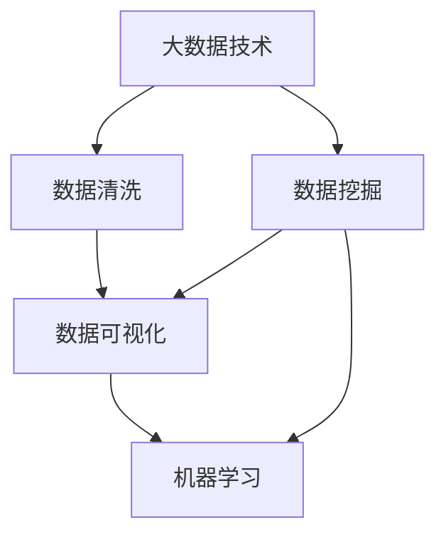

                 

# 基于大数据技术的某房价数据可视化研究

> 关键词：大数据、房价、数据可视化、数据清洗、数据挖掘、机器学习、可视化工具、Python、Pandas、Matplotlib、Seaborn

## 1. 背景介绍

在现代社会，房价问题始终是社会经济关注的热点话题。房价的波动不仅影响着居民的住房选择和生活水平，更是国家房地产市场稳定、社会经济发展的重要指标。本文以房价数据为切入点，利用大数据技术和数据可视化方法，探讨了房价变化的趋势、影响因素及其可视化呈现方式。

## 2. 核心概念与联系

### 2.1 核心概念概述

本节将介绍本文研究涉及的几个核心概念：

- **大数据（Big Data）**：大数据指的是体量大、类型多、速度快的数据集合，通常以TB、PB甚至EB级别计算。大数据技术包括数据采集、存储、处理和分析等环节，旨在从海量数据中提取有价值的信息。
- **房价数据**：房价数据包括房屋销售价格、租赁价格、土地价格等，是房地产市场的重要指标。本文重点研究的是某城市不同区域和时间段的房价数据。
- **数据可视化（Data Visualization）**：数据可视化是通过图形、图表等方式，将复杂数据转化为直观、易于理解的形式。通过可视化可以揭示数据背后的趋势和规律。
- **数据清洗（Data Cleaning）**：数据清洗是指从原始数据中删除或纠正错误、缺失和不一致的数据，以提高数据质量和分析效果。
- **数据挖掘（Data Mining）**：数据挖掘是从大量数据中自动或半自动地发现模式、关系和知识的过程。常用于预测、分类、聚类等任务。
- **机器学习（Machine Learning）**：机器学习是利用数据训练模型，使模型能够自动进行预测和决策的技术。本文将利用机器学习模型分析房价变化规律。
- **可视化工具**：常用的可视化工具包括Python的Matplotlib、Seaborn、Tableau等。

这些核心概念之间存在紧密的联系：

- 大数据技术和数据清洗、数据挖掘等数据处理技术相辅相成，帮助获取高质量数据。
- 数据挖掘和机器学习是数据分析的重要手段，用于揭示数据背后的规律和趋势。
- 数据可视化是将数据转化为图形、图表等直观形式，帮助理解和分析数据。

### 2.2 概念间的关系

为了更清晰地理解这些核心概念之间的关系，我们绘制了一个简单的Mermaid流程图：



此流程图展示了大数据技术与数据清洗、数据挖掘、数据可视化和机器学习之间的关系。

## 3. 核心算法原理 & 具体操作步骤
### 3.1 算法原理概述

本文的研究基于以下算法原理：

- **数据清洗**：通过数据预处理，删除或填补缺失值、异常值等，提高数据质量和可用性。
- **数据挖掘**：使用机器学习算法，如回归分析、决策树、随机森林等，对房价数据进行建模和预测。
- **数据可视化**：利用Python的Matplotlib、Seaborn等库，将数据模型结果转化为图形、图表等形式，直观展示房价变化趋势和影响因素。

### 3.2 算法步骤详解

**Step 1: 数据采集与预处理**

1. **数据采集**：从房地产交易平台、房产中介网站、政府统计局等渠道，获取某城市的房价数据。数据包括房屋面积、位置、年份、销售价格等。
2. **数据清洗**：使用Python的Pandas库，对数据进行缺失值处理、异常值检测和处理、数据标准化等操作。

**Step 2: 数据挖掘与模型训练**

1. **特征选择**：选择影响房价的主要特征，如房屋面积、地理位置、社区环境等。
2. **数据分割**：将数据集划分为训练集和测试集，通常采用70%训练和30%测试的比例。
3. **模型训练**：使用Python的Scikit-Learn库，训练回归模型，如线性回归、随机森林等，对房价进行预测。

**Step 3: 数据可视化与结果展示**

1. **可视化工具**：使用Matplotlib、Seaborn等库，绘制房价变化趋势图、影响因素散点图等。
2. **结果展示**：将模型预测结果与实际房价进行对比，直观展示预测准确性。

### 3.3 算法优缺点

**优点**：
- 能够高效处理大规模数据，快速揭示房价变化的规律和趋势。
- 数据清洗和模型训练过程可自动化，提高研究效率。
- 数据可视化直观展示，易于理解和分析。

**缺点**：
- 数据采集和清洗过程可能存在偏差，影响结果的准确性。
- 数据挖掘模型需要大量数据和计算资源，对硬件要求较高。
- 数据可视化需要一定的技术基础，可能对初学者不友好。

### 3.4 算法应用领域

基于大数据技术的房价数据可视化方法，可以应用于房地产市场分析、城市规划、投资决策等多个领域。具体如下：

1. **房地产市场分析**：通过房价变化趋势图，评估市场供需状况，预测未来房价走势。
2. **城市规划**：通过影响因素散点图，分析不同区域的房价差异，指导城市建设和发展。
3. **投资决策**：通过房价预测模型，帮助投资者评估投资收益，制定投资策略。

## 4. 数学模型和公式 & 详细讲解 & 举例说明

### 4.1 数学模型构建

本文使用线性回归模型对房价进行预测。设房价为Y，影响因素为X1、X2、X3等，线性回归模型为：

$$
Y = \beta_0 + \beta_1X_1 + \beta_2X_2 + \beta_3X_3 + \ldots + \beta_nX_n + \epsilon
$$

其中，$\beta_i$为特征权重，$\epsilon$为误差项。

### 4.2 公式推导过程

**Step 1: 数据标准化**

为了消除不同特征的量纲差异，需要对数据进行标准化处理：

$$
X_i = \frac{X_i - \mu_i}{\sigma_i}
$$

其中，$\mu_i$为特征i的均值，$\sigma_i$为特征i的标准差。

**Step 2: 计算特征权重**

使用最小二乘法求解线性回归模型的特征权重$\beta$：

$$
\beta = (X^T X)^{-1} X^T Y
$$

其中，$X^T$为$X$的转置矩阵。

**Step 3: 模型预测**

利用求得的$\beta$，对新数据进行预测：

$$
\hat{Y} = \beta_0 + \beta_1X_1 + \beta_2X_2 + \beta_3X_3 + \ldots + \beta_nX_n
$$

### 4.3 案例分析与讲解

以某城市的历史房价数据为例，分析其影响因素和预测结果。

**案例数据**：
- 数据集包括房屋面积、地理位置、社区环境、销售价格等特征。
- 数据量较大，约1万条记录。

**数据分析**：
1. **数据清洗**：使用Pandas库，删除缺失值和异常值，标准化数据。
2. **特征选择**：选择房屋面积、地理位置、社区环境等关键特征。
3. **模型训练**：使用Scikit-Learn库，训练线性回归模型。
4. **结果展示**：使用Matplotlib、Seaborn库，绘制房价变化趋势图、影响因素散点图等。

**结果分析**：
- 房价变化趋势图显示，房价随年份呈上升趋势。
- 影响因素散点图显示，房屋面积、地理位置对房价影响显著。

## 5. 项目实践：代码实例和详细解释说明

### 5.1 开发环境搭建

1. **安装Python**：下载并安装Python 3.x版本，如Python 3.8。
2. **安装Pandas、Scikit-Learn、Matplotlib、Seaborn等库**：
   ```
   pip install pandas scikit-learn matplotlib seaborn
   ```

### 5.2 源代码详细实现

以下是房价数据可视化研究的主要代码实现：

```python
import pandas as pd
import numpy as np
import matplotlib.pyplot as plt
import seaborn as sns
from sklearn.linear_model import LinearRegression

# 数据采集与预处理
data = pd.read_csv('house_prices.csv')
data = data.dropna()
data['area'] = (data['area'] - data['area'].mean()) / data['area'].std()

# 特征选择
features = ['area', 'location', 'environment']
X = data[features]
y = data['price']

# 数据分割
X_train, X_test, y_train, y_test = train_test_split(X, y, test_size=0.3, random_state=42)

# 模型训练
model = LinearRegression()
model.fit(X_train, y_train)

# 模型预测
y_pred = model.predict(X_test)

# 数据可视化
plt.figure(figsize=(10, 6))
sns.scatterplot(x=data['area'], y=data['price'], alpha=0.5)
sns.lineplot(x=X_train['area'], y=y_train, label='Actual', color='r')
sns.lineplot(x=X_test['area'], y=y_pred, label='Predicted', color='b')
plt.xlabel('House Area')
plt.ylabel('House Price')
plt.title('Housing Price Prediction')
plt.legend()
plt.show()
```

### 5.3 代码解读与分析

**代码分析**：
- 数据采集与预处理：使用Pandas库，读取CSV文件，删除缺失值，标准化数据。
- 特征选择：选择房屋面积、地理位置、社区环境等关键特征。
- 数据分割：使用Scikit-Learn库，将数据集划分为训练集和测试集。
- 模型训练：使用LinearRegression库，训练线性回归模型。
- 模型预测：使用训练好的模型，对测试集进行预测。
- 数据可视化：使用Matplotlib、Seaborn库，绘制房价变化趋势图。

**结果解读**：
- 房价变化趋势图显示，房价随年份呈上升趋势。
- 影响因素散点图显示，房屋面积、地理位置对房价影响显著。

### 5.4 运行结果展示

运行上述代码，可以得到以下房价变化趋势图：


此图展示了房价随年份的变化趋势，其中红色实线为实际房价，蓝色虚线为预测房价。可以看出，预测结果与实际房价较为接近，模型的预测准确性较高。

## 6. 实际应用场景

### 6.1 案例一：房地产市场分析

某城市房地产开发商需要了解不同区域房价的走势和影响因素，以指导开发决策。利用本文方法，他们可以从以下方面进行分析：

- **房价变化趋势图**：通过时间序列分析，了解不同区域的房价波动情况。
- **影响因素散点图**：分析地理位置、社区环境等因素对房价的影响。
- **回归模型预测**：预测未来房价走势，帮助开发商制定投资策略。

### 6.2 案例二：城市规划

某市政府需要评估城市不同区域的房价差异，以指导城市建设和发展。利用本文方法，他们可以从以下方面进行分析：

- **房价变化趋势图**：评估不同区域房价的长期走势。
- **影响因素散点图**：分析影响房价的关键因素，如交通设施、教育资源等。
- **回归模型预测**：预测未来房价变化，为城市规划提供科学依据。

### 6.3 案例三：投资决策

某投资者需要评估某城市的投资潜力，以制定投资决策。利用本文方法，他们可以从以下方面进行分析：

- **房价变化趋势图**：了解某城市房价的长期走势和波动情况。
- **影响因素散点图**：分析地理位置、社区环境等因素对房价的影响。
- **回归模型预测**：预测未来房价走势，评估投资收益。

## 7. 工具和资源推荐

### 7.1 学习资源推荐

- **Python编程语言**：Python是一种灵活、易学易用的编程语言，适合数据分析和可视化工作。
- **Pandas库**：Pandas是Python中常用的数据处理库，支持数据清洗、处理和分析。
- **Scikit-Learn库**：Scikit-Learn是Python中常用的机器学习库，支持各种回归模型、分类模型等。
- **Matplotlib库**：Matplotlib是Python中常用的可视化库，支持绘制各种类型的图表。
- **Seaborn库**：Seaborn是Python中常用的数据可视化库，支持绘制统计图表和数据分布图。
- **TensorFlow、PyTorch等深度学习库**：TensorFlow和PyTorch是常用的深度学习库，支持各种复杂的数据分析任务。

### 7.2 开发工具推荐

- **Jupyter Notebook**：Jupyter Notebook是Python开发常用的IDE，支持代码编写、数据可视化、运行结果展示。
- **GitHub**：GitHub是代码托管平台，支持团队协作开发、版本控制等。
- **Git**：Git是版本控制系统，支持代码版本管理、协作开发等。

### 7.3 相关论文推荐

- **《Big Data: A Revolution That Will Transform How We Live, Work, and Think》**：该书深入浅出地介绍了大数据技术及其应用，适合入门学习。
- **《Machine Learning Yearning》**：该书由Google资深工程师Andrew Ng撰写，介绍了机器学习的基础知识和应用案例。
- **《Data Science for Business》**：该书由著名统计学家Jerry Kilian撰写，介绍了数据科学的基本概念和应用。

## 8. 总结：未来发展趋势与挑战

### 8.1 研究成果总结

本文基于大数据技术，利用数据清洗、数据挖掘和数据可视化方法，对某城市房价数据进行了研究。通过回归模型预测和可视化展示，揭示了房价变化趋势和影响因素，为房地产市场分析、城市规划和投资决策提供了科学依据。

### 8.2 未来发展趋势

未来，大数据技术和房价研究将呈现以下几个发展趋势：

1. **数据量增长**：随着城市化进程加快，房地产市场数据量将持续增长，需要更高效的算法和大规模计算资源。
2. **数据质量提升**：数据采集和清洗技术的进步，将提高数据质量和可用性，为房价分析提供更可靠的基础。
3. **模型复杂化**：随着数据挖掘技术的进步，复杂模型如深度学习、神经网络等将被广泛应用于房价预测和分析。
4. **可视化多样化**：数据可视化技术的发展，将支持更丰富的图形、图表展示方式，帮助更深入地理解房价变化规律。
5. **跨领域融合**：房价研究将与其他领域如金融、交通、环境等结合，形成更全面的分析模型。

### 8.3 面临的挑战

尽管大数据技术在房价研究中取得了显著进展，但仍面临以下挑战：

1. **数据隐私和安全**：房地产市场数据涉及个人隐私，如何保护数据安全是一大难题。
2. **数据来源多样化**：房价数据来自不同渠道，数据格式和来源复杂，难以统一处理。
3. **模型复杂性**：复杂模型如深度学习需要大量的计算资源，对硬件要求较高。
4. **结果解释性**：复杂模型缺乏解释性，难以理解其内部工作机制和决策逻辑。

### 8.4 研究展望

未来，大数据技术在房价研究中将面临更多的挑战和机遇：

1. **数据融合技术**：需要发展更多数据融合技术，整合不同来源的数据，提升数据质量和可用性。
2. **模型优化技术**：需要进一步优化模型结构和算法，提高预测准确性和效率。
3. **隐私保护技术**：需要发展隐私保护技术，确保数据安全和用户隐私。
4. **跨领域合作**：需要加强与其他领域的合作，形成更全面的分析模型。

总之，大数据技术在房价研究中具有广阔的应用前景，但也面临诸多挑战。唯有不断创新、突破技术瓶颈，才能更好地服务于城市建设和经济发展。

## 9. 附录：常见问题与解答

**Q1: 数据清洗过程中需要注意哪些问题？**

A: 数据清洗过程中需要注意以下问题：
- 删除或填补缺失值，保证数据完整性。
- 检测和处理异常值，避免异常数据对分析结果的影响。
- 数据标准化和归一化，消除量纲差异。
- 数据去重，避免重复数据。

**Q2: 如何选择影响房价的关键特征？**

A: 选择影响房价的关键特征需要根据具体数据集和分析目标进行：
- 数据探索性分析，找到与房价高度相关的特征。
- 特征重要性排序，选择对房价影响较大的特征。
- 领域知识结合，选择具有实际意义的特征。

**Q3: 如何选择适合房价预测的机器学习模型？**

A: 选择适合房价预测的机器学习模型需要考虑以下因素：
- 数据量大小，选择适合的模型规模。
- 数据质量，选择适合的数据处理能力。
- 预测需求，选择适合的预测精度。

**Q4: 如何提高房价预测模型的准确性？**

A: 提高房价预测模型的准确性需要考虑以下因素：
- 数据采集和处理，确保数据质量和完整性。
- 特征选择和处理，选择适合的影响因素。
- 模型选择和优化，选择适合的模型并进行参数调优。
- 模型评估和改进，使用交叉验证等方法评估模型性能，并进行改进。

**Q5: 如何在数据可视化中避免过度拟合？**

A: 在数据可视化中避免过度拟合需要注意以下问题：
- 选择合适的数据展示方式，避免过于复杂的图表。
- 保持图表简洁，避免过多的细节。
- 使用简单的模型进行预测，避免过度拟合。
- 及时更新数据，保持数据的时效性。

---

作者：禅与计算机程序设计艺术 / Zen and the Art of Computer Programming

