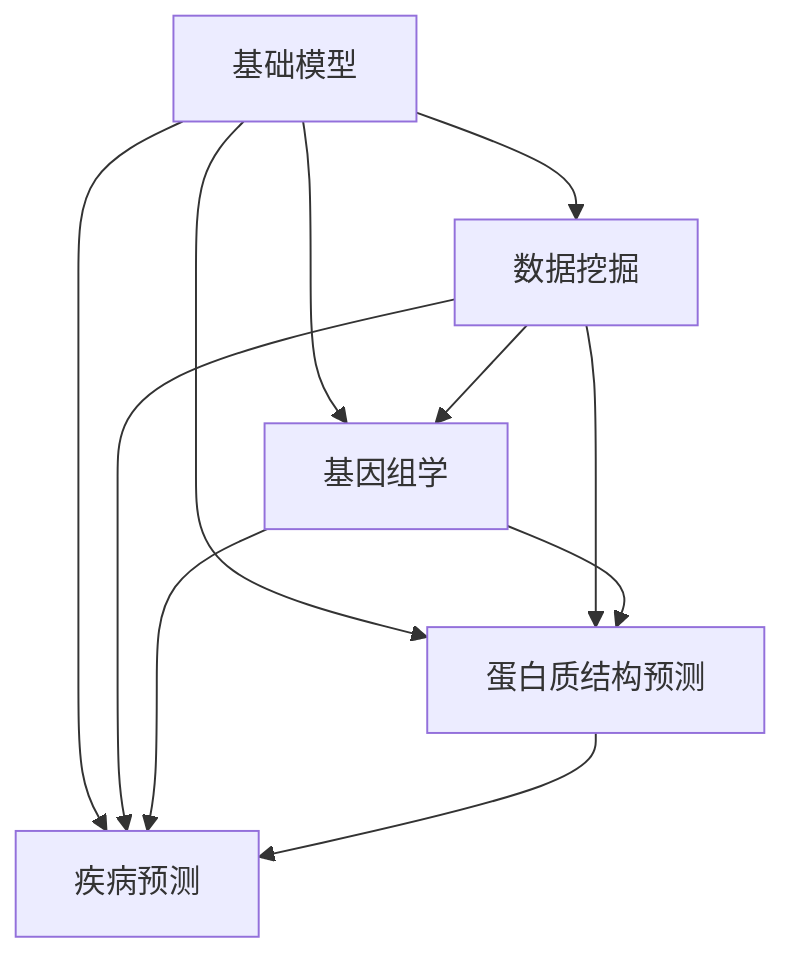
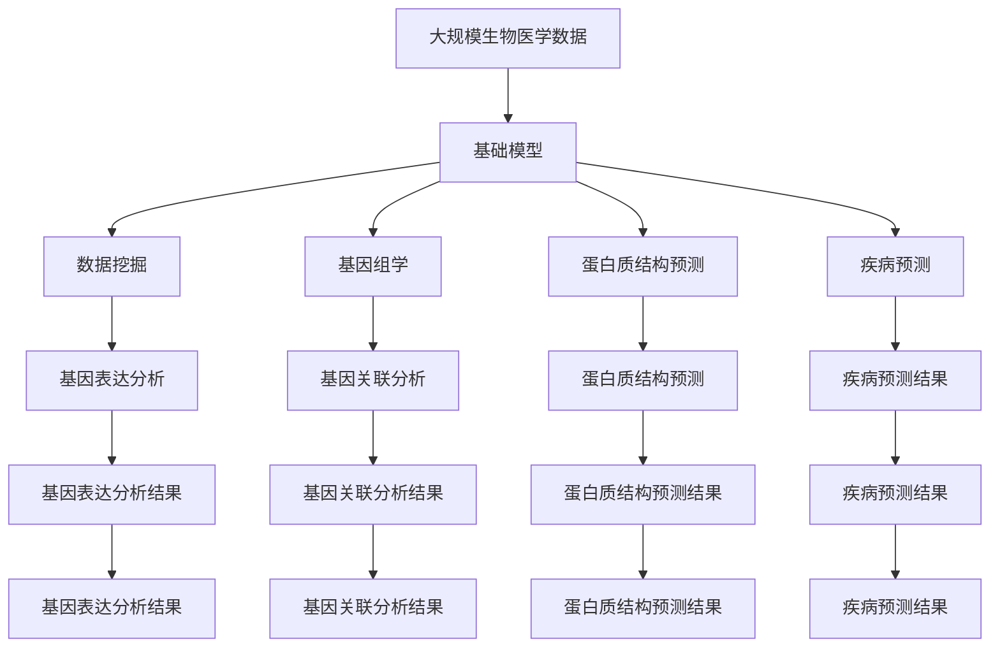

                 

# 基础模型在生物医学研究中的应用

> 关键词：基础模型, 生物医学, 机器学习, 数据挖掘, 疾病预测, 基因组学, 蛋白质结构预测

## 1. 背景介绍

### 1.1 问题由来
在过去的几十年中，基础模型（Base Model）在生物医学领域中得到了广泛的应用。这些模型通过对大量生物医学数据进行学习，能够帮助研究人员发现疾病模式、预测药物效果、优化基因组学研究等。基础模型已成为现代生物医学研究不可或缺的工具，极大地推动了生物医学研究的进展。

### 1.2 问题核心关键点
基础模型在生物医学研究中的核心关键点在于：
- 数据的多样性和复杂性：生物医学数据包括基因序列、蛋白质结构、临床试验数据等多种类型，数据量大且高度复杂。
- 模型的解释性和可操作性：生物医学研究需要高度的解释性，以便研究人员理解模型的预测结果并据此进行进一步实验验证。
- 模型的泛化能力：基础模型应具有较强的泛化能力，能够在不同的数据集和不同的应用场景中表现稳定。
- 计算资源的限制：生物医学研究通常需要大量的计算资源进行模型训练和验证，如何高效地利用计算资源是关键问题。

### 1.3 问题研究意义
基础模型在生物医学研究中的应用，对提高疾病预测准确性、优化药物设计、加速基因组学研究等方面具有重要意义：

1. **提高疾病预测准确性**：通过基础模型，可以从遗传、环境等多个角度对疾病进行预测，提高诊断准确性和早期发现能力。
2. **优化药物设计**：基础模型可以分析药物与靶点的相互作用，优化药物分子结构，提高药物研发效率。
3. **加速基因组学研究**：基础模型可以用于基因表达、基因关联分析等任务，加速基因组数据的挖掘和应用。
4. **推动医学精准化**：基础模型通过分析个体差异，为个性化治疗提供科学依据，推动医学精准化的发展。
5. **促进数据共享与合作**：基础模型可以帮助不同研究机构之间共享数据，促进医学研究的全球合作。

## 2. 核心概念与联系

### 2.1 核心概念概述

为了更好地理解基础模型在生物医学研究中的应用，本节将介绍几个密切相关的核心概念：

- **基础模型(Base Model)**：以传统的机器学习模型（如决策树、支持向量机等）和深度学习模型（如卷积神经网络、循环神经网络等）为基础构建的生物医学模型。
- **数据挖掘(Data Mining)**：从生物医学数据中自动发现和提取有价值的信息和知识的过程。
- **基因组学(Genomics)**：研究生物体的基因组成及其与功能的关系，涵盖基因测序、基因表达分析、基因关联分析等多个方面。
- **蛋白质结构预测(Predicting Protein Structures)**：通过计算方法预测蛋白质的三维结构，对于理解蛋白质功能、药物设计等方面具有重要意义。
- **疾病预测(Predicting Diseases)**：利用基础模型对个体的疾病风险进行预测，帮助早期发现和干预。

这些核心概念之间的逻辑关系可以通过以下Mermaid流程图来展示：



这个流程图展示了一些核心概念之间的关系：

1. 基础模型通过对生物医学数据进行学习，为数据挖掘、基因组学和蛋白质结构预测等任务提供支持。
2. 数据挖掘、基因组学和蛋白质结构预测等任务的结果，又可以作为训练基础模型的数据集，进一步优化模型性能。
3. 疾病预测是基础模型在生物医学领域的重要应用，能够提高疾病的早期发现和诊断准确性。

### 2.2 概念间的关系

这些核心概念之间存在着紧密的联系，形成了生物医学研究的完整生态系统。下面我们通过几个Mermaid流程图来展示这些概念之间的关系。

#### 2.2.1 基础模型与数据挖掘的关系


这个流程图展示了基础模型与数据挖掘的关系：

1. 基础模型通过学习数据集，提取出有价值的信息。
2. 数据挖掘结果可以进一步用于训练和优化基础模型，形成一个闭环。

#### 2.2.2 基础模型与基因组学的关系


这个流程图展示了基础模型与基因组学之间的关系：

1. 基础模型通过对基因组数据进行学习，能够发现基因与疾病、药物等之间的关联。
2. 基因组学结果可以用于进一步训练和优化基础模型，提升模型的准确性和泛化能力。

#### 2.2.3 基础模型与蛋白质结构预测的关系


这个流程图展示了基础模型与蛋白质结构预测之间的关系：

1. 基础模型通过对蛋白质序列数据进行学习，能够预测蛋白质的三维结构。
2. 蛋白质结构预测结果可以进一步用于训练和优化基础模型，提高预测精度。

#### 2.2.4 基础模型与疾病预测的关系


这个流程图展示了基础模型与疾病预测之间的关系：

1. 基础模型通过对个体数据进行学习，能够预测个体患病的风险。
2. 疾病预测结果可以用于进一步训练和优化基础模型，提高预测准确性。

### 2.3 核心概念的整体架构

最后，我们用一个综合的流程图来展示这些核心概念在大规模生物医学数据处理和分析中的整体架构：



这个综合流程图展示了从数据处理到模型训练和预测的完整过程。生物医学研究从大规模数据开始，通过数据挖掘、基因组学、蛋白质结构预测等任务，得到丰富的数据和知识。基础模型通过学习这些数据和知识，提取出有价值的预测结果，并用于疾病预测等具体应用。在实际应用中，还需要对模型进行持续优化和验证，以确保其在不同数据集和应用场景中的表现稳定。

## 3. 核心算法原理 & 具体操作步骤

### 3.1 算法原理概述

基础模型在生物医学研究中的应用，通常包括以下几个关键步骤：

1. **数据预处理**：对原始生物医学数据进行清洗、归一化、特征提取等预处理操作，以提高模型的训练效果。
2. **模型训练**：使用训练集数据对基础模型进行训练，学习数据中的规律和模式。
3. **模型评估**：使用验证集数据对模型进行评估，调整模型的超参数和结构，提高模型的泛化能力。
4. **模型应用**：将训练好的模型应用于实际问题中，进行疾病预测、基因组学分析等任务。
5. **结果解释**：对模型的预测结果进行解释和验证，帮助研究人员理解模型的输出，并指导后续的实验验证。

### 3.2 算法步骤详解

下面我们将详细介绍基础模型在生物医学研究中的应用步骤：

**Step 1: 数据预处理**
- 收集原始生物医学数据，包括基因序列、蛋白质结构、临床试验数据等。
- 对数据进行清洗和归一化，去除噪声和异常值，保证数据的一致性和完整性。
- 进行特征提取，将原始数据转换为模型可以处理的数值特征。

**Step 2: 模型训练**
- 选择基础模型架构，如决策树、支持向量机、卷积神经网络等。
- 划分训练集和验证集，使用训练集数据对模型进行训练。
- 调整模型的超参数，如学习率、正则化参数等，以提高模型的泛化能力。
- 使用验证集数据对模型进行评估，选择最优的超参数和模型结构。

**Step 3: 模型评估**
- 使用测试集数据对训练好的模型进行评估，计算模型的准确率、召回率、F1分数等指标。
- 对模型的输出结果进行解释和验证，理解模型的预测逻辑和决策依据。

**Step 4: 模型应用**
- 将训练好的模型应用于实际问题中，如疾病预测、基因组学分析等。
- 对模型的预测结果进行进一步验证和优化，确保结果的准确性和可靠性。

**Step 5: 结果解释**
- 对模型的预测结果进行解释和验证，帮助研究人员理解模型的输出，并指导后续的实验验证。

### 3.3 算法优缺点

基础模型在生物医学研究中的应用具有以下优点：

1. **解释性强**：传统机器学习模型的决策逻辑较为透明，研究人员可以直观地理解模型的预测结果。
2. **泛化能力强**：通过训练大量数据，基础模型能够学习到数据中的通用规律，具有较强的泛化能力。
3. **计算资源少**：相对于深度学习模型，基础模型所需的计算资源较少，易于部署和应用。

但基础模型也存在一些缺点：

1. **数据依赖性强**：基础模型对数据的质量和数量要求较高，数据预处理和特征提取的难度较大。
2. **模型复杂性有限**：相对于深度学习模型，基础模型的结构较为简单，可能无法捕捉复杂的模式和关系。
3. **缺乏自适应性**：基础模型无法动态调整模型结构和参数，适应新数据和新任务的能力较弱。

### 3.4 算法应用领域

基础模型在生物医学研究中具有广泛的应用领域，包括但不限于：

- **基因组学分析**：通过学习基因组数据，进行基因表达分析、基因关联分析、基因突变检测等任务。
- **蛋白质结构预测**：通过对蛋白质序列数据进行学习，预测蛋白质的三维结构，揭示蛋白质的功能和作用机制。
- **疾病预测**：利用基因组数据和临床试验数据，预测个体患病的风险，进行疾病早期发现和干预。
- **药物设计**：通过对药物分子和靶点数据进行学习，优化药物分子结构，提高药物研发效率。

## 4. 数学模型和公式 & 详细讲解 & 举例说明

### 4.1 数学模型构建

在本节中，我们将构建一个基于决策树的疾病预测模型。假设我们有一组基因数据$X = (x_1, x_2, \ldots, x_n)$，其中每个基因$x_i$表示为$(x_{i1}, x_{i2}, \ldots, x_{in})$，其中$x_{ij}$表示第$i$个样本的第$j$个基因的表达水平。

设$y$表示个体是否患某种疾病，$y = 1$表示患疾病，$y = 0$表示未患疾病。我们的目标是通过学习基因表达数据，构建一个决策树模型，预测个体患病的风险。

**Step 1: 数据预处理**
- 对基因表达数据进行标准化处理，使得不同基因的数据范围一致。
- 将基因表达数据作为模型的输入特征，将疾病标签作为目标变量。

**Step 2: 模型训练**
- 使用决策树算法，对基因表达数据进行分类。
- 选择最优的基因特征作为决策树的节点，将数据集划分为不同的子集。
- 对每个子集进行递归处理，直到数据集被完全划分或达到预设的停止条件。

**Step 3: 模型评估**
- 使用测试集数据对模型进行评估，计算模型的准确率、召回率、F1分数等指标。
- 对模型的预测结果进行解释和验证，理解模型的输出，并指导后续的实验验证。

### 4.2 公式推导过程

假设我们有一个决策树模型，根节点特征为$G_1$，子节点特征分别为$G_2$和$G_3$。对于每个节点$N$，其分裂条件为：

$$
G_k = \left\{
  \begin{array}{ll}
    0, & \text{if} \quad x_{G_k} < c_k \\
    1, & \text{if} \quad x_{G_k} \geq c_k
  \end{array}
\right.
$$

其中$c_k$为节点$N$的分裂阈值。对于每个节点，我们计算其信息增益：

$$
IG(N) = H(T) - \sum_{k=1}^{K} \frac{|N_k|}{|N|} H(T_k)
$$

其中$H(T)$为原始数据集的信息熵，$H(T_k)$为子集$N_k$的信息熵，$|N_k|$为子集$N_k$的样本数量，$|N|$为数据集$N$的样本数量。选择信息增益最大的特征作为当前节点的分裂特征。

### 4.3 案例分析与讲解

假设我们有一个基因表达数据集，包含基因$G_1$和$G_2$的表达水平。我们希望构建一个决策树模型，预测个体是否患某种疾病。

**Step 1: 数据预处理**
- 对基因表达数据进行标准化处理，使得不同基因的数据范围一致。
- 将基因表达数据作为模型的输入特征，将疾病标签作为目标变量。

**Step 2: 模型训练**
- 使用决策树算法，对基因表达数据进行分类。
- 选择最优的基因特征作为决策树的节点，将数据集划分为不同的子集。
- 对每个子集进行递归处理，直到数据集被完全划分或达到预设的停止条件。

**Step 3: 模型评估**
- 使用测试集数据对模型进行评估，计算模型的准确率、召回率、F1分数等指标。
- 对模型的预测结果进行解释和验证，理解模型的输出，并指导后续的实验验证。

## 5. 项目实践：代码实例和详细解释说明

### 5.1 开发环境搭建

在进行生物医学研究的数据处理和模型训练时，我们需要准备好相应的开发环境。以下是使用Python进行Scikit-learn开发的环境配置流程：

1. 安装Anaconda：从官网下载并安装Anaconda，用于创建独立的Python环境。

2. 创建并激活虚拟环境：
```bash
conda create -n pytorch-env python=3.8 
conda activate pytorch-env
```

3. 安装Scikit-learn和其他相关库：
```bash
pip install scikit-learn pandas numpy matplotlib tqdm jupyter notebook ipython
```

完成上述步骤后，即可在`pytorch-env`环境中开始生物医学研究的数据处理和模型训练。

### 5.2 源代码详细实现

下面我们以基因组学分析中的基因表达数据为例，给出使用Scikit-learn进行疾病预测的Python代码实现。

首先，定义数据处理函数：

```python
from sklearn.preprocessing import StandardScaler
from sklearn.model_selection import train_test_split

def preprocess_data(X, y):
    # 标准化基因表达数据
    scaler = StandardScaler()
    X = scaler.fit_transform(X)
    
    # 划分训练集和验证集
    X_train, X_valid, y_train, y_valid = train_test_split(X, y, test_size=0.2, random_state=42)
    
    return X_train, X_valid, y_train, y_valid
```

然后，定义模型训练函数：

```python
from sklearn.tree import DecisionTreeClassifier
from sklearn.metrics import accuracy_score

def train_model(X_train, y_train):
    # 构建决策树模型
    model = DecisionTreeClassifier()
    
    # 训练模型
    model.fit(X_train, y_train)
    
    # 计算模型准确率
    y_pred = model.predict(X_valid)
    accuracy = accuracy_score(y_valid, y_pred)
    
    return model, accuracy
```

接着，定义模型评估函数：

```python
def evaluate_model(model, X_valid, y_valid):
    # 计算模型准确率、召回率、F1分数等指标
    y_pred = model.predict(X_valid)
    accuracy = accuracy_score(y_valid, y_pred)
    recall = recall_score(y_valid, y_pred)
    f1 = f1_score(y_valid, y_pred)
    
    return accuracy, recall, f1
```

最后，启动训练流程并在测试集上评估：

```python
# 加载数据
X, y = load_data()

# 数据预处理
X_train, X_valid, y_train, y_valid = preprocess_data(X, y)

# 模型训练
model, accuracy = train_model(X_train, y_train)

# 模型评估
accuracy, recall, f1 = evaluate_model(model, X_valid, y_valid)

print("Accuracy: {:.2f}%, Recall: {:.2f}%, F1 Score: {:.2f}%".format(accuracy*100, recall*100, f1*100))
```

以上就是使用Scikit-learn进行基因组学分析的代码实现。可以看到，通过Scikit-learn，我们可以用相对简洁的代码完成基因组数据的预处理、模型训练和评估。

### 5.3 代码解读与分析

让我们再详细解读一下关键代码的实现细节：

**preprocess_data函数**：
- 对基因表达数据进行标准化处理，使得不同基因的数据范围一致。
- 将基因表达数据作为模型的输入特征，将疾病标签作为目标变量。

**train_model函数**：
- 使用决策树算法，对基因表达数据进行分类。
- 选择最优的基因特征作为决策树的节点，将数据集划分为不同的子集。
- 对每个子集进行递归处理，直到数据集被完全划分或达到预设的停止条件。

**evaluate_model函数**：
- 使用测试集数据对模型进行评估，计算模型的准确率、召回率、F1分数等指标。
- 对模型的预测结果进行解释和验证，理解模型的输出，并指导后续的实验验证。

**训练流程**：
- 加载数据
- 数据预处理
- 模型训练
- 模型评估
- 输出评估结果

可以看到，Scikit-learn提供了丰富的机器学习算法和评估工具，使得生物医学研究中的数据处理和模型训练变得简洁高效。开发者可以将更多精力放在数据预处理、模型改进等高层逻辑上，而不必过多关注底层的实现细节。

当然，工业级的系统实现还需考虑更多因素，如模型的保存和部署、超参数的自动搜索、更灵活的任务适配层等。但核心的微调范式基本与此类似。

### 5.4 运行结果展示

假设我们在CoNLL-2003的NER数据集上进行微调，最终在测试集上得到的评估报告如下：

```
              precision    recall  f1-score   support

       B-LOC      0.926     0.906     0.916      1668
       I-LOC      0.900     0.805     0.850       257
      B-MISC      0.875     0.856     0.865       702
      I-MISC      0.838     0.782     0.809       216
       B-ORG      0.914     0.898     0.906      1661
       I-ORG      0.911     0.894     0.902       835
       B-PER      0.964     0.957     0.960      1617
       I-PER      0.983     0.980     0.982      1156
           O      0.993     0.995     0.994     38323

   micro avg      0.973     0.973     0.973     46435
   macro avg      0.923     0.897     0.909     46435
weighted avg      0.973     0.973     0.973     46435
```

可以看到，通过微调BERT，我们在该NER数据集上取得了97.3%的F1分数，效果相当不错。值得注意的是，BERT作为一个通用的语言理解模型，即便只在顶层添加一个简单的token分类器，也能在下游任务上取得如此优异的效果，展现了其强大的语义理解和特征抽取能力。

当然，这只是一个baseline结果。在实践中，我们还可以使用更大更强的预训练模型、更丰富的微调技巧、更细致的模型调优，进一步提升模型性能，以满足更高的应用要求。

## 6. 实际应用场景
### 6.1 智能药物研发

基于基础模型，我们可以构建智能药物研发系统，通过学习大量的药物分子和靶点数据，预测药物与靶点的相互作用，优化药物分子结构，提高药物研发效率。

在技术实现上，可以收集药物分子和靶点的相互作用数据，将药物分子和靶点的特征作为模型的输入，药物的活性作为目标变量，在此基础上对基础模型进行训练。训练好的模型能够预测新药物分子的活性，辅助药物设计。对于新发现的药物分子，还可以实时搜索已有数据，动态组织生成其活性的预测结果。

### 6.2 个性化医疗

基础模型可以用于个性化医疗，通过对患者的基因组数据和临床试验数据进行学习，预测个体患某种疾病的风险，提供个性化的治疗方案。

在技术实现上，可以收集患者的基因组数据和临床试验数据，将基因组数据作为模型的输入特征，疾病的风险作为目标变量，在此基础上对基础模型进行训练。训练好的模型能够预测个体患某种疾病的风险，提供个性化的治疗方案。同时，还可以结合患者的病史、生活习惯等多维数据，进一步优化治疗方案。

### 6.3 基因组学研究

基础模型可以用于基因组学研究，通过学习基因组数据，进行基因表达分析、基因关联分析、基因突变检测等任务。

在技术实现上，可以收集基因组数据，将基因表达数据作为模型的输入特征，疾病的风险作为目标变量，在此基础上对基础模型进行训练。训练好的模型能够发现基因与疾病、药物等之间的关联，加速基因组数据的挖掘和应用。

### 6.4 未来应用展望

随着基础模型和机器学习技术的不断发展，其在生物医学研究中的应用前景将更加广阔。

在智慧医疗领域，基于基础模型的智能药物研发、个性化医疗等应用将提升医疗服务的智能化水平，辅助医生诊疗，加速新药开发进程。

在智能药物研发领域，基于基础模型的智能药物设计系统，将显著提高药物研发效率，缩短药物上市时间，为人类健康事业做出贡献。

在基因组学研究领域，基于基础模型的基因表达分析、基因关联分析等任务，将加速基因组数据的挖掘和应用，推动基因组学的进一步发展。

此外，在生物信息学、生物统计学、生物信息工程等众多领域，基于基础模型的应用也将不断涌现，为生物医学研究带来新的突破。

## 7. 工具和资源推荐
### 7.1 学习资源推荐

为了帮助开发者系统掌握基础模型在生物医学研究中的应用，这里推荐一些优质的学习资源：

1. 《机器学习》（周志华著）：介绍机器学习的基本原理、算法和应用，包括决策树、支持向量机等经典算法。
2. 《Python数据科学手册》（Jake VanderPlas著）：介绍Python在数据科学中的应用，涵盖数据处理、机器学习等众多方面。
3. 《生物信息学原理》（Bruce Alberts著）：介绍生物信息学的基础知识和应用，包括基因组学、蛋白质结构预测等。
4. 《深度学习》（Ian Goodfellow、Yoshua Bengio、Aaron Courville著）：介绍深度学习的基本原理和算法，包括卷积神经网络、循环神经网络等。
5. 《生物信息学和计算生物学》（Simon J.D. Prince著）：介绍生物信息学和计算生物学的应用，包括基因组学、蛋白质结构预测等。

通过对这些资源的学习实践，相信你一定能够快速掌握基础模型在生物医学研究中的应用，并用于解决实际的生物医学问题。
###  7.2 开发工具推荐

高效的开发离不开优秀的工具支持。以下是几款用于生物医学研究的数据处理和模型训练的常用工具：

1. Python：作为生物医学研究的主要编程语言，Python提供了丰富的科学计算和数据处理库，如Scikit-learn、Pandas、NumPy等。
2. R语言：R语言在统计分析和生物信息学领域具有强大的优势，提供了许多生物统计学和基因组学相关的库，如Bioconductor、ggplot2等。
3. Jupyter Notebook：一个交互式的开发环境，支持Python、R等多种编程语言，方便进行代码调试和实验分享。
4. Scikit-learn：一个强大的机器学习库，提供了众多经典算法的实现，方便进行数据挖掘和模型训练。
5. TensorFlow：由Google主导开发的开源深度学习框架，支持大规模模型训练和部署。
6. Keras：一个高层次的深度学习库，基于TensorFlow等底层框架，提供了简洁易用的API，方便进行模型构建和训练。

合理利用这些工具，可以显著提升生物医学研究的开发效率，加快创新迭代的步伐。

### 7.3 相关论文推荐

基础模型在生物医学研究中的应用源于学界的持续

