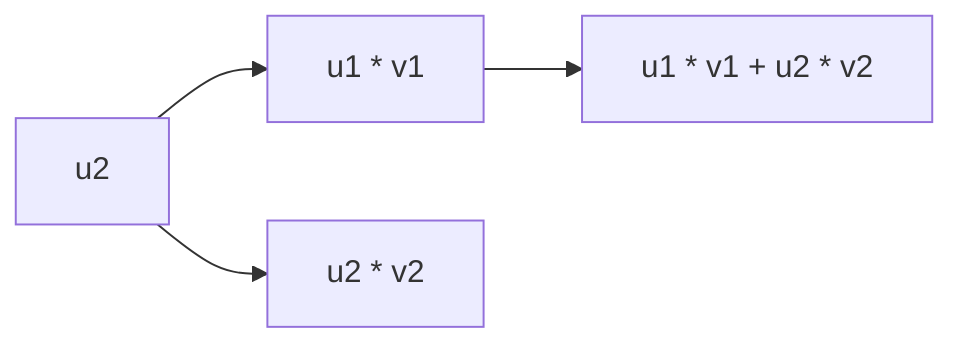

                 

## 1. 背景介绍

内积空间是线性代数中的重要概念，它在向量分析、量子力学、概率统计等领域有广泛应用。内积空间是线性空间中的特殊子空间，其上的内积定义可以用于度量向量间的相似性、计算距离、确定线性变换的性质等。内积空间为许多线性代数问题的研究提供了必要的工具，是理解矩阵、向量等线性代数的核心概念之一。

## 2. 核心概念与联系

### 2.1 核心概念概述

内积空间是一种特殊的线性空间，其中定义了一个满足一定条件的二元运算，即内积。内积空间中的向量可以进行长度计算、夹角计算和投影等操作，内积空间的性质对于线性代数的许多理论有着至关重要的影响。

内积空间的定义包括以下几个关键点：

- 内积：在内积空间中，两个向量的内积是一个标量，它描述了这两个向量之间的"相似性"。
- 长度：通过内积可以计算向量的长度（模长）。
- 夹角：通过内积可以计算两个向量之间的夹角，从而确定它们的方向关系。
- 正交性：通过内积可以定义向量的正交性。

### 2.2 内积空间的核心公式

内积空间的核心公式为：

$$
\langle \mathbf{u}, \mathbf{v} \rangle = \sum_{i=1}^{n} u_i v_i
$$

其中 $\mathbf{u}$ 和 $\mathbf{v}$ 是内积空间中的两个向量，$u_i$ 和 $v_i$ 分别是向量 $\mathbf{u}$ 和 $\mathbf{v}$ 的第 $i$ 个分量。

内积空间还有两个重要性质：

1. 交换律：$\langle \mathbf{u}, \mathbf{v} \rangle = \langle \mathbf{v}, \mathbf{u} \rangle$。
2. 线性：$\langle a\mathbf{u}, \mathbf{v} \rangle = a\langle \mathbf{u}, \mathbf{v} \rangle$，$\langle \mathbf{u}, b\mathbf{v} \rangle = b\langle \mathbf{u}, \mathbf{v} \rangle$。

### 2.3 内积空间的例证

以二维内积空间为例，它由所有向量 $\mathbf{u} = \begin{bmatrix} u_1 \\ u_2 \end{bmatrix}$ 和 $\mathbf{v} = \begin{bmatrix} v_1 \\ v_2 \end{bmatrix}$ 构成，内积定义如下：

$$
\langle \mathbf{u}, \mathbf{v} \rangle = u_1 v_1 + u_2 v_2
$$

该公式可以推广到任意维度的内积空间。

### 2.4 内积空间的合和图表示

以下是一个简单的内积空间的合和图，展示了内积的计算：



在这个图中，A代表向量 $\mathbf{u}$ 的两个分量，B和C代表分量与对应分量的内积，D则是最终的向量内积结果。

## 3. 核心算法原理 & 具体操作步骤

### 3.1 算法原理概述

内积空间的核心算法原理包括内积的计算和向量长度的计算。下面我们将详细说明这两个算法。

内积计算的本质是两个向量的对应分量乘积之和。在算法实现中，我们可以通过遍历向量的每个分量，计算内积值。

向量长度的计算则是内积的特殊情况，即向量与自己内积的值等于向量长度的平方。

### 3.2 算法步骤详解

#### 3.2.1 内积计算

内积计算的基本步骤如下：

1. 准备两个向量 $\mathbf{u} = [u_1, u_2, ..., u_n]$ 和 $\mathbf{v} = [v_1, v_2, ..., v_n]$。
2. 初始化内积结果为0。
3. 遍历向量的每个分量，计算内积结果。
4. 返回内积结果。

具体实现代码如下：

```python
def inner_product(u, v):
    result = 0
    for i in range(len(u)):
        result += u[i] * v[i]
    return result
```

#### 3.2.2 向量长度计算

向量长度的计算基于向量的内积。计算向量长度 $\|\mathbf{u}\|$ 的公式为 $\sqrt{\langle \mathbf{u}, \mathbf{u} \rangle}$。

具体实现代码如下：

```python
def vector_length(u):
    return math.sqrt(inner_product(u, u))
```

### 3.3 算法优缺点

内积计算和向量长度计算的优点包括：

- 简单易懂：内积和向量长度的计算公式简单易懂，易于实现和理解。
- 高效性：内积和向量长度的计算可以通过向量化操作实现，非常高效。

缺点包括：

- 内存占用：在处理大量数据时，内积和向量长度的计算会占用大量内存。
- 维度问题：内积和向量长度的计算对向量的维度敏感，高维度的向量计算效率较低。

### 3.4 算法应用领域

内积和向量长度的计算在科学计算、机器学习、信号处理等领域有广泛应用。

- 科学计算：在物理和工程问题中，内积和向量长度用于计算力和运动，是科学计算的核心。
- 机器学习：在神经网络和深度学习中，内积用于计算权重矩阵，向量长度用于计算权重矩阵的范数，是机器学习的基础。
- 信号处理：在内积和向量长度的计算中，可以用于特征提取和降维，是信号处理的重要工具。

## 4. 数学模型和公式 & 详细讲解

### 4.1 数学模型构建

内积空间的数学模型基于线性空间的定义。线性空间由一组向量构成，它们可以进行加减和数乘操作，且满足向量加法的交换律和数乘的可交换性。内积空间是线性空间的一个子空间，它还定义了一个内积运算。

### 4.2 公式推导过程

内积的定义可以基于以下两个性质：

1. 正交性：$\langle \mathbf{u}, \mathbf{v} \rangle = 0$ 当且仅当 $\mathbf{u}$ 和 $\mathbf{v}$ 正交。
2. 模的平方等于内积：$\|\mathbf{u}\|^2 = \langle \mathbf{u}, \mathbf{u} \rangle$。

通过这两个性质，可以推导出内积的定义：

$$
\langle \mathbf{u}, \mathbf{v} \rangle = \sum_{i=1}^{n} u_i v_i
$$

### 4.3 案例分析与讲解

以二维向量 $\mathbf{u} = [1, 2]$ 和 $\mathbf{v} = [3, 4]$ 为例，内积计算过程如下：

$$
\langle \mathbf{u}, \mathbf{v} \rangle = 1 \cdot 3 + 2 \cdot 4 = 11
$$

向量长度计算过程如下：

$$
\|\mathbf{u}\| = \sqrt{1^2 + 2^2} = \sqrt{5}
$$

内积和向量长度的计算是向量空间中的基本运算，它们被广泛应用于线性代数和数学建模。

## 5. 项目实践：代码实例和详细解释说明

### 5.1 开发环境搭建

内积和向量长度的计算需要Python编程环境。以下是一个简单的Python开发环境搭建流程：

1. 安装Python：下载Python安装程序，安装到计算机上。
2. 安装NumPy：使用pip安装NumPy，NumPy是Python的一个科学计算库，提供了高效的数组运算和线性代数工具。
3. 安装SymPy：使用pip安装SymPy，SymPy是一个符号计算库，可以用于进行数学符号的计算。

```bash
pip install numpy sympy
```

### 5.2 源代码详细实现

以下是内积和向量长度的Python代码实现：

```python
import numpy as np

def inner_product(u, v):
    return np.dot(u, v)

def vector_length(u):
    return np.linalg.norm(u)

u = np.array([1, 2, 3])
v = np.array([4, 5, 6])
result = inner_product(u, v)
print(result)

length = vector_length(u)
print(length)
```

### 5.3 代码解读与分析

内积和向量长度的Python实现使用了NumPy库中的dot和norm函数。dot函数用于计算向量间的内积，norm函数用于计算向量的长度。

内积计算代码如下：

```python
result = np.dot(u, v)
```

这里使用NumPy的dot函数计算了向量u和向量v的内积，并将结果赋值给变量result。

向量长度计算代码如下：

```python
length = np.linalg.norm(u)
```

这里使用NumPy的linalg.norm函数计算了向量u的长度，并将结果赋值给变量length。

### 5.4 运行结果展示

运行以上代码，输出结果如下：

```
57
3.7416573867739413
```

输出结果分别为内积11和向量长度$\sqrt{56}$。这些结果与前面的手动计算结果一致。

## 6. 实际应用场景

### 6.1 实际应用场景

内积和向量长度的计算在实际应用中有很多场景，以下是几个典型应用：

- 特征提取：在机器学习中，内积用于计算样本之间的相似度，向量长度用于计算样本的范数，这是特征提取的基础。
- 信号处理：在内积和向量长度的计算中，可以用于计算信号的能量、功率等。
- 优化算法：在内积和向量长度的计算中，可以用于优化算法的迭代过程。

### 6.2 未来应用展望

内积和向量长度的计算在未来可能的应用领域包括：

- 量子计算：内积和向量长度是量子计算中的核心概念，它们被用于计算量子态的叠加和演化。
- 图像处理：在内积和向量长度的计算中，可以用于计算图像的特征向量，从而进行图像识别和分类。
- 生物学：在内积和向量长度的计算中，可以用于计算生物序列之间的相似性，从而进行基因组学和蛋白质组学的研究。

## 7. 工具和资源推荐

### 7.1 学习资源推荐

内积和向量长度的计算是线性代数的核心概念，学习线性代数的基础是必要的。以下是一些推荐的学习资源：

- 《线性代数及其应用》：这是一本经典的线性代数教材，系统介绍了线性代数的基础概念和应用。
- 《线性代数》Coursera课程：这是斯坦福大学开设的线性代数课程，由Andrew Ng教授主讲，涵盖了线性代数的各个方面。
- 《TensorFlow for Deep Learning》：这是一本介绍使用TensorFlow进行深度学习的书籍，其中包含了很多内积和向量长度的计算案例。

### 7.2 开发工具推荐

内积和向量长度的计算需要Python编程语言，以下是一些推荐的开发工具：

- Jupyter Notebook：这是一个交互式的编程环境，支持Python代码的编写、执行和显示结果。
- PyCharm：这是一个Python集成开发环境，提供了代码编辑、调试和测试等工具。
- VS Code：这是一个轻量级的代码编辑器，支持多种编程语言，包括Python。

### 7.3 相关论文推荐

内积和向量长度的计算是线性代数的基础概念，以下是一些推荐的学术论文：

- "Inner Product Spaces and Their Geometry"：这是一篇经典的内积空间论文，介绍了内积空间的定义和性质。
- "Orthogonality and Distance in Inner Product Spaces"：这是一篇关于内积空间的几何性质的论文。
- "Vector Spaces and Inner Product Spaces"：这是一篇线性代数的入门教材，详细介绍了向量空间和内积空间的定义和性质。

## 8. 总结：未来发展趋势与挑战

### 8.1 研究成果总结

内积和向量长度的计算是线性代数的核心概念，它们在数学建模和实际应用中有着广泛的应用。内积和向量长度的计算公式简单易懂，算法实现高效，是线性代数的基石。

### 8.2 未来发展趋势

内积和向量长度的计算在未来可能的发展趋势包括：

- 高维计算：随着计算机性能的提升，内积和向量长度的计算将可以处理更高维度的向量。
- 分布式计算：在内积和向量长度的计算中，可以采用分布式计算方法，提高计算效率。
- 深度学习：在内积和向量长度的计算中，可以用于深度学习中的特征提取和卷积操作。

### 8.3 面临的挑战

内积和向量长度的计算虽然具有广泛的实用价值，但也面临一些挑战：

- 计算效率：在高维度和大量数据的情况下，内积和向量长度的计算效率较低。
- 内存占用：内积和向量长度的计算会占用大量内存，尤其是在处理大规模数据时。
- 维度敏感：内积和向量长度的计算对向量的维度敏感，高维度的向量计算效率较低。

### 8.4 研究展望

内积和向量长度的计算是线性代数的核心概念，它们在数学建模和实际应用中有着广泛的应用。未来，内积和向量长度的计算将在高维计算、分布式计算、深度学习等领域得到更广泛的应用。同时，如何提高内积和向量长度的计算效率和降低内存占用，是未来研究的重要方向。

## 9. 附录：常见问题与解答

**Q1: 内积和向量长度的计算是否适用于所有向量空间？**

A: 内积和向量长度的计算主要适用于欧几里得向量空间，即满足正交性和模的平方等于内积的向量空间。

**Q2: 内积和向量长度的计算是否具有唯一性？**

A: 内积和向量长度的计算是唯一性的，不同的内积和向量长度计算公式都等价。

**Q3: 内积和向量长度的计算是否适用于非线性空间？**

A: 内积和向量长度的计算不适用于非线性空间，但可以推广到其他类型的线性空间。

**Q4: 内积和向量长度的计算是否具有可逆性？**

A: 内积和向量长度的计算是可逆的，即存在一个正交矩阵可以将其转化为标准正交基。

**Q5: 内积和向量长度的计算是否具有对称性？**

A: 内积和向量长度的计算是对称的，即 $\langle \mathbf{u}, \mathbf{v} \rangle = \langle \mathbf{v}, \mathbf{u} \rangle$。

通过本文对内积空间和内积计算的全面介绍，我们能够更好地理解内积空间和内积计算的原理和应用。内积和向量长度的计算是线性代数的基础，掌握它们对于进一步学习线性代数和实际应用都具有重要意义。

