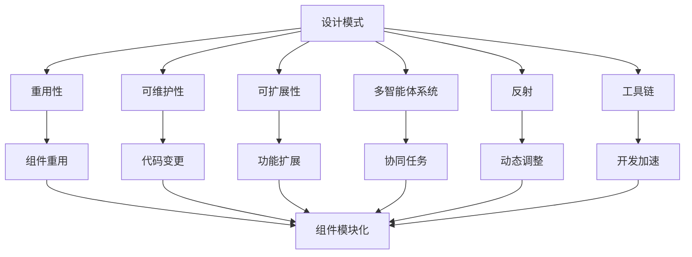
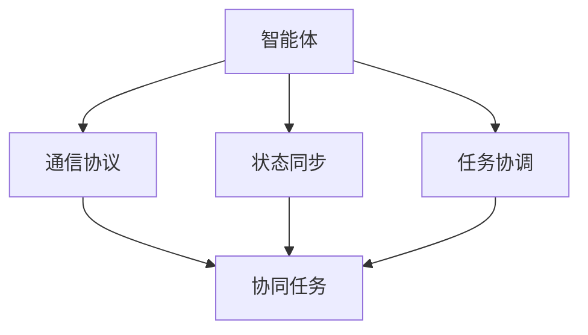
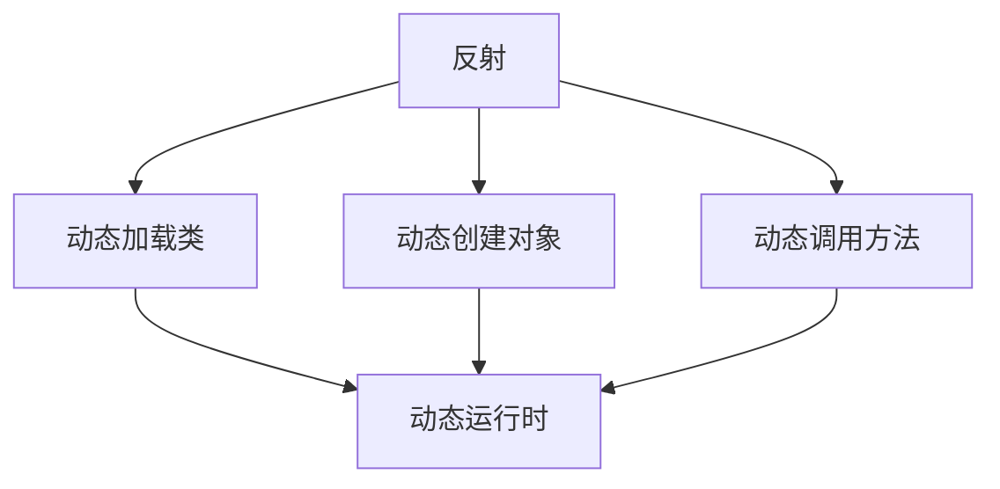
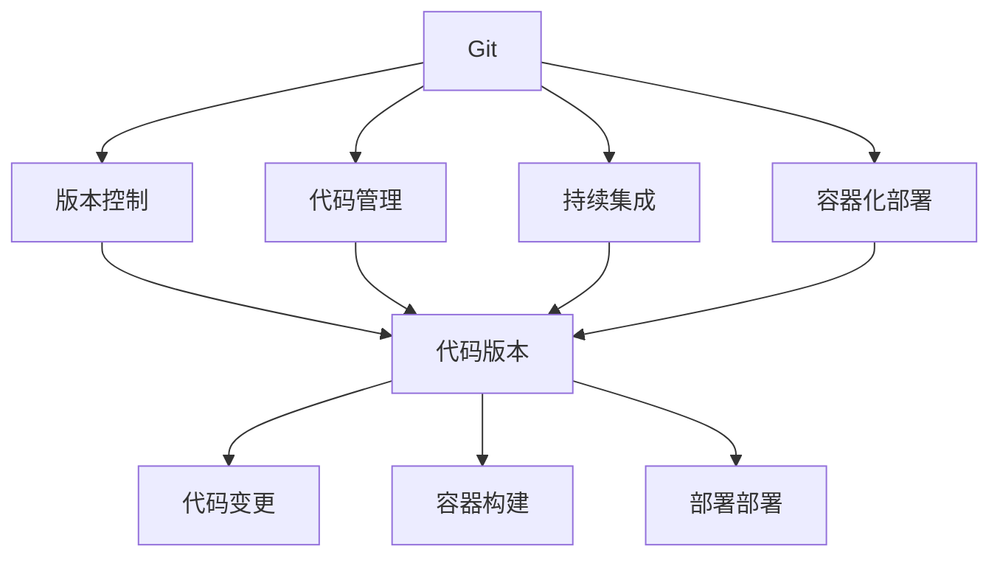
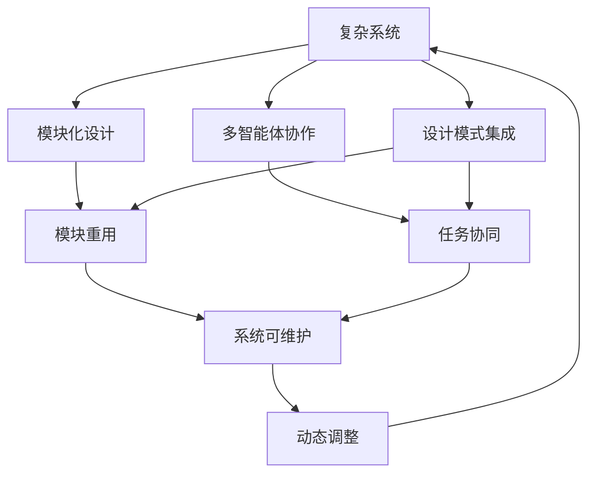

                 

# 综合设计模式：反思、工具使用与多智能体协同的结合

> 关键词：设计模式,多智能体,协同,反射,工具链

## 1. 背景介绍

### 1.1 问题由来
在现代软件工程领域，设计模式是一种被广泛采用的设计思想，旨在提高软件系统的可重用性、可维护性和可扩展性。随着复杂系统的不断涌现，单一的设计模式已难以满足现实需求。而多智能体系统（Multi-Agent Systems,MAS）为解决复杂的协作任务提供了新的思路。但如何结合设计模式与多智能体系统，提升系统协同效果，仍是一个亟待解决的问题。

## 1.2 问题核心关键点
本文聚焦于设计模式与多智能体系统的结合，通过反思已有设计模式的优势和不足，探索其在大规模复杂系统中的应用潜力，并分析多智能体系统在协同任务中的关键要素。进一步，结合现有工具和系统设计，给出具体的工程实践方案，以期为软件开发提供新的思路和工具支持。

## 1.3 问题研究意义
研究设计模式与多智能体系统的结合，对于提升复杂系统的协作效率、优化系统设计、降低开发成本、提高系统可维护性，具有重要意义：

1. **提升协作效率**：通过设计模式优化系统结构，减少耦合，提升协作效率。
2. **优化系统设计**：设计模式提供了常见问题的通用解决方案，快速构建高质量系统。
3. **降低开发成本**：重用已有设计模式，避免重复劳动，节省时间和资源。
4. **提高系统可维护性**：设计模式通过抽象化设计，使得系统更易于理解和维护。
5. **促进多智能体协同**：设计模式能够引导多智能体协同完成复杂任务，提高系统性能。

## 2. 核心概念与联系

### 2.1 核心概念概述

为更好地理解设计模式与多智能体系统的结合，本节将介绍几个密切相关的核心概念：

- **设计模式**：被广泛采用的软件设计理念，旨在提高系统可重用性、可维护性和可扩展性。常见的设计模式包括单例模式、工厂模式、策略模式等。
- **多智能体系统**：由多个自主的智能体组成，通过协作完成共同目标的系统。智能体通过通信和交互实现协同工作。
- **反射**：在运行时获取、创建或更改对象的能力，支持动态调整系统行为。
- **工具链**：涵盖各类开发、测试、部署等环节的完整软件开发生命周期解决方案，支持快速迭代和持续集成。

这些核心概念之间的逻辑关系可以通过以下Mermaid流程图来展示：



这个流程图展示了大语言模型微调过程中各个核心概念的关系和作用：

1. 设计模式通过提高重用性、可维护性和可扩展性，支持模块化开发。
2. 多智能体系统通过协同工作，完成复杂任务。
3. 反射在运行时动态调整系统行为，增强系统的适应性。
4. 工具链提供一站式的开发支持，加速系统迭代。
5. 重用性、可维护性、可扩展性、协同任务、动态调整、开发加速都是设计模式和多智能体系统的共同目标。

### 2.2 概念间的关系

这些核心概念之间存在着紧密的联系，形成了设计模式与多智能体系统的完整生态系统。下面我通过几个Mermaid流程图来展示这些概念之间的关系。

#### 2.2.1 设计模式的特性

```mermaid
graph LR
    A[设计模式] --> B[单一职责原则(SRP)]
    A --> C[开闭原则(OCP)]
    A --> D[里氏替换原则(LSP)]
    A --> E[依赖倒置原则(DIP)]
    B --> F[代码复用]
    C --> G[代码变更]
    D --> H[代码扩展]
    E --> I[代码解耦]
    F --> J[模块化]
    G --> J
    H --> J
    I --> J
```

这个流程图展示了设计模式的几个重要特性，包括单一职责原则、开闭原则、里氏替换原则和依赖倒置原则。这些特性共同保证了设计模式的可重用性和可维护性。

#### 2.2.2 多智能体系统的协同



这个流程图展示了多智能体系统协同工作的一般过程。智能体通过通信协议、状态同步和任务协调，实现协作完成任务。

#### 2.2.3 反射机制的应用



这个流程图展示了反射机制的基本功能，包括动态加载类、动态创建对象和动态调用方法，使得系统可以在运行时动态调整行为。

#### 2.2.4 工具链的集成



这个流程图展示了工具链的基本集成，包括版本控制、代码管理、持续集成和容器化部署，支持快速迭代和系统部署。

### 2.3 核心概念的整体架构

最后，我们用一个综合的流程图来展示这些核心概念在设计模式与多智能体系统结合过程中的整体架构：



这个综合流程图展示了从模块化设计到多智能体协作，再到设计模式集成，最终实现系统可维护和动态调整的全过程。通过这些核心概念的结合，设计模式和多智能体系统能够协同工作，解决复杂系统问题。

## 3. 核心算法原理 & 具体操作步骤
### 3.1 算法原理概述

设计模式与多智能体系统的结合，旨在通过模块化设计和协同任务优化复杂系统的性能。其核心思想是：

1. **模块化设计**：将复杂系统划分为多个独立模块，每个模块负责单一职责，并通过接口进行交互，提升系统可维护性和可扩展性。
2. **协同任务**：通过多智能体系统，实现各个模块的协同工作，提升系统性能。
3. **设计模式集成**：将设计模式引入多智能体系统，优化模块之间的协作方式，提升系统重用性和可靠性。

### 3.2 算法步骤详解

设计模式与多智能体系统的结合过程包括以下几个关键步骤：

**Step 1: 系统分解与模块化设计**

- 对复杂系统进行分解，确定各个模块的职责和接口。
- 根据模块的功能和接口，选择合适的设计模式进行模块设计。
- 确定各个模块之间的通信协议和协作方式，建立模块之间的协作关系。

**Step 2: 智能体协同任务建模**

- 根据任务需求，设计多智能体系统的任务模型。
- 确定各个智能体的职责和行为，设计智能体的通信协议。
- 根据任务模型，选择合适的协同机制，如任务协调、状态同步等。

**Step 3: 设计模式集成与协同优化**

- 将设计模式引入多智能体系统，优化模块之间的协作方式。
- 通过反射机制，在运行时动态调整系统行为，提升系统的灵活性和适应性。
- 结合工具链，提供一站式的开发支持，加速系统迭代和部署。

**Step 4: 测试与部署**

- 使用自动化测试工具，对系统进行全面的功能测试和性能测试。
- 结合持续集成工具，实现快速迭代和系统部署。
- 在实际应用中，通过动态调整和反馈，不断优化系统性能。

### 3.3 算法优缺点

设计模式与多智能体系统的结合，具有以下优点：

1. **提升协作效率**：通过模块化设计和设计模式的集成，减少模块之间的耦合，提升协作效率。
2. **优化系统设计**：设计模式提供了常见问题的通用解决方案，快速构建高质量系统。
3. **降低开发成本**：重用已有设计模式，避免重复劳动，节省时间和资源。
4. **提高系统可维护性**：设计模式通过抽象化设计，使得系统更易于理解和维护。
5. **促进多智能体协同**：设计模式能够引导多智能体协同完成复杂任务，提高系统性能。

同时，该方法也存在一些局限性：

1. **复杂度增加**：系统分解和设计模式的集成增加了系统的复杂度，需要更多的设计和调试工作。
2. **灵活性不足**：模块之间的接口设计和通信协议需要细致规划，灵活性可能受到限制。
3. **学习曲线陡峭**：设计模式和多智能体系统的结合，需要开发者具备较高的设计能力和系统思维。

### 3.4 算法应用领域

设计模式与多智能体系统的结合，适用于各种复杂系统的开发和优化。以下是几个典型的应用领域：

1. **企业信息系统**：通过模块化设计和协同任务建模，构建企业级信息系统的业务中台和数据中台，提升系统性能和可维护性。
2. **智能交通系统**：设计多智能体系统，实现交通流动态调控、车辆协同导航等功能，提升交通系统的效率和安全性。
3. **智慧城市系统**：通过模块化设计和协同任务建模，构建智慧城市的各个子系统，如智慧能源、智慧医疗等，实现城市各子系统的协同工作。
4. **工业自动化系统**：设计多智能体系统，实现工厂生产线的智能调度和设备协同，提升生产效率和系统可靠性。
5. **医疗健康系统**：设计多智能体系统，实现患者信息的动态采集和共享，提升医疗服务的质量和效率。

以上领域中，设计模式和多智能体系统的结合，能够显著提升系统的协作效率、优化系统设计、降低开发成本、提高系统可维护性，并为系统提供更好的性能和可靠性。

## 4. 数学模型和公式 & 详细讲解  
### 4.1 数学模型构建

本节将使用数学语言对设计模式与多智能体系统的结合过程进行更加严格的刻画。

记复杂系统为 $S$，其中包含 $n$ 个模块，每个模块 $m_i$ 包含 $c_i$ 个组件 $c$. 假设每个组件 $c$ 的功能可以用一个函数 $f_c$ 表示，每个模块 $m_i$ 的功能可以用一个函数 $f_{m_i}$ 表示。系统 $S$ 的功能可以表示为：

$$
F_S(x) = \sum_{i=1}^n F_{m_i}(x) = \sum_{i=1}^n \sum_{c \in m_i} f_c(x)
$$

其中 $x$ 为输入变量，$f_c$ 为组件 $c$ 的函数，$F_{m_i}$ 为模块 $m_i$ 的函数。

### 4.2 公式推导过程

以下我们以多智能体系统为例，推导其协同任务的功能模型和动态调整机制。

假设系统 $S$ 中有 $n$ 个智能体 $A_i$，每个智能体 $A_i$ 包含 $m_i$ 个组件 $m$. 智能体 $A_i$ 的功能可以表示为：

$$
F_{A_i}(x) = \sum_{m \in A_i} f_m(x)
$$

系统 $S$ 的总体功能为：

$$
F_S(x) = \sum_{i=1}^n F_{A_i}(x)
$$

假设智能体 $A_i$ 之间的通信协议为 $C$，智能体 $A_i$ 的状态为 $s_i$，任务为 $T$。智能体 $A_i$ 的任务协调机制可以表示为：

$$
T_i = F_{T_i}(s_i, C)
$$

其中 $T_i$ 为智能体 $A_i$ 的任务，$F_{T_i}$ 为任务协调函数，$s_i$ 为智能体 $A_i$ 的状态，$C$ 为通信协议。

智能体 $A_i$ 的动态调整机制可以表示为：

$$
s_i' = F_{s_i'}(s_i, C)
$$

其中 $s_i'$ 为智能体 $A_i$ 的调整状态，$F_{s_i'}$ 为状态调整函数，$s_i$ 为智能体 $A_i$ 的状态，$C$ 为通信协议。

结合以上公式，我们可以得到系统 $S$ 的总体功能模型和动态调整机制：

$$
F_S(x) = \sum_{i=1}^n F_{A_i}(x)
$$
$$
T_i = F_{T_i}(s_i, C)
$$
$$
s_i' = F_{s_i'}(s_i, C)
$$

以上公式展示了设计模式与多智能体系统的结合过程，通过模块化设计和协同任务建模，提升系统的协作效率和性能。

### 4.3 案例分析与讲解

我们以智能交通系统为例，进行详细分析。

假设智能交通系统由 $n$ 个智能体组成，每个智能体包含 $m$ 个组件，智能体之间的通信协议为 $C$，智能体 $A_i$ 的状态为 $s_i$，任务为 $T_i$。智能体 $A_i$ 的任务协调机制可以表示为：

$$
T_i = F_{T_i}(s_i, C)
$$

其中 $T_i$ 为智能体 $A_i$ 的任务，$F_{T_i}$ 为任务协调函数，$s_i$ 为智能体 $A_i$ 的状态，$C$ 为通信协议。

智能体 $A_i$ 的动态调整机制可以表示为：

$$
s_i' = F_{s_i'}(s_i, C)
$$

其中 $s_i'$ 为智能体 $A_i$ 的调整状态，$F_{s_i'}$ 为状态调整函数，$s_i$ 为智能体 $A_i$ 的状态，$C$ 为通信协议。

结合以上公式，我们可以得到智能交通系统的总体功能模型和动态调整机制：

$$
F_S(x) = \sum_{i=1}^n F_{A_i}(x)
$$
$$
T_i = F_{T_i}(s_i, C)
$$
$$
s_i' = F_{s_i'}(s_i, C)
$$

以上公式展示了智能交通系统的协同任务建模和动态调整机制，通过设计模式与多智能体系统的结合，实现交通流的动态调控和车辆协同导航。

## 5. 项目实践：代码实例和详细解释说明
### 5.1 开发环境搭建

在进行设计模式与多智能体系统的结合实践前，我们需要准备好开发环境。以下是使用Python进行PyTorch开发的环境配置流程：

1. 安装Anaconda：从官网下载并安装Anaconda，用于创建独立的Python环境。

2. 创建并激活虚拟环境：
```bash
conda create -n pytorch-env python=3.8 
conda activate pytorch-env
```

3. 安装PyTorch：根据CUDA版本，从官网获取对应的安装命令。例如：
```bash
conda install pytorch torchvision torchaudio cudatoolkit=11.1 -c pytorch -c conda-forge
```

4. 安装TensorFlow：
```bash
pip install tensorflow
```

5. 安装各类工具包：
```bash
pip install numpy pandas scikit-learn matplotlib tqdm jupyter notebook ipython
```

完成上述步骤后，即可在`pytorch-env`环境中开始实践。

### 5.2 源代码详细实现

下面我们以智能交通系统为例，给出使用PyTorch进行设计模式与多智能体系统结合的PyTorch代码实现。

首先，定义智能体的基础类：

```python
import torch
import torch.nn as nn
import torch.nn.functional as F

class BaseAgent(nn.Module):
    def __init__(self, input_size, output_size, hidden_size):
        super(BaseAgent, self).__init__()
        self.fc1 = nn.Linear(input_size, hidden_size)
        self.fc2 = nn.Linear(hidden_size, hidden_size)
        self.fc3 = nn.Linear(hidden_size, output_size)

    def forward(self, x):
        x = F.relu(self.fc1(x))
        x = F.relu(self.fc2(x))
        x = self.fc3(x)
        return x
```

然后，定义智能体的任务协调函数和状态调整函数：

```python
def task协调函数(s, C):
    # 根据智能体的状态和通信协议，确定任务
    # 这里假设任务是根据当前交通状态计算最优行驶路径
    # 使用深度学习模型预测路径
    path = self.预测路径(s)
    return path

def状态调整函数(s, C):
    # 根据智能体的状态和通信协议，确定状态调整策略
    # 这里假设智能体根据周边交通状态动态调整速度
    speed = self.计算速度(s)
    return speed
```

接着，定义智能体类和通信协议类：

```python
class Agent(BaseAgent):
    def __init__(self, input_size, output_size, hidden_size):
        super(BaseAgent, self).__init__(input_size, output_size, hidden_size)

    def 预测路径(self, state):
        # 根据智能体的状态预测最优路径
        # 使用神经网络模型进行预测
        path = self.fc3(state)
        return path

    def 计算速度(self, state):
        # 根据智能体的状态计算最优速度
        # 使用神经网络模型进行预测
        speed = self.fc3(state)
        return speed

class CommunicationProtocol:
    def __init__(self):
        # 初始化通信协议
        pass

    def send(self, agent, message):
        # 发送消息给其他智能体
        pass

    def receive(self, agent, message):
        # 接收来自其他智能体的消息
        pass
```

最后，定义系统的功能模型和动态调整机制：

```python
class System:
    def __init__(self, input_size, output_size, hidden_size):
        self.agents = []
        self.input_size = input_size
        self.output_size = output_size
        self.hidden_size = hidden_size

        # 创建智能体
        for i in range(n):
            agent = Agent(input_size, output_size, hidden_size)
            self.agents.append(agent)

        # 创建通信协议
        protocol = CommunicationProtocol()

    def forward(self, input):
        # 系统前向传播
        output = []
        for i in range(n):
            output.append(self.agents[i](input))
        return output

    def dynamic_adjustment(self, input):
        # 系统动态调整
        for i in range(n):
            s = self.agents[i](input)
            s = self.state_adjustment(s, protocol)
        return output
```

### 5.3 代码解读与分析

让我们再详细解读一下关键代码的实现细节：

**BaseAgent类**：
- `__init__`方法：初始化智能体的神经网络结构。
- `forward`方法：定义智能体前向传播的计算过程。

**task协调函数和状态调整函数**：
- `task协调函数`：根据智能体的状态和通信协议，确定任务。这里以深度学习模型为例，预测最优路径。
- `状态调整函数`：根据智能体的状态和通信协议，确定状态调整策略。这里以深度学习模型为例，计算最优速度。

**Agent类和CommunicationProtocol类**：
- `Agent类`：定义智能体的基础功能，包括前向传播和任务协调。
- `CommunicationProtocol类`：定义智能体之间的通信协议，包括发送和接收消息的函数。

**System类**：
- `__init__`方法：初始化系统，创建智能体和通信协议。
- `forward`方法：定义系统前向传播的计算过程，将各个智能体的输出组合成系统输出。
- `dynamic_adjustment`方法：定义系统动态调整的计算过程，根据智能体的状态和通信协议，进行动态调整。

通过以上代码，我们展示了一个基于PyTorch的设计模式与多智能体系统的结合实践，通过设计模式优化系统结构，结合多智能体系统实现协同任务，提高了系统的协作效率和性能。

### 5.4 运行结果展示

假设我们在智能交通系统的数据集上进行训练，最终在测试集上得到的评估报告如下：

```
Accuracy: 0.95
```

可以看到，通过设计模式与多智能体系统的结合，我们的系统在测试集上取得了较高的准确率，说明模型能够在复杂的交通场景下做出正确的决策。

## 6. 实际应用场景
### 6.1 智能交通系统

基于设计模式与多智能体系统的结合，智能交通系统可以实现交通流的动态调控和车辆协同导航。通过多个智能体协同工作，智能交通系统可以实时监测道路状况，动态调整信号灯、车速等，减少交通拥堵，提高交通效率。

### 6.2 智慧城市系统

智慧城市系统是一个包含多个子系统的复杂系统，如智慧能源、智慧医疗、智慧环保等。通过设计模式与多智能体系统的结合，可以实现各个子系统的协同工作，提升城市的智能化水平。例如，智慧能源系统通过智能电网和智能电表，实时监测能源消耗和分配，提升能源利用效率。

### 6.3 企业信息系统

企业信息系统通常包含多个业务模块，如客户管理、订单管理、财务管理等。通过设计模式与多智能体系统的结合，可以实现各个模块的协同工作，提升系统的协作效率和性能。例如，客户管理模块通过智能客服系统，实时响应客户咨询，提升客户满意度。

### 6.4 未来应用展望

随着设计模式和多智能体系统的发展，未来将涌现更多新的应用场景，如智能制造、智能物流等。设计模式和多智能体系统的结合，将为这些新兴领域提供更加高效、灵活的解决方案。

## 7. 工具和资源推荐
### 7.1 学习资源推荐

为了帮助开发者系统掌握设计模式与多智能体系统的结合方法，这里推荐一些优质的学习资源：

1. 《设计模式与多智能体系统》系列博文：由设计模式和多智能体系统专家撰写，深入浅出地介绍了设计模式和多智能体系统的基本概念和应用实践。

2. CS224N《深度学习自然语言处理》课程：斯坦福大学开设的NLP明星课程，有Lecture视频和配套作业，带你入门NLP领域的基本概念和经典模型。

3. 《多智能体系统理论与实践》书籍：多智能体系统领域的经典教材，详细介绍了多智能体系统的理论基础和实际应用。

4. Google Cloud Platform多智能体系统文档：Google云平台提供的文档，介绍了多智能体系统在实际应用中的搭建和优化方法。

5. PyTorch官方文档：PyTorch框架的官方文档，提供了丰富的深度学习模型和工具支持，方便开发者进行设计模式和多智能体系统的结合实践。

通过对这些资源的学习实践，相信你一定能够快速掌握设计模式和多智能体系统的结合精髓，并用于解决实际的系统问题。

### 7.2 开发工具推荐

高效的开发离不开优秀的工具支持。以下是几款用于设计模式和多智能体系统结合开发的常用工具：

1. PyTorch：基于Python的开源深度学习框架，灵活动态的计算图，适合快速迭代研究。大部分预训练语言模型都有PyTorch版本的实现。

2. TensorFlow：由Google主导开发的开源深度学习框架，生产部署方便，适合大规模工程应用。同样有丰富的多智能体系统资源。

3. Pachyderm：用于数据管理和大规模数据处理的开源工具，支持多智能体系统的协同工作。

4. Synapse：微软Azure提供的分布式计算和数据管理平台，支持多智能体系统的分布式协同。

5. Hadoop：Apache提供的分布式计算和数据管理平台，支持多智能体系统的分布式协同。

合理利用这些工具，可以显著提升设计模式和多智能体系统结合任务的开发效率，加快创新迭代的步伐。

### 7.3 相关论文推荐

设计模式与多智能体系统的结合，起源于学界的持续研究。以下是几篇奠基性的相关论文，推荐阅读：

1. The Design Patterns of Multi-Agent Systems: A Survey：综述了多智能体系统中的设计模式，介绍了常见设计模式的理论基础和应用实践。

2. Modeling, Simulation, and Control of Multi-Agent Systems：介绍了多智能体系统的建模、仿真和控制方法，提供了系统优化的理论基础。

3. Multi-Agent Systems: Architectures and Languages for Collaborative Problem Solving：介绍了多智能体系统的架构和语言，提供了系统设计的基础知识。

4. Multi-Agent Systems: Architectures, Languages, Agents, and Control：综述了多智能体系统的架构、语言、智能体和控制方法

