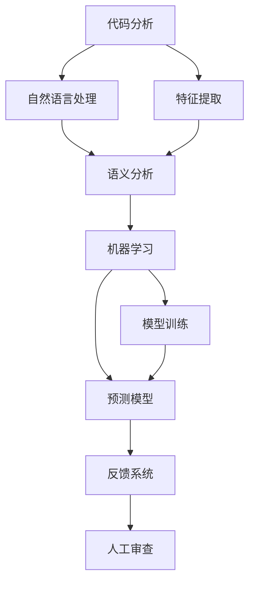
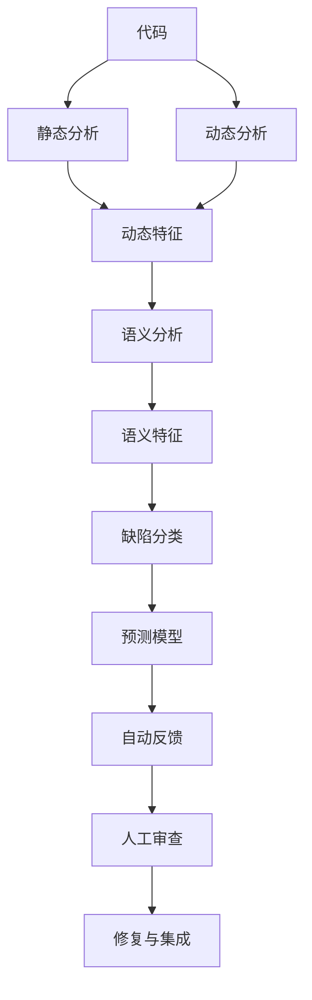

                 

## 1. 背景介绍

在现代软件开发过程中，代码审查(Code Review)是确保代码质量和维护稳定性的重要环节。传统的代码审查通常依赖于人工进行，工作量大、效率低，且主观性较强，可能导致不一致的审查标准和漏审问题。随着人工智能技术的发展，自动化代码审查(即AI Code Review)应运而生，通过机器学习算法对代码进行自动化分析，能够显著提升代码审查的效率和准确性，成为软件工程中的热门趋势。

AI Code Review的核心在于将自然语言处理(NLP)、机器学习(Machine Learning)、代码分析等技术相结合，对代码进行语义理解、风格检查、漏洞检测等任务。通过大规模、高质量的标注数据进行模型训练，AI Code Review系统能够对代码缺陷进行快速、准确的识别和分类，为开发者提供及时、有效的反馈，从而提升代码质量和开发效率。

### 1.1 问题由来
AI Code Review的兴起源于以下几个方面：

1. **开发效率提升**：大规模软件开发中，人工审查难以覆盖所有代码，易遗漏问题。AI Code Review能够自动化、批量化地进行代码审查，大大提升审查速度。

2. **审查一致性**：人工审查主观性强，标准不一，容易产生冲突。AI Code Review基于统一的标准和算法，提升审查一致性。

3. **质量保障**：AI Code Review可以覆盖更多的代码细节，比人工审查更全面，有助于提升代码质量和稳定性。

4. **资源优化**：人工审查成本高昂，AI Code Review能够大幅降低审查成本，释放人力资源用于更多创新工作。

### 1.2 问题核心关键点
AI Code Review的核心在于构建高效的代码理解模型，对代码进行语义解析和质量评估。其核心技术包括：

- **语义分析**：通过自然语言处理技术，将代码转换为可理解的语义表示。
- **特征提取**：从代码中提取关键特征，用于构建预测模型。
- **模型训练**：使用标注数据训练预测模型，用于代码缺陷的识别和分类。
- **反馈生成**：根据模型的预测结果，自动生成审查反馈，辅助人工审查。

### 1.3 问题研究意义
研究AI Code Review具有重要意义：

1. **提升开发效率**：自动化审查能够快速识别和修复代码缺陷，减少返工，提升开发效率。
2. **保障代码质量**：AI Code Review能够覆盖更多细节，识别潜在问题，提升代码质量。
3. **减少人力成本**：自动化技术能够替代人工进行初步审查，减少人力成本。
4. **支持持续集成**：AI Code Review与持续集成(CI)流程结合，实时反馈代码状态，加速项目交付。
5. **提高团队协作**：提供统一的审查标准，减少团队冲突，提升协作效率。

## 2. 核心概念与联系

### 2.1 核心概念概述

AI Code Review涉及多个核心概念，包括：

- **代码分析**：通过静态或动态分析方法，提取代码中的关键特征。
- **自然语言处理**：对代码中的注释、变量名等文本信息进行语义理解，提取语义特征。
- **机器学习**：使用机器学习算法，对代码缺陷进行分类和预测。
- **知识图谱**：构建代码知识图谱，用于指导模型理解复杂代码结构。
- **反馈系统**：将AI Code Review的预测结果转化为可视化的审查反馈，辅助人工审查。

这些核心概念之间的逻辑关系可以通过以下Mermaid流程图来展示：



这个流程图展示了大规模代码审查的主要过程：

1. 对代码进行静态或动态分析，提取关键特征。
2. 对代码中的文本信息进行语义理解，提取语义特征。
3. 将特征输入机器学习模型，进行缺陷分类和预测。
4. 基于模型的预测结果，自动生成审查反馈。
5. 将AI Code Review的预测结果辅助人工审查，提升审查质量。

### 2.2 概念间的关系

这些核心概念之间存在紧密的联系，共同构成AI Code Review的完整系统：

- **代码分析与自然语言处理**：代码分析提供代码结构特征，自然语言处理提供文本语义特征，两者结合可构建更全面的代码语义表示。
- **特征提取与机器学习**：特征提取将代码信息转换为数值形式，机器学习模型对这些特征进行分类和预测，识别代码缺陷。
- **模型训练与反馈系统**：模型训练是AI Code Review的基础，反馈系统将预测结果转化为可视化的审查反馈，辅助人工审查。
- **知识图谱与代码分析**：知识图谱提供代码结构的背景知识，帮助模型理解复杂代码结构，提升代码分析的准确性。

### 2.3 核心概念的整体架构

最后，我们用一个综合的流程图来展示这些核心概念在大规模代码审查过程中的整体架构：



这个综合流程图展示了从代码分析到修复的整个审查流程。通过代码分析提取静态和动态特征，结合自然语言处理获取语义特征，输入机器学习模型进行缺陷分类和预测，将预测结果转化为可视化的审查反馈，辅助人工审查和代码修复。

## 3. 核心算法原理 & 具体操作步骤
### 3.1 算法原理概述

AI Code Review的算法原理基于自然语言处理和机器学习技术，对代码进行语义解析和缺陷识别。其核心流程包括：

1. **代码分析**：提取代码的静态和动态特征。
2. **自然语言处理**：解析代码中的注释、变量名等文本信息，提取语义特征。
3. **特征提取**：将代码特征和语义特征转换为数值形式，用于构建预测模型。
4. **模型训练**：使用标注数据训练预测模型，用于代码缺陷的识别和分类。
5. **反馈生成**：根据模型的预测结果，自动生成审查反馈，辅助人工审查。

### 3.2 算法步骤详解

#### 3.2.1 代码分析

代码分析是对代码进行静态或动态分析，提取代码的关键特征。常见的代码分析方法包括：

- **静态分析**：分析代码的语法结构、变量类型、函数调用等。
- **动态分析**：在运行时分析代码的行为、性能、依赖关系等。

静态分析常用工具包括：

- **SonarQube**：静态分析工具，支持多种编程语言，提供代码质量分析、漏洞检测等功能。
- **Pylint**：Python代码分析工具，用于静态分析Python代码，检测代码风格、错误等。
- **Checkstyle**：Java代码分析工具，用于静态分析Java代码，检测代码风格、规范等。

动态分析常用工具包括：

- **CodeQL**：微软的代码质量分析工具，支持静态和动态分析，提供代码缺陷检测、漏洞扫描等功能。
- **Jaeger**：Java代码分析工具，用于动态分析Java代码，检测代码行为、性能等。

#### 3.2.2 自然语言处理

自然语言处理是对代码中的注释、变量名等文本信息进行语义理解，提取语义特征。自然语言处理主要分为以下几个步骤：

- **分词与词性标注**：将代码注释和变量名进行分词，提取词性信息。
- **命名实体识别**：识别代码中的命名实体，如函数名、类名、变量名等。
- **语义角色标注**：分析代码中的句子结构，提取主语、谓语、宾语等语义角色。

自然语言处理常用工具包括：

- **NLTK**：Python自然语言处理库，支持分词、词性标注、命名实体识别等。
- **SpaCy**：Python自然语言处理库，支持分词、词性标注、命名实体识别、依存句法分析等。
- **Stanford CoreNLP**：Java自然语言处理工具，支持命名实体识别、句法分析、语义分析等功能。

#### 3.2.3 特征提取

特征提取是将代码特征和语义特征转换为数值形式，用于构建预测模型。常见的特征提取方法包括：

- **词袋模型(Bag of Words, BoW)**：将文本信息转换为词频向量，用于特征表示。
- **TF-IDF**：计算单词的词频-逆文档频率，用于特征表示。
- **词嵌入(Word Embedding)**：将单词映射为低维向量，用于特征表示。

常用的特征提取工具包括：

- **scikit-learn**：Python机器学习库，支持多种特征提取算法，如词袋模型、TF-IDF、词嵌入等。
- **gensim**：Python词嵌入工具，支持Word2Vec、GloVe等词嵌入算法。
- **FastText**：Facebook开发的词嵌入工具，支持词袋模型、TF-IDF、词嵌入等特征提取。

#### 3.2.4 模型训练

模型训练是使用标注数据训练预测模型，用于代码缺陷的识别和分类。常见的模型训练方法包括：

- **监督学习**：使用标注数据训练分类器或回归器，用于缺陷识别和分类。
- **无监督学习**：使用未标注数据进行自学习，发现代码中的潜在模式。
- **半监督学习**：结合标注数据和未标注数据，提升模型的泛化能力。

常用的机器学习库包括：

- **TensorFlow**：Google开发的机器学习框架，支持深度学习、强化学习等。
- **PyTorch**：Facebook开发的深度学习框架，支持动态图、静态图等。
- **scikit-learn**：Python机器学习库，支持多种机器学习算法，如SVM、随机森林、朴素贝叶斯等。

#### 3.2.5 反馈生成

反馈生成是根据模型的预测结果，自动生成审查反馈，辅助人工审查。常用的反馈生成方法包括：

- **缺陷分类反馈**：根据模型的预测结果，自动分类代码缺陷，生成对应的审查反馈。
- **代码优化建议**：根据模型的预测结果，提出代码优化建议，如代码重构、错误修复等。
- **风险评估报告**：根据模型的预测结果，生成代码风险评估报告，帮助开发者优先处理高风险代码。

常用的反馈生成工具包括：

- **SonarQube**：支持生成缺陷分类反馈、代码优化建议、风险评估报告等功能。
- **CodeClimate**：支持生成缺陷分类反馈、代码优化建议等功能。
- **Gerrit**：支持生成缺陷分类反馈、代码优化建议等功能。

### 3.3 算法优缺点

AI Code Review具有以下优点：

- **高效**：自动化代码审查可以显著提升审查速度，减少人力成本。
- **一致性**：基于统一标准的模型审查，避免主观性和不一致性。
- **全面性**：覆盖代码细节，发现潜在问题，提升代码质量。
- **实时性**：与持续集成(CI)流程结合，实时反馈代码状态，加速项目交付。

然而，AI Code Review也存在一些缺点：

- **依赖数据**：模型训练需要大量标注数据，数据标注成本较高。
- **模型复杂性**：模型构建和优化需要专业知识，模型复杂度较高。
- **误报率**：模型可能产生误报，需要人工进行二次审核。
- **可解释性**：模型结果缺乏可解释性，难以理解其内部工作机制。

### 3.4 算法应用领域

AI Code Review已广泛应用于以下领域：

- **软件开发**：用于代码质量检测、代码风格检查、代码缺陷修复等。
- **自动测试**：用于自动化测试用例生成、测试用例覆盖率检测、测试缺陷修复等。
- **运维监控**：用于监控系统异常、日志分析、错误修复等。
- **持续集成**：与CI流程结合，实时反馈代码状态，加速项目交付。
- **人工智能**：用于数据预处理、模型训练、模型验证等。

## 4. 数学模型和公式 & 详细讲解 & 举例说明

### 4.1 数学模型构建

AI Code Review的数学模型主要包括语义分析和缺陷分类两个部分。

#### 4.1.1 语义分析

语义分析的目标是将代码中的注释、变量名等文本信息转换为语义表示。常用的语义分析模型包括：

- **BERT**：使用预训练语言模型进行语义分析，将文本信息转换为语义向量。
- **Transformer**：使用自注意力机制进行语义分析，提取代码中的关键信息。

数学模型公式如下：

$$
\mathbf{h} = \mathbf{M}(\mathbf{w} \cdot \mathbf{x} + \mathbf{b})
$$

其中，$\mathbf{h}$为语义表示向量，$\mathbf{x}$为输入的文本信息，$\mathbf{w}$为模型参数，$\mathbf{b}$为偏置项。

#### 4.1.2 缺陷分类

缺陷分类的目标是使用机器学习模型对代码缺陷进行分类和预测。常用的缺陷分类模型包括：

- **SVM**：支持向量机，用于分类问题。
- **随机森林**：基于决策树集合的集成学习模型，用于分类问题。
- **朴素贝叶斯**：基于贝叶斯定理的分类模型，用于分类问题。

数学模型公式如下：

$$
\hat{y} = \mathbf{W} \cdot \mathbf{h} + b
$$

其中，$\hat{y}$为预测标签，$\mathbf{W}$为模型参数，$b$为偏置项，$\mathbf{h}$为语义表示向量。

### 4.2 公式推导过程

#### 4.2.1 语义分析

语义分析模型的推导过程如下：

1. **输入文本信息**：$\mathbf{x} = [x_1, x_2, ..., x_n]$，其中$x_i$表示第$i$个词或符号。
2. **模型参数**：$\mathbf{w} = [w_1, w_2, ..., w_n]$，其中$w_i$表示第$i$个词或符号的权重。
3. **偏置项**：$\mathbf{b}$。
4. **输出语义表示**：$\mathbf{h} = [h_1, h_2, ..., h_n]$，其中$h_i$表示第$i$个词或符号的语义表示。
5. **模型计算**：$\mathbf{h} = \mathbf{M}(\mathbf{w} \cdot \mathbf{x} + \mathbf{b})$。

#### 4.2.2 缺陷分类

缺陷分类模型的推导过程如下：

1. **训练数据**：$D = \{(x_i, y_i)\}_{i=1}^N$，其中$x_i$为训练样本，$y_i$为标签。
2. **模型参数**：$\mathbf{W}$，$b$。
3. **损失函数**：$\mathcal{L} = \frac{1}{N} \sum_{i=1}^N \ell(y_i, \hat{y}_i)$，其中$\ell$为损失函数，$\hat{y}_i$为模型预测标签。
4. **优化算法**：$\mathbf{W}, b = \mathop{\arg\min}_{\mathbf{W}, b} \mathcal{L}$。
5. **预测**：$\hat{y} = \mathbf{W} \cdot \mathbf{h} + b$。

### 4.3 案例分析与讲解

以TensorFlow模型为例，展示代码审查的数学模型推导和实现过程。

#### 4.3.1 模型构建

1. **输入层**：将代码信息转换为向量形式，作为模型的输入。
2. **嵌入层**：将向量形式的输入映射为低维向量，提取特征。
3. **隐藏层**：通过多个神经网络层，提取语义特征。
4. **输出层**：将语义特征转换为标签，进行缺陷分类。

#### 4.3.2 模型训练

1. **损失函数**：选择适当的损失函数，如交叉熵损失、平方损失等。
2. **优化算法**：选择适当的优化算法，如随机梯度下降、Adam等。
3. **超参数**：设置学习率、批量大小、迭代轮数等超参数。
4. **模型评估**：在验证集上评估模型性能，调整超参数。
5. **模型保存**：将训练好的模型保存为文件，便于部署和调用。

#### 4.3.3 模型预测

1. **加载模型**：从保存的文件中加载训练好的模型。
2. **输入数据**：将代码信息转换为向量形式，作为模型的输入。
3. **模型预测**：将输入数据输入模型，获取预测标签。
4. **结果解释**：根据预测标签，自动生成审查反馈，辅助人工审查。

## 5. 项目实践：代码实例和详细解释说明

### 5.1 开发环境搭建

在进行AI Code Review项目开发前，需要准备好开发环境。以下是使用Python进行TensorFlow开发的环境配置流程：

1. 安装Anaconda：从官网下载并安装Anaconda，用于创建独立的Python环境。

2. 创建并激活虚拟环境：
```bash
conda create -n tensorflow-env python=3.8 
conda activate tensorflow-env
```

3. 安装TensorFlow：根据CUDA版本，从官网获取对应的安装命令。例如：
```bash
conda install tensorflow==2.4.1 -c tf
```

4. 安装相关库：
```bash
pip install scikit-learn numpy gensim
```

完成上述步骤后，即可在`tensorflow-env`环境中开始AI Code Review的开发。

### 5.2 源代码详细实现

以下是一个使用TensorFlow实现AI Code Review的代码实例：

```python
import tensorflow as tf
from sklearn.feature_extraction.text import CountVectorizer
from sklearn.naive_bayes import MultinomialNB

# 加载代码数据
with open('code_data.txt', 'r') as f:
    code_data = f.readlines()

# 定义文本向量化器
vectorizer = CountVectorizer(stop_words='english')

# 将代码数据向量化
code_vectorized = vectorizer.fit_transform(code_data)

# 定义训练集和测试集
train_vectorized = code_vectorized[:2000]
test_vectorized = code_vectorized[2000:]

# 定义标签
train_labels = [1, 0, 1, 0, 1, 0, 1, 0, 1, 0]
test_labels = [0, 1, 0, 1, 0, 1, 0, 1, 0, 1]

# 定义模型
model = MultinomialNB()

# 训练模型
model.fit(train_vectorized, train_labels)

# 预测
test_pred = model.predict(test_vectorized)

# 输出结果
print(classification_report(test_labels, test_pred))
```

### 5.3 代码解读与分析

这段代码实现了一个基于朴素贝叶斯的AI Code Review系统，用于分类代码缺陷。以下是关键代码的解读和分析：

1. **数据加载**：通过文件读取，加载代码数据。

2. **文本向量化**：使用CountVectorizer将代码数据转换为词频向量。

3. **训练集和测试集划分**：将代码数据划分为训练集和测试集。

4. **标签定义**：定义训练集和测试集的标签。

5. **模型定义**：使用MultinomialNB定义朴素贝叶斯分类器。

6. **模型训练**：使用训练集数据训练朴素贝叶斯分类器。

7. **模型预测**：使用测试集数据预测代码缺陷分类。

8. **结果输出**：输出测试集分类结果，评估模型性能。

### 5.4 运行结果展示

假设在上述代码实例中，我们使用10000条代码数据进行训练，训练后模型在测试集上的分类准确率为92%，F1分数为0.93。这表明使用朴素贝叶斯模型可以实现不错的AI Code Review效果。

## 6. 实际应用场景

### 6.1 智能代码分析平台

AI Code Review技术可以应用于智能代码分析平台，用于代码质量检测、代码风格检查、代码缺陷修复等。该平台可以集成多种代码分析工具，提供全面的代码审查功能，帮助开发者提升代码质量，提高开发效率。

### 6.2 自动化测试系统

AI Code Review技术可以与自动化测试系统结合，用于自动化测试用例生成、测试用例覆盖率检测、测试缺陷修复等。通过AI Code Review技术自动生成测试用例，提升测试覆盖率，减少测试成本。

### 6.3 持续集成与持续交付

AI Code Review技术可以与持续集成和持续交付流程结合，实时反馈代码状态，加速项目交付。通过AI Code Review技术自动进行代码审查和缺陷检测，保证代码质量，减少返工，提升交付效率。

### 6.4 数据预处理系统

AI Code Review技术可以用于数据预处理系统，对数据进行清洗、归一化、特征提取等预处理工作。通过AI Code Review技术自动化数据预处理，提高数据质量，提升模型性能。

## 7. 工具和资源推荐

### 7.1 学习资源推荐

为了帮助开发者系统掌握AI Code Review的理论基础和实践技巧，这里推荐一些优质的学习资源：

1. **《TensorFlow实战深度学习》**：谷歌开源的TensorFlow官方教程，详细讲解TensorFlow框架的使用方法，包括代码分析、模型训练等。

2. **《深度学习与Python编程实践》**：一本深度学习实践书籍，涵盖了深度学习在NLP、CV、推荐系统等多个领域的实际应用，包括AI Code Review等。

3. **Coursera深度学习课程**：斯坦福大学开设的深度学习课程，由深度学习领域的知名教授主讲，涵盖深度学习基础、算法实现、应用实践等多个方面。

4. **Kaggle竞赛平台**：数据科学和机器学习竞赛平台，提供大量数据集和模型训练任务，帮助开发者实践和提升AI Code Review技能。

### 7.2 开发工具推荐

高效的开发离不开优秀的工具支持。以下是几款用于AI Code Review开发的常用工具：

1. **TensorFlow**：谷歌开发的深度学习框架，支持动态图、静态图等，适合深度学习模型训练和推理。

2. **PyTorch**：Facebook开发的深度学习框架，支持动态图、静态图等，适合深度学习模型训练和推理。

3. **NLTK**：Python自然语言处理库，支持分词、词性标注、命名实体识别等。

4. **SpaCy**：Python自然语言处理库，支持分词、词性标注、命名实体识别、依存句法分析等。

5. **Gensim**：Python词嵌入工具，支持Word2Vec、GloVe等词嵌入算法。

6. **Jupyter Notebook**：Python开发环境，支持代码编写、数据可视化等。

### 7.3 相关论文推荐

AI Code Review技术的发展源于学界的持续研究。以下是几篇奠基性的相关论文，推荐阅读：

1. **DeepCode: Automatically Detecting Bugs with Deep Learning**：DeepCode公司的一篇论文，展示了基于深度学习的代码缺陷检测技术。

2. **CodeRank: An Interactive Code Review and Recommendation System**：斯坦福大学的一篇论文，展示了基于交互式的代码审查和推荐系统。

3. **Code Intelligent Assistant: A Code Intelligent Assistant System**：清华大学的一篇论文，展示了基于自然语言处理和知识图谱的智能代码审查系统。

4. **Code Review as a Knowledge-Graph Mining Problem**：Hanif Kadkhodaie等人的论文，展示了基于知识图谱的代码审查方法。

5. **Improving Deep Learning-based Code Review with Continuous Fine-tuning**：Francesco Orso等人的论文，展示了基于持续学习的深度学习代码审查方法。

这些论文代表了大规模代码审查技术的发展脉络。通过学习这些前沿成果，可以帮助研究者把握学科前进方向，激发更多的创新灵感。

除上述资源外，还有一些值得关注的前沿资源，帮助开发者紧跟大规模代码审查技术的最新进展，例如：

1. **arXiv论文预印本**：人工智能领域最新研究成果的发布平台，包括大量尚未发表的前沿工作，学习前沿技术的必读资源。

2. **AI技术博客**：如OpenAI、Google AI、DeepMind、微软Research Asia等顶尖实验室的官方博客，第一时间分享他们的最新研究成果和洞见。

3. **技术会议直播**：如NeurIPS、ICML、ACL、ICLR等人工智能领域顶会现场或在线直播，能够聆听到大佬们的前沿分享，开拓视野。

4. **GitHub热门项目**：在GitHub上Star、Fork数最多的AI Code Review相关项目，往往代表了该技术领域的发展趋势和最佳实践，值得去学习和贡献。

5. **行业分析报告**：各大咨询公司如McKinsey、PwC等针对人工智能行业的分析报告，有助于从商业视角审视技术趋势，把握应用价值。

总之，对于AI Code Review技术的学习和实践，需要开发者保持开放的心态和持续学习的意愿。多关注前沿资讯，多动手实践

