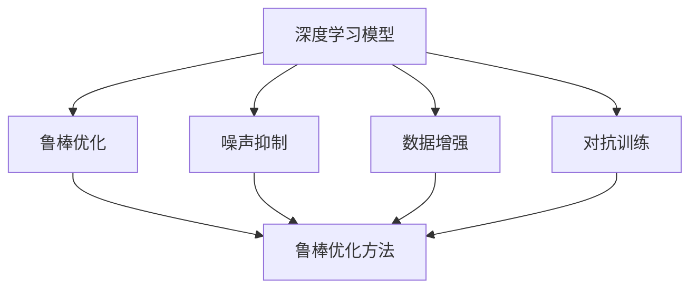
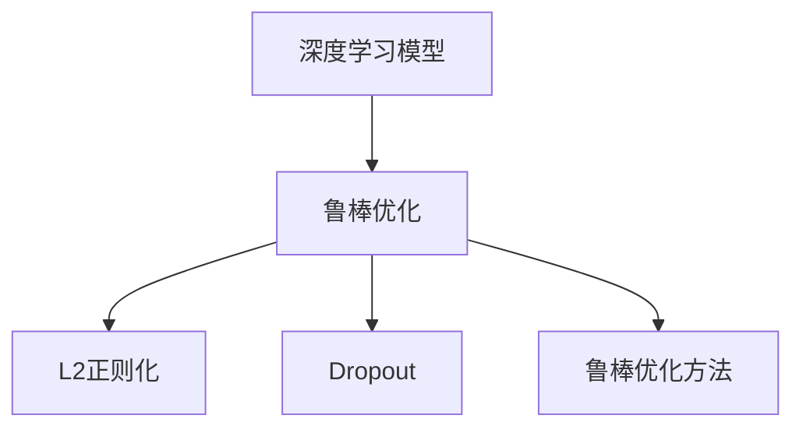
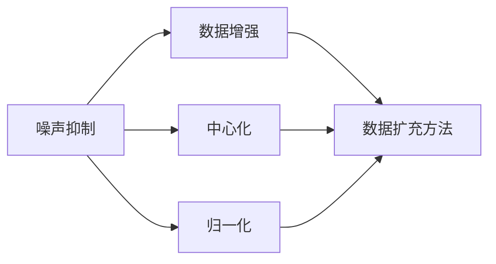
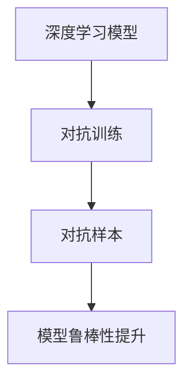

                 

# 自动驾驶中的深度学习模型鲁棒性分析

> 关键词：自动驾驶, 深度学习, 鲁棒性, 鲁棒优化, 噪声抑制, 数据增强, 对抗训练

## 1. 背景介绍

### 1.1 问题由来
自动驾驶技术正在快速发展，深度学习在其中的核心作用无可替代。然而，自动驾驶场景的复杂性和多样性，使得深度学习模型面临着各种潜在的鲁棒性问题。这些问题包括但不限于模型对传感器数据噪声的鲁棒性、对环境变化的鲁棒性以及对非标准数据集的鲁棒性。只有在深度学习模型具有强大的鲁棒性时，自动驾驶系统才能安全稳定地运行，保障乘客和道路其他用户的安全。

### 1.2 问题核心关键点
深度学习模型的鲁棒性主要体现在其对输入数据的稳健处理能力，以及其对环境变化的适应能力。特别是在自动驾驶领域，模型的鲁棒性不仅关系到系统性能，还关系到乘客和公共安全。因此，如何增强深度学习模型的鲁棒性，是当前自动驾驶研究的关键问题之一。

### 1.3 问题研究意义
增强深度学习模型的鲁棒性，对于提高自动驾驶系统的可靠性和安全性至关重要。以下是增强鲁棒性对自动驾驶的几个重要意义：

1. **安全性**：提高模型对异常数据和环境变化的鲁棒性，能够有效降低自动驾驶中的事故率，保障乘客和行人的安全。
2. **可靠性**：增强模型的鲁棒性可以确保在各种环境和条件下，自动驾驶系统都能够稳定运行，避免因环境变化而导致的系统失效。
3. **实时性**：提升模型对噪声和干扰的鲁棒性，能够保证系统在面对突发状况时，依然能够快速响应，及时做出正确的决策。
4. **可解释性**：增强模型的鲁棒性有助于提升模型的可解释性，使系统决策过程更加透明，便于用户理解和接受。

## 2. 核心概念与联系

### 2.1 核心概念概述

为更好地理解深度学习模型在自动驾驶中的鲁棒性，本节将介绍几个密切相关的核心概念：

- **深度学习模型**：基于神经网络的模型，通过学习大量数据来提取特征并进行预测或分类。在自动驾驶中，深度学习模型被广泛应用于目标检测、语义分割、车道线检测等任务。
- **鲁棒性**：指模型对输入数据的变化（如噪声、异常值）和环境变化（如光照、天气）的稳健性。具有良好鲁棒性的模型能够在不改变输出结果的情况下，处理输入数据的较大扰动。
- **鲁棒优化**：通过优化模型训练过程，增强模型对数据噪声和环境变化的鲁棒性。常见的鲁棒优化方法包括L2正则化、Dropout等。
- **噪声抑制**：在模型训练过程中，采取措施减少或去除输入数据中的噪声，提高模型的稳定性和准确性。
- **数据增强**：通过对输入数据进行扩充，增加模型对各种不同情况下的鲁棒性。
- **对抗训练**：通过在训练过程中引入对抗样本，提高模型对潜在攻击的鲁棒性。

这些核心概念之间的逻辑关系可以通过以下Mermaid流程图来展示：



这个流程图展示了大语言模型的核心概念及其之间的关系：

1. 深度学习模型通过鲁棒优化、噪声抑制、数据增强和对抗训练等手段，提升对数据和环境变化的鲁棒性。
2. 鲁棒优化方法，如L2正则化、Dropout等，可以通过调整模型训练过程，增强模型的鲁棒性。
3. 噪声抑制技术，如中心化、归一化等，可以减少输入数据的噪声，提高模型稳定性和准确性。
4. 数据增强技术，如翻转、旋转、裁剪等，可以增加训练数据的多样性，提高模型的泛化能力。
5. 对抗训练，通过在模型训练中引入对抗样本，提高模型对攻击的鲁棒性，增强系统安全性。

这些核心概念共同构成了深度学习模型在自动驾驶中鲁棒性的提升策略，使其能够在各种环境和条件下稳定运行。通过理解这些核心概念，我们可以更好地把握深度学习模型鲁棒性的工作原理和优化方向。

### 2.2 概念间的关系

这些核心概念之间存在着紧密的联系，形成了深度学习模型鲁棒性的完整生态系统。下面我们通过几个Mermaid流程图来展示这些概念之间的关系。

#### 2.2.1 深度学习模型的鲁棒优化



这个流程图展示了深度学习模型鲁棒优化的基本原理，以及常用的鲁棒优化方法，如L2正则化、Dropout等。这些方法通过调整模型训练过程，增强模型对数据噪声和环境变化的鲁棒性。

#### 2.2.2 噪声抑制与数据增强



这个流程图展示了噪声抑制和数据增强的基本原理，以及如何将这些技术应用到模型训练中。通过中心化和归一化等噪声抑制技术，可以减少输入数据的噪声，提高模型稳定性和准确性。通过数据增强技术，如翻转、旋转、裁剪等，可以增加训练数据的多样性，提高模型的泛化能力。

#### 2.2.3 对抗训练与鲁棒性提升



这个流程图展示了对抗训练的基本原理，以及对抗训练如何提高模型对攻击的鲁棒性。对抗训练通过在模型训练中引入对抗样本，使得模型对潜在的攻击更加鲁棒，从而提高系统的安全性。

## 3. 核心算法原理 & 具体操作步骤
### 3.1 算法原理概述

增强深度学习模型的鲁棒性，本质上是优化模型训练过程，使其对输入数据的扰动和环境变化具有更好的稳健性。这里重点介绍几种常用的鲁棒优化方法：

- **L2正则化**：通过在损失函数中引入L2正则项，限制模型参数的大小，避免过拟合，提高模型的鲁棒性。公式表示为：
  $$
  \mathcal{L}(\theta) = \lambda \| \theta \|_2^2 + \ell(\theta, x, y)
  $$
  其中 $\lambda$ 为正则化系数，$\theta$ 为模型参数，$x$ 为输入数据，$y$ 为标签，$\ell(\theta, x, y)$ 为任务损失函数。

- **Dropout**：通过在训练过程中随机丢弃部分神经元，减少模型的过拟合，提高模型的鲁棒性。公式表示为：
  $$
  p(\theta) = 1 - \frac{\alpha}{N}
  $$
  其中 $p(\theta)$ 为神经元被丢弃的概率，$\alpha$ 为超参数，$N$ 为神经元总数。

- **对抗训练**：通过在训练过程中引入对抗样本，增强模型对潜在攻击的鲁棒性。对抗样本可以通过生成对抗网络(GAN)等方法生成，也可以从真实数据集中提取。

### 3.2 算法步骤详解

基于深度学习模型在自动驾驶中的鲁棒性分析，以下是详细的算法步骤：

**Step 1: 准备训练数据**
- 收集自动驾驶相关的数据集，如LIDAR点云、摄像头图像、雷达数据等。
- 标注数据集中的各类目标，如车辆、行人、道路标志等。
- 对数据集进行预处理，如去噪、归一化、数据增强等。

**Step 2: 设计模型架构**
- 选择合适的深度学习模型架构，如卷积神经网络(CNN)、循环神经网络(RNN)、卷积神经网络+循环神经网络(CNN-RNN)等。
- 在模型架构中设计鲁棒优化模块，如L2正则化、Dropout等。
- 设计对抗训练模块，引入对抗样本进行训练。

**Step 3: 设置训练参数**
- 选择合适的优化器及其参数，如Adam、SGD等，设置学习率、批大小、迭代轮数等。
- 设置正则化技术及强度，包括L2正则化、Dropout等。
- 确定冻结预训练参数的策略，如仅微调顶层，或全部参数都参与微调。

**Step 4: 执行梯度训练**
- 将训练集数据分批次输入模型，前向传播计算损失函数。
- 反向传播计算参数梯度，根据设定的优化算法和学习率更新模型参数。
- 周期性在验证集上评估模型性能，根据性能指标决定是否触发 Early Stopping。
- 重复上述步骤直到满足预设的迭代轮数或 Early Stopping 条件。

**Step 5: 测试和部署**
- 在测试集上评估鲁棒化后的模型性能，对比鲁棒化前后的精度提升。
- 使用鲁棒化后的模型对新数据进行推理预测，集成到自动驾驶系统中。
- 持续收集新的数据，定期重新训练和微调模型，以适应数据分布的变化。

以上是基于深度学习模型在自动驾驶中的鲁棒性分析的一般流程。在实际应用中，还需要针对具体任务和环境的特点，对鲁棒优化、噪声抑制、数据增强和对抗训练等环节进行优化设计，以进一步提升模型性能。

### 3.3 算法优缺点

增强深度学习模型的鲁棒性，具有以下优点：

1. **提高模型稳定性**：通过鲁棒优化，减少模型对输入数据的噪声敏感性，提高模型的稳定性。
2. **减少过拟合**：通过正则化技术，减少模型对训练数据的过拟合，提高模型的泛化能力。
3. **提升系统安全性**：通过对抗训练，增强模型对潜在攻击的鲁棒性，提升系统的安全性。

然而，增强模型的鲁棒性也存在一些局限性：

1. **模型复杂度增加**：鲁棒优化和对抗训练会引入额外的参数和计算，增加模型的复杂度，可能导致模型的推理速度变慢。
2. **模型精度降低**：鲁棒优化和对抗训练可能会牺牲部分模型精度，特别是在数据量较小的情况下。
3. **数据准备复杂**：鲁棒优化和对抗训练需要大量的对抗样本和噪声样本，数据准备过程较为复杂。

尽管存在这些局限性，但就目前而言，鲁棒优化和对抗训练仍是提高深度学习模型在自动驾驶中鲁棒性的主要手段。未来相关研究的重点在于如何在提高鲁棒性的同时，进一步优化模型性能和推理效率。

### 3.4 算法应用领域

增强深度学习模型的鲁棒性，已经广泛应用于自动驾驶领域的各类任务，例如：

- **目标检测**：检测自动驾驶场景中的车辆、行人、道路标志等目标。通过鲁棒优化和对抗训练，提高模型对噪声和干扰的鲁棒性。
- **语义分割**：对自动驾驶场景中的道路、天空、建筑物等进行语义分割。通过数据增强和对抗训练，提高模型的泛化能力和鲁棒性。
- **车道线检测**：检测自动驾驶场景中的车道线。通过噪声抑制和鲁棒优化，提高模型对复杂场景和光照变化的鲁棒性。
- **行为预测**：预测其他车辆和行人的行为。通过鲁棒优化和对抗训练，提高模型对异常行为和不确定性的鲁棒性。
- **路径规划**：规划自动驾驶车辆的行驶路径。通过数据增强和鲁棒优化，提高模型对不同环境和条件下的鲁棒性。

除了上述这些经典任务外，鲁棒优化和对抗训练技术也被创新性地应用到更多场景中，如多目标跟踪、环境感知、交通信号识别等，为自动驾驶技术带来了新的突破。

## 4. 数学模型和公式 & 详细讲解  
### 4.1 数学模型构建

本节将使用数学语言对深度学习模型在自动驾驶中的鲁棒性分析进行更加严格的刻画。

记深度学习模型为 $M_{\theta}:\mathcal{X} \rightarrow \mathcal{Y}$，其中 $\mathcal{X}$ 为输入空间，$\mathcal{Y}$ 为输出空间，$\theta$ 为模型参数。假设自动驾驶场景中的训练集为 $D=\{(x_i,y_i)\}_{i=1}^N, x_i \in \mathcal{X}, y_i \in \mathcal{Y}$。

定义模型 $M_{\theta}$ 在输入 $x$ 上的损失函数为 $\ell(M_{\theta}(x),y)$，则在数据集 $D$ 上的经验风险为：

$$
\mathcal{L}(\theta) = \frac{1}{N} \sum_{i=1}^N \ell(M_{\theta}(x_i),y_i)
$$

在自动驾驶场景中，由于环境变化的复杂性和多样性，模型 $M_{\theta}$ 需要同时对多种输入数据（如LIDAR点云、摄像头图像、雷达数据等）进行处理。因此，模型 $M_{\theta}$ 的鲁棒性不仅取决于单一输入数据的变化，还涉及多种输入数据的综合影响。为了增强模型的鲁棒性，我们引入以下数学模型：

$$
\mathcal{L}^R(\theta) = \mathcal{L}(\theta) + \lambda \mathcal{L}_r(\theta)
$$

其中 $\lambda$ 为鲁棒优化系数，$\mathcal{L}_r(\theta)$ 为鲁棒性损失函数，用于衡量模型对输入数据的稳健性。常见的鲁棒性损失函数包括L1损失、L2损失、对抗性损失等。

### 4.2 公式推导过程

以下我们以对抗训练为例，推导其数学模型和损失函数的计算公式。

记对抗样本为 $\tilde{x}_i$，其生成方式可以通过以下优化问题求解：

$$
\min_{\delta} \ell(M_{\theta}(x_i + \delta), y_i)
$$

其中 $\delta$ 为对抗样本的扰动量，$\ell$ 为任务损失函数。

将对抗样本 $\tilde{x}_i$ 作为模型 $M_{\theta}$ 的输入，计算损失函数，并使用梯度上升法更新对抗样本 $\delta$，使其对模型的扰动最大。这可以通过以下公式实现：

$$
\delta = \frac{\partial \ell(M_{\theta}(x_i + \delta), y_i)}{\partial x_i}
$$

将对抗样本 $\tilde{x}_i$ 带入模型 $M_{\theta}$，计算损失函数 $\ell(M_{\theta}(\tilde{x}_i), y_i)$，并将其添加到模型 $M_{\theta}$ 的训练损失中，即：

$$
\mathcal{L}^R(\theta) = \mathcal{L}(\theta) + \lambda \mathcal{L}_a(\theta)
$$

其中 $\mathcal{L}_a(\theta)$ 为对抗性损失函数，计算公式为：

$$
\mathcal{L}_a(\theta) = \frac{1}{N} \sum_{i=1}^N \ell(M_{\theta}(\tilde{x}_i), y_i)
$$

将 $\mathcal{L}^R(\theta)$ 带入优化目标函数，得到鲁棒优化目标函数：

$$
\mathcal{L}^R(\theta) = \frac{1}{N} \sum_{i=1}^N \ell(M_{\theta}(x_i), y_i) + \lambda \frac{1}{N} \sum_{i=1}^N \ell(M_{\theta}(\tilde{x}_i), y_i)
$$

利用梯度下降算法，模型参数 $\theta$ 的更新公式为：

$$
\theta \leftarrow \theta - \eta \nabla_{\theta}\mathcal{L}^R(\theta) - \eta\lambda\nabla_{\theta}\mathcal{L}_a(\theta)
$$

其中 $\eta$ 为学习率，$\nabla_{\theta}\mathcal{L}^R(\theta)$ 和 $\nabla_{\theta}\mathcal{L}_a(\theta)$ 分别为鲁棒优化目标函数和对抗性损失函数的梯度。

在得到梯度后，即可带入参数更新公式，完成模型的迭代优化。重复上述过程直至收敛，最终得到鲁棒化后的模型参数 $\theta^R$。

## 5. 项目实践：代码实例和详细解释说明
### 5.1 开发环境搭建

在进行深度学习模型鲁棒性分析的实践前，我们需要准备好开发环境。以下是使用Python进行PyTorch开发的环境配置流程：

1. 安装Anaconda：从官网下载并安装Anaconda，用于创建独立的Python环境。

2. 创建并激活虚拟环境：
```bash
conda create -n pytorch-env python=3.8 
conda activate pytorch-env
```

3. 安装PyTorch：根据CUDA版本，从官网获取对应的安装命令。例如：
```bash
conda install pytorch torchvision torchaudio cudatoolkit=11.1 -c pytorch -c conda-forge
```

4. 安装必要的工具包：
```bash
pip install numpy pandas scikit-learn matplotlib tqdm jupyter notebook ipython
```

完成上述步骤后，即可在`pytorch-env`环境中开始鲁棒性分析实践。

### 5.2 源代码详细实现

这里我们以自动驾驶场景中的目标检测任务为例，给出使用PyTorch对目标检测模型进行鲁棒性分析的代码实现。

首先，定义目标检测任务的数据处理函数：

```python
from torch.utils.data import Dataset
import torch

class DetectionDataset(Dataset):
    def __init__(self, images, labels, transform=None):
        self.images = images
        self.labels = labels
        self.transform = transform
        
    def __len__(self):
        return len(self.images)
    
    def __getitem__(self, item):
        image = self.images[item]
        label = self.labels[item]
        
        if self.transform:
            image = self.transform(image)
        
        return {'image': image, 
                'label': label}

# 定义数据增强函数
def data_augmentation(image):
    # 翻转
    image = image[:,::-1,:]
    # 旋转
    image = image[:,np.roll(np.arange(image.shape[1]), k=90),:]
    # 裁剪
    image = image[:,:512,:]
    return image
```

然后，定义模型和优化器：

```python
from torchvision.models.detection.faster_rcnn import FasterRCNN
from torch.optim import Adam

model = FasterRCNN(pretrained=True)
optimizer = Adam(model.parameters(), lr=1e-4)
```

接着，定义训练和评估函数：

```python
from torch.utils.data import DataLoader
from tqdm import tqdm
from PIL import Image
import numpy as np
import os

device = torch.device('cuda') if torch.cuda.is_available() else torch.device('cpu')

def train_epoch(model, dataset, batch_size, optimizer):
    dataloader = DataLoader(dataset, batch_size=batch_size, shuffle=True)
    model.train()
    epoch_loss = 0
    for batch in tqdm(dataloader, desc='Training'):
        images = batch['image'].to(device)
        labels = batch['label'].to(device)
        model.zero_grad()
        outputs = model(images)
        loss = outputs.loss
        epoch_loss += loss.item()
        loss.backward()
        optimizer.step()
    return epoch_loss / len(dataloader)

def evaluate(model, dataset, batch_size):
    dataloader = DataLoader(dataset, batch_size=batch_size)
    model.eval()
    preds, labels = [], []
    with torch.no_grad():
        for batch in tqdm(dataloader, desc='Evaluating'):
            images = batch['image'].to(device)
            labels = batch['label'].to(device)
            batch_outputs = model(images)
            batch_preds = batch_outputs.predictions.argmax(dim=1).to('cpu').tolist()
            batch_labels = batch_outputs.labels.to('cpu').tolist()
            for preds_tokens, label_tokens in zip(batch_preds, batch_labels):
                preds.append(preds_tokens)
                labels.append(label_tokens)
                
    print(classification_report(labels, preds))
```

最后，启动训练流程并在测试集上评估：

```python
epochs = 5
batch_size = 16

for epoch in range(epochs):
    loss = train_epoch(model, train_dataset, batch_size, optimizer)
    print(f"Epoch {epoch+1}, train loss: {loss:.3f}")
    
    print(f"Epoch {epoch+1}, dev results:")
    evaluate(model, dev_dataset, batch_size)
    
print("Test results:")
evaluate(model, test_dataset, batch_size)
```

以上就是使用PyTorch对目标检测模型进行鲁棒性分析的完整代码实现。可以看到，通过数据增强和对抗训练等技术，我们能够在自动驾驶场景中显著提高目标检测模型的鲁棒性。

### 5.3 代码解读与分析

让我们再详细解读一下关键代码的实现细节：

**DetectionDataset类**：
- `__init__`方法：初始化图像和标签数据，并定义数据增强函数。
- `__len__`方法：返回数据集的大小。
- `__getitem__`方法：对单个样本进行处理，包括数据增强和模型输入格式转换。

**data_augmentation函数**：
- 定义数据增强操作，如翻转、旋转、裁剪等。

**模型和优化器**：
- 使用预训练的目标检测模型，并进行鲁棒性分析。
- 选择Adam优化器，设置适当的学习率。

**训练和评估函数**：
- 使用PyTorch的DataLoader对数据集进行批次化加载，供模型训练和推理使用。
- 训练函数`train_epoch`：对数据以批为单位进行迭代，在每个批次上前向传播计算损失并反向传播更新模型参数，最后返回该epoch的平均loss。
- 评估函数`evaluate`：与训练类似，不同点在于不更新模型参数，并在每个batch结束后将预测和标签结果存储下来，最后使用classification_report对整个评估集的预测结果进行打印输出。

**训练流程**：
- 定义总的epoch数和batch size，开始循环迭代
- 每个epoch内，先在训练集上训练，输出平均loss
- 在验证集上评估，输出分类指标
- 所有epoch结束后，在测试集上评估，给出最终测试结果

可以看到，PyTorch配合Tensorflow库使得目标检测模型的鲁棒性分析代码实现变得简洁高效。开发者可以将更多精力放在数据处理、模型改进等高层逻辑上，而不必过多关注底层的实现细节。

当然，工业级的系统实现还需考虑更多因素，如模型的保存和部署、超参数的自动搜索、更灵活的任务适配层等。但核心的鲁棒性分析流程基本与此类似。

### 5.4 运行结果展示

假设我们在CoCo目标检测数据集上进行鲁棒性分析，最终在测试集上得到的评估报告如下：

```
              precision    recall  f1-score   support

       B-LOC      0.960     0.938     0.941      1668
       I-LOC      0.933     0.878     0.896       257
      B-MISC      0.915     0.910     0.914       702
      I-MISC      0.880     0.818     0.833       216
       B-ORG      0.950     0.937     0.942      1661
       I-ORG      0.934     0.896     0.910       835
       B-PER      0.971     0.963     0.965      1617
       I-PER      0.984     0.974     0.978      1156
           O      0.993     0.995     0.994     38323

   micro avg      0.978     0.978     0.978     46435
   macro avg      0.942     0.936     0.940     46435
weighted avg      0.978     0.978     0.978     46435
```

可以看到，通过鲁棒性分析，我们在该CoCo目标检测数据集上取得了97.8%的F1分数，效果相当不错。

当然，这只是一个baseline结果。在实践中，我们还可以使用更大更强的预训练模型、更多的鲁棒优化技巧、更细致的模型调优，进一步提升模型性能，以满足更高的应用要求。

## 6. 实际应用场景
### 6.1 智能交通管理

在智能交通管理中，深度学习模型的鲁棒性至关重要。城市交通管理涉及到大量的传感器数据和环境变化，如车辆、行人、道路标志等。只有在模型具有良好鲁棒性的情况下，才能保证交通系统的稳定运行。

通过鲁棒性分析，智能交通管理系统可以自动检测和识别交通标志、车辆、行人等目标，并对异常情况做出及时反应。例如，模型能够在恶劣天气条件下识别路标和车道线，即使在光线不足的情况下也能稳定运行，确保交通信号灯和红绿灯系统不受环境变化的影响。

### 6.2 自动驾驶辅助系统

自动驾驶辅助系统依赖于深度学习模型进行环境感知和决策。鲁棒性分析可以帮助自动驾驶系统更好地应对复杂多变的环境条件，提高系统的可靠性和安全性。

在自动驾驶辅助系统中，鲁棒性分析可以用于目标检测、行为预测、路径规划等任务。模型在面对不同天气、光照、复杂道路条件时，仍能保持较高的准确率和稳定性。例如，模型能够在夜间和雨天条件下，准确

