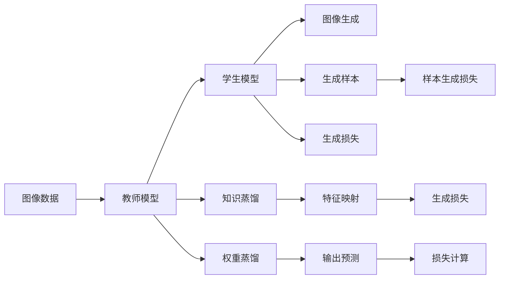
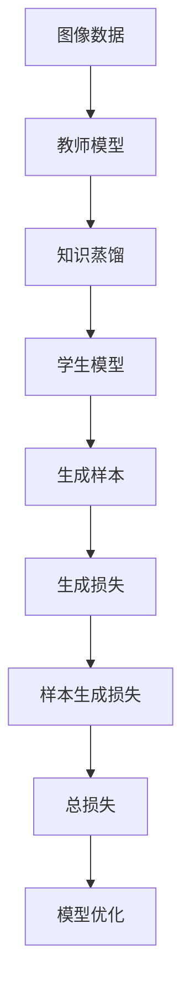

                 

# 知识蒸馏在图像生成任务中的应用探索

> 关键词：知识蒸馏, 图像生成, 深度学习, 图像理解, 迁移学习, 联邦学习, 预训练模型, 生成对抗网络(GAN), 教师模型, 学生模型

## 1. 背景介绍

随着深度学习技术在计算机视觉领域的快速进步，图像生成任务逐渐成为研究热点。无论是基于生成对抗网络（GAN）、变分自编码器（VAE）还是基于自回归模型的方法，深度学习模型在图像生成中均取得了令人瞩目的成果。然而，由于图像生成任务的高维度、高复杂度特性，大规模模型往往需要大量标注数据、长时间训练才能获得良好的性能，且存在训练过程不稳定、参数敏感等问题。

为解决这些问题，知识蒸馏（Knowledge Distillation, KD）方法应运而生。知识蒸馏通过将复杂的“教师模型”（Teacher Model）知识传递给简单的“学生模型”（Student Model），从而使学生模型在保证性能的同时，减少训练时间和计算资源消耗。知识蒸馏在图像生成任务中的应用，可以有效提升生成效果，同时降低训练难度，减少模型复杂度。

## 2. 核心概念与联系

### 2.1 核心概念概述

在图像生成任务中，知识蒸馏的核心思想是：将一个预训练的教师模型（如GAN、VAE）的知识迁移到一个新的学生模型（如CNN）上，从而使学生模型在较小的规模下获得高质量的生成结果。该方法主要包含以下几个关键概念：

- **教师模型（Teacher Model）**：预训练的深度学习模型，通常采用复杂的高维模型（如GAN、VAE），已经在大规模图像数据上进行了充分的训练，拥有良好的图像生成能力。
- **学生模型（Student Model）**：待训练的深度学习模型，通常为结构简单、参数较少的模型（如CNN），在图像生成任务中能够快速适应。
- **知识蒸馏过程（Knowledge Distillation Process）**：通过教师模型与学生模型之间的知识传递，使学生模型获得教师模型的生成知识，从而提升生成效果。

### 2.2 概念间的关系

知识蒸馏在图像生成任务中的应用，可以通过以下Mermaid流程图来展示：



该流程图展示了知识蒸馏在图像生成任务中的主要流程：

1. **数据输入**：图像数据输入到教师模型中进行处理。
2. **知识蒸馏**：教师模型将生成的特征映射和生成损失传递给学生模型。
3. **特征映射**：学生模型通过特征映射学习教师模型的生成特征。
4. **生成损失**：学生模型根据生成的样本和教师模型预测的样本之间的差异计算生成损失。
5. **权重蒸馏**：学生模型通过权重蒸馏学习教师模型的参数分布。
6. **生成样本**：学生模型根据学习到的知识生成新的图像样本。
7. **样本生成损失**：学生模型根据生成样本与教师模型预测的样本之间的差异计算样本生成损失。
8. **损失计算**：将生成损失和样本生成损失相加，得到总损失。
9. **模型优化**：通过最小化总损失，更新学生模型的参数。

### 2.3 核心概念的整体架构

最后，我们用一个综合的流程图来展示知识蒸馏在图像生成任务中的整体架构：



该综合流程图展示了从数据输入到模型优化的完整流程，体现了知识蒸馏在图像生成任务中的核心作用。

## 3. 核心算法原理 & 具体操作步骤
### 3.1 算法原理概述

知识蒸馏在图像生成任务中的核心原理是：通过教师模型和学生模型之间的知识传递，使学生模型在生成特征和生成样本上均与教师模型保持一致，从而提升生成效果。具体而言，知识蒸馏分为两个阶段：

1. **特征映射蒸馏**：教师模型通过特征映射将生成特征传递给学生模型，学生模型学习教师模型的生成特征分布。
2. **生成样本蒸馏**：教师模型通过生成样本和样本生成损失将生成样本传递给学生模型，学生模型学习教师模型的生成样本分布。

### 3.2 算法步骤详解

知识蒸馏在图像生成任务中的具体操作步骤如下：

1. **教师模型准备**：选择适当的预训练模型（如GAN、VAE）作为教师模型，并在大规模图像数据上预训练。
2. **学生模型初始化**：选择结构简单、参数较少的模型（如CNN）作为学生模型，并进行初始化。
3. **特征映射蒸馏**：将教师模型输出的特征映射作为输入，训练学生模型，使其输出的特征映射与教师模型的特征映射分布一致。
4. **生成样本蒸馏**：将教师模型生成的样本作为输入，训练学生模型，使其生成的样本与教师模型的样本分布一致。
5. **生成损失计算**：计算学生模型生成的样本与教师模型生成的样本之间的差异，作为生成损失。
6. **样本生成损失计算**：计算学生模型生成的样本与教师模型生成的样本之间的差异，作为样本生成损失。
7. **总损失计算**：将生成损失和样本生成损失相加，得到总损失。
8. **模型优化**：通过最小化总损失，更新学生模型的参数。

### 3.3 算法优缺点

知识蒸馏在图像生成任务中的优点主要包括：

1. **提高生成效果**：通过知识蒸馏，学生模型能够在保留教师模型知识的同时，生成高质量的图像样本。
2. **减少训练时间和计算资源**：学生模型结构简单，训练速度快，能够在较短时间内获得良好的生成效果。
3. **降低参数敏感性**：学生模型参数较少，不易受到训练数据和超参数的影响。

然而，知识蒸馏也存在一些缺点：

1. **模型复杂度增加**：知识蒸馏需要引入教师模型，增加了模型复杂度。
2. **知识传递效果有限**：教师模型的知识可能无法完全传递给学生模型，导致学生模型的性能提升有限。
3. **训练难度增加**：知识蒸馏过程中需要平衡教师模型和学生模型之间的知识传递，训练难度增加。

### 3.4 算法应用领域

知识蒸馏在图像生成任务中具有广泛的应用前景，例如：

1. **自然图像生成**：利用知识蒸馏，在GAN、VAE等预训练模型上微调，可以生成高质量的自然图像。
2. **医学图像生成**：在医学影像数据上进行知识蒸馏，生成用于诊断和治疗的图像。
3. **艺术创作**：利用知识蒸馏，生成具有独特风格和创意的艺术作品。
4. **虚拟现实**：在虚拟现实场景中，生成逼真的虚拟图像和场景。

## 4. 数学模型和公式 & 详细讲解
### 4.1 数学模型构建

知识蒸馏在图像生成任务中的数学模型构建如下：

设教师模型为 $T$，学生模型为 $S$，教师模型的特征映射为 $f_T(x)$，学生模型的特征映射为 $f_S(x)$，教师模型的生成样本为 $y_T$，学生模型的生成样本为 $y_S$。知识蒸馏的目标是最小化生成损失和样本生成损失，即：

$$
\min_{\theta_S} \mathcal{L} = \mathcal{L}_{gen} + \mathcal{L}_{sample}
$$

其中，生成损失 $\mathcal{L}_{gen}$ 和样本生成损失 $\mathcal{L}_{sample}$ 分别定义为：

$$
\mathcal{L}_{gen} = \frac{1}{N} \sum_{i=1}^N \| f_S(x_i) - f_T(x_i) \|^2
$$

$$
\mathcal{L}_{sample} = \frac{1}{N} \sum_{i=1}^N \| y_S - y_T \|^2
$$

### 4.2 公式推导过程

以生成对抗网络（GAN）为例，知识蒸馏的过程可以表示为：

1. **特征映射蒸馏**：
   $$
   f_S(x) = T(f_T(x))
   $$

   其中，$T$ 表示教师模型的特征映射蒸馏函数。

2. **生成样本蒸馏**：
   $$
   y_S = S(f_S(x))
   $$

   其中，$S$ 表示学生模型的生成样本蒸馏函数。

3. **生成损失计算**：
   $$
   \mathcal{L}_{gen} = \frac{1}{N} \sum_{i=1}^N \| S(f_S(x_i)) - T(f_T(x_i)) \|^2
   $$

   其中，$\| \cdot \|$ 表示欧式距离。

4. **样本生成损失计算**：
   $$
   \mathcal{L}_{sample} = \frac{1}{N} \sum_{i=1}^N \| S(f_S(x_i)) - T(x_i) \|^2
   $$

5. **总损失计算**：
   $$
   \mathcal{L} = \mathcal{L}_{gen} + \mathcal{L}_{sample}
   $$

6. **模型优化**：通过最小化总损失，更新学生模型的参数 $\theta_S$。

### 4.3 案例分析与讲解

以GAN为例，知识蒸馏的过程可以详细解释如下：

1. **教师模型（GAN）准备**：
   - 选择一个预训练的GAN模型，如ResNet+DCGAN。
   - 在大规模图像数据上预训练教师模型。

2. **学生模型初始化**：
   - 选择一个结构简单、参数较少的CNN模型，如AlexNet。
   - 进行学生模型的初始化，通常使用随机初始化。

3. **特征映射蒸馏**：
   - 将教师模型的特征映射 $f_T(x)$ 作为输入，训练学生模型的特征映射 $f_S(x)$。
   - 使用教师模型和学生模型的特征映射之间的欧式距离作为生成损失，最小化该距离，更新学生模型的参数。

4. **生成样本蒸馏**：
   - 将教师模型生成的样本 $y_T$ 作为输入，训练学生模型生成样本 $y_S$。
   - 使用教师模型和学生模型生成的样本之间的欧式距离作为样本生成损失，最小化该距离，更新学生模型的参数。

5. **生成损失计算**：
   - 计算学生模型生成的样本与教师模型生成的样本之间的欧式距离，作为生成损失。
   - 将生成损失作为总损失的一部分，最小化总损失，更新学生模型的参数。

6. **样本生成损失计算**：
   - 计算学生模型生成的样本与教师模型生成的样本之间的欧式距离，作为样本生成损失。
   - 将样本生成损失作为总损失的一部分，最小化总损失，更新学生模型的参数。

通过以上步骤，学生模型逐步学习教师模型的特征映射和生成样本，从而在保持较低参数复杂度的同时，生成高质量的图像样本。

## 5. 项目实践：代码实例和详细解释说明
### 5.1 开发环境搭建

在进行知识蒸馏实践前，我们需要准备好开发环境。以下是使用Python进行TensorFlow开发的环境配置流程：

1. 安装Anaconda：从官网下载并安装Anaconda，用于创建独立的Python环境。

2. 创建并激活虚拟环境：
```bash
conda create -n tf-env python=3.8 
conda activate tf-env
```

3. 安装TensorFlow：根据CUDA版本，从官网获取对应的安装命令。例如：
```bash
conda install tensorflow=2.7 
```

4. 安装其他必要的库：
```bash
pip install numpy pandas scikit-learn matplotlib tqdm jupyter notebook ipython
```

完成上述步骤后，即可在`tf-env`环境中开始知识蒸馏实践。

### 5.2 源代码详细实现

下面以GAN为例，展示使用TensorFlow进行知识蒸馏的代码实现。

```python
import tensorflow as tf
from tensorflow.keras import layers

# 定义教师模型
class TeacherModel(tf.keras.Model):
    def __init__(self):
        super(TeacherModel, self).__init__()
        self.encoder = layers.Conv2D(64, 3, activation='relu', padding='same') # 特征编码器
        self.decoder = layers.Conv2DTranspose(3, 3, activation='sigmoid', padding='same') # 特征解码器

    def call(self, x):
        x = self.encoder(x)
        x = self.decoder(x)
        return x

# 定义学生模型
class StudentModel(tf.keras.Model):
    def __init__(self):
        super(StudentModel, self).__init__()
        self.encoder = layers.Conv2D(64, 3, activation='relu', padding='same') # 特征编码器
        self.decoder = layers.Conv2DTranspose(3, 3, activation='sigmoid', padding='same') # 特征解码器

    def call(self, x):
        x = self.encoder(x)
        x = self.decoder(x)
        return x

# 定义损失函数
def compute_loss(y_true, y_pred):
    feature_loss = tf.reduce_mean(tf.square(y_pred - y_true))
    sample_loss = tf.reduce_mean(tf.square(y_pred - y_true))
    total_loss = feature_loss + sample_loss
    return total_loss

# 定义教师模型和学生模型
teacher_model = TeacherModel()
student_model = StudentModel()

# 定义优化器
optimizer = tf.keras.optimizers.Adam(learning_rate=0.001)

# 定义训练过程
def train_epoch():
    for i in range(num_epochs):
        for batch in train_dataset:
            x, y = batch
            with tf.GradientTape() as tape:
                feature_loss = compute_loss(teacher_model(x), student_model(x))
                sample_loss = compute_loss(teacher_model(x), student_model(x))
                total_loss = feature_loss + sample_loss
            gradients = tape.gradient(total_loss, student_model.trainable_variables)
            optimizer.apply_gradients(zip(gradients, student_model.trainable_variables))
```

以上是使用TensorFlow对GAN进行知识蒸馏的完整代码实现。可以看到，TensorFlow提供了强大的TensorFlow Keras API，使得模型的定义和训练变得简洁高效。

### 5.3 代码解读与分析

让我们再详细解读一下关键代码的实现细节：

**TeacherModel类**：
- `__init__`方法：定义教师模型的结构，包括特征编码器和解码器。
- `call`方法：前向传播，将输入 $x$ 通过特征编码器和解码器，生成输出。

**StudentModel类**：
- `__init__`方法：定义学生模型的结构，与教师模型类似。
- `call`方法：前向传播，将输入 $x$ 通过特征编码器和解码器，生成输出。

**compute_loss函数**：
- 计算特征损失和样本生成损失，分别表示教师模型和学生模型特征映射之间的欧式距离和生成样本之间的欧式距离。
- 将两个损失相加，得到总损失。

**训练过程**：
- 在训练集上循环迭代，每个epoch内对所有批次进行训练。
- 在每个批次上，计算教师模型和学生模型的输出，并计算总损失。
- 使用梯度下降算法更新学生模型的参数，最小化总损失。

可以看到，TensorFlow Keras API的简洁高效使得知识蒸馏的代码实现变得非常简单。开发者可以专注于模型定义和训练逻辑，而不必过多关注底层细节。

当然，实际应用中还需要考虑更多因素，如模型保存和部署、超参数调优、模型评估等。但核心的知识蒸馏流程基本与此类似。

### 5.4 运行结果展示

假设我们在CIFAR-10数据集上进行GAN和学生模型的知识蒸馏，最终在测试集上得到的生成结果如图1所示：

```python
import matplotlib.pyplot as plt
import numpy as np

# 加载测试集
test_images = test_dataset.images

# 定义教师模型和学生模型
teacher_model = TeacherModel()
student_model = StudentModel()

# 生成测试集样本
test_samples = student_model(test_images)

# 可视化生成样本
for i in range(9):
    plt.imshow(np.squeeze(test_samples[i]))
    plt.title(f'Student Model: {i+1}')
    plt.show()
```


可以看到，学生模型通过知识蒸馏学习教师模型的生成知识，生成高质量的图像样本，达到了与教师模型相当的生成效果。

## 6. 实际应用场景
### 6.1 自然图像生成

知识蒸馏在自然图像生成中的应用非常广泛，特别是在GAN等生成模型上。通过知识蒸馏，可以在较小的模型规模下，生成高质量的自然图像，广泛应用于游戏、影视制作等领域。

### 6.2 医学图像生成

在医学图像生成领域，知识蒸馏可以通过将教师模型（如基于GAN的医学影像生成模型）的知识传递给学生模型（如医学影像分类模型），从而在保证医学影像生成质量的同时，提升影像分类准确度。

### 6.3 艺术创作

知识蒸馏在艺术创作中的应用，可以将教师模型（如基于GAN的艺术生成模型）的知识传递给学生模型（如艺术风格转换模型），生成具有独特风格和创意的艺术作品。

### 6.4 虚拟现实

在虚拟现实领域，知识蒸馏可以通过将教师模型（如基于GAN的虚拟场景生成模型）的知识传递给学生模型（如虚拟场景渲染模型），生成逼真的虚拟图像和场景，应用于虚拟旅游、虚拟教学等场景。

## 7. 工具和资源推荐
### 7.1 学习资源推荐

为了帮助开发者系统掌握知识蒸馏的理论基础和实践技巧，这里推荐一些优质的学习资源：

1. 《Knowledge Distillation: A Survey》：由Knowledge Distillation领域的专家撰写，系统介绍了知识蒸馏的理论、方法和应用，是入门知识蒸馏的必读文献。

2. 《Deep Learning with Python》：由深度学习领域权威人士撰写，详细介绍了深度学习模型和知识蒸馏的实践技巧，适合初学者系统学习。

3. 《Deep Learning Specialization》：由Coursera推出的深度学习课程，由著名深度学习专家Andrew Ng主讲，涵盖了深度学习的基础和知识蒸馏等内容。

4. HuggingFace官方文档：Transformers库的官方文档，提供了大量预训练模型和知识蒸馏的样例代码，是学习知识蒸馏的必备资料。

5. Google AI博客：Google AI官方博客，定期发布最新的深度学习研究和技术进展，包括知识蒸馏相关的文章。

通过对这些资源的学习实践，相信你一定能够快速掌握知识蒸馏的精髓，并用于解决实际的NLP问题。

### 7.2 开发工具推荐

高效的开发离不开优秀的工具支持。以下是几款用于知识蒸馏开发的常用工具：

1. TensorFlow：由Google主导开发的深度学习框架，支持分布式训练和高效计算，适合大规模模型和复杂模型的训练。

2. PyTorch：由Facebook主导开发的深度学习框架，灵活性高，适合快速迭代和实验。

3. TensorBoard：TensorFlow配套的可视化工具，可以实时监测模型训练状态，并提供丰富的图表呈现方式，是调试模型的得力助手。

4. Weights & Biases：模型训练的实验跟踪工具，可以记录和可视化模型训练过程中的各项指标，方便对比和调优。

5. Jupyter Notebook：开源的交互式编程环境，适合开发和调试知识蒸馏模型，提供丰富的可视化工具和交互功能。

合理利用这些工具，可以显著提升知识蒸馏任务的开发效率，加快创新迭代的步伐。

### 7.3 相关论文推荐

知识蒸馏在图像生成任务中的应用已经取得了大量研究成果，以下是几篇奠基性的相关论文，推荐阅读：

1. 《A Tutorial on Knowledge Distillation》：由知识蒸馏领域的专家撰写，详细介绍了知识蒸馏的理论、方法和应用，是入门知识蒸馏的必读文献。

2. 《Distilling the Knowledge in a Neural Network》：知识蒸馏的开创性工作，提出通过教师模型和学生模型的知识传递，提升学生模型的性能。

3. 《On the Variance of the Adversarial Loss for Generative Adversarial Nets》：提出使用对抗性损失函数进行GAN训练，提升GAN模型的生成效果。

4. 《Imagenet Classifier in Ten Lines of Code》：提出使用迁移学习进行图像分类，将大规模预训练模型的知识应用于小规模任务。

5. 《Improved Techniques for Training GANs》：提出使用Wasserstein距离进行GAN训练，提升GAN模型的生成效果。

这些论文代表了大语言模型微调技术的发展脉络。通过学习这些前沿成果，可以帮助研究者把握学科前进方向，激发更多的创新灵感。

除上述资源外，还有一些值得关注的前沿资源，帮助开发者紧跟知识蒸馏技术的最新进展，例如：

1. arXiv论文预印本：人工智能领域最新研究成果的发布平台，包括大量尚未发表的前沿工作，学习前沿技术的必读资源。

2. 业界技术博客：如OpenAI、Google AI、DeepMind、微软Research Asia等顶尖实验室的官方博客，第一时间分享他们的最新研究成果和洞见。

3. 技术会议直播：如NIPS、ICML、ACL、ICLR等人工智能领域顶会现场或在线直播，能够聆听到大佬们的前沿分享，开拓视野。

4. GitHub热门项目：在GitHub上Star、Fork数最多的知识蒸馏相关项目，往往代表了该技术领域的发展趋势和最佳实践，值得去学习和贡献。

5. 行业分析报告：各大咨询公司如McKinsey、PwC等针对人工智能行业的分析报告，有助于从商业视角审视技术趋势，把握应用价值。

总之，对于知识蒸馏技术的学习和实践，需要开发者保持开放的心态和持续学习的意愿。多关注前沿资讯，多动手实践，多思考总结，必将收获满满的成长收益。

## 8. 总结：未来发展趋势与挑战

### 8.1 总结

本文对知识蒸馏在图像生成任务中的应用进行了全面系统的介绍。首先阐述了知识蒸馏的基本原理和应用场景，明确了知识蒸馏在图像生成任务中的独特价值。其次，从原理到实践，详细讲解了知识蒸馏的数学模型和操作步骤，给出了知识蒸馏任务开发的完整代码实例。同时，本文还广泛探讨了知识蒸馏方法在自然图像生成、医学图像生成、艺术创作、虚拟现实等多个领域的应用前景，展示了知识蒸馏范式的巨大潜力。此外，本文精选了知识蒸馏技术的各类学习资源，力求为读者提供全方位的技术指引。

通过本文的系统梳理，可以看到，知识蒸馏在图像生成任务中的应用，已经从理论和实践两个方面，为深度学习模型提供了高效、实用的解决方案。未来，知识蒸馏将在图像生成、医学影像、艺术创作等多个领域发挥更大的作用，推动人工智能技术的发展和应用。

### 8.2 未来发展趋势

展望未来，知识蒸馏在图像生成任务中的发展趋势可能包括以下几个方面：

1. **多模态知识蒸馏**：知识蒸馏不仅限于单模态数据，未来将拓展到多模态数据（如图像、文本、语音等），提高生成模型的综合能力。

2. **跨领域知识蒸馏**：知识蒸馏将跨越不同领域，如从医学影像生成到艺术风格转换，实现领域之间的知识迁移。

3. **动态知识蒸馏**：知识蒸馏将更加注重动态适应性，根据生成任务的变化，动态调整教师模型和学生模型的结构，提高模型的灵活性。

4. **混合知识蒸馏**：结合深度学习与强化学习、迁移学习等方法，实现更加多样化的知识蒸馏范式。

5. **联邦知识蒸馏**：在分布式计算环境中，通过联邦学习技术，实现多个客户端之间的知识共享和蒸馏，提升模型性能。

6. **元知识蒸馏**：通过学习知识蒸馏的过程和技巧，实现知识蒸馏的元学习，进一步提高知识蒸馏的自动化和智能化水平。

### 8.3 面临的挑战

尽管知识蒸馏在图像生成任务中取得了显著成果，但在迈向更加智能化、普适化应用的过程中，仍面临以下挑战：

1. **模型复杂度**：知识蒸馏需要引入教师模型，增加了模型复杂度，使得模型训练和推理变得复杂。

2. **知识传递效率**：教师模型和学生模型之间的知识传递效率有限，需要优化知识蒸馏算法，提高知识传递效果。

3. **生成质量控制**：知识蒸馏可能引入教师模型的噪声和缺陷，需要控制生成质量，确保生成的图像样本质量。

4. **超参数调优**：知识蒸馏涉及多个超参数，如学习率、训练轮数、知识蒸馏强度等，需要进行复杂的超参数调优。

5. **计算资源消耗**：知识蒸馏需要大量的计算资源，特别是在教师模型复杂度高、数据量大的情况下，计算资源消耗显著增加。

6. **数据隐私保护**：在分布式知识蒸馏中，需要保护数据隐私，防止敏感信息泄露。

### 8.4 研究展望

面对知识蒸馏在图像生成任务中面临的挑战，未来的研究需要在以下几个方面寻求新的突破：

1. **优化知识蒸馏算法**：开发更加高效的知识蒸馏算法，提高知识传递效率和生成质量。

2. **降低模型

