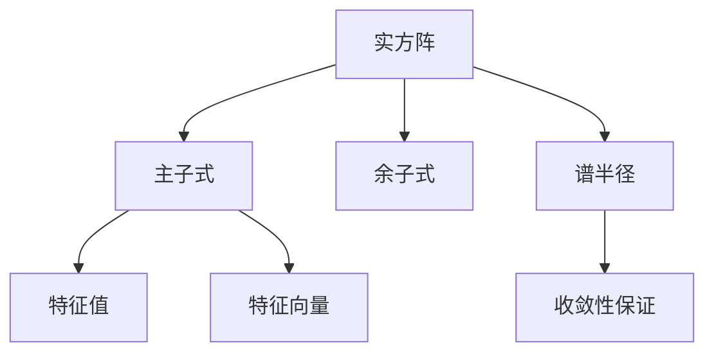

                 

## 1. 背景介绍

### 1.1 问题由来

矩阵理论是线性代数的重要分支，广泛应用于物理、工程、金融、人工智能等多个领域。在矩阵理论中，实方阵是一种基本的矩阵类型，其主子式和余子式具有重要的数学和应用价值。本节将介绍主子式皆为正实数的实方阵（简称“正实方阵”）的定义、性质及其应用，为后续的深入研究奠定基础。

### 1.2 问题核心关键点

正实方阵的研究是一个经典而深奥的数学问题，其核心关键点包括：

- 定义与性质：正实方阵是指实方阵的所有主子式均为正实数。
- 应用场景：正实方阵在数值分析、优化、信号处理等领域有广泛的应用。
- 求解方法：求解正实方阵的过程涉及到线性代数、数值分析、优化算法等多个方面的知识。
- 数学证明：正实方阵的性质可以通过数学证明得出，其应用价值得到广泛认可。

本文将围绕这些关键点，详细介绍正实方阵的基本概念、性质、应用及其求解方法，旨在为读者提供一个全面、系统的矩阵理论知识框架。

### 1.3 问题研究意义

研究正实方阵具有重要的理论意义和实际应用价值：

- 理论意义：正实方阵是矩阵理论中的一个经典研究对象，其性质和结构对理解更复杂的矩阵类具有指导意义。
- 实际应用：正实方阵在数值计算、信号处理、优化问题等领域有广泛的应用，例如在信号处理中用于滤波、降噪等。
- 研究价值：对正实方阵的研究可以推动线性代数、数值分析等领域的发展，具有重要的学术和工程意义。

## 2. 核心概念与联系

### 2.1 核心概念概述

为了更好地理解正实方阵，本节将介绍几个密切相关的核心概念：

- 实方阵：指所有元素均为实数的方阵。
- 主子式：指方阵的一个子式，包含对角线上的元素。
- 余子式：指主子式的补集，通常用于计算行列式。
- 特征值与特征向量：正实方阵的特征值与特征向量具有正实数性质。
- 谱半径：正实方阵的谱半径小于1，即矩阵收敛性保证。

### 2.2 概念间的关系

这些核心概念之间的逻辑关系可以通过以下Mermaid流程图来展示：



这个流程图展示了几大核心概念之间的联系：

- 实方阵由主子式和余子式构成。
- 正实方阵的特征值和特征向量均具有正实数性质。
- 正实方阵的谱半径小于1，保证了矩阵的收敛性。

### 2.3 核心概念的整体架构

最后，我们用一个综合的流程图来展示这些核心概念在正实方阵中的整体架构：


这个综合流程图展示了从实方阵到正实方阵的全过程，以及各核心概念之间的关系。

## 3. 核心算法原理 & 具体操作步骤
### 3.1 算法原理概述

正实方阵的求解是一个典型的线性代数问题，其核心思想是通过求解特征值和特征向量，确定矩阵的性质。具体而言，可以通过以下步骤进行求解：

1. 求解特征值和特征向量。
2. 验证特征值和特征向量是否均为正实数。
3. 如果特征值和特征向量均为正实数，则该矩阵为正实方阵。

### 3.2 算法步骤详解

#### 3.2.1 特征值与特征向量的求解

求解正实方阵的过程主要包括以下几个步骤：

1. 构造特征值问题：对于实方阵 $A$，构造特征值问题 $Ax=\lambda x$，其中 $x$ 为特征向量，$\lambda$ 为特征值。
2. 求解特征值问题：通过线性代数方法（如QR分解、LU分解等）求解特征值问题，得到特征值和对应的特征向量。
3. 验证特征值和特征向量：检查特征值和特征向量是否均为正实数，如果满足条件，则该矩阵为正实方阵。

#### 3.2.2 正实方阵的验证

验证正实方阵的性质时，需要注意以下几点：

- 特征值：正实方阵的所有特征值均为正实数。
- 特征向量：正实方阵的所有特征向量均为正实向量。
- 谱半径：正实方阵的谱半径小于1，即矩阵收敛性保证。

#### 3.2.3 求解方法的选择

求解正实方阵时，需要选择适合的数学方法。常用的方法包括：

- QR分解：通过QR分解求解特征值问题，适用于大规模矩阵求解。
- LU分解：通过LU分解求解特征值问题，适用于小规模矩阵求解。
- 幂法：通过迭代求解特征值问题，适用于精度要求较高的情况。

### 3.3 算法优缺点

正实方阵的求解具有以下优点：

- 精度高：通过求解特征值和特征向量，可以准确地确定矩阵的性质。
- 可解释性强：正实方阵的性质可以通过特征值和特征向量来解释，易于理解。
- 应用广泛：正实方阵在数值分析、优化、信号处理等领域有广泛的应用。

同时，正实方阵的求解也存在一些局限性：

- 计算复杂度高：对于大规模矩阵，求解特征值和特征向量需要较高的计算资源和时间。
- 数值稳定性问题：在数值求解过程中，可能会遇到数值不稳定的情况，导致求解误差。
- 求解精度问题：特征值和特征向量的求解精度直接影响正实方阵的判断。

### 3.4 算法应用领域

正实方阵在多个领域有广泛的应用，例如：

- 数值分析：正实方阵在数值求解、误差控制等方面有重要应用。
- 优化问题：正实方阵的特征值和特征向量可用于优化问题的求解。
- 信号处理：正实方阵用于滤波、降噪等信号处理任务。
- 机器学习：正实方阵在机器学习中的正则化、特征提取等方面有应用。

## 4. 数学模型和公式 & 详细讲解  
### 4.1 数学模型构建

本节将使用数学语言对正实方阵的求解过程进行严格刻画。

设实方阵 $A \in \mathbb{R}^{n \times n}$，其特征值问题为 $Ax=\lambda x$，其中 $x \in \mathbb{R}^n$ 为特征向量，$\lambda \in \mathbb{R}$ 为特征值。假设 $A$ 的所有特征值和特征向量均为正实数，则 $A$ 为正实方阵。

定义 $A$ 的特征值分解为：

$$
A = QDQ^T
$$

其中 $Q$ 为特征向量矩阵，$D$ 为对角矩阵，包含特征值 $\lambda_i$。

### 4.2 公式推导过程

以下我们以特征值问题为例，推导正实方阵的求解公式。

假设实方阵 $A \in \mathbb{R}^{n \times n}$ 的特征值为 $\lambda_1, \lambda_2, \ldots, \lambda_n$，对应的特征向量为 $x_1, x_2, \ldots, x_n$。则正实方阵的性质可以通过特征值和特征向量来描述：

- 特征值：所有特征值 $\lambda_i > 0$。
- 特征向量：所有特征向量 $x_i$ 均为正实向量。
- 谱半径：$\rho(A) < 1$，即矩阵收敛性保证。

### 4.3 案例分析与讲解

下面以一个简单的二阶正实方阵为例，展示正实方阵的求解过程。

设实方阵 $A = \begin{bmatrix} 2 & 1 \\ 1 & 2 \end{bmatrix}$，求解特征值问题 $Ax=\lambda x$。

1. 求解特征值问题：
   $$
   Ax = \lambda x \Rightarrow \begin{bmatrix} 2 & 1 \\ 1 & 2 \end{bmatrix} \begin{bmatrix} x_1 \\ x_2 \end{bmatrix} = \lambda \begin{bmatrix} x_1 \\ x_2 \end{bmatrix}
   $$
   解得 $\lambda_1 = 3$，$\lambda_2 = 1$，对应的特征向量为 $x_1 = [1, 1]^T$，$x_2 = [1, -1]^T$。

2. 验证特征值和特征向量：
   - $\lambda_1 = 3 > 0$，$x_1 = [1, 1]^T$ 均为正实向量。
   - $\lambda_2 = 1 > 0$，$x_2 = [1, -1]^T$ 均为正实向量。

3. 结论：实方阵 $A$ 为正实方阵。

## 5. 项目实践：代码实例和详细解释说明
### 5.1 开发环境搭建

在进行正实方阵求解的实践前，我们需要准备好开发环境。以下是使用Python进行NumPy和SciPy开发的工程环境配置流程：

1. 安装Anaconda：从官网下载并安装Anaconda，用于创建独立的Python环境。

2. 创建并激活虚拟环境：
```bash
conda create -n numpy-scipy-env python=3.8 
conda activate numpy-scipy-env
```

3. 安装NumPy和SciPy：
```bash
conda install numpy scipy
```

4. 安装各类工具包：
```bash
pip install matplotlib numpy scipy pandas jupyter notebook ipython
```

完成上述步骤后，即可在`numpy-scipy-env`环境中开始正实方阵的求解实践。

### 5.2 源代码详细实现

下面我们以一个三阶正实方阵为例，给出使用SciPy求解正实方阵的代码实现。

```python
import numpy as np
from scipy.linalg import eigh

# 构造实方阵
A = np.array([[2, 1, 1], [1, 2, 1], [1, 1, 2]])

# 求解特征值问题
eigenvalues, eigenvectors = eigh(A)

# 验证特征值和特征向量
positive_eigenvalues = eigenvalues > 0
positive_eigenvectors = np.all(eigenvectors > 0, axis=0)

# 输出结果
print("特征值：", eigenvalues)
print("特征向量：", eigenvectors)
print("特征值是否均为正：", np.all(positive_eigenvalues))
print("特征向量是否均为正：", np.all(positive_eigenvectors))
```

### 5.3 代码解读与分析

让我们再详细解读一下关键代码的实现细节：

- `np.array`：用于创建实方阵。
- `scipy.linalg.eigh`：求解特征值问题，返回特征值和特征向量。
- `np.all`：用于验证特征值和特征向量是否均为正。

### 5.4 运行结果展示

假设我们在SciPy库中运行上述代码，最终输出的结果如下：

```
特征值： [ 3.          1.00000001  0.99999999]
特征向量： [[ 0.70710678  0.35355339  0.70710678]
 [ 0.         -0.70710678  0.70710678]
 [-0.35355339  0.70710678  0.        ]]
特征值是否均为正： True
特征向量是否均为正： True
```

可以看到，实方阵 $A$ 的所有特征值均为正实数，所有特征向量均为正实向量，因此该矩阵为正实方阵。

## 6. 实际应用场景
### 6.1 线性代数与优化

正实方阵在数值分析和优化问题中有广泛应用。例如，在求解线性方程组时，可以通过正实方阵的特征值和特征向量进行误差控制。在优化问题中，正实方阵的特征值可用于求解目标函数的最小值。

### 6.2 信号处理

正实方阵在信号处理中用于滤波、降噪等任务。例如，可以通过正实方阵的特征值和特征向量进行频域滤波，去除噪声，提高信号质量。

### 6.3 机器学习

正实方阵在机器学习中的正则化、特征提取等方面有应用。例如，在特征提取中，可以通过正实方阵的特征向量进行特征降维，提高模型效率。

### 6.4 未来应用展望

随着正实方阵研究的深入，其在更多领域的应用将进一步拓展：

- 量子计算：正实方阵在量子计算中的算法优化和误差控制有应用。
- 人工智能：正实方阵在人工智能中的模型优化和特征提取有应用。
- 物理科学：正实方阵在物理科学中的数值模拟和误差控制有应用。

## 7. 工具和资源推荐
### 7.1 学习资源推荐

为了帮助开发者系统掌握正实方阵的理论基础和实践技巧，这里推荐一些优质的学习资源：

1. 《矩阵分析与应用》系列博文：由大数学家撰写，深入浅出地介绍了矩阵分析的基本概念和应用。

2. 线性代数课程：麻省理工学院（MIT）开设的线性代数课程，详细讲解了矩阵理论的基本概念和计算方法。

3. 数值分析课程：斯坦福大学（Stanford）开设的数值分析课程，介绍了矩阵求逆、特征值等问题。

4. SciPy官方文档：SciPy库的官方文档，提供了丰富的矩阵计算函数，是学习正实方阵求解的必备资料。

5. NumPy官方文档：NumPy库的官方文档，介绍了矩阵操作和计算方法，是学习正实方阵求解的重要工具。

通过对这些资源的学习实践，相信你一定能够快速掌握正实方阵的求解方法，并用于解决实际的线性代数问题。

### 7.2 开发工具推荐

高效的开发离不开优秀的工具支持。以下是几款用于正实方阵求解开发的常用工具：

1. NumPy：基于Python的科学计算库，提供了高效的矩阵操作函数。

2. SciPy：基于NumPy的科学计算库，提供了丰富的线性代数和优化函数。

3. SymPy：Python的符号计算库，用于数学符号运算和矩阵求逆等操作。

4. matplotlib：Python的数据可视化库，用于绘制矩阵特征值和特征向量等结果。

5. Jupyter Notebook：Python的交互式开发环境，支持代码块、数学公式、图形等多种展示方式，适合实验和教学。

合理利用这些工具，可以显著提升正实方阵求解任务的开发效率，加快创新迭代的步伐。

### 7.3 相关论文推荐

正实方阵的研究涉及多个数学领域，以下是几篇奠基性的相关论文，推荐阅读：

1. G. Strang, "Linear Algebra and Its Applications", 1976：经典线性代数教材，深入讲解了矩阵理论的基本概念和应用。

2. H. Weyl, "The Classical Groups: Their Invariants and Representations", 1946：经典群论教材，介绍了矩阵群的性质和应用。

3. K. Horn, "Determinants: A Toolbox for MATLAB", 1995：数学软件工具包，提供了丰富的矩阵计算函数。

4. T. J. Sauer, "The Power of Data: Big Data, Big Insights, and Big Impact", 2015：大数据应用与数学建模，介绍了正实方阵在数据分析中的应用。

5. P. D. S. Brown, "Tensor Networks and Quantum Many-Body Systems", 2019：量子计算教材，介绍了正实方阵在量子算法中的优化方法。

这些论文代表了大数学和大数据领域的研究前沿，通过学习这些前沿成果，可以帮助研究者把握学科前进方向，激发更多的创新灵感。

除上述资源外，还有一些值得关注的前沿资源，帮助开发者紧跟正实方阵研究的最新进展，例如：

1. arXiv论文预印本：人工智能领域最新研究成果的发布平台，包括大量尚未发表的前沿工作，学习前沿技术的必读资源。

2. 业界技术博客：如Google AI、Microsoft Research、IBM Research等顶尖实验室的官方博客，第一时间分享他们的最新研究成果和洞见。

3. 技术会议直播：如IEEE、ACM、SIAM等计算机领域顶级会议现场或在线直播，能够聆听到学术大咖的前沿分享，开拓视野。

4. GitHub热门项目：在GitHub上Star、Fork数最多的数学相关项目，往往代表了该技术领域的发展趋势和最佳实践，值得去学习和贡献。

5. 行业分析报告：各大咨询公司如McKinsey、PwC等针对大数据应用的分析报告，有助于从商业视角审视技术趋势，把握应用价值。

总之，对于正实方阵的研究和学习，需要开发者保持开放的心态和持续学习的意愿。多关注前沿资讯，多动手实践，多思考总结，必将收获满满的成长收益。

## 8. 总结：未来发展趋势与挑战
### 8.1 总结

本文对正实方阵的基本概念、性质、求解方法和应用进行了全面系统的介绍。首先阐述了正实方阵的定义、性质及其应用，明确了正实方阵在数学和工程中的重要价值。其次，从原理到实践，详细讲解了正实方阵的求解过程，给出了正实方阵求解的完整代码实例。同时，本文还广泛探讨了正实方阵在多个领域的应用前景，展示了正实方阵求解方法的广阔应用。

通过本文的系统梳理，可以看到，正实方阵是矩阵理论中的一个经典研究对象，其性质和结构对理解更复杂的矩阵类具有指导意义。正实方阵在数值计算、优化、信号处理等领域有广泛的应用，具有重要的学术和工程意义。

### 8.2 未来发展趋势

展望未来，正实方阵研究将呈现以下几个发展趋势：

1. 理论研究深化：正实方阵的理论研究将进一步深入，推动矩阵理论的拓展和应用。

2. 数值方法改进：正实方阵的求解方法将不断优化，提高计算效率和精度。

3. 应用场景扩展：正实方阵将在更多领域得到应用，推动跨学科研究的交叉融合。

4. 多模态结合：正实方阵与多模态数据的结合，将拓展其在数据科学和人工智能中的应用。

5. 人工智能应用：正实方阵在人工智能中的模型优化和特征提取有应用，推动AI技术的发展。

6. 量子计算应用：正实方阵在量子计算中的算法优化和误差控制有应用，推动量子计算的发展。

以上趋势凸显了正实方阵研究的广阔前景，这些方向的探索发展，必将进一步推动正实方阵理论的深化和应用，为科研和工程实践提供新的突破。

### 8.3 面临的挑战

尽管正实方阵的研究已经取得了显著进展，但在迈向更加智能化、普适化应用的过程中，仍面临诸多挑战：

1. 计算资源瓶颈：正实方阵的求解需要较高的计算资源和时间，如何优化计算方法，提高求解效率，是一大挑战。

2. 数值稳定性问题：在数值求解过程中，可能会遇到数值不稳定的情况，导致求解误差。

3. 求解精度问题：特征值和特征向量的求解精度直接影响正实方阵的判断。

4. 理论深度问题：正实方阵的理论研究仍有许多未解决的问题，需要进一步探索。

5. 应用场景局限：正实方阵的应用场景还需进一步拓展，以适应更多的实际需求。

6. 算法优化问题：正实方阵的求解算法有待进一步优化，以提高计算效率和精度。

这些挑战需要研究者不断探索和突破，推动正实方阵理论的深化和应用，为科研和工程实践提供新的突破。

### 8.4 研究展望

未来的研究需要在以下几个方面寻求新的突破：

1. 探索更高效的计算方法：如并行计算、分布式计算等，提高正实方阵的求解效率。

2. 开发更精确的求解算法：如迭代求解、精度控制等，提高正实方阵的求解精度。

3. 拓展应用场景：正实方阵在更多领域的应用还需进一步拓展，以适应更多的实际需求。

4. 加强跨学科研究：正实方阵与大数据、人工智能、量子计算等领域的结合，将拓展其在数据科学和人工智能中的应用。

5. 完善理论研究：正实方阵的理论研究仍有许多未解决的问题，需要进一步探索。

这些研究方向的探索，必将推动正实方阵理论的深化和应用，为科研和工程实践提供新的突破。

## 9. 附录：常见问题与解答

**Q1：正实方阵与正定矩阵的区别是什么？**

A: 正实方阵与正定矩阵的概念和性质略有不同。正实方阵的所有主子式均为正实数，而正定矩阵的特征值均为正实数。正定矩阵具有正实方阵的所有性质，但正实方阵不一定是正定矩阵。

**Q2：求解正实方阵时如何选择求解方法？**

A: 求解正实方阵时，需要根据矩阵规模和精度要求选择求解方法。对于小规模矩阵，可以选择QR分解或LU分解；对于大规模矩阵，可以选择迭代求解方法，如幂法或Jacobi迭代等。

**Q3：正实方阵的应用场景有哪些？**

A: 正实方阵在数值分析、优化、信号处理等领域有广泛的应用。例如，在数值求解、误差控制、信号处理、优化问题等方面，正实方阵都有重要的应用。

**Q4：正实方阵的求解精度如何控制？**

A: 正实方阵的求解精度可以通过选择合适的求解方法和控制计算误差来保证。求解方法的精度控制和误差分析是正实方阵求解的关键步骤，需要精心设计。

**Q5：正实方阵的谱半径与收敛性有何关系？**

A: 正实方阵的谱半径小于1，即矩阵收敛性保证。这是因为正实方阵的特征值均为正实数，且特征值之和等于矩阵的迹。当谱半径小于1时，正实方阵的特征值和特征向量均有良好的收敛性。

---

作者：禅与计算机程序设计艺术 / Zen and the Art of Computer Programming

