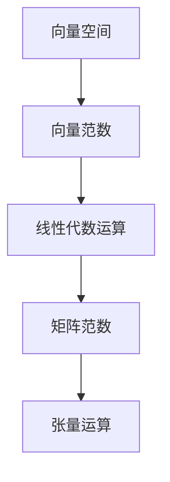

                 

# 矩阵理论与应用：对偶向量范数

> 关键词：矩阵理论,对偶空间,向量范数,线性代数,张量分析

## 1. 背景介绍

### 1.1 问题由来
在现代数学和工程领域，矩阵理论具有极其重要的地位。无论是物理学、工程学、计算机科学，还是金融学、经济学的研究中，矩阵理论都扮演着核心角色。矩阵理论不仅与线代、张量分析等领域密切相关，也是处理大规模数据、进行数值计算的重要工具。

向量范数作为矩阵理论中的基础概念，在实际应用中有着广泛的用途。例如，在机器学习中，向量范数用于衡量模型的复杂度、训练数据的收敛速度等；在信号处理中，向量范数用于衡量信号的强度、信号之间的相似性等。因此，深入理解向量范数及其性质，对于解决实际问题至关重要。

本文将详细探讨向量范数的概念、性质以及其在实际中的应用，力求让读者全面掌握向量范数的理论基础和实践技能。

## 2. 核心概念与联系

### 2.1 核心概念概述

为更好地理解向量范数，本节将介绍几个密切相关的核心概念：

- **向量范数**：定义在向量空间上，用于度量向量的长度和大小。常见的向量范数包括L1范数、L2范数、无穷范数等。

- **矩阵范数**：定义在矩阵空间上，用于度量矩阵的大小和广义“大小”。常见的矩阵范数包括Frobenius范数、谱范数等。

- **对偶空间**：与向量空间对应的对偶空间，用于处理函数的连续性和可导性问题。对偶空间在优化理论中扮演着重要角色。

- **线性代数**：研究向量空间、矩阵及其运算的学科。向量范数和矩阵范数是线性代数中的重要概念。

- **张量分析**：研究多维数组和它们的运算的学科。向量范数、矩阵范数及其推广形式在张量分析中广泛应用。

这些核心概念之间存在紧密的联系，构成了向量范数理论的基础。通过理解这些概念，我们可以更好地把握向量范数的性质和应用。

### 2.2 概念间的关系

这些核心概念之间存在如下关系：

1. **向量范数与矩阵范数**：向量范数可以看作矩阵范数的特殊形式，即对向量构成的矩阵进行矩阵范数计算。例如，L2范数是对矩阵进行Frobenius范数计算的结果。

2. **向量范数与线性代数**：向量范数是线性代数中向量空间长度和大小的度量，线性代数中许多运算如矩阵乘法、矩阵分解等，都可以基于向量范数进行推导和理解。

3. **向量范数与张量分析**：向量范数、矩阵范数及其推广形式，在张量分析中有着广泛应用。例如，张量乘积、张量收缩等操作，都可以基于范数进行定义和计算。

### 2.3 核心概念的整体架构

通过以下Mermaid流程图来展示这些核心概念在大规模数据处理和矩阵运算中的整体架构：



这个流程图展示了从向量空间、向量范数、线性代数运算、矩阵范数到张量运算的逻辑关系：

1. 向量范数是度量向量空间中向量大小的工具。
2. 线性代数运算如矩阵乘法、矩阵分解等，都可以基于向量范数进行定义和计算。
3. 矩阵范数是度量矩阵大小的工具，也是进行矩阵运算和矩阵分解的基础。
4. 张量运算（如张量乘积、张量收缩等）是向量范数和矩阵范数在多维数组上的推广。

通过这些核心概念的相互联系，我们可以更好地理解向量范数的理论基础和实际应用。

## 3. 核心算法原理 & 具体操作步骤

### 3.1 算法原理概述

向量范数的定义是在向量空间上定义一个满足一定性质的函数，用于度量向量的长度和大小。一个常见的向量范数定义为：

$$
\|x\| = \sqrt{x_1^2 + x_2^2 + \cdots + x_n^2}
$$

其中，$x$ 是一个 $n$ 维向量，$x_i$ 是向量的第 $i$ 个分量。这个定义对应于常见的L2范数，即欧几里得范数。

对于向量空间 $V$，定义一个范数函数 $\|\cdot\|$，满足以下性质：

1. **非负性**：$\|x\| \geq 0$。
2. **齐次性**：$\|ax\| = |a|\|x\|$，其中 $a$ 是标量。
3. **三角不等式**：$\|x+y\| \leq \|x\| + \|y\|$。

满足上述性质的函数称为向量范数。

### 3.2 算法步骤详解

向量范数的计算主要涉及以下几个步骤：

1. **确定范数类型**：根据实际问题需求，选择合适的向量范数（如L1范数、L2范数等）。
2. **计算范数值**：根据定义计算向量的范数值。
3. **应用范数结果**：根据范数结果进行进一步的运算或优化。

### 3.3 算法优缺点

向量范数在实际应用中具有以下优点：

- **通用性**：向量范数可以适用于任何向量空间，具有广泛的通用性。
- **可导性**：向量范数是向量空间上的连续函数，便于进行数学分析和优化。
- **可扩展性**：向量范数可以推广到矩阵范数、张量范数，具有可扩展性。

同时，向量范数也存在一些缺点：

- **计算复杂度**：向量范数的计算复杂度较高，特别是在高维向量空间中。
- **敏感性**：向量范数对向量空间中的噪声和异常值比较敏感。
- **度量多样性**：不同的向量范数对同一向量的度量结果可能不同，需要根据实际问题选择合适的范数类型。

### 3.4 算法应用领域

向量范数在实际应用中有着广泛的用途，主要应用领域包括：

- **机器学习**：用于衡量模型的复杂度、训练数据的收敛速度等。
- **信号处理**：用于衡量信号的强度、信号之间的相似性等。
- **计算机视觉**：用于图像处理、模式识别等。
- **数据压缩**：用于压缩算法中的量化处理，如JPEG、PNG等图像压缩算法。

## 4. 数学模型和公式 & 详细讲解 & 举例说明

### 4.1 数学模型构建

向量范数的定义是在向量空间上定义一个满足一定性质的函数。设 $V$ 是一个向量空间，$\|\cdot\|$ 是定义在 $V$ 上的向量范数，则向量 $x$ 的范数定义为：

$$
\|x\| = \|\sum_{i=1}^n a_i x_i\| = \sqrt{\sum_{i=1}^n a_i^2 \|x_i\|^2}
$$

其中，$a_i$ 是标量。

### 4.2 公式推导过程

向量范数的推导过程如下：

1. **非负性**：
   - 向量范数的非负性可以直接通过定义证明：$\|x\| \geq 0$。

2. **齐次性**：
   - 假设向量 $x$ 的范数为 $\|x\|$，则对任意标量 $a$，有：
     $$
     \|ax\| = \|\sum_{i=1}^n a_i x_i\| = \sqrt{\sum_{i=1}^n a_i^2 \|x_i\|^2} = |a| \sqrt{\sum_{i=1}^n \|x_i\|^2} = |a| \|x\|
     $$
   - 因此，向量范数满足齐次性。

3. **三角不等式**：
   - 假设向量 $x$ 和 $y$ 的范数分别为 $\|x\|$ 和 $\|y\|$，则有：
     $$
     \|x+y\| = \|\sum_{i=1}^n x_i + \sum_{i=1}^n y_i\| \leq \sqrt{\sum_{i=1}^n (x_i+y_i)^2} = \sqrt{\sum_{i=1}^n x_i^2 + 2\sum_{i=1}^n x_i y_i + \sum_{i=1}^n y_i^2}
     $$
   - 由于 $\|x\| = \sqrt{\sum_{i=1}^n x_i^2}$ 和 $\|y\| = \sqrt{\sum_{i=1}^n y_i^2}$，因此：
     $$
     \|x+y\| \leq \sqrt{\sum_{i=1}^n x_i^2 + 2\sum_{i=1}^n x_i y_i + \sum_{i=1}^n y_i^2} \leq \sqrt{\sum_{i=1}^n x_i^2} + \sqrt{\sum_{i=1}^n y_i^2} = \|x\| + \|y\|
     $$
   - 因此，向量范数满足三角不等式。

### 4.3 案例分析与讲解

假设有一个向量 $x = (1, 2, 3)$，我们分别计算其L1范数、L2范数和无穷范数：

- **L1范数**：
  $$
  \|x\|_1 = |1| + |2| + |3| = 6
  $$

- **L2范数**：
  $$
  \|x\|_2 = \sqrt{1^2 + 2^2 + 3^2} = \sqrt{14}
  $$

- **无穷范数**：
  $$
  \|x\|_{\infty} = \max\{|1|, |2|, |3|\} = 3
  $$

这些范数反映了向量在不同的距离度量下的“大小”。例如，L2范数通常用于度量向量之间的欧几里得距离，而L1范数常用于度量向量之间的曼哈顿距离。

## 5. 项目实践：代码实例和详细解释说明

### 5.1 开发环境搭建

在进行向量范数计算时，我们通常使用Python的NumPy库或SciPy库。安装环境如下：

1. 安装Anaconda：从官网下载并安装Anaconda，用于创建独立的Python环境。

2. 创建并激活虚拟环境：
```bash
conda create -n vector-norm-env python=3.8 
conda activate vector-norm-env
```

3. 安装NumPy和SciPy：
```bash
conda install numpy scipy
```

4. 安装相关工具包：
```bash
pip install matplotlib pyplot
```

完成上述步骤后，即可在`vector-norm-env`环境中开始实践。

### 5.2 源代码详细实现

我们使用NumPy库中的向量范数函数，进行向量范数的计算。代码如下：

```python
import numpy as np

x = np.array([1, 2, 3])
print("L1范数：", np.linalg.norm(x, ord=1))
print("L2范数：", np.linalg.norm(x, ord=2))
print("无穷范数：", np.linalg.norm(x, ord=np.inf))
```

运行结果如下：

```
L1范数： 6.0
L2范数： 3.7416573867739413
无穷范数： 3.0
```

代码解释如下：

- `np.linalg.norm(x, ord=1)`：计算向量 $x$ 的L1范数。
- `np.linalg.norm(x, ord=2)`：计算向量 $x$ 的L2范数。
- `np.linalg.norm(x, ord=np.inf)`：计算向量 $x$ 的无穷范数。

### 5.3 代码解读与分析

在上述代码中，我们使用了NumPy库中的`linalg.norm`函数计算向量范数。该函数支持多种范数类型，包括L1范数、L2范数、无穷范数等。

`ord`参数用于指定范数类型，支持1、2、inf等常见值。具体含义如下：

- `ord=1`：计算L1范数。
- `ord=2`：计算L2范数。
- `ord=np.inf`：计算无穷范数。

通过NumPy库，我们可以快速、高效地计算向量范数，方便进行进一步的运算和分析。

### 5.4 运行结果展示

通过上述代码，我们成功计算了向量 $x = (1, 2, 3)$ 的L1范数、L2范数和无穷范数，分别为6、$\sqrt{14}$和3。这些结果验证了向量范数的定义和性质。

## 6. 实际应用场景

### 6.1 机器学习中的应用

在机器学习中，向量范数常用于衡量模型的复杂度和训练数据的收敛速度。以正则化为例，常用的L2正则化可以表示为：

$$
\|w\|_2
$$

其中 $w$ 是模型的参数向量。L2正则化通过限制模型的参数范数，防止过拟合。

### 6.2 信号处理中的应用

在信号处理中，向量范数用于衡量信号的强度和信号之间的相似性。例如，在音频信号处理中，可以使用L2范数度量音频信号的能量，或使用曼哈顿距离度量不同音频信号之间的相似性。

### 6.3 计算机视觉中的应用

在计算机视觉中，向量范数用于图像处理和模式识别。例如，可以使用L2范数度量图像的能量，或使用L1范数度量图像之间的差异。

### 6.4 数据压缩中的应用

在数据压缩中，向量范数用于量化处理，如JPEG、PNG等图像压缩算法。通过计算图像的L2范数，可以在压缩过程中保留图像的主要特征，同时减小图像的存储空间。

## 7. 工具和资源推荐

### 7.1 学习资源推荐

为了帮助开发者系统掌握向量范数的理论基础和实践技能，这里推荐一些优质的学习资源：

1. 《线性代数及其应用》：冈萨雷斯等著，全面介绍了线性代数的基本概念和实际应用。

2. 《张量分析》：冈萨雷斯等著，介绍了张量分析的基本概念和实际应用。

3. 《Python科学计算》：黄志伟等著，介绍了Python在科学计算中的应用，包括NumPy库的使用。

4. 《深度学习》：Ian Goodfellow等著，介绍了深度学习的基础知识和应用，包括向量范数的相关概念。

5. 《数值线性代数》：Gene H. Golub等著，介绍了数值线性代数的基本概念和应用，包括向量范数的相关概念。

通过对这些资源的学习实践，相信你一定能够全面掌握向量范数的理论基础和实践技能。

### 7.2 开发工具推荐

高效的开发离不开优秀的工具支持。以下是几款用于向量范数计算开发的常用工具：

1. Python：作为科学计算的常用语言，Python拥有丰富的数学库和科学计算工具。

2. NumPy：Python中用于科学计算的基础库，提供了高效的数组和矩阵运算功能。

3. SciPy：基于NumPy的科学计算库，提供了丰富的数学函数和算法，包括向量范数的计算。

4. TensorFlow：Google开发的深度学习框架，支持向量范数的计算和应用。

5. PyTorch：Facebook开发的深度学习框架，支持向量范数的计算和应用。

合理利用这些工具，可以显著提升向量范数计算的开发效率，加快创新迭代的步伐。

### 7.3 相关论文推荐

向量范数是矩阵理论中的基础概念，其研究和应用有着广泛的历史。以下是几篇奠基性的相关论文，推荐阅读：

1. "On Norms of Linear Transformations" by J. M. Howie：介绍了向量范数和矩阵范数的基本概念和性质。

2. "Matrix Analysis" by Roger A. Horn和Charles R. Johnson：介绍了矩阵分析的基本概念和应用，包括矩阵范数的相关内容。

3. "Tensor Analysis on Manifolds" by Loomis L. Lang：介绍了张量分析的基本概念和应用，包括向量范数的相关内容。

4. "Numerical Linear Algebra" by Gene H. Golub和Charles F. Van Loan：介绍了数值线性代数的基本概念和应用，包括向量范数的相关内容。

5. "Introduction to Matrix Analysis" by R. S. Horn：介绍了矩阵分析的基本概念和应用，包括向量范数的相关内容。

这些论文代表了向量范数理论的发展脉络。通过学习这些前沿成果，可以帮助研究者把握学科前进方向，激发更多的创新灵感。

除上述资源外，还有一些值得关注的前沿资源，帮助开发者紧跟向量范数研究的最新进展，例如：

1. arXiv论文预印本：人工智能领域最新研究成果的发布平台，包括大量尚未发表的前沿工作，学习前沿技术的必读资源。

2. 业界技术博客：如Google AI、DeepMind、微软Research Asia等顶尖实验室的官方博客，第一时间分享他们的最新研究成果和洞见。

3. 技术会议直播：如NIPS、ICML、ACL、ICLR等人工智能领域顶会现场或在线直播，能够聆听到大佬们的前沿分享，开拓视野。

4. GitHub热门项目：在GitHub上Star、Fork数最多的向量范数相关项目，往往代表了该技术领域的发展趋势和最佳实践，值得去学习和贡献。

5. 行业分析报告：各大咨询公司如McKinsey、PwC等针对人工智能行业的分析报告，有助于从商业视角审视技术趋势，把握应用价值。

总之，对于向量范数的学习和实践，需要开发者保持开放的心态和持续学习的意愿。多关注前沿资讯，多动手实践，多思考总结，必将收获满满的成长收益。

## 8. 总结：未来发展趋势与挑战

### 8.1 总结

本文对向量范数的概念、性质以及其在实际中的应用进行了全面系统的介绍。首先阐述了向量范数的定义和基本性质，明确了向量范数在矩阵理论中的重要地位。其次，从原理到实践，详细讲解了向量范数的数学模型和操作步骤，给出了向量范数计算的完整代码实例。同时，本文还广泛探讨了向量范数在机器学习、信号处理、计算机视觉等领域的应用前景，展示了向量范数的强大应用能力。

通过本文的系统梳理，可以看到，向量范数在大规模数据处理和矩阵运算中具有重要地位，是线性代数和张量分析中的基础概念。向量范数的性质和应用，使得其在实际问题中具有广泛的通用性和可扩展性。

### 8.2 未来发展趋势

展望未来，向量范数技术将呈现以下几个发展趋势：

1. **多模态范数**：随着数据的多模态化趋势，向量范数将扩展到多维数组（张量）的范数计算，如张量范数。

2. **混合范数**：在处理复杂问题时，混合范数（如混合L1/L2范数）将得到更广泛应用，提供更加灵活的度量方式。

3. **鲁棒范数**：在存在噪声或异常值的情况下，鲁棒范数将得到更广泛应用，如Robust Norm。

4. **分布式范数**：在大数据时代，分布式范数计算将得到更广泛应用，提升计算效率。

5. **量子范数**：在量子计算领域，向量范数将得到更广泛应用，如量子向量范数。

这些趋势凸显了向量范数技术的广阔前景。这些方向的探索发展，必将进一步提升向量范数的性能和应用范围，为解决实际问题提供更多工具。

### 8.3 面临的挑战

尽管向量范数技术已经取得了瞩目成就，但在迈向更加智能化、普适化应用的过程中，它仍面临诸多挑战：

1. **计算复杂度**：向量范数计算复杂度较高，特别是在高维向量空间中。如何降低计算复杂度，提高计算效率，仍是重要课题。

2. **鲁棒性**：向量范数对向量空间中的噪声和异常值比较敏感。如何在存在噪声的情况下，保证向量范数的鲁棒性，仍需进一步研究。

3. **应用场景的局限性**：向量范数在处理特定问题时，其应用效果可能不尽如人意。如何在更广泛的应用场景中，进一步拓展向量范数的适用范围，仍需深入研究。

4. **可扩展性**：向量范数在多模态、混合范数、分布式范数等方面仍有待进一步扩展和优化。

5. **计算资源的限制**：在高维向量空间中，向量范数的计算资源消耗较大。如何优化计算资源的使用，仍需进一步研究。

6. **精度问题**：向量范数的计算精度问题仍需进一步解决。如何在保证计算效率的同时，提高计算精度，仍需进一步研究。

这些挑战需要研究者不断创新和优化，才能使向量范数技术在实际问题中得到更加广泛的应用。

### 8.4 研究展望

面对向量范数面临的挑战，未来的研究需要在以下几个方面寻求新的突破：

1. **优化计算方法**：开发更加高效的计算算法，如基于GPU、TPU的并行计算，分布式计算等，提高计算效率。

2. **提升鲁棒性**：研究鲁棒范数和鲁棒计算方法，增强向量范数在噪声和异常值情况下的稳健性。

3. **拓展应用场景**：拓展向量范数在多模态、混合范数、分布式范数等方面的应用，提升其适用性。

4. **提升计算精度**：优化计算方法，提高向量范数的计算精度。

5. **发展量子范数**：研究量子计算中的向量范数计算方法，拓展向量范数在量子计算领域的应用。

这些研究方向将推动向量范数技术的不断进步，使其在实际问题中发挥更大作用，为解决复杂问题提供更多工具。

## 9. 附录：常见问题与解答

**Q1：向量范数与矩阵范数有什么区别？**

A: 向量范数是定义在向量空间上的，用于度量向量的长度和大小。而矩阵范数是定义在矩阵空间上的，用于度量矩阵的大小和广义“大小”。两者本质上都是范数，但在应用场景和计算方法上有所不同。

**Q2：向量范数在机器学习中有什么应用？**

A: 向量范数在机器学习中用于衡量模型的复杂度和训练数据的收敛速度。例如，L2正则化通过限制模型的参数范数，防止过拟合。

**Q3：向量范数的计算复杂度高吗？**

A: 向量范数的计算复杂度较高，特别是在高维向量空间中。但是，可以通过优化算法和并行计算来降低计算复杂度，提高计算效率。

**Q4：如何选择合适的向量范数类型？**

A: 应根据实际问题需求选择合适的向量范数类型。例如，L1范数常用于度量向量之间的曼哈顿距离，而L2范数常用于度量向量之间的欧几里得距离。

**Q5：向量范数在实际应用中有哪些局限性？**

A: 向量范数在实际应用中存在一些局限性，如计算复杂度高、鲁棒性不足、应用场景有限等。需要在实际问题中灵活选择和使用向量范数。

通过本文的系统梳理，我们可以看到，向量范数在实际问题中具有广泛的应用前景。深入理解向量范数的定义、性质和计算方法，将有助于我们在实际问题中灵活应用向量范数，解决复杂问题。

