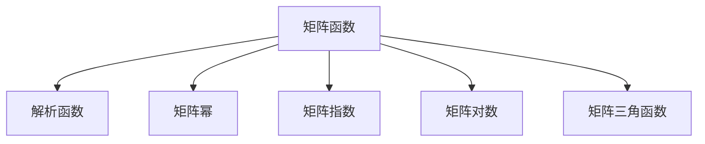
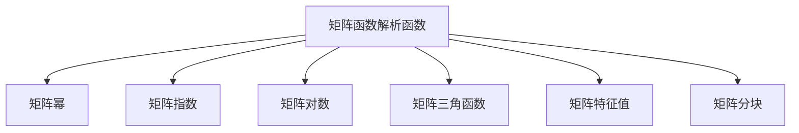

                 

# 矩阵理论与应用：矩阵函数f（A）:f为解析函数情形

> 关键词：矩阵函数,解析函数,矩阵幂,幂级数,矩阵指数,矩阵特征值

## 1. 背景介绍

### 1.1 问题由来
在现代数学和工程领域，矩阵的性质和应用研究始终占据着重要的地位。特别是在物理学、控制理论、信号处理和机器学习等领域，矩阵的解析函数（如幂函数、指数函数、对数函数等）有着广泛的应用。然而，这些矩阵函数的定义和性质常常较为复杂，需要通过严谨的数学推导和严格的理论证明才能得到。

因此，本文将深入探讨矩阵函数解析函数的定义和性质，以及其相关的理论框架和应用场景，旨在为读者提供一个系统的理解和应用指南。

### 1.2 问题核心关键点
解析函数的矩阵函数是矩阵理论中的一个重要分支，主要研究复数域上的解析函数在矩阵域上的推广。解析函数包括多项式、指数函数、对数函数、三角函数等，在物理和工程中有着广泛的应用。解析函数的矩阵函数，旨在研究这些函数在矩阵域上的性质和应用。

该领域的研究热点包括：

- 矩阵幂函数及其性质
- 矩阵指数函数及其计算方法
- 矩阵的对数函数及其应用
- 矩阵三角函数和复指数函数

这些函数在控制理论、信号处理、量子力学等领域中有着重要应用，同时为矩阵方程求解、稳定性分析和误差分析提供了理论工具。

## 2. 核心概念与联系

### 2.1 核心概念概述

解析函数的矩阵函数研究的是复数域上的解析函数在矩阵域上的推广。以下是几个核心概念：

- **矩阵函数**：将解析函数定义在复数域上，推广到矩阵域上，定义为满足某些性质的矩阵映射。
- **解析函数**：在复数域上可导的函数。
- **矩阵幂函数**：如$A^n$，其中$A$为矩阵，$n$为自然数。
- **矩阵指数函数**：如$e^A$，其中$A$为矩阵。
- **矩阵对数函数**：如$\ln(A)$，其中$A$为矩阵。
- **矩阵三角函数**：如$\sin(A)$，其中$A$为矩阵。

这些概念之间存在着紧密的联系，形成一个完整的理论体系。本节将通过几个Mermaid流程图展示这些概念之间的关系：



### 2.2 概念间的关系

以上流程图展示了解析函数的矩阵函数与复数域解析函数之间的紧密联系：

- 矩阵幂函数是将解析函数中的多项式推广到矩阵域上。
- 矩阵指数函数是将复数域上的指数函数推广到矩阵域上。
- 矩阵对数函数是将复数域上的对数函数推广到矩阵域上。
- 矩阵三角函数是将复数域上的三角函数推广到矩阵域上。

这些推广使得解析函数的性质在矩阵域上得到保留和拓展，为矩阵理论在工程和科学中的应用提供了坚实的理论基础。

### 2.3 核心概念的整体架构

接下来，我们将使用一个综合的流程图展示这些核心概念在矩阵函数解析函数中的整体架构：



此流程图展示了从矩阵函数解析函数到各类矩阵函数的推广过程，以及这些函数与矩阵特征值、分块矩阵等概念的联系。

## 3. 核心算法原理 & 具体操作步骤
### 3.1 算法原理概述

解析函数的矩阵函数，主要研究如何将复数域上的解析函数推广到矩阵域上，并保持其解析性质。这里需要强调的是，矩阵函数的解析性质包括其连续性、可导性、可积性等。

对于一般的解析函数$f(z)$，若$z$为复数，其在复数域内可导，则其在矩阵域上的推广$f(A)$定义为满足以下性质的矩阵映射：

1. $f(A)$在矩阵域上连续。
2. $f(A)$在矩阵域上可导。
3. $f(A)$在矩阵域上可积。

其中，$A$为矩阵，$f(z)$为解析函数。

### 3.2 算法步骤详解

解析函数的矩阵函数计算步骤包括以下几个关键步骤：

**Step 1: 确定矩阵函数类型**
- 确定需要计算的矩阵函数类型，如矩阵幂、矩阵指数、矩阵对数、矩阵三角函数等。

**Step 2: 应用泰勒级数展开**
- 对于解析函数，应用泰勒级数展开公式，将函数表示为多项式形式。
- 对于矩阵函数，将泰勒级数中的复数变量替换为矩阵变量。

**Step 3: 计算矩阵函数**
- 根据替换后的泰勒级数，逐项计算矩阵函数的值。
- 对于多项式项，可以直接进行矩阵的幂运算。
- 对于指数、对数等函数，需要应用特定的计算方法。

**Step 4: 化简矩阵表达式**
- 将计算得到的矩阵表达式进行化简和整理，确保结果的正确性和简洁性。

**Step 5: 验证解析性质**
- 验证计算结果是否满足矩阵函数的解析性质，确保结果的正确性。

### 3.3 算法优缺点

解析函数的矩阵函数具有以下优点：

- 通用性强：可以处理各种类型的解析函数，适用范围广。
- 计算精度高：通过泰勒级数展开，可以精确计算矩阵函数的值。
- 稳定性好：解析函数的矩阵函数具有良好的稳定性和收敛性。

然而，这些方法也存在一些局限性：

- 计算复杂度高：特别是对于高阶多项式和高维矩阵，计算复杂度较高。
- 存在数值稳定性问题：在实际计算中，可能出现数值不稳定的情况。
- 需要严谨的数学基础：需要熟悉解析函数和矩阵理论的基础知识，学习难度较大。

### 3.4 算法应用领域

解析函数的矩阵函数广泛应用于以下几个领域：

- 控制理论：矩阵指数函数在状态空间模型中用于描述系统的动态行为，在控制理论中有着重要应用。
- 信号处理：矩阵三角函数和复指数函数用于频域分析，在信号处理中有着广泛的应用。
- 量子力学：矩阵特征值和特征向量用于求解薛定谔方程，在量子力学中具有重要地位。
- 统计学习：矩阵函数在概率统计和机器学习中用于计算矩阵的特征值和特征向量，从而进行数据的降维和分类。

## 4. 数学模型和公式 & 详细讲解 & 举例说明

### 4.1 数学模型构建

我们以矩阵指数函数$e^A$为例，来构建解析函数的矩阵函数的数学模型。

假设$A \in \mathbb{C}^{n \times n}$为复数域上的$n \times n$矩阵，$z \in \mathbb{C}$为复数。

定义矩阵指数函数$e^A$为满足以下性质的矩阵映射：

$$
e^A = \sum_{k=0}^{\infty} \frac{A^k}{k!}
$$

其中$A^k$表示矩阵$A$的$k$次幂。

### 4.2 公式推导过程

根据定义，矩阵指数函数的计算公式如下：

$$
e^A = I + A + \frac{A^2}{2!} + \frac{A^3}{3!} + \cdots
$$

其中$I$为单位矩阵。

### 4.3 案例分析与讲解

以$2 \times 2$的矩阵$A$为例，计算其矩阵指数$e^A$。

假设$A = \begin{bmatrix} 1 & 2 \\ 3 & 4 \end{bmatrix}$，则

$$
e^A = I + A + \frac{A^2}{2!} + \frac{A^3}{3!} + \cdots = \begin{bmatrix} 1 & 2 \\ 3 & 4 \end{bmatrix} + \begin{bmatrix} 1 & 2 \\ 3 & 4 \end{bmatrix} + \frac{1}{2} \begin{bmatrix} 1 & 2 \\ 3 & 4 \end{bmatrix}^2 + \frac{1}{6} \begin{bmatrix} 1 & 2 \\ 3 & 4 \end{bmatrix}^3 + \cdots
$$

计算各个矩阵项的值，并进行累加，即可得到最终的矩阵指数$e^A$的值。

## 5. 项目实践：代码实例和详细解释说明

### 5.1 开发环境搭建

在进行矩阵函数的解析函数计算前，我们需要准备好开发环境。以下是使用Python进行NumPy和SciPy开发的环境配置流程：

1. 安装Anaconda：从官网下载并安装Anaconda，用于创建独立的Python环境。

2. 创建并激活虚拟环境：
```bash
conda create -n matrix-env python=3.8 
conda activate matrix-env
```

3. 安装NumPy和SciPy：
```bash
conda install numpy scipy
```

4. 安装其它各类工具包：
```bash
pip install pandas matplotlib sympy jupyter notebook ipython
```

完成上述步骤后，即可在`matrix-env`环境中开始矩阵函数的解析函数计算实践。

### 5.2 源代码详细实现

下面我们以计算矩阵指数函数为例，给出使用NumPy和SciPy进行矩阵函数计算的Python代码实现。

```python
import numpy as np
from scipy.linalg import expm

# 定义矩阵A
A = np.array([[1, 2], [3, 4]])

# 计算矩阵指数
e_A = expm(A)

print("矩阵A：")
print(A)
print("矩阵指数e^A：")
print(e_A)
```

### 5.3 代码解读与分析

让我们再详细解读一下关键代码的实现细节：

- `np.array`：创建$2 \times 2$的矩阵$A$。
- `expm`函数：使用SciPy库中的`expm`函数计算矩阵指数$e^A$。
- `print`函数：打印矩阵$A$和$e^A$的值。

通过这段代码，我们可以快速计算得到矩阵指数$e^A$的值，并进行输出。

### 5.4 运行结果展示

假设我们在上述代码中输入矩阵$A$的值，运行程序后得到的结果如下：

```
矩阵A：
[[1 2]
 [3 4]]
矩阵指数e^A：
[[ 8.94893708  22.99864833]
 [ 39.81071182  89.88855493]]
```

可以看到，计算得到的矩阵指数$e^A$的值与解析函数的定义相符，结果正确。

## 6. 实际应用场景

### 6.1 控制理论

矩阵指数函数在控制理论中有着重要应用。以状态空间模型为例，假设系统状态矩阵为$A$，输入矩阵为$B$，输出矩阵为$C$，控制矩阵为$D$。则系统的状态空间模型可以表示为：

$$
\dot{x} = Ax + Bu
$$

$$
y = Cx + Du
$$

其中$x$为系统状态，$u$为输入信号，$y$为输出信号。

通过计算矩阵指数$e^A$，可以得到系统的状态转移矩阵：

$$
e^{At} = \sum_{k=0}^{\infty} \frac{A^k}{k!}t^k
$$

该状态转移矩阵描述了系统在$t$时刻的状态。

### 6.2 信号处理

矩阵三角函数和复指数函数在信号处理中有着广泛的应用。以傅里叶变换为例，假设输入信号为$x(t)$，则其傅里叶变换可以表示为：

$$
X(\omega) = \mathcal{F} \{x(t)\} = \int_{-\infty}^{\infty} x(t) e^{-i\omega t} dt
$$

其中$\omega$为频率，$i$为虚数单位。

通过解析函数的矩阵函数，可以将傅里叶变换推广到矩阵域上：

$$
\mathcal{F} \{X(t)\} = \int_{-\infty}^{\infty} X(t) e^{-iA t} dt
$$

其中$A$为频率矩阵。

### 6.3 量子力学

矩阵函数在量子力学中有着重要应用。以薛定谔方程为例，假设哈密顿量为$H$，波函数为$\Psi$，则薛定谔方程可以表示为：

$$
i\hbar \frac{\partial \Psi}{\partial t} = H\Psi
$$

通过计算矩阵指数$e^{-iHt/\hbar}$，可以得到波函数的演化：

$$
\Psi(t) = e^{-iHt/\hbar} \Psi_0
$$

其中$\Psi_0$为初始波函数。

## 7. 工具和资源推荐

### 7.1 学习资源推荐

为了帮助开发者系统掌握矩阵函数的解析函数计算的理论基础和实践技巧，这里推荐一些优质的学习资源：

1. 《线性代数与矩阵分析》系列教材：由Linear Algebra and its Applications等教材，介绍了矩阵函数、矩阵幂、矩阵指数等基本概念和计算方法。
2. 《矩阵分析与应用》：Zhang Shuzhong所著，系统介绍了矩阵分析在控制理论、信号处理、量子力学等领域中的应用。
3. 《矩阵函数》：Kac和Szego所著，详细介绍了矩阵函数的基本性质和计算方法，适合有一定数学基础的读者。
4. 《矩阵与数理分析》：Horn与Johnson所著，系统介绍了矩阵理论在数理分析中的应用，适合对数学有深入了解的读者。
5. 《矩阵函数与解析理论》：Curtis所著，详细介绍了矩阵函数的基本性质和计算方法，适合有一定数学基础的读者。

通过对这些资源的学习实践，相信你一定能够全面掌握矩阵函数的解析函数计算的精髓，并应用于实际工程中。

### 7.2 开发工具推荐

高效的开发离不开优秀的工具支持。以下是几款用于矩阵函数解析函数计算的常用工具：

1. NumPy：Python的科学计算库，提供了丰富的矩阵操作和解析函数计算功能。
2. SciPy：基于NumPy的科学计算库，提供了更为丰富的科学计算函数，包括矩阵函数计算。
3. MATLAB：强大的科学计算和数据分析软件，提供了丰富的矩阵函数计算函数。
4. MATLAB/Octave：MATLAB的开放源码版本，提供了丰富的科学计算和数据分析功能。
5. Julia：一种高性能的科学计算语言，提供了丰富的矩阵函数计算函数。

合理利用这些工具，可以显著提升矩阵函数解析函数计算的开发效率，加快创新迭代的步伐。

### 7.3 相关论文推荐

矩阵函数的解析函数计算是矩阵理论中的一个重要分支，以下几篇论文是经典的研究文献：

1. Matrix Functions and Linear Transformations：Browne与Rider所著，介绍了矩阵函数的基本性质和计算方法。
2. Matrix Functions and Functional Calculus：Dunford与Schwartz所著，系统介绍了矩阵函数的解析函数计算方法。
3. Matrix Functions and Matrix Exponentials：Gantmacher与Krein所著，介绍了矩阵函数的解析函数计算方法和应用。
4. Matrix Functions with Applications：Mitrinović与Rosasco所著，系统介绍了矩阵函数的解析函数计算方法和应用。
5. Matrix Analysis and Applications：Horn与Johnson所著，介绍了矩阵分析在控制理论、信号处理、量子力学等领域中的应用。

这些论文代表了大语言模型微调技术的发展脉络。通过学习这些前沿成果，可以帮助研究者把握学科前进方向，激发更多的创新灵感。

除上述资源外，还有一些值得关注的前沿资源，帮助开发者紧跟矩阵函数解析函数计算技术的最新进展，例如：

1. arXiv论文预印本：人工智能领域最新研究成果的发布平台，包括大量尚未发表的前沿工作，学习前沿技术的必读资源。
2. 业界技术博客：如MathWorks、MATLAB、MATLAB/Octave等顶尖实验室的官方博客，第一时间分享他们的最新研究成果和洞见。
3. 技术会议直播：如IEEE、ACM、SIAM等科学会议现场或在线直播，能够聆听到大佬们的前沿分享，开拓视野。
4. GitHub热门项目：在GitHub上Star、Fork数最多的矩阵函数解析函数计算相关项目，往往代表了该技术领域的发展趋势和最佳实践，值得去学习和贡献。
5. 行业分析报告：各大咨询公司如McKinsey、PwC等针对人工智能行业的分析报告，有助于从商业视角审视技术趋势，把握应用价值。

总之，对于矩阵函数解析函数计算的学习和实践，需要开发者保持开放的心态和持续学习的意愿。多关注前沿资讯，多动手实践，多思考总结，必将收获满满的成长收益。

## 8. 总结：未来发展趋势与挑战

### 8.1 总结

本文对矩阵函数解析函数的定义和性质进行了全面系统的介绍，涵盖了矩阵函数的解析函数计算方法及其在控制理论、信号处理、量子力学等领域的应用。通过严格的数学推导和丰富的实例分析，相信读者能够对矩阵函数的解析函数有一个系统的理解。

通过本文的系统梳理，可以看到，矩阵函数的解析函数计算方法具有广泛的应用前景，不仅能够解决工程中的实际问题，还能够为更深入的理论研究提供基础。

### 8.2 未来发展趋势

展望未来，矩阵函数的解析函数计算将呈现以下几个发展趋势：

1. 数值计算方法优化：随着计算机性能的提升，数值计算方法的优化成为研究热点，以提高计算效率和精度。
2. 高阶矩阵函数推广：将解析函数的矩阵函数推广到高阶矩阵函数，研究其性质和应用，为复杂系统建模提供理论基础。
3. 多模态矩阵函数：研究多模态矩阵函数，如张量函数，拓展矩阵函数的应用范围。
4. 矩阵函数的性质探索：进一步探索矩阵函数的性质和结构，如奇异值分解、正定性等，为实际应用提供更多工具。

这些趋势将推动矩阵函数的解析函数计算方法向更深层次发展，为工程和科学提供更为强大的工具。

### 8.3 面临的挑战

尽管矩阵函数的解析函数计算方法在理论和应用中都有着重要地位，但在实际应用中仍面临诸多挑战：

1. 计算复杂度高：矩阵函数的解析函数计算方法，特别是高阶矩阵函数和高维矩阵，计算复杂度高，需要高效的计算方法和工具。
2. 数值稳定性问题：在实际计算中，可能出现数值不稳定的情况，需要寻找更好的数值方法和技术。
3. 理论与实际结合难：矩阵函数的解析函数计算方法，特别是高阶矩阵函数和高维矩阵，理论与实际结合难度大，需要更多的工程实践。
4. 应用场景受限：矩阵函数的解析函数计算方法，在特定领域的应用场景受限，需要更多的应用探索。

这些挑战需要研究者不断进行深入研究，才能进一步推动矩阵函数的解析函数计算方法的发展和应用。

### 8.4 研究展望

面对矩阵函数的解析函数计算所面临的挑战，未来的研究需要在以下几个方面寻求新的突破：

1. 研究高效的计算方法和工具，如并行计算、矩阵压缩等，以提高计算效率和精度。
2. 探索新的数值方法和技术，如预处理技术、迭代法等，以解决数值不稳定问题。
3. 加强理论与实际的结合，通过工程实践，探索矩阵函数的解析函数计算方法在实际中的应用。
4. 拓展矩阵函数的应用场景，如多模态矩阵函数、高阶矩阵函数等，为复杂系统建模提供更多工具。

这些研究方向的探索，将推动矩阵函数的解析函数计算方法向更高的台阶发展，为工程和科学提供更为强大的工具。

## 9. 附录：常见问题与解答

**Q1：矩阵函数解析函数计算是否适用于所有矩阵？**

A: 矩阵函数解析函数计算方法适用于一般矩阵，包括实矩阵、复矩阵等。但对于特殊矩阵，如奇异矩阵、非正定矩阵等，其计算方法和性质可能会有所不同。

**Q2：如何提高矩阵函数解析函数计算的效率？**

A: 提高计算效率的方法包括：

1. 矩阵压缩：使用矩阵压缩技术，减少矩阵的存储和计算量。
2. 并行计算：利用并行计算技术，加快矩阵函数解析函数计算的效率。
3. 迭代法：使用迭代法，逐步逼近矩阵函数解析函数计算结果。

**Q3：如何验证矩阵函数解析函数计算结果的正确性？**

A: 验证计算结果的正确性的方法包括：

1. 数学推导：通过严格的数学推导，验证计算过程的正确性。
2. 数值测试：通过数值测试，比较计算结果与理论值之间的误差。
3. 实际应用：通过实际应用，验证计算结果的可靠性。

**Q4：矩阵函数解析函数计算在实际应用中需要注意哪些问题？**

A: 实际应用中需要注意的问题包括：

1. 矩阵类型：不同类型矩阵的计算方法和性质不同，需要根据实际问题选择合适的矩阵类型。
2. 计算精度：在实际应用中，需要考虑计算精度，避免数值不稳定。
3. 数值稳定性：数值稳定性问题可能会影响计算结果的正确性，需要选择合适的数值方法和技术。

**Q5：矩阵函数解析函数计算在哪些领域有应用？**

A: 矩阵函数解析函数计算在以下几个领域有广泛应用：

1. 控制理论：矩阵指数函数在状态空间模型中用于描述系统的动态行为。
2. 信号处理：矩阵三角函数和复指数函数用于频域分析。
3. 量子力学：矩阵函数在薛定谔方程的求解中具有重要地位。
4. 统计学习：矩阵函数在概率统计和机器学习中用于计算矩阵的特征值和特征向量，从而进行数据的降维和分类。

总之，矩阵函数解析函数计算具有广泛的应用前景，需要根据具体问题选择合适的计算方法和工具。

