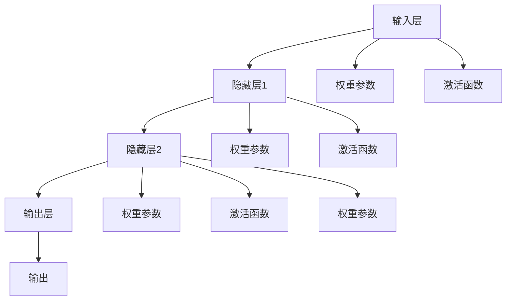

                 

# 神经网络：人类智慧的延伸

## 1. 背景介绍

### 1.1 问题由来

神经网络作为现代人工智能领域的核心技术之一，已经成为推动科技发展的重要力量。自从深度学习（Deep Learning）概念的提出以来，神经网络在图像识别、语音识别、自然语言处理等诸多领域取得了举世瞩目的成果。例如，深度卷积神经网络（CNN）在图像分类任务上超越了人类水平，自然语言处理模型（如BERT）在理解自然语言方面取得了前所未有的进展。

神经网络之所以能够取得如此辉煌的成就，其根本在于其具备了强大的数据建模能力和泛化能力。通过多层神经元之间的复杂非线性映射，神经网络可以从大量数据中学习出高层次的特征表示，并能够在新数据上表现出卓越的预测能力。这不仅让人类在计算机科学领域的能力得到了前所未有的提升，也引发了对人类智慧本质的深刻思考。

### 1.2 问题核心关键点

神经网络之所以能取得如此巨大成功，主要有以下几个关键因素：

- **大数据时代**：随着互联网和社交媒体的发展，我们积累了海量的数据，这为神经网络的训练提供了充足的样本。
- **计算能力提升**：高性能计算设备的普及，使得神经网络的计算效率大幅提升。
- **反向传播算法**：通过反向传播算法（Backpropagation），神经网络能够高效地更新参数，进行模型优化。
- **丰富的模型结构**：卷积神经网络（CNN）、循环神经网络（RNN）、注意力机制等丰富的模型结构，使得神经网络能够适应各种复杂的任务。
- **大规模预训练**：通过在大规模无标签数据上进行预训练，神经网络能够学习到通用知识，从而在特定任务上进行微调。

这些关键因素共同作用，使得神经网络成为现代人工智能的重要基石。然而，神经网络的本质是什么？它又是如何实现对人类智慧的延伸？本文将通过系统性的探讨，解答这些问题。

## 2. 核心概念与联系

### 2.1 核心概念概述

要深入理解神经网络，首先需要明确一些核心概念：

- **神经元（Neuron）**：神经网络中的基本单位，接收输入、计算加权和，并通过激活函数（如Sigmoid、ReLU等）输出结果。
- **权重（Weight）**：连接神经元之间的参数，用于调节输入信号的影响力。
- **激活函数（Activation Function）**：将神经元的输入信号转化为输出信号的函数。
- **损失函数（Loss Function）**：用于衡量模型预测结果与实际标签之间的差距，常见的有均方误差（MSE）、交叉熵（Cross-Entropy）等。
- **前向传播（Forward Propagation）**：输入数据从输入层开始，通过多层神经网络进行计算，最终输出结果的过程。
- **反向传播（Backpropagation）**：利用链式法则，计算模型预测错误对每个权重参数的影响，从而更新参数，减小损失。
- **梯度下降（Gradient Descent）**：一种常用的优化算法，通过计算损失函数对权重参数的梯度，不断调整参数，以最小化损失函数。
- **超参数（Hyperparameter）**：如学习率、批量大小、迭代轮数等，需要通过实验调节的参数。

### 2.2 概念间的关系

神经网络通过这些核心概念，实现了对复杂数据的高效建模和预测。下面通过一个简单的神经网络模型来说明这些概念之间的关系：



在这个简单模型中，输入层接收到数据，通过激活函数和权重参数进行计算，并将结果传递到隐藏层。隐藏层再次进行计算，最终输出结果。每个神经元都包含权重和激活函数，这些参数和函数通过反向传播算法更新，以最小化损失函数。超参数如学习率、批量大小等则通过实验调整，以优化训练过程。

## 3. 核心算法原理 & 具体操作步骤

### 3.1 算法原理概述

神经网络的训练过程主要分为两个阶段：前向传播和反向传播。前向传播通过计算得到模型预测结果，反向传播则通过计算误差，更新模型参数，以提高预测准确性。

具体来说，假设有一个简单的神经网络，包含一个输入层、两个隐藏层和一个输出层，每个隐藏层包含6个神经元。设输入数据为 $x$，输出目标为 $y$，模型预测结果为 $\hat{y}$。训练的目标是最小化损失函数 $L(y, \hat{y})$。

前向传播过程如下：

1. 输入数据 $x$ 通过输入层，得到第一个隐藏层的输出 $h_1$。
2. $h_1$ 通过激活函数和权重参数，得到第二个隐藏层的输出 $h_2$。
3. $h_2$ 通过激活函数和权重参数，得到输出层的输出 $\hat{y}$。

反向传播过程如下：

1. 计算输出层的损失 $L(y, \hat{y})$。
2. 通过链式法则，计算每个输出神经元的误差 $\delta_o$。
3. 反向传播误差 $\delta_o$ 到第二个隐藏层，计算误差 $\delta_2$。
4. 反向传播误差 $\delta_2$ 到第一个隐藏层，计算误差 $\delta_1$。
5. 通过误差 $\delta_1$ 和 $\delta_2$，更新隐藏层和输出层的权重参数。

### 3.2 算法步骤详解

以下是一个简单的训练过程，详细说明每一步操作：

1. 随机初始化模型参数 $\theta$。
2. 输入数据 $x$ 通过前向传播，计算模型预测结果 $\hat{y}$。
3. 计算损失函数 $L(y, \hat{y})$。
4. 通过反向传播，计算每个神经元的误差 $\delta$。
5. 更新权重参数，通过梯度下降算法 $\nabla_{\theta}L$ 更新每个参数。
6. 重复步骤2-5，直到损失函数收敛或达到预设迭代轮数。

### 3.3 算法优缺点

神经网络的优点主要体现在以下几个方面：

- **强大的特征提取能力**：神经网络能够学习到高层次的特征表示，适用于各种复杂的任务。
- **端到端的训练**：神经网络可以自动学习特征表示，无需手工设计特征工程。
- **强大的泛化能力**：神经网络能够在小规模数据上取得优异的性能，并且能够适应新数据。

然而，神经网络也存在一些缺点：

- **数据依赖性强**：神经网络需要大量的标注数据进行训练，数据质量对模型性能有直接影响。
- **计算资源需求高**：神经网络需要高性能计算设备，训练和推理过程中消耗大量的计算资源。
- **模型复杂度高**：神经网络结构复杂，难以解释，容易过拟合。
- **超参数调整难度大**：神经网络需要手动调节超参数，调整不当容易陷入局部最优。

### 3.4 算法应用领域

神经网络在多个领域得到了广泛的应用，包括但不限于：

- **计算机视觉**：如卷积神经网络（CNN），用于图像分类、物体检测、图像生成等。
- **自然语言处理**：如循环神经网络（RNN）、长短期记忆网络（LSTM）、Transformer等，用于文本分类、机器翻译、情感分析等。
- **语音识别**：如深度神经网络（DNN）、卷积神经网络（CNN）、循环神经网络（RNN）等，用于语音识别、语音合成等。
- **游戏AI**：如强化学习（Reinforcement Learning），用于训练AI游戏玩家，如AlphaGo。
- **医疗健康**：如深度学习在医学影像分析、药物发现、个性化治疗等领域的应用。

## 4. 数学模型和公式 & 详细讲解

### 4.1 数学模型构建

神经网络模型的构建需要考虑以下几个要素：

- **输入层**：将输入数据转化为神经网络可以处理的形式。
- **隐藏层**：神经网络的核心，通过多个神经元实现复杂的特征表示。
- **输出层**：将隐藏层的特征表示转化为模型的输出结果。

假设有一个包含一个输入层、两个隐藏层和一个输出层的神经网络模型。设输入层有 $n_{in}$ 个神经元，第一个隐藏层有 $n_h$ 个神经元，第二个隐藏层有 $n_h$ 个神经元，输出层有 $n_{out}$ 个神经元。设输入数据为 $x$，隐藏层和输出层的权重参数分别为 $W_{h1}$、$W_{h2}$、$W_{out}$，激活函数分别为 $f_h$、$f_o$。模型的输出结果为 $y$。

### 4.2 公式推导过程

前向传播过程如下：

$$
h_1 = f_h(W_{h1}x + b_{h1})
$$

$$
h_2 = f_h(W_{h2}h_1 + b_{h2})
$$

$$
y = f_o(W_{out}h_2 + b_{out})
$$

其中，$f_h$ 和 $f_o$ 分别为隐藏层和输出层的激活函数，$b_{h1}$、$b_{h2}$ 和 $b_{out}$ 分别为隐藏层和输出层的偏置项。

反向传播过程中，每个神经元的误差 $\delta$ 计算如下：

$$
\delta_o = (\nabla_{y}L)(\partial f_o(y)/\partial z_o)
$$

$$
\delta_{h2} = (\nabla_{h2}L)(f_h(W_{h2}h_1 + b_{h2}) * \partial f_h(h_2)/\partial z_{h2})
$$

$$
\delta_{h1} = (\nabla_{h1}L)(f_h(W_{h1}x + b_{h1}) * \partial f_h(h_1)/\partial z_{h1})
$$

其中，$\nabla_{y}L$ 为损失函数对输出层的梯度，$\nabla_{h2}L$ 和 $\nabla_{h1}L$ 分别为损失函数对隐藏层的梯度。

### 4.3 案例分析与讲解

以图像分类任务为例，设输入数据为 $x$，输出目标为 $y$，模型预测结果为 $\hat{y}$。假设有一个简单的神经网络，包含一个输入层、两个隐藏层和一个输出层，每个隐藏层包含6个神经元。输入数据 $x$ 通过输入层，得到第一个隐藏层的输出 $h_1$。$h_1$ 通过激活函数和权重参数，得到第二个隐藏层的输出 $h_2$。$h_2$ 通过激活函数和权重参数，得到输出层的输出 $\hat{y}$。通过反向传播，计算每个输出神经元的误差 $\delta$。

## 5. 项目实践：代码实例和详细解释说明

### 5.1 开发环境搭建

神经网络的开发环境搭建主要包括以下步骤：

1. 安装Python：Python是神经网络开发的主要语言，需要安装最新版本。
2. 安装NumPy：用于矩阵运算。
3. 安装TensorFlow或PyTorch：TensorFlow和PyTorch是常用的深度学习框架，提供了丰富的模型和工具。
4. 安装Keras：Keras是一个高层次的深度学习框架，提供了简单易用的API。
5. 安装数据集：如MNIST、CIFAR-10等常用数据集。

### 5.2 源代码详细实现

以下是一个简单的神经网络模型的实现代码，使用TensorFlow框架：

```python
import tensorflow as tf
from tensorflow.keras import layers, models

# 定义神经网络模型
model = models.Sequential([
    layers.Dense(64, activation='relu', input_shape=(784,)),
    layers.Dense(64, activation='relu'),
    layers.Dense(10, activation='softmax')
])

# 编译模型
model.compile(optimizer='adam',
              loss='sparse_categorical_crossentropy',
              metrics=['accuracy'])

# 加载数据集
(x_train, y_train), (x_test, y_test) = tf.keras.datasets.mnist.load_data()

# 数据预处理
x_train = x_train.reshape((60000, 784))
x_train = x_train / 255.0
x_test = x_test.reshape((10000, 784))
x_test = x_test / 255.0

# 训练模型
model.fit(x_train, y_train, epochs=5, batch_size=32, validation_data=(x_test, y_test))

# 评估模型
model.evaluate(x_test, y_test)
```

### 5.3 代码解读与分析

以上代码实现了一个简单的神经网络模型，用于图像分类任务。首先，定义了一个包含两个隐藏层和一个输出层的神经网络模型。使用 `Sequential` 模型进行堆叠，每个隐藏层包含64个神经元，使用 ReLU 激活函数。输出层有10个神经元，使用 softmax 激活函数。

然后，使用 `compile` 方法进行模型编译，指定优化器为 `adam`，损失函数为 `sparse_categorical_crossentropy`，评估指标为 `accuracy`。

接着，加载 MNIST 数据集，将输入数据从二维矩阵转化为numpy数组，并进行归一化处理。然后，使用 `fit` 方法对模型进行训练，指定训练轮数为5，批量大小为32，验证集为测试集。最后，使用 `evaluate` 方法对模型进行评估，输出准确率。

## 6. 实际应用场景

### 6.1 智能推荐系统

智能推荐系统是神经网络在实际应用中非常成功的案例之一。通过分析用户的历史行为数据，神经网络可以学习到用户的兴趣偏好，从而推荐符合用户需求的商品或内容。例如，电商平台的商品推荐、音乐平台的个性化播放列表等。

### 6.2 语音识别

语音识别是神经网络在语音处理领域的重要应用之一。通过将语音信号转化为文本，神经网络可以实现语音识别、语音合成、智能客服等应用。例如，智能音箱、语音助手等。

### 6.3 图像识别

图像识别是神经网络在计算机视觉领域的重要应用之一。通过将图像转化为高层次的特征表示，神经网络可以实现图像分类、物体检测、图像生成等应用。例如，自动驾驶、医疗影像分析等。

### 6.4 自然语言处理

自然语言处理是神经网络在自然语言处理领域的重要应用之一。通过将自然语言转化为机器可理解的形式，神经网络可以实现机器翻译、文本摘要、情感分析等应用。例如，智能客服、智能写作助手等。

## 7. 工具和资源推荐

### 7.1 学习资源推荐

为了深入理解神经网络，以下是一些值得推荐的学习资源：

1. 《深度学习》（Ian Goodfellow 著）：介绍了深度学习的理论基础和实践方法，是深度学习领域的经典教材。
2. 《神经网络与深度学习》（Michael Nielsen 著）：介绍了神经网络的基本概念和计算原理，适合初学者学习。
3. Coursera 深度学习课程：由深度学习领域的知名教授讲授，涵盖深度学习的基本概念和实践方法。
4. Kaggle 数据竞赛：通过参加数据竞赛，可以深入理解深度学习的实际应用。
5. GitHub 代码库：阅读其他人的深度学习代码，学习其优化方法和实践经验。

### 7.2 开发工具推荐

以下是一些常用的深度学习开发工具：

1. TensorFlow：由Google开发的深度学习框架，支持分布式计算和GPU加速。
2. PyTorch：由Facebook开发的深度学习框架，支持动态计算图和GPU加速。
3. Keras：高层次的深度学习框架，提供了简单易用的API。
4. Jupyter Notebook：交互式编程工具，支持代码编写、数据可视化等。
5. Colab：Google提供的交互式编程环境，支持GPU加速。

### 7.3 相关论文推荐

以下是一些经典的深度学习论文，值得推荐：

1. AlexNet：ImageNet图像识别比赛的冠军算法，引入了卷积神经网络。
2. ResNet：深度残差网络，解决了深度神经网络的梯度消失问题。
3. Inception：多尺度卷积网络，提升了深度神经网络的特征提取能力。
4. LSTM：长短期记忆网络，用于处理时间序列数据。
5. Transformer：自注意力机制，用于处理自然语言处理任务。

## 8. 总结：未来发展趋势与挑战

### 8.1 研究成果总结

神经网络在各个领域已经取得了巨大的成功，但也面临着诸多挑战。未来，神经网络的研究方向主要包括以下几个方面：

1. **无监督学习**：通过无监督学习，神经网络可以自动学习数据的分布特性，无需标注数据。
2. **迁移学习**：通过迁移学习，神经网络可以适应新任务，无需从头训练。
3. **参数高效**：通过参数高效的方法，神经网络可以优化模型结构，减少计算资源消耗。
4. **模型解释性**：通过模型解释性，神经网络可以更好地理解其决策过程，提高算法的可解释性。
5. **计算效率**：通过计算效率优化，神经网络可以实现实时计算和推理。

### 8.2 未来发展趋势

未来，神经网络的发展趋势主要包括以下几个方面：

1. **更强大的模型**：通过更多的数据和计算资源，神经网络将学习到更复杂的特征表示。
2. **更高效的结构**：通过优化模型结构，神经网络将具备更高的计算效率和更低的内存占用。
3. **更广泛的场景**：神经网络将应用于更多的场景，如自动驾驶、智能制造等。
4. **更深入的理论**：神经网络的研究将更加深入，如因果推理、强化学习等。
5. **更广泛的合作**：神经网络的研究将更多地与生物学、心理学等领域结合，促进跨学科研究。

### 8.3 面临的挑战

尽管神经网络已经取得了巨大的成功，但仍面临一些挑战：

1. **数据质量问题**：神经网络需要高质量的标注数据进行训练，但数据获取成本高，数据质量难以保证。
2. **计算资源需求高**：神经网络的计算需求高，对高性能计算设备有较高要求。
3. **模型解释性不足**：神经网络的黑箱特性，难以解释其决策过程，导致应用场景有限。
4. **过拟合问题**：神经网络容易过拟合，导致模型在新数据上性能下降。
5. **伦理和安全问题**：神经网络的应用可能带来隐私泄露、偏见等问题，需要更多的伦理和安全保障。

### 8.4 研究展望

未来，神经网络的研究将更多地关注以下几个方向：

1. **无监督学习**：通过无监督学习，神经网络可以更好地处理小样本数据，减少标注成本。
2. **迁移学习**：通过迁移学习，神经网络可以适应更多任务，减少从头训练的时间。
3. **模型解释性**：通过模型解释性，神经网络可以更好地理解其决策过程，提高算法的可解释性。
4. **计算效率**：通过计算效率优化，神经网络可以实现实时计算和推理。
5. **跨学科研究**：神经网络的研究将更多地与生物学、心理学等领域结合，促进跨学科研究。

## 9. 附录：常见问题与解答

### 9.1 问题1：神经网络中的激活函数有哪些？

答：常用的激活函数包括 sigmoid、ReLU、tanh、LeakyReLU 等。其中，ReLU 是目前最常用的激活函数，因为它能够缓解梯度消失问题。

### 9.2 问题2：神经网络中的损失函数有哪些？

答：常用的损失函数包括均方误差（MSE）、交叉熵（Cross-Entropy）、对数似然损失等。其中，交叉熵损失常用于分类任务，均方误差常用于回归任务。

### 9.3 问题3：神经网络中的正则化方法有哪些？

答：常用的正则化方法包括 L1 正则化、L2 正则化、Dropout 等。其中，L2 正则化可以防止过拟合，Dropout 可以减少神经元之间的依赖关系。

### 9.4 问题4：神经网络的训练过程包括哪些步骤？

答：神经网络的训练过程包括前向传播、反向传播、梯度下降等步骤。其中，前向传播用于计算模型预测结果，反向传播用于计算误差，梯度下降用于更新模型参数。

### 9.5 问题5：神经网络的参数高效方法有哪些？

答：常用的参数高效方法包括适配器（Adapter）、LoRA、BitFit 等。这些方法可以只在特定层上更新参数，减少计算资源消耗。

作者：禅与计算机程序设计艺术 / Zen and the Art of Computer Programming

