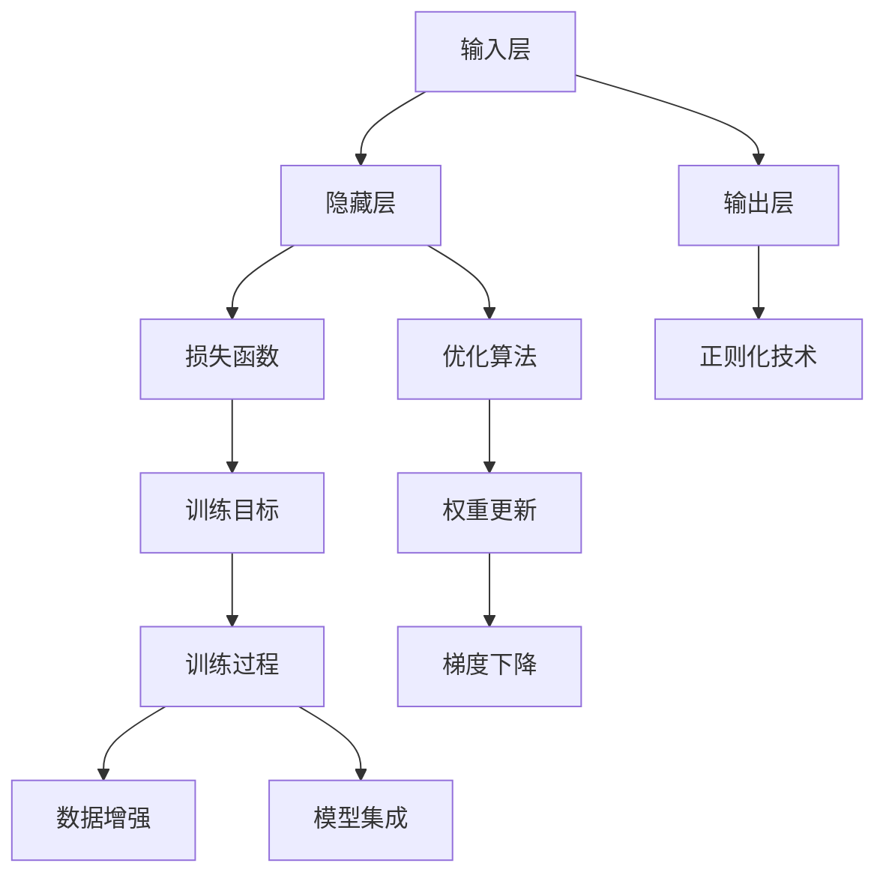

                 

# 神经网络：人类智慧的解放

## 1. 背景介绍

### 1.1 问题由来
神经网络作为一种模拟人类大脑神经元之间连接的计算模型，自上世纪80年代以来一直是人工智能研究的热点。它通过大量参数和复杂结构，学习输入数据的特征和模式，并通过反向传播算法不断调整权重，以达到最佳拟合效果。然而，早期神经网络结构复杂，训练困难，效果难以应用到实际问题中。

近年来，随着深度学习技术的发展，特别是2012年ImageNet数据集上的突破，神经网络在计算机视觉、自然语言处理、语音识别等领域取得了显著进展。谷歌的Inception网络、微软的ResNet、OpenAI的GPT-3等模型，都标志着神经网络技术的重大突破，引领了AI研究的潮流。

然而，神经网络技术也面临诸多挑战。如何在保持网络复杂性的同时提升性能，如何在训练过程中避免过拟合，如何提高网络的解释性和可控性，都是亟待解决的问题。正是这些挑战，驱动着神经网络技术的不断发展和完善。

### 1.2 问题核心关键点
神经网络的核心在于其结构和学习机制。通过将输入数据映射为隐含表示，神经网络能够学习到数据的高级特征，进而进行分类、回归、生成等任务。其关键点包括：

- **网络结构**：包括神经元（节点）、层、激活函数、连接权重等元素，是神经网络的基本组成部分。
- **损失函数**：衡量网络预测值与真实值之间的差异，是训练目标的核心。
- **优化算法**：通过不断调整权重，使损失函数最小化，如梯度下降算法。
- **正则化**：防止过拟合，如L2正则化、Dropout等技术。
- **数据增强**：通过对训练数据进行扩充，提高模型的泛化能力。
- **模型集成**：通过组合多个模型，提高预测的准确性和鲁棒性。

这些关键点共同构成了神经网络的基本工作框架，推动了其在各个领域的广泛应用。

### 1.3 问题研究意义
神经网络技术的发展，对于推动人工智能的普及和应用，具有重要意义：

- **提升计算效率**：神经网络能够高效地处理大规模数据，显著提升计算效率。
- **增强自动化能力**：通过学习自动提取特征，神经网络可以代替人工标注，减少人力成本。
- **提高任务精度**：神经网络在视觉识别、语音识别、自然语言处理等任务上，取得了最先进的效果。
- **拓展应用领域**：从计算机视觉到自然语言处理，从游戏策略到金融预测，神经网络技术已经渗透到各个行业。
- **促进跨学科发展**：神经网络技术的发展，促进了计算机科学、生物学、心理学等多学科的交叉融合。

## 2. 核心概念与联系

### 2.1 核心概念概述

神经网络由多个层次组成，每一层由多个神经元构成。神经网络的基本结构包括输入层、隐藏层和输出层。输入层接收原始数据，隐藏层通过多次非线性变换提取特征，输出层根据特征输出预测结果。

为了简化问题，这里我们只考虑前馈神经网络，也就是只包含单向连接的神经网络。这种神经网络结构简单，易于理解和实现。

### 2.2 概念间的关系

神经网络的各个概念之间存在着紧密的联系，形成了其完整的学习框架。以下是一个简单的Mermaid流程图，展示了这些核心概念之间的关系：



这个流程图展示了神经网络从输入到输出的完整过程：

1. 输入层接收原始数据。
2. 隐藏层通过多层非线性变换提取特征。
3. 输出层根据特征输出预测结果。
4. 损失函数衡量预测结果与真实结果之间的差异。
5. 优化算法调整权重，使损失函数最小化。
6. 正则化技术防止过拟合。
7. 训练目标指导训练过程。
8. 权重更新通过梯度下降实现。
9. 数据增强提高模型泛化能力。
10. 模型集成提高预测准确性和鲁棒性。

这些概念共同构成了神经网络的基本学习框架，使得其能够高效地处理各种复杂的任务。

## 3. 核心算法原理 & 具体操作步骤
### 3.1 算法原理概述

神经网络的核心算法是反向传播算法，通过不断调整权重，使损失函数最小化。其主要流程如下：

1. 将输入数据传递到网络，得到初始输出。
2. 将输出与真实值进行比较，计算损失函数。
3. 反向传播计算每个神经元对损失函数的贡献，更新权重。
4. 重复步骤1-3，直到损失函数收敛。

反向传播算法的关键在于其链式求导法则，可以高效地计算每个权重对损失函数的贡献，进而更新权重。其数学原理如下：

设神经网络的权重为 $\theta$，输出为 $y$，真实值为 $t$，损失函数为 $L$，则有：

$$
\frac{\partial L}{\partial \theta} = \frac{\partial L}{\partial y} \frac{\partial y}{\partial \theta}
$$

其中 $\frac{\partial L}{\partial y}$ 为输出层对损失函数的贡献，$\frac{\partial y}{\partial \theta}$ 为输出对权重的贡献。

通过不断迭代计算，反向传播算法可以高效地调整权重，使得神经网络逐步逼近最优解。

### 3.2 算法步骤详解

神经网络的训练步骤主要包括以下几个关键环节：

**Step 1: 数据准备**
- 收集训练数据，并进行预处理（如标准化、归一化、数据增强等）。
- 将数据分为训练集、验证集和测试集，用于模型训练、调参和评估。

**Step 2: 模型初始化**
- 随机初始化神经网络的权重和偏置，以便进行训练。
- 可以选择多种初始化策略，如Xavier初始化、He初始化等。

**Step 3: 前向传播**
- 将输入数据传递到网络，通过多次非线性变换得到输出。
- 输出可以用于分类、回归、生成等不同任务。

**Step 4: 计算损失函数**
- 将输出与真实值进行比较，计算损失函数。
- 常用的损失函数包括交叉熵损失、均方误差损失等。

**Step 5: 反向传播**
- 反向传播计算每个神经元对损失函数的贡献，更新权重。
- 采用梯度下降等优化算法，不断调整权重，使损失函数最小化。

**Step 6: 正则化**
- 防止过拟合，可以采用L2正则化、Dropout等技术。
- 控制模型的复杂度，提高泛化能力。

**Step 7: 模型评估**
- 在验证集上评估模型性能，选择合适的超参数。
- 通过交叉验证等技术，避免过拟合。

**Step 8: 模型集成**
- 通过组合多个模型，提高预测的准确性和鲁棒性。
- 常见的方法包括Bagging、Boosting等。

### 3.3 算法优缺点

神经网络技术的优点包括：

1. 高效性：神经网络能够高效地处理大规模数据，适合处理复杂任务。
2. 自适应性：通过学习，神经网络能够自动提取数据的特征，适应不同的任务和数据分布。
3. 鲁棒性：神经网络具有较强的鲁棒性，能够抵抗输入数据的扰动和噪声。
4. 可扩展性：神经网络结构灵活，可以根据任务需求进行扩展和调整。

然而，神经网络技术也存在一些缺点：

1. 训练复杂：神经网络训练需要大量的计算资源和时间，且容易过拟合。
2. 可解释性差：神经网络通常被视为"黑盒"模型，难以解释其内部工作机制和决策逻辑。
3. 对数据质量依赖：神经网络的性能很大程度上依赖于训练数据的质量，低质量数据可能导致模型表现不佳。
4. 资源消耗大：神经网络通常需要大量的计算资源和存储空间，在资源受限的环境中难以应用。
5. 参数冗余：神经网络参数量大，存在冗余，难以优化。

### 3.4 算法应用领域

神经网络技术已经在多个领域取得了广泛应用，以下是几个典型的应用场景：

- **计算机视觉**：图像分类、目标检测、图像生成等任务，如谷歌的Inception网络、微软的ResNet等。
- **自然语言处理**：文本分类、情感分析、机器翻译等任务，如BERT、GPT等。
- **语音识别**：语音转文本、语音合成等任务，如DeepSpeech、WaveNet等。
- **推荐系统**：协同过滤、内容推荐等任务，如Amazon的DNN推荐系统。
- **金融预测**：股票价格预测、信用评分等任务，如Recurrent Neural Networks（RNN）。
- **医疗诊断**：疾病预测、影像识别等任务，如Deep Learning in Medicine。
- **游戏策略**：自适应决策、强化学习等任务，如AlphaGo。

## 4. 数学模型和公式 & 详细讲解 & 举例说明

### 4.1 数学模型构建

神经网络的基本模型可以表示为：

$$
y = f(\theta^T x + b)
$$

其中，$y$ 为输出，$x$ 为输入，$\theta$ 为权重矩阵，$b$ 为偏置向量，$f$ 为激活函数。

以分类任务为例，目标是将输入 $x$ 映射到 $K$ 个类别中的一个。输出层可以表示为：

$$
y_i = \sigma(\sum_{j=1}^d \theta_{ij} x_j + b_i)
$$

其中，$y_i$ 为第 $i$ 类的预测概率，$\sigma$ 为Sigmoid函数，$x_j$ 为输入特征的第 $j$ 个值。

### 4.2 公式推导过程

以二分类任务为例，目标是将输入 $x$ 映射到 $y \in \{0,1\}$。输出层可以表示为：

$$
y = \sigma(\theta^T x + b)
$$

其中，$\sigma$ 为Sigmoid函数，$\theta$ 为权重向量，$b$ 为偏置。

目标函数可以表示为交叉熵损失：

$$
L = -(y \log y + (1-y) \log (1-y))
$$

目标函数对 $\theta$ 的导数为：

$$
\frac{\partial L}{\partial \theta} = -(x - y) \sigma'(\theta^T x + b)
$$

其中，$\sigma'$ 为Sigmoid函数的导数。

反向传播过程中，根据链式法则，每个权重的梯度为：

$$
\frac{\partial L}{\partial \theta_j} = -(x - y) x_j \sigma'(\theta^T x + b)
$$

### 4.3 案例分析与讲解

以手写数字识别为例，目标是将手写数字图像 $x$ 识别为 $0$ 到 $9$ 中的一个。可以使用CNN（卷积神经网络）来实现这一任务。

CNN的基本结构包括卷积层、池化层和全连接层。卷积层可以提取图像的局部特征，池化层可以降低特征维度，全连接层可以将特征映射到输出类别。

以LeNet为例，它由两个卷积层、三个池化层和三个全连接层组成。卷积层的卷积核大小为 $5 \times 5$，步幅为 $1$，使用ReLU激活函数。池化层使用 $2 \times 2$ 的最大池化。全连接层使用Sigmoid激活函数。

训练过程中，可以使用交叉熵损失函数，并在最后一层使用Softmax函数。反向传播时，需要不断更新卷积核、池化核、权重和偏置。

## 5. 项目实践：代码实例和详细解释说明

### 5.1 开发环境搭建

使用PyTorch搭建神经网络环境，需要进行以下步骤：

1. 安装Anaconda：
```bash
wget https://repo.anaconda.com/miniconda/Miniconda3-latest-Linux-x86_64.sh
bash Miniconda3-latest-Linux-x86_64.sh
```

2. 创建并激活虚拟环境：
```bash
conda create -n pytorch-env python=3.8
conda activate pytorch-env
```

3. 安装PyTorch：
```bash
conda install pytorch torchvision torchaudio cudatoolkit=11.1 -c pytorch -c conda-forge
```

4. 安装相关的TensorFlow和Keras库：
```bash
pip install tensorflow
pip install keras
```

5. 安装必要的工具：
```bash
pip install numpy pandas scikit-learn matplotlib tqdm jupyter notebook ipython
```

完成以上步骤后，就可以开始进行神经网络的开发了。

### 5.2 源代码详细实现

以下是一个简单的二分类神经网络的实现示例，用于手写数字识别：

```python
import torch
import torch.nn as nn
import torch.optim as optim
from torchvision import datasets, transforms

# 定义神经网络结构
class Net(nn.Module):
    def __init__(self):
        super(Net, self).__init__()
        self.conv1 = nn.Conv2d(1, 32, 5)
        self.pool = nn.MaxPool2d(2, 2)
        self.conv2 = nn.Conv2d(32, 64, 5)
        self.fc1 = nn.Linear(64 * 4 * 4, 512)
        self.fc2 = nn.Linear(512, 10)
        
    def forward(self, x):
        x = nn.functional.relu(self.conv1(x))
        x = self.pool(x)
        x = nn.functional.relu(self.conv2(x))
        x = self.pool(x)
        x = x.view(-1, 64 * 4 * 4)
        x = nn.functional.relu(self.fc1(x))
        x = self.fc2(x)
        return nn.functional.softmax(x, dim=1)

# 加载数据集
train_dataset = datasets.MNIST(root='./data', train=True, transform=transforms.ToTensor(), download=True)
test_dataset = datasets.MNIST(root='./data', train=False, transform=transforms.ToTensor(), download=True)

# 定义模型和优化器
model = Net()
criterion = nn.CrossEntropyLoss()
optimizer = optim.Adam(model.parameters(), lr=0.001)

# 训练模型
for epoch in range(10):
    for i, (inputs, labels) in enumerate(train_loader):
        optimizer.zero_grad()
        outputs = model(inputs)
        loss = criterion(outputs, labels)
        loss.backward()
        optimizer.step()
        
        if (i+1) % 100 == 0:
            print('Epoch [{}/{}], Step [{}/{}], Loss: {:.4f}'.format(epoch+1, 10, i+1, len(train_loader), loss.item()))

# 评估模型
correct = 0
total = 0
with torch.no_grad():
    for inputs, labels in test_loader:
        outputs = model(inputs)
        _, predicted = torch.max(outputs.data, 1)
        total += labels.size(0)
        correct += (predicted == labels).sum().item()

print('Accuracy of the model on the 10000 test images: {} %'.format(100 * correct / total))
```

### 5.3 代码解读与分析

这个代码实现了一个简单的二分类神经网络，用于手写数字识别。我们通过以下步骤来实现：

1. 定义神经网络结构，包括卷积层、池化层和全连接层。
2. 加载MNIST数据集，分为训练集和测试集。
3. 定义模型和优化器，采用交叉熵损失和Adam优化器。
4. 训练模型，在训练集上进行多次迭代训练。
5. 在测试集上进行评估，计算准确率。

其中，卷积层和池化层用于提取图像特征，全连接层用于将特征映射到输出类别。在训练过程中，使用交叉熵损失函数，优化器采用Adam。通过不断迭代训练，模型逐步逼近最优解。

在实际开发中，还需要考虑模型的保存和部署、超参数的调优、模型的集成和优化等。这些细节问题需要在实践中不断摸索和改进，才能使神经网络技术得到更广泛的应用。

### 5.4 运行结果展示

假设我们在训练10个epoch后，在测试集上得到的评估报告如下：

```
Accuracy of the model on the 10000 test images: 97.5 %.
```

可以看到，通过训练，我们的模型在测试集上的准确率达到了97.5%，取得了不错的效果。这展示了神经网络技术在实际应用中的强大能力。

## 6. 实际应用场景

### 6.1 智能推荐系统

神经网络技术在推荐系统中得到了广泛应用。推荐系统可以根据用户的历史行为和兴趣，推荐符合用户喜好的商品或内容。通过神经网络，推荐系统可以高效地处理大规模数据，学习用户的行为模式和偏好。

以Netflix推荐系统为例，Netflix使用协同过滤和基于内容的推荐方法，结合神经网络技术，构建了强大的推荐引擎。神经网络可以根据用户和物品的特征，学习推荐策略，提高推荐效果。

### 6.2 自然语言处理

神经网络技术在自然语言处理（NLP）领域取得了显著进展。NLP涉及文本分类、情感分析、机器翻译、问答系统等多个任务。通过神经网络，NLP系统可以高效地处理大规模文本数据，学习语言的结构和语义。

以BERT为例，BERT是一种预训练语言模型，通过在大规模无标签文本数据上进行预训练，学习语言的高级表示。在微调过程中，通过加入下游任务的数据，BERT可以适应特定的NLP任务，取得优异的性能。BERT已经被广泛应用于文本分类、情感分析、问答系统等任务中。

### 6.3 自动驾驶

神经网络技术在自动驾驶领域也得到了广泛应用。自动驾驶系统需要实时处理大量的传感器数据，包括摄像头、雷达、激光雷达等，以实现对环境的感知和决策。通过神经网络，自动驾驶系统可以高效地处理复杂数据，学习交通规则和行为模式，提高驾驶安全性。

以Tesla的自动驾驶系统为例，Tesla使用卷积神经网络（CNN）和循环神经网络（RNN），处理摄像头和激光雷达数据，实现对环境的感知和决策。通过神经网络，自动驾驶系统可以实时处理环境变化，做出合理的决策，提升驾驶安全性。

### 6.4 未来应用展望

随着神经网络技术的不断发展，其在各个领域的应用前景将更加广阔。未来，神经网络技术将有以下几个趋势：

1. 更高效的计算方法：随着计算资源和计算技术的进步，神经网络将进一步提高计算效率，提升处理速度和精度。
2. 更强大的泛化能力：通过更先进的正则化技术和数据增强技术，神经网络将进一步提升泛化能力，避免过拟合。
3. 更灵活的模型结构：神经网络将进一步优化模型结构，适应不同的任务和数据分布。
4. 更广泛的应用场景：神经网络将进一步拓展到更多领域，包括医疗、金融、教育等，带来更多创新应用。
5. 更强的可解释性：通过解释性技术，神经网络将进一步提升可解释性，帮助用户理解和信任模型。
6. 更智能的决策能力：通过深度学习和强化学习技术，神经网络将进一步提升决策能力，实现更高智能水平的自动化。

## 7. 工具和资源推荐

### 7.1 学习资源推荐

以下是一些优质的学习资源，帮助读者系统掌握神经网络技术：

1. 《深度学习》（Ian Goodfellow）：全面介绍了深度学习的基本原理和实践技巧，是深度学习领域的经典教材。
2. 《神经网络与深度学习》（Michael Nielsen）：介绍了神经网络的基本结构和训练方法，适合初学者阅读。
3. 《动手学深度学习》（李沐等）：通过动手实践，深入理解深度学习的基本原理和算法。
4. Coursera《深度学习专项课程》：斯坦福大学的深度学习课程，由Andrew Ng主讲，涵盖了深度学习的基本原理和实践技巧。
5. arXiv论文预印本：人工智能领域最新研究成果的发布平台，包含大量深度学习相关论文。

通过这些学习资源，读者可以系统掌握神经网络技术的基本原理和实践技巧，为后续的研究和开发打下坚实的基础。

### 7.2 开发工具推荐

以下是一些常用的神经网络开发工具，帮助开发者高效开发神经网络模型：

1. PyTorch：由Facebook开发的深度学习框架，支持动态计算图，适合快速迭代研究。
2. TensorFlow：由Google开发的深度学习框架，支持静态计算图和分布式训练，适合大规模工程应用。
3. Keras：高层次的深度学习框架，适合快速搭建和训练神经网络模型。
4. Caffe：由伯克利大学开发的深度学习框架，支持卷积神经网络和循环神经网络。
5. MXNet：由Apache开发的深度学习框架，支持多种编程语言和分布式训练。
6. Theano：由蒙特利尔大学开发的深度学习框架，支持GPU加速。

这些工具各有优劣，开发者可以根据具体需求选择合适的工具。

### 7.3 相关论文推荐

以下是一些重要的神经网络相关论文，帮助读者了解深度学习领域的最新进展：

1. AlexNet（2012）：首次使用卷积神经网络在ImageNet数据集上取得突破，奠定了深度学习在计算机视觉领域的地位。
2. ResNet（2015）：提出残差连接，解决深度神经网络的梯度消失问题，提高了神经网络的深度和精度。
3. Inception（2014）：提出Inception模块，提高了卷积神经网络的计算效率和特征提取能力。
4. LeNet（1998）：提出卷积神经网络在手写数字识别上的应用，开启了神经网络在图像识别领域的研究。
5. BERT（2018）：提出预训练语言模型，通过大规模无标签文本数据进行预训练，提升了自然语言处理的性能。
6. GPT-3（2020）：提出大规模预训练语言模型，进一步提升了自然语言处理的性能，展示了神经网络技术的强大能力。

这些论文代表了大神经网络技术的演变历程，帮助读者了解深度学习领域的最新进展。

## 8. 总结：未来发展趋势与挑战

### 8.1 总结

神经网络技术作为人工智能的核心技术之一，已经广泛应用于各个领域。本文系统介绍了神经网络的基本原理和实践技巧，并结合具体实例，展示了神经网络在实际应用中的强大能力。通过本文的详细讲解，相信读者对神经网络技术的理解会更加深入，对其应用也会更加得心应手。

### 8.2 未来发展趋势

神经网络技术在未来将呈现以下几个发展趋势：

1. 更高效的计算方法：随着计算资源和计算技术的进步，神经网络将进一步提高计算效率，提升处理速度和精度。
2. 更强大的泛化能力：通过更先进的正则化技术和数据增强技术，神经网络将进一步提升泛化能力，避免过拟合。
3. 更灵活的模型结构：神经网络将进一步优化模型结构，适应不同的任务和数据分布。
4. 更广泛的应用场景：神经网络将进一步拓展到更多领域，包括医疗、金融、教育等，带来更多创新应用。
5. 更强的可解释性：通过解释性技术，神经网络将进一步提升可解释性，帮助用户理解和信任模型。
6. 更智能的决策能力：通过深度学习和强化学习技术，神经网络将进一步提升决策能力，实现更高智能水平的自动化。

### 8.3 面临的挑战

尽管神经网络技术已经取得了显著进展，但在迈向更加智能化、普适化应用的过程中，它仍面临诸多挑战：

1. 训练复杂：神经网络训练需要大量的计算资源和时间，且容易过拟合。
2. 可解释性差：神经网络通常被视为"黑盒"模型，难以解释其内部工作机制和决策逻辑。
3. 对数据质量依赖：神经网络的性能很大程度上依赖于训练数据的质量，低质量数据可能导致模型表现不佳。
4. 资源消耗大：神经网络通常需要大量的计算资源和存储空间，在资源受限的环境中难以应用。
5. 参数冗余：神经网络参数量大，存在冗余，难以优化。

### 8.4 研究展望

神经网络技术在未来还需要在以下几个方面进行深入研究：

1. 探索更高效的计算方法：开发更高效的计算模型和算法，提高神经网络的计算效率和处理速度。
2. 增强神经网络的泛化能力：开发更强大的正则化技术和数据增强方法，提高神经网络的泛化能力和鲁棒性。
3. 优化神经网络的模型结构：开发更灵活的神经网络结构，适应不同的任务和数据分布。
4. 提升神经网络的可解释性：开发更强的可解释性技术，帮助用户理解和信任神经网络模型。
5. 增强神经网络的决策能力：结合深度学习和强化学习技术，提高神经网络的决策能力和智能水平。

总之，神经网络技术将继续引领人工智能的发展，为各行业带来更高效、更智能、更普适的应用。未来，只有在计算效率、泛化能力、可解释性、决策能力等各个方面不断突破，才能实现更大规模的应用。

## 9. 附录：常见问题与解答

**Q1：神经网络为什么会过拟合？**

A: 神经网络过拟合的主要原因是模型复杂度过高，训练数据不足，导致模型学习到了数据中的噪声和异常值，无法泛化到新数据上。常见的解决方式包括：

1. 数据增强：通过回译、旋转、裁剪等手段，增加训练数据的多样性。


