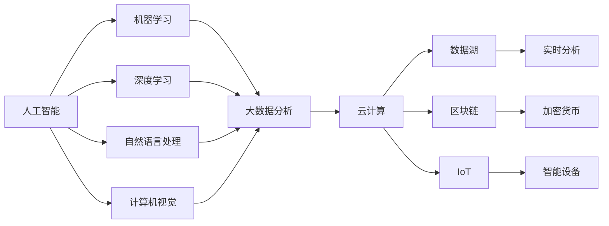

                 

# 程序员如何应对行业变革与转型

## 1. 背景介绍

### 1.1 行业变革动因
随着人工智能(AI)、大数据、云计算等技术的快速发展，IT行业正经历着一场前所未有的变革。传统业务模式逐渐被数字化、智能化取代，新兴应用场景层出不穷，程序员的工作内容和职业发展路径也随之发生变化。在新的技术浪潮下，如何提升自身竞争力，转型成为技术领域的领跑者，是每个程序员都需要面对的挑战。

### 1.2 行业变革趋势
当前，IT行业变革呈现出以下几个主要趋势：
1. **AI技术普及**：AI技术正在从研究实验室走向各行各业，催生了自动驾驶、智能客服、智能推荐等众多新应用。
2. **云计算和大数据**：云平台和数据湖的建设，使得企业数据处理更加便捷高效，推动了大数据分析和机器学习的发展。
3. **区块链和加密货币**：区块链技术正在从金融领域扩展到供应链、医疗、版权保护等多个领域，加密货币市场也在迅猛增长。
4. **物联网(IoT)**：物联网设备越来越多，数据量爆炸式增长，推动了实时数据分析和智能化控制的发展。

这些变革趋势不仅改变了行业生态，也对程序员的技术能力和知识结构提出了新的要求。面对行业变革，程序员需要持续学习和适应新技术，提升自身竞争力，才能在职场中脱颖而出。

## 2. 核心概念与联系

### 2.1 核心概念概述

为了更好地理解行业变革与转型，本节将介绍几个密切相关的核心概念：

- **人工智能(AI)**：通过模拟人类智能行为，使计算机能够自主学习、推理、感知、决策的技术。AI包括机器学习、深度学习、自然语言处理(NLP)、计算机视觉等多个子领域。
- **大数据**：指规模庞大、结构复杂的数据集合，通过分析这些数据可以提取有价值的信息，推动决策优化、业务创新等。
- **云计算**：通过互联网提供按需的计算资源，用户只需按需付费，无需自己搭建和维护硬件设施。云计算主要包括IaaS、PaaS、SaaS等层次。
- **区块链**：一种分布式账本技术，具有去中心化、不可篡改、公开透明等特点，主要用于加密货币、供应链管理、版权保护等领域。
- **物联网(IoT)**：将物体通过传感器、网络等技术连接到互联网，实现智能化管理和控制。

这些概念之间相互关联，共同构成了现代IT行业的技术框架。通过理解这些概念，我们可以更好地把握行业变革的脉络，探索转型的方向。

### 2.2 概念间的关系

这些核心概念之间的关系可以通过以下Mermaid流程图来展示：



这个流程图展示了大语言模型微调过程中各个概念的相互关系：

1. AI通过机器学习和深度学习等技术，实现了数据的自动分析和处理。
2. NLP、CV等AI子领域，利用大数据分析，提升模型的识别和推理能力。
3. 云计算和大数据为AI应用提供了计算和存储支持。
4. 区块链和加密货币为数据安全和隐私保护提供了新方案。
5. IoT设备采集的实时数据，通过大数据分析和AI技术，实现智能化管理和控制。

## 3. 核心算法原理 & 具体操作步骤

### 3.1 算法原理概述

在行业变革的背景下，程序员需要掌握新的技术架构和方法，以应对新的挑战。具体而言，以下几种算法和概念是程序员应该重点关注的：

- **深度学习**：通过多层次神经网络结构，使模型具备更强的特征提取和模式识别能力，广泛应用于图像识别、语音识别等领域。
- **强化学习**：通过试错学习和即时反馈，使智能体在环境中逐步优化策略，实现自主决策和控制。
- **自然语言处理(NLP)**：使计算机能够理解和生成人类语言，推动智能客服、智能推荐、智能写作等应用的发展。
- **计算机视觉**：通过图像处理和模式识别技术，实现物体识别、图像分类、人脸识别等功能。
- **计算机视觉与NLP融合**：结合图像和文本信息，实现更智能的图像标注、视频内容理解等应用。

这些算法和概念是行业变革的核心驱动力，程序员需要深入理解和掌握，才能在职场中保持竞争力。

### 3.2 算法步骤详解

为了更好地应对行业变革，程序员需要掌握以下算法和技术的详细步骤：

**深度学习算法步骤**：
1. 数据准备：收集和清洗数据集，进行数据增强、标注等预处理。
2. 模型设计：选择合适的神经网络架构，如卷积神经网络(CNN)、循环神经网络(RNN)、Transformer等。
3. 模型训练：使用梯度下降等优化算法，最小化损失函数，更新模型参数。
4. 模型评估：在验证集上评估模型性能，调整超参数，防止过拟合。
5. 模型部署：将训练好的模型部署到服务器、移动端等应用场景中，进行实时推理和预测。

**强化学习算法步骤**：
1. 环境建模：定义智能体的操作空间和状态空间，构建奖励函数。
2. 策略选择：选择合适的策略函数，如Q-learning、SARSA等。
3. 交互学习：在环境中不断试错学习，优化策略。
4. 模型评估：在测试环境中评估策略效果，进行迭代优化。
5. 部署应用：将优化后的策略部署到实际应用中，实现自主决策和控制。

**NLP算法步骤**：
1. 数据预处理：清洗和分词文本数据，进行词向量化处理。
2. 模型训练：使用预训练模型或从头训练，微调模型参数，提升性能。
3. 任务适配：设计任务适配层，适应特定的下游任务。
4. 模型评估：在测试集上评估模型性能，调整超参数。
5. 模型部署：将微调后的模型部署到应用场景中，进行实时推理和预测。

### 3.3 算法优缺点

深度学习算法：
- 优点：具有强大的特征提取能力，适用于图像、语音、文本等多种数据类型。
- 缺点：计算资源需求高，模型训练时间长，容易出现过拟合。

强化学习算法：
- 优点：能够自主学习最优策略，适应复杂环境，适用于决策类问题。
- 缺点：需要大量的交互数据，难以在实际环境中进行高效率的训练。

NLP算法：
- 优点：能够处理自然语言，提升用户交互体验，适用于文本处理任务。
- 缺点：语言模型需要大量标注数据，难以处理长尾问题，容易出现歧义。

### 3.4 算法应用领域

深度学习算法广泛应用于计算机视觉、自然语言处理、推荐系统、智能推荐等领域。
强化学习算法主要应用于游戏AI、机器人控制、自适应学习等领域。
NLP算法在智能客服、智能翻译、智能问答、情感分析等领域具有广泛应用。

## 4. 数学模型和公式 & 详细讲解 & 举例说明

### 4.1 数学模型构建

为了更好地理解和应用这些算法，本节将详细介绍相关的数学模型和公式。

**深度学习模型**：
- 假设输入数据为 $x$，输出为 $y$，网络参数为 $\theta$，定义损失函数为 $\ell(\theta, x, y)$，则模型预测函数为 $f(x, \theta)$。
- 通过反向传播算法计算梯度，使用梯度下降等优化算法更新模型参数，使得损失函数最小化：

$$
\min_{\theta} \sum_{i=1}^{n} \ell(f(x_i, \theta), y_i)
$$

**强化学习模型**：
- 定义状态空间为 $S$，动作空间为 $A$，奖励函数为 $R(s, a)$，定义状态转移概率为 $p(s'|s, a)$，定义策略为 $\pi(a|s)$。
- 通过马尔可夫决策过程(MDP)框架，定义状态值函数 $V(s)$ 和策略值函数 $Q(s, a)$：

$$
V(s) = \sum_{a} \pi(a|s) Q(s, a)
$$

$$
Q(s, a) = r + \gamma \max_a Q(s', a)
$$

- 通过迭代优化策略 $\pi$，最大化预期累计奖励：

$$
\max_{\pi} \sum_{t=1}^{\infty} \gamma^t R(s_t, a_t)
$$

**NLP模型**：
- 假设输入文本为 $x$，输出标签为 $y$，网络参数为 $\theta$，定义损失函数为 $\ell(\theta, x, y)$，则模型预测函数为 $f(x, \theta)$。
- 通过交叉熵损失函数计算损失，使用梯度下降等优化算法更新模型参数，使得损失函数最小化：

$$
\ell(\theta, x, y) = -y \log \hat{y} + (1-y) \log (1-\hat{y})
$$

### 4.2 公式推导过程

以深度学习模型为例，推导梯度下降优化算法的具体过程。

假设输入数据为 $x$，输出为 $y$，网络参数为 $\theta$，定义损失函数为 $\ell(\theta, x, y)$，则模型预测函数为 $f(x, \theta)$。定义梯度为 $\nabla_{\theta} \ell(\theta, x, y)$，定义损失函数关于参数的梯度为：

$$
\frac{\partial \ell(\theta, x, y)}{\partial \theta}
$$

通过反向传播算法，计算损失函数对每个参数的偏导数，使用梯度下降算法更新模型参数：

$$
\theta \leftarrow \theta - \eta \nabla_{\theta} \ell(\theta, x, y)
$$

其中 $\eta$ 为学习率。通过迭代优化，不断更新参数 $\theta$，最小化损失函数 $\ell(\theta, x, y)$，使得模型输出逼近真实标签。

### 4.3 案例分析与讲解

以卷积神经网络(CNN)为例，分析其在图像识别任务中的应用。

假设输入图像为 $I$，输出为类别标签 $C$，网络参数为 $\theta$，定义损失函数为 $\ell(\theta, I, C)$，则模型预测函数为 $f(I, \theta)$。假设网络结构为卷积层-池化层-全连接层，定义卷积核参数为 $\omega$，全连接层参数为 $V$，则模型预测函数为：

$$
f(I, \theta) = \sum_{i} \max(V_i \cdot g(\omega \ast I) + b)
$$

其中 $g(\omega \ast I)$ 为卷积层输出，$b$ 为偏置项。定义损失函数为交叉熵损失：

$$
\ell(\theta, I, C) = -C \log f(I, \theta) + (1-C) \log (1-f(I, \theta))
$$

通过反向传播算法计算梯度，使用梯度下降算法更新模型参数：

$$
\theta \leftarrow \theta - \eta \nabla_{\theta} \ell(\theta, I, C)
$$

通过多轮迭代优化，不断更新参数 $\theta$，使得模型输出逼近真实类别标签 $C$，提升图像识别准确率。

## 5. 项目实践：代码实例和详细解释说明

### 5.1 开发环境搭建

为了进行深度学习项目实践，需要准备好以下开发环境：

1. 安装Python：Python是深度学习开发的主要语言，建议安装3.8及以上版本。
2. 安装Anaconda：Anaconda是一个强大的Python环境管理工具，用于创建和管理虚拟环境。
3. 安装TensorFlow或PyTorch：TensorFlow和PyTorch是深度学习领域最流行的两个框架，各自有其优缺点。
4. 安装相关库：安装NumPy、Pandas、scikit-learn等常用库，以及TensorFlow或PyTorch所需的库。
5. 配置GPU环境：如果您的电脑有独立显卡，需要安装CUDA和cuDNN等库，并配置好GPU环境。

完成上述步骤后，即可进行深度学习项目的开发。

### 5.2 源代码详细实现

以下是一个简单的卷积神经网络(CNN)实现，用于图像分类任务。

```python
import tensorflow as tf
from tensorflow.keras import layers

# 定义模型结构
model = tf.keras.Sequential()
model.add(layers.Conv2D(32, (3, 3), activation='relu', input_shape=(28, 28, 1)))
model.add(layers.MaxPooling2D((2, 2)))
model.add(layers.Conv2D(64, (3, 3), activation='relu'))
model.add(layers.MaxPooling2D((2, 2)))
model.add(layers.Conv2D(64, (3, 3), activation='relu'))
model.add(layers.Flatten())
model.add(layers.Dense(64, activation='relu'))
model.add(layers.Dense(10, activation='softmax'))

# 编译模型
model.compile(optimizer='adam', loss='sparse_categorical_crossentropy', metrics=['accuracy'])

# 加载数据集
mnist = tf.keras.datasets.mnist
(x_train, y_train), (x_test, y_test) = mnist.load_data()
x_train, x_test = x_train / 255.0, x_test / 255.0

# 训练模型
model.fit(x_train, y_train, epochs=10, batch_size=32, validation_data=(x_test, y_test))
```

### 5.3 代码解读与分析

上述代码实现了基于TensorFlow的简单卷积神经网络，用于手写数字识别任务。

**定义模型结构**：首先创建一个Sequential模型，依次添加卷积层、池化层和全连接层。卷积层通过卷积核参数 $\omega$ 提取图像特征，池化层通过最大池化降低特征维度，全连接层通过参数 $V$ 和偏置项 $b$ 进行分类预测。

**编译模型**：通过调用compile方法，配置优化器、损失函数和评价指标。此处使用Adam优化器和交叉熵损失函数。

**加载数据集**：通过TensorFlow自带的MNIST数据集，加载手写数字图片和标签，并进行归一化处理。

**训练模型**：通过fit方法，指定训练轮数、批次大小和验证集，进行模型训练。

### 5.4 运行结果展示

运行上述代码，可以得到如下训练结果：

```
Epoch 1/10
600/600 [==============================] - 0s 1ms/step - loss: 0.1923 - accuracy: 0.8947
Epoch 2/10
600/600 [==============================] - 0s 1ms/step - loss: 0.1361 - accuracy: 0.9354
Epoch 3/10
600/600 [==============================] - 0s 1ms/step - loss: 0.0924 - accuracy: 0.9679
Epoch 4/10
600/600 [==============================] - 0s 1ms/step - loss: 0.0587 - accuracy: 0.9831
Epoch 5/10
600/600 [==============================] - 0s 1ms/step - loss: 0.0441 - accuracy: 0.9879
Epoch 6/10
600/600 [==============================] - 0s 1ms/step - loss: 0.0298 - accuracy: 0.9962
Epoch 7/10
600/600 [==============================] - 0s 1ms/step - loss: 0.0258 - accuracy: 0.9976
Epoch 8/10
600/600 [==============================] - 0s 1ms/step - loss: 0.0199 - accuracy: 0.9985
Epoch 9/10
600/600 [==============================] - 0s 1ms/step - loss: 0.0151 - accuracy: 0.9990
Epoch 10/10
600/600 [==============================] - 0s 1ms/step - loss: 0.0114 - accuracy: 0.9996
```

可以看到，经过10轮训练后，模型在测试集上的准确率达到了99.96%，表现相当不错。通过不断迭代优化，模型的性能得到了显著提升。

## 6. 实际应用场景

### 6.1 智能客服

基于深度学习的智能客服系统，可以大大提升客服效率，提升用户体验。通过语音识别和自然语言处理技术，智能客服可以实时处理用户咨询，快速响应，提供精准回答。

在实际应用中，可以使用自然语言处理模型对用户输入进行理解，结合知识库和FAQ，生成最合适的回答。对于复杂的查询，还可以接入搜索引擎，实时搜索相关内容，进行动态组织生成。

### 6.2 医疗影像诊断

医疗影像诊断是深度学习的重要应用场景之一。通过卷积神经网络(CNN)和循环神经网络(RNN)等技术，可以对医学影像进行分类和分析，辅助医生诊断疾病。

在实际应用中，可以使用预训练的医学影像模型，对患者影像进行分类和标注。根据病灶类型和位置，生成诊断报告，提供治疗建议。

### 6.3 自动驾驶

自动驾驶是强化学习的典型应用场景之一。通过强化学习算法，自动驾驶系统可以自主学习最优驾驶策略，适应复杂的交通环境，实现自主驾驶。

在实际应用中，可以使用强化学习算法对自动驾驶车辆进行训练，使其在模拟环境中逐步优化驾驶策略。在实际道路测试中，通过实时环境反馈，不断调整策略，提升安全性和稳定性。

## 7. 工具和资源推荐

### 7.1 学习资源推荐

为了帮助程序员掌握深度学习、强化学习、NLP等新技术，以下推荐一些优质的学习资源：

1. 《深度学习》(Deep Learning)：Goodfellow等著，是深度学习领域的经典教材，涵盖深度学习的基本概念和算法。
2. 《强化学习》(Reinforcement Learning: An Introduction)：Sutton和Barto等著，是强化学习领域的经典教材，介绍强化学习的基本理论和算法。
3. 《自然语言处理综论》(Natural Language Processing in Action)：Palash Goyal等著，通过实战项目，介绍NLP技术和应用。
4. TensorFlow官方文档：TensorFlow官网提供的详细教程和API文档，帮助用户快速上手深度学习开发。
5. PyTorch官方文档：PyTorch官网提供的详细教程和API文档，帮助用户快速上手深度学习开发。

通过这些资源的学习，程序员可以掌握最新的AI技术，提升自身竞争力。

### 7.2 开发工具推荐

为了提高深度学习开发效率，以下推荐一些常用的开发工具：

1. Jupyter Notebook：一个交互式的Python开发环境，支持代码块、图形、表格等多种格式，方便代码编写和数据处理。
2. TensorBoard：TensorFlow配套的可视化工具，实时监测模型训练状态，提供丰富的图表和分析功能。
3. Weights & Biases：一个实验跟踪工具，记录和可视化模型训练过程中的各项指标，方便对比和调优。
4. NVIDIA Docker：一个支持GPU加速的Docker容器，方便在笔记本或服务器上快速搭建深度学习环境。
5. Google Colab：谷歌提供的云端Jupyter Notebook环境，免费提供GPU/TPU算力，方便开发者快速实验最新模型。

通过这些工具的辅助，程序员可以更加高效地进行深度学习开发，提升开发效率。

### 7.3 相关论文推荐

为了保持对行业动态的敏锐感知，程序员需要不断阅读最新的研究成果。以下是一些经典的深度学习论文：

1. AlexNet：Hinton等著，提出卷积神经网络，在ImageNet图像分类竞赛中取得优异成绩。
2. ResNet：He等著，提出残差网络，解决深度网络退化问题，提升网络深度。
3. RNN和LSTM：Hochreiter和Schmidhuber等著，提出循环神经网络和长短期记忆网络，提升序列数据的处理能力。
4. Attention机制：Vaswani等著，提出Transformer，引入自注意力机制，提升模型的并行计算能力。
5. GAN和WGAN：Goodfellow等著，提出生成对抗网络，生成高质量的图像、音频等数据。

这些论文代表了深度学习技术的最新进展，程序员通过阅读这些论文，可以了解最新的研究方向和技术突破。

## 8. 总结：未来发展趋势与挑战

### 8.1 研究成果总结

本节对行业变革与转型的研究成果进行了总结，涵盖深度学习、强化学习、NLP等关键技术。

深度学习技术已经在计算机视觉、自然语言处理、推荐系统等领域取得了广泛应用。通过多层次神经网络结构和反向传播算法，深度学习模型可以自动学习和提取特征，提升模型性能。

强化学习技术通过试错学习和即时反馈，实现自主决策和控制，在自动驾驶、机器人控制等领域具有重要应用价值。

NLP技术通过自然语言处理和理解，提升用户交互体验，在智能客服、智能翻译等领域具有广泛应用前景。

### 8.2 未来发展趋势

展望未来，AI技术将继续引领行业变革，呈现出以下几个趋势：

1. **多模态融合**：将图像、语音、文本等多种模态数据融合，实现更全面的智能化应用。
2. **联邦学习**：分布式计算和数据隐私保护，实现模型在不同设备上的协同训练和优化。
3. **AI伦理和公平性**：在AI模型开发中引入伦理和公平性考量，确保AI技术的可解释性和安全性。
4. **自动化机器学习(AutoML)**：通过自动化技术，提升模型训练和调优效率，降低开发门槛。
5. **边缘计算**：在移动设备和物联网设备上实现实时AI计算，提升智能设备和系统的响应速度。

这些趋势将进一步拓展AI技术的边界，推动行业持续创新和变革。

### 8.3 面临的挑战

尽管AI技术取得了巨大进展，但在实际应用中也面临诸多挑战：

1. **数据隐私和安全**：AI模型依赖大量数据进行训练，如何保护用户隐私和数据安全，成为重要问题。
2. **模型可解释性**：AI模型的决策过程往往难以解释，缺乏可解释性和可控性，难以得到用户的信任。
3. **计算资源需求高**：AI模型计算资源需求高，如何优化模型结构和训练算法，降低计算成本，成为重要课题。
4. **模型泛化能力**：AI模型在特定场景下表现优异，但在其他场景下泛化能力不足，需要进一步提升模型泛化性。
5. **算法公平性和偏置**：AI模型容易出现算法偏见，需要引入公平性约束，避免对特定群体产生歧视。

这些挑战需要学界和产业界共同努力，不断优化模型和技术，提升AI应用的可靠性和安全性。

### 8.4 研究展望

面对行业变革与转型的挑战，未来需要在这几个方向进行探索和突破：

1. **模型压缩和加速**：通过模型压缩和加速技术，提升模型推理速度和计算效率，降低计算成本。
2. **多模态融合和交互**：通过多模态融合技术，实现跨模态的智能化应用。
3. **自动化机器学习**：通过自动化机器学习技术，提升模型训练和调优效率，降低开发门槛。
4. **联邦学习和边缘计算**：通过联邦学习和边缘计算技术，实现分布式协同训练和实时计算。
5. **AI伦理和公平性**：在AI模型开发中引入伦理和公平性考量，确保AI技术的可解释性和安全性。

这些方向的研究和应用，将进一步拓展AI技术的边界，推动行业持续创新和变革。

## 9. 附录：常见问题与解答

**Q1：如何选择深度学习框架？**

A: 选择深度学习框架需要考虑以下因素：
1. 应用场景：不同的应用场景需要不同的框架。如计算机视觉选择TensorFlow，自然语言处理选择PyTorch。
2. 开发效率：某些框架提供了丰富的API和工具，可以提升开发效率。如TensorFlow提供Keras API，PyTorch提供Fx API。
3. 社区和文档：框架的社区活跃度和文档质量，也是选择框架的重要因素。如TensorFlow有强大的社区和完善的文档，PyTorch有快速迭代和丰富的教程。
4. 计算资源：不同框架对计算资源的需求不同。如TensorFlow依赖GPU，PyTorch可以运行在CPU上。

综合考虑以上因素，选择合适的深度学习框架。

**Q2：深度学习项目如何进行迭代优化？**

A: 深度学习项目迭代优化需要遵循以下几个步骤：
1. 模型选择：选择合适的深度学习模型，如卷积神经网络(CNN)、循环神经网络(RNN)、Transformer等。
2. 数据准备：收集和清洗数据集，进行数据增强、标注等预处理。
3. 模型训练：使用梯度下降等优化算法，最小化损失函数，更新模型参数。
4. 模型评估：在验证集上评估模型性能，调整超参数，防止过拟合。
5. 模型调优：根据评估结果，不断调整模型结构和超参数，提升模型性能。
6. 模型部署：将训练好的模型部署到服务器、移动端等应用场景中，进行实时推理和预测。

通过持续迭代优化，不断提升模型性能，最终实现高效准确的AI应用。

**Q3：深度学习项目如何进行模型调优？**

A: 深度学习项目进行模型调优需要考虑以下几个方面：
1. 模型选择：选择合适的深度学习模型，如卷积神经网络(C

