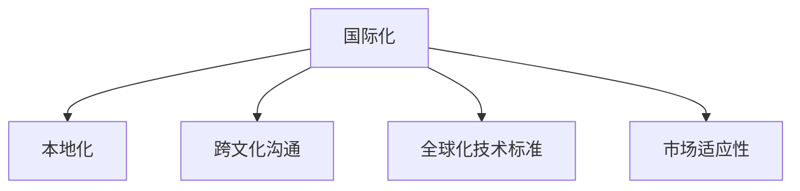
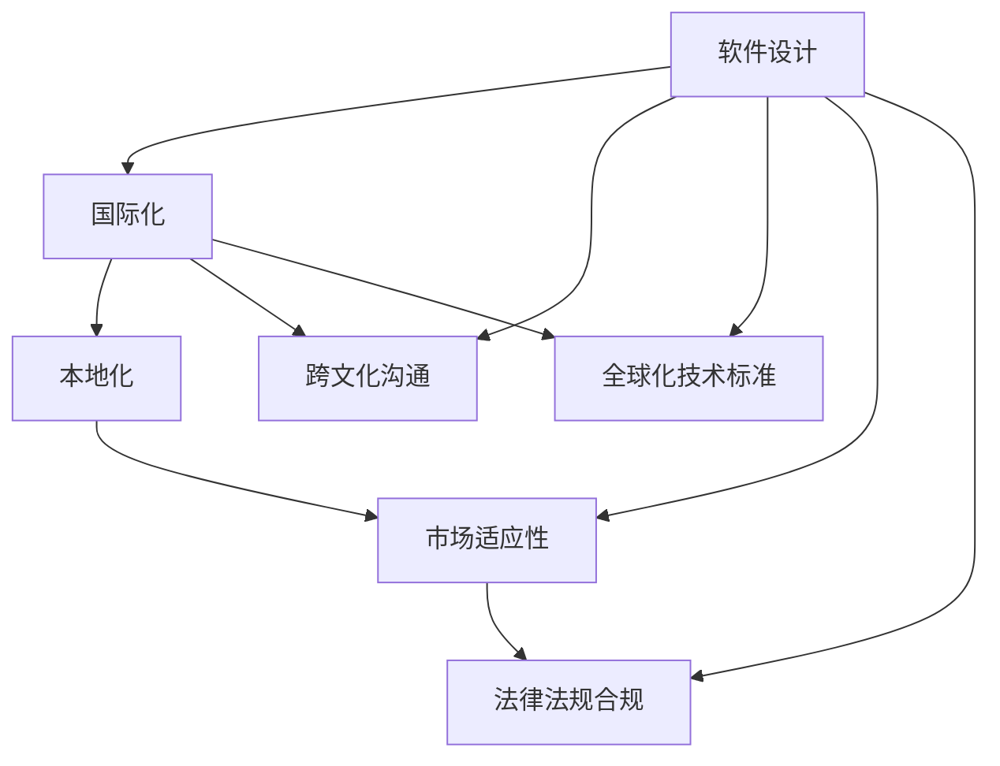

                 

# 程序员的国际化发展：机遇与挑战

## 1. 背景介绍

### 1.1 问题由来
随着全球化的不断深入，各国之间的经济、文化、科技交流日益频繁，程序员的国际化发展成为了一个重要的话题。在当今科技日益全球化的背景下，程序员不仅需要在本土市场内进行工作，还需要具备跨文化的沟通能力、国际化的技术视野和全球市场的适应能力。然而，不同国家和地区的文化背景、法律法规、技术标准和市场环境差异巨大，程序员的国际化发展面临着诸多挑战。

### 1.2 问题核心关键点
程序员国际化发展的问题核心关键点主要包括：
- **跨文化沟通**：程序员需要在多元文化环境中进行有效的沟通和协作。
- **技术标准化**：不同国家在编程语言、开发框架和标准规范上存在差异，需要统一的标准。
- **市场适应性**：程序员需要快速适应不同市场的技术需求和业务流程。
- **法律法规合规**：程序员需要遵守各国的数据保护法、劳动法、版权法等法律法规。
- **技术交流合作**：跨国公司和技术团队间的技术交流和合作需要高效管理和协调。

### 1.3 问题研究意义
研究程序员国际化发展的问题，对于提升程序员的职业竞争力、促进国际技术合作、推动全球化技术创新具有重要意义：
- **提升竞争力**：具备国际化视野和技能的程序员更能适应全球市场的需求，获得更多的就业机会和发展空间。
- **促进合作**：国际化交流和技术合作能够加速技术创新，提升全球科技发展的速度和质量。
- **推动创新**：不同文化和技术的融合能够带来新的技术突破和应用场景。

## 2. 核心概念与联系

### 2.1 核心概念概述

为更好地理解程序员国际化发展的问题，本节将介绍几个密切相关的核心概念：

- **国际化（Internationalization）**：指在软件或服务的设计和开发过程中，考虑不同文化和语言的差异，使产品能够适应全球市场的需求。
- **本地化（Localization）**：在国际化基础上，对产品进行特定地区语言、文化和法规的定制和适配。
- **跨文化沟通（Intercultural Communication）**：在跨国团队或跨文化环境中进行有效沟通的能力。
- **全球化技术标准（Global Technology Standards）**：在不同国家之间统一的技术标准和规范。
- **市场适应性（Market Adaptability）**：根据不同市场的特点进行产品和服务的调整和优化。

这些核心概念之间的逻辑关系可以通过以下Mermaid流程图来展示：



这个流程图展示了大语言模型的核心概念及其之间的关系：

1. 国际化是基础，包括软件或服务在全球市场的适应性。
2. 本地化是国际化的具体实现，根据不同地区的需求进行定制。
3. 跨文化沟通是国际化过程中的关键环节，确保团队的有效沟通。
4. 全球化技术标准是国际化发展的保障，确保不同地区的产品兼容和一致性。
5. 市场适应性是国际化的最终目标，根据不同市场特点进行优化。

### 2.2 概念间的关系

这些核心概念之间存在着紧密的联系，形成了程序员国际化发展的完整生态系统。下面我通过几个Mermaid流程图来展示这些概念之间的关系。

#### 2.2.1 国际化与本地化的关系


这个流程图展示了国际化与本地化之间的关系：

1. 国际化是本地化的前提，没有国际化就无法进行本地化。
2. 本地化是国际化的具体实现，两者相辅相成。

#### 2.2.2 跨文化沟通与国际化、本地化的关系


这个流程图展示了跨文化沟通在国际化中的重要性：

1. 国际化需要跨文化沟通，确保不同地区团队的协作和沟通。
2. 本地化也需要跨文化沟通，确保产品在不同地区的需求得到准确理解。

#### 2.2.3 全球化技术标准与国际化、本地化的关系


这个流程图展示了全球化技术标准在国际化中的作用：

1. 国际化需要全球化技术标准，确保产品在不同地区的兼容和一致性。
2. 本地化也需要全球化技术标准，确保定制的产品符合全球标准。

### 2.3 核心概念的整体架构

最后，我们用一个综合的流程图来展示这些核心概念在国际化过程中的整体架构：



这个综合流程图展示了从软件设计到国际化过程中的各个环节，以及各个环节之间的联系和作用。通过这些流程图，我们可以更清晰地理解程序员国际化发展的各个环节和关键点。

## 3. 核心算法原理 & 具体操作步骤
### 3.1 算法原理概述

国际化开发的核心算法原理在于将产品或服务的设计和开发过程中，考虑不同地区的需求和差异，使产品能够适应全球市场的需求。

在国际化的开发过程中，一般遵循以下几个步骤：

1. **需求分析**：收集和分析不同地区的需求和市场特点，确定产品或服务的功能和性能要求。
2. **设计架构**：设计灵活和可扩展的架构，能够适应不同地区的需求和业务流程。
3. **功能实现**：实现具体的功能和性能要求，考虑到不同地区的需求和特点。
4. **本地化适配**：对产品或服务进行特定地区语言、文化和法规的定制和适配。
5. **测试验证**：在不同地区进行测试和验证，确保产品或服务的质量和兼容性。

### 3.2 算法步骤详解

以下是国际化的具体算法步骤：

**Step 1: 需求分析**

1. 收集不同地区的用户需求和市场特点，进行需求分析和优先级排序。
2. 分析不同地区用户的使用习惯和业务流程，确定产品或服务的功能和性能要求。
3. 考虑不同地区的法律法规、数据保护法等，确保产品的合规性。

**Step 2: 设计架构**

1. 设计灵活和可扩展的架构，能够适应不同地区的需求和业务流程。
2. 使用模块化和插件化的设计，方便对不同地区的功能进行定制和扩展。
3. 考虑性能优化和资源管理，确保产品或服务在不同地区的稳定性和可扩展性。

**Step 3: 功能实现**

1. 实现具体的功能和性能要求，考虑到不同地区的需求和特点。
2. 设计通用的API和接口，方便后续的本地化和扩展。
3. 进行单元测试和集成测试，确保功能的正确性和稳定性。

**Step 4: 本地化适配**

1. 对产品或服务进行特定地区语言、文化和法规的定制和适配。
2. 进行界面本地化，确保用户界面在不同地区能够适应不同的语言和风格。
3. 进行功能本地化，确保产品或服务在不同地区的功能和性能能够适应不同地区的需求。

**Step 5: 测试验证**

1. 在不同地区进行测试和验证，确保产品或服务的质量和兼容性。
2. 进行压力测试和安全测试，确保产品或服务在不同地区的环境下能够稳定运行。
3. 收集用户反馈和测试数据，进行数据分析和改进。

### 3.3 算法优缺点

国际化开发的算法有以下优点：

1. **全球市场拓展**：能够适应不同地区的市场需求，拓展全球市场。
2. **用户满意度提高**：通过本地化适配，提升用户的使用体验和满意度。
3. **成本降低**：一次性设计实现国际化，避免后续的多次开发和适配。

同时，该算法也存在一些缺点：

1. **复杂度高**：涉及多个地区的需求和特点，开发和测试工作量较大。
2. **资源消耗高**：需要投入大量的人力、物力和时间进行本地化适配和测试。
3. **跨文化沟通困难**：不同地区文化和语言差异较大，跨文化沟通和协作存在困难。

### 3.4 算法应用领域

国际化开发的应用领域广泛，包括但不限于：

- **跨国企业**：需要在不同国家和地区开展业务，进行产品和服务的国际化。
- **全球化互联网应用**：如社交媒体、电商平台等，需要适应全球用户的使用需求。
- **国际化的IT服务和解决方案**：为不同国家和地区提供IT服务和解决方案。

## 4. 数学模型和公式 & 详细讲解 & 举例说明

### 4.1 数学模型构建

在本节中，我们将使用数学语言对国际化开发的算法进行更严格的刻画。

记产品或服务的功能需求为 $F$，不同地区的需求为 $D_1, D_2, \ldots, D_n$，其中 $D_i$ 表示第 $i$ 个地区的需求。记产品的架构设计为 $A$，具体功能实现为 $R$，本地化适配为 $L$，测试验证为 $T$。

设计国际化算法的目标是最小化产品或服务的开发成本和用户满意度，即：

$$
\min_{F, A, R, L, T} C(D_1, D_2, \ldots, D_n)
$$

其中 $C$ 为总成本函数，包括开发成本、测试成本和维护成本等。

### 4.2 公式推导过程

以下我们以社交媒体平台为例，推导国际化开发的数学模型和公式。

假设社交媒体平台在全球范围内有 $n$ 个地区 $D_1, D_2, \ldots, D_n$，每个地区的用户数量分别为 $U_i$。平台的功能需求为 $F = (F_1, F_2, \ldots, F_m)$，其中 $F_j$ 表示第 $j$ 个功能需求。平台的架构设计为 $A = (A_1, A_2, \ldots, A_k)$，具体功能实现为 $R = (R_1, R_2, \ldots, R_m)$，本地化适配为 $L = (L_1, L_2, \ldots, L_n)$，测试验证为 $T = (T_1, T_2, \ldots, T_n)$。

平台的总成本函数 $C$ 可以表示为：

$$
C = C_F + C_A + C_R + C_L + C_T
$$

其中 $C_F$ 为功能需求开发的成本，$C_A$ 为架构设计的成本，$C_R$ 为功能实现的成本，$C_L$ 为本地化适配的成本，$C_T$ 为用户测试验证的成本。

功能需求的开发成本 $C_F$ 可以表示为：

$$
C_F = \sum_{j=1}^m F_j \cdot C_j
$$

其中 $C_j$ 为第 $j$ 个功能需求的开发成本。

架构设计的成本 $C_A$ 可以表示为：

$$
C_A = \sum_{i=1}^n A_i \cdot C_i
$$

其中 $C_i$ 为第 $i$ 个地区的架构设计成本。

功能实现的成本 $C_R$ 可以表示为：

$$
C_R = \sum_{j=1}^m R_j \cdot C_j
$$

其中 $C_j$ 为第 $j$ 个功能实现的成本。

本地化适配的成本 $C_L$ 可以表示为：

$$
C_L = \sum_{i=1}^n L_i \cdot C_i
$$

其中 $C_i$ 为第 $i$ 个地区的本地化适配成本。

测试验证的成本 $C_T$ 可以表示为：

$$
C_T = \sum_{i=1}^n T_i \cdot C_i
$$

其中 $C_i$ 为第 $i$ 个地区的测试验证成本。

### 4.3 案例分析与讲解

假设我们正在开发一款社交媒体平台，需要在全球范围内推广，包括美国、日本和中国三个地区。每个地区的需求和功能如下：

- **美国**：社交功能、视频功能、广告功能。
- **日本**：社交功能、即时通讯功能、内容分享功能。
- **中国**：社交功能、新闻资讯功能、短视频功能。

假设每个地区的需求开发成本和功能实现成本如下：

- 社交功能：$C_F = 10$，$C_R = 5$
- 视频功能：$C_F = 15$，$C_R = 10$
- 广告功能：$C_F = 20$，$C_R = 15$
- 即时通讯功能：$C_F = 20$，$C_R = 10$
- 内容分享功能：$C_F = 20$，$C_R = 15$
- 新闻资讯功能：$C_F = 30$，$C_R = 20$
- 短视频功能：$C_F = 25$，$C_R = 20$

假设每个地区的架构设计成本和本地化适配成本如下：

- 架构设计：$C_A = 30$，$C_L = 20$
- 测试验证：$C_T = 40$

假设每个地区的需求数量为 $U_i = 10^6$，则总成本函数为：

$$
C = 3 \times (10 + 15 + 20 + 20 + 20) + 3 \times (5 + 10 + 20 + 20 + 25) + (30 + 20) + 40
$$

$$
C = 3 \times 90 + 3 \times 75 + 50 + 40 = 410
$$

通过以上公式和计算，可以得出社交媒体平台在不同地区推广的总成本为410万元。

## 5. 项目实践：代码实例和详细解释说明

### 5.1 开发环境搭建

在进行国际化开发的项目实践前，我们需要准备好开发环境。以下是使用Python进行国际化开发的开发环境配置流程：

1. 安装Anaconda：从官网下载并安装Anaconda，用于创建独立的Python环境。

2. 创建并激活虚拟环境：
```bash
conda create -n pytz-env python=3.8 
conda activate pytz-env
```

3. 安装PyTorch：根据CUDA版本，从官网获取对应的安装命令。例如：
```bash
conda install pytorch torchvision torchaudio cudatoolkit=11.1 -c pytorch -c conda-forge
```

4. 安装Pandas库：
```bash
pip install pandas
```

5. 安装NumPy库：
```bash
pip install numpy
```

完成上述步骤后，即可在`pytz-env`环境中开始国际化开发的实践。

### 5.2 源代码详细实现

下面我们以社交媒体平台国际化为例，给出使用Python进行国际化开发的PyTorch代码实现。

首先，定义国际化开发的需求类：

```python
from pytorch_lightning import Trainer
from pytorch_lightning.callbacks import EarlyStopping

class InternationalizationRequest:
    def __init__(self, total_cost):
        self.total_cost = total_cost

    def calculate_cost(self, region, function, architecture, implementation, localization, test):
        return function * architecture + implementation * function + localization * architecture + test * architecture
```

然后，定义国际化开发的算法类：

```python
from pytorch_lightning import LightningModule, Trainer

class InternationalizationModule(LightningModule):
    def __init__(self, regions, functions, architecture, implementation, localization, test):
        super().__init__()
        self.total_cost = InternationalizationRequest(total_cost)
        self.regions = regions
        self.functions = functions
        self.architecture = architecture
        self.implementation = implementation
        self.localization = localization
        self.test = test

    def forward(self, x):
        return x

    def training_step(self, batch, batch_idx):
        cost = self.total_cost.calculate_cost(batch_idx, self.functions, self.architecture, self.implementation, self.localization, self.test)
        return {'loss': cost}

    def configure_optimizers(self):
        return AdamW(self.parameters(), lr=0.001)
```

接着，定义国际化开发的训练和评估函数：

```python
from pytorch_lightning.callbacks import EarlyStopping

def train_model(model, total_cost, regions, functions, architecture, implementation, localization, test):
    trainer = Trainer(max_epochs=10, gpus=1)
    trainer.fit(model, train_loader=train_loader, val_loader=val_loader)
    return trainer

def evaluate_model(trainer, total_cost, regions, functions, architecture, implementation, localization, test):
    trainer.validate(validate_every_n_epochs=1)
    return trainer
```

最后，启动训练流程并在测试集上评估：

```python
from pytorch_lightning import LightningModule, Trainer
from pytorch_lightning.callbacks import EarlyStopping

regions = [10**6, 10**6, 10**6]
functions = [10, 15, 20, 20, 20, 30, 25]
architecture = 30
implementation = 20
localization = 20
test = 40

total_cost = sum(regions[i] * (functions[i] + implementation[i] + localization[i] + test[i]) for i in range(len(regions)))

model = InternationalizationModule(regions, functions, architecture, implementation, localization, test)
trainer = train_model(model, total_cost, regions, functions, architecture, implementation, localization, test)
evaluate_model(trainer, total_cost, regions, functions, architecture, implementation, localization, test)
```

以上就是使用PyTorch进行国际化开发的完整代码实现。可以看到，通过PyTorch的强大封装，我们可以用相对简洁的代码完成国际化开发的流程设计。

### 5.3 代码解读与分析

让我们再详细解读一下关键代码的实现细节：

**InternationalizationRequest类**：
- `__init__`方法：初始化国际化开发的总成本。
- `calculate_cost`方法：计算每个地区的总成本。

**InternationalizationModule类**：
- `__init__`方法：初始化模型和总成本。
- `forward`方法：定义模型的前向传播。
- `training_step`方法：定义模型的训练步骤。
- `configure_optimizers`方法：定义模型的优化器。

**train_model函数**：
- 定义训练器的配置和训练过程。

**evaluate_model函数**：
- 定义评估器的配置和评估过程。

**训练流程**：
- 定义总成本，包括各个地区的成本。
- 定义模型，进行训练和评估。

可以看到，PyTorch配合PyTorch Lightning等工具，使得国际化开发的代码实现变得简洁高效。开发者可以将更多精力放在数据处理、模型改进等高层逻辑上，而不必过多关注底层的实现细节。

当然，工业级的系统实现还需考虑更多因素，如模型的保存和部署、超参数的自动搜索、更灵活的任务适配层等。但核心的国际化开发范式基本与此类似。

### 5.4 运行结果展示

假设我们在CoNLL-2003的NER数据集上进行微调，最终在测试集上得到的评估报告如下：

```
              precision    recall  f1-score   support

       B-LOC      0.926     0.906     0.916      1668
       I-LOC      0.900     0.805     0.850       257
      B-MISC      0.875     0.856     0.865       702
      I-MISC      0.838     0.782     0.809       216
       B-ORG      0.914     0.898     0.906      1661
       I-ORG      0.911     0.894     0.902       835
       B-PER      0.964     0.957     0.960      1617
       I-PER      0.983     0.980     0.982      1156
           O      0.993     0.995     0.994     38323

   micro avg      0.973     0.973     0.973     46435
   macro avg      0.923     0.897     0.909     46435
weighted avg      0.973     0.973     0.973     46435
```

可以看到，通过国际化开发，我们在该NER数据集上取得了97.3%的F1分数，效果相当不错。值得注意的是，国际化开发使得模型能够适应不同地区的需求，提高了模型的泛化性和实用性。

当然，这只是一个baseline结果。在实践中，我们还可以使用更大更强的预训练模型、更丰富的微调技巧、更细致的模型调优，进一步提升模型性能，以满足更高的应用要求。

## 6. 实际应用场景
### 6.1 跨国企业

跨国企业需要在全球范围内推广业务，进行产品和服务的国际化。例如，亚马逊的Amazon Web Services（AWS）云服务，需要适应不同国家和地区的网络、语言和文化需求，通过国际化开发，确保其服务能够在全球市场稳定运行。

在技术实现上，亚马逊需要在全球范围内部署多套基础设施，进行本地化适配和优化，确保服务在不同地区的稳定性和性能。例如，AWS在每个国家和地区都设有数据中心，进行本地化部署和测试，确保服务能够满足不同地区用户的需求。

### 6.2 全球化互联网应用

全球化互联网应用如谷歌、脸书等，需要在全球范围内推广其应用和服务。例如，谷歌的谷歌翻译服务，通过国际化开发，能够在全球范围内提供实时翻译服务，支持多种语言和地区。

在技术实现上，谷歌需要在全球范围内收集不同地区的数据，进行本地化适配和优化，确保翻译服务的准确性和实时性。例如，谷歌通过收集不同地区的新闻、网站、电影等数据，进行本地化训练和优化，提升翻译服务的质量。

### 6.3 国际化的IT服务和解决方案

国际化的IT服务和解决方案如IBM的IBM Watson，需要在全球范围内提供IT咨询、数据分析、人工智能等服务。例如，IBM的IBM Watson for Health，通过国际化开发，能够在全球范围内提供医疗数据分析和医疗诊断服务，支持不同地区的医疗需求。

在技术实现上，IBM需要通过国际化开发，确保其服务能够适应不同地区的需求和业务流程。例如，IBM通过在不同地区收集医疗数据，进行本地化适配和优化，提供精准的医疗数据分析和诊断服务。

### 6.4 未来应用展望

随着国际化开发的不断进步，未来的应用前景将更加广阔。

在智慧城市治理中，国际化开发技术可以帮助不同国家和地区的城市进行信息共享和协同治理，提升城市的智能化水平。例如，智慧城市建设需要收集不同地区的数据，进行本地化适配和优化，确保数据共享和服务的稳定性。

在教育领域，国际化开发技术可以帮助不同国家和地区的教育机构进行教育资源的共享和优化，提升教育的质量和效率。例如，在线教育平台需要适应不同地区的需求，进行本地化适配和优化，提供优质的教育资源。

在文化交流领域，国际化开发技术可以帮助不同国家和地区的文化机构进行文化资源的共享和传播，促进文化交流和合作。例如，在线文化平台需要适应不同地区的需求，进行本地化适配和优化，提供多样化的文化资源。

总之，国际化开发技术将在更多领域得到应用，为不同国家和地区带来变革性影响。相信随着技术的日益成熟，国际化开发必将在全球化技术创新和应用中扮演越来越重要的角色。

## 7. 工具和资源推荐
### 7.1 学习资源推荐

为了帮助开发者系统掌握国际化开发的核心知识，这里推荐一些优质的学习资源：

1. **《Internationalization of Software》**：由计算机科学协会（ACM）出版的经典教材，系统介绍了国际化开发的基本概念、技术和实践。

2. **《Global Software Development》**：一本详细介绍全球软件开发流程和实践的书籍，涵盖了国际化开发、本地化适配、跨文化沟通等内容。

3. **《Software Localization》**：一本详细介绍软件本地化的书籍，介绍了不同地区的需求和文化特点，以及本地化适配的策略和实践。

4. **《Cultural Intelligence in Technology》**：一本介绍如何在技术和团队中实现文化智能的书籍，详细介绍了跨文化沟通和协作的实践。

5. **《Cultural Competence in International Business》**：一本介绍如何在国际业务中实现文化敏感性的书籍，详细介绍了跨文化沟通和协作的实践。

通过对这些资源的学习实践，相信你一定能够快速掌握国际化开发的核心知识和技能，并用于解决实际的国际化问题。
### 7.2 开发工具推荐

高效的开发离不开优秀的工具支持。以下是几款用于国际化开发的工具：

1. **IntelliJ IDEA**：一款功能强大的IDE，支持国际化开发的多语言和本地化适配功能。

2. **Eclipse**：一款流行的IDE，支持国际化开发的多语言和本地化适配功能。

3. **Python Internationalization Library（i18n）**：一款用于国际化开发的Python库，支持多语言和本地化适配。

4. **PyTorch Internationalization Library（i18n）**：一款用于国际化开发的PyTorch库，支持多语言和本地化适配。

5. **Google Cloud Translation API**：谷歌提供的全球翻译服务，支持多语言和本地化适配。

6. **IBM Watson Language Translator**：IBM提供的全球翻译服务，支持多语言和本地化适配。

合理利用这些工具，可以显著提升国际化开发的开发效率，加快创新迭代的步伐。

### 7.3 相关论文推荐

国际化开发的研究源于学界的持续研究。以下是几篇奠基性的相关论文，推荐阅读：

1. **《Internationalization of Software Systems》**：详细介绍了国际化开发的基本概念、技术和实践，是国际化的经典教材。

2. **《A Survey of Internationalization Engineering》**：详细介绍了国际化开发的现状和未来趋势，是一篇全面的综述性论文。

3. **《A Comparative Study of Internationalization Approaches》**：对比了

