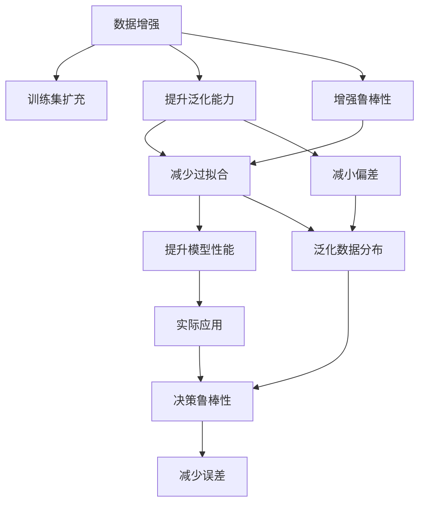

                 

## 1. 背景介绍

数据增强（Data Augmentation）在大数据时代被广泛应用于计算机视觉、自然语言处理等多个领域，旨在通过扩充训练数据集，提高模型的泛化能力和鲁棒性。然而，尽管数据增强在许多情况下能够显著提升模型性能，但它并非适用于所有场景。本文将深入探讨数据增强的适用范围、具体技术及其潜在风险，为开发者提供科学的实践指导。

### 1.1 数据增强的兴起
随着深度学习在各领域的广泛应用，训练数据不足成为制约模型性能提升的关键因素之一。数据增强通过扩充训练集，在一定程度上弥补了数据稀缺的问题，成为提升模型泛化能力的重要手段。例如，在图像分类任务中，数据增强可以通过旋转、平移、裁剪等方式生成多样化的训练样本，使得模型能够更好地适应不同的图像变化，从而提高分类准确率。

## 2. 核心概念与联系

### 2.1 核心概念概述
1. **数据增强（Data Augmentation）**：通过一系列变换操作扩充训练集，增加数据多样性，以提升模型泛化能力。
2. **泛化能力（Generalization）**：模型在新数据上的表现能力，即模型从训练数据中学习到的知识能否有效应用到未见过的数据上。
3. **鲁棒性（Robustness）**：模型对于输入数据变化的抵抗能力，即模型对噪声、缺失值、变换等不鲁棒性因素的容忍度。
4. **过拟合（Overfitting）**：模型在训练集上表现良好，但在测试集上性能下降的现象。
5. **对抗样本（Adversarial Examples）**：经过精心设计的扰动样本，能够导致模型性能下降或产生错误决策。

### 2.2 核心概念间的关系

通过以下Mermaid流程图展示这些核心概念之间的关系：



该流程图展示了数据增强的核心作用和应用效果。通过数据增强，模型不仅提升了泛化能力和鲁棒性，减少了过拟合现象，还能更好地泛化数据的分布特性，从而在实际应用中表现更佳。

## 3. 核心算法原理 & 具体操作步骤

### 3.1 算法原理概述
数据增强的原理是通过对输入数据进行一系列随机变换，生成新的训练样本，以增加数据集的多样性。常见的操作包括旋转、平移、缩放、裁剪、翻转、噪声添加等。这些操作能够使得模型在训练过程中学习到更加丰富和多样的特征，从而提高泛化能力和鲁棒性。

### 3.2 算法步骤详解
以下以图像分类为例，介绍数据增强的具体步骤：

1. **选择合适的数据增强方法**：根据任务特性选择合适的增强方法，如旋转、平移、翻转、裁剪、噪声添加等。
2. **定义增强操作参数**：对每个增强方法，定义具体的参数，如旋转角度、平移比例、裁剪区域等。
3. **生成增强样本**：对训练集中的每个样本，随机应用一种或多种增强方法，生成新的样本。
4. **更新训练集**：将生成的增强样本与原样本合并，更新训练集。
5. **训练模型**：使用更新后的训练集训练模型。

### 3.3 算法优缺点
#### 优点：
1. **提升泛化能力**：通过增加数据多样性，模型能够更好地适应不同的数据分布，从而提高泛化能力。
2. **增强鲁棒性**：通过引入扰动样本，模型能够学习到对噪声、缺失值等鲁棒性因素的抵抗能力。
3. **减少过拟合**：增加数据量可以有效地减少模型过拟合的风险。

#### 缺点：
1. **引入噪声**：增强操作可能会引入额外的噪声，影响模型的学习效果。
2. **计算复杂**：数据增强通常需要额外的计算资源和时间，对于大规模数据集尤为明显。
3. **过度增强**：过度增强可能导致模型学习到错误的特征，降低模型性能。

### 3.4 算法应用领域
数据增强广泛应用于计算机视觉、自然语言处理、语音识别等多个领域。例如：
- 计算机视觉：通过旋转、平移、缩放等方法生成多样化的训练图像，提升图像分类、目标检测等任务的性能。
- 自然语言处理：通过回译、噪声添加、数据混合等方法生成新的文本样本，增强模型的语言理解和生成能力。
- 语音识别：通过变换声学特征、噪声添加等方法生成新的音频样本，提高模型的鲁棒性和泛化能力。

## 4. 数学模型和公式 & 详细讲解 & 举例说明

### 4.1 数学模型构建
假设原始训练集为 $\{(x_i, y_i)\}_{i=1}^N$，其中 $x_i$ 为输入样本，$y_i$ 为标签。数据增强后的训练集为 $\{(x'_i, y_i)\}_{i=1}^{N'}$，其中 $x'_i$ 为增强后的样本。

### 4.2 公式推导过程
以图像分类为例，假设原始训练集为 $\{(x_i, y_i)\}_{i=1}^N$，其中 $x_i$ 为图像样本，$y_i$ 为标签。数据增强操作可以表示为 $\hat{x}_i = f(x_i; \theta)$，其中 $f$ 表示增强操作，$\theta$ 为增强操作的参数。增强后的样本为 $\hat{x}_i$，其对应的标签为 $y_i$。

数据增强后的训练集为 $\{(\hat{x}_i, y_i)\}_{i=1}^{N'}$，其中 $N' = N \times P$，$P$ 为增强操作的参数数量。

### 4.3 案例分析与讲解
以图像分类为例，假设我们使用旋转和翻转两种增强操作，旋转角度在 $[-90^\circ, 90^\circ]$ 之间均匀分布，翻转概率为 0.5。对于原始图像 $x_i$，通过随机应用旋转和翻转操作，生成增强后的图像 $\hat{x}_i$。

## 5. 项目实践：代码实例和详细解释说明

### 5.1 开发环境搭建
- 安装Python和相关依赖库，如Pillow、OpenCV等。
- 准备原始训练集和标签。

### 5.2 源代码详细实现
```python
from PIL import Image
import numpy as np
import random

def rotate_image(image, angle):
    return image.rotate(angle)

def flip_image(image):
    return image.transpose(Image.FLIP_LEFT_RIGHT)

def data_augmentation(image, label, max_angle=90, flip_prob=0.5):
    rotated_images = []
    for i in range(max_angle):
        rotated_image = rotate_image(image, i)
        rotated_images.append(rotated_image)
    
    flipped_images = []
    for i in range(len(rotated_images)):
        if random.random() < flip_prob:
            flipped_image = flip_image(rotated_images[i])
            flipped_images.append(flipped_image)
        else:
            flipped_images.append(rotated_images[i])
    
    return flipped_images, label

def augment_dataset(dataset, max_angle=90, flip_prob=0.5):
    augmented_dataset = []
    for i in range(len(dataset)):
        image, label = dataset[i]
        augmented_images, label = data_augmentation(image, label, max_angle, flip_prob)
        augmented_dataset.extend(augmented_images)
    return augmented_dataset

# 读取原始训练集
train_images = ...
train_labels = ...

# 数据增强
augmented_images = augment_dataset(train_images, max_angle=90, flip_prob=0.5)

# 更新训练集
train_images = augmented_images
```

### 5.3 代码解读与分析
在上述代码中，我们定义了旋转和翻转两个增强操作，并使用随机参数控制增强操作的概率。通过 `data_augmentation` 函数实现具体的增强操作，并在 `augment_dataset` 函数中将增强后的图像与原图像合并，更新训练集。

### 5.4 运行结果展示
运行上述代码后，增强后的训练集被保存在 `train_images` 中。通过可视化工具，可以对比增强前后的图像，观察数据增强的效果。

## 6. 实际应用场景

### 6.1 计算机视觉

在图像分类任务中，数据增强能够显著提升模型的泛化能力。例如，在ImageNet数据集上，通过旋转、平移、缩放等操作，生成多样化的训练样本，使得模型在测试集上取得了更高的准确率。

### 6.2 自然语言处理

在自然语言处理任务中，数据增强同样有效。例如，通过回译、噪声添加、数据混合等方法，生成新的文本样本，增强模型的语言理解和生成能力。

## 7. 工具和资源推荐

### 7.1 学习资源推荐
1. **《深度学习》（Ian Goodfellow等）**：详细介绍深度学习的原理和应用，包括数据增强的相关内容。
2. **Coursera深度学习课程**：由斯坦福大学Andrew Ng教授主讲，系统介绍深度学习的基本概念和技术。
3. **PyTorch官方文档**：提供详细的PyTorch库文档，包括数据增强的实现方法。
4. **Kaggle数据增强竞赛**：参与Kaggle数据增强竞赛，通过实战练习提升技能。

### 7.2 开发工具推荐
1. **PyTorch**：广泛使用的深度学习框架，提供了丰富的数据增强库。
2. **TensorFlow**：Google开源的深度学习框架，提供强大的计算能力和丰富的数据增强功能。
3. **OpenCV**：用于图像处理的开源库，提供了丰富的图像增强操作。

### 7.3 相关论文推荐
1. **Image Data Augmentation**：介绍图像数据增强的基本方法及其应用效果。
2. **Language Modeling with Noise**：介绍文本数据增强的基本方法及其应用效果。
3. **Overfitting Control by Data Augmentation**：讨论数据增强在控制过拟合方面的作用。

## 8. 总结：未来发展趋势与挑战

### 8.1 研究成果总结
数据增强在提高模型泛化能力和鲁棒性方面具有重要意义。通过扩充训练数据集，可以显著减少过拟合，提升模型性能。

### 8.2 未来发展趋势
未来，数据增强将与迁移学习、半监督学习等技术相结合，进一步提升模型的泛化能力。同时，数据增强将变得更加自动化和智能化，能够根据具体任务和数据特性，动态生成高质量的增强样本。

### 8.3 面临的挑战
数据增强仍面临数据稀疏、计算资源消耗大等问题。如何更好地利用数据增强技术，提高数据利用效率，是未来的重要研究方向。

### 8.4 研究展望
未来的研究将致力于提高数据增强的自动化水平，开发更加智能和高效的数据增强工具。同时，研究数据增强对模型的影响机理，探索更加高效的数据增强方法，以进一步提升模型性能。

## 9. 附录：常见问题与解答

**Q1: 数据增强在图像分类任务中为何有效？**

A: 数据增强通过扩充训练集，使得模型在训练过程中能够学习到更多的特征。多样化的训练样本可以更好地适应不同的图像变化，从而提高模型的泛化能力和鲁棒性。

**Q2: 如何选择合适的数据增强方法？**

A: 根据具体任务和数据特性，选择合适的数据增强方法。例如，对于图像分类任务，可以采用旋转、平移、缩放等方法；对于文本分类任务，可以采用回译、噪声添加等方法。

**Q3: 数据增强会引入噪声吗？**

A: 是的，数据增强操作可能会引入额外的噪声。为了减少噪声对模型学习的影响，可以增加数据增强的随机性和多样性。

**Q4: 数据增强对计算资源的要求高吗？**

A: 是的，数据增强需要额外的计算资源和时间。对于大规模数据集，需要进行高效的数据增强算法设计，以减少计算成本。

**Q5: 数据增强是否适用于所有NLP任务？**

A: 数据增强在大多数NLP任务上都有效，但并不是所有任务都适合使用数据增强。对于数据分布稳定、标注数据丰富的任务，数据增强可能效果不明显。

总之，数据增强是提高模型泛化能力和鲁棒性的重要手段，但需要根据具体任务和数据特性，选择合适的增强方法和参数。开发者应充分理解数据增强的原理和应用，合理应用数据增强技术，以提升模型的性能。

作者：禅与计算机程序设计艺术 / Zen and the Art of Computer Programming

