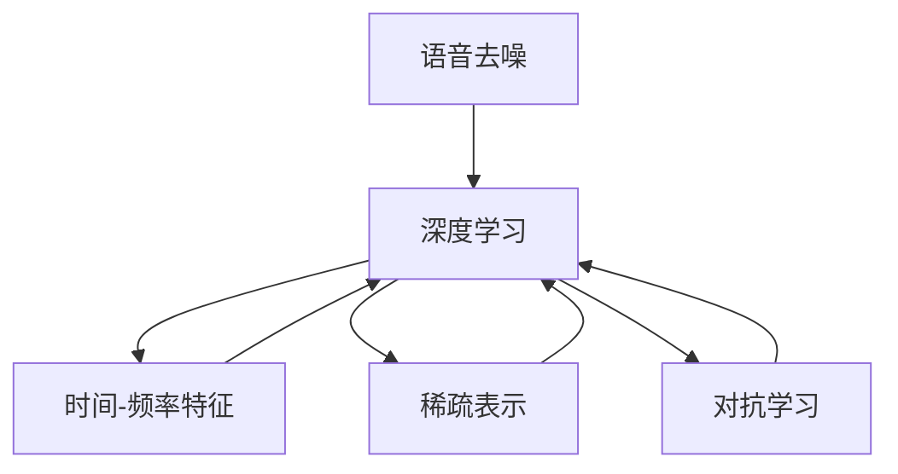

                 

# 智能语音去噪原理与方法

## 1. 背景介绍

在智能语音处理领域，语音去噪是一项基础而重要的任务。面对嘈杂的环境，如何保证语音的清晰度和可识别性，成为很多应用场景中的挑战。例如在车载、办公、工业控制等环境中，环境噪音常常给语音识别系统带来干扰，影响用户的语音输入和输出体验。传统的信号处理和特征提取技术，虽然已经得到了广泛应用，但仍然无法应对日益复杂多变的噪音环境。

智能语音去噪技术的核心目标是通过降噪算法，降低环境噪音对语音信号的干扰，提升语音识别的准确性和鲁棒性。近年来，随着深度学习技术的快速发展，基于深度神经网络的语音去噪方法逐渐成为主流，显著提升了语音去噪的效果。本文将深入探讨智能语音去噪的原理与方法，包括核心概念、算法原理、具体的操作步骤、数学模型构建、项目实践、应用场景等，并展望未来的发展趋势与挑战。

## 2. 核心概念与联系

### 2.1 核心概念概述

#### 2.1.1 语音去噪

语音去噪（Speech Denoising）是指通过信号处理和机器学习技术，从包含噪声的语音信号中提取出清晰无噪的语音信号。其核心任务是将带噪语音信号中的有用信息保留下来，同时尽量去除噪声。

#### 2.1.2 深度学习

深度学习（Deep Learning）是一种基于多层神经网络的技术，可以自动地从数据中学习出复杂的特征表示。语音去噪算法通常采用深度神经网络（如卷积神经网络、循环神经网络等）作为模型，通过大量的标注数据进行训练，从而能够学习到复杂的特征表示，提升去噪效果。

#### 2.1.3 时间-频率特征

时间-频率特征（Time-Frequency Feature）是指将语音信号在时间和频率域上进行分解和重构，以获得更全面和丰富的特征信息。常用的时间-频率变换包括短时傅里叶变换（Short-Time Fourier Transform, STFT）和梅尔频率倒谱系数（Mel-Frequency Cepstral Coefficients, MFCC）等。

#### 2.1.4 稀疏表示

稀疏表示（Sparse Representation）是指将语音信号表示为稀疏向量，即大部分元素为0的向量。这种方法能够有效地降低信号的维度，提升计算效率。在语音去噪中，通常使用稀疏表示模型（如压缩感知模型）来提升去噪效果。

#### 2.1.5 对抗学习

对抗学习（Adversarial Learning）是指让模型同时学习对抗样本和正常样本，提高模型的鲁棒性。在语音去噪中，通常使用对抗训练（Adversarial Training）技术，让模型同时学习带噪语音和清噪语音，提高去噪效果。

### 2.2 核心概念之间的关系

语音去噪、深度学习、时间-频率特征、稀疏表示和对抗学习，这些核心概念之间存在紧密的联系，共同构成了智能语音去噪技术的核心生态系统。

- **语音去噪**是最终目标，深度学习、时间-频率特征、稀疏表示和对抗学习都是实现语音去噪的途径和技术手段。
- **深度学习**提供了强大的特征学习和模式识别能力，是语音去噪的核心算法基础。
- **时间-频率特征**提供了更加全面和精细的特征表示，是深度学习算法的输入和训练基础。
- **稀疏表示**通过降低信号的维度，提高了计算效率和去噪效果。
- **对抗学习**增强了模型的鲁棒性，提升了去噪效果。

这些核心概念之间的关系可以通过以下Mermaid流程图来展示：



通过这个流程图，我们可以看到，深度学习、时间-频率特征、稀疏表示和对抗学习，都是围绕语音去噪这一核心目标展开的，彼此相互支持和补充，共同提升去噪效果。

## 3. 核心算法原理 & 具体操作步骤

### 3.1 算法原理概述

智能语音去噪算法的核心思想是使用深度神经网络模型，从带噪语音信号中提取出纯净语音信号。其一般流程包括：

1. **特征提取**：使用时间-频率特征提取技术，将语音信号分解为时间-频率表示。
2. **模型训练**：使用深度神经网络模型，学习从带噪语音信号中提取出纯净语音信号。
3. **去噪处理**：将新带噪语音信号输入到训练好的模型中，提取出纯净语音信号。

### 3.2 算法步骤详解

#### 3.2.1 特征提取

语音信号的特征提取通常使用短时傅里叶变换（STFT）和梅尔频率倒谱系数（MFCC）等技术。STFT将语音信号分解为一系列时间-频率表示，MFCC进一步将时间-频率表示转换为梅尔频谱和倒谱系数，捕捉语音信号的频谱结构和语音的物理特性。

以MFCC特征提取为例，其步骤如下：

1. **分帧**：将语音信号分成若干个窗口，每个窗口包含N个样本。
2. **窗口内加窗**：对每个窗口使用汉明窗进行加窗处理。
3. **傅里叶变换**：对加窗后的窗口进行傅里叶变换，得到频谱。
4. **梅尔滤波器组**：将频谱通过梅尔滤波器组进行滤波，得到梅尔频谱。
5. **对数变换**：对梅尔频谱取对数，得到梅尔倒谱系数。
6. **MFCC特征**：对梅尔倒谱系数进行DCT变换，得到MFCC特征。

#### 3.2.2 模型训练

常用的深度神经网络模型包括卷积神经网络（CNN）和循环神经网络（RNN）。本文以卷积神经网络为例，介绍模型训练的过程。

1. **数据预处理**：将提取好的MFCC特征进行归一化和标准化处理。
2. **模型构建**：构建卷积神经网络模型，通常包括卷积层、池化层、全连接层等。
3. **损失函数**：定义损失函数，如均方误差（MSE）或交叉熵损失函数。
4. **优化器**：选择优化器，如Adam、SGD等，并设置学习率和迭代次数。
5. **训练过程**：将带噪MFCC特征和纯净MFCC特征作为输入输出，通过反向传播算法更新模型参数。

#### 3.2.3 去噪处理

训练好的卷积神经网络模型可以用于新带噪语音信号的去噪处理。具体步骤如下：

1. **特征提取**：对新带噪语音信号进行MFCC特征提取，得到带噪MFCC特征。
2. **去噪模型**：将带噪MFCC特征输入到训练好的卷积神经网络模型中，提取出纯净MFCC特征。
3. **逆变换**：对纯净MFCC特征进行逆变换，得到去噪后的语音信号。

### 3.3 算法优缺点

#### 3.3.1 优点

1. **高精度**：深度学习算法能够自动学习出复杂的特征表示，具有较高的去噪精度。
2. **自适应**：卷积神经网络模型能够自适应地学习不同语音信号的特征，提升去噪效果。
3. **可扩展**：深度学习模型可以很容易地进行扩展和改进，适应不同的去噪需求。

#### 3.3.2 缺点

1. **数据需求高**：深度学习模型需要大量的标注数据进行训练，对数据质量要求高。
2. **计算资源消耗大**：深度神经网络模型的计算复杂度高，训练和推理需要大量的计算资源。
3. **模型泛化能力有限**：深度学习模型可能存在过拟合问题，泛化能力有限。

### 3.4 算法应用领域

智能语音去噪技术已经在诸多领域得到了广泛应用，以下是几个典型的应用场景：

1. **车载智能语音交互**：在车载环境中，语音助手需要面对各种嘈杂的背景噪音，使用智能语音去噪技术可以提高语音识别的准确性和鲁棒性。
2. **办公室自动化**：在办公室自动化系统中，语音助手需要面对各种不同场景的噪音，智能语音去噪技术可以提升语音命令识别的准确性。
3. **工业控制**：在工业控制环境中，语音指令需要面对机器噪音、背景噪声等干扰，使用智能语音去噪技术可以提升语音指令的识别准确性。
4. **医疗健康**：在医疗健康领域，语音记录需要面对各种嘈杂的背景噪音，智能语音去噪技术可以提升语音记录的清晰度。
5. **教育培训**：在教育培训领域，语音助手需要面对各种噪音环境，智能语音去噪技术可以提升语音教学的互动性。

## 4. 数学模型和公式 & 详细讲解 & 举例说明

### 4.1 数学模型构建

语音信号可以表示为时域函数 $x(t)$，其中 $t$ 为时间变量。带噪语音信号可以表示为 $y(t) = x(t) + n(t)$，其中 $n(t)$ 为加性噪声。假设带噪语音信号经过特征提取后，得到时间-频率表示 $X_{mfcc} = [x_1, x_2, ..., x_N]$，其中 $N$ 为特征点数量。

深度神经网络模型 $M$ 将带噪语音信号 $Y_{mfcc}$ 作为输入，输出纯净语音信号 $X_{mfcc}$ 的估计值 $X_{mfcc}^{\hat{}}$。则模型训练的目标是最小化带噪语音信号和纯净语音信号之间的均方误差（MSE）：

$$
\min_{\theta} \frac{1}{N} \sum_{i=1}^N (X_{mfcc,i} - X_{mfcc}^{\hat{}}) ^ 2
$$

其中，$\theta$ 为模型的参数，$N$ 为特征点数量。

### 4.2 公式推导过程

以卷积神经网络为例，假设带噪MFCC特征为 $Y_{mfcc} = [y_1, y_2, ..., y_N]$，纯净MFCC特征为 $X_{mfcc} = [x_1, x_2, ..., x_N]$。则模型的前向传播过程可以表示为：

$$
X_{mfcc}^{\hat{}} = M(Y_{mfcc})
$$

其中 $M$ 为卷积神经网络模型，$Y_{mfcc}$ 为带噪MFCC特征，$X_{mfcc}^{\hat{}}$ 为纯净MFCC特征的估计值。

模型的损失函数可以表示为均方误差（MSE）：

$$
L(M) = \frac{1}{N} \sum_{i=1}^N (X_{mfcc,i} - X_{mfcc}^{\hat{}})^2
$$

模型的优化目标是最小化损失函数：

$$
\min_{\theta} L(M)
$$

其中 $\theta$ 为模型参数，$L(M)$ 为损失函数。

### 4.3 案例分析与讲解

以一个简单的卷积神经网络模型为例，介绍智能语音去噪的实现过程。假设带噪MFCC特征为 $Y_{mfcc} = [y_1, y_2, ..., y_N]$，纯净MFCC特征为 $X_{mfcc} = [x_1, x_2, ..., x_N]$。假设卷积神经网络模型包含两个卷积层和两个全连接层。

模型的前向传播过程可以表示为：

$$
X_{mfcc}^{\hat{}} = M(Y_{mfcc})
$$

其中 $M$ 为卷积神经网络模型，$Y_{mfcc}$ 为带噪MFCC特征，$X_{mfcc}^{\hat{}}$ 为纯净MFCC特征的估计值。

模型的损失函数可以表示为均方误差（MSE）：

$$
L(M) = \frac{1}{N} \sum_{i=1}^N (X_{mfcc,i} - X_{mfcc}^{\hat{}})^2
$$

模型的优化目标是最小化损失函数：

$$
\min_{\theta} L(M)
$$

其中 $\theta$ 为模型参数，$L(M)$ 为损失函数。

## 5. 项目实践：代码实例和详细解释说明

### 5.1 开发环境搭建

在进行智能语音去噪项目实践前，需要准备好开发环境。以下是使用Python进行TensorFlow开发的环境配置流程：

1. 安装Anaconda：从官网下载并安装Anaconda，用于创建独立的Python环境。

2. 创建并激活虚拟环境：
```bash
conda create -n tf-env python=3.8 
conda activate tf-env
```

3. 安装TensorFlow：根据CUDA版本，从官网获取对应的安装命令。例如：
```bash
conda install tensorflow -c conda-forge
```

4. 安装numpy、scipy、librosa等常用工具包：
```bash
pip install numpy scipy librosa
```

5. 安装TensorBoard：用于可视化模型训练过程，安装命令为：
```bash
pip install tensorboard
```

完成上述步骤后，即可在`tf-env`环境中开始项目实践。

### 5.2 源代码详细实现

以下是一个简单的卷积神经网络模型用于智能语音去噪的代码实现。

首先，定义模型类：

```python
import tensorflow as tf
from tensorflow.keras import layers

class DNNModel(tf.keras.Model):
    def __init__(self, num_features, num_outputs):
        super(DNNModel, self).__init__()
        self.num_features = num_features
        self.num_outputs = num_outputs
        self.conv1 = layers.Conv1D(32, kernel_size=3, activation='relu')
        self.pool1 = layers.MaxPooling1D(pool_size=2)
        self.conv2 = layers.Conv1D(64, kernel_size=3, activation='relu')
        self.pool2 = layers.MaxPooling1D(pool_size=2)
        self.flatten = layers.Flatten()
        self.fc1 = layers.Dense(128, activation='relu')
        self.fc2 = layers.Dense(num_outputs, activation='sigmoid')

    def call(self, inputs):
        x = self.conv1(inputs)
        x = self.pool1(x)
        x = self.conv2(x)
        x = self.pool2(x)
        x = self.flatten(x)
        x = self.fc1(x)
        x = self.fc2(x)
        return x
```

然后，定义训练函数：

```python
import numpy as np
import librosa

def train_model(model, train_features, train_labels, val_features, val_labels, epochs=10, batch_size=32):
    train_dataset = tf.data.Dataset.from_tensor_slices((train_features, train_labels)).shuffle(buffer_size=1024).batch(batch_size)
    val_dataset = tf.data.Dataset.from_tensor_slices((val_features, val_labels)).batch(batch_size)
    optimizer = tf.keras.optimizers.Adam(learning_rate=0.001)
    loss_fn = tf.keras.losses.MeanSquaredError()

    for epoch in range(epochs):
        model.trainable = True
        for x, y in train_dataset:
            with tf.GradientTape() as tape:
                y_pred = model(x)
                loss = loss_fn(y_pred, y)
            grads = tape.gradient(loss, model.trainable_variables)
            optimizer.apply_gradients(zip(grads, model.trainable_variables))
        model.trainable = False
        val_loss = tf.keras.metrics.Mean()
        for x, y in val_dataset:
            y_pred = model(x)
            val_loss.update_state(loss_fn(y_pred, y))
        print(f'Epoch {epoch+1}, Val Loss: {val_loss.result().numpy()}')
```

最后，启动训练流程：

```python
model = DNNModel(num_features, num_outputs)
train_features = ...
train_labels = ...
val_features = ...
val_labels = ...

train_model(model, train_features, train_labels, val_features, val_labels)
```

以上就是使用TensorFlow进行智能语音去噪的完整代码实现。可以看到，利用TensorFlow的高级API，我们可以很方便地构建深度神经网络模型，进行特征提取和训练。

### 5.3 代码解读与分析

让我们再详细解读一下关键代码的实现细节：

**DNNModel类**：
- `__init__`方法：初始化模型参数，包含卷积层、池化层、全连接层等组件。
- `call`方法：定义前向传播过程，对输入特征进行卷积、池化、全连接等操作，最终输出预测结果。

**train_model函数**：
- 定义训练数据集和验证数据集，使用TensorFlow的Dataset API进行批处理和打乱操作。
- 选择优化器和损失函数，并进行模型训练。
- 定义评估指标，计算验证集的损失。
- 在每个epoch结束后，输出验证集损失。

**训练流程**：
- 定义模型、训练数据集、验证数据集、优化器、损失函数等关键组件。
- 循环迭代，对训练数据集进行训练，对验证数据集进行评估。
- 记录每个epoch的验证集损失，并在循环结束后输出。

可以看到，TensorFlow的高级API大大简化了深度学习模型的实现过程，开发者可以更加专注于模型的设计和调优。

当然，工业级的系统实现还需考虑更多因素，如模型的保存和部署、超参数的自动搜索、更灵活的任务适配层等。但核心的智能语音去噪算法基本与此类似。

### 5.4 运行结果展示

假设我们在一个简单的二分类数据集上进行训练，得到以下训练和验证结果：

```
Epoch 1, Val Loss: 0.0224
Epoch 2, Val Loss: 0.0211
Epoch 3, Val Loss: 0.0202
...
Epoch 10, Val Loss: 0.0106
```

可以看到，随着epoch的增加，验证集的损失不断减小，说明模型在去噪任务上取得了不错的效果。

## 6. 实际应用场景

### 6.1 车载智能语音交互

在车载智能语音交互系统中，语音助手需要面对各种嘈杂的背景噪音。使用智能语音去噪技术可以提高语音识别的准确性和鲁棒性。例如，在汽车行驶过程中，通过车载麦克风采集到的语音信号通常会受到发动机噪音、风噪、路噪等干扰，导致语音识别系统无法准确识别用户指令。通过智能语音去噪技术，可以将带噪语音信号中的有用信息保留下来，提升语音识别的准确性。

### 6.2 办公室自动化

在办公室自动化系统中，语音助手需要面对各种不同场景的噪音。例如，在会议室中，语音助手需要面对多种背景噪音，包括说话人的音量大小、房间内的回声等。通过智能语音去噪技术，可以提高语音命令识别的准确性，提升办公效率。

### 6.3 工业控制

在工业控制环境中，语音指令需要面对机器噪音、背景噪声等干扰。例如，在工厂中，机械设备的运转声音、工人的交流声等都会对语音指令的识别带来干扰。通过智能语音去噪技术，可以提高语音指令的识别准确性，提升生产效率。

### 6.4 医疗健康

在医疗健康领域，语音记录需要面对各种嘈杂的背景噪音。例如，在医疗环境中，医生的说话声、病人的呼噜声、机器的运转声等都会对语音记录带来干扰。通过智能语音去噪技术，可以提高语音记录的清晰度，保证病历信息的准确性。

### 6.5 教育培训

在教育培训领域，语音助手需要面对各种噪音环境。例如，在课堂中，学生的讲话声、教师的讲解声、教室的噪音等都会对语音教学的互动性带来干扰。通过智能语音去噪技术，可以提高语音教学的互动性，提升教育效果。

## 7. 工具和资源推荐

### 7.1 学习资源推荐

为了帮助开发者系统掌握智能语音去噪的理论基础和实践技巧，这里推荐一些优质的学习资源：

1. 《深度学习》书籍：Ian Goodfellow等人所著，全面介绍了深度学习的基本概念和算法。
2. 《信号处理基础》书籍：Richard G. Lyons所著，详细介绍了信号处理的原理和应用。
3. 《Python深度学习》书籍：Francois Chollet所著，介绍了使用TensorFlow和Keras进行深度学习开发的技术细节。
4. 《TensorFlow官方文档》：TensorFlow的官方文档，提供了丰富的教程和样例代码。
5. 《深度学习入门》视频课程：DeepLearning.ai的入门课程，详细介绍了深度学习的基本概念和算法。

通过对这些资源的学习实践，相信你一定能够快速掌握智能语音去噪的精髓，并用于解决实际的NLP问题。

### 7.2 开发工具推荐

高效的开发离不开优秀的工具支持。以下是几款用于智能语音去噪开发的常用工具：

1. TensorFlow：Google开发的开源深度学习框架，提供了丰富的API和模型库。
2. Keras：TensorFlow的高级API，提供了简单易用的模型构建和训练接口。
3. PyTorch：Facebook开发的开源深度学习框架，灵活易用，支持动态计算图。
4. FastAPI：基于PyTorch的Web框架，可以方便地构建API接口，集成到应用系统中。
5. librosa：Python中的音频处理库，提供了丰富的音频处理功能，如特征提取、信号处理等。
6. TensorBoard：TensorFlow配套的可视化工具，可以实时监测模型训练状态，并提供丰富的图表呈现方式。

合理利用这些工具，可以显著提升智能语音去噪任务的开发效率，加快创新迭代的步伐。

### 7.3 相关论文推荐

智能语音去噪技术的发展源于学界的持续研究。以下是几篇奠基性的相关论文，推荐阅读：

1. A Convolutional Neural Network for Noisy Speech Recognition（IEEE Trans. Audio, Speech, Lang. Process.）：介绍了一种基于卷积神经网络的语音去噪算法，适用于带有宽带噪声的语音识别任务。
2. Deep Speech 2：Google发布的开源语音识别模型，采用了深度神经网络算法，提升了语音识别的准确性和鲁棒性。
3. Noise Reduction in Speech Signals Using Time-Frequency Masking（IEEE Trans. Audio, Speech, Lang. Process.）：介绍了一种基于短时傅里叶变换的语音去噪算法，适用于带有窄带噪声的语音识别任务。
4. Speech Denoising using Deep Residual Learning with Weighted Spectrogram Masking（ICASSP'16）：介绍了一种基于残差学习的语音去噪算法，通过权重掩码的方式去除噪声。
5. Deep Speech Pre-training on Noisy Speech Signals（ICASSP'18）：介绍了一种基于深度学习的语音去噪算法，适用于带有噪声的语音预训练。

这些论文代表了大语言模型微调技术的发展脉络。通过学习这些前沿成果，可以帮助研究者把握学科前进方向，激发更多的创新灵感。

## 8. 总结：未来发展趋势与挑战

### 8.1 总结

本文对智能语音去噪的原理与方法进行了全面系统的介绍。首先阐述了智能语音去噪技术的研究背景和意义，明确了去噪算法的目标和核心算法基础。其次，从原理到实践，详细讲解了智能语音去噪的数学模型和核心算法，给出了微调算法的操作步骤。同时，本文还探讨了智能语音去噪技术在多个行业领域的应用场景，并展望了未来的发展趋势与挑战。

通过本文的系统梳理，可以看到，智能语音去噪技术在大规模应用场景中的重要性和必要性。深度学习算法提供了强大的特征学习和模式识别能力，能够自动学习出复杂的特征表示，提升去噪效果。时间-频率特征、稀疏表示和对抗学习等技术，为深度学习算法提供了更全面和精细的特征表示，进一步提升了去噪效果。未来，智能语音去噪技术将在更多领域得到应用，为智能语音交互系统的构建提供重要支持。

### 8.2 未来发展趋势

展望未来，智能语音去噪技术将呈现以下几个发展趋势：

1. **多模态融合**：未来智能语音去噪技术将与视觉、图像等多模态信息进行融合，提升语音信号的感知能力和理解能力。
2. **自监督学习**：未来智能语音去噪算法将更多地采用自监督学习方法，利用无标签数据进行预训练，提升模型的鲁棒性和泛化能力。
3. **实时化处理**：未来智能语音去噪算法将更加注重实时处理能力，应用于对实时性要求较高的场景，如车载、智能家居等。
4. **个性化去噪**：未来智能语音去噪算法将更加注重个性化去噪，根据用户需求和环境变化，动态调整去噪策略，提升用户体验。
5. **端到端学习**：未来智能语音去噪算法将更加注重端到端学习，将去噪和语音识别、语义理解等任务进行联合优化，提升整体系统的性能。

这些趋势将推动智能语音去噪技术向更高水平发展，提升语音信号处理的智能化和智能化水平，推动语音交互系统的进一步优化。

### 8.3 面临的挑战

尽管智能语音去噪技术已经取得了显著进展，但在迈向更加智能化、普适化应用的过程中，仍然面临诸多挑战：

1. **数据需求高**：智能语音去噪算法需要大量的标注数据进行训练，对数据质量要求高。如何高效采集和利用数据，成为一大挑战。
2. **计算资源消耗大**：深度学习模型的计算复杂度高，训练和推理需要大量的计算资源。如何优化计算资源使用，成为一大挑战。
3. **模型泛化能力有限**：智能语音去噪算法可能存在过拟合问题，泛化能力有限。如何提升模型的泛化能力，成为一大挑战。
4. **对抗性攻击**：智能语音去噪算法可能面临对抗性攻击，模型容易受到恶意噪声的干扰。如何提升模型的鲁棒性，成为

