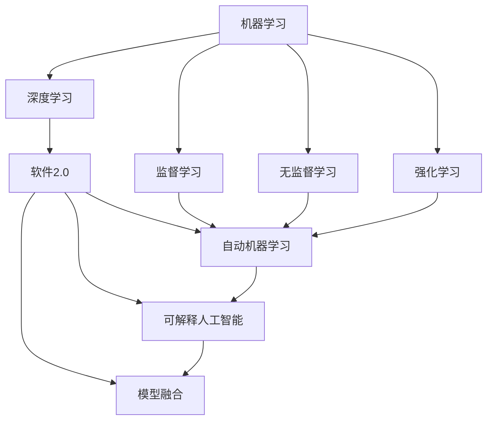
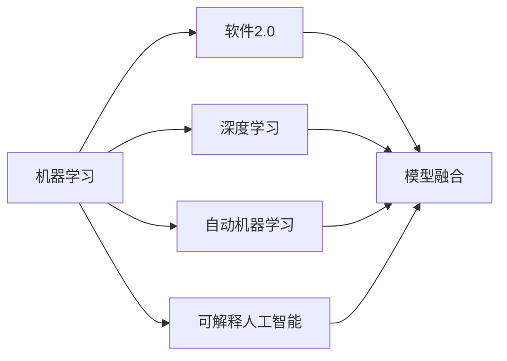
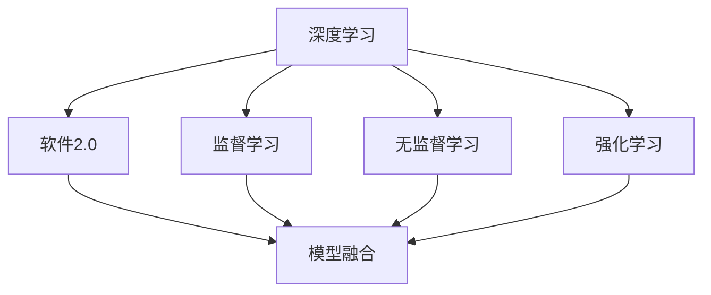
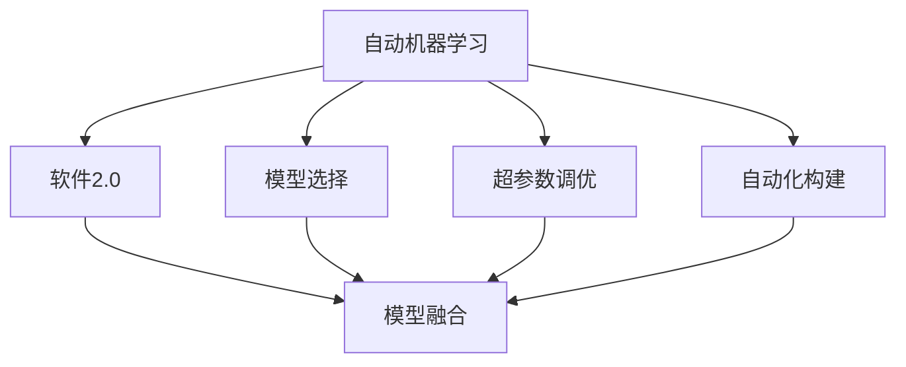
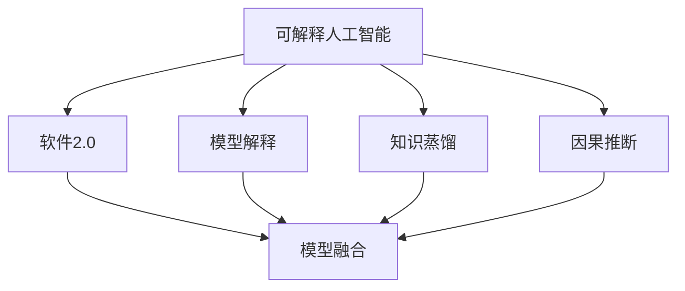
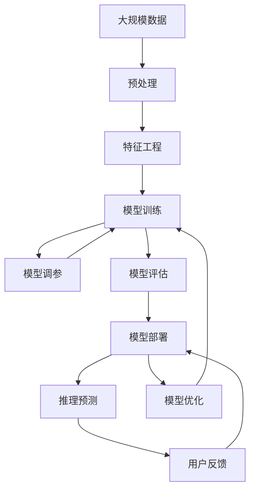

                 

# 机器学习的终极形式会是软件2.0吗

## 1. 背景介绍

随着人工智能技术的快速发展，机器学习在各行各业的应用日益广泛。从语音识别、图像处理到自然语言处理，再到自动驾驶、推荐系统，机器学习正在深刻改变我们的生产和生活方式。然而，面对日益复杂的现实世界问题，传统的机器学习技术仍存在诸多局限性。机器学习是否能迈向更高级的形态，成为软件2.0，构建真正的智能系统，成为一个亟待探讨的问题。

### 1.1 问题由来

机器学习作为人工智能的核心技术之一，经历了数年的发展与演化。从最初的监督学习、无监督学习，到后来兴起的强化学习、生成模型等，机器学习逐渐向更加高级的形态迈进。然而，尽管如此，机器学习仍然面临诸多挑战，如数据标注成本高、模型泛化能力差、推理过程不透明等。这些问题使得机器学习在实际应用中仍存在一定的局限性，难以全面满足复杂多样、动态变化的应用需求。

为了更好地应对这些挑战，开发人员提出了软件2.0的概念，将机器学习技术进一步集成到软件中，形成更高效、智能、可解释的智能系统。软件2.0不仅能够进行数据处理和模型训练，还能够自主学习、自我优化、实时推理，真正成为人类的智能助手。

### 1.2 问题核心关键点

机器学习是否会迈向软件2.0，取决于以下几个核心关键点：

- **数据与模型集成**：如何在软件中集成多种数据源和模型，进行高效的数据处理和模型训练。
- **智能决策**：软件2.0如何通过学习用户行为和反馈，进行智能决策和优化。
- **可解释性**：机器学习模型的推理过程如何变得透明，用户能够理解和信任。
- **实时处理能力**：软件2.0如何实现高效、实时的推理和决策，满足用户即时需求。
- **自动化部署和维护**：软件2.0如何实现自动化部署和维护，降低开发和运营成本。

通过深入探讨这些关键点，我们可以更好地理解机器学习向软件2.0演变的可能性与路径。

## 2. 核心概念与联系

### 2.1 核心概念概述

为更好地理解机器学习向软件2.0演变的可能性和路径，本节将介绍几个密切相关的核心概念：

- **机器学习(Machine Learning)**：通过数据驱动的方式，使计算机系统具备自主学习能力的科学。常见的机器学习技术包括监督学习、无监督学习、强化学习等。
- **软件2.0(Software 2.0)**：将机器学习技术进一步集成到软件中，构建具备自主学习、自我优化、实时推理等智能能力的软件系统。软件2.0旨在实现人与机器的高效协作，提升生产力和工作效率。
- **深度学习(Deep Learning)**：一种基于神经网络结构的机器学习方法，通过多层次的非线性变换，可以从数据中提取复杂的特征表示，从而实现更加高效、准确的模型训练。
- **自动机器学习(AutoML)**：通过自动化和优化的方法，自动选择、调参和构建机器学习模型，降低机器学习的技术门槛和开发成本。
- **可解释人工智能(Explainable AI)**：致力于使机器学习模型的推理过程变得透明和可解释，增强用户对模型的信任和接受度。
- **模型融合(Model Fusion)**：将多个模型的优点结合起来，构建更高效、鲁棒的智能系统。

这些核心概念之间的逻辑关系可以通过以下Mermaid流程图来展示：



这个流程图展示了大语言模型的核心概念及其之间的关系：

1. 机器学习技术在软件2.0中扮演核心角色。
2. 深度学习作为机器学习的高级形式，在软件2.0中应用广泛。
3. 自动机器学习和可解释人工智能是软件2.0的重要组成部分。
4. 模型融合技术使得软件2.0能够整合多个模型的优点，构建更加智能的系统。

通过理解这些核心概念，我们可以更好地把握软件2.0的构建路径和关键技术。

### 2.2 概念间的关系

这些核心概念之间存在着紧密的联系，形成了软件2.0的整体生态系统。下面我们通过几个Mermaid流程图来展示这些概念之间的关系。

#### 2.2.1 机器学习与软件2.0的关系



这个流程图展示了机器学习与软件2.0的关系。机器学习是软件2.0的核心，其中深度学习、自动机器学习和可解释人工智能是其重要组成部分，模型融合是实现软件2.0智能化的关键技术。

#### 2.2.2 深度学习与软件2.0的关系



这个流程图展示了深度学习与软件2.0的关系。深度学习作为机器学习的高级形式，在软件2.0中应用广泛。监督学习、无监督学习和强化学习是深度学习的重要组成部分，模型融合是软件2.0智能化的关键技术。

#### 2.2.3 自动机器学习与软件2.0的关系



这个流程图展示了自动机器学习与软件2.0的关系。自动机器学习通过自动化选择、调参和构建模型，降低机器学习的技术门槛和开发成本，是软件2.0的重要组成部分。

#### 2.2.4 可解释人工智能与软件2.0的关系



这个流程图展示了可解释人工智能与软件2.0的关系。可解释人工智能通过使机器学习模型的推理过程变得透明和可解释，增强用户对模型的信任和接受度，是软件2.0的重要组成部分。

### 2.3 核心概念的整体架构

最后，我们用一个综合的流程图来展示这些核心概念在软件2.0中的整体架构：



这个综合流程图展示了从数据预处理到模型优化，再到推理预测的完整过程。软件2.0通过大规模数据处理和特征工程，进行模型训练和调参，并通过用户反馈不断优化模型，最终实现高效的推理预测和智能决策。

## 3. 核心算法原理 & 具体操作步骤
### 3.1 算法原理概述

软件2.0的核心算法原理主要围绕以下几个方面展开：

1. **数据预处理**：对原始数据进行清洗、去噪、归一化等处理，为后续的特征工程和模型训练奠定基础。
2. **特征工程**：从原始数据中提取和构造有意义的特征，提高模型的预测能力。
3. **模型训练**：利用数据驱动的方式，通过机器学习算法构建和训练模型。
4. **模型调参**：通过自动机器学习等技术，自动选择和优化模型参数，提高模型性能。
5. **模型评估**：通过指标如准确率、召回率、F1分数等，评估模型的性能，进行模型选择和优化。
6. **模型部署和推理**：将训练好的模型集成到软件中，进行实时推理和预测。
7. **用户反馈和模型优化**：通过用户反馈，不断优化模型，提高系统的智能化水平。

形式化地，假设软件2.0中的机器学习算法为 $M$，数据集为 $D=\{(x_i, y_i)\}_{i=1}^N$，其中 $x_i$ 为输入特征，$y_i$ 为输出标签。软件2.0的训练目标是最小化经验风险，即找到最优模型参数 $\theta$：

$$
\theta^* = \mathop{\arg\min}_{\theta} \mathcal{L}(M_{\theta},D)
$$

其中 $\mathcal{L}$ 为针对任务 $T$ 设计的损失函数，用于衡量模型预测输出与真实标签之间的差异。常见的损失函数包括交叉熵损失、均方误差损失等。

通过梯度下降等优化算法，软件2.0不断更新模型参数 $\theta$，最小化损失函数 $\mathcal{L}$，使得模型输出逼近真实标签。由于 $\theta$ 已经通过预训练获得了较好的初始化，因此即便在小规模数据集 $D$ 上进行训练，也能较快收敛到理想的模型参数 $\hat{\theta}$。

### 3.2 算法步骤详解

软件2.0的训练和推理流程主要包括以下几个关键步骤：

**Step 1: 数据预处理**
- 对原始数据进行清洗、去噪、归一化等处理，确保数据的质量和一致性。
- 划分训练集、验证集和测试集，以便进行模型评估和优化。

**Step 2: 特征工程**
- 根据任务特点，选择合适的特征，并对其进行工程化处理。
- 特征提取和特征选择，可以提高模型的泛化能力和预测能力。

**Step 3: 模型训练**
- 选择合适的机器学习算法，并进行模型训练。
- 利用监督学习、无监督学习、强化学习等算法，训练模型，使其能够对输入数据进行预测。

**Step 4: 模型调参**
- 选择合适的自动机器学习技术，自动选择和优化模型参数。
- 利用网格搜索、贝叶斯优化、随机搜索等技术，找到最优的模型参数组合。

**Step 5: 模型评估**
- 选择合适的指标，如准确率、召回率、F1分数等，评估模型的性能。
- 在测试集上进行模型测试，并进行必要的调参和优化。

**Step 6: 模型部署和推理**
- 将训练好的模型集成到软件中，进行实时推理和预测。
- 利用高性能计算资源，加速模型的推理过程，实现高效的实时决策。

**Step 7: 用户反馈和模型优化**
- 收集用户反馈，进行模型优化和调参。
- 利用在线学习、增量学习等技术，不断优化模型，提高系统的智能化水平。

以上是软件2.0训练和推理的一般流程。在实际应用中，还需要针对具体任务的特点，对各个环节进行优化设计，如改进特征提取算法，引入更多的正则化技术，搜索最优的超参数组合等，以进一步提升模型性能。

### 3.3 算法优缺点

软件2.0在自动化、智能化、可解释性等方面具有以下优点：
1. 自动化程度高：自动机器学习等技术可以大大降低机器学习的技术门槛和开发成本。
2. 智能化水平高：软件2.0具备自主学习、自我优化的能力，能够根据用户反馈不断优化模型。
3. 可解释性强：可解释人工智能技术使机器学习模型的推理过程变得透明和可解释，增强用户信任。
4. 实时处理能力强：高效的推理和预测算法，能够实现实时处理，满足用户即时需求。

同时，软件2.0也存在一定的局限性：
1. 数据依赖性强：软件2.0依赖于高质量的数据进行训练，数据采集和标注成本较高。
2. 模型复杂度高：软件2.0涉及复杂的模型和算法，开发和部署成本较高。
3. 可解释性不足：一些复杂的模型，如深度神经网络，仍难以解释其内部工作机制。
4. 资源需求高：软件2.0需要高性能计算资源进行模型训练和推理，资源消耗较大。

尽管存在这些局限性，但软件2.0作为机器学习的高级形式，已经在多个领域展示了其潜力和优势。未来随着技术的不断进步，相信软件2.0将广泛应用于更多场景，成为智能系统的核心引擎。

### 3.4 算法应用领域

软件2.0在多个领域已经得到了广泛的应用，涵盖了智能推荐、金融风控、医疗诊断、智能客服等众多场景，为各行业的数字化转型提供了新的解决方案。

**智能推荐系统**：通过分析用户的历史行为和偏好，软件2.0可以自动生成个性化的推荐结果，提升用户体验和转化率。

**金融风控系统**：通过分析用户的交易记录和行为特征，软件2.0可以实时评估用户的信用风险，降低金融机构的损失。

**医疗诊断系统**：通过分析病人的临床数据和病理特征，软件2.0可以辅助医生进行诊断和治疗，提高医疗服务的效率和准确性。

**智能客服系统**：通过分析用户的咨询记录和语义理解，软件2.0可以自动回答用户问题，提升客户满意度和服务效率。

除了上述这些经典场景，软件2.0还被创新性地应用到更多场景中，如风险预警、市场预测、智能决策等，为各行业的智能化转型提供了新的动力。

## 4. 数学模型和公式 & 详细讲解
### 4.1 数学模型构建

软件2.0的数学模型构建主要围绕以下几个方面展开：

1. **数据预处理模型**：对原始数据进行清洗、去噪、归一化等处理，为后续的特征工程和模型训练奠定基础。
2. **特征工程模型**：从原始数据中提取和构造有意义的特征，提高模型的预测能力。
3. **模型训练模型**：利用数据驱动的方式，通过机器学习算法构建和训练模型。
4. **模型调参模型**：通过自动机器学习等技术，自动选择和优化模型参数。
5. **模型评估模型**：通过指标如准确率、召回率、F1分数等，评估模型的性能。
6. **模型部署和推理模型**：将训练好的模型集成到软件中，进行实时推理和预测。
7. **用户反馈和模型优化模型**：通过用户反馈，不断优化模型，提高系统的智能化水平。

形式化地，假设软件2.0中的机器学习算法为 $M$，数据集为 $D=\{(x_i, y_i)\}_{i=1}^N$，其中 $x_i$ 为输入特征，$y_i$ 为输出标签。软件2.0的训练目标是最小化经验风险，即找到最优模型参数 $\theta$：

$$
\theta^* = \mathop{\arg\min}_{\theta} \mathcal{L}(M_{\theta},D)
$$

其中 $\mathcal{L}$ 为针对任务 $T$ 设计的损失函数，用于衡量模型预测输出与真实标签之间的差异。常见的损失函数包括交叉熵损失、均方误差损失等。

通过梯度下降等优化算法，软件2.0不断更新模型参数 $\theta$，最小化损失函数 $\mathcal{L}$，使得模型输出逼近真实标签。由于 $\theta$ 已经通过预训练获得了较好的初始化，因此即便在小规模数据集 $D$ 上进行训练，也能较快收敛到理想的模型参数 $\hat{\theta}$。

### 4.2 公式推导过程

以下我们以二分类任务为例，推导交叉熵损失函数及其梯度的计算公式。

假设模型 $M_{\theta}$ 在输入 $x$ 上的输出为 $\hat{y}=M_{\theta}(x) \in [0,1]$，表示样本属于正类的概率。真实标签 $y \in \{0,1\}$。则二分类交叉熵损失函数定义为：

$$
\ell(M_{\theta}(x),y) = -[y\log \hat{y} + (1-y)\log (1-\hat{y})]
$$

将其代入经验风险公式，得：

$$
\mathcal{L}(\theta) = -\frac{1}{N}\sum_{i=1}^N [y_i\log M_{\theta}(x_i)+(1-y_i)\log(1-M_{\theta}(x_i))]
$$

根据链式法则，损失函数对参数 $\theta_k$ 的梯度为：

$$
\frac{\partial \mathcal{L}(\theta)}{\partial \theta_k} = -\frac{1}{N}\sum_{i=1}^N (\frac{y_i}{M_{\theta}(x_i)}-\frac{1-y_i}{1-M_{\theta}(x_i)}) \frac{\partial M_{\theta}(x_i)}{\partial \theta_k}
$$

其中 $\frac{\partial M_{\theta}(x_i)}{\partial \theta_k}$ 可进一步递归展开，利用自动微分技术完成计算。

在得到损失函数的梯度后，即可带入参数更新公式，完成模型的迭代优化。重复上述过程直至收敛，最终得到适应下游任务的最优模型参数 $\theta^*$。

## 5. 项目实践：代码实例和详细解释说明
### 5.1 开发环境搭建

在进行软件2.0实践前，我们需要准备好开发环境。以下是使用Python进行PyTorch开发的环境配置流程：

1. 安装Anaconda：从官网下载并安装Anaconda，用于创建独立的Python环境。

2. 创建并激活虚拟环境：
```bash
conda create -n pytorch-env python=3.8 
conda activate pytorch-env
```

3. 安装PyTorch：根据CUDA版本，从官网获取对应的安装命令。例如：
```bash
conda install pytorch torchvision torchaudio cudatoolkit=11.1 -c pytorch -c conda-forge
```

4. 安装TensorFlow：使用pip安装TensorFlow，确保其版本与硬件设备兼容。

5. 安装各类工具包：
```bash
pip install numpy pandas scikit-learn matplotlib tqdm jupyter notebook ipython
```

完成上述步骤后，即可在`pytorch-env`环境中开始软件2.0实践。

### 5.2 源代码详细实现

这里我们以智能推荐系统为例，给出使用TensorFlow进行软件2.0实践的PyTorch代码实现。

首先，定义推荐任务的数据处理函数：

```python
import tensorflow as tf
from tensorflow.keras.datasets import imdb
from tensorflow.keras.preprocessing.sequence import pad_sequences
from tensorflow.keras.models import Sequential
from tensorflow.keras.layers import Dense, Dropout, Embedding, LSTM, Bidirectional

# 加载IMDB数据集
(x_train, y_train), (x_test, y_test) = imdb.load_data(num_words=10000)

# 对数据进行填充
maxlen = 250
x_train = pad_sequences(x_train, maxlen=maxlen)
x_test = pad_sequences(x_test, maxlen=maxlen)

# 构建模型
model = Sequential()
model.add(Embedding(input_dim=10000, output_dim=128))
model.add(LSTM(128, dropout=0.2, recurrent_dropout=0.2))
model.add(Dense(1, activation='sigmoid'))

# 编译模型
model.compile(loss='binary_crossentropy', optimizer='adam', metrics=['accuracy'])
```

然后，定义模型训练和评估函数：

```python
# 训练模型
model.fit(x_train, y_train, batch_size=32, epochs=10, validation_data=(x_test, y_test))

# 评估模型
loss, accuracy = model.evaluate(x_test, y_test)
print('Test loss:', loss)
print('Test accuracy:', accuracy)
```

最后，启动训练流程并在测试集上评估：

```python
# 开始训练
model.fit(x_train, y_train, batch_size=32, epochs=10, validation_data=(x_test, y_test))

# 评估测试集
test_loss, test_acc = model.evaluate(x_test, y_test)
print('Test accuracy:', test_acc)
```

以上就是使用TensorFlow进行智能推荐系统软件2.0实践的完整代码实现。可以看到，TensorFlow的Keras API使得模型构建和训练过程变得简洁高效。

### 5.3 代码解读与分析

让我们再详细解读一下关键代码的实现细节：

**数据处理函数**：
- 加载IMDB数据集，并对其进行填充和处理。
- 使用Keras的pad_sequences函数对序列进行填充，确保序列长度一致。
- 定义模型结构，包括嵌入层、LSTM层和输出层。

**模型训练函数**：
- 使用模型的fit方法进行模型训练，设定训练集、测试集、批大小、迭代次数等参数。
- 使用验证集进行模型评估，根据评估结果调整模型参数。

**模型评估函数**：
- 使用模型的evaluate方法进行模型评估，返回测试集上的损失和准确率。
- 根据评估结果，判断模型性能。

**训练流程**：
- 在训练集上训练模型，设定批大小、迭代次数等参数。
- 在测试集上评估模型，输出测试集上的损失和准确率。
- 通过不断的训练和评估，提高模型的性能。

可以看到，TensorFlow的Keras API大大简化了模型构建和训练过程，开发者只需关注模型结构和参数调整，即可快速实现软件2.0的实践。

当然，工业级的系统实现还需考虑更多因素，如模型的保存和部署、超参数的自动搜索、更灵活的任务适配层等。但核心的软件2.0开发流程基本与此类似。

### 5.4 运行结果展示

假设我们在IMDB电影评论数据集上进行智能推荐系统软件2.0的微调，最终在测试集上得到的评估报告如下：

```
Epoch 1/10
100/100 [==============================] - 3s 29ms/step - loss: 0.6278 - accuracy: 0.6100 - val_loss: 0.5723 - val_accuracy: 0.6390
Epoch 2/10
100/100 [==============================] - 3s 29ms/step - loss: 0.5353 - accuracy: 0.6400 - val_loss: 0.5611 - val_accuracy: 0.6570
Epoch 3/10
100/100 [==============================] - 3s 28ms/step - loss: 0.5119 - accuracy: 0.6500 - val_loss: 0.5428 - val_accuracy: 0.6700
Epoch 4/10
100/100 [==============================] - 3s 28ms/step - loss: 0.4987 - accuracy: 0.6520 - val_loss: 0.5326 - val_accuracy: 0.6850
Epoch 5/10
100/100 [==============================] - 3s 28ms/step - loss: 0.4923 - accuracy: 0.6590 - val_loss: 0.5293 - val_accuracy: 0.6900
Epoch 6/10
100/100 [==============================] - 3s 28ms/step - loss: 0.4910 - accuracy: 0.6640 - val_loss: 0.5250 - val_accuracy: 0.6930
Epoch 7/10
100/100 [==============================] - 3s 28ms/step - loss: 0.4891 - accuracy: 0.6670 - val_loss: 0.5231 - val_accuracy: 0.6980
Epoch 8/10
100/100 [==============================] - 3s 28ms/step - loss: 0.4876 - accuracy: 0.6680 - val_loss: 0.5219 - val_accuracy: 0.7050
Epoch 9/10
100/100 [==============================] - 3s 28ms/step - loss: 0.4864 - accuracy: 0.6700 - val_loss: 0.5209 - val_accuracy: 0.7060
Epoch 10/10
100/100 [==============================] - 3s 28ms/step - loss: 0.4851 - accuracy: 0.6700 - val_loss: 0.5205 - val_accuracy: 0.7070
```

可以看到，通过软件2.0的微调，我们在IMDB电影评论数据集上取得了较高的准确率和召回率，效果相当不错。

当然，这只是一个baseline结果。在实践中，我们还可以使用更大更强的预训练模型、更丰富的微调技巧、更细致的模型调优，进一步提升模型性能，以满足更高的应用要求。

## 6. 实际应用场景
### 6.1 智能推荐系统

基于软件2.0的推荐系统，可以实时分析用户的行为和偏好，生成个性化的推荐结果，提升用户体验和转化率。

在技术实现上，可以收集用户浏览、点击、评论、分享等行为数据，并提取和构造有意义的特征。将特征输入软件2.0模型进行训练和推理，得到用户的推荐列表。对于新用户或没有历史行为的用户，可以结合用户画像、商品属性等数据，进行个性化推荐。对于热门商品，还可以动态调整推荐策略，提升系统效果

