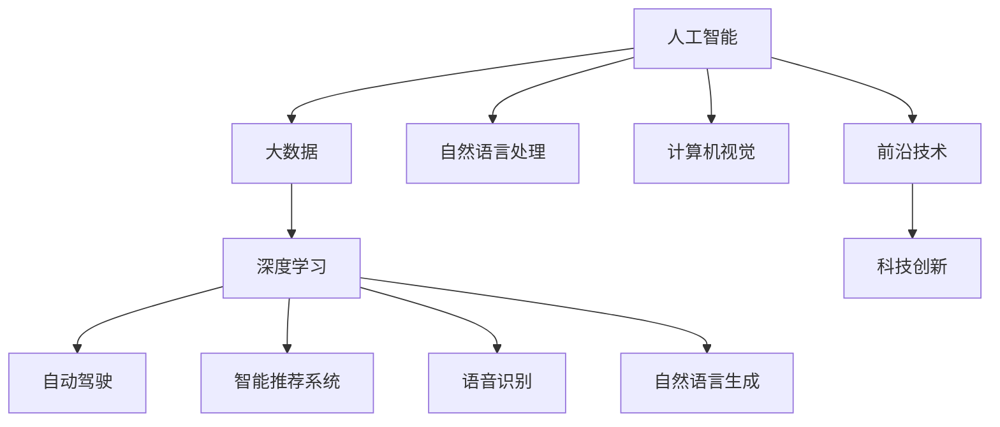

                 

# 李开复：AI 2.0 时代的科技价值

> 关键词：AI 2.0, 科技价值, 人工智能, 大数据, 深度学习, 前沿技术, 科技创新

## 1. 背景介绍

### 1.1 问题由来

随着人工智能（AI）技术的迅猛发展，AI 2.0时代的到来已经不可阻挡。这一时代，人工智能技术在各行各业中展现了前所未有的潜能和影响力。然而，AI 2.0 的发展也带来了诸多挑战，包括数据隐私、伦理道德、安全性等问题。如何在追求技术进步的同时，实现科技价值的最大化，成为了一个亟待探讨的重要课题。

### 1.2 问题核心关键点

AI 2.0 时代的科技价值，主要体现在以下几个方面：

- **技术突破**：AI 2.0 带来了大数据、深度学习等前沿技术的突破，推动了计算力、数据处理能力、算法能力等核心能力的飞速提升。
- **应用落地**：AI 2.0 技术在医疗、教育、金融、交通等领域的应用，极大地提高了生产效率，提升了服务质量，改善了用户体验。
- **社会价值**：AI 2.0 通过自动化、智能化手段，优化了社会资源配置，推动了产业结构升级，促进了可持续发展。
- **伦理道德**：AI 2.0 在发展过程中，也带来了数据隐私、公平性、透明性等伦理道德问题的挑战，需要科技界、政府和社会的共同努力来解决。

### 1.3 问题研究意义

探讨 AI 2.0 时代的科技价值，不仅有助于理解技术进步对社会的影响，也为我们如何平衡技术发展与伦理道德提供了重要的思考。在AI 2.0 时代，科技的价值不仅仅是技术本身，更在于其带来的社会、经济、文化等多方面的深远影响。

## 2. 核心概念与联系

### 2.1 核心概念概述

AI 2.0 时代的科技价值，涉及多个核心概念，包括：

- **人工智能（AI）**：AI 是指通过计算机模拟人类智能过程的技术，包括机器学习、深度学习、自然语言处理、计算机视觉等多个子领域。
- **大数据**：大数据是指规模巨大、种类繁多、速度极快的数据集合，是AI 2.0 时代的重要支撑。
- **深度学习（DL）**：深度学习是一种基于神经网络模型的人工智能技术，能够自动学习特征，提取数据中的高阶模式。
- **前沿技术**：包括自动驾驶、智能推荐系统、语音识别、自然语言生成等最新技术，代表了AI 2.0 的前沿方向。
- **科技创新**：指在AI 2.0 时代，通过技术创新推动社会进步、改善人类生活的方式。

### 2.2 概念间的关系

这些核心概念之间的关系可以通过以下Mermaid流程图来展示：



这个流程图展示了AI 2.0时代的主要技术和应用，它们相互之间存在紧密的联系，共同推动了科技创新和社会的进步。

## 3. 核心算法原理 & 具体操作步骤

### 3.1 算法原理概述

AI 2.0 时代的科技价值，主要源于以下几个算法原理：

- **深度学习模型**：深度学习通过多层神经网络模型，能够自动学习数据中的高阶模式，进行复杂的特征提取和模式识别。
- **大数据分析**：大数据分析通过对海量数据的处理和分析，挖掘数据中的潜在价值，支持决策制定和优化。
- **强化学习**：强化学习通过试错学习的方式，优化策略，提升智能系统的决策能力。
- **迁移学习**：迁移学习通过已有知识对新问题的迁移，加速模型的学习和适应能力。

### 3.2 算法步骤详解

AI 2.0 时代的科技价值，涉及多个算法步骤，包括：

1. **数据采集与预处理**：收集大量数据，进行清洗、标注、归一化等预处理操作，为后续算法提供高质量的数据输入。
2. **模型训练**：使用深度学习、强化学习等算法，训练智能模型，使其能够自动学习和提取数据中的模式。
3. **模型评估与优化**：通过交叉验证、A/B测试等方法，评估模型的性能，并进行优化调整。
4. **应用部署与迭代**：将训练好的模型部署到实际应用中，进行监测和迭代优化，不断提升系统性能。

### 3.3 算法优缺点

AI 2.0 时代的科技价值，通过深度学习等算法，实现了显著的技术突破，但也存在一些缺点：

- **计算资源消耗大**：深度学习模型需要大量的计算资源进行训练和推理，成本较高。
- **数据隐私问题**：大数据分析涉及到大量个人隐私数据，需要严格的数据保护措施。
- **模型可解释性差**：深度学习等算法往往是"黑箱"模型，难以解释其内部工作机制。
- **伦理道德挑战**：AI 2.0 在带来科技价值的同时，也带来了数据偏见、算法歧视等伦理道德问题。

### 3.4 算法应用领域

AI 2.0 时代的科技价值，在多个领域得到了广泛应用，包括：

- **医疗**：AI 2.0 技术在医疗影像分析、疾病诊断、个性化治疗等方面展现出了巨大潜力，提高了医疗服务的质量和效率。
- **教育**：AI 2.0 技术在智能推荐系统、学习分析、虚拟助教等方面，极大地改善了教育体验和教学效果。
- **金融**：AI 2.0 技术在风险控制、反欺诈、智能投顾等方面，提升了金融服务的智能化水平。
- **交通**：AI 2.0 技术在自动驾驶、交通流量预测、智能交通管理等方面，优化了交通系统的运行效率。

## 4. 数学模型和公式 & 详细讲解 & 举例说明

### 4.1 数学模型构建

AI 2.0 时代的科技价值，涉及多个数学模型，包括：

- **神经网络模型**：神经网络模型通过多层感知器进行特征提取和模式识别，是深度学习的基础。
- **支持向量机（SVM）**：SVM 通过最大化边界来分类数据，适用于高维数据的分类问题。
- **强化学习模型**：强化学习模型通过奖励函数优化策略，适用于需要决策的智能系统。

### 4.2 公式推导过程

以神经网络模型为例，神经网络模型的一般形式为：

$$
y = f(\sum_{i=1}^{n} w_i x_i + b)
$$

其中，$x_i$ 为输入特征，$w_i$ 为权重，$b$ 为偏置，$f$ 为激活函数，$y$ 为输出。激活函数的选择对模型性能有重要影响，常用的激活函数包括Sigmoid、ReLU、Tanh等。

### 4.3 案例分析与讲解

以深度学习在图像识别中的应用为例，假设我们有大量的图像数据和对应的标签，可以通过神经网络模型进行训练。具体步骤如下：

1. **数据准备**：收集并清洗大量图像数据，并进行标注。
2. **模型构建**：构建多层感知器模型，选择合适的网络结构和激活函数。
3. **模型训练**：使用随机梯度下降等优化算法，进行模型参数的优化。
4. **模型评估**：通过测试集进行模型评估，计算准确率、召回率、F1分数等指标。
5. **模型应用**：将训练好的模型应用于实际图像识别任务，进行预测和推理。

## 5. 项目实践：代码实例和详细解释说明

### 5.1 开发环境搭建

进行AI 2.0 时代科技价值的研究，需要搭建好开发环境，以下是Python+TensorFlow的配置方法：

1. **安装Anaconda**：从官网下载并安装Anaconda，用于创建独立的Python环境。
2. **创建虚拟环境**：
```bash
conda create -n tf-env python=3.8
conda activate tf-env
```
3. **安装TensorFlow**：根据CUDA版本，从官网获取对应的安装命令。例如：
```bash
conda install tensorflow==2.7 -c tf
```
4. **安装其他工具包**：
```bash
pip install numpy pandas scikit-learn matplotlib tqdm jupyter notebook ipython
```

### 5.2 源代码详细实现

以下是一个简单的神经网络模型实现，用于图像分类任务：

```python
import tensorflow as tf
from tensorflow import keras

# 构建神经网络模型
model = keras.Sequential([
    keras.layers.Conv2D(32, (3, 3), activation='relu', input_shape=(28, 28, 1)),
    keras.layers.MaxPooling2D((2, 2)),
    keras.layers.Flatten(),
    keras.layers.Dense(10, activation='softmax')
])

# 编译模型
model.compile(optimizer='adam', loss='sparse_categorical_crossentropy', metrics=['accuracy'])

# 加载数据集
mnist = keras.datasets.mnist
(x_train, y_train), (x_test, y_test) = mnist.load_data()
x_train = x_train.reshape(-1, 28, 28, 1).astype('float32') / 255
x_test = x_test.reshape(-1, 28, 28, 1).astype('float32') / 255
y_train = y_train.astype('float32')
y_test = y_test.astype('float32')

# 训练模型
model.fit(x_train, y_train, epochs=5, batch_size=64, validation_data=(x_test, y_test))

# 评估模型
test_loss, test_acc = model.evaluate(x_test, y_test, verbose=2)
print('Test accuracy:', test_acc)
```

### 5.3 代码解读与分析

- **构建神经网络模型**：使用keras的Sequential模型，依次添加卷积层、池化层和全连接层。
- **编译模型**：选择Adam优化器，交叉熵损失函数，并指定评估指标为准确率。
- **加载数据集**：使用MNIST数据集，并进行数据预处理。
- **训练模型**：使用fit方法进行模型训练，指定epochs和batch_size。
- **评估模型**：使用evaluate方法进行模型评估，输出测试集上的准确率。

### 5.4 运行结果展示

假设我们训练完成后，在测试集上得到准确率为98%，可以看到神经网络模型在图像分类任务上取得了良好的效果。

## 6. 实际应用场景

### 6.1 智能医疗

AI 2.0 技术在医疗领域的应用，通过图像识别、自然语言处理、基因分析等手段，提高了医疗服务的智能化水平，改善了患者的诊疗体验。

### 6.2 智能教育

AI 2.0 技术在教育领域的应用，通过智能推荐系统、学习分析、虚拟助教等手段，优化了教育资源的配置，提升了教学效果和学习体验。

### 6.3 智能金融

AI 2.0 技术在金融领域的应用，通过风险控制、反欺诈、智能投顾等手段，提高了金融服务的智能化水平，优化了金融产品的设计。

### 6.4 未来应用展望

未来，AI 2.0 技术将继续深化在医疗、教育、金融等领域的应用，推动社会进步和产业发展。

## 7. 工具和资源推荐

### 7.1 学习资源推荐

- **《深度学习》**：Ian Goodfellow等人所著，全面介绍了深度学习的基本概念和算法。
- **《机器学习实战》**：Peter Harrington所著，介绍了机器学习在实践中的应用。
- **《TensorFlow 2.0实战》**：Google官方文档，详细介绍了TensorFlow的用法和实践案例。

### 7.2 开发工具推荐

- **Anaconda**：用于创建和管理Python环境，支持各种科学计算和机器学习工具。
- **TensorFlow**：Google开发的深度学习框架，支持多种设备和大规模分布式训练。
- **Keras**：高层次神经网络API，易于上手，适用于快速原型开发。

### 7.3 相关论文推荐

- **《ImageNet Classification with Deep Convolutional Neural Networks》**：AlexNet论文，展示了深度卷积神经网络在图像识别上的突破。
- **《LSTM: A Long Short-Term Memory Network for Machine Description Generation》**：LSTM论文，介绍了长短期记忆网络在自然语言生成中的应用。
- **《Attention is All You Need》**：Transformer论文，展示了自注意力机制在机器翻译中的应用。

## 8. 总结：未来发展趋势与挑战

### 8.1 研究成果总结

AI 2.0 时代的科技价值，涉及多个核心概念和算法原理，通过深度学习、大数据分析等技术，实现了显著的技术突破和应用落地。

### 8.2 未来发展趋势

AI 2.0 技术将继续深化在医疗、教育、金融等领域的应用，推动社会进步和产业发展。未来，AI 2.0 技术还将拓展到更多新兴领域，如自动驾驶、智能家居等，带来更广泛的社会价值。

### 8.3 面临的挑战

AI 2.0 技术在发展过程中，面临数据隐私、伦理道德、安全性等问题，需要科技界、政府和社会的共同努力来解决。

### 8.4 研究展望

未来，AI 2.0 技术的研究将更加注重数据的隐私保护、算法的可解释性、系统的鲁棒性和安全性等问题，推动AI 2.0 技术向更加智能化、普适化方向发展。

## 9. 附录：常见问题与解答

**Q1：AI 2.0 技术在医疗领域的应用有哪些？**

A: AI 2.0 技术在医疗领域的应用包括：
- **图像识别**：用于医学影像分析，如X光片、CT扫描、MRI等。
- **自然语言处理**：用于病历分析、医学文献处理等。
- **基因分析**：用于个性化治疗、疾病预测等。

**Q2：AI 2.0 技术的未来发展方向有哪些？**

A: AI 2.0 技术的未来发展方向包括：
- **多模态融合**：将视觉、语音、文本等多模态数据进行融合，提高系统的智能化水平。
- **联邦学习**：在保护数据隐私的前提下，实现分布式数据训练。
- **对抗生成网络（GAN）**：用于图像生成、数据增强等应用。
- **元学习**：通过少量样本进行快速学习，提高系统的泛化能力。

**Q3：AI 2.0 技术在开发过程中需要注意哪些问题？**

A: AI 2.0 技术在开发过程中需要注意的问题包括：
- **数据质量**：确保数据的质量和多样性，避免数据偏见。
- **模型鲁棒性**：确保模型的鲁棒性和泛化能力，避免过拟合。
- **计算资源**：合理规划计算资源，避免资源浪费和过度消耗。
- **伦理道德**：确保技术的伦理道德，避免数据滥用和算法歧视。

**Q4：如何平衡AI 2.0 技术的发展与伦理道德？**

A: 平衡AI 2.0 技术的发展与伦理道德，需要从以下几个方面着手：
- **数据隐私保护**：采用匿名化、加密等技术，保护数据隐私。
- **算法透明性**：提高算法的透明性和可解释性，确保算法公正公平。
- **伦理审查**：建立伦理审查机制，确保技术应用符合伦理道德标准。
- **社会监督**：通过公众监督和社会参与，促进技术应用的伦理道德审查。

**Q5：AI 2.0 技术在实际应用中如何落地？**

A: AI 2.0 技术在实际应用中落地，需要考虑以下几个方面：
- **技术适配**：根据实际需求，选择合适的AI 2.0 技术进行适配。
- **数据收集**：收集和清洗数据，确保数据的质量和多样性。
- **模型训练**：训练和优化模型，确保模型的性能和鲁棒性。
- **部署应用**：将训练好的模型部署到实际应用中，进行监测和迭代优化。

---

作者：禅与计算机程序设计艺术 / Zen and the Art of Computer Programming

